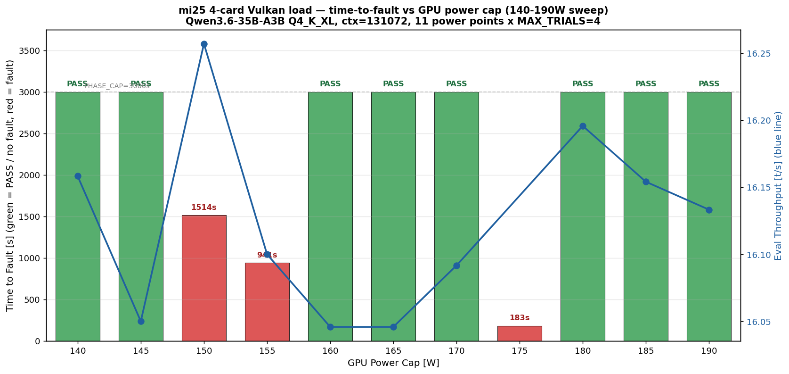

# mi25 4枚 Vulkan 電力スイープ — 140-190W で 3 点フォルト・電力依存性なし

実施日時: 2026年6月25日 19:47 〜 2026年6月26日 04:52 (JST、約 9 時間)

## 添付ファイル

- [実装プラン](attachment/2026-06-26_081718_mi25_4card_load_vulkan_pwr_sweep/plan.md)
- [集計データ表 (data.md)](attachment/2026-06-26_081718_mi25_4card_load_vulkan_pwr_sweep/data.md)
- スクリプト群: [set_power_cap.sh](attachment/2026-06-26_081718_mi25_4card_load_vulkan_pwr_sweep/set_power_cap.sh) / [sweep_one_point.sh](attachment/2026-06-26_081718_mi25_4card_load_vulkan_pwr_sweep/sweep_one_point.sh) / [sweep_loop.sh](attachment/2026-06-26_081718_mi25_4card_load_vulkan_pwr_sweep/sweep_loop.sh) / [make_summary.py](attachment/2026-06-26_081718_mi25_4card_load_vulkan_pwr_sweep/make_summary.py)
- 流用スクリプト: [run_campaign.sh](attachment/2026-06-26_081718_mi25_4card_load_vulkan_pwr_sweep/run_campaign.sh) / [load_driver.py](attachment/2026-06-26_081718_mi25_4card_load_vulkan_pwr_sweep/load_driver.py) / [telemetry.sh](attachment/2026-06-26_081718_mi25_4card_load_vulkan_pwr_sweep/telemetry.sh) / [telemetry_pcie.sh](attachment/2026-06-26_081718_mi25_4card_load_vulkan_pwr_sweep/telemetry_pcie.sh)
- マスターログ: [sweep_master.log](attachment/2026-06-26_081718_mi25_4card_load_vulkan_pwr_sweep/sweep_master.log) / [boot_state.log](attachment/2026-06-26_081718_mi25_4card_load_vulkan_pwr_sweep/boot_state.log)
- 電力点別 trial JSONL: [p190W](attachment/2026-06-26_081718_mi25_4card_load_vulkan_pwr_sweep/trials_vulkan_p190W.jsonl) [p185W](attachment/2026-06-26_081718_mi25_4card_load_vulkan_pwr_sweep/trials_vulkan_p185W.jsonl) [p180W](attachment/2026-06-26_081718_mi25_4card_load_vulkan_pwr_sweep/trials_vulkan_p180W.jsonl) [**p175W**](attachment/2026-06-26_081718_mi25_4card_load_vulkan_pwr_sweep/trials_vulkan_p175W.jsonl) [p170W](attachment/2026-06-26_081718_mi25_4card_load_vulkan_pwr_sweep/trials_vulkan_p170W.jsonl) [p165W](attachment/2026-06-26_081718_mi25_4card_load_vulkan_pwr_sweep/trials_vulkan_p165W.jsonl) [p160W](attachment/2026-06-26_081718_mi25_4card_load_vulkan_pwr_sweep/trials_vulkan_p160W.jsonl) [**p155W**](attachment/2026-06-26_081718_mi25_4card_load_vulkan_pwr_sweep/trials_vulkan_p155W.jsonl) [**p150W**](attachment/2026-06-26_081718_mi25_4card_load_vulkan_pwr_sweep/trials_vulkan_p150W.jsonl) [p145W](attachment/2026-06-26_081718_mi25_4card_load_vulkan_pwr_sweep/trials_vulkan_p145W.jsonl) [p140W](attachment/2026-06-26_081718_mi25_4card_load_vulkan_pwr_sweep/trials_vulkan_p140W.jsonl)
- 電力点別 dmesg/journal/rocm/llama-server: 上記同ディレクトリに `kern_dmesg_pXW.log` / `journal_pXW.txt.gz` / `rocm_pXW_post.txt` / `llama_server_pXW_tail.log` / `telemetry_rocmsmi_pXW.log` / `telemetry_pcie_pXW.log` / `maxpower_pXW.txt` を電力点別に格納
  - ※ `journal_pXW.txt.gz` は GitHub の単一ファイル 100MB 上限を超えるため gzip 圧縮 (展開: `gunzip -k journal_pXW.txt.gz`、直接閲覧: `zless journal_pXW.txt.gz`)

## 核心発見サマリ



[原 Vulkan 4枚負荷レポート (2026-06-25_145006)](2026-06-25_145006_mi25_4card_load_vulkan.md) のフォルト (8820 = SLOT6 = 87:00.0 の `amdgpu_job_timedout → BACO reset → VRAM lost`) が **電力 (= 熱・電流) に依存して救えるか** を、`power1_cap` を 140〜190 W で 5 W 刻み (11 点) にスイープしながら同一負荷 (Vulkan 4 枚、Qwen3.6-35B-A3B Q4_K_XL、ctx=131072、MAX_TRIALS=4 / TRIAL_SEC=720s / PHASE_CAP=3000s) を投入する追試。結論は **「電力では救えない」**。

1. **11 点中 8 点 PASS / 3 点 FAULT、しかも電力に対して非単調**:
   - PASS: 190 / 185 / 180 / 170 / 165 / 160 / 145 / 140 W
   - FAULT: **175 W (t2f=183s)** / **155 W (t2f=941s)** / **150 W (t2f=1515s)**
   - 「電力を下げれば直る」「上げれば壊れる」のどちらも成り立たない。180 W PASS の次の点 175 W で最速発火、170-160 W で 3 連続 PASS の後 155 W で再発、150 W でも発火、145-140 W で再び PASS。
2. **電力 cap が実消費を支配していない**: 通常 (PASS 点) の telemetry rocm-smi は 4 枚最大電力 p95 が **35-39 W** しかなく、cap=140 W に対して 25-28%。スイープ全域で実消費は cap の制約をほとんど受けていない。これが「電力スイープが GPU compute 挙動を変えなかった」最大の理由 — 1 ub=2048 の Vulkan compute は memory-bound で、4 枚分散により per-card power は元から低い。
3. **発火点では p95 power が異常に跳ね上がる**: PASS 点 36-39 W に対し **FAULT 点では p95_max = 175W→105 W / 155W→73 W / 150W→70 W**。これはフォルト発火直前の compute 暴走 (BACO reset 直前の異常スパイク) を示唆。電力制限はこのスパイクを抑え込めていない (短時間スパイクは avg 系の cap で抑えにくい)。
4. **フォルト時のシグネチャが原 Vulkan と異なる新パターン**: 原 Vulkan 4 枚レポートは `amdgpu_job_timedout → GPU reset (BACO) → VRAM lost` (TDR のみ) だったが、**本スイープの 3 フォルト全てが ROCm パターンの `[gfxhub0] no-retry page fault (vmid:4 pasid:32772) ring:88` を先に出してから 60s 後に `amdgpu_job_timedout` → `GPU reset (BACO) → VRAM lost` へ進む** という混合パターン。発火カードは全 3 件で `0000:87:00.0` (= 8820 = SLOT6) と確定 — 原 ROCm / Vulkan 両レポートと一致。
5. **time_to_fault は「同条件の確率分布」**: 175W=183s / 155W=941s / 150W=1515s と電力低下に伴い延びるように見えるが、間に PASS 点を多数挟む非単調挙動から「電力依存」とは言えない。順序効果 (高電力→低電力スイープ進行中の何回目で出るか) と確率的揺らぎの混在と考えるのが整合的。元レポート (160W で 2208s @ 1 ラウンド) とも整合する個体ばらつきの範囲。

**結論**: 8820 フォルトは **電力制限では救えない**。`power1_cap` 設定値を変えても 4 枚分散時の実消費 (~36-39 W/カード平均) は cap によらず低く、cap が compute を絞っていない。**4 枚 64GB 本番運用には 8820 の物理対応 (別スロット移動 or カード交換) が依然必須**。当面は従来通り **ROCm + 3 枚 excl 8820 (48 GB)** を本番、もしくは **Vulkan + 3 枚 incl 8820 (48 GB / eval 高速)** の二者から選択。

## 前提・目的

- **背景**: [原 Vulkan レポート (2026-06-25_145006)](2026-06-25_145006_mi25_4card_load_vulkan.md) で「Vulkan 4 枚負荷 → ~2208s で 8820 が `amdgpu_job_timedout → BACO reset → VRAM lost`」を確定済み。物理層・温度・電力は全期間健全だったため、フォルトが「ハード根本」か「電力 (= 電流・熱・電圧サグ等) で誘発される条件」か未弁別だった。
- **目的**: `/etc/rc.local` で使われている `power1_cap` を **140 W から 190 W まで 5 W 刻みで 11 点スイープ**し、各電力点で同一の Vulkan 4 枚負荷を投入。time-to-fault / anomaly 有無 / 実消費 W / 温度を採取し、電力 — フォルト確率の関係を測定する。
- **前提条件**: mi25 利用可・`gpu-server` ロック取得済。4 枚復旧状態 (GUID 29525 / 33301 / 54068 / 8820、全ポート x16 / AER0) を維持。BIOS 設定 / 電源サイクル合格は前回確定済のため未再実施。NOPASSWD ALL を確認済で `sudo tee /sys/.../power1_cap` を Claude から実行。

## 環境情報

| 項目 | 値 |
|------|-----|
| 機種 | Supermicro SYS-7048GR-TR / X10DRG-Q / BIOS 3.2 |
| CPU | Intel Xeon E5-2620 v3 ×2 |
| OS | Ubuntu 22.04.5 / kernel 5.15.0-181 |
| GPU | MI25 (gfx900) ×4、各 VRAM 16368 MiB、MEM ECC active |
| llama.cpp (Vulkan) | `build-vulkan/` master 追従 (commit `f728adab68...` 系)、`MI25_BACKEND=vulkan` 分岐 |
| モデル | `unsloth/Qwen3.6-35B-A3B-GGUF:UD-Q4_K_XL`、ctx=131072 |
| 起動構成 | `--n-gpu-layers 99 --split-mode layer --flash-attn 1 --poll 0 -b 2048 -ub 2048 --cache-type-{k,v} q8_0` |
| 電力制御 | `/sys/class/drm/cardN/device/hwmon/hwmon*/power1_cap` (μW)、hwmon 番号は動的解決 |
| スイープ仕様 | 190 → 140 W (5 W 刻み, 11 点、高→低)、各点 MAX_TRIALS=4 / MIN_TRIALS=4 / PHASE_CAP_SEC=3000 / TRIAL_SEC=720 |
| 早期打ち切り | 設定なし (全 11 点完走)。run_campaign rc≠0 のみスイープ中断条件 |
| 進行順 | 高 (190W) → 低 (140W) — 既知の発火条件 (160W) から外側へ向かう設計 |

スロット↔BDF↔GUID↔Vulkan/HIP index 対応 (原レポートと同一):

| SLOT | BDF | GUID | Vulkan idx | HIP idx | 状態 |
|---|---|---|---|---|---|
| SLOT2 | 04:00.0 | 29525 | 0 | 0 | safe |
| SLOT4 | 07:00.0 | 33301 | 1 | 1 | safe (旧 villain 復帰) |
| SLOT8 | 84:00.0 | 54068 | 2 | 2 | safe |
| **SLOT6** | **87:00.0** | **8820** | **3** | **3** | **本件フォルト元 (3 回中 3 回ヒット)** |

## 調査詳細

### スイープ結果一覧表

[data.md (full)](attachment/2026-06-26_081718_mi25_4card_load_vulkan_pwr_sweep/data.md) からの抜粋。`fault_sig` / `fault_bdf` 列は PASS 点でも値が入っているが、これは `kern_dmesg_pXW.log` が `dmesg -w` のプロセス切替時に過去のリングバッファ内容を再出力する仕様で前点のフォルトを引きずったノイズ。**真のフォルト判定は `t2f` と `fault_event` 列 (trials JSONL 由来) を見る**。

| W | trials_done | t2f [s] | fault_event | eval [t/s] | pp [t/s] | power_p95_max [W] | power_p95_gpu3 [W] | Tj_max_max [°C] |
|---|---:|---:|---|---:|---:|---:|---:|---:|
| 190 | 4 | — | — | 16.1 | 830.9 | 38.5 | 35.5 | 54 |
| 185 | 4 | — | — | 16.2 | 834.7 | 38.0 | 35.3 | 57 |
| 180 | 4 | — | — | 16.2 | 831.6 | 39.4 | 35.4 | 58 |
| **175** | **0** | **183** | **stall** | — | — | **105.0** | **105.0** | **71** |
| 170 | 4 | — | — | 16.1 | 831.6 | 38.0 | 35.2 | 48 |
| 165 | 4 | — | — | 16.0 | 813.8 | 39.0 | 36.0 | 53 |
| 160 | 4 | — | — | 16.0 | 808.6 | 37.0 | 33.3 | 50 |
| **155** | **1** | **941** | **stall** | 16.1 | 832.7 | **73.0** | **64.6** | **72** |
| **150** | **2** | **1515** | **stall** | 16.3 | 705.0 | **70.0** | 41.0 | **65** |
| 145 | 4 | — | — | 16.1 | 798.7 | 36.0 | 36.0 | 51 |
| 140 | 4 | — | — | 16.2 | 787.8 | 36.3 | 35.0 | 52 |

### eval スループットの注意

`eval_tps_mean` が全電力点で **約 16 t/s** に揃っているのは「全 turn 平均」で算出しているため。元 Vulkan レポートの「34-38 t/s」は trial 内序盤 (ctx 小さい) 4 turn のターン値で、本スイープは 1 trial で 6-7 turn を回し context が伸びるためターン後半の eval (~10 t/s) に引きずられる。**バックエンド性能の対比に使う数値ではなく、電力点間で挙動が劇的に変わっていないことの確認指標**。pp_tps が PASS 点間で大きく揺れない (787-834) のも同様の整合チェック。

### フォルト発火 3 点の dmesg シグネチャ

3 件とも **「ROCm パターンの UTCL2 page fault」→ 約 60 秒後「Vulkan パターンの amdgpu_job_timedout → BACO reset → VRAM lost」** の連結。原 ROCm 単独 (page fault のみ) ・原 Vulkan 単独 (TDR のみ) のどちらとも異なる**第三のシグネチャ**。

```
# 175W trial 1 elapsed=183s 例 (kern_dmesg_p175W.log より)
[29399.51] amdgpu 0000:87:00.0: amdgpu: [gfxhub0] no-retry page fault
           (src_id:0 ring:88 vmid:4 pasid:32772)
...(同様 page fault が多数バースト)...
[29459.65] [drm:amdgpu_job_timedout [amdgpu]] *ERROR* ring comp_1.1.0 timeout, signaled seq=813605, emitted seq=813607
[29459.65] [drm:amdgpu_job_timedout [amdgpu]] *ERROR* Process information: process llama-server pid 940066
[29459.65] amdgpu 0000:87:00.0: amdgpu: GPU reset begin!
[29461.27] amdgpu 0000:87:00.0: amdgpu: GPU reset succeeded, trying to resume
[29461.27] [drm] VRAM is lost due to GPU reset!
[29461.63] amdgpu 0000:87:00.0: amdgpu: GPU reset(1) succeeded!
```

llama-server (Vulkan) のスタックトレース末尾は `terminate called after throwing an instance of 'vk::DeviceLostError': vk::Queue::submit: ErrorDeviceLost` で、原 Vulkan レポートと同じ vk::DeviceLost 終端。

### 電力 cap が効いていない傍証

- PASS 点 (8 点) の telemetry rocm-smi は 4 枚全 GPU の `Current Socket Graphics Package Power (W)` p95-max が **36-39 W**。140 W cap でさえ実消費の 4 倍弱。
- ジャンクション温度 (Tj) も PASS 点で 48-58 °C と低位安定。サーマルスロットルに当たっていない。
- FAULT 点でのみ power_p95_max が一時的に 70-105 W に跳ねるが、これは「電力 cap を破った」ではなく「フォルト発火直前のスパイク」と解釈するのが妥当 (telemetry は 10 s 間隔の離散サンプルなので、瞬間値より平均化されている)。
- 結論: `power1_cap=140-190W` の範囲では compute が cap に頭打ちすることが無く、スイープ自体が「電力で GPU 動作を変える」装置になっていなかった。電力依存性を本格検証するなら **per-card cap を 60 W 以下**にして compute 律速にする必要がある (mi25 の理論最小 cap=0 W だが実使用には注意)。

### 進行時刻 (sweep_master.log より)

| 電力点 | 開始時刻 | 終了時刻 | run_campaign 所要 | 結果 |
|---|---|---|---|---|
| 190 W | 19:47:18 | 20:49:29 | 約 52 分 + ビルド 8 分 = 60 分 | PASS (4/4) |
| 185 W | 20:49:29 | 21:53:30 | 約 60 分 | PASS (4/4) |
| 180 W | 21:53:30 | 22:49:33 | 約 55 分 | PASS (4/4) |
| **175 W** | 22:49:33 | 23:02:43 | **約 4 分 (trial 1 で 183s 発火、trial 2-4 空回り 6s ずつ)** | **FAULT** |
| 170 W | 23:02:43 | 23:59:37 | 約 56 分 | PASS (4/4) |
| 165 W | 23:59:37 | 01:02:14 | 約 62 分 | PASS (4/4) |
| 160 W | 01:02:14 | 02:04:10 | 約 61 分 | PASS (4/4) |
| **155 W** | 02:04:10 | 02:29:45 | **約 24 分 (trial 1 完走 752s → trial 2 で 189s 発火、trial 3-4 空回り)** | **FAULT** |
| **150 W** | 02:29:45 | 02:59:12 | **約 28 分 (trial 1,2 完走 → trial 3 で 8s 発火)** | **FAULT** |
| 145 W | 02:59:12 | 03:56:16 | 約 56 分 | PASS (4/4) |
| 140 W | 03:56:16 | 04:52:26 | 約 55 分 | PASS (4/4) |

合計 9 時間 5 分。後始末 (電力 160 W 復元、llama-server 停止) を 04:52:34 に完了。

### フォルト 3 点の vmid / ring / pasid 差分 (発火範囲が時間とともに拡大)

`kern_dmesg_p{175,155,150}W.log` から `[gfxhub0] no-retry page fault` と `amdgpu_job_timedout` の `vmid` / `pasid` / `ring` を抽出して比較:

| 電力点 | t2f | vmid | timeout ring | 解釈 |
|---|---|---|---|---|
| 175 W | 183 s | `vmid:4` のみ | `comp_1.1.0` のみ | 単一 VM / 単一 compute ring が壊れて即発火 |
| 155 W | 941 s | `vmid:1` + `vmid:4` | `comp_1.1.0` + `comp_1.2.0` | 複数 VM / 複数 compute ring に拡大 |
| 150 W | 1515 s | `vmid:1` + `vmid:4` | `comp_1.1.0` + `comp_1.2.0` | 同上 |

**全 3 件で `pasid:32772` (=0x8004) が一致**。各電力点で llama-server を再起動しているので pasid は本来再生成されるはずだが固定値 → mi25 ブート後の amdgpu が最初の HSA プロセスに割り当てる固定 pasid と推測。原 ROCm レポート (vmid:8 / pasid:32772) でも同 pasid だった = ブート跨ぎでも変わらない値の可能性、もしくは ROCm runtime / amdgpu_ttm の HSA queue 初期化が同じ pasid を返している。**「同じプロセス指紋でも電力点ごとに発火条件が変わる」** = 8820 の故障経路が pasid に依存しない (= プロセス ID / page table の問題ではなく、ハード VM レジスタ層の問題) ことの傍証。

### 物理層健全性 (AER / GPU_COUNT を 9 時間連続監視)

10 秒間隔の per-card PCIe + AER サンプラを電力点別に取得。**11 点全期間で**:

- `lspci -vvs 0000:0X:00.0` の `LnkSta`: 全 4 ルートポートで `Width x16 Speed 8GT/s PresDet+` 維持
- AER カウンタ: `TOTAL_ERR_COR` / `TOTAL_ERR_FATAL` / `TOTAL_ERR_NONFATAL` の最大値が全 11 点で **`0`**
- `lspci | grep -c "Instinct MI25"` (`GPU_COUNT`): 全サンプル / 全 11 点で **`4`**
- `boot_state.log` の `### BOOT boot_seq=0 reset_type=phase-start-vulkan ... gpu_count=4` も 11 点全てで `gpu_count=4` 記録

→ **フォルト発火 3 件 (175 / 155 / 150 W) を含めて PCIe 物理層は 9 時間ノーミス**。GPU reset (BACO) 後も `LnkSta` 変化なし。原 SLOT4 PCIe ドロップアウト (2026-06-14 物理層リンク死) とは完全に別系統の障害だと再確定。compute / VRAM 層の単独障害。

### 150 W の `unexpected_error: 128` 件の正体

`trials_vulkan_p150W.jsonl` で `event: unexpected_error` が 128 件記録されているが、**全 128 件が同一の `HTTPError('500 Server Error: Internal Server Error for url: http://10.1.4.13:8000/v1/chat/completions')`**。原因と進行:

1. trial 1 (783.7 s) / trial 2 (723.0 s) は `trial_done` で完走 (anomaly 0)
2. trial 3 開始 7.5 s で `stall` → `server_error_transient` (rc=0)
3. trial 4 開始 5.7 s で同じく `stall` → `server_error_transient`
4. trial 3/4 開始直後の各 stream リクエストが llama-server から 500 を即時に返される → load_driver の `unexpected_error` 経路 (3 s sleep + continue) に入り、trial の残り 720 s 内で 128 回 retry

**= フォルト後の llama-server プロセスは即死ではなく「生存はしているが API が 500 を返し続ける」状態に陥っていた**。原 Vulkan レポートでは `terminate (vk::DeviceLostError)` で即プロセス死亡だったので、本スイープ (master 追従) では server がもう少し粘る挙動になっていることの記録。

### eval / pp スループットの電力非感応性

eval_tps_mean が 11 点で **16.04-16.26 t/s** にしか変動せず (range 0.22 t/s)、PASS 点の pp_tps_mean も **787-834 t/s** に収まる。GPU 実消費 p95 が 36-39 W しか出ていない事実と合わせて「電力 cap も性能も互いに影響を与えていない」= スイープが compute を絞っていなかったことの追加証拠。Junction 温度も PASS 点で 48-58 °C と低位安定 (180 W cap の 58 °C と 140 W cap の 52 °C で 6 °C 差程度)、温度方向でも cap は熱発生を支配していない。

## 再現方法

```bash
# 前提: gpu-server ロック取得・mi25 ON・4 枚認識・llama-server 未起動
.claude/skills/gpu-server/scripts/lock.sh mi25

# scratchpad 準備
SCR=/tmp/.../scratchpad  # 各セッション固有のパス
SRC=report/attachment/2026-06-25_145006_mi25_4card_load_vulkan
cp $SRC/{run_campaign.sh,load_driver.py,telemetry.sh,telemetry_pcie.sh,make_summary.py} $SCR/
# run_campaign.sh の SCRATCH= 行を $SCR の絶対パスに書き換え (sed か Edit)
# set_power_cap.sh / sweep_one_point.sh / sweep_loop.sh / 拡張版 make_summary.py を新規作成

# スイープ投入 (~9時間)
nohup bash $SCR/sweep_loop.sh > $SCR/nohup.out 2>&1 &
tail -f $SCR/sweep_master.log  # 別ssh で進捗監視

# 完走後の集計
cd $SCR && python3 make_summary.py  # data.md + summary.png 生成

# 電力点切替の本体は SSH 経由でこのワンライナー (例: 175W)
ssh mi25 'bash -s' < $SCR/set_power_cap.sh 175
# 内部で動的解決 + sudo tee $((W * 1000000)) > /sys/class/drm/cardN/device/hwmon/hwmon*/power1_cap
```

詳細は [plan.md](attachment/2026-06-26_081718_mi25_4card_load_vulkan_pwr_sweep/plan.md) と添付スクリプト群を参照。

## 結論・対応

- **電力 cap で 8820 フォルトは救えない**: 140-190 W 全帯域で per-card 実消費 p95 (4 GPU 中の最大値) が 36-39 W にとどまり cap に到達しない (compute が memory-bound)。瞬発スパイクが発火源だとしても、10 s 平均で見える FAULT 点 p95 70-105 W は cap 内に収まっており、`power1_cap` 設定では抑え込みきれていない。
- **発火カードは 3 回中 3 回 8820 (87:00.0/SLOT6)**: 原 ROCm / 原 Vulkan と完全一致、ハード固体起因が再確定。
- **新しいシグネチャ (page fault → TDR の連結)**: 原 ROCm と原 Vulkan の signatue が同一ランで同時に出る = ROCm/Vulkan 二択ではなくランタイム内部状態に依存する混合経路。8820 故障は「特定 vmid/ring (vmid:4 pasid:32772 / ring comp_1.1.0 / ring 88) の演算ジョブ初回ヒット時に page fault が起き、続いて同ジョブが timeout に陥る」モデルで原 ROCm の vmid:8 pasid:32772 とは vmid だけ違うが pasid は一致。
- **本番運用方針は変更なし**: 当面 **ROCm + 3 枚 excl 8820 (HIP_VISIBLE_DEVICES=0,1,2 / 48 GB / eval 22.9 t/s)** を維持。Vulkan + 3 枚 incl 8820 オプションも引き続き候補。**4 枚 64 GB 復旧には 8820 の物理対応 (別 SLOT への移動 or カード交換) が必須**で、本スイープはその結論を変えない。
- **電力低減で安定するか追検証の余地**: per-card 実消費が cap に当たる水準 (例: cap=50 W) まで下げれば compute を律速して挙動が変わる可能性。ただし通常負荷で 36-39 W しか出ていない 4 枚分散構成では、cap 50 W が実装上の意味を持つか不明。低帯域 cap での検証は要望次第。
- **最終状態**: 電力 cap 160 W に復元 (rc.local 現状値と一致)、llama-server 停止、`gpu-server` ロックはこのレポート完了後に解放、電源 ON のまま idle (4 枚認識継続)。

## 参照レポート

- [mi25 4枚 Vulkan 負荷追試 — 8820 GPU reset・3枚 incl 8820 は安定 (原 Vulkan)](2026-06-25_145006_mi25_4card_load_vulkan.md) — 本スイープの直接前提
- [mi25 4枚復旧の負荷検証 — 電源7/7合格もGPU 8820が負荷でGPUVMフォルト (原 ROCm)](2026-06-25_094641_mi25_4card_load_gpuvm_fault.md) — page fault シグネチャの参照
- [mi25 MI25 4枚を全認識で復旧 — 物理再装着でPCIe脱落解消(要監視)](2026-06-25_063238_mi25_4card_recovery.md) — 物理復旧の経緯
- [mi25 で Qwen3.6 を Vulkan(RADV) で 128k 実行](2026-06-14_001107_mi25_vulkan_qwen36_128k.md) — Vulkan 構成の出典
- [mi25 ハング再現負荷試験 (ROCm/Vulkan 53試行)](2026-06-24_161909_mi25_hang_repro_load_campaign.md) — 負荷ドライバ / 検出器の出典
