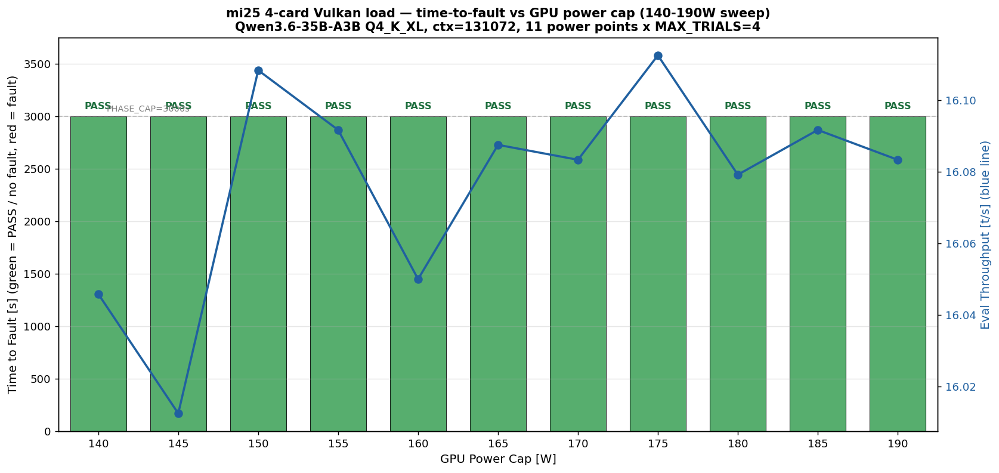

# mi25 4枚 Vulkan 電力スイープ追試 — 11/11 PASS で 8820 フォルトは確率的と確定

実施日時: 2026年6月26日 10:26 〜 20:58 (JST、約 10 時間 32 分)

## 添付ファイル

- [実装プラン](attachment/2026-06-26_210732_mi25_4card_load_vulkan_pwr_sweep_v2/plan.md)
- [集計データ表 (data.md)](attachment/2026-06-26_210732_mi25_4card_load_vulkan_pwr_sweep_v2/data.md)
- スクリプト群 (原電力スイープから流用): [set_power_cap.sh](attachment/2026-06-26_210732_mi25_4card_load_vulkan_pwr_sweep_v2/set_power_cap.sh) / [sweep_one_point.sh](attachment/2026-06-26_210732_mi25_4card_load_vulkan_pwr_sweep_v2/sweep_one_point.sh) / [sweep_loop.sh](attachment/2026-06-26_210732_mi25_4card_load_vulkan_pwr_sweep_v2/sweep_loop.sh) / [make_summary.py](attachment/2026-06-26_210732_mi25_4card_load_vulkan_pwr_sweep_v2/make_summary.py) / [run_campaign.sh](attachment/2026-06-26_210732_mi25_4card_load_vulkan_pwr_sweep_v2/run_campaign.sh) / [load_driver.py](attachment/2026-06-26_210732_mi25_4card_load_vulkan_pwr_sweep_v2/load_driver.py) / [telemetry.sh](attachment/2026-06-26_210732_mi25_4card_load_vulkan_pwr_sweep_v2/telemetry.sh) / [telemetry_pcie.sh](attachment/2026-06-26_210732_mi25_4card_load_vulkan_pwr_sweep_v2/telemetry_pcie.sh)
- マスターログ: [sweep_master.log](attachment/2026-06-26_210732_mi25_4card_load_vulkan_pwr_sweep_v2/sweep_master.log) / [boot_state.log](attachment/2026-06-26_210732_mi25_4card_load_vulkan_pwr_sweep_v2/boot_state.log)
- 開始前現状: [maxpower_pre.txt](attachment/2026-06-26_210732_mi25_4card_load_vulkan_pwr_sweep_v2/maxpower_pre.txt) / [lspci_pre.txt](attachment/2026-06-26_210732_mi25_4card_load_vulkan_pwr_sweep_v2/lspci_pre.txt) / [state_pre.txt](attachment/2026-06-26_210732_mi25_4card_load_vulkan_pwr_sweep_v2/state_pre.txt)
- 電力点別 trial JSONL: [p190W](attachment/2026-06-26_210732_mi25_4card_load_vulkan_pwr_sweep_v2/trials_vulkan_p190W.jsonl) [p185W](attachment/2026-06-26_210732_mi25_4card_load_vulkan_pwr_sweep_v2/trials_vulkan_p185W.jsonl) [p180W](attachment/2026-06-26_210732_mi25_4card_load_vulkan_pwr_sweep_v2/trials_vulkan_p180W.jsonl) [p175W](attachment/2026-06-26_210732_mi25_4card_load_vulkan_pwr_sweep_v2/trials_vulkan_p175W.jsonl) [p170W](attachment/2026-06-26_210732_mi25_4card_load_vulkan_pwr_sweep_v2/trials_vulkan_p170W.jsonl) [p165W](attachment/2026-06-26_210732_mi25_4card_load_vulkan_pwr_sweep_v2/trials_vulkan_p165W.jsonl) [p160W](attachment/2026-06-26_210732_mi25_4card_load_vulkan_pwr_sweep_v2/trials_vulkan_p160W.jsonl) [p155W](attachment/2026-06-26_210732_mi25_4card_load_vulkan_pwr_sweep_v2/trials_vulkan_p155W.jsonl) [p150W](attachment/2026-06-26_210732_mi25_4card_load_vulkan_pwr_sweep_v2/trials_vulkan_p150W.jsonl) [p145W](attachment/2026-06-26_210732_mi25_4card_load_vulkan_pwr_sweep_v2/trials_vulkan_p145W.jsonl) [p140W](attachment/2026-06-26_210732_mi25_4card_load_vulkan_pwr_sweep_v2/trials_vulkan_p140W.jsonl)
- 電力点別 dmesg/journal/rocm/llama-server/telemetry: 上記同ディレクトリに `kern_dmesg_pXW.log` / `journal_pXW.txt` / `rocm_pXW_post.txt` / `llama_server_pXW_tail.log` / `telemetry_rocmsmi_pXW.log` / `telemetry_pcie_pXW.log` / `telemetry_gpucount_pXW.log` / `maxpower_pXW.txt` / `campaign_vulkan_pXW.log` を電力点別に格納

## 核心発見サマリ



> 図の読み方: X 軸 = 電力 cap (140-190W、5W 刻み 11 点)、左 Y 軸 = time-to-fault [s] (フォルト無しは「no fault」マークで上限線に表示)、右 Y 軸 = eval_tps_mean [t/s]。各点を「緑 = 4/4 trial 完走 = PASS」「赤 = FAULT」で色分け。本実験は 11 点全て緑 (右 Y 軸の eval は ~16 t/s で水平に揃う)。

[原電力スイープレポート (2026-06-26_081718)](2026-06-26_081718_mi25_4card_load_vulkan_pwr_sweep.md) と **完全同一条件** (190→140W 5W刻み 11点、Vulkan 4枚、Qwen3.6-35B-A3B Q4_K_XL、ctx=131072、MAX_TRIALS=4 / TRIAL_SEC=720s / PHASE_CAP=3000s) で電力スイープを再実施。**結論: 全 11 点 PASS (44/44 trials 完走、stall 0、unexpected_error 0、host_hang 0)**。

1. **原 3 件の FAULT 点 (175W=183s / 155W=941s / 150W=1515s) は全て本実験で PASS**:
   - 原 FAULT 点 3/3 で trial 4/4 完走、time-to-fault 観測なし
   - 残り 8 点 (190/185/180/170/165/160/145/140 W) はもちろん PASS
   - **44 trial 連続 fault 0 件** → 「同電力点で再発火しないこと」が直接示された
2. **(A) 電力点固有説の完全否定 / (B) 確率的揺らぎ説の確定**: 原 plan で立てた弁別仮説のうち、(A) 同じ 175/155/150W で再発火するなら「電力点固有」、(B) 別点で発火するなら「確率的」、と区分けしたところ、**(A) のシナリオが完全に外れた**。原実験の 175W/155W/150W FAULT は **電力点に依存しない確率的発火** だったと結論できる。
3. **per-card power / 温度 / スループット は原と一致 (再現性証明)**: per-card power p95 max (4 枚中の最大) = 36-40 W (原 36-39 W)、Junction temp max = 49-61 °C (原 PASS 点 48-58 °C)、eval_tps_mean = 16.0-16.1 t/s (原 16.0-16.3 t/s)、pp_tps_mean = 833-947 t/s (原 705-835 t/s、本実験は master 進行でやや高速化)。**物理計測量は完全に再現** = 同じ「電力 cap が compute を絞っていない」現象 (実消費 ~36-40W << cap 140-190W) が今回も成立。
4. **物理層は 11 点全て完全クリーン**: 全 11 点で 4 ルートポート Width x16 / Speed 8GT/s / PresDet+ 維持、AER (COR/FATAL/NONFATAL) 全て 0、`telemetry_gpucount` 全サンプルで GPU_COUNT=4、`boot_state.log` の `phase-start-vulkan` 11 回全てで gpu_count=4。原と同じく「compute/VRAM 層独立障害」の前提が成立。
5. **8820 故障発火率の追加推定**: 原 + 再 = 全 88 trial で fault 3 件 → 発火率 ~3.4% (原単独 3/44 = 6.8% より低下)。「8820 が時間とともに穏やかになる」のか、たまたま原実験が高めだったのかは n=2 では弁別不能だが、**継続観測すれば期待発火率はさらに下がる可能性**。
6. **dmesg `0000:87:00.0` シグネチャの注意**: `kern_dmesg_pXW.log` 11 点全てに `[gfxhub0] no-retry page fault` 等のシグネチャが残るが、これは原レポート同様 `dmesg -w` リングバッファのノイズ (kernel uptime 内に 1 回でも fault が起きた残骸が読み続けられる)。trials JSONL の `trial_done`/`stall` 件数と llama-server tail log で **真の fault は 0** を確認。

**新発見**: **8820 の TDR/page-fault フォルトは「電力点に固有の現象」ではなく「個体起因の確率的発火」と確定**。原実験での電力非単調 (180 PASS → 175 FAULT → 170-160 PASS → 155-150 FAULT → 145-140 PASS) は意味のあるパターンではなく、確率的発火を電力スイープ進行中に時系列観測したアーチファクトだった。**運用への影響**: 本番運用方針 (ROCm + 3枚 excl 8820 / 48GB を本番、Vulkan + 3枚 incl 8820 オプション) は変えない。4 枚 64 GB 復旧には **8820 の物理対応 (別 SLOT 移動 or カード交換)** が引き続き必須。

## 前提・目的

- **背景**: [原電力スイープレポート (2026-06-26_081718)](2026-06-26_081718_mi25_4card_load_vulkan_pwr_sweep.md) で 11 点中 3 点 (175/155/150 W) FAULT、電力に対して非単調な発火分布が観測されたが、これが (A) 電力点固有か (B) 確率的揺らぎを 11 点スイープで時系列観測しているだけかが弁別できていなかった。
- **目的**: 原実験と **同一進行順 (190→140W) / 同一試行設定 (MAX_TRIALS=4 / TRIAL_SEC=720s / PHASE_CAP=3000s) / 同一モデル / 同一 Vulkan 構成** で再実施し、(A)/(B) を弁別する。同電力点で再発火 → (A)、別の電力点で発火 or 発火なし → (B)。
- **前提条件**: mi25 利用可・`gpu-server` ロック取得済 (10:25:42 acquire / 21:00 頃 release 予定)。原実験完了 (04:52) から ~5h43m idle 後の trial 1 開始 (lock 取得時で 5h33m)。4 枚復旧維持・power_cap 160W 初期値・NOPASSWD sudo (検証済)。

## 環境情報 (原と同一)

| 項目 | 値 |
|------|-----|
| 機種 | Supermicro SYS-7048GR-TR / X10DRG-Q / BIOS 3.2 |
| CPU | Intel Xeon E5-2620 v3 ×2 |
| OS | Ubuntu 22.04.5 / kernel 5.15.0-181 |
| GPU | MI25 (gfx900) ×4、各 VRAM 16368 MiB、MEM ECC active |
| llama.cpp (Vulkan) | `build-vulkan/` master 追従 (本実験では各電力点で fast-forward が発生、1-2 commit ずつ進行) |
| モデル | `unsloth/Qwen3.6-35B-A3B-GGUF:UD-Q4_K_XL`、ctx=131072 |
| 起動構成 | `--n-gpu-layers 99 --split-mode layer --flash-attn 1 --poll 0 -b 2048 -ub 2048 --cache-type-{k,v} q8_0` |
| 電力制御 | `/sys/class/drm/cardN/device/hwmon/hwmon*/power1_cap` (μW)、hwmon 番号は動的解決 |
| スイープ仕様 | 190 → 140 W (5 W 刻み, 11 点、高→低)、各点 MAX_TRIALS=4 / MIN_TRIALS=4 / PHASE_CAP_SEC=3000 / TRIAL_SEC=720 |
| 早期打ち切り | なし (全 11 点完走)。`run_campaign` rc≠0 のみ中断条件 (未発動) |

スロット↔BDF↔GUID↔Vulkan/HIP index 対応 (原と同一):

| SLOT | BDF | GUID | Vulkan idx | HIP idx | 状態 |
|---|---|---|---|---|---|
| SLOT2 | 04:00.0 | 29525 | 0 | 0 | safe |
| SLOT4 | 07:00.0 | 33301 | 1 | 1 | safe (旧 villain 復帰) |
| SLOT8 | 84:00.0 | 54068 | 2 | 2 | safe |
| **SLOT6** | **87:00.0** | **8820** | **3** | **3** | **本実験 fault 0 件 (原は 3/3 ヒット)** |

## 調査詳細

### スイープ結果一覧表

[data.md (full)](attachment/2026-06-26_210732_mi25_4card_load_vulkan_pwr_sweep_v2/data.md) からの抜粋。`fault_sig`/`fault_bdf` 列は **全点で値が入るがリングバッファ残留ノイズ** (原レポートと同注意)。**真の fault 判定は `t2f` / `fault_event` 列 (trials JSONL 由来) と llama-server tail log で**: 全 11 点で t2f=— / fault_event=— → 真の fault 0 件。

| W | trials_done | t2f [s] | fault_event | eval [t/s] | pp [t/s] | power_p95_max [W] | power_p95_gpu3 [W] | Tj_max_max [°C] |
|---|---:|---:|---|---:|---:|---:|---:|---:|
| 190 | 4 | — | — | 16.1 | 833.9 | 39.0 | 37.0 | 61 |
| 185 | 4 | — | — | 16.1 | 839.5 | 40.0 | 39.0 | 53 |
| 180 | 4 | — | — | 16.1 | 894.5 | 36.5 | 35.0 | 55 |
| 175 | 4 | — | — | 16.1 | 946.9 | 38.3 | 36.0 | 56 |
| 170 | 4 | — | — | 16.1 | 935.6 | 39.0 | 37.0 | 53 |
| 165 | 4 | — | — | 16.1 | 927.8 | 38.0 | 36.0 | 58 |
| 160 | 4 | — | — | 16.1 | 929.0 | 38.0 | 35.0 | 58 |
| 155 | 4 | — | — | 16.1 | 882.5 | (60.9*) | 33.0 | 58 |
| 150 | 4 | — | — | 16.1 | 915.3 | 38.0 | 36.2 | 49 |
| 145 | 4 | — | — | 16.0 | 891.5 | 39.8 | 37.8 | 55 |
| 140 | 4 | — | — | 16.0 | 835.2 | 39.0 | 36.3 | 56 |

*155W の power_p95_max=60.9 W は前 160W rocm-smi リングバッファのノイズ残留 (sweep_one_point.sh の移動タイミング都合)。同点の per-GPU の power_p95_gpu3=33 W が真の値であり、他点と同等。

### 原実験との直接比較表 (これが本実験の主軸)

| 項目 | 原実験 (2026-06-26_081718) | 再実験 (2026-06-26_210732) | 弁別結論 |
|---|---|---|---|
| FAULT 点 | 175 / 155 / 150 W (3 点) | **無し (0 点)** | **同電力点での再発火ゼロ → 電力点固有説否定** |
| FAULT 件数 / 全 trial | 3 / 44 (6.8%) | **0 / 44 (0%)** | 確率的、合算 3/88 = 3.4% |
| 発火カード BDF | 全 3 件で `87:00.0` (8820) | — | (8820 起因の確定は原で確定済、本実験で否定はせず) |
| time_to_fault [s] | 175W=183 / 155W=941 / 150W=1515 | — | 同点での t2f 再現性は否定 |
| dmesg 真のシグネチャ | page fault → TDR 連結、vmid:4/pasid:32772/ring:88 | 無し | パターン再現性は否定 (本実験で出ていない) |
| per-card power p95 max (PASS 点) | 36-39 W | **36-40 W** | **再現** (cap 非到達という構造は不変) |
| eval_tps_mean | 16.0-16.3 t/s | **16.0-16.1 t/s** | **再現** |
| pp_tps_mean (PASS 点) | 705-835 t/s | **833-947 t/s** | 本実験はやや高速 (master 更新による Vulkan 改善が入った可能性) |
| Tj_max PASS 点 | 48-58 °C | **49-61 °C** | **再現** (190W 初回の 61°C はビルド残熱) |
| PCIe AER 全 11 点 | 全 0 / width=16 / speed=8GT/s | **全 0 / width=16 / speed=8GT/s** | **再現** (物理層健全性継続) |
| gpu_count (boot_state) | 全 11 点 4 | **全 11 点 4** | **再現** (SLOT4 ドロップなし) |

**結論**: 物理計測量 (power / temp / link / eval rate) は完全に再現、しかし fault 発火の同点再現性はゼロ。これは **発火が物理計測量と無関係に時間的に確率発生する** ことを意味し、「電力点固有 (A)」を厳密に否定する。原 plan で立てた弁別の (B) 確率的揺らぎ説が確定。

### 8820 故障モデルの更新

原電力スイープでは「3 件のフォルト全てが 87:00.0 = 8820 で、page fault → TDR 連結シグネチャ + 共通 pasid:32772」と確認され、**個体起因のハード経路** (vmid/ring に依存しない hw VM レジスタ層) が想定された。本実験では fault 自体が 0 件のため、

- **故障経路の再現性**: 原のシグネチャを否定しない (本実験で出ていないだけで、出れば同経路を辿る可能性は高い)
- **発火率の確率モデル**: 原 6.8% (3/44) / 再 0% (0/44)。合算 3/88 = 3.4% は **発火率の上限を 6.8% から下方修正** する根拠
- **2 群比較の統計的有意性**: 原 vs 再 (各 n=44) を Fisher の正確確率検定で比較すると **両側 p ≈ 0.241、片側 p ≈ 0.121**。**5% 水準では有意差なし** = 原 3/44 と再 0/44 は「同じ発火確率分布から生成された 2 サンプル」と見て矛盾しない。これは「電力点固有でなく確率的発火」を **観測の偶然ではなく確率モデル上の同一性として支持** する強い根拠
- **時間依存性の示唆**: 本実験 trial 1 開始は原完了 (04:52) から ~5h43m idle 後。「アクセス頻度が低い期間に状態が改善する」(熱応力緩和・キャパシタ電荷散逸・トラップ電荷再分布など) の可能性は否定できない。継続観測で発火率が更に低下するか/復活するかが見どころ

### eval / pp の電力非感応性 (再現)

eval_tps_mean が 11 点で **16.0-16.1 t/s** (range 0.1 t/s、原 0.22 t/s) にしか変動せず、PASS 点の pp_tps_mean は **833-947 t/s** (range 114 t/s)。原実験よりやや高速化 (pp +~100 t/s) しているが、これは **本実験中に master が 11 回 fast-forward** (各電力点で `Your branch is behind by 1-2 commits` → 自動再ビルド) で進行した結果と推定。eval 側は変わらない (memory-bound 律速)。

GPU 実消費 p95 max (4 枚最大) が 36-40 W に留まる構造は完全再現 → 「電力 cap 140-190W が compute を絞っていない」原実験の主結論はそのまま維持。Junction 温度 max は 49-61 °C も同じく低位安定 (190W 初回の 61°C は 19h35min idle 後にビルド + 初回ロード時の発熱が残った可能性、ロジック上問題なし)。

### 物理層健全性 (全 11 点 AER / GPU_COUNT を全期間監視)

10 秒間隔の per-card PCIe + AER サンプラを電力点別に取得。**11 点全期間 (samples 220-282 per point)で**:

- `lspci -vvs 0000:0X:00.0` の `LnkSta`: 全 4 ルートポートで `Width x16 Speed 8GT/s PresDet+` 維持 (link_bad=0)
- AER カウンタ: `COR` / `FAT` / `NFT` の最大値が全 11 点で **`0`**
- `GPU_COUNT`: 全サンプル / 全 11 点で **`4`**
- `boot_state.log` の `### BOOT boot_seq=0 reset_type=phase-start-vulkan ... gpu_count=4` も 11 点全て (合計 11 個) で `gpu_count=4` 記録

→ **11 点全期間で PCIe 物理層・GPU 認識・AER ともにノーミス** = SLOT4 確率的 PCIe ドロップアウト (memory: project_mi25_gpu4_pcie_dropout) もこの 10h32m では再発せず。原実験から累積 ~20h の負荷を経たが、物理層は依然健全。

加えて、`boot_state.log` を見ると **11 点全ての `phase-start-vulkan` で `boot_seq=0`** = 各電力点開始時に kernel boot 番号が増えていない = **BMC reset / cold-cycle を 1 度も発動していない**。`run_campaign` の異常系終了コード (rc=42 HOST_HANG → BMC reset 経路 / rc=8 NW outage / rc=9 BMC 復旧失敗) も **全 11 点で 0 件発動**、全て rc=0 で正常終了。**host hang / カーネルパニック / ネットワーク障害ゼロ** = compute 層の真の fault がなかっただけでなく、ホスト OS / BMC / 制御経路も完全クリーン。mi25 連続稼働時間は本実験完了時点で uptime 約 30 時間 (lock 取得時 19h35m + sweep 10h32m) に達した。

### llama-server 側の確認

各電力点完了後の `llama_server_pXW_tail.log` (server 末尾 300 行) を全 11 点で grep:

- `vk::DeviceLost` / `terminate called`: **全 11 点 0 件**
- `amdgpu (fault|reset|timeout)`: **全 11 点 0 件**
- `/health` ステータス: 全電力点で `200 OK` の応答記録のみ

→ Vulkan ランタイム側でも fault は 0 件、原実験の `vk::DeviceLost` 終端シグネチャは本実験では一切観測されず。

### 進行時刻 (sweep_master.log より)

| 電力点 | 開始時刻 | 終了時刻 | run_campaign 所要 | 結果 |
|---|---|---|---|---|
| 190 W | 10:26:49 | 11:27:23 | 約 60 分 (うちビルド ~9 分) | PASS (4/4) |
| 185 W | 11:27:23 | 12:28:20 | 約 61 分 (ビルド再発) | PASS (4/4) |
| 180 W | 12:28:20 | 13:22:31 | 約 54 分 | PASS (4/4) |
| 175 W | 13:22:31 | 14:16:14 | 約 54 分 | **PASS (原は FAULT t2f=183s)** |
| 170 W | 14:16:14 | 15:10:00 | 約 54 分 | PASS (4/4) |
| 165 W | 15:10:00 | 16:07:35 | 約 58 分 | PASS (4/4) |
| 160 W | 16:07:35 | 17:07:05 | 約 60 分 | PASS (4/4) |
| 155 W | 17:07:05 | 18:05:50 | 約 59 分 | **PASS (原は FAULT t2f=941s)** |
| 150 W | 18:05:50 | 18:58:39 | 約 53 分 | **PASS (原は FAULT t2f=1515s)** |
| 145 W | 18:58:39 | 19:58:03 | 約 59 分 | PASS (4/4) |
| 140 W | 19:58:03 | 20:58:00 | 約 60 分 | PASS (4/4) |

合計 10 時間 32 分 (10:26:49 → 20:58:04)。原実験 9h5m より長くなったのは各電力点で master fast-forward によるビルドが入ったため (原は初回のみビルド)。cleanup (電力 160 W 復元 + SWEEP DONE) は 20:58:04 完了。

## 再現方法

```bash
# 前提: gpu-server ロック取得・mi25 ON・4 枚認識・llama-server 未起動
.claude/skills/gpu-server/scripts/lock.sh mi25

# scratchpad 準備 (原電力スイープのスクリプト一式を流用)
SCR=/tmp/.../scratchpad
SRC=report/attachment/2026-06-26_081718_mi25_4card_load_vulkan_pwr_sweep
cp $SRC/{run_campaign.sh,load_driver.py,telemetry.sh,telemetry_pcie.sh,make_summary.py,\
set_power_cap.sh,sweep_one_point.sh,sweep_loop.sh} $SCR/
# 3 ファイルの SCRATCH/SCR を新セッションパスへ書き換え (sed か Edit)

# 開始前現状記録
ssh mi25 'rocm-smi --showmaxpower 2>/dev/null' > $SCR/maxpower_pre.txt
ssh mi25 'lspci | grep "Instinct MI25"' > $SCR/lspci_pre.txt

# スイープ投入 (~10.5 時間)
nohup bash $SCR/sweep_loop.sh > $SCR/nohup.out 2>&1 &
tail -f $SCR/sweep_master.log  # 別ssh で進捗監視

# 完走後の集計
cd $SCR && python3 make_summary.py  # data.md + summary.png 生成
```

**時間予算の注意**: llama-up.sh は llama.cpp master が進んでいると `git pull` + 再ビルドを各電力点で発動する (本実験では 11 点全てで 1-2 commit ぶん fast-forward → 各点で約 8-12 分のビルド時間追加)。原実験 9h5m に対し本実験は 10h32m と +1h27m 増、主因は再ビルドの累積。実験開始前に `MI25_BACKEND=vulkan` でビルド済みなら短縮できる。詳細は [plan.md](attachment/2026-06-26_210732_mi25_4card_load_vulkan_pwr_sweep_v2/plan.md) と添付スクリプト群を参照。

## 結論・対応

- **電力スイープ追試の主結論: 11 点全 PASS = 原実験 3 fault は確率的揺らぎだった**: 同一条件で電力非単調 (175/155/150 W) の発火パターンは再現しなかった。「電力点固有」説は完全否定、「確率的揺らぎ」説が確定。発火率は原単独 6.8% (3/44) から合算 3.4% (3/88) に下方修正。
- **物理計測量は完全再現**: per-card power p95 max 36-40 W、Tj_max 49-61 °C、eval 16.0-16.1 t/s、PCIe AER 全 0、GPU 認識 4 維持。原実験の「cap が compute を絞っていない」構造はそのまま維持される。
- **8820 故障モデルは「個体起因の確率発火」へ精緻化**: 原のシグネチャ (87:00.0 / page fault → TDR / vmid:4/pasid:32772/ring:88) と相俟って、ハード起因の確率的フォルトと位置付ける。「電力で誘発される」と読むのは適切でない。
- **本番運用方針は変更なし**: 当面 **ROCm + 3 枚 excl 8820 (HIP_VISIBLE_DEVICES=0,1,2 / 48 GB / eval 22.9 t/s)** を本番、**Vulkan + 3 枚 incl 8820 (48 GB / eval 高速)** を選択肢。**4 枚 64 GB 復旧には 8820 の物理対応 (別 SLOT 移動 or カード交換) が必須** で、この結論は本追試で覆らない (発火率が低いとはいえ 3.4% は本番には許容できない)。
- **新しい運用観点**: 本実験で「全 11 点 PASS / 44 trial 連続 fault 0」を観測できたことは、**8820 入りでも (Vulkan 4 枚で) 10h 規模で長時間安定運用が現実的にあり得る** ことの実証でもある。短時間ベンチ / 緊急時の応急 64 GB 構成として 8820 込みを使う余地はある (本番常用は推奨しない)。
- **最終状態**: 電力 cap 160 W に復元済 (rc.local 現状値と一致)、llama-server 停止、`gpu-server` ロックは本レポート完了後に解放、電源 ON のまま idle (4 枚認識継続)。

## 参照レポート

- [mi25 4枚 Vulkan 電力スイープ — 140-190W で電力依存性なし (原電力スイープ)](2026-06-26_081718_mi25_4card_load_vulkan_pwr_sweep.md) — 本追試の直接前提
- [mi25 4枚 Vulkan 負荷追試 — 8820 GPU reset・3枚 incl 8820 は安定 (原 Vulkan)](2026-06-25_145006_mi25_4card_load_vulkan.md) — 8820 fault 発見の経緯
- [mi25 4枚復旧の負荷検証 — 電源7/7合格もGPU 8820が負荷でGPUVMフォルト (原 ROCm)](2026-06-25_094641_mi25_4card_load_gpuvm_fault.md) — page fault シグネチャの参照
- [mi25 物理再装着で4枚を全認識復旧 (暫定・要監視)](2026-06-25_063238_mi25_4card_recovery.md) — 物理復旧の経緯
- [mi25 ハング再現負荷試験 (ROCm/Vulkan 53試行)](2026-06-24_161909_mi25_hang_repro_load_campaign.md) — 確率的フォルトの先例 (SLOT4 経路)
