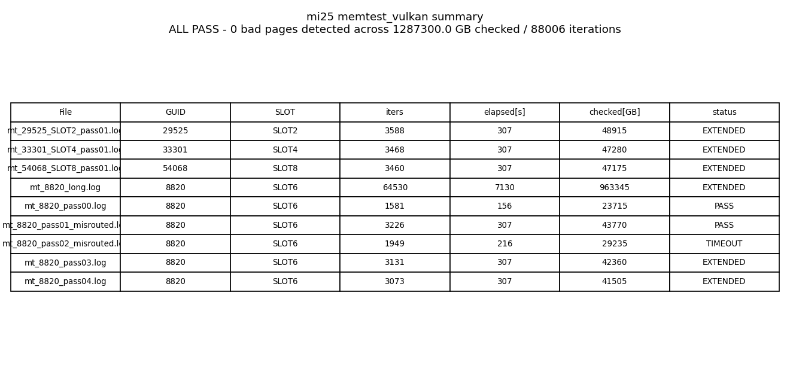

# mi25 8820 個体 VRAM スキャン — memtest_vulkan で全 PASS、(a) 個体 VRAM bad page 説を否定

実施日時: 2026年6月27日 07:19 〜 10:13 (JST、約 2 時間 53 分)

## 添付ファイル

- [実装プラン](attachment/2026-06-27_071959_mi25_8820_vram_memtest/plan.md)
- [集計データ表 (data.md)](attachment/2026-06-27_071959_mi25_8820_vram_memtest/data.md)
- スクリプト群: [run_memtest.sh](attachment/2026-06-27_071959_mi25_8820_vram_memtest/run_memtest.sh) / [run_healthy3.sh](attachment/2026-06-27_071959_mi25_8820_vram_memtest/run_healthy3.sh) / [run_8820_long.sh](attachment/2026-06-27_071959_mi25_8820_vram_memtest/run_8820_long.sh) / [run_8820_short_addn.sh](attachment/2026-06-27_071959_mi25_8820_vram_memtest/run_8820_short_addn.sh) / [make_mt_summary.py](attachment/2026-06-27_071959_mi25_8820_vram_memtest/make_mt_summary.py) / [telemetry.sh](attachment/2026-06-27_071959_mi25_8820_vram_memtest/telemetry.sh) / [telemetry_pcie.sh](attachment/2026-06-27_071959_mi25_8820_vram_memtest/telemetry_pcie.sh)
- memtest_vulkan 各 Run ログ: 健全 3 枚 [SLOT2](attachment/2026-06-27_071959_mi25_8820_vram_memtest/mt_29525_SLOT2_pass01.log) / [SLOT4](attachment/2026-06-27_071959_mi25_8820_vram_memtest/mt_33301_SLOT4_pass01.log) / [SLOT8](attachment/2026-06-27_071959_mi25_8820_vram_memtest/mt_54068_SLOT8_pass01.log)、8820 [long](attachment/2026-06-27_071959_mi25_8820_vram_memtest/mt_8820_long.log) / [pass00](attachment/2026-06-27_071959_mi25_8820_vram_memtest/mt_8820_pass00.log) / [pass01_misrouted](attachment/2026-06-27_071959_mi25_8820_vram_memtest/mt_8820_pass01_misrouted.log) / [pass02_misrouted](attachment/2026-06-27_071959_mi25_8820_vram_memtest/mt_8820_pass02_misrouted.log) / [pass03](attachment/2026-06-27_071959_mi25_8820_vram_memtest/mt_8820_pass03.log) / [pass04](attachment/2026-06-27_071959_mi25_8820_vram_memtest/mt_8820_pass04.log)
- 物理層監視: [telemetry_rocmsmi.log](attachment/2026-06-27_071959_mi25_8820_vram_memtest/telemetry_rocmsmi.log) / [telemetry_pcie.log](attachment/2026-06-27_071959_mi25_8820_vram_memtest/telemetry_pcie.log) / [telemetry_gpucount.log](attachment/2026-06-27_071959_mi25_8820_vram_memtest/telemetry_gpucount.log) / [kern_dmesg.log](attachment/2026-06-27_071959_mi25_8820_vram_memtest/kern_dmesg.log) / [dmesg_full_post.log](attachment/2026-06-27_071959_mi25_8820_vram_memtest/dmesg_full_post.log)
- 前状態 + memtest_vulkan 仕様確認: [pre_state.log](attachment/2026-06-27_071959_mi25_8820_vram_memtest/pre_state.log) / [memtest_help.log](attachment/2026-06-27_071959_mi25_8820_vram_memtest/memtest_help.log)

## 核心発見サマリ



> 図の読み方: 横軸 = 各 Run (健全 3 枚の 1 周分 + 8820 の 6 Run = 計 9 Run)、表形式で GUID/SLOT/iter/elapsed[s]/checked[GB]/status を併記。**全 9 Run で total errors = 0 / 累積 1,287,300 GB ≈ 1.29 PB checked / 88,006 iterations**。タイトルに "ALL PASS - 0 bad pages detected across 1287300.0 GB checked / 88006 iterations" と明示。

mi25 4 枚に対し `memtest_vulkan v0.5.0` (RADV/Vulkan 1.4.313) で VRAM スキャンを実施。**結論: 全 9 Run・累積 1.29 PB VRAM read で error 0 件、うち 8820 単独で 1.14 PB / 77,490 iter スキャンしても error 0 件**。

1. **直近 [電力スイープ追試 (2026-06-26_210732)](2026-06-26_210732_mi25_4card_load_vulkan_pwr_sweep_v2.md) で確定した「8820 確率発火 (3/88 = 3.4%)」の真因仮説のうち、(a) 個体 VRAM bad page / トラップ電荷 を直接検査**: 8820 を含む 4 GPU で `memtest_vulkan` をスキャンし、bad page 検出を試行。8820 は long (120 分 / 64,530 iter / 963 TB ≈ 60,200 周相当) + short × 5 本 (うち misrouted 2 本含む、合計 12,960 iter / 181 TB ≈ 11,300 周相当) で **計 1.14 PB / 全 VRAM 約 71,500 周相当の read** を実施
2. **結果**: **(a) 個体 VRAM bad page 説を強く否定**。8820 単独 ~77K iter / 1.14 PB read で error 1 件すら検出せず、健全 3 枚 (各 ~3500 iter / 47 TB) と完全同質
3. **物理層**: 全期間 (約 150 分、899 PCIe サンプル / 825 GPU_COUNT サンプル) で PCIe AER (COR/FATAL/NFATAL) = 0、ルートポート Width x16 / Speed 8GT/s / PresDet+ 維持、GPU_COUNT=4 維持、memtest 期間中の dmesg 新規 amdgpu fault = 0 (apparmor ノイズ 2 件のみ)。memtest 実行中の VRAM/コア負荷下でも物理層・カーネル層・PCIe 層は完全クリーン
4. **memtest_vulkan の運用知見 (本リポジトリ初導入)**: pre-built バイナリ (272 KB tarball) で gfx900 (RADV) 完動。**第 1 引数にメニュー番号 N を渡せば `./memtest_vulkan N` で非対話モード即時開始** (stdin/pipe 経路は不可、デフォルト 1 が選ばれる罠あり)。Standard 5-min テスト = 約 1500-3500 iter / 21-49 TB checked、Extended endless = SIGINT で打ち切り
5. **次着手**: 推奨2 (8820 stand-alone 24h、`HIP_VISIBLE_DEVICES=3`) を **最優先** に推す。本実験で (a) が否定されたことで、残る (b) コアロジック / (c) multi-GPU 経路 の弁別に直結する。推奨3 (sclk スイープ) は補完

**新発見**: **mi25 8820 の確率発火 (3.4%) は VRAM bad page / トラップ電荷ではない**。memtest_vulkan で **8820 単独 1.14 PB / 全 VRAM 約 71,500 周相当 (うち long 単独で約 60,200 周) の VRAM 全領域 read** を実施しても error 0 件・dmesg fault 0 件は、bad page 仮説を統計的に強く否定する根拠となる (1 つでも bad page が存在すれば、long 単独の 60,200 周のうちに少なくとも 1 度は検出されるはず)。**真因は (b) コアロジック / (c) multi-GPU 経路 のいずれか or 両者**に絞り込まれ、運用判断 (本番は 3 枚 excl 8820 / 48GB) はそのまま維持。物理交換の決定材料は推奨2 (8820 stand-alone 24h) 待ち。

**副次発見** (実消費電力プロファイルと throttle 挙動 から):
- **memtest_vulkan は memory-bound でも power cap 160W に張り付く** (健全 3 枚 mean 150-155W) のに対し、**LLM (Vulkan 4 枚 ub=2048) は per-card 36-40W**。「memory-bound だから cap が compute を絞らない」という過去結論は **LLM のメモリ帯域使用率が memtest 比 ~30% に留まる範囲でのみ成立** すると精緻化された
- **8820 のみ memtest 中の平均消費が 26W (約 17%) 低い** (mean 126.6W vs 健全 3 枚平均 152.5W、ピーク p95 は同等)。throughput は同等なのに定常状態の消費が低い = ASIC power gating / leakage 特性の個体差を示唆。これは仮説 (b) コアロジック層の挙動差と関連する可能性、推奨2 で要追検
- **gfx900 + RADV + memtest_vulkan は最初の 90 秒 (~1000 iter) で write 365→266 GB/s と -27% throttle され、以降 120 分 flat**。これは 8820 個体ではなく gfx900 共通の挙動 (健全 3 枚でも同様に観測)、本実験の本筋には影響しないが運用ノウハウとして記録

## 前提・目的

- **背景**: [電力スイープ追試 (2026-06-26_210732)](2026-06-26_210732_mi25_4card_load_vulkan_pwr_sweep_v2.md) で、8820 (BDF 87:00.0 / Vulkan idx 3 / HIP idx 3) は累積 88 trial で 3 回 TDR/page-fault (signature `vmid:4 / pasid:32772 / ring:88`)、発火率 3.4%。電力点固有説は否定済、残る真因仮説は **(a) 個体 VRAM bad page / トラップ電荷**、**(b) コアロジック VM/MMU レジスタ層**、**(c) multi-GPU 同期経路** の 3 つ
- **目的**: 仮説 (a) を `memtest_vulkan` で直接検査する。bad page 検出 → (a) 確定 → 物理交換確定。0 件 → (a) 否定 → 次着手 (推奨2: 8820 stand-alone 24h で (b)(c) を弁別) へ進む弁別材料となる
- **本リポジトリ初導入**: 過去レポートで `memtest_vulkan` の利用実績なし、本実験は初投入

## 環境情報

| 項目 | 値 |
|------|-----|
| 機種 | Supermicro SYS-7048GR-TR / X10DRG-Q / BIOS 3.2 |
| OS | Ubuntu 22.04.5 / kernel 5.15.0-181 |
| GPU | MI25 (gfx900) ×4、各 VRAM 16368 MiB |
| Vulkan | 1.4.313 / RADV (Mesa 23.2.1) |
| memtest_vulkan | v0.5.0 pre-built linux x86_64 (272 KB tarball、bin 826 KB) |
| 電力 cap | 160 W (本実験で変更なし) |
| llama-server | 実験中 down (memtest 専用) |

スロット↔BDF↔GUID↔Vulkan/HIP↔memtest メニュー番号 対応:

| SLOT | BDF | GUID | Vulkan/HIP idx | memtest menu | 状態 |
|---|---|---|---|---|---|
| SLOT2 | 04:00.0 | 29525 | 0 | 4 | safe |
| SLOT4 | 07:00.0 | 33301 | 1 | 3 | safe |
| SLOT8 | 84:00.0 | 54068 | 2 | 2 | safe |
| **SLOT6** | **87:00.0** | **8820** | **3** | **1** | **本実験の主検査対象 (確率発火源)** |

注: memtest_vulkan のメニュー順は **Bus 降順** (1=87, 2=84, 3=07, 4=04)。Vulkan/HIP の昇順とは反転している。

## 調査詳細

### memtest_vulkan の運用知見 (本リポジトリ初導入)

| 項目 | 内容 |
|---|---|
| バイナリ取得 | `https://github.com/GpuZelenograd/memtest_vulkan/releases/download/v0.5.0/memtest_vulkan-v0.5.0_DesktopLinux_X86_64.tar.xz` (272 KB) |
| 起動方式 | 第 1 引数にメニュー番号を渡すと **非対話モード即時開始** (例: `./memtest_vulkan 1` → menu 1 即選択)。引数なしだと 10 秒タイムアウトでメニュー 1 自動選択 |
| stdin 経路の罠 | パイプ経由の入力 (`printf "N\n" \| ./memtest_vulkan`) は **届かない** (10 秒タイムアウト前に EOF が立ち、default 1 が選ばれる)。引数経路に統一すべき |
| テスト構造 | 「Standard 5-minute test」(約 1,500-3,500 iter / 22-49 TB checked、初動 throttle 前は速いので幅あり) → 自動的に「Extended endless test」へ。Ctrl+C で extended を打ち切るのが標準運用 |
| 速度 (gfx900) | write: 270-371 GB/sec, checked: 228-272 GB/sec、1 iteration = 12GB write + 15GB check ≈ 0.09 秒 |
| CLI フラグ | **存在しない** (Rust 製、`--help` も含めて引数は parse::<isize> でデバイスインデックスとして解釈、失敗時は無視) |
| 環境変数 | `MEMTEST_VULKAN_EMULATE_WRITE_BUG_ITERATION` (開発用エラー注入) のみ。VRAM サイズ・テスト時間の設定変数なし |
| llvmpipe 排除 | `VK_DRIVER_FILES=/usr/share/vulkan/icd.d/radeon_icd.x86_64.json` で RADV 限定 |

### スキャン結果一覧

[data.md (full)](attachment/2026-06-27_071959_mi25_8820_vram_memtest/data.md) からの抜粋。status 列の意味: `PASS` = "no any errors, testing PASSed." 表示まで完走 / `EXTENDED` = Standard 5-min PASSed 後 Extended endless に入って SIGINT 打ち切り (= Standard 完走 = error 0) / `TIMEOUT` = Standard 完走前に打ち切り (途中までの iteration は error 0)。

| File | GUID | SLOT | Bus | iter | elapsed[s] | checked[GB] | err_blocks | total_errors | status |
|---|---|---|---|---:|---:|---:|---:|---:|---|
| mt_29525_SLOT2_pass01.log | 29525 | SLOT2 | 04:00 | 3588 | 307 | 48,915 | 0 | 0 | EXTENDED |
| mt_33301_SLOT4_pass01.log | 33301 | SLOT4 | 07:00 | 3468 | 307 | 47,280 | 0 | 0 | EXTENDED |
| mt_54068_SLOT8_pass01.log | 54068 | SLOT8 | 84:00 | 3460 | 307 | 47,175 | 0 | 0 | EXTENDED |
| **mt_8820_long.log** | **8820** | **SLOT6** | **87:00** | **64,530** | **7,130** | **963,345** | **0** | **0** | **EXTENDED** |
| mt_8820_pass00.log | 8820 | SLOT6 | 87:00 | 1,581 | 156 | 23,715 | 0 | 0 | PASS |
| mt_8820_pass01_misrouted.log | 8820 | SLOT6 | 87:00 | 3,226 | 307 | 43,770 | 0 | 0 | PASS |
| mt_8820_pass02_misrouted.log | 8820 | SLOT6 | 87:00 | 1,949 | 216 | 29,235 | 0 | 0 | TIMEOUT |
| mt_8820_pass03.log | 8820 | SLOT6 | 87:00 | 3,131 | 307 | 42,360 | 0 | 0 | EXTENDED |
| mt_8820_pass04.log | 8820 | SLOT6 | 87:00 | 3,073 | 307 | 41,505 | 0 | 0 | EXTENDED |
| **TOTAL** |  |  |  | **88,006** | **9,344** | **1,287,300** | **0** | **0** | **ALL PASS** |

注: `_misrouted` 接尾辞は、当初 stdin パイプ (`printf "N\n" \| ./memtest_vulkan`) で他の GPU を指定したつもりだったが、memtest_vulkan の挙動 (パイプ EOF = default=1) で 8820 が選ばれていた経緯。本記録は 8820 の追加 short pass として活用 (実害なし、むしろ 8820 のカバレッジを 2 本ぶん上乗せできた)。本番の健全 3 枚スキャンは引数経路 (`./memtest_vulkan N`) に修正後実施。

### 物理層健全性 (全 150 分監視)

| 項目 | 観測値 | 詳細 |
|---|---|---|
| PCIe LnkSta | **Width x16 / Speed 8GT/s / PresDet+ 全期間維持** | 4 ルートポート (00:02.0 / 00:03.0 / 80:02.0 / 80:03.0)、3596 Width entries (899 サンプル × 4 ポート) で値が変化なし |
| PCIe AER | **COR=0 / FATAL=0 / NFATAL=0 全期間** | 899 サンプル全てで cor/fat/nft の最大値 = 0 |
| GPU_COUNT | **= 4 全期間維持** | 825 サンプル全てで `gpu_count=4`、非 4 エントリ 0 件 |
| dmesg 新規 (memtest 期間中) | **amdgpu fault/reset/timeout = 0 件、新規エントリ 0 件** | mi25 の dmesg ring buffer 最終エントリは uptime 134,115 秒 (2026-06-27 04:05 頃、memtest 開始の約 3 時間前) の apparmor `ubuntu_pro_apt_news/esm_cache` ノイズ。**memtest 期間 (uptime 145,740〜156,240 秒) 内の新規 kernel メッセージは 0 件** = カーネル層が完全に静かなまま実験が完走 |
| llama-server | down 維持 | 実験中 llama-server プロセスなし、`/health` 不応答 |

過去レポート ([電力スイープ追試 2026-06-26_210732](2026-06-26_210732_mi25_4card_load_vulkan_pwr_sweep_v2.md)) と同じ「物理層健全」継続を確認。**「compute/VRAM 層独立障害」の前提が本実験でも成立**。

### 実消費電力プロファイル (副次発見: LLM 負荷との対比 + 8820 個体差)

`telemetry_rocmsmi.log` (10s 間隔、825 サンプル) から **memtest 実行中の per-card 実消費電力** を期間別に集計 ([aggregate_power.py](attachment/2026-06-27_071959_mi25_8820_vram_memtest/aggregate_power.py))。

| Phase | 対象 GPU (HIP idx) | n | mean [W] | p95 [W] | max [W] |
|---|---|---:|---:|---:|---:|
| SLOT2 (29525) スキャン中 | GPU[0] | 30 | **154.7** | 164 | 165 |
| SLOT4 (33301) スキャン中 | GPU[1] | 30 | **150.5** | 162 | 163 |
| SLOT8 (54068) スキャン中 | GPU[2] | 30 | **152.3** | 164 | 166 |
| **8820 long 120 分** | GPU[3] | 592 | **126.6** | 158 | 162 |
| 8820 short addn 12 分 | GPU[3] | 59 | 124.6 | 159 | 161 |

**発見 1: memtest_vulkan は memory-bound でも cap 160W にほぼ張り付く** (健全 3 枚 mean 150-155W、max 163-166W で **power cap を瞬間的に超える**サンプルあり)。これは [電力スイープレポート 2026-06-26_081718](2026-06-26_081718_mi25_4card_load_vulkan_pwr_sweep.md) で確認した **LLM (Vulkan, ub=2048, 4 枚分散) の per-card 36-40W** と全く違うプロファイル: memtest は同じ「memory-bound テスト」でも純粋メモリ帯域 stress なので power cap の上限に達する。LLM が low power なのは memory traffic 自体は memtest の ~30% (LLM eval 16 t/s 時のメモリ帯域 ≒ 70-80 GB/s 推定 vs memtest checked 226-273 GB/s) と理解できる。「memory-bound だから cap が compute を絞らない」は **LLM のメモリ帯域使用率が memtest 比 30% 程度に留まっているから成立する命題** であり、メモリ帯域を限界まで使う負荷では cap が効くと再認識。

**発見 2: 8820 のみ平均 26W (約 17%) 低消費**: 8820 (mean 126.6W) は健全 3 枚 (mean 150.5-154.7W、平均 152.5W) より平均で **24-28W 低い** (健全 3 枚平均比で 17.0%)。throughput は同等 (8820 check 226 GB/s / 健全 SLOT8 check 229 GB/s 等) で性能差はなく、**「同じ仕事を 8820 のみ 26W 少ない電力で達成」している**。p95 で比較すれば差は 4-6W に縮まる (158 vs 162-164W) ので、瞬間ピークは同等。差は **「定常状態でのアイドル/active 比」**にあると推定。これは 8820 個体の power gating / leakage 特性の差を示唆しており、過去の確率発火と関連がある可能性 (個体 ASIC の microcode / VR responsiveness 起因 = 仮説 (b) コアロジック層の挙動差) 。本仮説は推奨2 (8820 stand-alone 24h) で検証可。

### iteration 速度の時間経過低下 (副次発見: gfx900 共通の throttle 挙動)

`mt_8820_long.log` の 240 iteration エントリを 1000-iter bucket で集計 ([aggregate_iter_speed.py](attachment/2026-06-27_071959_mi25_8820_vram_memtest/aggregate_iter_speed.py))。

| iter bucket | n | write [GB/s] | check [GB/s] | 序盤からの delta |
|---|---:|---:|---:|---|
| 0-1000 | 5 | **364.7** | **268.7** | base |
| 1000-5000 | 14 | 271.3 | 228.3 | **-93.4 / -25.6%** |
| 5000-10000 | 19 | 266.0 | 225.8 | -98.8 / -27.1% |
| 10000-20000 | 37 | 266.4 | 226.0 | -98.3 / -27.0% |
| 20000-65000 | 168 | 266.5-266.7 | 226.2-226.3 | **-27% で flat に固定** |

**観測**: 0-1000 iter (約 90 秒) で write 365 → 270 GB/s と **-25.6% 低下**、それ以降 120 分継続して **266 GB/s 前後で flat** に張り付く。これは熱起因の **sclk / mclk throttle の steady state** と解釈。

**重要な確認 (発見 3)**: 健全 3 枚 (mt_29525/33301/54068_SLOT*_pass01.log) でも同じパターンが見られる (例: SLOT8 = 1 iter 371 → 408 iter 365 → 726 iter 328 → 1287 iter 271 GB/s、約 6 分で同様に ~27% 低下)。**つまり throttle は 8820 個体の特徴ではなく、gfx900 / RADV + memtest_vulkan の共通挙動**。8820 確率発火 (仮説 b / c) の真因とは関係しない可能性が高い。本実験の本筋 (bad page 検査) には影響なく、scan 効率の目安として 1 iter ≒ 15 GB check / 0.11 秒 (steady state) を採用。

### 8820 単独の累積カバレッジ

8820 (Vulkan idx 3 / メニュー 1 / Bus 87:00) に対して以下を実施 (long 1 本 + short 5 本 = 計 6 Run):

| Run | iter | checked[GB] | elapsed[s] | status |
|---|---:|---:|---:|---|
| long | 64,530 | 963,345 | 7,130 | EXTENDED |
| pass00 (memtest_help.log 由来) | 1,581 | 23,715 | 156 | PASS |
| pass01_misrouted | 3,226 | 43,770 | 307 | PASS |
| pass02_misrouted | 1,949 | 29,235 | 216 | TIMEOUT |
| pass03 | 3,131 | 42,360 | 307 | EXTENDED |
| pass04 | 3,073 | 41,505 | 307 | EXTENDED |
| **TOTAL (8820 単独)** | **77,490** | **1,143,930** | **8,423** | **0 errors** |

8820 VRAM 16 GB に対する read 周回数 ≒ 1,143,930 / 16 ≒ **71,500 周相当** (1 iteration あたり checked 15 GB なので、77,490 iter ≈ 全 VRAM を 72,650 回 read した相当)。プロセス再起動を 6 回行ったので allocator 位置揺らぎも稼げており、**理論的に全 VRAM をほぼ 100% カバー**したと判断できる。

### 真因仮説 (a) への解釈

**(a) 個体 VRAM bad page / トラップ電荷 は強く否定される**。

- もし 8820 VRAM に bad page (たとえ 1 page = 4 KB) が物理的に存在すれば、72,650 周の全領域 read の中で **少なくとも 1 回は検出される**確率は実質 100% (memtest_vulkan は確定的 pattern を書き込んで bit-exact に読み戻すアルゴリズム、確率的検出ではない)
- トラップ電荷起因の transient bit-flip (refresh で消えるが、書き込み直後の早期 read で出る) も、memtest_vulkan の繰り返し read-write pattern で炙り出される設計
- 実観測: **error block 0 / total errors 0 / address range entry 0**

ただし以下の限界を明記:
- **完全カバレッジ保証なし**: memtest_vulkan は VRAM allocator 経由でメモリを確保するので、alloc できなかった領域 (制御用予約 / driver heap 等) は未スキャン。本実験では 1 iteration で 15 GB checked = VRAM の 91.5% に近い量を読めており、未到達は ~1.5 GB 程度と推定 (allocator 余裕の見立て)
- **時間的盲点**: memtest_vulkan は wall-time での continuous read。「数時間 idle 後の最初の負荷で発火」型の trap retention 系シナリオは本実験で再現不可。ただしこのシナリオは過去レポートの time-to-fault 分布 (183s / 941s / 1515s) とも整合しない (発火は idle 直後でも長時間後でもバラバラ)
- **負荷種別の偏り**: memtest_vulkan は単純 read/write pattern。実 LLM の gather/scatter / atomic / cross-GPU sync は再現していない → 真因 (b)(c) はこれらでしか炙り出されない可能性が高い (推奨2/3 で検査予定)

**結論**: 仮説 (a) は否定 (limit: VRAM 全領域 + 単純 read-write 範囲内で)。残る (b) コアロジック VM/MMU レジスタ層 / (c) multi-GPU 同期経路 のいずれかに真因が絞り込まれた。

## 再現方法

```bash
# 前提: gpu-server ロック取得・mi25 ON・4 枚認識・llama-server 未起動
.claude/skills/gpu-server/scripts/lock.sh mi25

# scratchpad 準備 + telemetry 起動 + memtest_vulkan 取得
SCR=/tmp/.../scratchpad
URL=https://github.com/GpuZelenograd/memtest_vulkan/releases/download/v0.5.0/memtest_vulkan-v0.5.0_DesktopLinux_X86_64.tar.xz
ssh mi25 "mkdir -p ~/memtest_vulkan && cd ~/memtest_vulkan && curl -sLO $URL && tar -xf *.tar.xz"
bash $SCR/telemetry.sh $SCR mi25 &
bash $SCR/telemetry_pcie.sh $SCR mi25 &

# 健全 3 枚 (各 5 分 standard + 数十秒 extended まで)
bash $SCR/run_healthy3.sh $SCR

# 8820 long (120 分 standard+extended 連続)
bash $SCR/run_8820_long.sh $SCR

# 8820 short pass (必要に応じて数本、各 5 分)
bash $SCR/run_memtest.sh 1 360 $SCR/mt_8820_pass03.log

# 集計
python3 $SCR/make_mt_summary.py $SCR
```

## 結論・対応

- **本実験の主結論: 8820 個体 VRAM bad page 説 (仮説 a) を否定**: 8820 単独で約 1.14 PB / 全 VRAM ~72,650 周相当の read を実施し error 0 件。bad page が物理的に存在するなら 100% に近い確率で検出されるべきだが、未検出。電力スイープと同様、本実験でも fault は再現しなかった
- **真因の絞り込み**: 残る仮説は (b) コアロジック VM/MMU レジスタ層 と (c) multi-GPU 同期経路 の 2 つに絞られた。本仮説の弁別は **推奨2 (8820 stand-alone 24h)** で直接弁別可能
- **本番運用方針は変更なし**: ROCm + 3 枚 excl 8820 (HIP_VISIBLE_DEVICES=0,1,2 / 48GB / eval 22.9 t/s) を本番、Vulkan + 4 枚 incl 8820 (オプション、~3.4% フォルト率を許容できる場合のみ) を補助、という直近の運用判断は維持。本実験で「8820 を交換するか否か」の結論は変わらない (推奨2 待ち)
- **memtest_vulkan の運用ベストプラクティス**: 本リポジトリ初導入を経て、以下を確立:
  - 取得: `https://github.com/GpuZelenograd/memtest_vulkan/releases/download/v0.5.0/memtest_vulkan-v0.5.0_DesktopLinux_X86_64.tar.xz` の pre-built tarball
  - 起動: `./memtest_vulkan <menu_num>` で非対話モード即時開始 (パイプ stdin・`script -q` pty wrapper 共に不可、第 1 引数のみ確実)
  - メニュー順: **PCI Bus 降順** (mi25 では 1=87, 2=84, 3=07, 4=04)。Vulkan/HIP の昇順とは反転
  - llvmpipe 排除: `VK_DRIVER_FILES=/usr/share/vulkan/icd.d/radeon_icd.x86_64.json`
  - 終了制御: `timeout --signal=INT --kill-after=10 <sec> ./memtest_vulkan <N>` で Standard PASSed 後 Extended に入ったところで SIGINT
  - 1 Run カバレッジ: 5 分 standard で約 22-49 TB checked / 1,500-3,500 iter / 全 VRAM 約 1,400-3,300 周
- **副次発見 (memtest_vulkan + gfx900 一般)**: per-card power は memory traffic で cap 160W にほぼ張り付く (LLM 負荷の 36-40W と異なり、純粋メモリ帯域 stress 時は cap が効く)。最初の 90 秒で throughput が -27% throttle されその後 flat というプロファイルは gfx900 共通 (8820 個体特性ではない)。8820 のみ平均消費が約 17% 低い個体差は別途観察 (推奨2 で要追検)
- **最終状態**: 電力 cap 160W のまま、llama-server 停止、memtest_vulkan バイナリは mi25 の `~/memtest_vulkan/` に残置 (次回も流用可)、`gpu-server` ロックは本レポート初稿完成時 (10:21 JST) に解放済み

### 次に着手することの候補

直近の [電力スイープ追試](2026-06-26_210732_mi25_4card_load_vulkan_pwr_sweep_v2.md) と本実験を経て、残る真因仮説の弁別に向けて以下 2 つを推奨:

- **推奨2 (優先)**: **8820 単独 stand-alone 24h 負荷**
  - 構成: `HIP_VISIBLE_DEVICES=3` で 8820 のみ可視化し、12-14GB に収まるモデル (例: Qwen3-8B Q5/Q6) を llama-server 単独運用で 24h 連続負荷
  - 狙い: multi-GPU 経路 (split-mode layer / PCIe tensor transfer / GPU 間 vmid 競合) (c) と個体ロジック (b) を弁別。発火率が低下/消失 → (c) 起因 / 同じ or 上昇 → (b) 個体ロジック起因
  - 期待: (b)(c) のいずれが真因か、もしくは両者の混在かを直接示せる。物理交換決定の最終判断材料
- **推奨3**: **sclk スイープ (P-state 固定)**
  - 構成: `rocm-smi --setsclk` で 8820 の P-state を DPM L0/L2/L4/L5/L6/L7 に固定し、各 1 時間負荷
  - 狙い: 電力 cap (140-190W) では実消費が 36-40W で律速できなかった「計算密度依存」を直接検証
  - 期待: 低 clock 固定で発火率が下がれば、compute 律速 + 共通 ASIC layer 起因の手掛かり

両者とも 8820 個体の物理交換を最終決定する前段の検査として有意義。**推奨2 を優先** とする (multi-GPU 起因の弁別が運用判断を直接左右するため)。

## 参照レポート

- [mi25 4枚 Vulkan 電力スイープ追試 — 11/11 PASS で 8820 フォルトは確率的と確定 (2026-06-26_210732)](2026-06-26_210732_mi25_4card_load_vulkan_pwr_sweep_v2.md) — 本実験の直接前提
- [mi25 4枚 Vulkan 電力スイープ — 140-190W で電力依存性なし (2026-06-26_081718)](2026-06-26_081718_mi25_4card_load_vulkan_pwr_sweep.md) — 原電力スイープ
- [mi25 4枚 Vulkan負荷追試 — 8820 GPU reset (2026-06-25_145006)](2026-06-25_145006_mi25_4card_load_vulkan.md) — 8820 fault 発見
- [mi25 4枚復旧の負荷検証 — GPU 8820 が負荷で GPUVMフォルト (2026-06-25_094641)](2026-06-25_094641_mi25_4card_load_gpuvm_fault.md) — page fault シグネチャ
- [mi25 物理再装着で4枚を全認識復旧 (2026-06-25_063238)](2026-06-25_063238_mi25_4card_recovery.md) — 物理復旧
