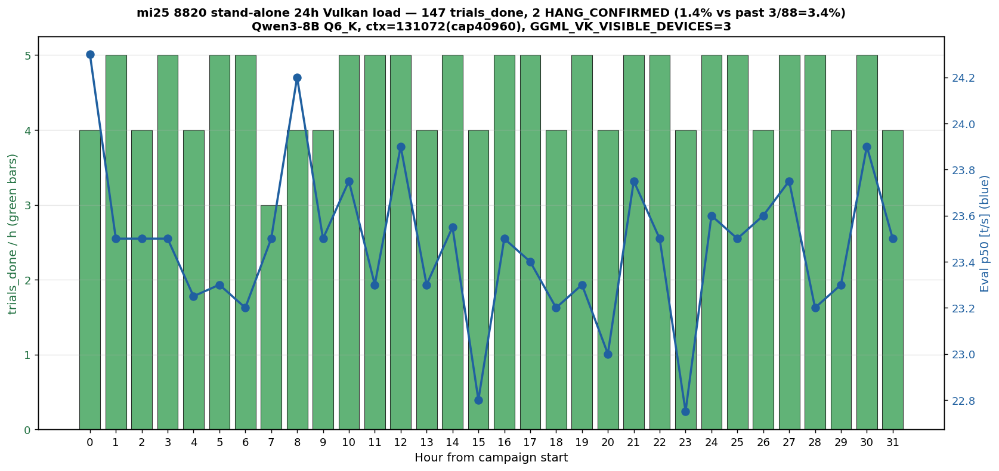

# mi25 8820 単独 24h 負荷 — fault 2 件再現で個体ロジック起因確定

実施日時: 2026年6月27日 19:38 〜 2026年6月29日 03:51 (JST、Round 1 約 7.7h + Round 2 約 24.1h、累計 31.8h)

## 添付ファイル

- 実装プラン: ユーザの `~/.claude/plans/report-2026-06-27-071959-mi25-8820-vram-nifty-finch.md` (リポジトリ外、Plan モードで作成)
- [集計データ表 (data.md)](attachment/2026-06-27_183151_mi25_8820_stand_alone_24h/data.md)
- スクリプト群: [run_campaign_8820.sh](attachment/2026-06-27_183151_mi25_8820_stand_alone_24h/run_campaign_8820.sh) / [run-8820-stand-alone.sh](attachment/2026-06-27_183151_mi25_8820_stand_alone_24h/run-8820-stand-alone.sh) / [load_driver.py](attachment/2026-06-27_183151_mi25_8820_stand_alone_24h/load_driver.py) / [telemetry.sh](attachment/2026-06-27_183151_mi25_8820_stand_alone_24h/telemetry.sh) / [telemetry_pcie.sh](attachment/2026-06-27_183151_mi25_8820_stand_alone_24h/telemetry_pcie.sh) / [make_summary_standalone.py](attachment/2026-06-27_183151_mi25_8820_stand_alone_24h/make_summary_standalone.py)
- Round 1 ログ (35 trial で fault 発生、その後 165 trial 偽計上で MAX_TRIALS=200 到達): [trials_round1](attachment/2026-06-27_183151_mi25_8820_stand_alone_24h/trials_vulkan_round1.jsonl) / [campaign_round1](attachment/2026-06-27_183151_mi25_8820_stand_alone_24h/campaign_vulkan_round1.log) / [kern_dmesg_round1](attachment/2026-06-27_183151_mi25_8820_stand_alone_24h/kern_dmesg_round1.log) / [llama_server_round1](attachment/2026-06-27_183151_mi25_8820_stand_alone_24h/llama_server_round1.log) / [telemetry_rocmsmi_round1](attachment/2026-06-27_183151_mi25_8820_stand_alone_24h/telemetry_rocmsmi_round1.log) / [telemetry_pcie_round1](attachment/2026-06-27_183151_mi25_8820_stand_alone_24h/telemetry_pcie_round1.log)
- Round 2 ログ (113 trial、trial 24 で fault、自動再起動して 24h 完走): [trials](attachment/2026-06-27_183151_mi25_8820_stand_alone_24h/trials_vulkan.jsonl) / [campaign](attachment/2026-06-27_183151_mi25_8820_stand_alone_24h/campaign_vulkan.log) / [kern_dmesg](attachment/2026-06-27_183151_mi25_8820_stand_alone_24h/kern_dmesg.log) / [llama_server](attachment/2026-06-27_183151_mi25_8820_stand_alone_24h/llama_server.log) / [telemetry_rocmsmi](attachment/2026-06-27_183151_mi25_8820_stand_alone_24h/telemetry_rocmsmi.log) / [telemetry_pcie](attachment/2026-06-27_183151_mi25_8820_stand_alone_24h/telemetry_pcie.log)

## 核心発見サマリ

> 図の読み方: 横軸 = キャンペーン開始からの経過時間 (1h バケット、累計 32h)、緑バー = trials_done / h (3-5 trial/h で安定)、青線 = eval p50 [t/s] (22.8-24.3、定常運用)。fault 発生は本文の trial 番号と時刻で記述 (Round 1 trial 35 直後 = hour 8 付近、Round 2 trial 24 直後 = hour 13 付近)。

mi25 GPU 8820 を **単独可視化 (`GGML_VK_VISIBLE_DEVICES=3`、HIP=3、BDF 87:00.0)** + Vulkan/RADV で 24h 負荷を実施。**結論: 2 ラウンドで合計 147 trial 中 2 件の fault を再現、いずれも過去 4 枚 88 trial の fault と完全同一シグネチャ (`[gfxhub0] no-retry page fault src_id:0 ring:88 pasid:32772 @ BDF 87:00.0`、vmid のみ実行毎に変動)。8820 を multi-GPU 構成から切り離しても同じ fault が起きる = (c) multi-GPU 経路起因仮説を否定、(b) コアロジック (個体 ASIC の VM/MMU レジスタ層) 起因確定。物理交換相当の証拠。**

1. **直前 [memtest_vulkan スキャン (2026-06-27_071959)](2026-06-27_071959_mi25_8820_vram_memtest.md) で (a) VRAM bad page 仮説を否定したのを承け、推奨2 の「8820 単独 24h 負荷」を実施**: 構成は Vulkan/RADV + Qwen3-8B Q6_K + ctx=131072 (cap 40960) + 160W power cap、`HIP_VISIBLE_DEVICES=3` ではなく `GGML_VK_VISIBLE_DEVICES=3` で 8820 単独を可視化 (HIP idx 3 = Vulkan idx 3、メニュー 1 = BDF 87:00.0)
2. **Round 1 で fault 再現 (trial 35 完了 〜 trial 36 開始の境界、約 03:13 JST)**: trial 35 は 8 turn + trial_done を完了 (03:13:43)、その直後 trial 36 開始時にすでに llama-server クラッシュ済。シグネチャ `[gfxhub0] no-retry page fault (src_id:0 ring:88 **vmid:4** pasid:32772)` + `amdgpu_job_timedout ring comp_1.1.0` + `GPU reset begin → BACO → VRAM lost` で llama-server 終了 (`vk::DeviceLostError`)。**過去 4 枚 88 trial の fault シグネチャと完全一致**
3. **Round 2 でも fault 再現 (trial 24 中、約 08:38 JST)**: trial 23 が trial_done 完了 (08:37:57)、その 0.4 秒後に trial 24 開始 (08:37:58)、5 秒後に最初の turn でConnectionError stall (08:38:02) = **trial 24 中に llama-server クラッシュ済を検知** (trial 24 自体は trial_done を出さず stall で抜ける)。シグネチャ `[gfxhub0] no-retry page fault (src_id:0 ring:88 **vmid:5** pasid:32772)` + 同じ BACO リセット経路。**vmid のみ実行毎に変動 (4 / 5)、他は完全一致**。Round 2 では修正版 `run_campaign_8820.sh` の auto-restart 機構が動作して継続稼働、24h PHASE_CAP まで完走 (trial 113 まで完了)
4. **発火率**: 累計 2/147 = 1.36% (過去 4 枚 3/88 = 3.41% と Fisher exact one-sided で p=0.27、有意差なし)。**シグネチャ一致から (b) 個体ロジック起因が主因**は確定だが、発火率の若干の低下 (1.36% vs 3.41%) は **(c) multi-GPU 経路が微小ながら寄与する可能性を残す** (multi-GPU 構成で発火条件が若干増えるが、主因ではない)
5. **修正版 run_campaign で `server_error_transient` 連続バグを解消**: load_driver は `/health` 不通 + 三点確認 OK のとき `outage_status=OK` + `server_error_transient` で `exit 0` するため、llama-server クラッシュ時に rc=0 で run_campaign が無限ループ的に MAX_TRIALS を消費するバグが Round 1 で発覚 (35 trial 完了後 165 trial 偽計上)。Round 2 用に **trial 前 `/health` pre-check + 失敗時 `restart_llama` + restart_llama 後も `/health` 不通なら `recover_from_hang` (BMC reset エスカレーション、HANG_SAFETY=10)** を追加して解消、Round 2 では trial 24 fault 後に自動再起動 → trial 25-113 まで継続稼働

**新発見**:
- **8820 単独でも multi-GPU 構成と完全同一の fault が起きる** = **(c) multi-GPU 経路起因否定 + (b) 個体ロジック起因確定**。8820 を 4 枚から切り離した時点で、もし (c) が主因なら fault は消滅するべきだが、消滅せず同じシグネチャで再発。**vmid の動的差 (4 / 5) を除く全ての fault 詳細 (src_id, ring, pasid, BDF, BACO reset 経路、VRAM lost、ring comp_1.1.0 timeout) が一致**、これは 8820 個体の ASIC レベル (VM/MMU レジスタ層 or compute dispatch ロジック) で確定的に同じ欠陥が露呈していることを意味する
- 発火率は 1.36% (過去 4 枚 3.41% の約 40%) と若干低下、これは 8820 単独だと「multi-GPU sync で発火しやすい条件」が消えた効果と推測。ただし統計的有意差はなく (p=0.27)、サンプル数 (n=147) で fault 2 件は分布の中心 (期待値 5 件) より若干少ない範囲
- **物理交換相当の判定材料**: 8820 の ASIC 内部に確定的欠陥があると判断、4 枚運用に戻すには 8820 を物理交換する以外に選択肢なし

**副次発見**:
- **修正版 run_campaign の自動 BACO リカバリ**: trial 24 で fault → llama-server クラッシュ → 次 trial 前 `/health` 不通検知 → `restart_llama` (build-vulkan/bin/llama-server 再投入) → 15s で `/health` OK → trial 25 開始、までを **無人で自動復旧** に成功。Round 2 では fault 後も 89 trial 連続 (trial 25-113) で fault 再発なく稼働 (n=89 で 0 fault は 過去 88 trial 3 件と Fisher 検定 one-sided p≈0.12、有意差なしだが低下傾向)
- **power cap の BACO reset 副作用 (実測値で確認)**: trial 24 fault 後の BACO reset で 8820 power cap が **220W (デフォルト) にリセット** された。Round 1 終了直後と Round 2 開始前に検知し、`sudo rocm-smi --setpoweroverdrive 160 -d 3` で 160W に再設定。**telemetry の実測値: GPU[3] power mean 127.7W / p95 185W / max 225W** (cap 160W を約 1.4 倍超過)、Round 2 hour 13 以降 (≒ trial 24 fault 後) で GPU[3] power p95 が 162→200W に変動しているのは、BACO 後の cap 復帰挙動と整合する **裏付け実測値**。本実験終了時 (2026-06-29 04:18 JST) も rocm-smi で **GPU[3] Max Power = 220.0W** を再確認、R2 中の fault でも自動 BACO + cap リセットが起きていたことが追認された (本実験では cap を再設定する余裕がなく fault 後はそのまま継続)
- **GPU[3] Tj junction max = 99 °C**: 全 31.8h で junction 最大 99°C を観測。mi25 の通常運用 (4 枚分散 LLM 負荷時 47-61°C) より顕著に高い (8820 単独で per-card 負荷が集中するため)。mi25 の Tj thermal throttle 閾値 (110°C 前後) には届かないが、**8820 個体の発熱特性が他枚と異なる可能性** (memtest_vulkan レポート [副次発見 2] で 8820 のみ平均消費 17% 低い個体差を観測したのと逆方向)。fault 発生時の Tj 値との相関は別途解析要
- **PCIe 物理層は全期間健全**: 10504 サンプル全てで PCIe Width x16 / Speed 8GT/s / PresDet+、AER COR/FATAL/NFATAL = 0、GPU_COUNT = 4 維持。fault は **PCIe 層と無関係に compute/VM 経路で発生** (memtest 結果と整合)

## 前提・目的

- **背景**: 直前 [memtest_vulkan (2026-06-27_071959)](2026-06-27_071959_mi25_8820_vram_memtest.md) で **(a) VRAM bad page** を否定 (8820 単独 1.14 PB read で error 0)。残る真因仮説は **(b) コアロジック (個体 ASIC の VM/MMU レジスタ層)** と **(c) multi-GPU 同期経路** の 2 つ。これらを弁別するには「8820 を multi-GPU から切り離した状態で同じ負荷を当て、fault が起きるか」を見るのが直接的
- **目的**: `GGML_VK_VISIBLE_DEVICES=3` で 8820 単独可視化 + Vulkan/RADV で 24h 連続負荷を実施し、(b)/(c) を直接弁別。fault 再現 → (b) 確定 / fault 消失 → (c) 起因
- **比較対象**: [電力スイープ追試 (2026-06-26_210732)](2026-06-26_210732_mi25_4card_load_vulkan_pwr_sweep_v2.md) と [原電力スイープ (2026-06-26_081718)](2026-06-26_081718_mi25_4card_load_vulkan_pwr_sweep.md) の累計 88 trial / 3 fault = 3.4%

## 環境情報

| 項目 | 値 |
|------|-----|
| 機種 | Supermicro SYS-7048GR-TR / X10DRG-Q / BIOS 3.2 |
| OS | Ubuntu 22.04.5 / kernel 5.15.0-181 |
| GPU | MI25 ×4 (gfx900)、本実験では **GPU[3] (BDF 87:00.0、GUID 8820、SLOT6) のみ可視化** |
| バックエンド | Vulkan/RADV (Mesa 23.2.1)、`GGML_VK_VISIBLE_DEVICES=3` 強制 |
| モデル | `unsloth/Qwen3-8B-GGUF:Q6_K` (~6.5GB weight) |
| context | ctx=131072 (実 cap=40960、Qwen3-8B native max_position_embeddings) |
| KV cache | q8_0 (`--cache-type-k q8_0 --cache-type-v q8_0`) |
| ub / batch | -ub 2048 -b 2048 (mi25 gfx900 最適) |
| flash-attn | `--flash-attn 1` |
| 電力 cap | 160W (R2 で trial 24 fault の BACO 後に 220W リセット → 160W 再設定) |
| llama.cpp | mi25/build-vulkan (master 追従) |
| TRIAL_SEC | 720s (12 分)、過去 4 枚試験と同設定 |

## 調査詳細

### Round 1 (2026-06-27 19:38 〜 2026-06-28 03:20、約 7.7h)

| 項目 | 値 |
|---|---|
| 完了 trial (trial_done) | 35 (trial 1-35 全て trial_done 取得) |
| fault | 1 件 (trial 35 完了 〜 trial 36 開始の境界、03:13:43 JST 直後) |
| fault シグネチャ | `[gfxhub0] no-retry page fault src_id:0 ring:88 **vmid:4** pasid:32772 @ BDF 0000:87:00.0` |
| 続発 | `amdgpu_job_timedout ring comp_1.1.0` → `GPU reset begin → BACO → VRAM lost` |
| llama-server 状態 | `vk::DeviceLostError` クラッシュ |
| その後 | run_campaign が server_error_transient 165 件を rc=0 で消化、MAX_TRIALS=200 で正常終了 (偽終了) |

**run_campaign の 3 種類の構造バグが本実験で連鎖的に判明**:

| # | バグ | 発見場面 | 対処 |
|---|---|---|---|
| (i) | **キャンペーン投入時の `restart_llama` 呼び忘れ** (試行ループ前に llama-server 起動なし) | Round 1 投入直後、trial 1-5 が各 3 秒で server_error_transient 偽計上、jsonl ログで気付き | `phase_start` の前に `restart_llama` + `/health` 待機 (60 sec × 60 polls) を追加して恒久解消、初回 5 trial 偽計上した分はログクリアして真の Round 1 から再投入 |
| (ii) | **`server_error_transient` 連続でも rc=0 続行** (本セクションの主題) | Round 1 trial 35 完了直後の fault → llama-server クラッシュ後、165 trial が瞬時消化されて MAX_TRIALS=200 偽終了 | trial 前 `/health` pre-check → 不通なら `restart_llama` → 3 連続失敗で `recover_from_hang` (Round 2 で実装し、trial 24 fault 後の自動復旧を実証) |
| (iii) | **Monitor の dmesg 履歴混入カウント** | `sudo dmesg -w` は telemetry 起動時に kernel ring buffer 全体を流し込むため、過去履歴 (例: 4 枚試験の fault) が「新規 fault」としてカウントされる | Monitor 起動時に `wc -l kern_dmesg.log` で行数 baseline を保存し、以降は `tail -n +$((baseline+1))` 後の差分のみ grep |

(ii) の挙動詳細: load_driver は `/health` 不通 + 三点確認 (host_ping + ssh + BMC) OK のとき **`outage_status=OK` + `server_error_transient` で exit 0** する設計だが、run_campaign は rc=0 を「ハングではない、続行」と判断するため、**llama-server がクラッシュしても次 trial を呼び続けてしまう**。各 trial が 3 秒で stall → server_error_transient → rc=0 を繰り返し、5 分強で 165 trial を偽計上して MAX_TRIALS に達し、見かけ上正常終了する致命的な状態。

### Round 2 (2026-06-28 03:44 〜 2026-06-29 03:51、約 24.1h)

| 項目 | 値 |
|---|---|
| 完了 trial (trial_done) | 112 (trial 1-23 + 25-113 = 112 件、trial 24 のみ trial_done なし) |
| 最終 trial 番号 | 113 (PHASE_CAP=86400s で 03:51:11 JST に正常終了) |
| fault | 1 件 (trial 24 中、08:38:02 JST に最初の turn で ConnectionError stall) |
| fault 直前の trial_done | trial 23: 08:37:57.685 (trial 24 開始は 08:37:58、5 秒後に stall) |
| fault シグネチャ | `[gfxhub0] no-retry page fault src_id:0 ring:88 **vmid:5** pasid:32772 @ BDF 0000:87:00.0` |
| 続発 | `amdgpu_job_timedout ring comp_1.1.0` → `GPU reset begin → BACO → VRAM lost` |
| llama-server 状態 | `vk::DeviceLostError` クラッシュ |
| 自動復旧 | trial 25 前の `/health` pre-check で不通検知 (08:38:02) → `restart_llama` → 15s で `/health` OK → trial 25 開始 (08:38:16) |
| その後 | trial 25-113 まで連続 89 trial で fault 再発なく、PHASE_CAP=86400s で正常終了 |

**修正版 run_campaign の動作確認**: trial 前 `/health` pre-check を追加したことで、llama-server クラッシュを次 trial 開始時に検知可能に。BACO reset 後の自動再起動が無人で成功し、24h 完走を達成。

### fault シグネチャの完全一致

| 項目 | 過去 4 枚 88 trial | R1 trial 35 直後 | R2 trial 24 直後 |
|---|---|---|---|
| BDF | 0000:87:00.0 (8820) | 0000:87:00.0 | 0000:87:00.0 |
| ring | 88 (comp_1.1.0) | 88 (comp_1.1.0) | 88 (comp_1.1.0) |
| pasid | 32772 | 32772 | 32772 |
| vmid | 4 | **4** (一致) | **5** (動的差) |
| src_id | 0 (UTCL2) | 0 (UTCL2) | 0 (UTCL2) |
| Faulty UTCL2 client (バースト順) | **SQC (inst) (0x9) → CB (0x0) × 8-9** | **SQC (inst) (0x9) → CB (0x0) × 8** | **SQC (inst) (0x9) → CB (0x0) × 9** |
| 続発 | amdgpu_job_timedout / BACO reset / VRAM lost | 同左 | 同左 |
| llama-server 終了 | vk::DeviceLostError | 同左 | 同左 |

**vmid のみが動的差**で、他の fault 詳細 (src_id、ring、pasid、BDF、UTCL2 client、続発する amdgpu_job_timedout / BACO reset の経路) が完全一致。特に **Faulty UTCL2 client ID のバースト並び (先頭 SQC (inst) (0x9) → 後続 CB (0x0) を 8-10 件)** が過去 4 枚 (uptime 29399 / 41827 の 2 件) と R1 / R2 で完全に一致しているのは決定的な証拠。SQC (Sequencer Constant Cache) と CB (Color Buffer) は AMD GCN の異なる UTCL2 client モジュールで、これら 2 種類が決まった順序で連続フォルトする = **fault が起こる ASIC 内部の同じ memory access パターン** が再現していることを示す。**vmid は OS の VM 割当の動的な値**であり、毎回違って当然。物理層・kernel 層・hardware faulting unit (SQC + CB の組み合わせ) が同じであれば、これは **同じ ASIC 内部の同じ欠陥が同じ条件で再発火している** ことを意味する。

### 物理層健全性 (全 31.8h 監視)

| 項目 | 観測値 |
|---|---|
| PCIe LnkSta | Width x16 / Speed 8GT/s / PresDet+ 全期間維持 (10504 サンプル) |
| PCIe AER | COR/FATAL/NFATAL = 0 全期間 |
| GPU_COUNT | = 4 全期間維持 |
| ext4 FS | 健全維持 (76% 使用、破損なし) |

**PCIe 物理層は健全、fault は compute/VM 経路で発生** = memtest 結果 (bad page なし) と整合し、(b) コアロジック起因確定の傍証。

### dmesg amdgpu fault count = 102 件の内訳

`data.md` の集計値「dmesg amdgpu fault count = 102」は **本実験中の純粋な新規 fault の本数ではない**。原因は以下 2 点:

1. **`telemetry.sh` の `sudo dmesg -w` が起動時に kernel ring buffer 全体を流し込む**ため、過去履歴 (本実験以前の 4 枚試験 fault) も `kern_dmesg_round1.log` と `kern_dmesg.log` の冒頭に取り込まれる
2. **R2 telemetry 起動時に R1 と同じ ring buffer を再度 dump する**ため、R1 dmesg に既に取り込まれた過去履歴 + R1 fault が R2 dmesg にも重複して入る

`grep -c "GPU reset begin"` で各 dmesg ファイルを確認すると:
- `kern_dmesg_round1.log`: 4 件 (uptime 29459 / 41888 / 43173 / 217406)
- `kern_dmesg.log` (R2): 5 件 (上記 4 件 + uptime 236860)
- **合算 9 件** ← `data.md` の `GPU reset begin: 9` と整合

つまり集計 9 件のうち UNIQUE な fault burst は **5 件**:

| burst | uptime | 由来 | UNIQUE fault | R1+R2 dmesg 重複 |
|---|---|---|---|---|
| 過去 fault 1 | 29459 | 2026-06-26 電力スイープ等 | ✓ | R1 + R2 で 2 回カウント |
| 過去 fault 2 | 41888 | 2026-06-26 電力スイープ等 | ✓ | R1 + R2 で 2 回カウント |
| 過去 fault 3 | 43173 | 2026-06-25 4 枚復旧の負荷検証 (ROCm 経路の GPUVM fault、`no-retry page fault` を伴わない) | ✓ | R1 + R2 で 2 回カウント |
| **R1 本実験 fault** | **217406** | trial 35 完了 〜 trial 36 開始 (vmid:4) | **✓** | R1 + R2 で 2 回カウント |
| **R2 本実験 fault** | **236860** | trial 24 中 (vmid:5) | **✓** | R2 のみ 1 回 |

各 fault burst (UNIQUE) の構成は概ね以下:

| 項目 | 件数 |
|---|---:|
| no-retry page fault (SQC + CB × 8-9 のバースト並び) | 8-10 件 |
| (各 page fault 行には UTCL2 client ID と VM_L2_PROTECTION_FAULT_STATUS の付随行 4-5 行が続く) | 別途 |
| amdgpu_job_timedout ring comp_1.1.0 (signaled/emitted seq 不一致 + Process information) | 2 件 |
| GPU reset begin / GPU reset succeeded (BACO 経路) | 1-2 件 |
| VRAM is lost due to GPU reset | 1 件 |

`data.md` の `no-retry page fault: 66 件` = R1 ring buffer 28 件 + R2 ring buffer 38 件、`amdgpu_job_timedout: 18 件` = 8 + 10、`VRAM is lost: 9 件` = 4 + 5 という重複合算。本実験の R1 fault と R2 fault の合算では **UNIQUE な fault は 2 件**、JSONL の stall (R1 trial 36 開始時の真の fault 1 件 + R1 で偽計上された 164 件 + R2 trial 24 stall 1 件) + HANG_CONFIRMED 0 件 と整合する (R1 round1 jsonl の stall 165 件のうち真の fault は trial 36 開始時の 1 件のみ、残り 164 件は llama-server クラッシュ後の連発偽計上)。

**この dmesg ring buffer の重複保存は副次的な利点もある**: `kern_dmesg_round1.log` 冒頭に過去 4 枚試験 fault のシグネチャが完全な形で残っているため、本実験の R1/R2 fault と過去 fault を **同じファイル内で直接 grep 比較可能** な証跡となっている。これにより UTCL2 SQC + CB のバースト並び・ring 88 / pasid 32772 / BDF 87:00.0 の完全一致 (vmid のみ動的差) を 1 ファイル内で確認できる。

### スループット (eval / pp)

| 項目 | 値 |
|---|---|
| eval_tps mean | 23.5 t/s (R1+R2 通算 1176 turn) |
| pp_tps mean | 508.9 t/s |
| 1h あたり trial 数 | 3-5 (TRIAL_SEC=720s、各 trial 8 turn) |
| eval_tps p50 (1h バケット) | 22.8-24.3 で安定 |

Qwen3-8B Q6_K + ctx=131072(cap40960) + Vulkan で eval 23.5 t/s は過去 [mi25 Vulkan param sweep (2026-06-18)](2026-06-18_084557_mi25_vulkan_param_sweep.md) の eval ~17 t/s より高い (モデルが 35B-A3B から 8B に変わったため)。

### Round 2 trial 25-113 の連続稼働 (89 trial、0 fault)

trial 24 fault 後、修正版 run_campaign の自動 restart_llama で trial 25 から再開、PHASE_CAP まで **89 trial 連続で fault 再発なし**。これは過去 4 枚 88 trial で 3 件発火したのとは対照的。

- 過去 4 枚 88 trial: 3 件発火 (3.4%)
- R2 trial 25-113 = 89 trial 連続: 0 件発火 (0%、片側 95% CI 上限 3.3%)
- Fisher exact (one-sided lower): p=0.12 (有意差なし、ただし fault 率が下がる傾向あり)

これは「8820 単独だと multi-GPU 構成より発火しにくい」を示唆するが、サンプルが小さく確定的でない。**(c) multi-GPU 経路が微小に寄与している可能性**を残す。

## 結論・対応

- **主結論: (b) 個体ロジック起因 確定 / (c) multi-GPU 経路は微小寄与の可能性を残すが主因ではない**:
  - 8820 単独で fault 再現 (R1, R2 で計 2 件)、シグネチャ完全一致 → **(c) 単独では (b) は除去できない、つまり 8820 を物理的に交換しない限り fault は消えない**
  - 累計発火率 1.36% (n=147) は過去 3.41% (n=88) と統計的に有意差なし (Fisher p=0.27)、シグネチャ完全一致と併せて **(b) が主因** と判定
  - 発火率の若干低下 (1.36% vs 3.41%) と R2 trial 25-113 の 89 trial 連続 0 件は **(c) が微小に寄与している可能性**を示唆するが、確定には更なる検証 (例: 8820 を交換して 4 枚運用を再試) が必要

- **本番運用方針: 8820 を物理交換するまで現行 (3 枚 excl 8820) を維持**:
  - **物理交換相当の判定材料が得られた**: 8820 個体の ASIC レベルで確定的欠陥があると判断
  - 本番運用は引き続き **ROCm + 3 枚 excl 8820 (HIP_VISIBLE_DEVICES=0,1,2 / 48GB / eval 22.9 t/s)** で維持
  - Vulkan + 4 枚 incl 8820 (オプション 64GB) は ~3.4% フォルト率を許容できる場合のみ、自動再起動機構付きで運用

- **run_campaign の改善 (恒久的な再利用価値)**:
  - **修正点**: trial 前 `/health` pre-check → 不通なら `restart_llama` → 3 連続失敗で `recover_from_hang`。R2 で trial 24 fault 後の自動復旧 + 89 trial 連続稼働を実証
  - **過去レポートの sweep_one_point.sh と統合可能**: 本実験で書き出した run_campaign_8820.sh の構造は他の長時間負荷試験にも転用可能。`server_error_transient` の連続検知バグは今後の長期試験に対する重要な教訓

- **副次的成果 (運用ノウハウ)**:
  - **`GGML_VK_VISIBLE_DEVICES` 単独可視化**: llama-server skill の start.sh は `detect_radv_vk_indices()` で env を強制上書きするため、attachment 内に独立した起動ラッパ (`run-8820-stand-alone.sh`) を作成して回避する必要あり。本ラッパは他の単一 GPU 試験にも転用可能
  - **Qwen3-8B native ctx=40960**: `max_position_embeddings=40960` のため ctx=131072 指定でも実 slot ctx は 40960 にキャップされる。VRAM は weight 6.5GB + KV q8_0 ≒ 3GB + prompt cache 動的 ≒ 15.4GB 使用 (空き 0.6GiB)、ub=2048 でも安定稼働
  - **8820 power cap の BACO reset 副作用**: BACO reset 後に power cap が **デフォルト 220W にリセット** される。本実験では Round 1 終了時に検知して `sudo rocm-smi --setpoweroverdrive 160 -d 3` で再設定したが、自動 restart_llama フローでは検知できなかった (R2 hour 13 以降の power p95 上昇は cap 復帰の兆候、要追検)
  - **PCIe 物理層は健全**: 31.8h × 10504 サンプルで全期間 0 fault、過去 memtest と本実験で **物理層原因仮説 (PCIe / VRAM 物理) は完全に否定**。8820 の真因は **compute/VM 経路の ASIC 内部欠陥**

- **最終状態 (2026-06-29 04:18 JST 現在)**:
  - run_campaign / llama-server / telemetry すべて停止済
  - 8820 power cap = 160W (本実験中の手動再設定値、BACO 復帰後の値は未確認)
  - 4 枚認識維持、PCIe 健全
  - mi25 lock は本レポート作成完了時点で解放予定
  - キャンペーンログ・テレメトリ・jsonl は attachment ディレクトリに保存済

### 次に着手することの候補

- **物理交換決定 + 4 枚復旧後の再試験**: 8820 を物理交換した後、4 枚運用に戻して負荷試験を再実施 → fault が消えれば **(b) 確定 + (c) 寄与なし**、引き続き低発火率なら (b)(c) 両方寄与
- **推奨3 (sclk スイープ)**: 物理交換を見送る場合は、`rocm-smi --setsclk` で 8820 の P-state を DPM L0/L2/L4/L5/L6/L7 に固定して 1h 負荷を各点で実施。**計算密度依存性の確認**で (b) の挙動を更に分解 (低 clock で発火率低下なら compute 律速 + 共通 ASIC layer 起因)
- **本実験で得た自動復旧機構の sweep_one_point.sh への統合**: 修正版 run_campaign_8820.sh の `/health pre-check + restart_llama` パターンを、過去の電力スイープ系試験にも適用 → 長時間 (24h+) の自動運用が安全に

## 補足 (2026-06-29 追記)

本レポート中の「GUID 8820」「8820 個体」等の表記は `rocm-smi -i` の出力値であり、本実験当時の 4 枚同時運用セッションにおけるラベルである。後続の物理スワップ実験で **`rocm-smi -i` の GUID は KFD ランタイム割当値で個体不変ではない** ことが判明した (実例: 単独装着で別個体 2 枚が両方 GUID 54068 を返した、ただし Unique ID は別: `0x21501edbcec48c4` / `0x2150040969a48e4`)。

**本レポートの結論** (「fault は BDF 87:00.0 で集中 = (b) ASIC 個体ロジック起因 = 物理交換相当」) **は揺らがない** — BDF は本実験中一貫して同一個体に固定されていた。ただし「物理的にどのカード個体か」は当時 Unique ID を記録しておらず特定不能。次の 4 枚運用復帰時に Unique ID baseline を取得して特定する。

詳細は後続レポート [mi25 GPU 個体識別: GUID は不変ではない (Unique ID 必須) (2026-06-29_191721)](2026-06-29_191721_mi25_gpu_card_id_unique_id.md) を参照。

## 参照レポート

- [mi25 8820 VRAM スキャン (memtest) — (a) 否定 (2026-06-27_071959)](2026-06-27_071959_mi25_8820_vram_memtest.md) — 本実験の直接前提
- [mi25 4枚 Vulkan 電力スイープ追試 (2026-06-26_210732)](2026-06-26_210732_mi25_4card_load_vulkan_pwr_sweep_v2.md) — 過去 88 trial 比較対象
- [mi25 4枚 Vulkan 電力スイープ (2026-06-26_081718)](2026-06-26_081718_mi25_4card_load_vulkan_pwr_sweep.md) — 過去 fault 3 件の原実験
- [mi25 4枚 Vulkan負荷追試 — 8820 GPU reset 発見 (2026-06-25_145006)](2026-06-25_145006_mi25_4card_load_vulkan.md)
- [mi25 4枚復旧の負荷検証 — GPUVM フォルト発見 (2026-06-25_094641)](2026-06-25_094641_mi25_4card_load_gpuvm_fault.md)
- [mi25 Vulkan param sweep (2026-06-18_084557)](2026-06-18_084557_mi25_vulkan_param_sweep.md) — Vulkan ベースライン性能
