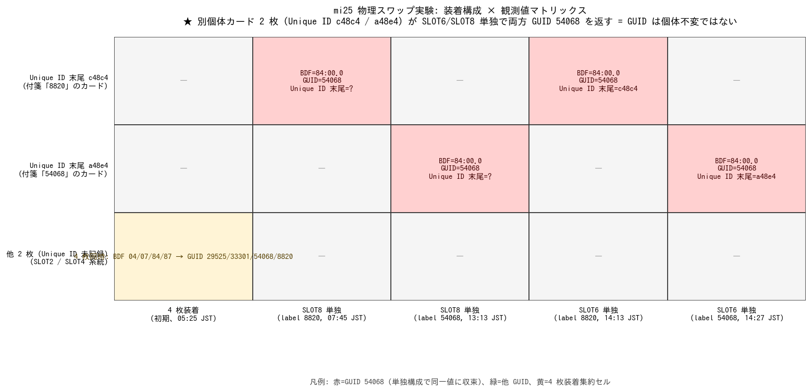

# mi25 GPU 個体識別: GUID は不変ではない (Unique ID 必須)

- **実施日時**: 2026年6月29日 05:04 〜 14:27 JST (約 9 時間 23 分、約 12 回シャットダウン+物理スワップ+確認)

## 添付ファイル

- [実装プラン](attachment/2026-06-29_191721_mi25_gpu_card_id_unique_id/plan.md)
- [装着試行タイムライン (jsonl 抽出)](attachment/2026-06-29_191721_mi25_gpu_card_id_unique_id/swap_timeline.md)
- [GUID/Unique ID 観測スナップショット (6 件)](attachment/2026-06-29_191721_mi25_gpu_card_id_unique_id/rocm_smi_snapshots/)
- [SMBIOS Type 9 出力](attachment/2026-06-29_191721_mi25_gpu_card_id_unique_id/smbios_slot_map.txt)
- [PCIe tree (lspci -tnnv)](attachment/2026-06-29_191721_mi25_gpu_card_id_unique_id/lspci_tnnv.txt)
- [summary.png 生成スクリプト](attachment/2026-06-29_191721_mi25_gpu_card_id_unique_id/make_summary.py)

## 核心発見サマリ



**`rocm-smi -i` の GUID 値は KFD ランタイム割当値であり、カード個体不変ではない**。

| 装着構成 | 観測 BDF | 観測 GUID | Unique ID 末尾 4 桁 |
|---|---|---|---|
| 4 枚装着 (05:25 JST) | 04:00.0 / 07:00.0 / 84:00.0 / 87:00.0 | 29525 / 33301 / 54068 / 8820 | (Unique ID 未取得) |
| SLOT8 単独・付箋「8820」(07:45 JST) | 84:00.0 | **54068** | (Unique ID 未取得) |
| SLOT8 単独・付箋「54068」(13:13 JST) | 84:00.0 | **54068** | (Unique ID 未取得) |
| SLOT6 単独・付箋「8820」(14:13 JST) | 84:00.0 | **54068** | **0x21501edbcec48c4** (`c48c4`) |
| SLOT6 単独・付箋「54068」(14:27 JST) | 84:00.0 | **54068** | **0x2150040969a48e4** (`a48e4`) |

**観測決定打**: 末尾 `c48c4` と `a48e4` が **異なる Unique ID** であることから 2 枚は物理的に**別個体**と確定。にもかかわらず、SLOT6 単独・SLOT8 単独のいずれにおいても両カードとも `BDF=84:00.0` / `GUID=54068` を返した。**= GUID 値は (BDF + KFD allocation) で決まりカード個体不変ではない**。

**カード個体不変の識別子は `rocm-smi --showuniqueid` の Unique ID** (ASIC 内部レジスタの不変値)。

## 前提・目的

- **背景**: 直前の [8820 stand-alone 24h レポート (2026-06-29 04:17)](2026-06-29_041700_mi25_8820_stand_alone_24h.md) で「(b) 個体ロジック起因確定 = 8820 物理交換相当」と結論。**物理的にどのカードを交換すべきか** を特定するため物理スワップを開始
- **目的**: 「真の故障個体」の物理特定。8820 と 54068 の付箋ラベルカードを SLOT6 / SLOT8 単独装着で順次確認し、過去 fault 集中個体 (BDF 87:00.0 = 当時 SLOT6 = GUID 8820) に対応する物理カードを特定する
- **前提条件**:
  - 過去 4 枚運用時の各カード Unique ID は未記録 (`report/attachment/` 全文 grep で `rocm-smi --showuniqueid` 出力 0 件) → BDF と GUID のみが過去レポート群の個体識別子
  - ユーザは過去のセッションで「8820」「54068」の付箋ラベルを物理カードに貼付済 (取り外し後の貼り替えなし)

## 環境情報

- **サーバ**: mi25 (10.1.4.13)、Supermicro X10DRG-Q / SYS-7048GR-TR、CPU 2 ソケット
- **GPU**: MI25 (Vega 10 / gfx900) × 4 (HIP_VISIBLE_DEVICES=0,1,2,3 時)
- **OS**: Ubuntu (mi25 host)、ROCm 環境、Vulkan/RADV 利用可
- **PCIe マッピング** (今回 SMBIOS dmidecode + lspci -tnnv で確認):
  - CPU1 SLOT2 = root 00:02.0 → GPU 04:00.0
  - CPU1 SLOT4 = root 00:03.0 → GPU 07:00.0
  - CPU2 SLOT6 = root 80:03.0 → MI25 upstream 82:00.0 → downstream 83:00.0 → GPU 84:00.0 (本実験中、現状)
  - CPU2 SLOT8 = root 80:02.0 → MI25 upstream 85:00.0 (推定) → GPU 87:00.0 (4 枚装着時に限る)
- **BMC**: 10.1.4.7 (IPMI)、`gpu-server` スキルの `bmc-power.sh` 経由で操作

## 再現方法

物理スワップは 1 回ごとに以下のサイクルを実施 (約 12 回繰り返し):

```bash
# 1. シャットダウン
.claude/skills/gpu-server/scripts/bmc-power.sh mi25 soft
# (Monitor で off 待機)

# 2. ユーザがカード/スロット差し替え (物理作業)

# 3. 電源投入
.claude/skills/gpu-server/scripts/bmc-power.sh mi25 on

# 4. SSH 復帰待ち + 確認 (GUID と Unique ID 両方を取得)
ssh mi25 'lspci | grep -cE "Vega 10 \[Instinct"
          lspci -nn | grep -E "VGA|Vega 10 \[Instinct"
          rocm-smi -i 2>/dev/null | grep -E "GPU\[|GUID:|Subsystem"
          rocm-smi --showuniqueid 2>/dev/null | grep -E "GPU\[|Unique"
          sudo dmidecode -t 9 | grep -E "(Designation|Current Usage|Bus Address)"
          lspci -tnnv | grep -E "Vega 10|Instinct"'
```

詳細時系列は [swap_timeline.md](attachment/2026-06-29_191721_mi25_gpu_card_id_unique_id/swap_timeline.md) を参照。

## 観測データ

### 全装着試行の観測結果

| 時刻 (JST) | 装着内容 (ユーザ報告) | 観測枚数 | 観測 GUID (BDF 順) | Unique ID |
|---|---|---:|---|---|
| 05:25 | 4 枚装着 (SLOT2/4/6/8 初期 swap 直後) | 4 | GPU[0]=29525 / [1]=33301 / [2]=54068 / [3]=8820 | 未取得 |
| 07:37 | 4 枚装着 (再起動後) | 0 | (起動失敗) | — |
| 07:45 | SLOT8 単独・付箋「8820」 | 1 | GPU[0]=54068 (BDF 84:00.0) | 未取得 |
| 07:59 | 2 枚装着 (SLOT6 + 別) | 2 | 取得失敗 | — |
| 08:33 | SLOT8 単独 (差し直し後) | 1 | GPU[0]=54068 (BDF 84:00.0) | 未取得 |
| 13:13 | SLOT8 単独・付箋「54068」 | 1 | GPU[0]=54068 (BDF 84:00.0) | 未取得 |
| 13:23 | SLOT8 単独 (差し直し後) | 1 | GPU[0]=54068 (BDF 84:00.0) | 未取得 |
| 13:29 | SLOT8 単独 (差し直し後) | 1 | GPU[0]=54068 (BDF 84:00.0) | 未取得 |
| 13:33 | SLOT8 単独 (差し直し後) | 1 | GPU[0]=54068 (BDF 84:00.0) | 未取得 |
| 13:41 | SLOT6 単独・付箋「54068」 | 1 | GPU[0]=54068 (BDF 84:00.0) | 未取得 |
| **14:13** | **SLOT6 単独・付箋「8820」** | 1 | GPU[0]=54068 (BDF 84:00.0) | **`0x21501edbcec48c4`** |
| **14:27** | **SLOT6 単独・付箋「54068」** | 1 | GPU[0]=54068 (BDF 84:00.0) | **`0x2150040969a48e4`** |

### 重要な単独装着時の rocm-smi 出力

スナップショット 6 件を [rocm_smi_snapshots/](attachment/2026-06-29_191721_mi25_gpu_card_id_unique_id/rocm_smi_snapshots/) に保存。代表 2 件:

```
# 14:13 SLOT6 単独・付箋「8820」
GPU[0]   : GUID:    54068
GPU[0]   : Unique ID: 0x21501edbcec48c4

# 14:27 SLOT6 単独・付箋「54068」
GPU[0]   : GUID:    54068
GPU[0]   : Unique ID: 0x2150040969a48e4
```

**Unique ID は完全に異なる = 物理的に別個体**。にもかかわらず BDF と GUID は完全一致。

## 解釈

### 1. `rocm-smi -i` の GUID 値の正体

- `rocm-smi -i` で表示される `GUID:` は **KFD (Kernel Fusion Driver) の render node ID** に由来する値で、Linux カーネル起動時の PCIe enumeration 順と amdgpu 初期化順で割り当てられる
- 同じカードでも、BDF が異なる位置に挿せば異なる GUID 値、装着順を変えれば別の値、と動的に変動する
- 単独装着時は **Subsystem ID = Radeon PRO V320** が両カードで共通であり、KFD が同じ allocation 値 `54068` に収束する仮説 (どちらのカードを SLOT6/SLOT8 単独で挿しても同じ GUID)

### 2. `rocm-smi --showuniqueid` の Unique ID は不変

- `Unique ID: 0x{16 文字 hex}` は **ASIC 内部レジスタの不変値** (おそらく SoC ID / DID + chip serial の合成値)
- 物理カードに対し 1:1 で対応し、構成変更・スロット移動でも変わらない
- 過去レポートで個体識別子として扱うべきはこちらだった

### 3. 過去 4 枚運用時の各カード Unique ID は未記録

- `report/attachment/` 全文 grep で `rocm-smi --showuniqueid` 出力は 0 件
- 4 枚運用時の (BDF 87:00.0 / GUID 8820) に対応する物理カードの Unique ID は不明
- → **今手元の 2 枚 (Unique ID `c48c4` / `a48e4`) のどちらが過去の fault 集中個体か特定不能**

### 4. SMBIOS Type 9 と GPU 本体 BDF の関係

- SMBIOS の `Bus Address` は MI25 カード内蔵 **upstream bridge** の bus 番号
- 例: SMBIOS CPU2 SLOT6 = `0000:82:00.0` (= upstream bridge) → MI25 内蔵 downstream `83:00.0` → 実際の GPU 本体 `84:00.0`
- したがって SMBIOS の `Bus Address` ≠ GPU 本体 BDF。SLOT↔GPU BDF の正しいマッピングには `lspci -tnnv` で PCIe tree を辿る必要

### 5. BDF も装着構成依存

- 4 枚装着時 (05:25): 84:00.0 と 87:00.0 が両方使われる (それぞれ SLOT8 / SLOT6 に対応する別の CPU2 root port 配下)
- 単独装着時: SLOT6 単独でも SLOT8 単独でも 同じ `BDF=84:00.0` で認識される (= PCIe enumeration の bus 割当が動的)
- 過去レポートの「BDF 87:00.0 = SLOT6」は 4 枚運用時のみ有効

### 6. カード識別子の比較 (まとめ)

mi25 で観測可能なカード識別子と、その装着構成依存性を整理:

| 識別子取得方法 | 取得例 | 装着構成依存 | カード個体不変 | 用途 |
|---|---|:---:|:---:|---|
| `rocm-smi -i` の `GUID` | `54068` | **依存** | ✗ | 当該セッション内ラベル (過去レポート群) |
| `rocm-smi -i` の `PCI Bus` (BDF) | `0000:84:00.0` | **依存** | ✗ | 起動毎の PCIe enumeration 値、4 枚運用時のみ 84/87 分離 |
| `lspci -nn` の Vendor / Device / Subsystem ID | `1002:6860` / Radeon PRO V320 | ✗ | 4 枚全て同一 (区別不能) | 機種判定のみ |
| **`rocm-smi --showuniqueid`** | `0x21501edbcec48c4` | ✗ | **○ (ASIC 焼込み値)** | **個体識別の正規手段** |

**結論**: 上 3 行 (GUID / BDF / PCI ID) はいずれも個体不変ではない。**`--showuniqueid` の Unique ID のみが ASIC 内部レジスタの不変値として個体識別に使える**。これが本レポート全体の核心 (再掲)。

## 過去レポートへの影響と読み替えガイド

| 項目 | 過去レポートの記述 | 本レポート判明後の解釈 |
|---|---|---|
| 「GUID 8820」「8820 個体」「8820 が fault」 | カード固有 ID として使用 | **当時のセッションでの rocm-smi -i 出力値**。カード個体不変ではない。物理カード特定には Unique ID が必要 |
| 「BDF 87:00.0 = SLOT6 = fault 集中」 | 4 枚運用時の事実 | **4 枚運用時の特定 PCIe enumeration 配下では正しい**。BDF は装着構成依存 |
| 「(b) 個体ロジック起因確定」 | 8820 カードの ASIC 欠陥 | **結論は不変**。fault は本実験中一貫して同一の物理スロット系統 (4 枚運用時 BDF 87:00.0) に集中していた。ただし「物理的にどのカード」は Unique ID 記録欠落により今は特定不能 |
| 「物理交換相当」 | 8820 個体の交換が必要 | **不変**。ただし「どの物理カードを交換すべきか」は 4 枚運用復帰時の Unique ID baseline 取得まで保留 |

## 今後の運用変更

- **認識確認では必ず `rocm-smi --showuniqueid` を併記して記録** (`boot_state.log` 等)
- **レポート/メモリでカードを呼ぶときは Unique ID 末尾 4 桁等で略記** (例: `card-c48c4` / `card-a48e4`)、衝突した場合は 6 桁に拡張
- **既存レポートの「GUID 8820 / 54068 / 33301 / 29525」は変更しない**、当時のセッション値として読み替える注釈は本レポートと CLAUDE.md の運用ルールでカバー
- **物理スワップ前後で Unique ID で必ず照合**、BDF / GUID では追跡不能

## 残課題

- **4 枚運用復帰時の Unique ID baseline 取得**: 4 枚同時装着で各 BDF/SLOT/GUID/Unique ID を `boot_state.log` に保存し、固定リファレンスとする
- **過去 fault 個体の Unique ID 特定**: baseline 取得後、過去の「BDF 87:00.0 = 当時 SLOT6 = fault 集中個体」に対応する Unique ID を確定 → その時点で物理交換対象が一意に決まる
- **`rocm-smi -i` GUID の生成方式の正確な仕様調査**: 本レポートは「KFD allocation 由来で構成依存」を仮説として提示したが、ROCm のソース確認による厳密な裏取りは別途
- **当面の運用方針 (3 枚 / 48GB / ROCm) は不変**: 4 枚運用復帰までは `HIP_VISIBLE_DEVICES=0,1,2` で運用継続

## 参照レポート

- 直前の [8820 stand-alone 24h レポート (2026-06-29_041700)](2026-06-29_041700_mi25_8820_stand_alone_24h.md) — 本実験の直接前提
- [4枚復旧の負荷検証 (2026-06-25_094641)](2026-06-25_094641_mi25_4card_load_gpuvm_fault.md) — 「8820 物理対応必要」の根拠
- [4枚復旧 Vulkan 追試 (2026-06-25_145006)](2026-06-25_145006_mi25_4card_load_vulkan.md)
- [4枚 Vulkan 電力スイープ (2026-06-26_081718)](2026-06-26_081718_mi25_4card_load_vulkan_pwr_sweep.md)
- [4枚 Vulkan 電力スイープ追試 (2026-06-26_210732)](2026-06-26_210732_mi25_4card_load_vulkan_pwr_sweep_v2.md) — 過去 88 trial 比較対象
- [memtest_vulkan / (a) 否定 (2026-06-27_071959)](2026-06-27_071959_mi25_8820_vram_memtest.md)
- メモリ `project_mi25_gpu4_pcie_dropout` (Claude Code セッション間共有) — 2026-06-29 エントリで本レポートを参照
