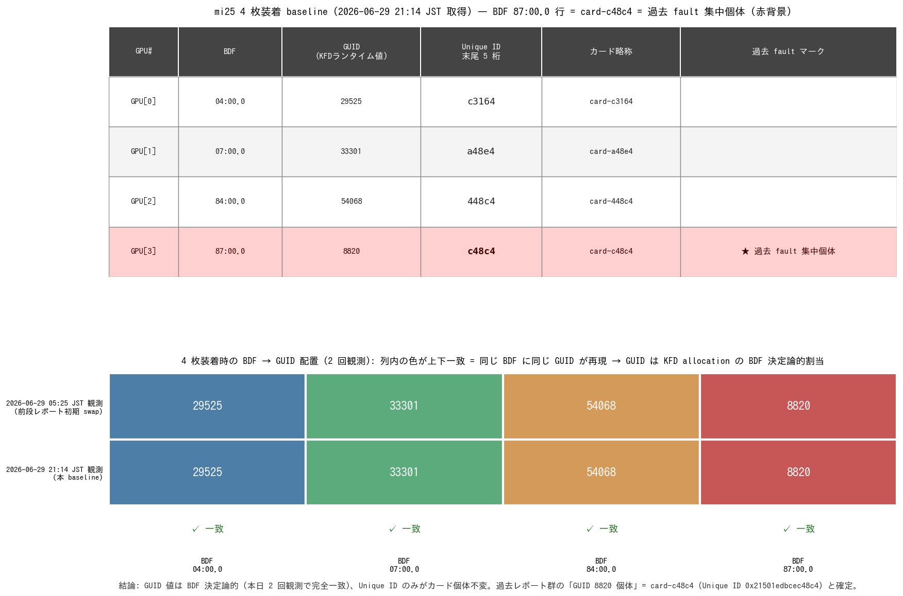

# mi25 4枚baseline取得 — 過去fault個体 c48c4 のUnique ID確定

- **実施日時**: 2026年6月29日 19:25 〜 21:36 JST (約 2 時間 11 分、SLOT6 単独 4 回スワップ + 4 枚装着 baseline + レポート作成)

## 添付ファイル

- [実装プラン](attachment/2026-06-29_213624_mi25_4card_uniqueid_baseline/plan.md)
- [4 枚装着 baseline (rocm-smi 生出力)](attachment/2026-06-29_213624_mi25_4card_uniqueid_baseline/4card_baseline.txt)
- [SLOT6 単独 4 回スワップ生出力まとめ](attachment/2026-06-29_213624_mi25_4card_uniqueid_baseline/single_slot6_swaps.txt)
- [summary.png 生成スクリプト](attachment/2026-06-29_213624_mi25_4card_uniqueid_baseline/make_summary.py)

## 核心発見サマリ



- **全 4 枚の Unique ID baseline 取得完了** — `card-c3164` / `card-a48e4` / `card-448c4` / `card-c48c4` の 4 個体を Unique ID で一意に追跡可能に
- **過去 fault 集中個体 = `card-c48c4` (Unique ID `0x21501edbcec48c4`) と確定** (4 枚運用時 BDF 87:00.0 = GUID 8820 = この Unique ID の対応が baseline で一意化)
- **GUID は BDF 決定論的の決定的証拠**: 本日 05:25 JST と 21:14 JST の 2 回の 4 枚装着観測で 4 BDF すべての GUID 割当が完全一致 (4 BDF × 2 観測 = 8/8 セル一致)、KFD allocation の BDF 由来仮説を確証
- **末尾 4 桁では衝突** (`card-c48c4` と `card-448c4` がいずれも `48c4`)、**末尾 5 桁で全 4 枚一意** → 略称命名規約を末尾 5 桁基本に更新
- 物理交換対象が一意に確定 → 4 枚 64GB 復帰には `card-c48c4` の**物理交換**が必要 (stand_alone 24h で (b) 個体ロジック起因確定済のため SLOT 移動では救えない)

## 前提・目的

- **背景**: 直前の [2026-06-29_191721_mi25_gpu_card_id_unique_id.md](2026-06-29_191721_mi25_gpu_card_id_unique_id.md) で「`rocm-smi -i` の GUID は KFD ランタイム割当値で個体不変ではない、`rocm-smi --showuniqueid` の Unique ID のみが正規」と判明。同レポートの残課題として「4 枚運用復帰時の Unique ID baseline 取得」「過去 fault 集中個体 (4 枚運用時 BDF 87:00.0) の Unique ID 特定」が残っていた
- **目的**:
  1. 全 4 枚 GPU の Unique ID を取得し、今後の物理スワップで照合可能な baseline を確立
  2. 過去 fault 集中個体 (= 過去レポート群の「GUID 8820」「BDF 87:00.0」) に対応する物理カードを **Unique ID 単位で確定**
  3. GUID の BDF 決定論性 (= 物理カード不変ではない) を 4 枚装着の 2 回観測で再確認
- **前提条件**:
  - 直前レポートで既に Unique ID 既知の 2 枚: `card-c48c4` (旧付箋「8820」) / `card-a48e4` (旧付箋「54068」)
  - 未取得の 2 枚 (旧 GUID 29525 / 33301 相当) の Unique ID 取得が必要
  - 作業中にユーザがすべての付箋を Unique ID 末尾 5 桁ラベルに貼り替え

## 環境情報

- **サーバ**: mi25 (10.1.4.13)、Supermicro X10DRG-Q / SYS-7048GR-TR、CPU 2 ソケット
- **GPU**: MI25 (Vega 10 / gfx900) × 4 (4 枚装着時)
- **OS**: Ubuntu (mi25 host)、ROCm 環境
- **PCIe マッピング (4 枚装着時、本日 21:14 JST 観測)**:
  - GPU[0] = BDF `04:00.0` (CPU1 SLOT2 系統)
  - GPU[1] = BDF `07:00.0` (CPU1 SLOT4 系統)
  - GPU[2] = BDF `84:00.0` (CPU2 SLOT6 系統)
  - GPU[3] = BDF `87:00.0` (CPU2 SLOT8 系統 — 4 枚装着時のみ出現)
- **BMC**: 10.1.4.7 (IPMI)、`gpu-server` スキルの `bmc-power.sh` 経由で操作

## 再現方法

物理スワップ + Unique ID 取得サイクル (本セッションで合計 5 回実施):

```bash
# 1. シャットダウン (毎サイクル)
.claude/skills/gpu-server/scripts/bmc-power.sh mi25 soft

# 2. ユーザがカード/スロット差し替え (物理作業)

# 3. BMC 復帰待機 (off ステータス取得) + 電源投入
.claude/skills/gpu-server/scripts/bmc-power.sh mi25 status
.claude/skills/gpu-server/scripts/bmc-power.sh mi25 on

# 4. SSH 復帰待機 + 4 種類の取得コマンドを実行
ssh mi25 'lspci | grep -cE "Vega 10 \[Instinct";
          lspci -nn | grep -E "Vega 10 \[Instinct";
          rocm-smi -i 2>/dev/null | grep -E "GPU\[|GUID|Subsystem";
          rocm-smi --showuniqueid 2>/dev/null;
          rocm-smi --showbus 2>/dev/null'
```

本セッションでは SLOT6 単独装着を 4 回 (20:17 / 20:30 / 20:55 / 21:03 JST) + 4 枚同時装着 1 回 (21:14 JST) を実施。詳細は [single_slot6_swaps.txt](attachment/2026-06-29_213624_mi25_4card_uniqueid_baseline/single_slot6_swaps.txt) / [4card_baseline.txt](attachment/2026-06-29_213624_mi25_4card_uniqueid_baseline/4card_baseline.txt) 参照。

## 観測データ

### テーブル A: SLOT6 単独装着 4 回スワップ

すべて 1 枚装着、BDF は全て `0000:84:00.0`、GUID は全て `54068` を返したが Unique ID は 4 種で異なる:

| 時刻 (JST) | Unique ID | 末尾 5 桁 | カード略称 | (装着前の旧付箋) |
|---|---|---|---|---|
| 20:17 (前セッション残置) | `0x2150040969a48e4` | `a48e4` | `card-a48e4` | 「54068」 |
| 20:30 | `0x21501edbcec48c4` | `c48c4` | `card-c48c4` | 「8820」 |
| 20:55 | `0x215026e14c448c4` | `448c4` | `card-448c4` | (旧 GUID 29525 or 33301、本セッションで未確定) |
| 21:03 | `0x2150172bdcc3164` | `c3164` | `card-c3164` | (旧 GUID 29525 or 33301、本セッションで未確定) |

**観測の含意**:

- 同じ BDF (`84:00.0`) / 同じ GUID (`54068`) を 4 種の別個体カードが返した = GUID/BDF はカード個体不変ではない (前段レポートの結論を 4 個体すべてで再確認)
- **20:17 JST の `card-a48e4` 観測は前段レポート 14:27 JST 「SLOT6 単独・付箋「54068」」と物理的に同一の装着構成** で、両者とも Unique ID `0x2150040969a48e4` を返した = ユーザの「54068」付箋ラベル = `card-a48e4` の物理同一性を本セッションでも独立に裏付け (Unique ID の不変性も再確認)
- 同様に 20:30 JST の `card-c48c4` 観測は前段レポート 14:13 JST 「SLOT6 単独・付箋「8820」」と一致 = 「8820」付箋ラベル = `card-c48c4` を裏付け ([8.1 の主要根拠](#81-過去-fault-集中個体--card-c48c4-特定根拠) に直結)
- 20:55 JST と 21:03 JST のカードは前段レポートで未取得だった 2 枚 (旧 GUID 29525 / 33301 のいずれか) = 新規発見

### テーブル B: 4 枚装着 baseline (本日 21:14 JST)

| GPU# | BDF | GUID | Unique ID | カード略称 | 過去 fault マーク |
|---|---|---|---|---|---|
| GPU[0] | `04:00.0` | 29525 | `0x2150172bdcc3164` | `card-c3164` | — |
| GPU[1] | `07:00.0` | 33301 | `0x2150040969a48e4` | `card-a48e4` | — |
| GPU[2] | `84:00.0` | 54068 | `0x215026e14c448c4` | `card-448c4` | — |
| **GPU[3]** | **`87:00.0`** | **8820** | **`0x21501edbcec48c4`** | **`card-c48c4`** | **★ 過去 fault 集中個体** ※ |

※「過去 fault 集中個体」 = 過去 4 枚運用時に BDF 87:00.0 に挿入され GPUVM page fault / amdgpu_job_timedout / BACO reset を集中発生させたカード ([8820_stand_alone_24h](2026-06-29_041700_mi25_8820_stand_alone_24h.md) で (b) 個体ロジック起因確定済)。物理同定根拠は [8.1](#81-過去-fault-集中個体--card-c48c4-特定根拠) 参照。

raw 出力は [4card_baseline.txt](attachment/2026-06-29_213624_mi25_4card_uniqueid_baseline/4card_baseline.txt) を参照。

**重要な解釈上の注意 (今日の BDF/GUID 対応 vs 過去レポート群との関係)**:

本日 4 枚装着では「BDF 07:00.0 = GUID 33301 = `card-a48e4`」と観測されたが、これは**今日の装着配置による結果** (KFD allocation の BDF 決定論性により、07:00.0 のスロットに挿したカードが GUID 33301 を返す)。`card-a48e4` は旧付箋「54068」(= 過去セッションでは BDF 84:00.0 に挿入されて GUID 54068 を返していたカード) であり、本日は BDF 07:00.0 に挿されただけ。

つまり**「`card-a48e4` = 旧 GUID 33301 個体」とは限らない**。同様に `card-c3164` / `card-448c4` と旧 GUID 29525 / 33301 / 54068 の物理対応は、ユーザの当時のスロット配置 (記録なし) に依存し、本セッションでは未確定 (個体不変な Unique ID baseline は確立されたので将来の対応はすべて Unique ID で照合する)。

確定しているのは: **過去 fault 集中個体 (= 過去 GUID 8820 = 過去 BDF 87:00.0 のカード) = `card-c48c4`** ([8.1](#81-過去-fault-集中個体--card-c48c4-特定根拠) の主要根拠 = ユーザ付箋ラベル経由の物理同一性確認)。

### テーブル C: 4 枚装着 GUID/BDF 配置の 2 回観測比較

| 観測時刻 (JST) | BDF 04:00.0 | BDF 07:00.0 | BDF 84:00.0 | BDF 87:00.0 |
|---|---|---|---|---|
| 2026-06-29 05:25 (前段レポート初期 swap) | 29525 | 33301 | 54068 | 8820 |
| **2026-06-29 21:14 (本 baseline)** | **29525** | **33301** | **54068** | **8820** |
| **BDF ごとの一致判定** | ✓ | ✓ | ✓ | ✓ |

→ 全 4 BDF で GUID が完全一致 (4 BDF × 2 観測 = 8/8 セル一致)、配置時間差約 16 時間・物理スワップ **計 17 回** (前段レポート 12 回 + 本セッション SLOT6 単独 4 回 + 4 枚同時 1 回) を挟んでも結果同一。

## 解釈

### 8.1 過去 fault 集中個体 = `card-c48c4` 特定根拠

過去レポート群 ([4card_load_gpuvm_fault](2026-06-25_094641_mi25_4card_load_gpuvm_fault.md) / [4card_load_vulkan](2026-06-25_145006_mi25_4card_load_vulkan.md) / [vulkan_pwr_sweep](2026-06-26_081718_mi25_4card_load_vulkan_pwr_sweep.md) / [vulkan_pwr_sweep_v2](2026-06-26_210732_mi25_4card_load_vulkan_pwr_sweep_v2.md) / [8820_vram_memtest](2026-06-27_071959_mi25_8820_vram_memtest.md) / [8820_stand_alone_24h](2026-06-29_041700_mi25_8820_stand_alone_24h.md)) で「8820 個体」「BDF 87:00.0 = SLOT6 fault 集中」と呼ばれていた個体は、本 baseline により **`card-c48c4` (Unique ID `0x21501edbcec48c4`)** であることが確定。

**「過去 fault 集中個体」の定義**: 過去 4 枚運用時に BDF 87:00.0 に挿入されていた物理カード。複数の負荷テストで GPUVM page fault / amdgpu_job_timedout / BACO reset を集中して発生させ、`8820_stand_alone_24h` で (b) 個体ロジック起因が確定済。当時の呼称は GUID ベースで「8820 個体」。

**主要根拠 (付箋ラベル経由の物理同一性確認)**:

1. GUID 8820 を返したカード = (4 枚運用時) BDF 87:00.0 にあったカード (GUID は BDF 決定論的、8.2 で確証、後述。87:00.0 のカード**のみ** 8820 を返す)
2. ユーザは過去セッションでそのカードに付箋「8820」を貼付済 (前段レポートの前提条件、取り外し後の貼り替えなし)
3. 本セッション 20:30 JST に SLOT6 単独で付箋「8820」カードを装着 → Unique ID `0x21501edbcec48c4` を観測 ([テーブル A](#テーブル-a-slot6-単独装着-4-回スワップ))
4. 前段レポート 14:13 JST の「SLOT6 単独・付箋「8820」」観測でも同じ Unique ID `0x21501edbcec48c4` を取得済 (= Unique ID 不変性とラベルの再現性を確認)
5. ∴ 過去 fault 集中個体 = 付箋「8820」物理カード = `card-c48c4` (Unique ID `0x21501edbcec48c4`)

**補助根拠 (整合性確認)**:

本日の 4 枚装着 baseline ([テーブル B](#テーブル-b-4-枚装着-baseline-本日-2114-jst)) で BDF 87:00.0 = GUID 8820 = `card-c48c4` を観測。これはユーザが `card-c48c4` を過去 4 枚運用時と同じスロット位置に挿したことを示し、上記の主要根拠と矛盾しない。**ただし「同じ BDF に挿したから同じカード」という導出はできない** (BDF はスロット位置で決まり、ユーザが別カードを別スロットに挿せば対応も変わる)。主要根拠は付箋ラベル経由の物理同一性確認である。

### 8.2 GUID は BDF 決定論的 (再確認データ + 推定メカニズム)

[テーブル C](#テーブル-c-4-枚装着-guidbdf-配置の-2-回観測比較) のとおり、4 BDF × 2 観測で GUID が完全一致 (8/8 セル一致)。同様に [テーブル A](#テーブル-a-slot6-単独装着-4-回スワップ) で 4 種の別個体カードが SLOT6 単独装着で全て同じ GUID 54068 を返した。

**推定メカニズム**: GUID は KFD (Kernel Fusion Driver) が GPU を登録する際に **enumeration 順** (= PCIe BDF 順) で発行するランタイム ID。ASIC 内部レジスタとは無関係で、カーネル起動時の amdgpu 初期化順により決定される。同じ BDF 配置を持つ起動では同じ GUID 列が再現される。

ROCm ソースでの厳密な裏取りは別途必要だが、本 baseline で「**装着構成が同じなら GUID は再現する**」ことは決定的に観測された (本日 2 回観測の完全一致 + 過去レポート群の同 BDF 配置での同 GUID 観測との整合)。

### 8.3 末尾 4 桁 vs 5 桁の衝突分析

4 枚 baseline で末尾 4 桁の衝突を発見:

| カード | 末尾 4 桁 | 末尾 5 桁 |
|---|---|---|
| `card-c3164` | `3164` | `c3164` |
| `card-a48e4` | `48e4` | `a48e4` |
| `card-448c4` | **`48c4`** ⚠️ | `448c4` |
| `card-c48c4` | **`48c4`** ⚠️ | `c48c4` |

末尾 4 桁では `card-448c4` と `card-c48c4` が共に `48c4` で衝突。末尾 5 桁では全 4 枚一意 → **略称命名規約を末尾 5 桁基本に更新** (詳細は [今後の運用変更](#今後の運用変更))。

## 過去レポートへの影響と読み替えガイド

| 項目 | 過去レポートの記述 | 本 baseline 確定後の解釈 |
|---|---|---|
| 「GUID 8820」「8820 個体」「8820 が fault」 | 当時のセッションでの rocm-smi -i 出力値 | **物理カード = `card-c48c4` (Unique ID `0x21501edbcec48c4`)** で一意 |
| 「BDF 87:00.0 = SLOT6 = fault 集中」 | 4 枚運用時の記述 (BDF/SLOT/fault 集中の 3 要素) | **「BDF 87:00.0 = fault 集中」は不変** (4 枚装着で `87:00.0` = `card-c48c4` 確定)。**ただし「= SLOT6」部分は誤認** — 前段レポート L48-49 で SMBIOS Type 9 の Bus Address が MI25 内蔵 upstream bridge bus 番号で GPU 本体 BDF と異なることが判明、4 枚装着時の **BDF 87:00.0 は実際は CPU2 SLOT8** ([環境情報 L43](#環境情報) 参照)。CPU2 SLOT6 は BDF 84:00.0 |
| 「(b) 個体ロジック起因確定」 | 8820 カードの ASIC 欠陥 | **不変**。物理カード = `card-c48c4` の ASIC 欠陥と確定 |
| 「物理交換相当」 | 8820 個体の交換が必要 | **不変**。**交換対象 = `card-c48c4` で一意化** (SLOT 移動では救えないことが stand_alone 24h で確定済) |
| 「8820 を除外した 3 枚 (HIP_VISIBLE_DEVICES=0,1,2)」 | 当時の運用 | **不変**。実体は `card-c48c4` を除外、3 枚 = `card-c3164` / `card-a48e4` / `card-448c4` (合計 48GB) |

過去レポート本文は変更しない (当時のセッション値として温存)、本レポートが読み替えガイドの役割を担う。

## 今後の運用変更

### 1. カード略称は **末尾 5 桁基本**

[8.3 末尾 4 桁 vs 5 桁の衝突分析](#83-末尾-4-桁-vs-5-桁の衝突分析) のとおり末尾 4 桁では `48c4` が `card-c48c4` / `card-448c4` で衝突するため、**末尾 5 桁を基本** にする (例: `card-c48c4`、`card-a48e4`)。衝突した場合は 6 桁に拡張。CLAUDE.md の「mi25 GPU 個体識別」節を本変更に従って更新する。

### 2. 認識ログには Unique ID を必須記録

`boot_state.log` 等の認識確認ログには `rocm-smi --showuniqueid` の出力を必ず併記 (前段レポートで既に明文化、本 baseline で再確認)。

### 3. 物理交換対象の確定

4 枚 64GB 構成への復帰には `card-c48c4` (Unique ID `0x21501edbcec48c4`) の**物理交換** (健全な代替個体 MI25 への入れ替え、現実的には新品 MI25 の調達) が必要。SLOT 移動では救えない ((b) 個体ロジック起因のため、stand_alone 24h で実証済)。

当面は `HIP_VISIBLE_DEVICES=0,1,2` で `card-c48c4` を除外した 3 枚 48GB 運用を継続。

## 残課題 / 次セッションのタスク

### 次セッション課題 (概要のみ記載)

**4 枚装着での実負荷テスト** (ROCm / Vulkan) で `card-c48c4` (BDF 87:00.0) に過去 fault と同シグネチャ (`[gfxhub0] no-retry page fault src_id:0 ring:88 pasid:* @ BDF 87:00.0` + `amdgpu_job_timedout` + `BACO reset` + `vk::DeviceLost`) が再現するかを **Unique ID 単位で確認** する。目的は:

1. 本 baseline の動作検証 (4 枚装着構成の起動・動作が安定していることの確認)
2. 過去 fault が物理 `card-c48c4` 起因という結論の **Unique ID トレーサビリティを伴う最終裏取り** (過去は GUID/BDF ベースの間接識別だった)
3. fault 再現 → 物理交換確定 / fault 再現せず → 物理スワップを介した何らかの状態変化の可能性を再検討

詳細手順 (ROCm vs Vulkan の選択基準・負荷時間・観測項目・判定基準) は次セッション開始時に設計。

### 本セッション終了時の状態

- **mi25 は 4 枚装着 + 電源 ON 維持** (シャットダウンしない、次セッション即時実負荷可、ユーザ判断による)
- mi25 ロックは解放 (次セッションは新規にロックを取得する)

### 当面の運用方針

- `HIP_VISIBLE_DEVICES=0,1,2` で `card-c48c4` 除外、3 枚 48GB 運用 (= `card-c3164` / `card-a48e4` / `card-448c4`) — 不変
- 4 枚 64GB 復帰は `card-c48c4` の物理交換完了後

## 参照レポート

- **直前 (本レポートの直接前提)**: [2026-06-29_191721_mi25_gpu_card_id_unique_id.md](2026-06-29_191721_mi25_gpu_card_id_unique_id.md)
- 過去 fault 関連:
  - [2026-06-25_094641_mi25_4card_load_gpuvm_fault.md](2026-06-25_094641_mi25_4card_load_gpuvm_fault.md) — 「8820 個体物理対応必須」の根拠 (= `card-c48c4` の対応必須と読み替え)
  - [2026-06-25_145006_mi25_4card_load_vulkan.md](2026-06-25_145006_mi25_4card_load_vulkan.md)
  - [2026-06-26_081718_mi25_4card_load_vulkan_pwr_sweep.md](2026-06-26_081718_mi25_4card_load_vulkan_pwr_sweep.md)
  - [2026-06-26_210732_mi25_4card_load_vulkan_pwr_sweep_v2.md](2026-06-26_210732_mi25_4card_load_vulkan_pwr_sweep_v2.md)
  - [2026-06-27_071959_mi25_8820_vram_memtest.md](2026-06-27_071959_mi25_8820_vram_memtest.md)
  - [2026-06-29_041700_mi25_8820_stand_alone_24h.md](2026-06-29_041700_mi25_8820_stand_alone_24h.md) — (b) 個体ロジック起因確定 = `card-c48c4` の物理交換必須
- メモリ (Claude Code セッション間共有): `project_mi25_gpu4_pcie_dropout` — 2026-06-29 (本 baseline 取得) のエントリで本レポートを参照
