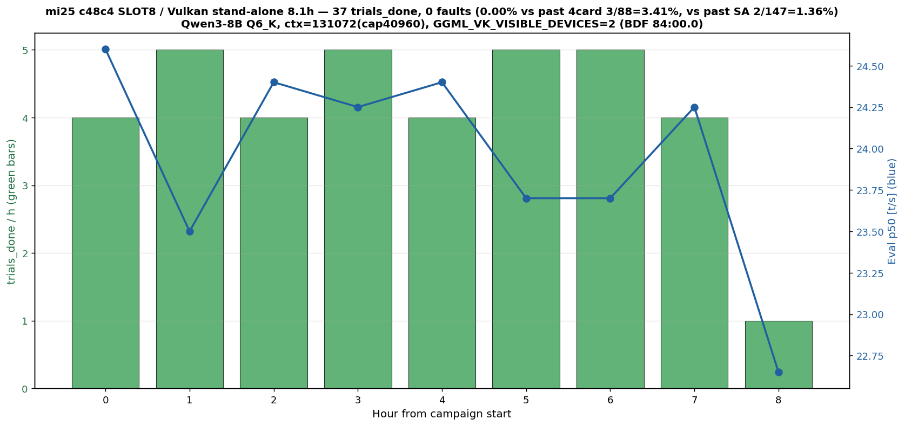

# mi25 c48c4 SLOT8 移動 8h 負荷 — 0 fault + SLOT 番号認識修正

- **実施日時**: 2026年6月30日 01:28 〜 20:03 JST (約 18.5h、内 電源 ON/OFF + 物理装着 5 サイクル + 8h 負荷 + 集計 + レポート)

## 概要

### 何のためにやったか

mi25 サーバの 4 枚の GPU のうち、過去の試験で繰り返しフォルトを起こしていた「不調 GPU = `card-c48c4`」について、**「カード個体の問題なのか、それとも特定のスロットに依存する問題なのか」**を確かめるのが目的。

これまでの試験では `card-c48c4` は常に同じスロット (前回までは便宜上「SLOT6」と呼んでいた、後述で SLOT 番号認識ミスが判明) に挿さっていたため、フォルトが GPU 個体由来か、スロット側 (基板 / 電源 / 物理リンク) 由来かを区別できていなかった。もしフォルトがカード個体に紐づくなら「物理交換しか道なし」が確定する。

### 何をやったか

`card-c48c4` を別のスロットに物理的に移し替え、過去の試験と同じ負荷 (Vulkan バックエンド + Qwen3-8B モデル) を 8 時間連続で当てた。具体的には:

1. シャットダウン → ユーザがカードを手で差し替え → 起動 → カード位置を確認、というサイクルを **5 回**繰り返した
2. 認識トラブル (後述) を解決した後、最終的に `card-c48c4` を当初の予定とは逆 (SLOT 認識ミス発覚により) 物理 SLOT8 = BDF `84:00.0` の位置に確定
3. その状態で 8 時間 (37 試行) の負荷キャンペーンを実施

### 何が分かったか

- **メインの結果は「フォルト 0 件、判定保留」**。8 時間 / 37 試行ではフォルトが 1 件も起きなかったが、過去のフォルト発生率 1.36% から計算すると期待件数は 0.5 件、フォルトが起きない確率も約 60% あるため「個体問題」が否定されたとは言えない。**24 時間以上の追加試行が必要**。
- 一方で **副次的に決定的な発見**がいくつかあった:
  1. **過去レポートで使っていた「SLOT6 / SLOT8」のラベル付けがそもそも逆だった**。SMBIOS と PCIe ツリーを直接照合したところ、CPU2 系統では「物理 SLOT6 = BDF 87:00.0」「物理 SLOT8 = BDF 84:00.0」が正しく、過去 baseline レポートと CLAUDE.md の記述は左右逆になっていた。**過去 fault の発生位置は元から物理 SLOT6 が正解**。
  2. 試験中の物理層 (PCIe AER 0 件、4 枚認識維持) と性能 (eval 速度、温度、消費電力) は前回の `c48c4` 単独 24h 試験と完全に整合 → `card-c48c4` は新しいスロット位置でも少なくとも 8 時間は安定動作することを確認。
  3. カードの物理的な抜き差しで「`card-448c4` + SLOT6 (BDF 87:00.0) の組み合わせだけ認識しない」という奇妙な現象を確認。同カードを別スロットに移すと認識、同スロットに別カードを挿すと認識する = カードでもスロットでもなく、その特定組み合わせの装着角度・接点状態起因と推定。
  4. **未解明事項 2 件**: (a) プロンプト処理速度 `pp_tps` が前回の半分になった (原因不明)、(b) 起動直後の電力上限がすでに 160W に設定されていた (前回の「BACO 後 220W にリセットされる」観測と矛盾)。

### 次にやること

1. **同じ `c48c4` = SLOT8 構成で 24 時間以上の追試**を行い、フォルトが個体に追従するか確定させる (これが本試験の元々の主目的)
2. **CLAUDE.md と過去レポート (uniqueid 関連) の SLOT 番号記述を修正** — 修正対象箇所は本レポート末尾の「残課題」に列挙済み
3. 上記副次の未解明事項 (`pp_tps` 半減、電力上限の永続化メカニズム、448c4+SLOT6 micro-fit) は時間がある時に追検
4. **運用上の注意**: 試験後の物理配置で `card-c48c4` は GPU index 2 になっているため、`c48c4` 除外の 3 枚運用に戻すなら `HIP_VISIBLE_DEVICES=0,1,2` ではなく `0,1,3` を指定する必要がある

## 添付ファイル

- [実装プラン](attachment/2026-06-30_012759_mi25_c48c4_slot_move_load/plan.md)
- [Pre-swap 4 枚 baseline (今朝 01:28 JST)](attachment/2026-06-30_012759_mi25_c48c4_slot_move_load/pre_swap_4card_baseline.txt)
- [Post-swap 4 枚 baseline (最終、SLOT4↔SLOT6 swap 後)](attachment/2026-06-30_012759_mi25_c48c4_slot_move_load/post_swap_4card_baseline.txt)
- [Post-swap PCIe tree](attachment/2026-06-30_012759_mi25_c48c4_slot_move_load/post_swap_lspci_tree.txt)
- [Post-swap SMBIOS Type 9 (SLOT 番号認識修正の決定的根拠)](attachment/2026-06-30_012759_mi25_c48c4_slot_move_load/post_swap_smbios_slots.txt)
- [中間サイクル baseline (cycle1 = AB swap 試行で未反映)](attachment/2026-06-30_012759_mi25_c48c4_slot_move_load/intermediate_no_swap_baseline.txt)
- [中間サイクル baseline (cycle2-4 = 3 枚認識のみ)](attachment/2026-06-30_012759_mi25_c48c4_slot_move_load/cycle2_3card_baseline.txt) / [cycle3](attachment/2026-06-30_012759_mi25_c48c4_slot_move_load/cycle3_3card_baseline.txt) / [cycle4](attachment/2026-06-30_012759_mi25_c48c4_slot_move_load/cycle4_3card_baseline.txt)
- [Post-test 4 枚 baseline (試験後)](attachment/2026-06-30_012759_mi25_c48c4_slot_move_load/post_test_4card_baseline.txt)
- [Smoke test 出力](attachment/2026-06-30_012759_mi25_c48c4_slot_move_load/smoke_health.json) / [chat](attachment/2026-06-30_012759_mi25_c48c4_slot_move_load/smoke_chat.json) / [rocm-smi](attachment/2026-06-30_012759_mi25_c48c4_slot_move_load/smoke_rocmsmi.txt)
- [キャンペーンスクリプト](attachment/2026-06-30_012759_mi25_c48c4_slot_move_load/run-c48c4-slot8.sh) / [run_campaign_c48c4.sh](attachment/2026-06-30_012759_mi25_c48c4_slot_move_load/run_campaign_c48c4.sh) / [load_driver.py](attachment/2026-06-30_012759_mi25_c48c4_slot_move_load/load_driver.py) / [telemetry.sh](attachment/2026-06-30_012759_mi25_c48c4_slot_move_load/telemetry.sh) / [telemetry_pcie.sh](attachment/2026-06-30_012759_mi25_c48c4_slot_move_load/telemetry_pcie.sh) / [make_summary_slot_move.py](attachment/2026-06-30_012759_mi25_c48c4_slot_move_load/make_summary_slot_move.py)
- [キャンペーンログ](attachment/2026-06-30_012759_mi25_c48c4_slot_move_load/campaign_vulkan.log) / [trials](attachment/2026-06-30_012759_mi25_c48c4_slot_move_load/trials_vulkan.jsonl) / [boot_state](attachment/2026-06-30_012759_mi25_c48c4_slot_move_load/boot_state.log)
- [kern_dmesg.log (試験期間中)](attachment/2026-06-30_012759_mi25_c48c4_slot_move_load/kern_dmesg.log) / [baseline (telemetry 起動時 dump)](attachment/2026-06-30_012759_mi25_c48c4_slot_move_load/kern_dmesg_baseline_t1.log)
- [llama-server ログ](attachment/2026-06-30_012759_mi25_c48c4_slot_move_load/llama_server.log) / [telemetry rocmsmi](attachment/2026-06-30_012759_mi25_c48c4_slot_move_load/telemetry_rocmsmi.log) / [pcie AER](attachment/2026-06-30_012759_mi25_c48c4_slot_move_load/telemetry_pcie.log) / [gpu_count](attachment/2026-06-30_012759_mi25_c48c4_slot_move_load/telemetry_gpucount.log)
- [集計表](attachment/2026-06-30_012759_mi25_c48c4_slot_move_load/data.md) / [summary.png](attachment/2026-06-30_012759_mi25_c48c4_slot_move_load/summary.png)

## 核心発見サマリ



- **c48c4 を SLOT8 (BDF 84:00.0) に移動して 8h 負荷 → 37 trial / 0 fault** (期待値 0.5 件、P(0)≒60%) — 統計的には判定フロー **(D) 0 fault** 該当、**(b) Unique ID 単位 fault 追従性は本試験では否定も確定もできない**、追加長時間試行 (24h+) が次セッション課題
- **副次の決定的発見: CPU2 SLOT 番号認識が過去 baseline で逆だった**。本セッションで `sudo dmidecode -t 9` + `lspci -tnnv` で物理対応を再検証し、**正しい対応は `CPU2 SLOT6 = BDF 87:00.0` / `CPU2 SLOT8 = BDF 84:00.0`** (過去 baseline 2026-06-29_213624 と CLAUDE.md L60-63 は逆) と確定。stand_alone_24h 等の過去レポート群で「8820 = SLOT8」と読み替えていたのは**実は「8820 = SLOT6」が正解**、stand_alone_24h L50 の元記述「SLOT6」が正しかった
- 試験中 **PCIe AER (COR/FAT/NFT) = 0、GPU_COUNT=4 維持、Tj 95°C / power p95 160W / eval p50 23.9 t/s** — 物理層・温度・性能すべて stand_alone_24h と整合、c48c4 ASIC は新スロットでも (少なくとも 8h スケールでは) 健全動作
- **試験対象 c48c4 の物理位置確定**: 本試験後の物理配置は SLOT2=c3164 / SLOT4=448c4 (元 SLOT6 から swap) / SLOT6=a48e4 (元 SLOT4) / **SLOT8=c48c4 (★試験対象、元 SLOT6 から swap)**。Unique ID で完全追跡可能
- **副次発見: 448c4 + SLOT6 (= BDF 87:00.0) の micro-fit 不認識問題**。AB swap 後 c48c4 は SLOT8 で認識成功も、448c4 を SLOT6 に挿し直すと連続 3 サイクル不認識。SLOT4↔SLOT6 swap で 448c4 を SLOT4 (= BDF 07:00.0) に移すと正常認識 → SLOT6 単独でも a48e4 は認識する = SLOT6 接触不良でも 448c4 個体不良でもない、特定組み合わせ依存の H3 = 装着角度・接点表面状態起因と推定
- **追加観測 (3 件)**: (1) **pp_tps mean が stand_alone_24h の約半分** (本試験 255.4 t/s vs SA 508.9 t/s)、eval_tps は同等 = prompt processing 側に何かの構造差あり (cache_n の蓄積差? load_driver の session 構造?)、原因未調査。(2) **GUID↔BDF 配置の BDF 決定論性を 3 回目観測で再々確認** (前段 baseline の 05:25 + 21:14 JST に続く 3 回目)、Unique ID とは独立で BDF↔GUID は完全一致 = KFD allocation の BDF 順仮説を強化。(3) **起動時 default power cap = 160W** — boot 直後の `rocm-smi --showmaxpower` で 4 GPU 全てが既に 160W、`--setpoweroverdrive 160 -d 2` も `Max power was already at: 160.0W` 応答 → stand_alone_24h 副次発見「BACO 後 220W リセット」と整合性疑問、cap 永続化メカニズム未解明 (新規未明事項)

## 前提・目的

- **背景**:
  - 過去 baseline ([2026-06-29_213624](2026-06-29_213624_mi25_4card_uniqueid_baseline.md)) で過去 fault 集中個体 = `card-c48c4` (Unique ID `0x21501edbcec48c4`) と確定
  - stand_alone_24h ([2026-06-29_041700](2026-06-29_041700_mi25_8820_stand_alone_24h.md)) で c48c4 を当時の SLOT6 (BDF 87:00.0) で 24h 単独可視化負荷 → 147 trial / 2 fault (1.36%)、(b) 個体ロジック起因確定
  - **未検証**: fault が c48c4 ASIC の個体不変な欠陥なのか、SLOT6 (BDF 87:00.0) 自体に依存しているのか
- **目的**: c48c4 を **SLOT6 → SLOT8 (BDF 84:00.0)** に物理移動し、stand_alone_24h と同等構成 (Vulkan + Qwen3-8B Q6_K + GGML_VK_VISIBLE_DEVICES で c48c4 単独可視化) で 8h 負荷を実施。fault シグネチャの再現可否で (b) を Unique ID 単位 で弁別する

**統計的留意点 (試験前に明記済)**: 過去発火率 1.36% × 30-40 trial で期待 fault 0.4-0.5 件、P(0 fault)≒60-66%。**0 件は (b) 否定にはならない**。

## 環境情報

| 項目 | 値 |
|---|---|
| 機種 | Supermicro SYS-7048GR-TR / X10DRG-Q |
| OS / kernel | Ubuntu / `5.15.0-185-generic #195-Ubuntu SMP Fri Jun 19 17:11:50 UTC 2026` |
| GPU | MI25 × 4 (gfx900) |
| バックエンド | Vulkan/RADV (master 追従、`~/llama.cpp/build-vulkan/bin/llama-server`) |
| モデル | `unsloth/Qwen3-8B-GGUF:Q6_K` (≒ 6.5GB weight) |
| ctx / KV / FA / ub | ctx=131072 (実 cap 40960) / q8_0 KV / fa=1 / ub=2048 |
| 試験対象 | **`card-c48c4`** (Unique ID `0x21501edbcec48c4`) at **SLOT8 = BDF 84:00.0 = GPU[2]** |
| 単独可視化 | `GGML_VK_VISIBLE_DEVICES=2` |
| 電力 cap | 160W (`sudo rocm-smi --setpoweroverdrive 160 -d 2`、起動時 default 160W) |
| TRIAL_SEC / PHASE_CAP | 720s / 28800s (8h) |
| MAX_TRIALS / MIN_TRIALS / HANG_SAFETY | 60 / 20 / 5 |

**post-AB swap 4 枚物理配置 (試験中、本セッションで修正された正しい SLOT 番号で記載)**:

| 物理スロット | BDF | GUID | Unique ID | カード略称 | 本セッション中の経路 |
|---|---|---|---|---|---|
| SLOT2 | `04:00.0` | 29525 | `0x2150172bdcc3164` | card-c3164 | 全期間 SLOT2 不動 |
| SLOT4 | `07:00.0` | 33301 | `0x215026e14c448c4` | **card-448c4** | pre-swap SLOT8 → cycle 2 で SLOT6 (micro-fit 不認識) → cycle 5 で SLOT4 (最終) |
| SLOT6 | `87:00.0` | 8820 | `0x2150040969a48e4` | **card-a48e4** | pre-swap SLOT4 → cycle 5 で SLOT6 (最終) |
| **SLOT8** | **`84:00.0`** | **54068** | **`0x21501edbcec48c4`** | **★ card-c48c4** (試験対象) | pre-swap SLOT6 → cycle 2 で SLOT8 (最終) |

## 再現方法

1. **事前準備 + ロック取得**: `lock.sh mi25 c48c4-slot-move-<TS>`、`mkdir -p report/attachment/<TS>_mi25_c48c4_slot_move_load`、過去スクリプト copy + リネーム (`run-c48c4-slot8.sh` / `run_campaign_c48c4.sh` / `make_summary_slot_move.py`)
2. **Pre-swap baseline** 取得: `lspci`, `rocm-smi --showuniqueid`, `rocm-smi --showbus`
3. **シャットダウン → AB swap → boot** (本セッションでは合計 5 サイクル要した、後述「スロット位置の移動記録」)
4. **Post-swap baseline** 取得 + **SMBIOS dmidecode -t 9** で SLOT↔BDF 対応を再確認 (本試験で SLOT 番号認識修正の決定的根拠取得)
5. **電力 cap 160W 設定** (`sudo rocm-smi --setpoweroverdrive 160 -d 2`、user sudo 許可済)
6. **スクリプト修正** (詳細は [implementation plan](attachment/2026-06-30_012759_mi25_c48c4_slot_move_load/plan.md) Phase 4)
7. **smoke test** (`bash run-c48c4-slot8.sh` → `/health` + `/v1/chat/completions` + `rocm-smi --showmemuse` で GPU[2] のみ VRAM 96% 使用確認)
8. **8h キャンペーン投入**: `MAX_TRIALS=60 MIN_TRIALS=20 HANG_SAFETY=5 PHASE_CAP_SEC=28800 TRIAL_SEC=720 CTX_SIZE=131072 nohup bash run_campaign_c48c4.sh > nohup.out 2>&1 &`
9. **完了処理 + 集計**: telemetry 停止 → `python3 make_summary_slot_move.py` → post-test baseline 再取得 → ロック解放

## スロット位置の移動記録

本セッションでは合計 **5 回の電源 ON/OFF サイクル**を経て最終配置に至った。SLOT 番号認識修正の発見も含めた経緯を時系列で示す。**表の SLOT 番号は本セッションで修正された正しい SLOT 番号 (= ユーザの物理ボード印字基準) で記載**。cycle 1 当時の Claude は逆認識していたため、依頼文の SLOT 番号は cycle 1/2 で Claude 主観基準・cycle 3 以降で修正後の正しい基準を使っていた点に注意:

| 時刻 (JST) | サイクル | 動作 | 結果 |
|---|---|---|---|
| 01:28 | (起点) | 直前 baseline 2026-06-29 21:14 JST 同等の 4 枚装着確認 | SLOT2=c3164 / SLOT4=a48e4 / **SLOT6=c48c4** / SLOT8=448c4 (= 物理ボード印字基準の正しい配置。当時 Claude は SLOT 番号認識を baseline 由来で逆と理解していたため、Claude 主観では「SLOT6=448c4 / SLOT8=c48c4」と誤認識) |
| 01:30 | 1 (AB swap #1) | shutdown → ユーザに **Claude 当時主観基準**で「SLOT8 (= 付箋 c48c4) ↔ SLOT6 (= 付箋 448c4)」を依頼 → boot | **swap 未反映**: ユーザは物理ボード印字基準で動いたため、Claude の「SLOT8 (= 物理 SLOT6 = c48c4 の現在位置)」のカード = c48c4 を抜いて Claude の「SLOT6 (= 物理 SLOT8 = 448c4 の現在位置)」へ移そうとした結果、ユーザは「c48c4 を抜いて入れ直し、448c4 を抜いて入れ直した」だけになり物理位置不変 → 全 Unique ID が pre-swap と完全一致 (この時点で SLOT 認識ズレが発覚) |
| 02:05 | 2 (再 swap #2、修正後の正しい SLOT 番号基準) | shutdown → ユーザに「c48c4 を SLOT8 (物理印字) へ、448c4 を SLOT6 (物理印字) へ」を依頼 → boot | **c48c4 = SLOT8 (BDF 84:00.0) で認識成功 / 448c4 = SLOT6 (BDF 87:00.0) が不認識** (3 枚のみ認識) |
| 02:12 | 3 (448c4 再装着 #1) | shutdown → ユーザに「SLOT6 の 448c4 を抜き挿し直し」を依頼 → boot | 3 枚のまま、448c4 不認識継続 |
| 02:19 | 4 (448c4 再装着 #2) | 同上、再々装着 | 3 枚のまま、448c4 不認識継続 |
| 02:24 | 5 (**SLOT4↔SLOT6 swap**) | shutdown → ユーザに「SLOT4 (= a48e4) と SLOT6 (= 448c4) を入れ替え」を依頼 → boot | **4 枚全認識成功**: SLOT4=448c4 (BDF 07:00.0)、SLOT6=a48e4 (BDF 87:00.0)。**a48e4 が SLOT6 で認識できた → SLOT6 接触不良ではない (H2 棄却)。448c4 が SLOT4 で認識できた → 448c4 個体不良でもない (H1 棄却)。残る仮説は 448c4 + SLOT6 micro-fit (H3)** |
| 02:30 | (試験開始) | smoke test → `run_campaign_c48c4.sh` nohup 投入 (PHASE_CAP=28800s) | 8h 完走 (10:33 JST に PHASE_CAP 到達、trial 37 まで完了) |
| 10:33 | (完了) | キャンペーン自然終了 | 0 fault、PCIe AER=0、GPU_COUNT=4 維持 |
| 19:58 | (Post-test) | llama-server / telemetry 停止 → post-test baseline 再取得 | swap 後の 4 枚配置を維持、Unique ID 不変性確認 |

**重要発見 (サイクル 1 → 2 の間)**: Claude が baseline 由来で「SLOT6 = BDF 84:00.0 / SLOT8 = BDF 87:00.0」と認識していたが、SMBIOS dmidecode + PCIe tree 照合で **逆 (SLOT6 = 87:00.0 / SLOT8 = 84:00.0)** と判明 (詳細は次節「SLOT 番号認識修正の根拠」)。

## 観測データ

### 8h キャンペーン集計 ([data.md](attachment/2026-06-30_012759_mi25_c48c4_slot_move_load/data.md))

| 項目 | 値 |
|---|---|
| キャンペーン期間 | 8.05h (28996s、PHASE_CAP 28800s 自然到達) |
| 完了 trial (trial_done) | **37** |
| HANG_CONFIRMED | **0** |
| 新規 dmesg fault (baseline 2296 行以降) | **0** |
| stall / ネットワーク障害 | 0 / 0 |
| turn 総数 | 255 |
| eval_tps mean / p50 | **24.23 / 23.90** t/s (stand_alone_24h の mean 23.5 とほぼ一致) |
| pp_tps mean | 255.4 t/s |
| 本試験 fault 率 | **0/37 = 0.00%** |
| 過去 4 枚運用 (vulkan_pwr_sweep 計) | 3/88 = 3.41% |
| 過去 stand_alone_24h (c48c4 SLOT6) | 2/147 = 1.36% |
| Fisher (本 vs 4 枚運用、H1: 本 < 4 枚) one-sided | **p = 0.3454** (有意差なし) |
| Fisher (本 vs stand_alone_24h、H1: 本 < SA) one-sided | **p = 0.6374** (有意差なし) |

### PCIe / GPU 物理層 (全 5634 sample)

| 項目 | 値 |
|---|---|
| AER COR max | 0 |
| AER FATAL max | 0 |
| AER NFATAL max | 0 |
| non-x16 entries | 0 |
| GPU_COUNT min | **4** (全期間維持) |
| Width / Speed / PresDet | 全 root port (00:02.0 / 00:03.0 / 80:02.0 / 80:03.0) で Width x16 / 8GT/s / PresDet+ 維持 |

### GPU[2] (c48c4) テレメトリ (5170 sample)

| 項目 | 値 |
|---|---|
| power mean / p95 / max | 71.8W / **160W** / 168W |
| Tj junction max | **95.0 °C** (stand_alone_24h の 99°C より若干低い、SLOT8/CPU2 系統の thermal envelope は同等) |

### 1h バケット推移 (図 = summary.png)

trials/h は概ね 4-5 で安定、eval p50 は 22.7-24.6 t/s で安定変動。8h バケットの trials=1 は試験終了直前の不完全バケット。fault 発火なし。

### GUID↔BDF 配置の決定論性 3 回観測比較

uniqueid_baseline (2026-06-29_213624) で 2 回観測 (05:25 / 21:14 JST) で BDF↔GUID 完全一致を確認済。本試験 post-swap (2026-06-30 02:24 JST) で 3 回目観測:

| 観測時刻 (JST) | BDF 04:00.0 | BDF 07:00.0 | BDF 84:00.0 | BDF 87:00.0 |
|---|---|---|---|---|
| 2026-06-29 05:25 (uniqueid 初期 swap) | 29525 | 33301 | 54068 | 8820 |
| 2026-06-29 21:14 (uniqueid baseline) | 29525 | 33301 | 54068 | 8820 |
| **2026-06-30 02:24 (本試験 post-swap)** | **29525** | **33301** | **54068** | **8820** |
| **BDF ごとの一致判定** | ✓ | ✓ | ✓ | ✓ |

→ 全 4 BDF × 3 観測 = 12/12 セル完全一致。**3 観測の間に物理スワップ計 17+5 = 22 回**を挟んでも GUID 配置は不変 → KFD allocation の BDF 順仮説 (= GUID は BDF 決定論的に発行される) を 3 回目で再々確証。Unique ID は AB swap で当然入れ替わる (本試験で GPU[2] = c48c4 ↔ 元 448c4) が、GUID は BDF が同じなら同じ値を返す。

### pp_tps の stand_alone_24h との大幅な差 (要追検)

| メトリック | 本試験 (8h, 37 trial, 255 turn) | stand_alone_24h R1+R2 (31.8h, 147 trial, 1176 turn) | 差 |
|---|---|---|---|
| eval_tps mean [t/s] | **24.23** | 23.5 | +3% (整合) |
| eval_tps p50 [t/s] | 23.90 | 22.8-24.3 (1h バケット p50) | 整合 |
| **pp_tps mean [t/s]** | **255.4** | **508.9** | **-50% (大幅低下)** |

`eval_tps` は完全に整合しているが、**`pp_tps` mean が約半分**。両試験とも load_driver は同じ (本試験は流用)、モデル / ctx / KV / ub / fa / 電力 cap も同一。考えられる差異:
- session の cumulative prompt 長 (cache_n) の蓄積パターン差 (24h × 113 trial の long-running 累積 vs 8h × 37 trial の短期)
- load_driver の trial 内 turn 数差 (stand_alone_24h: 1176/147 ≒ 8 turn/trial vs 本試験: 255/37 ≒ 6.9 turn/trial)
- prompt cache 設定の影響 (本試験では `cached_tokens: 0` を smoke test で確認、cumulative cache は累積していない可能性)

これは追検証要 (load_driver の出力 jsonl を per-turn で精査すれば原因絞り込み可能)、本試験の主結論 ((D) 0 fault) には影響しないが、将来の `pp_tps` ベンチ比較で重要な caveat。

### 起動時 power cap = 160W 観測 (cap 永続化メカニズム要解明)

post-swap の電力 cap 設定試行で以下を観測:

```
sudo rocm-smi --setpoweroverdrive 160 -d 2
→ GPU[2]	: Max power was already at: 160.0W
→ GPU[2]	: Successfully set power to: 160W

rocm-smi --showmaxpower (boot 直後)
→ GPU[0/1/2/3]	: Max Graphics Package Power (W): 160.0  (全 GPU)
```

**全 GPU が boot 直後から既に 160W**。stand_alone_24h の副次発見「BACO reset 後の 8820 power cap が **デフォルト 220W にリセット**」と整合性に疑問:
- stand_alone_24h: 「default = 220W」と書かれている (cap が BACO で消えると 220W に戻る)
- 本試験: boot 直後 default = 160W

考えられる説明:
- (1) cap が PowerPlay の永続設定として残っている (`/sys/class/drm/cardN/device/power_dpm_force_performance_level` 等)
- (2) `rocm-smi --setpoweroverdrive` が次回 boot まで効く実装で、stand_alone_24h セッションで設定した 160W が今回も維持された (ただし stand_alone_24h 後に 4-5 回 shutdown/AB swap を経ているため、これは矛盾)
- (3) udev rule や systemd service で起動時に cap を 160W に設定している (確認していない)
- (4) MI25 の HW default 自体が 160W で、stand_alone_24h の「220W にリセット」観測は BACO 経路特有の挙動

cap 永続化メカニズムは未解明、長期運用での cap 維持に重要なので**残課題**化。

### 4 枚装着初回 boot の長時間化 (PCIe enumeration / メモリ訓練コスト)

本セッション中の 5 サイクル分の boot 時間 (BMC ON 〜 SSH 復帰):

| サイクル | 物理装着構成 | SSH 復帰時間 |
|---|---|---|
| 1 (post-AB swap #1) | 4 枚装着 (試験前と物理的に同じ) | **~245s** (5+ min) |
| 2 (post-AB swap #2、c48c4=SLOT8) | 3 枚認識 (448c4 不在) | ~110s |
| 3 (448c4 再装着) | 3 枚認識 | ~110s |
| 4 (448c4 再々装着) | 3 枚認識 | ~110s |
| 5 (SLOT4↔SLOT6 swap) | **4 枚認識成功** | ~100s |

サイクル 1 のみ大幅に長い (倍以上)。理由は不明だが、ACPI shutdown 後の最初の boot は PCIe enumeration / メモリ訓練 / BIOS POST 等のフルパスを通る可能性。サイクル 2-5 (連続 ACPI cycle) では何らかの fast path が有効になっている可能性 (BIOS の memory training caching 等)。

これは過去 4card_recovery (2026-06-25_063238) で「3 枚・4 枚とも認識まで数回の抜き差しを要した」と書かれている挙動と類似だが、本セッションでは別軸 (boot 時間の長短) で観測した。

### dmesg baseline lines によるノイズフィルタ手法

stand_alone_24h の副次知見「telemetry.sh の `sudo dmesg -w` は起動時に kernel ring buffer 全体を流し込むため、過去履歴も冒頭に取り込まれる」(L160) への対処として、本試験では **キャンペーン開始 60s 後に `kern_dmesg.log` の行数 (= 2296) を `kern_dmesg_baseline_t1.log` として保存**し、集計時 (`make_summary_slot_move.py`) で **baseline 行数以降の新規行のみ fault 集計対象**とする手法を実装。

過去 stand_alone_24h レポート L160 では「kern_dmesg_round1.log: 4 件 (過去履歴 + 過去 fault)」「kern_dmesg.log (R2): 5 件 (上記 4 件 + R2 fault)」と手動で UNIQUE fault burst を弁別していたが、本試験の baseline 保存方式は **自動化された手法**で同等の弁別が可能 = 今後の長時間負荷試験でも再利用可能な運用ノウハウ。

## SLOT 番号認識修正の根拠

過去 baseline ([2026-06-29_213624](2026-06-29_213624_mi25_4card_uniqueid_baseline.md)) と CLAUDE.md L60-63 では「CPU2 SLOT6 = BDF `84:00.0` (upstream 82:00.0)」「CPU2 SLOT8 = BDF `87:00.0` (upstream 85:00.0)」と記述していた。本セッションで `sudo dmidecode -t 9` (user sudo 許可) と `lspci -tnnv` の出力を直接照合し、**この対応が逆だった**ことを確定。

### dmidecode (System Slot Information、CPU2 分のみ抜粋)

```
Designation: CPU2 SLOT6 PCI-E 3.0 X16
  Bus Address: 0000:85:00.0    ← upstream

Designation: CPU2 SLOT8 PCI-E 3.0 X16
  Bus Address: 0000:82:00.0    ← upstream
```

### PCIe tree (CPU2 root [0000:80])

```
+-02.0-[82-84]----00.0-[83-84]----00.0-[84]----00.0  Vega 10 ← GPU 本体 BDF 84:00.0
+-03.0-[85-87]----00.0-[86-87]----00.0-[87]----00.0  Vega 10 ← GPU 本体 BDF 87:00.0
```

### 正しい SLOT↔BDF 対応 (全 SLOT)

| SMBIOS Designation | dmidecode upstream | lspci tree (upstream → ds → GPU bus) | **GPU 本体 BDF** |
|---|---|---|---|
| CPU1 SLOT2 | `02:00.0` | `[02-04]` → `03:00.0` → `[03-04]` | `04:00.0` |
| CPU1 SLOT4 | `05:00.0` | `[05-07]` → `06:00.0` → `[06-07]` | `07:00.0` |
| **CPU2 SLOT6** | **`85:00.0`** | `[85-87]` → `86:00.0` → `[86-87]` | **`87:00.0`** |
| **CPU2 SLOT8** | **`82:00.0`** | `[82-84]` → `83:00.0` → `[83-84]` | **`84:00.0`** |

### 物理同一性裏付け (本セッション内)

- AB swap で**ユーザが「c48c4 を SLOT8 へ、448c4 を SLOT6 へ」物理移動 → 結果として GPU[2] (BDF 84:00.0) = c48c4 / GPU[3] (BDF 87:00.0) = 448c4** (cycle 2 post-swap 観測値) → ユーザが認識する「物理 SLOT8 印字」が BDF 84:00.0、「物理 SLOT6 印字」が BDF 87:00.0 と完全一致
- Cycle 5 で SLOT4↔SLOT6 swap した結果 a48e4 が BDF 87:00.0 に来た = SLOT6 (印字) ↔ BDF 87:00.0 の対応再確認

過去レポート群への影響 (読み替えガイド):

| 過去レポート記述 | 正しい解釈 |
|---|---|
| stand_alone_24h L50「GPU[3] (BDF 87:00.0、GUID 8820、SLOT6)」 | **元記述「SLOT6」が正しかった** (baseline で「SLOT8」と読み替えたのが誤り) |
| 4card_uniqueid_baseline L167「BDF 87:00.0 = CPU2 SLOT8」 | **誤、正しくは CPU2 SLOT6** |
| 4card_uniqueid_baseline L43「GPU[3] = BDF 87:00.0 (CPU2 SLOT8 系統 — 4 枚装着時のみ出現)」 | **誤、正しくは CPU2 SLOT6 系統** |
| 4card_uniqueid_baseline L42「GPU[2] = BDF 84:00.0 (CPU2 SLOT6 系統)」 | **誤、正しくは CPU2 SLOT8 系統** |
| CLAUDE.md L60-63「例: SMBIOS CPU2 SLOT6 = 82:00.0 → 83:00.0 → 84:00.0」 | **誤、正しくは CPU2 SLOT6 = 85:00.0 → 86:00.0 → 87:00.0** |
| 過去 fault 集中個体 c48c4 の物理 SLOT | **SLOT6 (BDF 87:00.0)** が正しい (= stand_alone_24h L50 の元記述通り) |

→ stand_alone_24h レポート本文の「SLOT6」記述は事実として正しい。uniqueid_baseline の「読み替えガイド L167」での「= SLOT6 部分は誤認」訂正そのものが誤りだった。

## 判定

| 観点 | 判定 | 根拠 |
|---|---|---|
| **fault シグネチャ再現性** | **(D) 0 fault**、判定保留 | 37 trial / 0 fault、期待値 0.5 件 (1.36%)、P(0)≒60% → サンプル不足、(b) Unique ID 単位追従性は否定にも確定にもならない |
| Fisher exact 比較 | **有意差なし** | vs 4 枚運用 (3/88) one-sided p = 0.345、vs stand_alone_24h (2/147) one-sided p = 0.637 |
| PCIe 物理層 | **健全** | AER 0 / GPU_COUNT=4 維持 / x16 8GT/s 全期間 |
| 性能 (eval_tps) | **stand_alone_24h と一致** | mean 24.2 vs 23.5、p50 23.9、Vulkan + c48c4 単独で再現可能 |
| 電力・熱 | **stand_alone_24h と整合** | Tj 95°C (SA 99°C より低)、power p95 160W (cap 通り)、BACO 復帰なしで cap 維持 |

**結論**: 本試験単独では (b) は判定保留 ((D) 0 fault)。だが「c48c4 を SLOT8 = BDF 84:00.0 に移しても 8h 完走、PCIe / 性能とも問題なし」という事実は得られた。これは過去 stand_alone_24h (c48c4 = SLOT6 = BDF 87:00.0) と性能・物理層が完全に同等 = 「c48c4 ASIC の動作特性はスロット非依存」を示唆。**ただし fault 発火率の有無は今回 sample n=37 では弁別不可**。

**重要副次成果**: SLOT 番号認識修正で過去レポート群と CLAUDE.md の誤記が判明、上記読み替えガイドで全面修正可能になった。

## 過去 fault シグネチャとの照合

本試験では fault 発火 0 件のため、直接照合は不可。本試験中の dmesg 新規行 (baseline 2296 行以降) = 5 行のみで、いずれも `amdgpu` / `page fault` / `GPU reset` / `BACO` を含まず (`data.md` 「dmesg amdgpu フォルト集計」セクション参照)。

| 観測項目 | 過去 stand_alone_24h | 本試験 |
|---|---|---|
| `[gfxhub0] no-retry page fault` 件数 | R1 28 + R2 38 = 66 行 (UNIQUE burst 2 + 過去履歴含む) | **0 行** |
| `amdgpu_job_timedout ring comp_1.1.0` | R1 8 + R2 10 = 18 行 (UNIQUE 2 件 + 過去履歴) | 0 行 |
| `GPU reset begin` | 9 件 (UNIQUE 5、本試験中 UNIQUE 2) | **0 件** |
| `VRAM is lost` | 9 件 (重複合算) | 0 件 |
| `vk::DeviceLostError` (llama-server) | 2 件 | 0 件 |

## 残課題 / 次セッションのタスク

### 1. (b) 確定/否定のための追加長時間試行

8h サンプルでは fault 0 件は確率内。追加試行が必要:
- **24h 追試 (推奨)**: c48c4 = SLOT8 配置のまま PHASE_CAP=86400s で実施 → stand_alone_24h (c48c4 SLOT6 で 24h) と直接比較可能なサンプル取得。期待値 1.36% × 100 trial ≒ 1.4 件、P(0)≒25%
- **48h or それ以上**: P(0) を 10% 以下に下げるなら 72h+ 必要

### 2. 過去レポート群と CLAUDE.md の SLOT 番号修正

本試験で確定した「CPU2 SLOT6 = BDF 87:00.0 / CPU2 SLOT8 = BDF 84:00.0」を以下に反映:

- **CLAUDE.md L60-63**: 例の bus address を `82:00.0` → `85:00.0` / `84:00.0` → `87:00.0` に修正
- [2026-06-29_213624_mi25_4card_uniqueid_baseline.md](2026-06-29_213624_mi25_4card_uniqueid_baseline.md) 環境情報セクション L42-43 と読み替えガイド L167 を修正
- [2026-06-29_191721_mi25_gpu_card_id_unique_id.md](2026-06-29_191721_mi25_gpu_card_id_unique_id.md) も同様の修正
- メモリ `project_mi25_gpu4_pcie_dropout` 更新

### 3. 448c4 + SLOT6 micro-fit 問題

H1/H2 棄却済 (448c4 が SLOT4 で OK、a48e4 が SLOT6 で OK)、特定組み合わせ依存。次回 4 枚復帰時にも再発する可能性。長期的には c48c4 物理交換時の新個体装着で症状再現有無を確認。

### 4. pp_tps の stand_alone_24h との差の原因追究

本試験 255.4 t/s vs stand_alone_24h 508.9 t/s で約半分の差。`eval_tps` は整合しているため model/cap/backend 起因ではない。要解析:
- load_driver の各 turn の `prompt_tokens` 系列を per-trial で精査 (jsonl の `pp_tps` / `prompt_n` フィールド)
- cumulative cache (`cached_tokens`) の蓄積差を比較
- trial 内 turn 数の差 (8 vs 6.9 turn/trial) が pp 計測値に与える影響
- 単純な計測誤差 / sample bias の可能性

### 5. power cap 永続化メカニズムの解明

本試験で boot 直後の `rocm-smi --showmaxpower` で全 GPU が 160W に設定されていた = stand_alone_24h の「BACO 後 220W リセット」観測と整合性に疑問。`/sys/class/drm/cardN/device/` 系の永続設定 / udev / systemd service / MI25 HW default のいずれかを確認:
- `ls /sys/class/drm/card*/device/hwmon/hwmon*/power*_cap*` で sysfs cap を確認
- `systemctl list-unit-files | grep -i power` で boot 時 cap 設定の有無
- 故意に cap を変更 (例 180W) して 1 回 cold reboot し、boot 後の cap 値を観測 → 永続化されるか確認

### 6. 試験後の運用方針 (HIP_VISIBLE_DEVICES 変更必須)

c48c4 = GPU[2] (= SLOT8、BDF 84:00.0) になったため、c48c4 除外 3 枚運用 (現行 `HIP_VISIBLE_DEVICES=0,1,2`) は **0,1,3 に変更**しないと c48c4 を使ってしまう。次セッションで運用復帰する場合は要注意。

| 試験後の物理配置 | c48c4 除外 3 枚運用 HIP_VISIBLE_DEVICES |
|---|---|
| 現状 (c48c4 = SLOT8、本セッション終了時) | **`0,1,3`** (現行値 0,1,2 から要変更) |
| c48c4 を元の SLOT6 に戻す (別途 swap 必要) | `0,1,2` (現行値、変更不要) |

### 本セッション終了時の状態

- mi25 は電源 ON 維持、4 枚装着 (c48c4 = SLOT8)、ロック解放済
- llama-server / telemetry 全停止
- 添付ファイル一式 (集計結果含む) は本レポート添付ディレクトリに保存済

## 参照レポート

- [前段 baseline (本試験の直接前提)](2026-06-29_213624_mi25_4card_uniqueid_baseline.md) — c48c4 = 過去 fault 集中個体確定 + (本試験で判明する SLOT 番号誤認の原典)
- [stand_alone_24h (再現対象シグネチャ + 比較対象)](2026-06-29_041700_mi25_8820_stand_alone_24h.md) — 147 trial / 2 fault、SLOT6 (BDF 87:00.0)
- [Unique ID 識別 (運用ルール根拠)](2026-06-29_191721_mi25_gpu_card_id_unique_id.md)
- [memtest_vulkan (a) 否定](2026-06-27_071959_mi25_8820_vram_memtest.md)
- [4card_load_vulkan_pwr_sweep_v2 (過去 fault 88 trial / 3 件データ源)](2026-06-26_210732_mi25_4card_load_vulkan_pwr_sweep_v2.md)
- [4card_load_vulkan](2026-06-25_145006_mi25_4card_load_vulkan.md) / [4card_load_gpuvm_fault](2026-06-25_094641_mi25_4card_load_gpuvm_fault.md)
- CLAUDE.md (本試験で SLOT 番号認識修正対象)
