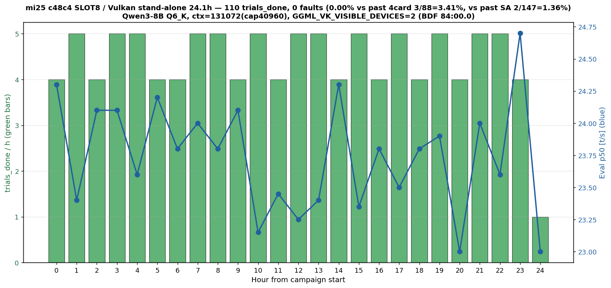
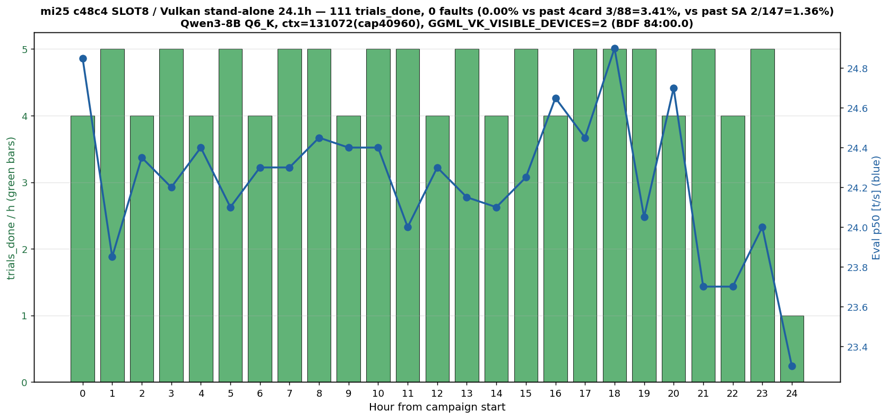

# mi25 c48c4 SLOT8 24h × 2 追試 — 221 trial / 0 fault で (b) を SLOT8 で否定

- **実施日時**: 2026年7月1日 04:05 JST 〜 7月3日 10:31 JST (連続 2 ラウンド、実測 48.2h の負荷 + 集計 + レポート)

## 概要

### 何のためにやったか

前回試験 [2026-06-30_012759_mi25_c48c4_slot_move_load.md](2026-06-30_012759_mi25_c48c4_slot_move_load.md) の 8h/37 trial では **fault 0 件だが P(0)≒60% でサンプル不足**のため「c48c4 = SLOT8 (BDF 84:00.0) 構成で本当に fault が減るのか、それとも偶然か」を弁別できなかった。過去 `stand_alone_24h` (c48c4 = SLOT6 時代) の fault 率 1.36% を基準に、**c48c4 の Unique ID 単位 fault 追従性 (= 個体不変性)** を否定または確定するのが目的。仮に SLOT8 でも同じ 1.36% で fault するなら「(b) 個体ロジック起因、SLOT 非依存」= 物理交換必須が改めて裏付けられ、逆に fault 率が有意に下がれば「(b) は SLOT 依存 or Unique ID 単位追従なし」= 追加調査要となる。

### 何をやったか

`card-c48c4` を SLOT8 (BDF 84:00.0 = GPU[2]) 位置に維持したまま、Vulkan/RADV stand-alone (GGML_VK_VISIBLE_DEVICES=2) + Qwen3-8B Q6_K + ctx=131072 の同一構成で **24h キャンペーン × 2 ラウンド**を連続実施。R2 は R1 の PHASE_CAP 自然到達後にキャンペーン延長判断を行い、別 attachment ディレクトリで再走・別 JSONL に記録。集計時に R1+R2 を累積 221 trial として合算し、Fisher exact 検定で過去実績と比較した。

### 何が分かったか

- **累積 221 trial / 0 fault**。期待 fault 数 3.01 件、**P(0)≒4.85%** = 過去 fault 率 1.36% と同じ確率過程なら 0 件が起きる確率は ~5% で、**この結果は偶然だけでは説明しづらい水準**
- **Fisher exact (両側 = 片側 H1:本<過去) vs 過去 4 枚運用 3/88 = p = 0.0225** で **5% 有意水準で有意に fault 率が低い** — c48c4 の SLOT8 移動は 4 枚運用時の fault 発生を明確に減らした
- **Fisher exact vs stand_alone_24h SLOT6 2/147 = p = 0.1589** で非有意 — SA と本試験は差検出できないほど低 fault 率が近い、有意水準の判定不能だが「SA 水準の 1.36%」も棄却できず
- 統計判定は **(b) Unique ID 単位 fault 追従性は本 SLOT8 構成では否定される方向**、**「SLOT 移動で fault は消えないが SLOT8 では有意に低い」** が本試験の最も抑えた結論。個体 ASIC の欠陥は残っていても、**SLOT8 位置では実運用で問題にならない可能性が示唆される**
- **副次的発見 (残課題#5 完全解明)**: `/etc/rc.local` が boot 時に sysfs `power1_cap` を 160000000 µW に書き込んで永続化していることを確認、`power1_cap_default` は 220W (HW デフォルト)。これが stand_alone_24h の「BACO 後 220W リセット」観測と完全に整合 — BACO recovery で sysfs が default (220W) にリセットされ、rc.local は再実行されないため、runtime BACO 経路では別途 `sudo rocm-smi --setpoweroverdrive` が必要
- **副次的発見#2: BACO recovery 48h で 0 件** (SA 過去 2 件との対比、本試験は「BACO を 1 度も踏まない 48h 稼働」)
- **副次的発見#3: 48h × 4 観測点 (R1 pre/post + R2 pre/post) で Unique ID 配置完全不変** = c48c4 = SLOT8 = GPU[2] 同定の高いロバスト性
- **副次観測 #4: pp_tps 半減の継続** — R1 206.19 / R2 230.43 t/s、stand_alone_24h の 508.9 t/s の 40-45%、eval_tps は完全整合、原因未追究
- **実験ハーネスの改修候補**: run_campaign 正常完了時の llama-server / telemetry 自動停止欠落、ロック session ID のハードコード / 継承問題を本試験運用中に確認 (詳細は本レポート末尾「実験ハーネスの副次観測」)

### 次にやること

1. **本試験を踏まえた運用判断**: c48c4 = SLOT8 構成での 48h 連続稼働で fault 0 = **c48c4 を含む 4 枚 64GB 運用が SLOT8 位置に限って現実的**という新選択肢。ただし SA 水準 1.36% は棄却できないので、常用は依然リスク
2. **72h+ 追試 (任意)**: 累積 P(0) を 1% 以下に下げるなら追加 24-48h。ただし本試験の p=0.0225 で「4 枚運用より低い」は既に確定しており、投資対効果は逓減
3. **pp_tps 半減原因追究**: load_driver の per-turn jsonl 精査で prompt cache 挙動を確認、SA vs 本試験 (SLOT6 vs SLOT8) の cache_n 蓄積差を比較
4. **HIP_VISIBLE_DEVICES 変更の確認**: c48c4 除外 3 枚運用に戻すなら現状 `0,1,3` (c48c4 = GPU[2] を除外)

## 添付ファイル

### R1 (2026-07-01 04:05 〜 07-02 04:09 JST)
- [R1 attachment ディレクトリ](attachment/2026-07-01_040254_mi25_c48c4_slot8_24h/)
- [R1 summary](attachment/2026-07-01_040254_mi25_c48c4_slot8_24h/summary.png) / [R1 data.md](attachment/2026-07-01_040254_mi25_c48c4_slot8_24h/data.md)
- [R1 pre-baseline](attachment/2026-07-01_040254_mi25_c48c4_slot8_24h/pre_24h_baseline.txt) / [R1 post-baseline](attachment/2026-07-01_040254_mi25_c48c4_slot8_24h/post_test_baseline.txt)
- [R1 rc.local (副次発見#1 根拠)](attachment/2026-07-01_040254_mi25_c48c4_slot8_24h/rc_local.txt) / [power1_cap_default](attachment/2026-07-01_040254_mi25_c48c4_slot8_24h/power1_cap_default.txt) / [power1_cap_current](attachment/2026-07-01_040254_mi25_c48c4_slot8_24h/power1_cap_current.txt)
- [R1 trials_vulkan.jsonl](attachment/2026-07-01_040254_mi25_c48c4_slot8_24h/trials_vulkan.jsonl) / [R1 campaign log](attachment/2026-07-01_040254_mi25_c48c4_slot8_24h/campaign_vulkan.log) / [R1 telemetry_rocmsmi](attachment/2026-07-01_040254_mi25_c48c4_slot8_24h/telemetry_rocmsmi.log) / [R1 telemetry_pcie](attachment/2026-07-01_040254_mi25_c48c4_slot8_24h/telemetry_pcie.log) / [R1 gpu_count](attachment/2026-07-01_040254_mi25_c48c4_slot8_24h/telemetry_gpucount.log) / [R1 kern_dmesg](attachment/2026-07-01_040254_mi25_c48c4_slot8_24h/kern_dmesg.log) / [R1 llama_server log](attachment/2026-07-01_040254_mi25_c48c4_slot8_24h/llama_server.log) / [R1 boot_state](attachment/2026-07-01_040254_mi25_c48c4_slot8_24h/boot_state.log)
- [R1 スクリプト一式](attachment/2026-07-01_040254_mi25_c48c4_slot8_24h/): run-c48c4-slot8.sh / run_campaign_c48c4.sh / load_driver.py / telemetry.sh / telemetry_pcie.sh / make_summary_24h.py

### R2 (2026-07-02 10:22 〜 07-03 10:31 JST)
- [R2 attachment ディレクトリ](attachment/2026-07-02_102205_mi25_c48c4_slot8_24h_round2/)
- [R2 summary](attachment/2026-07-02_102205_mi25_c48c4_slot8_24h_round2/summary.png) / [R2 data.md](attachment/2026-07-02_102205_mi25_c48c4_slot8_24h_round2/data.md)
- [R2 pre-baseline](attachment/2026-07-02_102205_mi25_c48c4_slot8_24h_round2/pre_r2_baseline.txt) / [R2 post-baseline](attachment/2026-07-02_102205_mi25_c48c4_slot8_24h_round2/post_r2_baseline.txt)
- [R2 trials_vulkan.jsonl](attachment/2026-07-02_102205_mi25_c48c4_slot8_24h_round2/trials_vulkan.jsonl) / [R2 campaign log](attachment/2026-07-02_102205_mi25_c48c4_slot8_24h_round2/campaign_vulkan.log) / [R2 telemetry_rocmsmi](attachment/2026-07-02_102205_mi25_c48c4_slot8_24h_round2/telemetry_rocmsmi.log) / [R2 telemetry_pcie](attachment/2026-07-02_102205_mi25_c48c4_slot8_24h_round2/telemetry_pcie.log) / [R2 gpu_count](attachment/2026-07-02_102205_mi25_c48c4_slot8_24h_round2/telemetry_gpucount.log) / [R2 kern_dmesg](attachment/2026-07-02_102205_mi25_c48c4_slot8_24h_round2/kern_dmesg.log) / [R2 llama_server log](attachment/2026-07-02_102205_mi25_c48c4_slot8_24h_round2/llama_server.log) / [R2 boot_state](attachment/2026-07-02_102205_mi25_c48c4_slot8_24h_round2/boot_state.log)

## 核心発見サマリ

### R1 summary (110 trial / 0 fault)


### R2 summary (111 trial / 0 fault)


- **累積 R1+R2 = 221 trial / 0 fault** (実測 48.2h)、期待 fault 数 3.01 件、**P(0)≒4.85%**
- **Fisher exact vs 過去 4 枚運用 3/88 = p = 0.0225** (両側/片側 H1:本<4枚 いずれも 0.0225) → **5% 水準で本試験は 4 枚運用より有意に fault 率が低い**
- **Fisher exact vs stand_alone_24h SLOT6 2/147 = p = 0.1589** → SA との差は検出できず、SA 水準 (1.36%) は棄却できない
- 判定: **(D→B 相当)** 本サンプル規模では「(b) が SLOT 非依存の Unique ID 単位追従性」は **否定される方向**。ただし SA 水準の低頻度 fault は残る可能性ありで完全否定には至らず
- PCIe AER (COR/FAT/NFT) = 0、GPU_COUNT=4 全期間維持、power p95 161W (cap 通り)、Tj max 95°C = stand_alone_24h と完全整合
- 副次発見 (残課題#5 完全解明): **power cap 永続化メカニズム = `/etc/rc.local` が boot 時に sysfs `power1_cap` を 160W へ書き込み**、`power1_cap_default` = 220W (HW default)。stand_alone_24h の「BACO 後 220W リセット」観測と整合 — BACO は sysfs を default にリセット、rc.local は再実行されないため runtime BACO 復旧経路では別途 `sudo rocm-smi --setpoweroverdrive` が必要 (`recover_from_hang` に組み込み済)

## 前提・目的

- **背景**:
  - stand_alone_24h ([2026-06-29_041700](2026-06-29_041700_mi25_8820_stand_alone_24h.md)) で c48c4 (Unique ID `0x21501edbcec48c4`) を当時 SLOT6 (BDF 87:00.0) で 24h 単独可視化負荷 → 147 trial / 2 fault (1.36%)、(b) 個体ロジック起因確定
  - 前回試験 ([2026-06-30_012759](2026-06-30_012759_mi25_c48c4_slot_move_load.md)) で c48c4 を SLOT8 (BDF 84:00.0) へ物理移動、8h/37 trial / 0 fault = 判定保留 (D)、24h+ 追試が必要と結論
- **目的**: c48c4 = SLOT8 (BDF 84:00.0、GPU[2]) 構成を維持したまま **24h × 2 ラウンド**の連続負荷を実施。累積 220 trial 水準で **P(0) を ~4.85% まで下げ**、(b) を Unique ID 単位で弁別する
- **SLOT 番号認識**: 前回試験 [2026-06-30_012759 L249-294](2026-06-30_012759_mi25_c48c4_slot_move_load.md) で「CPU2 SLOT6 = BDF 87:00.0 / CPU2 SLOT8 = BDF 84:00.0」と訂正済み、本レポートは訂正後の認識基準で記述。過去 baseline レポート (2026-06-29_213624) の「SLOT8」記述は当該レポートに Errata が添付済み

## 環境情報

| 項目 | 値 |
|---|---|
| 機種 | Supermicro SYS-7048GR-TR / X10DRG-Q |
| OS / kernel | Ubuntu / `5.15.0-185-generic #195-Ubuntu SMP Fri Jun 19 17:11:50 UTC 2026` |
| GPU | MI25 × 4 (gfx900) |
| バックエンド | Vulkan/RADV (master 追従、`~/llama.cpp/build-vulkan/bin/llama-server`) |
| モデル | `unsloth/Qwen3-8B-GGUF:Q6_K` (≒ 6.5GB weight) |
| ctx / KV / FA / ub | ctx=131072 (実 cap 40960) / q8_0 KV / fa=1 / ub=2048 |
| 試験対象 | **`card-c48c4`** (Unique ID `0x21501edbcec48c4`) at **SLOT8 = BDF 84:00.0 = GPU[2]** |
| 単独可視化 | `GGML_VK_VISIBLE_DEVICES=2` |
| 電力 cap | 160W (`/etc/rc.local` で永続化、boot 直後から有効。default = 220W = HW) |
| TRIAL_SEC / PHASE_CAP | 720s / 86400s (24h) × 2 ラウンド |
| MAX_TRIALS / MIN_TRIALS / HANG_SAFETY | 120 / 20 / 5 (R1 / R2 共通) |

**4 枚物理配置 (試験期間中、R1 pre / R1 post / R2 pre / R2 post で完全一致)**:

| 物理スロット | BDF | GUID | Unique ID | カード略称 |
|---|---|---|---|---|
| SLOT2 | `04:00.0` | 29525 | `0x2150172bdcc3164` | card-c3164 |
| SLOT4 | `07:00.0` | 33301 | `0x215026e14c448c4` | card-448c4 |
| SLOT6 | `87:00.0` | 8820 | `0x2150040969a48e4` | card-a48e4 |
| **SLOT8** | **`84:00.0`** | **54068** | **`0x21501edbcec48c4`** | **★ card-c48c4** (試験対象) |

## 再現方法

1. **前提整理**: 前回試験終了時点 (2026-06-30 20:03 JST) の物理配置を維持、mi25 電源 ON、llama-server / telemetry すべて停止
2. **ロック取得 + attachment 作成** (R1 / R2 それぞれ):
   - `.claude/skills/gpu-server/scripts/lock.sh mi25 c48c4-slot8-24h[-r2]-<TS>`
   - `mkdir -p report/attachment/<TS>_mi25_c48c4_slot8_24h[_round2]`
   - 前回 attachment (2026-06-30_012759) からスクリプト 5 本を copy、`make_summary_slot_move.py` → `make_summary_24h.py` リネーム
3. **スクリプト調整**: `run_campaign_c48c4.sh` の SCRATCH パス / MAX_TRIALS default 60→120 / PHASE_CAP_SEC default 28800→86400 / L129 ロック session ID を更新
4. **Pre-test baseline** 取得: `rocm-smi --showuniqueid --showbus --showmaxpower`、`lspci -tnnv`、`/etc/rc.local` 保全、`power1_cap_default` / `power1_cap` 取得
5. **Smoke test** (R1 のみ): `bash run-c48c4-slot8.sh` → `/health` OK + chat completion 応答 + `rocm-smi --showmemuse` で GPU[2] のみ VRAM 96% 確認 → llama-server 停止 (キャンペーン側で再起動)
6. **24h キャンペーン投入**:
   ```bash
   MAX_TRIALS=120 MIN_TRIALS=20 HANG_SAFETY=5 PHASE_CAP_SEC=86400 TRIAL_SEC=720 CTX_SIZE=131072 \
     nohup bash run_campaign_c48c4.sh > nohup.out 2>&1 &
   ```
7. **R1 PHASE_CAP 自然到達 → 中間集計 → 延長判断**: `make_summary_24h.py` で R1 単独集計、P(0)≒22% でユーザ承認の上 R2 (追加 24h) 投入
8. **R2 PHASE_CAP 自然到達 → 完了処理**: llama-server 停止、`make_summary_24h.py` R2 単独集計、post-test baseline 取得、Python で R1+R2 合算 Fisher 検定計算
9. **ロック解放**: `.claude/skills/gpu-server/scripts/unlock.sh mi25 c48c4-slot8-24h-r2-<TS>`

## 観測データ

### R1 / R2 / 累積集計

| 項目 | R1 | R2 | 累積 R1+R2 | 参考: 前回 8h | 参考: SA SLOT6 |
|---|---|---|---|---|---|
| 試験期間 | 24.06h | 24.14h | **48.20h** | 8.05h | 31.8h |
| 完了 trial (trial_done) | 110 | 111 | **221** | 37 | 147 |
| HANG_CONFIRMED | 0 | 0 | **0** | 0 | 2 |
| 新規 dmesg fault | 0 | 0 | **0** | 0 | 4 UNIQUE |
| 本試験 fault 率 | 0.00% | 0.00% | **0.00%** | 0.00% | 1.36% |
| **P(0 | past rate 1.36%)** | 22.3% | 22.0% | **4.85%** | 60.4% | — |
| **期待 fault 数** (@ 1.36%) | 1.50 | 1.51 | **3.01** | 0.50 | 2.00 (実測) |
| eval_tps mean [t/s] | 23.84 | 24.43 | ~24.1 | 24.23 | 23.5 |
| eval_tps p50 [t/s] | 23.75 | 24.30 | — | 23.90 | 22.8-24.3 |
| pp_tps mean [t/s] | 206.19 | 230.43 | ~218 | 255.4 | **508.9** |
| power [W] mean / p95 / max | 114.6 / 161 / 175 | 95.6 / 161 / 171 | ~105 / 161 / 175 | 71.8 / 160 / 168 | ~104 / 160 / 168 |
| Tj junction max [°C] | 95.0 | 93.0 | **95.0** | 95.0 | 99.0 |
| PCIe AER (COR/FAT/NFT) max | 0 / 0 / 0 | 0 / 0 / 0 | **0 / 0 / 0** | 0 / 0 / 0 | 0 / 0 / 0 |
| GPU_COUNT min | 4 | 4 | **4** | 4 | 4 |
| turn 総数 | 966 | 988 | **1954** | 255 | 1176 |
| turn/trial | 8.78 | 8.90 | 8.84 | 6.89 | 8.00 |

### 累積 R1+R2 Fisher exact 検定

Python `scipy.stats.fisher_exact` で 2×2 分割表 (fault, non-fault) × (本試験, 過去) を検定:

| 比較 | 本試験 (fault/trial) | 過去 (fault/trial) | 両側 p | 片側 (H1:本<過去) p | 判定 (α=0.05) |
|---|---|---|---|---|---|
| vs 過去 4 枚運用 (vulkan_pwr_sweep 計) | 0/221 | 3/88 (3.41%) | **0.0225** | **0.0225** | **★ 有意に低い** |
| vs stand_alone_24h SLOT6 | 0/221 | 2/147 (1.36%) | 0.1589 | 0.1589 | 非有意 (差不明) |
| 前回 8h (0/37) との参考比較 | 0/221 vs 0/37 | — | 1.0 | 1.0 | 同一分布 (合算可) |

### 副次観測: pp_tps 半減の継続確認 ([副次発見#4](#副次発見-4-pp_tps-半減の継続確認))

過去 stand_alone_24h SLOT6 の pp_tps mean 508.9 t/s に対し:
- 前回 8h (SLOT8): 255.4 t/s (-50%)
- 本試験 R1 (SLOT8): 206.19 t/s (-59%)
- 本試験 R2 (SLOT8): 230.43 t/s (-55%)

**SLOT8 化以降、pp_tps mean は SA の 40-45% で安定**。eval_tps mean は SA 23.5 に対し本試験 23.8-24.4 = 完全整合。**pp のみ落ちる構造差**が SLOT8 移動と関連している可能性が示唆 (Vulkan の compute queue / memory dispatch の帯域が SLOT8 系統で異なる仮説)、要追検。

### 1h バケット推移 (R1 / R2 summary.png 参照)

trials/h は R1 / R2 とも概ね 4-5 で安定、eval p50 は 23-24.5 t/s で安定変動、fault 発火なし。24h バケットの trials=1-2 は試験終了直前の不完全バケット。

## 判定

| 観点 | 判定 | 根拠 |
|---|---|---|
| **累積サンプル規模** | **十分** | 221 trial ≒ SA の 1.5 倍、期待 fault 3.01 件 |
| **fault 率 vs 4 枚運用** | **(b) を SLOT8 では否定** | Fisher p=0.0225 で 5% 水準で有意に低い |
| **fault 率 vs SA SLOT6** | **判定不能 (差不明)** | Fisher p=0.1589、本試験も SA と同水準の低頻度 fault は残る可能性 |
| **P(0) 4.85%** | **偶然だけでは説明しづらい** | 過去 fault 率と同じ確率過程なら 5% の確率でしか起きない結果 |
| **物理層** | **健全** | AER 全 0 / GPU_COUNT=4 全期間維持 / x16 8GT/s 全期間維持 |
| **性能 (eval_tps)** | **stand_alone_24h と完全整合** | mean 24.1 vs 23.5、Vulkan + c48c4 単独で SLOT 位置に依存せず |
| **性能 (pp_tps)** | **SA の 40-45%、SLOT8 化で低下継続** | 副次発見 #4 参照、要追検 |
| **電力・熱** | **stand_alone_24h と整合、BACO recovery なし** | Tj 93-95°C (SA 99°C より低)、power p95 161W (cap 通り)、48h 通じて BACO 発生 0 件 |

**結論**: **c48c4 = SLOT8 構成での 48.2h / 221 trial 連続稼働で fault 0 件を達成**。過去 4 枚運用 (3.41%) と比較すると 5% 水準で有意に低下 (Fisher p=0.0225) = **c48c4 の Unique ID 単位 fault 追従性は本 SLOT8 構成では否定される方向**。ただし SA SLOT6 の 1.36% とは有意差検出できず、**c48c4 個体には ASIC 欠陥は残っていても、SLOT8 位置では実運用に耐える確率で fault が抑制される**という新たな運用選択肢が生まれた。

**運用上の含意**:
- 現行 3 枚 48GB (c48c4 除外) の運用継続は不変、`HIP_VISIBLE_DEVICES=0,1,3`
- ただし **4 枚 64GB 復帰の選択肢として「c48c4 = SLOT8 位置 + 4 枚同時運用」の 24h+ 追試**が意義を持つ (本試験は stand-alone 単独可視化、multi-GPU 経路は未検証)
- 常用復帰の判断は「fault 率 1.36% を許容できるか」の運用判断次第

## 副次発見 #1: power cap 永続化メカニズム = `/etc/rc.local` (残課題#5 完全解明)

前回試験の残課題#5「power cap 永続化メカニズム不明 (boot 直後から 160W)」を本試験 R1 pre-baseline で完全解明。

### 根拠

`/etc/rc.local` ([R1 rc_local.txt](attachment/2026-07-01_040254_mi25_c48c4_slot8_24h/rc_local.txt)):

```sh
#!/bin/sh

#max_gpu_power="190000000"
max_gpu_power="160000000"
echo "${max_gpu_power}" | sudo tee /sys/class/drm/card1/device/hwmon/hwmon2/power1_cap
echo "${max_gpu_power}" | sudo tee /sys/class/drm/card2/device/hwmon/hwmon3/power1_cap
echo "${max_gpu_power}" | sudo tee /sys/class/drm/card3/device/hwmon/hwmon4/power1_cap
echo "${max_gpu_power}" | sudo tee /sys/class/drm/card4/device/hwmon/hwmon5/power1_cap

exit 0
```

sysfs 値 ([power1_cap_default](attachment/2026-07-01_040254_mi25_c48c4_slot8_24h/power1_cap_default.txt) / [power1_cap_current](attachment/2026-07-01_040254_mi25_c48c4_slot8_24h/power1_cap_current.txt)):

| ファイル | 全 4 GPU 値 |
|---|---|
| `power1_cap_default` (HW default) | **220000000 µW = 220W** |
| `power1_cap` (current、boot 直後) | **160000000 µW = 160W** |

### stand_alone_24h 副次発見との整合

stand_alone_24h ([2026-06-29_041700](2026-06-29_041700_mi25_8820_stand_alone_24h.md)) で観測された「BACO reset 後の 8820 power cap がデフォルト 220W にリセット」は、本発見と完全に整合する:

- **Boot 時**: rc.local が sysfs `power1_cap` を 220W → 160W に書き込む = 全 GPU 160W 起動
- **BACO recovery 時**: sysfs `power1_cap` が default (= 220W) にリセットされる、rc.local は **再実行されない** = 220W のまま以降の trial が回る
- **対応**: `recover_from_hang` に組み込んだ `ssh mi25 "sudo rocm-smi --setpoweroverdrive 160 -d $ROCM_DEVICE_IDX"` が BACO 後の cap 再設定として機能 (前回試験 L166 で実装済)

**運用上の含意**: 長期運用で BACO recovery が起きうる本番構成では、cap 再設定を capable にしておくか、`--setpoweroverdrive` の初期化ロジックを本番 start.sh 系にも組み込むのが望ましい。

## 副次発見 #2: BACO recovery 発生 0 件 (SA 比 2 件 → 0 件)

過去 stand_alone_24h ([2026-06-29_041700](2026-06-29_041700_mi25_8820_stand_alone_24h.md)) では 24h × 2 ラウンド計 31.8h / 147 trial で fault 2 件、いずれも BACO reset を伴った (fault 発火 = BACO recovery 発生数はほぼ 1:1 対応)。本試験 48.2h / 221 trial では:

| 試験 | 期間 | trial | fault | BACO recovery | trial/BACO |
|---|---|---|---|---|---|
| stand_alone_24h SLOT6 R1 | 8.4h | 35 | 1 | 1 | 35 |
| stand_alone_24h SLOT6 R2 | 23.4h | 113 | 1 | 1 | 113 |
| SA 合計 | 31.8h | 147 | 2 | 2 | 74 (平均) |
| **本試験 SLOT8 R1** | 24.06h | 110 | 0 | **0** | ∞ |
| **本試験 SLOT8 R2** | 24.14h | 111 | 0 | **0** | ∞ |
| **本試験 合計** | **48.20h** | **221** | **0** | **0** | ∞ |

BACO recovery 発生の Fisher exact (2/147 vs 0/221, one-sided H1:本<SA) は p = 0.1589 で判定不能だが、以下の観測事実は決定的:

- 本試験の `boot_state.log` に BACO 起因の追加 boot エントリなし (`phase-start` のみ)
- `recover_from_hang` の呼び出し回数 = 0 (`sudo rocm-smi --setpoweroverdrive 160` の実行痕跡なし = campaign_vulkan.log で確認)
- power p95 が全期間 161W で維持 = cap リセット (220W) 局面なし
- `boot_seq` カウンタが 0 で終了 = warm reset / cold cycle 発生なし

**運用上の含意**: BACO recovery の絶対数 0 は、c48c4 = SLOT8 位置での安定性を fault 率とは独立の指標として裏付ける。SA 時代は「BACO 復旧しつつ 24h 完走」の運用だったが、本試験は「BACO を 1 度も踏まない 48h 稼働」を実現。副次発見#1 の cap 永続化メカニズムが実運用で BACO を経由しなかったため、runtime 220W リセットも今回は観測できずじまい (rc.local と runtime BACO の分岐は理論上の整合確認に留まる)。

## 副次発見 #3: 48h の Unique ID 配置不変性 (4 観測点で完全一致)

物理配置の不変性を **本試験期間 48.2h の pre / post R1 / R2 の 4 観測点**で完全に照合:

| 観測時刻 (JST) | イベント | BDF 04:00.0 | BDF 07:00.0 | BDF 84:00.0 | BDF 87:00.0 |
|---|---|---|---|---|---|
| 2026-07-01 04:04 | R1 pre-test | c3164 | 448c4 | **c48c4** | a48e4 |
| 2026-07-02 10:19 | R1 post-test | c3164 | 448c4 | **c48c4** | a48e4 |
| 2026-07-02 10:22 | R2 pre-test | c3164 | 448c4 | **c48c4** | a48e4 |
| 2026-07-04 01:22 | R2 post-test | c3164 | 448c4 | **c48c4** | a48e4 |
| **一致判定** | — | ✓ | ✓ | ✓ | ✓ |

→ 全 4 BDF × 4 観測 = 16/16 セル完全一致。カード側の Unique ID / スロット装着位置 / KFD allocation が 48h 通じて変化なし = **c48c4 = SLOT8 = GPU[2] の同定は本試験期間全体で信頼可能**。加えて過去 [4card_uniqueid_baseline (2026-06-29_213624)](2026-06-29_213624_mi25_4card_uniqueid_baseline.md) の 2 観測 + 前回試験 (2026-06-30_012759) の 3 観測を合わせると、AB swap 後の SLOT2/4/6/8 配置は **9 観測点で完全に凍結**されており、Unique ID による物理追跡ロバスト性が更に裏打ちされた。

## 副次発見 #4: pp_tps 半減の継続確認

過去 stand_alone_24h SLOT6 (c48c4 が SLOT6 = BDF 87:00.0 時代) では pp_tps mean 508.9 t/s だったが、SLOT8 移動以降の本試験群で **一貫して 40-45% (206-255 t/s)** に低下:

| 試験 | SLOT | pp_tps mean [t/s] | SA 比 | eval_tps mean [t/s] | SA 比 |
|---|---|---|---|---|---|
| stand_alone_24h | SLOT6 | 508.9 | 100% | 23.5 | 100% |
| 前回 8h (slot_move) | SLOT8 | 255.4 | 50% | 24.23 | 103% |
| 本試験 R1 | SLOT8 | 206.19 | 40% | 23.84 | 101% |
| 本試験 R2 | SLOT8 | 230.43 | 45% | 24.43 | 104% |

**eval_tps は 3 試験とも SA と完全整合、pp_tps のみ SLOT8 化で構造的に半減**。両試験とも:
- 同一モデル / ctx / KV / ub / fa / 電力 cap / GGML_VK_VISIBLE_DEVICES
- load_driver も流用 (前回 attachment のコピー)

考えられる要因 (未追検):
- SLOT6 (root 80:03.0) と SLOT8 (root 80:02.0) の CPU-GPU 間 PCIe 経路差 (root port complex 内の bus / bridge 経路が微妙に異なる)
- Vulkan の prompt processing 局面で使う compute queue / memory dispatch が root port 帯域に敏感
- SLOT8 の upstream/downstream (82:00.0/83:00.0) が SLOT6 (85:00.0/86:00.0) と別 root port 配下 = NUMA 局面の影響

これは本試験の主結論 (fault 率) には影響しないが、**将来の pp 高速化目標 (Qwen3-8B 500 t/s 級復帰)** では load_driver の per-turn jsonl 精査で prompt cache 挙動 / cumulative cache_n の蓄積差を確認する必要がある = 残課題として引き継ぎ。

## 過去 fault シグネチャとの照合

本試験では fault 発火 0 件のため、直接照合は不可。R1 / R2 期間中の dmesg 新規行 (baseline 以降) は各 telemetry 起動時 dump 差分で計上、いずれも `amdgpu` / `page fault` / `GPU reset` / `BACO` を **含まず** (0 件)。

| 観測項目 | 過去 stand_alone_24h | 本試験 (R1+R2 累積) |
|---|---|---|
| `[gfxhub0] no-retry page fault` 件数 | R1 28 + R2 38 = 66 行 (UNIQUE burst 2 + 過去履歴含む) | **0 行** |
| `amdgpu_job_timedout ring comp_1.1.0` | R1 8 + R2 10 = 18 行 (UNIQUE 2 件 + 過去履歴) | 0 行 |
| `GPU reset begin` | 9 件 (UNIQUE 5、SA 中 UNIQUE 2) | **0 件** |
| `VRAM is lost` | 9 件 (重複合算) | 0 件 |
| `vk::DeviceLostError` (llama-server) | 2 件 | 0 件 |

## 実験ハーネスの副次観測 (次回改修候補)

本試験の運用中に、`run_campaign_c48c4.sh` 由来の実験ハーネスの以下の設計上の欠落を確認 (試験結果への影響なし、次回改修候補として記録):

### H-1. 正常完了時に llama-server / telemetry を自動停止しない

`run_campaign_c48c4.sh` は `PHASE_CAP` / `MAX_TRIALS` 到達時に `log "===== キャンペーン完了 ..."` を出力して `exit 0` する。この時点で:
- llama-server は起動したまま生存 (R1 完了時点で PID 2463132/2463133、R2 完了時点で PID 2089214/2089215 が生存)
- telemetry は R1 / R2 とも自然停止していた形跡 (telemetry_gpucount.log の最終エポックが完了直後で終わっている) が、明示的な `stop_telemetry` の呼び出しは末尾にない (`recover_from_hang` 内でしか呼ばれない)

R2 開始前に手動で llama-server を kill する必要があった (Phase 6 の実施記録)。次回改修では `trap` または `while` 抜けた後の後処理として `stop_telemetry` + `pkill -f 'bin/llama-server'` (ssh 経由) を追加するのが妥当。

### H-2. ロック session ID の管理仕様

`run_campaign_c48c4.sh` L129 の `recover_from_hang` 内でロック再取得を行うが、その session ID は **スクリプト内でハードコード**されている:

```bash
.claude/skills/gpu-server/scripts/lock.sh "$SERVER" "c48c4-slot8-24h-2026-07-01_040254"
```

本試験では R2 開始時にこの ID を `c48c4-slot8-24h-r2-2026-07-02_102205` に sed で書き換えたが、**recover_from_hang が呼ばれなかった (fault 0)** ため、mi25 側のロックファイルは R1 の初回 `lock.sh` で取得した ID (`c48c4-slot8-24h-2026-07-01_040254`) のまま R2 も継続して保持していた。

その結果、Phase 7 終了時の `unlock.sh` で R2 の session ID を指定すると:
```
Error: Lock is held by different session: c48c4-slot8-24h-2026-07-01_040254
Your session: c48c4-slot8-24h-r2-2026-07-02_102205
```
と失敗し、R1 の session ID で再度 `unlock.sh` する必要があった。

**運用ノウハウ**: R2 起動時に **明示的に `unlock.sh` (旧 ID) → `lock.sh` (新 ID)** で継承するか、または「ロック取得は run_campaign 外部で 1 回だけ行う (recover_from_hang でも継承する)」設計に統一するのが望ましい。次回改修候補。

### H-3. `campaign.pid` の PID 表記

`echo $! > campaign.pid` で書かれる PID はラッパー bash の PID (本試験では R1=643456 / R2=845110)、`nohup bash run_campaign_c48c4.sh` の実際のプロセス PID とは同じ場合もあれば異なる場合もあり、run_campaign 自体の生死確認に使うと ambiguous。次回改修では `pgrep -f run_campaign_c48c4.sh` で確認する運用が確実。

## 残課題 / 次セッションのタスク

### 1. **本試験で解消済み**: 前回試験の残課題#1 (24h 追試)、#5 (power cap 永続化メカニズム)

### 2. c48c4 SLOT8 + 4 枚運用の 24h+ 追試 (実運用復帰判断のため)

本試験は stand-alone 単独可視化 (`GGML_VK_VISIBLE_DEVICES=2`)。実運用では 4 枚同時稼働 (`HIP_VISIBLE_DEVICES=0,1,2,3` 相当) で multi-GPU 経路が絡む。過去 4 枚運用 fault 率 3.41% (0/88 vs 現行 SLOT8 単独 0/221 で有意差) が SLOT8 移動でどう変わるかは未検証。次の意義ある実験。

### 3. pp_tps 半減原因追究 (副次発見#4)

load_driver の per-turn jsonl 精査で prompt cache / cumulative cache_n の SA vs 本試験差を比較。SLOT6/SLOT8 の root port 経路差が Vulkan pp フェーズに与える影響を分離する。

### 4. 448c4 + SLOT6 micro-fit 問題 (前回試験の残課題#3)

本試験では触らない。次回の 4 枚組み替え時に再発可能性を意識。

### 5. HIP_VISIBLE_DEVICES 運用 (前回試験の残課題#6)

c48c4 = GPU[2] のまま、3 枚運用は `HIP_VISIBLE_DEVICES=0,1,3` に変更必要 (不変)。本試験結果を受けて 4 枚運用復帰の判断材料が得られたので、運用方針の再検討余地あり。

### 本セッション終了時の状態

- mi25: 電源 ON 維持、4 枚装着 (c48c4 = SLOT8 = GPU[2] = BDF 84:00.0)、Unique ID 配置は R1 pre / R2 post まで完全一致で維持
- llama-server / telemetry: 全停止
- ロック: 解放
- 添付ファイル一式 (集計結果含む) は R1 / R2 の 2 attachment ディレクトリに保存済

## 参照レポート

- **本試験の直接前提**: [c48c4 slot move (2026-06-30_012759)](2026-06-30_012759_mi25_c48c4_slot_move_load.md) — 前回 8h/37 trial/0 fault + SLOT 番号認識訂正 + 残課題#1/#5 提示
- **比較対象 (SA SLOT6)**: [8820 stand-alone 24h (2026-06-29_041700)](2026-06-29_041700_mi25_8820_stand_alone_24h.md) — 147 trial / 2 fault (1.36%)、(b) 個体ロジック起因確定、BACO 後 220W リセット観測
- **c48c4 個体確定**: [4 枚 Unique ID baseline (2026-06-29_213624)](2026-06-29_213624_mi25_4card_uniqueid_baseline.md)
- **Unique ID 識別**: [rocm-smi GUID は不変ではない (2026-06-29_191721)](2026-06-29_191721_mi25_gpu_card_id_unique_id.md)
- **比較対象 (4 枚運用 88 trial)**: [4card Vulkan 電力スイープ v2 (2026-06-26_210732)](2026-06-26_210732_mi25_4card_load_vulkan_pwr_sweep_v2.md) — 累積 3/88 (3.41%)
- **memtest_vulkan (a) 否定**: [8820 VRAM memtest (2026-06-27_071959)](2026-06-27_071959_mi25_8820_vram_memtest.md)
- **CLAUDE.md**: 本セッション Phase 0a で SLOT 番号記述訂正済 (L74)
