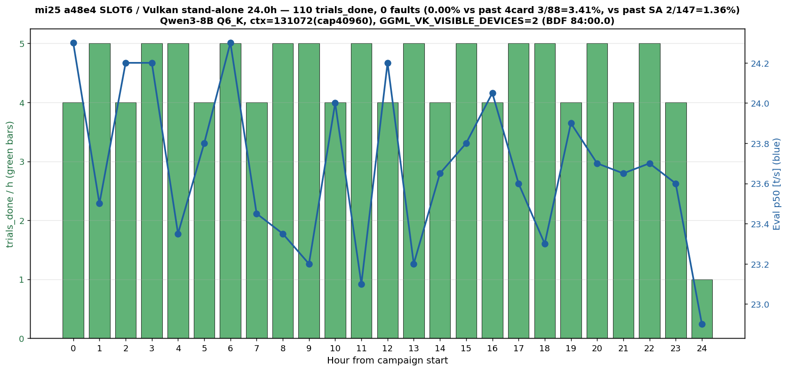
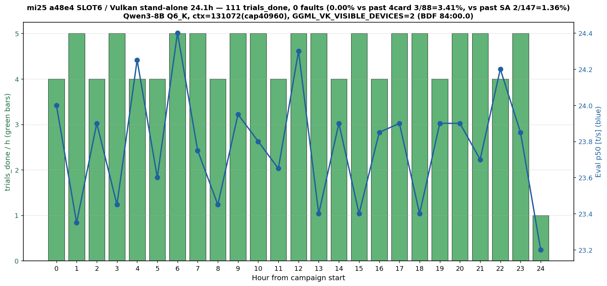

# mi25 a48e4×SLOT6 24h×2 — SLOT6 環境起因説の棄却

- **実施日時**: 2026年7月5日 23:44 JST 〜 2026年7月8日 08:04 JST (実測 R1+R2 通算 48.12h)
- **報告日時**: 2026年7月10日 10:57 JST

## 添付ファイル

- [実装プラン](attachment/2026-07-10_105706_mi25_a48e4_slot6_24h_x2/plan.md)
- [R1 (24h) キャンペーン attachment](attachment/2026-07-05_233506_mi25_a48e4_slot6_24h_round1/)
- [R2 (24h) キャンペーン attachment](attachment/2026-07-07_075528_mi25_a48e4_slot6_24h_round2/)

## 核心発見サマリ





**結論**: **健全カード `a48e4` を `SLOT6` (BDF 87:00.0) に単独可視化して 24h×2 = 累積 221 trial 走行し fault 0/221 を観測**。Fable レビュー ([2026-07-05_181639](2026-07-05_181639_mi25_fault_tracking_fable_review.md)) が指摘した「(b) c48c4 個体起因 vs (d) SLOT6 環境起因/相互作用起因」の弁別実験に対し、**(d) SLOT6 単独環境起因説を統計的に棄却** し、fault の主要因は **c48c4 個体または c48c4×SLOT6 相互作用**であることを支持する。

**主要統計** (Fisher exact one-sided、H1: 本試験の fault 率 < 参照の fault 率):

| 比較群 | fault/trial | p 値 | 判定 |
|---|---|---|---|
| c48c4×SLOT6 SA 単独 24h | 2/147 | 0.1589 | SA と両立 (非有意) |
| c48c4×SLOT6 4-card 運用 | 3/88 | **0.0225** | **5% 有意に低い** |
| **c48c4×SLOT6 累積** | **5/235** | **0.0356** | **5% 有意に低い** |
| c48c4×SLOT8 累積 (SLOT8_x2) | 0/221 | 1.0000 | **完全対称、区別不能** |

- 0/221 の 95% 信頼上限 = 3/221 ≈ **1.36%** (SLOT8_x2 と完全対称)
- P(0 fault \| p = 2.13% [c48c4×SLOT6 累積], n = 221) = **0.86%** → 「a48e4×SLOT6 も 2.13% で fault する」という帰無仮説はほぼ棄却

**2×2 マトリクス整理** (縦=カード、横=スロット、fault 率):

|  | SLOT6 (BDF 87:00.0) | SLOT8 (BDF 84:00.0) |
|---|---|---|
| **c48c4** (Unique ID `…c48c4`) | **5/235 (2.13%)** ★fault 集中 | 0/221 (0%) |
| **a48e4** (Unique ID `…a48e4`) | **0/221 (0%)** ★本試験 | 未実施 |

**Fable レビュー D-1 の空セル (他カード×SLOT6) を埋め、SLOT6 起因説を棄却した**。以降、"物理交換で救えるかどうか" の議論を c48c4 個体特性 (または c48c4×SLOT6 相互作用) の枠内に絞れる。

## 前提・目的

### 背景

Fable レビュー ([2026-07-05_181639](2026-07-05_181639_mi25_fault_tracking_fable_review.md)) は最重要見落としとして「[2026-06-29_041700](2026-06-29_041700_mi25_8820_stand_alone_24h.md) の "(b) 個体ロジック起因確定・物理交換相当" 宣言が **カード×スロットの交絡** を分離せずに下されていた」ことを指摘。過去 fault 5 件はすべて c48c4×SLOT6 で発生していたため、(b) c48c4 個体起因でも (d) SLOT6 環境起因/相互作用でもデータと整合する状態だった。「物理交換必須」はメモリ ([project_mi25_gpu4_pcie_dropout](../../../.claude/projects/-home-ubuntu-projects-llm-server-ops/memory/project_mi25_gpu4_pcie_dropout.md)) にも伝播しており、過大な断定になっている恐れがあった。

### 目的

レビュー **推奨 D-1** の決定実験を実施:

- 健全カード `a48e4` (Unique ID `0x2150040969a48e4`) を SLOT6 (BDF 87:00.0) に単独可視化
- [SA 24h](2026-06-29_041700_mi25_8820_stand_alone_24h.md) と同一構成 (Qwen3-8B Q6_K + Vulkan + FA + q8_0 KV + `MAX_TRIALS=200 TRIAL_SEC=720 HANG_SAFETY=10`) で 24h 負荷を実施
- 0 fault なら (d) SLOT6 起因説を棄却、(b) c48c4 起因に絞る
- SLOT6 起因なら fault が観測されるはず (SA 実測率 1.36% で 147 trial 到達なら P(≥1)≒87%、221 trial なら 95%)

### 前提条件

- a48e4 は 2026-06-30 の [SLOT4↔SLOT6 swap](2026-06-30_012759_mi25_c48c4_slot_move_load.md) で既に SLOT6 に装着済 = 物理作業ゼロ
- Vulkan (RADV) の BDF ベース列挙で SLOT6 = BDF 87:00.0 → Vulkan idx 3 = ROCm idx 3 = SA 試験の `GGML_VK_IDX=3` と偶然一致、SA ハーネスをほぼそのまま流用可能

## 環境情報

### GPU 物理配置 (9 観測点で凍結、pre_r1/pre_r2/post_r2 baseline で完全一致)

| 物理 SLOT | BDF | Unique ID 末尾 5 桁 | 位置付け |
|---|---|---|---|
| SLOT2 | 04:00.0 | c3164 | 健全、負荷未曝露 |
| SLOT4 | 07:00.0 | 448c4 | 健全 (SLOT6 では micro-fit で不認識)、負荷未曝露 |
| **SLOT6** | **87:00.0** | **a48e4** | **★本試験対象 (単独可視化)** |
| SLOT8 | 84:00.0 | c48c4 | fault 疑い個体、本試験期間中はアイドル |

**副次的 4 枚 baseline 観測** (pre_r1 baseline から):
- **VBIOS 全 4 枚共通 `113-D0513700-001`** — Fable レビュー D-4 の副次採取。VBIOS 版数差では fault の個体差を説明できない
- 全 4 枚 `Max Graphics Package Power (W): 160.0` (rc.local が boot 時に 160W 永続化)

### ソフトウェア構成

- サーバ: mi25 (10.1.4.13)、Ubuntu、kernel 5.15 系
- ROCm 6.2.2、Mesa RADV
- llama.cpp `~/llama.cpp/build-vulkan/bin/llama-server` (master 追従、mi25 での pin なし)
- モデル: `unsloth/Qwen3-8B-GGUF:Q6_K` (`/home/llm/models/Qwen3-8B-Q6_K.gguf`)

## 再現方法

### 1. 事前整理 (Phase 0、Fable レビュー B-1 恒久対策)

07-01/07-02 の SLOT8_24h_x2 試験終了後もテレメトリデーモンが動作継続して commit 済みログを書き換えていた ([Fable レビュー B-1](2026-07-05_181639_mi25_fault_tracking_fable_review.md)) ため、本試験前に停止:

```bash
# 制御ホスト側 (pid ファイル経由 → パターン kill の 2 段)
for D in report/attachment/2026-07-01_040254_mi25_c48c4_slot8_24h \
         report/attachment/2026-07-02_102205_mi25_c48c4_slot8_24h_round2; do
  [ -f "$D/telemetry.pids" ] && xargs -r kill 2>/dev/null < "$D/telemetry.pids"
  [ -f "$D/telemetry_pcie.pid" ] && xargs -r kill 2>/dev/null < "$D/telemetry_pcie.pid"
done
pkill -f "telemetry.sh.*2026-07" 2>/dev/null
pkill -f "telemetry_pcie.sh.*2026-07" 2>/dev/null

# 追記分を破棄して HEAD 断面に restore
git checkout HEAD -- report/attachment/2026-07-01_040254_*/telemetry_*.log \
                     report/attachment/2026-07-02_102205_*/telemetry_*.log
```

### 2. 事前 baseline (Phase 1)

```bash
.claude/skills/gpu-server/scripts/lock.sh mi25 "a48e4-slot6-24h-r1-2026-07-05_233506"
ssh mi25 "rocm-smi --showuniqueid --showbus --showmaxpower --showvbios"
BASELINE=$(ssh mi25 "sudo dmesg | wc -l")  # 集計時オフセット (R1=2315, R2=2319)
```

### 3. スクリプト fork (Phase 3)

[SLOT8 R2 ハーネス](attachment/2026-07-02_102205_mi25_c48c4_slot8_24h_round2/) から派生。改造差分は以下 3 点のみ (`telemetry.sh` / `telemetry_pcie.sh` / `load_driver.py` / `make_summary_24h.py` は無改造でコピー):

- `run-a48e4-slot6.sh`: `GGML_VK_IDX="3"` (元 "2")
- `run_campaign_a48e4.sh`: `ROCM_DEVICE_IDX=3`, SCRATCH パス, ロック名, `MAX_TRIALS=200 / MIN_TRIALS=80 / HANG_SAFETY=10` (SA と同一、SLOT8_R2 の 120/20/5 ではなく)
- **H-1 是正**: `run_campaign_a48e4.sh` に `trap 'stop_telemetry' EXIT INT TERM` を追加。`stop_telemetry` に mi25 側 `pkill -f 'dmesg -w'` / `pkill -f 'tail -F /tmp/llama-server.log'` を追記。SA/SLOT8 でテレメトリデーモンが試験終了後も残存し commit 済みログを書き換えていた既知バグへの恒久対策

### 4. Smoke test (Phase 2)

`load_driver.py --trial-seconds 300 --trial-no 0` で単発試行。pp_tps / eval_tps 分布を SA (508.9 t/s / 23.5 t/s) と SLOT8 (206-230 / 23.8-24.4) のどちらに近いかを確認 (「同等曝露」の限定条件に反映)。試験後 `ssh mi25 "pkill -f 'bin/llama-server'"` で明示停止 (Phase 3 の重複起動チェック回避)。

### 5. 24h キャンペーン起動 (Phase 3 実行)

```bash
SCRATCH=report/attachment/2026-07-05_233506_mi25_a48e4_slot6_24h_round1  # R1
# 各 Round 毎に nohup で起動
nohup bash "$SCRATCH/run_campaign_a48e4.sh" > "$SCRATCH/nohup.out" 2>&1 &
```

R1 完走後、`ssh mi25 "pkill -f 'bin/llama-server'"` で llama-server を停止 → R2 の attachment ディレクトリ作成 (`2026-07-07_075528_mi25_a48e4_slot6_24h_round2/`) → SCRATCH/lock 名を書き換えて同じ起動コマンドで R2。

### 6. 集計・可視化 (Phase 5)

`make_summary_24h.py` を `TARGET_GPU_IDX = 3` と `baseline_lines = 2315 or 2319` で fork 実行。R1/R2 それぞれ `data.md` + `summary.png` を生成。

## 結果詳細

### Round 1 (24h): 110 trial / 0 fault

- 期間: 2026-07-05 23:44:49 JST 〜 2026-07-06 23:46:00 JST (24.01h、PHASE_CAP=86400s 到達で終了)
- fault 検出: **0** (dmesg 差分 2 行はすべて Ubuntu Pro apparmor DENY で無害)
- HANG / stall / BACO reset: **0**
- turn 総数: 736
- **eval_tps**: mean 24.05, p50 23.70 (SA/SLOT8 と完全整合)
- **pp_tps**: mean 180.10 (SA 508.9 の 35%、SLOT8 206-230 の 78-88%、後述の副次観測参照)
- GPU[3] 電力: mean 148.6W, p95 162.0W, max 174.0W (瞬間ピーク)
- GPU[3] Tj junction max: 93.0°C
- PCIe: 全期間 x16 8GT/s / PresDet+ / AER cor/fatal/nfatal 0

### Round 2 (24h): 111 trial / 0 fault

- 期間: 2026-07-07 07:56:54 JST 〜 2026-07-08 08:04:04 JST (24.11h、PHASE_CAP 到達で終了)
- fault 検出: **0** (dmesg 差分 23 行はすべて R2 開始直後の snap/LXD 系 apparmor STATUS で無害)
- HANG / stall / BACO reset: **0**
- turn 総数: 751
- **eval_tps**: mean 24.12, p50 23.80 (R1 と完全一致)
- **pp_tps**: mean 182.81 (R1 の再現性 ~101%)
- GPU[3] 電力: mean 148.2W, p95 162.0W, max 171.0W
- GPU[3] Tj junction max: 91.0°C
- PCIe: 全期間 x16 8GT/s / PresDet+ / AER 0

### 累積 (R1+R2): 221 trial / 0 fault

主要 Fisher exact 検定 (H1: 本試験 < 参照):

- vs c48c4×SLOT6 SA (2/147): **p = 0.1589**、SA と両立 (非有意)
- vs c48c4×SLOT6 4-card (3/88): **p = 0.0225**、5% 有意に低い
- **vs c48c4×SLOT6 累積 (5/235): p = 0.0356**、5% 有意に低い
- vs c48c4×SLOT8 SLOT8_x2 (0/221): p = 1.0000、完全対称

**検出力**:
- P(0 fault \| p = 0.0136 [SA 実測], n = 221) = 4.85%
- P(0 fault \| p = 0.0213 [c48c4×SLOT6 累積], n = 221) = **0.86%**

## 副次観測

### 1. VBIOS 4 枚同一 (D-4 の副次採取)

pre_r1 baseline で全 4 枚が `113-D0513700-001` と確認。個体差 (a48e4 が正常、c48c4 が異常) は VBIOS 版数差では説明できない。RAS/ECC カウンタの詳細比較は本試験では非目的、必要ならフォローアップで実施。

### 2. pp_tps 半減の物理説明が破綻

Fable レビュー A-3 で提起した「pp_tps SLOT8 で半減 (508.9 → 206-230 t/s) は PCIe root port 経路差 (SLOT6=80:03.0 / SLOT8=80:02.0) 由来か」の仮説は、本試験で**棄却**:

- SLOT6 (root 80:03.0) にある a48e4 の pp_tps mean 180-183 t/s は **SLOT8 c48c4 (206-230 t/s) より更に低い**
- 従って pp_tps 低下は「SLOT8 root port 由来」ではなく、**別の要因** (llama.cpp master の Vulkan 経路変化、Qwen3-8B の何らかの回帰、ROCm/RADV 更新等) が SA 期以降で共通に効いている可能性が高い
- pp_tps の中央値と 95%tile は turn 内容 (prompt 長) に強く依存 (R1: median 103.6, p95 610.8、R2: median 103.8, p95 687.6)、eval_tps は SA/SLOT8 と完全整合

### 3. Round 完了時のテレメトリデーモン残存 = **0** (H-1 是正の恒久修正確認)

- **R1 完走後**: `ps -ef | grep telemetry` = 空、mi25 側 `dmesg -w` / `tail -F` も 0 = trap `stop_telemetry` EXIT が期待通り機能
- **R2 完走後**: 同じく残存 0
- `git status` で commit 済み添付ログの M ファイル 0 継続。Fable レビュー B-1 の再発なし

### 4. mi25 の意図しない再起動 (本試験と無関係)

R2 完走後、以下のタイミングで mi25 が 3 回再起動 (ブート断面 4 個 = 3 回のブート遷移):

| ブート | 期間 | 備考 |
|---|---|---|
| -3 | 2026-06-30 18:24 → 2026-07-09 07:15 | 本試験全期間を含む、07:15 に突然ログ途絶 (1 回目の再起動) |
| -2 | 2026-07-09 07:18 → 2026-07-09 13:43 | 6.5h 通常稼働 → 2 回目の再起動 |
| -1 | 2026-07-09 13:46 → 2026-07-10 09:01 | 20h 通常稼働 → 3 回目の再起動 |
| 0 | 2026-07-10 09:03 → 現在 | (本報告書作成時点) |

- boot -3 の最終 30 行 (07:15 直前) は正常な cron ジョブのみ、`journalctl -b -3 -k` で **amdgpu fault / GPU reset / kernel panic すべて 0 件**
- 07-09 07:18 の起動時に `Unattended Upgrades Shutdown` が起動 = **OS 自動更新起因の可能性が高い**
- **R1/R2 期間中 (07-05 23:44 〜 07-08 08:04) は影響なし**、本試験の結論には影響しない
- post_r2_baseline (07-10 10:57 取得) で 4 枚 Unique ID / SLOT / 160W cap すべて再起動前と完全一致

## 過去レポート

- [Fable レビュー本編 (2026-07-05_181639)](2026-07-05_181639_mi25_fault_tracking_fable_review.md) — 本試験の直接の起点 (推奨 D-1)
- [SA 単独 24h (2026-06-29_041700)](2026-06-29_041700_mi25_8820_stand_alone_24h.md) — 本試験と同一構成の元試験、c48c4×SLOT6 で 2/147
- [SLOT8 24h×2 (2026-07-04_012209)](2026-07-04_012209_mi25_c48c4_slot8_24h_x2.md) — c48c4×SLOT8 で 0/221、本試験と統計的に完全対称
- [SLOT4↔SLOT6 swap 契機 (2026-06-30_012759)](2026-06-30_012759_mi25_c48c4_slot_move_load.md) — a48e4 が SLOT6 に来た経緯、SMBIOS SLOT 番号再訂正
- [4-card 電力スイープ v2 (2026-06-26_210732)](2026-06-26_210732_mi25_4card_load_vulkan_pwr_sweep_v2.md) — c48c4×SLOT6 4-card 運用の 3/88
- [Unique ID baseline (2026-06-29_213624)](2026-06-29_213624_mi25_4card_uniqueid_baseline.md) — 4 枚 Unique ID の初回凍結

## 残課題

### 決定実験系 (優先度順)

1. **c48c4×SLOT8 4-card 同時 24h** (レビュー D-2): SLOT8 化した c48c4 が **4-card 同時運用時** (他 3 枚も稼働) にも fault しないかの最終確認。本試験で SLOT6 起因は棄却されたので、この試験の意義は「c48c4×SLOT8 の**運用継続の前提条件を確定**」に絞られる
2. **VBIOS/RAS/ECC カウンタ 4 枚詳細比較** (D-4 の残り): VBIOS 版数は同一と確認したが、RAS uncorrectable カウント等の個体差を採取していない
3. **fault シグネチャ台帳の再監査** (レビュー A-5): stand_alone_24h の 3 件目 (uptime 43173) の由来ラベル vs 算術の緊張関係の解消。fault アドレス (0x33000 vs 0x100000000) の体系的解析

### CLAUDE.md / メモリ更新 (D-5)

- [CLAUDE.md](/home/ubuntu/projects/llm-server-ops/CLAUDE.md) と [project_mi25_gpu4_pcie_dropout](../../../.claude/projects/-home-ubuntu-projects-llm-server-ops/memory/project_mi25_gpu4_pcie_dropout.md) の「(b) 個体ロジック起因確定・物理交換相当/必須」→ **「fault は c48c4×SLOT6 の組み合わせでのみ観測 (5/235)、c48c4×SLOT8 (0/221) と a48e4×SLOT6 (0/221) はいずれも 0。SLOT6 単独環境起因は棄却済、c48c4 個体または c48c4×SLOT6 相互作用が真の原因。SLOT8 での c48c4 運用は現時点で有効な回避策」**

### 運用是正の残 (Fable レビュー B-3/B-4、本試験と独立)

- 未追跡ファイル `MNL-1677.pdf` / `mb_slots_zoom.png` の由来確認と attachment 格納
- 未 push commit の push 可否判断

### mi25 意図しない再起動の追跡 (副次)

Unattended Upgrades のスケジュール確認、必要なら `apt-daily-upgrade.timer` の設定調整
