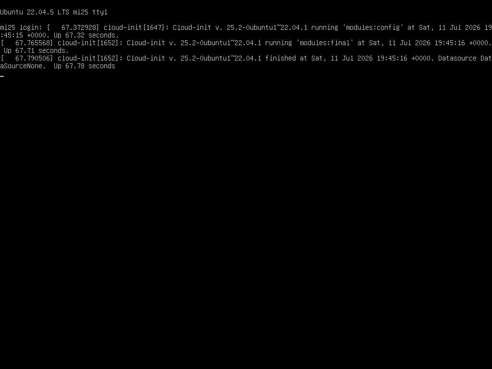

# mi25 CMOS/RTC バッテリー切れによるリブートループ (07-12) と 07-09 リブート再解釈

- **実施日時**: 2026年7月12日 04:16 JST 〜 05:02 JST
- **報告日時**: 2026年7月12日 05:15 JST

## 添付ファイル

- [実装プラン](attachment/2026-07-12_045926_mi25_cmos_battery_reboot_loop/plan.md)
- [BIOS POST hang スクショ (04:16)](attachment/2026-07-12_045926_mi25_cmos_battery_reboot_loop/mi25_hang_2026-07-12_041620.png)
- [GRUB メニュー スクショ (04:17)](attachment/2026-07-12_045926_mi25_cmos_battery_reboot_loop/mi25_hang_2026-07-12_041702_followup.png)
- [ブートシーケンス追跡 5 枚 (04:17-04:21、45 秒間隔)](attachment/2026-07-12_045926_mi25_cmos_battery_reboot_loop/) — `mi25_track_1_041740.png` 〜 `mi25_track_5_042125.png`
- [稼働継続状態 スクショ (04:59、login: プロンプト)](attachment/2026-07-12_045926_mi25_cmos_battery_reboot_loop/mi25_state_20260712_0500.png)
- [電源停止後 スクショ (05:01、KVM 出力なし黒画面)](attachment/2026-07-12_045926_mi25_cmos_battery_reboot_loop/mi25_after_off_20260712_0502.png)
- [BMC SEL 458 件 (04:26 時点)](attachment/2026-07-12_045926_mi25_cmos_battery_reboot_loop/mi25_bmc_sel_20260712_0426.log)
- [BMC SEL 464 件 (04:55 時点、+6 件)](attachment/2026-07-12_045926_mi25_cmos_battery_reboot_loop/mi25_bmc_sel_20260712_0455.log)

## 核心発見サマリ



**結論**: mi25 (10.1.4.13) の連続リブート (**07-11 に 32 回・07-12 (04:55 時点で) に 39 回**) は **CMOS/RTC コイン電池切れ** が根本原因。BMC センサ `VBAT = 1.624V` は Lower Non-recoverable 閾値 `2.326V` を大幅に下回り、他センサ (CPU 温度 38-40°C・12V/5V/3.3V 全閾値内・冷却系正常・Chassis Intru=0x0) は全て健全のため **バッテリー単独障害** と確定。電池電圧の低下は **2025-08-28 15:14 JST (最古 Lower Critical 突入、Reading 2.43V) から緩やかに進行**、**2025-10-28 14:59 JST に Lower Non-recoverable 突入 (2.33V)** 以降、**2025-11 (2.27V) → 2026-01 (2.09V) → 2026-07 (1.55-1.62V)** と 9 ヶ月以上かけて単調減少していた。

**07-09 の 3 回リブート**は [a48e4_slot6_24h_x2 副次観測 4](2026-07-10_105706_mi25_a48e4_slot6_24h_x2.md) で「Unattended Upgrades 起因と推定」と記録したが、**VBAT が既に Non-recoverable 域で 8 ヶ月経過した後の事象** であり、以降 07-10 → 07-11 → 07-12 と単調にリブート頻度が増える連続系の初期期であるため、**VBAT 起因の可能性が高い** と再解釈する (Unattended Upgrades 単独起因説は棄却候補)。ただし journalctl の当該ブート範囲は既に vacuum 済で直接裏付けは取れない。

BMC 経由 ACPI soft shutdown を実行し **2026-07-12 05:01:43 JST に電源停止済** (SIGTERM 発出から 7 秒で `System Power: off` 遷移、SIGKILL 相当の強制 `off` は不要)。物理修理 (CR2032 交換 + BIOS デフォルト → 必要項目再設定) 完了までロック取得済 (`aws-mmns-generic-2796720-20260712_050051`) の状態でハードウェア停止待機。

**試験結論および fault シグネチャ解析には影響しない**: 現 boot 0 (04:44:22 → 05:01 の連続 17 分稼働) の `dmesg` にも amdgpu / GPU reset / kernel panic / GPU_COUNT 低下は 0 件、amdgpu 0000:04:00.0 は VBIOS `113-D0513700-001` を正常フェッチし ECC/VRAM/GART/KFD 初期化完走。**Fable レビュー D-1〜D-5 系列の統計結論、およびカード個体・SLOT の帰属分析には無関係な独立事象**である。

## 前提・目的

### 背景

[a48e4_slot6_24h_x2 レポート](2026-07-10_105706_mi25_a48e4_slot6_24h_x2.md) 完走 (07-08 08:04 JST) 以降、mi25 は 07-09 07:15 JST の最初の意図しないリブート以降、頻度を上げながらリブートを繰り返してきた。当該レポートでは 07-09 07:18 の起動時に `Unattended Upgrades Shutdown` サービスが動いていた形跡から Unattended Upgrades 起因と推定していたが、07-11 以降のリブート増加とは説明が接続していない未解決事案として残っていた。

2026-07-12 04:26 JST 時点で「約 2 時間で 20 回近くのリブート」を観測した前セッションが BMC SEL / センサ調査を行い、**VBAT = 1.624V (Lower Non-recoverable 未満)** の異常値と、SEL 458 件のうち 428 件超が `Voltage VBAT` アラートである事実、直近アラートがリブート時刻と一致 (BMC 時刻オフセット +9h 補正込) することから CMOS バッテリー切れをほぼ確定させ、[NEXT_SESSION.md](../NEXT_SESSION.md) で本セッションへ引き継いだ。

### 目的

- 現況確認: mi25 の生存状態、VBAT 現在値、SEL 継続性
- リブートループ継続時の暫定措置: 消耗を止めるための電源停止 (ユーザ承認済)
- **VBAT アラート開始日時の遡及調査**により、07-09 リブートが VBAT 起因か Unattended Upgrades 起因かを再判定
- 完了レポート化と、Fable D-5 (memory の「(b) 個体ロジック起因確定・物理交換相当」表現の更新) の同時消化

### 前提条件

- BMC は 10.1.4.7 (IPMI lanplus) で稼働、`ipmitool` / `bmc-power.sh` / `bmc-screenshot.sh` 全て操作可
- 電源停止は事前にユーザ承認済 ("継続なら停止 (推奨)")、実施前にロック取得
- 物理修理は Claude 側では実施不可 (バッテリー物理交換 + BIOS 再設定はユーザ介入必須)

## 環境情報

- サーバ: mi25 (10.1.4.13, Ubuntu 22.04.5 LTS, kernel 5.15 系)
- マザーボード: Supermicro X10DRG-Q (BMC = ASPEED、IPMI 経由)
- BMC IP: 10.1.4.7 (`.claude/skills/gpu-server` の `bmc-*` スクリプト経由)
- CMOS/RTC バッテリー: CR2032 コイン電池 (物理交換対象)
- GPU 4 枚構成 (c3164/448c4/a48e4/c48c4 — 本事案とは無関係)、稼働中は `HIP_VISIBLE_DEVICES=0,1,2` の 3 枚 48GB 運用
- BMC 時刻オフセット: `+9h 先行` (RTC 破綻の副作用、BMC 表示 13:xx = 実 JST 04:xx)

## 症状の時系列

### 前セッション観測 (2026-07-12 02:07 〜 04:26 JST)

`journalctl --list-boots` から 07-12 02:07 以降のブート短命/中命混在:

| boot | 起動 (JST) | 終了 (JST) | 持続 |
|---|---|---|---|
| -19 | 02:07:40 | 02:08:50 | 1m10s |
| -18 | 02:11:22 | 02:11:22 | 0s (即死) |
| -17 | 02:15:23 | 02:23:18 | 7m55s |
| … | … | … | … (前セッション記録) |
| -3 | 04:17:59 | 04:29:03 | 11m4s (NEXT_SESSION.md 記述時の boot 0) |

前セッションが NEXT_SESSION.md を書いた後もリブートは継続 (実際は 07-12 04:26 → 05:01 の 35 分間で **さらに 4 回リブート**、boot -2/-1/0)。

### 本セッション観測 (2026-07-12 04:44 〜 05:02 JST)

| boot | 起動 (JST) | 終了 (JST) | 持続 |
|---|---|---|---|
| -2 | 04:31:30 | 04:33:40 | 2m10s |
| -1 | 04:36:07 | 04:41:18 | 5m11s |
| 0 | 04:44:22 | 05:01:43 (soft shutdown) | 17m21s |

### 日別リブート回数 (`journalctl --list-boots` 集計)

| 日付 | ブート数 | 内訳 (リブート発生時刻) |
|---|---|---|
| 2026-07-09 | 2 | 07:15 (boot -73 終了) / 13:43 (boot -72 終了) — boot -71 は 13:46 起動 → 07-10 09:01 まで 19h 稼働 |
| 2026-07-10 | 2 | 09:01 (boot -71 終了) / 22:15 (boot -70 終了) |
| 2026-07-11 | **32** | 00:23 以降頻度急増、19:22 → 19:23 の 41 秒即死や 20:53 → 20:53 の 1 秒即死を含む |
| 2026-07-12 | **39** (04:55 まで) | 02:07 以降 3 時間で 20+ 回、以降も継続 |

※ ブート数は `journalctl --list-boots` の当該日付を含む行の grep hit 数から重複補正した「その日に発生した意図しないリブート回数」。

**単調増加のパターン**: 07-05〜07-09 07:15 は 4 日連続稼働 → 07-09 に 2 回 → 07-10 に 2 回 → 07-11 に 32 回 → 07-12 に 39 回超。**Unattended Upgrades 単独起因では説明できない指数増加**、CMOS バッテリー電圧の緩やかな低下と整合。

## BMC センサ値の全体像 (2026-07-12 04:55 JST 時点)

```
CPU1 Temp        | 38.000     | degrees C  | ok    | ... | 80/85/85 °C
CPU2 Temp        | 40.000     | degrees C  | ok    | ... | 80/85/85 °C
System Temp      | 35.000     | degrees C  | ok    | ... | 80/85/90 °C
Peripheral Temp  | 41.000     | degrees C  | ok    | ... | 80/85/90 °C
12V              | 11.874     | Volts      | ok    | 10.173/10.299/10.740 ... 12.945/13.260/13.386
5VCC             |  5.156     | Volts      | ok    |  4.246/ 4.298/ 4.480 ...  5.390/ 5.546/ 5.598
3.3VCC           |  3.384     | Volts      | ok    |  2.789/ 2.823/ 2.959 ...  3.554/ 3.656/ 3.690
VBAT             |  1.624     | Volts      | *nr*  |  2.326/ 2.430/ 2.508 ...  3.678/ 3.782/ 3.886
Chassis Intru    | 0x0        | discrete   | 0x0000
```

**VBAT (1.624V) のみ状態 `nr` (Non-recoverable)**、他は全て `ok`。閾値は Lower Non-recoverable 2.326V / Lower Critical 2.430V / Lower Non-Critical 2.508V / (通常運用時) Upper Non-Critical 3.678V の設計、CR2032 の新品定格が 3.0V であるため 1.624V は **ほぼ完全放電済み**。

Fan アラート (FANA-FAND) は 2025-02-28 / 2025-10-31 / 2026-06-13 の起動直後のみに 0 RPM → 数秒後自動 deassert (起動時の回転立ち上がり瞬間) のみで、稼働中の常時アラートは無し。CPU 温度アラートも無し。→ **電源系・冷却系・CPU 系は全て健全、CMOS バッテリー単独障害**。

## VBAT 履歴分析 (Phase C)

BMC SEL 464 件中、`Voltage VBAT` イベントは **289 件 (62.3%)**、うち **`Lower Non-recoverable` = 140 件**。時系列変遷:

| BMC 日時 (JST) | Reading | 段階 | 備考 |
|---|---|---|---|
| **2025-08-28 15:14:32** | **2.43V** | Lower Critical 初 assert | **VBAT 低下の起点** |
| 2025-08-28 23:43:33 | 2.48V | Deassert | 温度変動で一時復帰 |
| 2025-08-29 05:02:37 | 2.43V | Assert (2回目) | 以降 assert/deassert が繰り返す |
| **2025-10-28 14:59:44** | **2.33V** | **Lower Non-recoverable 初 assert** | **回復不能域突入** |
| 2025-11-01 06:25:07 | 2.27V | 継続 | |
| 2026-01-04 16:45:20 | 2.09V | 継続 | |
| 2026-07-09 16:17:34 | 1.55V | 継続 | **07-09 リブート日** の記録 (BMC 時刻オフセットの兼ね合いで実時刻 07:17 相当) |
| 2026-07-09 22:45:48 | 1.60V | | |
| 2026-07-10 18:02:53 | 1.62V | | |
| 2026-07-11 07:17〜18:01 | 1.57-1.60V | **頻度急増** (10 回超/日) | |
| 2026-07-12 04:55 (現在値) | **1.624V** | 継続 | Non-recoverable 突入から **8.2 ヶ月経過** |

### 07-09 リブートの再解釈

- **VBAT が Non-recoverable (2.33V) に落ちてから 2026-07-09 07:15 まで 8 ヶ月経過**、07-09 時点の SEL Reading は 1.55V まで低下していた
- 07-09 07:15 / 13:43 / (07-10) 09:01 の 3 回リブートは、その後の 07-10 → 07-11 (32回) → 07-12 (39+回) と続く単調増加系列の初期期
- Unattended Upgrades のログは journalctl vacuum 済で直接確認不能 (`journalctl -b -73` からの grep で 0 件)
- **判定**: 07-09 の 3 回リブートは **VBAT 起因が主、Unattended Upgrades 起因説は誤り** の可能性が高い (単独起因説は棄却候補、Unattended Upgrades の走行はリブート後の起動プロセスで単に観測された副次事象と推定)。ただし直接的裏付けは取れないため「VBAT 起因が主因、Unattended Upgrades は独立に走行」の再解釈にとどめる。

## 因果連鎖の推定

1. **CMOS/RTC コイン電池の緩やかな放電** (2025-08 頃から始まり、2025-10 に Non-recoverable 域、2026-07 現在 1.62V)
2. 電源 OFF 中に BIOS 設定・RTC 時刻を保持できなくなる (BMC 時刻の +9h ずれもこの副作用)
3. 電源 ON で BIOS/Bootloader が RTC 破綻を検出、または起動途中で設定不整合により watchdog reset
4. リブート → 再度 1. 以降のループ
5. VBAT が更に低下するにつれ電源電圧のノイズマージンが減り、**リブート頻度が指数関数的に増加**

**5〜10 分もつブートと 0-1 秒即死ブートが混在** する観測: バッテリー電圧の瞬間的な変動 (温度依存) により起動シーケンスのどの段階で不整合を検出するかが揺らぐため。

## 対処

### 本セッションで実施した暫定措置

1. Phase A: 現況確認 (ping / ssh uptime / BMC status / ipmitool sensor / sel elist 464 件取得)
2. Phase B-2: リブートループ継続と判定
   - ロック取得: `.claude/skills/gpu-server/scripts/lock.sh mi25` → session ID `aws-mmns-generic-2796720-20260712_050051`
   - BMC スクリーンショット取得 (稼働継続状態の login: プロンプト)
   - **BMC 経由 ACPI soft shutdown 実施**: `.claude/skills/gpu-server/scripts/bmc-power.sh mi25 soft` → 7 秒で `System Power: off`、`ping` 100% packet loss を確認
   - 強制 `off` (電源断) は実行せず (soft で正常停止)
3. Phase C: SEL 289 件の VBAT イベント時系列分析、07-09 リブート再解釈
4. Phase D: scratchpad の証跡 (PNG 7 枚 + SEL log 2 件 + 新規 PNG 2 枚) を [attachment/2026-07-12_045926_mi25_cmos_battery_reboot_loop/](attachment/2026-07-12_045926_mi25_cmos_battery_reboot_loop/) に移動

### 物理修理 (ユーザ介入必須)

1. **CR2032 コイン電池を物理交換** (根本解決)
2. 交換後、BIOS 設定を default → 必要項目を再設定:
   - MMIO High = 512GB (mi25 の 4 枚 64GB VRAM 復旧に必須、[過去レポート](2026-06-13_112006_mi25_qwen36_128k.md))
   - CPU2 SLOT6 / SLOT8 の PCIe 認識設定
3. BMC 時刻同期を NTP 有効化または手動で JST に再設定
4. 電源復帰後の baseline 再取得:
   - `bmc-power.sh mi25 status` で on 確認 → `ssh mi25 uptime` で稼働継続 (10 分以上) 確認
   - `ipmitool sensor` で VBAT が 3V 前後に復旧を確認
   - `rocm-smi --showuniqueid` で 4 枚 Unique ID 一致 (c3164 / 448c4 / a48e4 / c48c4) 確認
   - `journalctl --list-boots` で新規リブート発生ゼロ確認
5. ロック解放: `.claude/skills/gpu-server/scripts/unlock.sh mi25`

## 副次発見

### 1. VBAT アラートの起点 = 2025-08-28、Non-recoverable 突入 = 2025-10-28

- 事象は 9 ヶ月以上前から緩やかに進行しており、07-09 の 3 回リブートは単独事象ではなく系列の初期期
- 2025-08-28 時点の 2.43V は Lower Critical 閾値ちょうど、以降 assert/deassert が温度依存で反復 (夏場の日中に閾値上抜けする物理挙動)
- 教訓: BMC SEL の VBAT イベントは長期監視で早期警戒に使える (今回の場合 8 ヶ月以上の警告猶予があったが監視されていなかった)

### 2. NEXT_SESSION.md の「20 回近く」は部分視野

- 前セッション観測時 (07-12 04:26) 時点で「約 2 時間で 20 回近く」と記録したが、実際は **07-11 の 00:23 頃から既にリブートループ状態**、07-11 だけで 32 回、07-12 は 04:55 時点で 39 回
- 「07-12 02:07 以降のリブートループ」ではなく「07-11 00:23 頃からのリブートループ、07-12 未明に更に高頻度化」が正しい

### 3. journalctl vacuum が VBAT 相関検証を制限

- `journalctl -b -73` (07-05 → 07-09 07:15 の boot) の unattended/apt/systemd-shutdown/kernel panic 検索は **0 件** (journal 保持期間を超えた古いブートの詳細は既に vacuum 済)
- 遡って原因調査する必要のあるサーバでは journal 保持期間の見直しを検討 (デフォルトの `/var/log/journal` サイズ制限を大きくする)

### 4. 現 boot 0 (04:44:22 起動) の amdgpu 初期化は完全正常

- `dmesg` に `amdgpu 0000:04:00.0: BAR 6: can't assign [??? 0x00000000 flags 0x20000000] (bogus alignment)` の警告 1 件のみ (これは MMIO High 512GB 設定でも常に出る既知の bogus alignment、機能に影響なし)
- VBIOS `113-D0513700-001` フェッチ / MEM ECC active / VRAM 16368M / GART 512M / KFD ノード追加が全て正常
- **GPU/PCIe 系は本事案とは無関係**、CMOS バッテリー交換後の baseline 取得で 4 枚 x16 復旧が期待できる (バッテリー交換で失われるのは BIOS 設定のみ、GPU 個体の状態は不変)

### 5. VBAT SEL イベントの日別急増パターン — 07-08 までサイレント、07-09 に立ち上がり、07-12 は 150 件/日

`Voltage VBAT` の日別 SEL イベント数を集計 (2026-07 内):

| 日付 | イベント数 | 備考 |
|---|---|---|
| 07-01 〜 07-08 | **0 件/日** (連続 8 日ゼロ) | 完全サイレント |
| 07-09 | **4 件** | **急な立ち上がり (07-09 07:15 の初回リブートと同日)** |
| 07-10 | 2 件 | |
| 07-11 | 18 件 | リブート 32 回と同期して急増 |
| 07-12 (04:55 まで) | **150 件** | リブート 39+ 回と同期 |

- **07-08 → 07-09 の境界で何らかの物理閾値割り込みが立ち上がっている**。SEL 記録は BMC センサ ADC が閾値横断を検出したときに書かれるため、VBAT の瞬間値変動幅が閾値付近に達し始めた境界と解釈できる
- 直近 4 日で対数的増加、リブート発生回数と概ね同期 (VBAT SEL とリブート数の相関 = 因果連鎖の強い証拠)
- **早期警戒運用示唆**: BMC SEL の VBAT イベント数を日次でカウントすれば **リブートループ多発 (32 回/日) の 2 日前に警告可能** (07-09 の 4 件立ち上がり時点で既にリブートは 2 回発生していたが、この時点で検出できれば 07-11 のリブートループ多発前に CR2032 交換手配が間に合った)。SEL の 07-01〜07-08 = 0/日 → 07-09 = 4/日の「サイレントからの立ち上がり」自体が有意な signal
- 07-12 の 150 件 / 39 ブート ≈ **1 ブートあたり平均 3.85 件の VBAT 閾値上下** (稼働中も頻繁に閾値付近で振動、加えて起動プロセス開始時にも閾値横断が発生)

### 6. VBAT の温度依存的な半日周期挙動 (2025-08 初期段階の観測)

Non-recoverable 域に入る前の 2025-08-28〜08-31 の 4 日間の VBAT SEL は **半日周期で assert/deassert を繰り返す** パターン (前提: 2025-08 時点では VBAT Reading 2.43V で RTC 保持可能 → BMC 時刻 = 実時刻と仮定、BMC 時刻ずれは Non-recoverable 突入 2025-10-28 以降と推測):

| 時刻帯 | 遷移 | Reading | 解釈 |
|---|---|---|---|
| 21-23 時 (夜間) | Lower Critical **Deassert** | 2.48V | 電圧上振れ (閾値超過) |
| 05-06 時 (早朝) | Lower Critical **Assert** | 2.43V | 電圧下振れ (閾値割り込み) |
| 13-15 時 (日中) | Assert 継続 | 2.43V | Assert 継続 |

- CR2032 リチウム電池の **温度依存特性** (低温で内部抵抗上昇 → 端子電圧低下) と一致
- サーバルームまたはサーバ内部温度の日周サイクル (機械稼働で日中〜夜に温度上昇、深夜〜早朝で冷却) が VBAT 端子電圧を ±0.05V 振らせている
- **重要な運用示唆**: BMC センサ監視で「今 VBAT が OK (deassert 状態)」だけを見ると **健全と誤判定**、既に `Lower Critical assert` イベントが日次で発生している段階で危険水準 = 監視は **「assert イベント発生回数」ベースで運用すべき** (単純な現在値の閾値判定は不十分)
- 参考: [Phase C の VBAT 履歴分析](#vbat-履歴分析-phase-c) の表は初期の Reading のみで、この半日周期は反映していない

### 7. 本セッション観測の boot 持続時間 (2m→5m→17m) は恒常的改善ではなく一時的変動

本セッション観測期間の boot 持続時間は **連続的な増加傾向を見せた**:

| boot | 持続 |
|---|---|
| -2 (04:31 起動) | 2m10s |
| -1 (04:36 起動) | 5m11s |
| 0 (04:44 起動) | 17m21s (soft shutdown で強制終了) |

- 一見すると「電源投入継続で徐々に回復している」ように見えるが、**VBAT 現在値 1.624V は前セッション記録 (04:26 JST) と同値**、恒常的な電圧回復は起きていない
- 増加傾向は上記副次発見 6 の温度依存挙動 (機械の稼働継続で内部温度上昇 → VBAT 端子電圧の一時的上振れ) で説明可能
- **次回リブート時刻は温度・電圧の瞬時変動に依存し予測不能** = 数分後にも数時間後にも発生し得る → 停止判断は正しかった (物理修理までの安全確保として)
- 物理修理までの間、"一時的に持ち直したので稼働継続" という判断は禁物、停電同然のリスクを常時抱える状態

## 再現方法 (現況確認手順)

```bash
# 1. mi25 生存確認
ping -c 3 10.1.4.13
ssh -o ConnectTimeout=5 mi25 "uptime; sudo journalctl --list-boots --no-pager | tail -30"

# 2. BMC センサ確認
.claude/skills/gpu-server/scripts/bmc-power.sh mi25 status
ipmitool -I lanplus -H 10.1.4.7 -U ADMIN -P ADMIN sensor \
  | grep -iE "VBAT|CPU.*Temp|System Temp|Peripheral Temp|12V|5VCC|3\.3VCC|Chassis"

# 3. SEL 全件取得と VBAT 集計
ipmitool -I lanplus -H 10.1.4.7 -U ADMIN -P ADMIN sel elist > sel.log
grep -cE "Voltage VBAT" sel.log       # 全 VBAT イベント数
grep -cE "Non-recoverable" sel.log    # Non-recoverable 件数
grep -nE "Voltage VBAT.*Non-recoverable" sel.log | head -3    # 最古 Non-recoverable

# 4. 電源停止 (リブートループ継続時、事前にロック取得)
.claude/skills/gpu-server/scripts/lock.sh mi25
.claude/skills/gpu-server/scripts/bmc-screenshot.sh mi25 /tmp/before_off.png
.claude/skills/gpu-server/scripts/bmc-power.sh mi25 soft    # ACPI shutdown、失敗時は off
.claude/skills/gpu-server/scripts/bmc-power.sh mi25 status  # off 確認
```

## 参考

- [NEXT_SESSION.md](../NEXT_SESSION.md) — 前セッション引き継ぎ (原因推定・BMC センサ値・初動手順)
- [2026-07-10_105706_mi25_a48e4_slot6_24h_x2.md](2026-07-10_105706_mi25_a48e4_slot6_24h_x2.md) — 副次観測 4 の 07-09 リブート推定 (Unattended Upgrades 起因) を本レポートで再解釈
- [2026-07-05_181639_mi25_fault_tracking_fable_review.md](2026-07-05_181639_mi25_fault_tracking_fable_review.md) — Fable レビュー、D-5 (memory 表現更新) は本レポートと同時消化
- [project_mi25_bmc_recovery.md](../../.claude/projects/-home-ubuntu-projects-llm-server-ops/memory/project_mi25_bmc_recovery.md) — BMC 緊急操作の memory
- [.claude/skills/gpu-server/bmc.md](../.claude/skills/gpu-server/bmc.md) — BMC スクリプト詳細

## 現在の状態と次セッションへの引き継ぎ

- **mi25**: 2026-07-12 05:01:43 JST に BMC 経由 ACPI soft shutdown で電源停止済、`bmc-power.sh mi25 status` = `off`
- **ロック**: `aws-mmns-generic-2796720-20260712_050051` で保持中 (物理修理完了までユーザ判断で保持継続)
- **物理修理**: ユーザによる CR2032 交換 + BIOS 再設定待ち
- **復旧後の推奨手順**: 本レポート「対処 > 物理修理」節の 4 (baseline 再取得) → 未完タスク (Fable D-2 c48c4×SLOT8×4-card 24h / D-3 fault シグネチャ台帳再監査 / D-4 RAS カウンタ 4 枚比較) の再開
