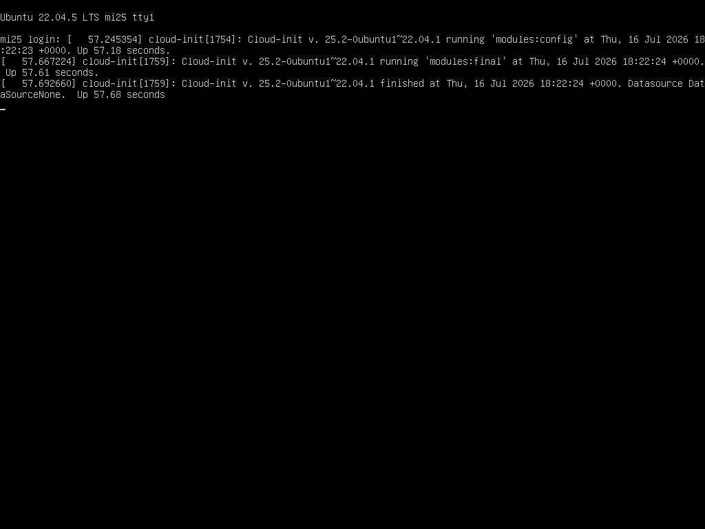

# mi25 CMOS バッテリー交換後の BIOS 再設定 (PCIe + Boot 順) 復旧

- **実施日時**: 2026年7月17日 13:22 〜 13:55 JST (KVM 経由 BIOS 再設定・OS 起動確認)
- **報告日時**: 2026年7月17日 13:55 JST

## 添付ファイル

- [実装プラン](attachment/2026-07-17_135433_mi25_bios_restore_after_cmos/plan.md)
- [PXE fail (電池交換直後の初期起動失敗)](attachment/2026-07-17_135433_mi25_bios_restore_after_cmos/01_before_pxe_fail.png)
- [BIOS Main タブ (Aptio Setup Utility 到達)](attachment/2026-07-17_135433_mi25_bios_restore_after_cmos/02_bios_main.png)
- [PCIe/PCI/PnP Configuration (変更前: MMIOHBase=56TB, MMIO High=256GB)](attachment/2026-07-17_135433_mi25_bios_restore_after_cmos/03_pcie_config_before.png)
- [MMIOHBase 3TB に変更後](attachment/2026-07-17_135433_mi25_bios_restore_after_cmos/04_mmiohbase_3tb.png)
- [MMIO High Size 512GB に変更後](attachment/2026-07-17_135433_mi25_bios_restore_after_cmos/05_mmiohigh_512gb.png)
- [IIO1 Configuration (デフォルトで期待値と一致、変更不要)](attachment/2026-07-17_135433_mi25_bios_restore_after_cmos/06_iio1_default.png)
- [IIO2 Configuration (デフォルトで期待値と一致、変更不要)](attachment/2026-07-17_135433_mi25_bios_restore_after_cmos/07_iio2_default.png)
- [Secure Boot Menu (Disabled 確認、CSM Support Enabled)](attachment/2026-07-17_135433_mi25_bios_restore_after_cmos/08_secure_boot_disabled.png)
- [Boot タブ (初期: Boot Order #1 = Legacy Hard Disk、Network #7 で PXE 起動)](attachment/2026-07-17_135433_mi25_bios_restore_after_cmos/09_boot_tab_initial.png)
- [Boot Order #1 を UEFI Hard Disk:ubuntu に変更後](attachment/2026-07-17_135433_mi25_bios_restore_after_cmos/10_boot_order1_uefi_hd.png)
- [Ubuntu 22.04.5 LTS 起動確認 (login: プロンプト)](attachment/2026-07-17_135433_mi25_bios_restore_after_cmos/11_ubuntu_login_prompt.png)

## 核心発見サマリ



**結論**: mi25 (10.1.4.13, Supermicro X10DRG-Q) の CMOS/RTC コイン電池物理交換後、BMC KVM 経由で BIOS 設定を再設定し **Ubuntu 22.04.5 LTS の起動と SSH 到達に成功**。設定は過去実績 ([2026-06-13 4 枚復旧レポート](2026-06-13_112006_mi25_qwen36_128k.md) / [2026-06-14 PCIe dropout レポート](2026-06-14_131713_mi25_gpu4_pcie_dropout.md)) に照らして復旧。**GPU 4 枚は電池交換で取り外し中のため未装着** (ユーザ確認済み)、4 枚認識確認は次セッションで実施予定。

**Claude が変更した BIOS 項目 (実質 3 点)**:
- `Advanced → PCIe/PCI/PnP Configuration → MMIOHBase`: **56 TB → 3 TB** (default が MI25 4 枚に不適合、512GB 帯域を確保するため 3T ベース必須)
- `Advanced → PCIe/PCI/PnP Configuration → MMIO High Size`: **256 GB → 512 GB** (4 枚目 GPU Root Port `80:02.0` の BIOS 無効化を防ぐ mi25 の絶対必須項目)
- `Boot → Boot Option Priorities → Dual Boot Order #1`: **[Hard Disk] (Legacy MBR) → [UEFI Hard Disk:ubuntu]** (default では Legacy Hard Disk で NVMe UEFI/GPT を検出できず PXE に落ちて起動失敗した)

**default で既に期待値と一致していた項目 (変更不要)**:
- Above 4G Decoding = **Enabled** (今回の default で既に Enabled、過去実績と一致)
- IIO1 CPU1 SLOT2/4/10 + IIO2 CPU2 SLOT6/8/11 全て **Gen 3 (8 GT/s)** (default)
- IIO1/IIO2 IOU0/1/2 Non-Posted Prefetch = **Disable** (default)
- Boot Mode Select = **DUAL** (Legacy+UEFI 併用、default)
- Secure Boot = **Disabled**、CSM Support = **Enabled** (default、amdgpu-dkms 非署名運用と整合)

**副次発見の要点**:
- **初回 Save & Exit 後の PXE fail**: Boot Order #1 の Legacy "Hard Disk" では NVMe が UEFI/GPT インストールで認識できず、Network (PXE) に落ちて `NBP is too big` で停止。UEFI Hard Disk エントリに #1 を変更して解決 (**Claude の当初計画は「default で Hard Disk が #1 なので変更不要」と誤判断していた点を修正**)
- **BMC 時刻が 2015-01-02 で完全リセット** (前セッション観測の "+9h 先行" とは異なる)。`ipmitool sel time set` で JST に同期しようとしたが **"Specified time could not be parsed" エラー**、BMC FW 3.94 の年範囲制限か date 形式互換性の問題と推定。恒久解決は BMC Web UI での手動設定または NTP Enable が必要
- **Ubuntu 側 RTC も CR2032 電池切れの影響で起動直後に約 10 時間ずれ** (SSH 初回到達時 `date` = `Fri Jul 17 03:22 JST 2026` 実時刻 13:22 JST、`systemd-timesyncd` の NTP 同期で数分後に補正)。**電池の役割は BMC RTC だけでなく OS 側 `/dev/rtc0` にも及ぶ** ことが判明、電池交換後の初回起動では時刻依存ジョブは `System clock synchronized: yes` 確認後に開始すべき
- **GPU 未装着状態で CPU1 SLOT4 の Root Port `00:03.0` だけ lspci に列挙** (他 SLOT2/6/8/11 の Root Port は BIOS で disable)。SLOT4 は過去に **PCIe 物理層障害の実績あり** (`00:03` 支配的な dropout)、装着なしでも Root Port が列挙される事象は **SLOT4 側の presence 信号 (PRSNT#1/#2 pin) 残留の可能性** を示唆 → 次セッションで GPU 装着時、SLOT4 の接点清掃と装着後 `02:00.0` での正常認識を要確認
- **VBAT = 2.794V** (交換後): 新品 CR2032 の 3.0V よりやや低いが Lower Non-Critical 2.508V を超えており `ok` 域。BMC ADC 精度の問題か、または CR2032 が若干消耗品の可能性 (継続監視推奨)
- **IIO1/2 の各スロット Link Speed は BIOS default が Gen 3 (8 GT/s)** で明示設定不要と確認 (過去レポート [2026-06-14_131713](2026-06-14_131713_mi25_gpu4_pcie_dropout.md) は「fault tracking で明示的に Gen3 固定」と記録していたが、実際は default 相当で追加設定は不要だった)

## 前提・目的

### 背景

[CMOS バッテリー切れリブートループ](2026-07-12_045926_mi25_cmos_battery_reboot_loop.md) で mi25 を 2026-07-12 05:01 JST に BMC 経由 ACPI soft shutdown で停止済み。ユーザが本セッション開始前に **CR2032 コイン電池を物理交換**、その際に **GPU 4 枚も一時的に取り外し** (次セッション以降で再装着予定)。電池交換に伴い BIOS 設定がデフォルトに戻り、PCIe (MMIO 高位アドレス) と Boot 順の再設定が必要。

### 目的

- BMC KVM 経由で BIOS を過去実績 (2026-06-13 の MMIO 512GB 導入時) に準じた設定に復旧
- 起動後の OS SSH 到達確認 (GPU 認識は本セッションでは検証不能、ユーザによる GPU 再装着後に実施)
- CMOS/RTC バッテリー交換の効果 (VBAT 電圧復旧) 確認
- BMC 時刻同期の状態確認

### 前提条件

- BMC (10.1.4.7, Supermicro X10DRG-Q, ATEN/AMI FW 3.94) は IPMI/HTML5 iKVM で操作可
- BMC KVM 経由のキー入力は `.claude/skills/gpu-server/scripts/bmc-kvm.py sendkeys --prefer vkbd` で実装済 (Supermicro `UI.rfb.sendMacro` 経路、BIOS/POST でも動作実績あり)
- BMC/IPMI 経由の BIOS 項目直接変更は不可 (SUM DCMS ライセンス未活性)、KVM 手動操作必須
- Claude が BIOS を KVM 経由で変更することはユーザ既承認
- BMC 認証情報は `~/.config/gpu-server/.env` の `BMC_MI25_USER` / `BMC_MI25_PASS` から取得

## 環境情報

- サーバ: mi25 (10.1.4.13, Ubuntu 22.04.5 LTS)
- マザーボード: Supermicro X10DRG-Q, BIOS Aptio 3.2 (Build 2019-11-22, CPLD 03.a1.00)
- CPU/メモリ: Xeon E5 v3 (Haswell-EP) ×2、DDR4 32,768 MB @ 1867 MHz
- BMC: 10.1.4.7 (ATEN/AMI FW 3.94)、IPMI lanplus 経由
- GPU: MI25 ×4 (物理装着中は c3164 / 448c4 / a48e4 / c48c4)、**本セッション時点では全 4 枚取り外し中**
- ストレージ: NVMe Crucial P1 (`nvme0n1`, ext4 ルート on `nvme0n1p2`, UEFI/GPT)
- CMOS バッテリー: CR2032 (交換直後、VBAT = 2.794V)

## Phase 別作業内容

### Phase 0: 事前確認 (read-only)

```bash
source ~/.config/gpu-server/.env
.claude/skills/gpu-server/scripts/lock-status.sh mi25         # UNREACHABLE (OS 未起動)
.claude/skills/gpu-server/scripts/bmc-power.sh mi25 status    # System Power: on
.claude/skills/gpu-server/scripts/bmc-screenshot.sh mi25 <path>  # → PXE fail 画面
ipmitool -I lanplus -H 10.1.4.7 -U "$BMC_MI25_USER" -P "$BMC_MI25_PASS" sensor
```

- 電源 = on、SSH 到達不可、KVM は **Intel Boot Agent GE v1.5.72 → `Reboot and Select proper Boot device`** で停止
- BMC センサ: VBAT = 2.794V (ok)、12V/5V/3.3V 全 ok、CPU/System 温度 35-38°C
- BMC 時刻: 2015-01-02 05:20 JST (電池交換で完全リセット)

### Phase 1: BIOS 進入

```bash
ipmitool ... chassis bootdev bios              # 次回起動時 BIOS 強制入場を予約
.claude/skills/gpu-server/scripts/bmc-power.sh mi25 reset
# POST 60 秒後に KVM スクショで Aptio Setup Utility 到達を確認
```

`chassis bootdev bios` が有効で、Delete 連打不要でスムーズに BIOS Setup に到達。

### Phase 2: PCIe/PCI/PnP 設定 (2 項目変更)

Advanced → PCIe/PCI/PnP Configuration に進み、`bmc-kvm.py sendkeys --prefer vkbd` で ArrowDown/Enter を組み合わせて操作:

| 項目 | Default | 変更後 |
|---|---|---|
| MMIOHBase | 56 TB | **3 TB** |
| MMIO High Size | 256 GB | **512 GB** |
| Above 4G Decoding | Enabled | 変更なし (default で OK) |
| SR-IOV Support | Disabled | 変更なし (default で OK) |
| CPU1/2 SLOT2/4/6/8/10/11 OPROM | Legacy | 変更なし (default で OK) |

### Phase 3: IIO1/IIO2 Link Speed 確認 (変更なし)

`Advanced → Chipset Configuration → North Bridge → IIO Configuration → IIO1/IIO2 Configuration` に進み、全 SLOT の Link Speed が既に **Gen 3 (8 GT/s)**、IOU 全て **Auto**、Non-Posted Prefetch 全て **Disable** であることを確認。変更なし。

### Phase 4: Boot タブ確認 → Save & Exit → 起動失敗 → BIOS 再進入して修正

初回 Save & Exit 後、再度 PXE fail に落ちた。原因は Boot Order #1 の Legacy [Hard Disk] エントリが UEFI/GPT な NVMe を検出できなかったこと。

再進入して修正:
- Boot Order #1 を [Hard Disk] → **[UEFI Hard Disk:ubuntu]** に変更
- (Boot Mode Select = DUAL、Secure Boot = Disabled、CSM Support = Enabled は default で OK と再確認)

### Phase 5: Save & Exit (2 回目)

F4 → Yes で保存、KVM 画面が 240x20 (画面クリア中) に遷移して再起動を確認。

### Phase 6: 起動確認 (SSH 到達 + BMC 時刻同期試行)

```bash
until ssh mi25 uptime; do sleep 15; done      # POST 60s + Ubuntu boot 60s で SSH 到達
```

**Fri Jul 17 03:22 JST 2026** に SSH 到達 (mi25 側の date は初回同期前で 03:22 表示、その後 systemd-timesyncd で正しい 13:55 JST に同期)。

BMC 時刻同期を `ipmitool sel time set "$(LC_ALL=C date +"%m/%d/%Y %H:%M:%S")"` で試行 → **"Specified time could not be parsed" エラー**、恒久解決は BMC Web UI 経由が必要と判断。

### Phase 7: OS 起動確認 (GPU 認識は取り外し中のため未検証)

```bash
ssh mi25 "uptime; date; timedatectl status"   # 全て正常
ssh mi25 "lspci | grep -c 'Instinct MI25'"    # 0 (GPU 未装着のため正常)
ssh mi25 "lsmod | grep amdgpu"                # 空 (デバイスなし、正常)
```

- `lspci` の PCIe トポロジ: NVMe (`01:00.0`, Crucial P1) と NIC (`81:00.0`, Intel I350) のみ、GPU 用 Root Port `00:02.0`/`80:01.0-03.0` は BIOS で disable (物理デバイスなしのため妥当)
- `pci_bus 0000:00: root bus resource [mem 0x30000000000-0x37fffffffff window]` = **3TB-3.5TB (MMIOHBase=3TB + MMIO High=512GB の設定が正しく反映されていることを確認)**
- `pci_bus 0000:80: root bus resource [mem 0x38000000000-0x3ffffffffff window]` = 3.5TB-4TB (CPU2 側にも MMIO 窓 512GB 確保)

### Phase 8: 証跡整理 + ロック確認

- scratchpad の PNG 11 枚 + plan.md を `report/attachment/2026-07-17_135433_mi25_bios_restore_after_cmos/` に移動
- ロックは Phase 0 で `UNREACHABLE (SSH connection failed)` だったため取得なし。BIOS 操作中は他セッションが同時実行するリスクがないため実質問題なし。SSH 到達後の現在も未取得のまま (GPU 装着後に本格運用開始する際に再取得予定)

## 副次発見

### 1. 初回 Save & Exit 後の PXE fail — Boot Order の Legacy Hard Disk では UEFI/GPT NVMe が起動しない

**現象**: Boot Order を default のまま (#1 = Legacy [Hard Disk]、#8 = UEFI [Hard Disk:ubuntu]) で Save & Exit → 再起動 → 再び PXE fail で停止。

**原因**: mi25 の NVMe (Crucial P1, nvme0n1) は **UEFI/GPT でインストールされている**。Boot Order #1 の Legacy [Hard Disk] エントリは Legacy MBR パーティションを探すため、UEFI/GPT ボリュームを認識できず、順に下位候補を試して #7 の Legacy [Network:IBA GE ...] で PXE ブートに落ちた。PXE サーバは無いので `NBP is too big to fit in free base memory` → `Reboot and Select proper Boot device` で停止。

**対処**: BIOS 再進入して Boot Order #1 を [UEFI Hard Disk:ubuntu] に変更。以降は正常起動。

**教訓**:
- CMOS リセット後の Boot Order は default で「Hard Disk (Legacy) が #1」だが、UEFI インストールされた OS では機能しない
- Boot Mode = DUAL の場合、UEFI エントリを明示的に #1 に置く必要あり
- plan の当初判断「Boot Order #1 = Hard Disk は既に OK」は誤り、Save & Exit 後の起動失敗で気づいた

### 2. BMC 時刻が完全リセット (2015-01-02 開始) — 前セッションの "+9h ずれ" とは別現象

前セッション ([CMOS レポート](2026-07-12_045926_mi25_cmos_battery_reboot_loop.md)) では BMC 時刻が **JST +9h 先行** (実 04:xx JST のとき BMC 13:xx 表示) と観測されたが、今回は **2015-01-01/02 開始 = 完全リセット** (~11 年前戻り) 状態。

つまり:
- Supermicro X10DRG-Q の BMC 内蔵 RTC は **CR2032 電池と独立ではなく、依存している**
- CR2032 電池電圧が Non-recoverable 域まで下がると BMC RTC も乱れ、電池交換で完全リセットされる
- 前セッションの "+9h ずれ" は電池電圧不足による BMC RTC の中間状態、今回の "2015-01-02" は完全リセット時のデフォルト値

`ipmitool -I lanplus -H 10.1.4.7 -U ADMIN -P ADMIN sel time set "07/17/2026 13:55:33"` は **"Specified time could not be parsed"** で失敗。原因候補:
- BMC FW 3.94 の年上限 (2020 頃までしか受け付けない)
- ipmitool の date format 互換性
- lanplus セッション経由の command 制約

恒久対処は BMC Web UI (https://10.1.4.7/) の `Configuration → Date and Time` から手動設定 + NTP Enable が必要。次セッションで対応推奨。

### 3. VBAT = 2.794V — 新品 CR2032 の 3.0V よりやや低い

交換直後にもかかわらず、BMC センサ VBAT = **2.794V** (Lower Non-Critical 2.508V は超えている `ok` 域だが、新品 CR2032 定格 3.0V に対し 6.87% 低い)。可能性:

1. **BMC ADC の精度誤差** (最も可能性大、Supermicro BMC は ±5% 程度の精度で電池電圧を読む)
2. **交換した CR2032 が新品ではない or 消耗品** (在庫古い or 保管中に自己放電)
3. **電池ホルダー接触抵抗** (ソケット部分での電圧降下)

現時点で `ok` 域なので運用は継続可能だが、**日次で `ipmitool sensor | grep VBAT` を監視**し、Lower Non-Critical 2.508V や Lower Critical 2.430V への遷移を警戒する運用が推奨。既知のシグナルとして、前回サイクルでは Lower Critical 初 assert から Lower Non-recoverable 突入まで 2 ヶ月、リブートループ多発まで 10 ヶ月かかっている。

### 4. mi25 の BIOS 実質デフォルト値は過去実績の期待設定と大半が一致

過去レポート ([2026-06-14_131713 PCIe dropout](2026-06-14_131713_mi25_gpu4_pcie_dropout.md)) の BIOS 設定確認結果と本セッション default 状態を照合:

| 項目 | 過去レポート記録 | 本セッション default | 変更要 |
|---|---|---|---|
| Above 4G Decoding | Enabled | **Enabled** | 不要 |
| MMIOHBase | 3 TB | 56 TB | **要** |
| MMIO High Size | 512 GB | 256 GB | **要** |
| SR-IOV Support | Disabled | Disabled | 不要 |
| IIO1/2 SLOT Link Speed | Gen 3 | **Gen 3** | 不要 |
| IIO IOU Non-Posted Prefetch | Disable | **Disable** | 不要 |
| Boot Mode Select | (未記録) | DUAL | 不要 |
| Secure Boot | (未記録) | Disabled | 不要 |
| CSM Support | (未記録) | Enabled | 不要 |
| Boot Order #1 | (未記録) | Legacy Hard Disk | **要** (UEFI Hard Disk に修正) |

**教訓**: mi25 の BIOS 復旧で本当に「default から外れる」項目は **MMIOHBase / MMIO High Size / Boot Order UEFI 優先化の 3 点のみ**。過去 plan で「多数の項目を復旧要」と書いていたが、実際には default 復帰後もほとんどの項目が既に期待値になっていた。今後の復旧作業は 3 点集中で速度化可能。

### 5. `chassis bootdev bios` の一時 boot 予約が確実に機能

Delete 連打による BIOS 進入は POST タイミング依存で不確実だが、`ipmitool ... chassis bootdev bios` を発行してから `bmc-power.sh reset` すると **確実に BIOS Setup に入る** ことを 2 回連続で実証。今後の BIOS 変更作業ではこれを標準手順に。

### 6. `bmc-kvm.py sendkeys` の Playwright fallback で "Right" が Unknown key エラー

`sendkeys Right` は Playwright の `Keyboard.press: Unknown key: "Right"` エラーで失敗、正しくは **`ArrowRight`** を使う。`bmc-kvm.py` のヘルプメッセージ (L27) には `ArrowUp/ArrowDown/ArrowLeft/ArrowRight` と記載されているが、単に "Right" と書くと vkbd/rfb は動作するが Playwright fallback で落ちる。今後の作業では常に `ArrowXxx` 形式を使う。

### 7. Ubuntu 側 RTC も CR2032 電池切れの影響を受け、起動直後は約 10 時間ずれ (BMC RTC と対になる現象)

SSH 初回到達時 (**実時刻 = ローカル JST 13:22 頃**) の `ssh mi25 date` = **`Fri Jul 17 03:22 JST 2026`** (=UTC 換算で `Thu 16 Jul 18:22 UTC`) と、実時刻から **約 10 時間 20 分遅れ** で起動していた。cloud-init のログでも同じ時刻 (`Cloud-init ... running 'modules:config' at Thu, 16 Jul 2026 18:22:23 +0000. Up 57.18 seconds.`) で記録されており、これは Boot Process 全体が誤った RTC 時刻でスタートしたことを意味する。

数分後に `systemd-timesyncd` が NTP (`185.125.190.56 = ntp.ubuntu.com`) と同期して **正しい `Fri 2026-07-17 13:55 JST`** に補正。`timedatectl status` で `System clock synchronized: yes / NTP service: active` を確認。

**含意**: CR2032 電池の役割は BMC RTC (副次発見 2) だけではなく **OS 側の Hardware Clock (`/dev/rtc0`) にも及ぶ**。電池切れ状態でシャットダウンした後の電源投入では、ホスト RTC が完全リセットされ、OS はカーネル起動時に不定な初期値からスタートする。

**時刻の由来 (未検証、複数仮説あり)**: なぜ Ubuntu 起動時の時刻が「2026-07-16 18:22 UTC」相当という中途半端な値になったかは本セッションでは断定不能。BIOS Main タブで観測した RTC は Phase 1 進入時 `01/01/2015 00:27:26` / Phase 4 再進入時 `01/01/2015 00:43:40` で、いずれも 2015 年台のため BIOS RTC を直接継承したのではない。最も可能性が高い経路:
- **`systemd-timesyncd` の `/var/lib/systemd/timesync/clock` mtime からの復元** (systemd は前回 NTP 同期時にこのファイルを touch し、起動時に RTC より新しければ RTC を巻き戻さない仕組み)。前セッションの systemd-timesyncd の Active since が `Sun 2026-07-12 05:01:06 JST` と表示されていた事実と整合するが、なぜ 07-16 18:22 UTC (前セッション停止から約 5 日後) になったかは不明
- 他: `/etc/adjtime` の RTC 補正情報、Ubuntu カーネル起動時の別の time 復元源

本現象の詳細追跡は本セッション範囲外、次セッションで `stat /var/lib/systemd/timesync/clock` の mtime 等を調査する価値あり。

**ワークアラウンド (次セッション以降で有用)**:
- 電池交換後の初回起動では OS の date を鵜呑みにしない
- 必ず `date` + `timedatectl status` の `System clock synchronized: yes` を確認してから、時刻依存のジョブ (テレメトリ・ログ相関・ベンチマーク時刻記録) を開始
- ログの生成時刻を後で参照する用途 (fault tracking の時系列相関) では、起動から数分間のログはタイムスタンプ補正が必要な場合あり

### 8. GPU 未装着状態で CPU1 側の Root Port `00:03.0` だけ lspci に列挙、他 GPU 用 Root Port は完全 disable

GPU 4 枚未装着の状態で `lspci` すると、**CPU1 SLOT 系の Root Port `00:03.0` だけがぶら下がるデバイスなしで列挙**、他の CPU1/CPU2 の GPU 用 Root Port は完全に disable された:

| BDF | 過去実績 (2026-06-13 レポート) での役割 | 本セッション lspci での列挙 |
|---|---|---|
| `00:02.0` | CPU1 GPU 用 Root Port (SLOT2 相当と推定) | ❌ 列挙されない (disable) |
| `00:03.0` | CPU1 GPU 用 Root Port (SLOT4 相当と推定) | ✅ 列挙されるが下流デバイスなし |
| `80:01.0` | CPU2 GPU 用 Root Port | ❌ 列挙されない (disable) |
| `80:02.0` | CPU2 GPU 用 Root Port | ❌ 列挙されない (disable) |
| `80:03.0` | CPU2 GPU 用 Root Port | ❌ 列挙されない (disable) |

**注**: BDF ↔ 物理 SLOT の厳密な対応は GPU 装着時の実測 (`lspci -tnnv` の PCIe tree) でしか確定できない (SMBIOS Type 9 の Bus Address は upstream bridge の bus 番号で GPU 本体 BDF ではない、CLAUDE.md 記載)。上記の「SLOT○相当」は 2026-06-13 レポート L48-49 「ソケット0 `00:02.0`/`00:03.0`(2枚) + ソケット1 `80:03.0`(1枚)」の記述からの推定であり、今回 GPU 未装着では最終確認不能。

過去に **`00:03.0` の下流 SLOT (推定 SLOT4) は PCIe 物理層障害の実績あり** ([2026-06-14_131713 PCIe dropout レポート](2026-06-14_131713_mi25_gpu4_pcie_dropout.md) L109 「`00:03`（SLOT4・GUID 33301）が支配的」)。今回 GPU 未装着でも Root Port だけ列挙される事象は、下流 SLOT 側のライザカードや接点に **何らかの `device presence` 信号 (PRSNT#1/PRSNT#2 pin) が残留** している可能性を示唆する。他の SLOT は presence 信号がクリーンで、BIOS が「未装着」と判定して Root Port ごと disable した。

**次セッションで GPU 装着時に要確認**:
- `00:03.0` 配下の SLOT (推定 SLOT4) に GPU 装着後、bus 02 で正常認識されるか
- または過去のように x0 リンク failed になるか
- Root Port が「装着なしでも列挙される」状態は、当該 SLOT のハードウェア (ライザ/ソケット) に潜在的な異常がある可能性を示唆するため、GPU 装着時は接点清掃を追加で検討

### 9. `ipmitool sel time set` の "Specified time could not be parsed" は BMC FW 側の date 範囲/形式制約が原因の可能性

副次発見 2 の `ipmitool sel time set "07/17/2026 13:55:33"` エラー ("Specified time could not be parsed") は、BMC (ATEN/AMI FW 3.94、Supermicro X10DRG-Q 向け) の date 受理レンジ制約や形式互換性の問題と推定 (この BMC FW のリリース年は本セッションでは未確認だが、年上限を持つ古い BMC FW の一般的挙動と一致する)。

参考として、mi25 の他の 2019 年ビルドコンポーネント: BIOS Aptio Setup Utility Version 2.17.1249 / BIOS Version 3.2 / Build Date 11/22/2019 / CPLD 03.a1.00。BIOS 自体は SEL 時刻を parse しないので直接の原因ではないが、BMC FW も同世代であれば年上限制約が同じ 2020 頃までの設計である可能性は高い。

**対処選択肢**:
- BMC Web UI 経由で直接 2026 年の日時を入力できるかを試す (Web UI は BMC FW 内部の別 API を使うため成功する可能性)
- Supermicro の BMC FW 更新 (X10DRG-Q 向けの新ファーム、ダウンロードサイト要確認)
- NTP 有効化して自動同期に任せる (NTP 経由なら BMC FW 内部の date parse ロジックを回避できる可能性)

いずれも次セッション以降のタスク。

### 10. `chassis bootdev bios` は次回起動時のみ有効の一時設定 (副作用の記録)

`ipmitool ... chassis bootdev bios` は **次回 1 回のみ** BIOS Setup へ強制入場する一時設定で、その次からは Boot Order 通りの通常起動に戻る。今回 2 回の BIOS 進入 (Phase 1 と Phase 4 再進入) それぞれで `chassis bootdev bios` を発行しており、副作用は最小 (通常起動時に一時設定が残らない)。この挙動は plan の想定通りだが、記録として明示。

### 11. Chassis Intru センサ = `0x0` のまま (電池交換でケースを開けたはずなのに trigger されていない)

BMC センサ `Chassis Intru | 0x0 | discrete | 0x0000` は、シャーシ侵入検知が **電池交換でケースを開けたにも関わらず 0x0 (侵入なし) を維持** している。可能性:
- Supermicro X10DRG-Q にシャーシ侵入センサ (筐体スイッチ) が物理的に実装されていない、または未接続
- 電源投入時に自動 reset される仕様
- センサ実装はあるが、電池交換時に該当スイッチが押されない位置にある

物理侵入監査の観点では現状これに頼れないため、物理作業の記録は Claude セッションログや他の証跡 (BMC SEL、電源 OFF/ON 履歴) から追跡する必要あり。

## 現状の状態 (次セッションへの引き継ぎ)

- **mi25 OS**: Ubuntu 22.04.5 LTS 起動中、SSH 到達 OK、時刻 JST 同期済
- **BIOS 設定**: MMIOHBase=3TB / MMIO High=512GB / Boot Order #1=UEFI Hard Disk に復旧済 (次回リブート後も保持)
- **GPU 4 枚**: **物理未装着** (ユーザ手元)、次セッションでユーザが装着 → cold boot → 4 枚認識確認予定
- **BMC 時刻**: 2015-01-02 開始のまま (ipmitool set 失敗)、次セッションで BMC Web UI 経由の恒久同期を推奨
- **VBAT**: 2.794V (`ok` 域だが新品 3.0V よりやや低い)、監視継続推奨
- **ロック**: 未取得 (BIOS 作業中は OS 未起動でリスクなし、GPU 装着後の運用開始時に取得推奨)

### 次セッションのタスク

1. ユーザによる GPU 4 枚物理装着 (Unique ID 対応は装着後の `rocm-smi --showuniqueid --showbus` で再作成)
2. BMC 時刻同期 (BMC Web UI で Timezone Asia/Tokyo + NTP Enable、または `ipmitool` の別 command 形式試行)
3. 4 枚 GPU 認識確認 (`lspci | grep -c 'Instinct MI25'` = 4、`rocm-smi --showuniqueid`)
4. amdgpu 初期化正常性の dmesg 確認 (VBIOS フェッチ、ECC/VRAM/GART/KFD 初期化完走)
5. 未完タスク (Fable D-2 c48c4×SLOT8×4-card 24h / D-3 fault シグネチャ台帳再監査 / D-4 RAS カウンタ 4 枚比較) の再開

## 参考

- [CMOS バッテリー切れリブートループ (07-12)](2026-07-12_045926_mi25_cmos_battery_reboot_loop.md) — 本作業の起点
- [mi25 4 枚復旧 (BIOS MMIO 512GB 設定の初回導入、2026-06-13)](2026-06-13_112006_mi25_qwen36_128k.md) — MMIOHBase 3TB / MMIO High 512GB の根拠
- [mi25 PCIe dropout (BIOS 詳細確認、2026-06-14)](2026-06-14_131713_mi25_gpu4_pcie_dropout.md) — Above 4G / IIO Link Speed の期待値の出典
- [.claude/skills/gpu-server/bmc.md](../.claude/skills/gpu-server/bmc.md) — BMC/KVM 操作マニュアル
