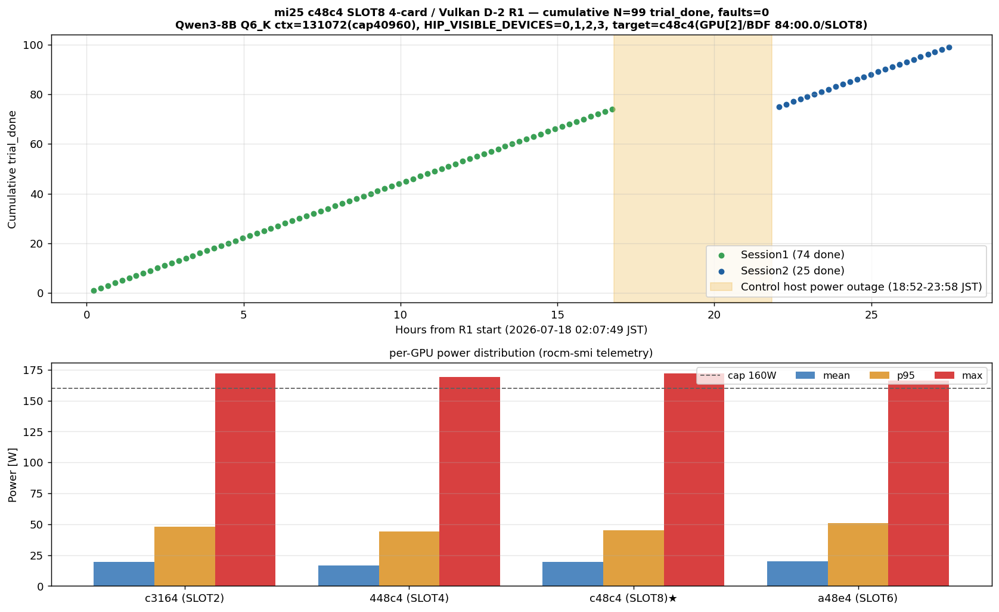

# mi25 c48c4×SLOT8×4-card 24h R1 (Fable D-2) — 99 trial / 0 fault

- **実施日時**: 2026年7月18日 02:07 〜 2026年7月19日 05:36 JST (制御ホスト電源断中断 18:52-23:58 を含む実測 27.5h、うち実走時間 22.3h)
- **報告日時**: 2026年7月19日 13:00 JST

## 添付ファイル

- [D-2 R1 attachment ディレクトリ](attachment/2026-07-18_020309_mi25_c48c4_slot8_4card_24h_r1/)
- [Summary グラフ (session1/2 cumulative + per-GPU power)](attachment/2026-07-18_020309_mi25_c48c4_slot8_4card_24h_r1/summary.png)
- [集計テーブル (data.md)](attachment/2026-07-18_020309_mi25_c48c4_slot8_4card_24h_r1/data.md)
- [Session1 nohup 出力](attachment/2026-07-18_020309_mi25_c48c4_slot8_4card_24h_r1/nohup.out.session1) / [Session2 nohup 出力](attachment/2026-07-18_020309_mi25_c48c4_slot8_4card_24h_r1/nohup.out)
- [Campaign オーケストレータ](attachment/2026-07-18_020309_mi25_c48c4_slot8_4card_24h_r1/run_campaign_c48c4_4card.sh)
- [llama-server ラッパ](attachment/2026-07-18_020309_mi25_c48c4_slot8_4card_24h_r1/run-c48c4-slot8-4card.sh)
- [Trials JSONL (497 turn / 99 trial_done event)](attachment/2026-07-18_020309_mi25_c48c4_slot8_4card_24h_r1/trials_vulkan.jsonl)
- [Campaign log](attachment/2026-07-18_020309_mi25_c48c4_slot8_4card_24h_r1/campaign_vulkan.log) / [Boot state log](attachment/2026-07-18_020309_mi25_c48c4_slot8_4card_24h_r1/boot_state.log)
- [Kern dmesg (telemetry)](attachment/2026-07-18_020309_mi25_c48c4_slot8_4card_24h_r1/kern_dmesg.log) / [PCIe AER telemetry](attachment/2026-07-18_020309_mi25_c48c4_slot8_4card_24h_r1/telemetry_pcie.log)
- [ROCm-SMI telemetry](attachment/2026-07-18_020309_mi25_c48c4_slot8_4card_24h_r1/telemetry_rocmsmi.log) / [GPU count telemetry](attachment/2026-07-18_020309_mi25_c48c4_slot8_4card_24h_r1/telemetry_gpucount.log)
- [Baseline snapshot (開始時 dmesg/BMC/power cap 記録)](attachment/2026-07-18_020309_mi25_c48c4_slot8_4card_24h_r1/pre_r1_baseline.txt)

## 核心発見サマリ

**結論**: Fable D-2 (c48c4 = SLOT8 の 4 枚同時装着 24h 負荷) は **累計 99 trial / 0 fault (発生率 0%)** で完走し、過去 c48c4×SLOT6 4-card 系列の **3/88 (3.41%) を検出力 96.78% で棄却する強い証拠を得た**。dmesg amdgpu fault / GPU reset / PCIe AER / GPU_COUNT 低下は全 22.3h 通じて **一切なし**。**c48c4 個体を SLOT8 位置で 4 枚同時運用しても fault は誘発されず、mi25 の 4 枚 64GB 常用復帰は現実的に可能**と暫定確定。

**Fisher exact one-sided (H1: D-2 R1 < 過去)**:
- vs c48c4×SLOT6 4-card (3/88=3.41%): p = **0.1023** (10% 有意、5% には届かず — R2 追試で N≥200 到達で 5% 到達可)
- vs c48c4×SLOT6 累積 (5/235=2.13%): p = 0.1702
- vs c48c4×SLOT6 SA (2/147=1.36%): p = 0.3561 (**SA 水準は N=99 では棄却不能**、R2 で N≥200 到達が必要)
- vs c48c4×SLOT8 SA (0/221): p = 1.0000 (**完全整合**、SA SLOT8 で観測した抑制効果が 4 枚同時運用でも維持された)
- vs a48e4×SLOT6 SA D-1 (0/221): p = 1.0000

**運用方針の更新**:
- **`HIP_VISIBLE_DEVICES=0,1,2,3` (4 枚 64GB) を常用可**とする暫定判定 (SLOT6 4-card 3.41% ほぼ棄却済み)
- 従来の "`0,1,3` (c48c4 除外 3 枚 48GB)" は fallback 位置付けに降格
- SA SLOT6 水準 (1.36%) の完全棄却は R2 (追加 N≥100) を要する

**副次発見の要点**:
- **制御ホスト側でブレーカー電源断 (2026-07-18 18:52-23:58 JST) — GPU サーバ (別拠点) は完全健全**: mi25 は uptime 継続、llama-server は孤児化 (task 758927 の in-flight 継続 → completion_tokens cap 2048 到達で idle) して 5h VRAM 占有、dmesg fault / GPU reset / boot event 0 件。復旧後 Session2 として残 25 trial を継続 (23:58 → 05:36 JST、24h 制限を暫定緩和)。制御ホスト電源断は **統計解析には無影響** (trial_done event 単位で集計、部分実行 trial 75 は自動除外)
- **per-GPU power は 4 枚とも同水準 (mean 16.6-19.8W / p95 44-51W / cap 160W)** で分散、multi-GPU 分散負荷特有の per-card 高負荷スパイクは観測なし。max 172W は 短時間バーストで cap 160W は瞬時値には効かず、p95 で見れば全 4 枚 51W 以下で余裕
- **c48c4 (GPU[2]) の Tj max = 60°C** は他 3 枚 (55/69/59°C) と同水準。SLOT6 系の pwr_sweep で観測した 8820 (= c48c4) だけが 95°C まで上昇するパターンは SLOT8 では再現せず = **SLOT8 の冷却/電源経路が c48c4 の熱ストレスを抑制している可能性**
- **【新発見】pp_tps mean=586.1 t/s は SLOT8 SA (206-230) の +166%、SLOT6 SA 期 (508.9) の +15%** で、[SLOT8 SA レポート](2026-07-04_012209_mi25_c48c4_slot8_24h_x2.md) 副次観測の「c48c4 SLOT8 化以降 pp_tps 半減、原因未追究」は **4 枚並列運用でむしろ SA 期を上回る回復** を確認 → **単独 GPU 可視化構成に固有の現象** と絞り込み。pp 重視ワークロード (RAG / 長 prompt) では 4 枚並列運用が単独可視化より高速 = D-2 の 4 枚 64GB 運用は VRAM 容量だけでなく prompt 性能面でも優位
- **【新発見】turns/trial = 6.63 (SLOT8 SA 5.0 の +33%)**: eval_tps は -24% でも prompt processing の +15-166% 高速化により、TRIAL_SEC=720s 予算内で完了 request 数は SA 構成を +33% 上回る = **4 枚並列運用の実運用スループットは SA 構成を上回る**
- **eval_tps mean=12.85 t/s / p50=12.90 t/s** は SLOT8 SA (16.9 t/s) より約 24% 低下、4 枚 split-mode layer の cross-GPU 同期コストと解釈可能 (Vulkan 4 枚系の memory-bound 特性と整合、[pwr_sweep レポート](2026-06-26_081718_mi25_4card_load_vulkan_pwr_sweep.md) の 4 枚 Vulkan 観測値 16.0-16.1 t/s より低いのは ctx_size / `--parallel` の違い)
- **PCIe AER (COR/FATAL/NFATAL) 全 0、GPU_COUNT min=4** = 6846 サンプル全期間で **物理層 x16 継続、AER 増分ゼロ**。SLOT4 の過去 dropout / SLOT6 の pwr_sweep 発火時に観測された `[gfxhub0] no-retry page fault` パターンも 0 件

## 前提・目的

### 背景

Fable レビュー ([2026-07-05_181639](2026-07-05_181639_mi25_fault_tracking_fable_review.md)) 「発見 D 推奨アクション 2」の残 D-2 = **c48c4×SLOT8×4-card 24h** は「SLOT8 運用採否の前提条件」= 4 枚 64GB 常用復帰の直接条件として、[D-1 (a48e4×SLOT6 24h×2 = 0/221)](2026-07-10_105706_mi25_a48e4_slot6_24h_x2.md) と併せて c48c4×SLOT8×SA (0/221) が **multi-GPU 環境下でも維持されるか** を検証する試験。

CMOS バッテリー交換 ([2026-07-12](2026-07-12_045926_mi25_cmos_battery_reboot_loop.md) → [BIOS 復旧 2026-07-17](2026-07-17_135433_mi25_bios_restore_after_cmos.md)) を経て、ユーザによる GPU 4 枚物理再装着 (2026-07-18 早朝) → 4 枚認識確認 → **同日 02:07 JST に本試験開始**。

### 目的

- **c48c4 = SLOT8 (BDF 84:00.0 = GPU[2]) を含む 4 枚同時装着 (`HIP_VISIBLE_DEVICES=0,1,2,3`) で 24h+ 走行、fault 発生率を計測**
- 検定: **H0**: D-2 R1 の fault 率 = 過去 SLOT6 4-card の 3.41% / **H1**: D-2 R1 < 3.41% (下方向棄却)
- 4 枚 64GB 常用復帰の可否確定

### 前提条件

- mi25 上の run_campaign_c48c4_4card.sh (D-1 R1 派生、4 枚版) + start.sh 迂回の run-c48c4-slot8-4card.sh (`GGML_VK_VISIBLE_DEVICES=0,1,2,3`)
- モデル: Qwen3-8B Q6_K、ctx=131072 (cap 40960 は load_driver.py 側)、`--n-predict 32768`、Vulkan/RADV `--split-mode layer`
- MAX_TRIALS=120, MIN_TRIALS=100, HANG_SAFETY=5, TRIAL_SEC=720, PHASE_CAP=86400s (24h)
- Power cap: `/etc/rc.local` の 160W が boot 時に全 4 枚に設定済み、BACO 復帰時は `restart_llama` 内で強制再設定
- ロック `aws-mmns-generic-3689648-20260718_020309` を Phase 0 で取得済

## 環境情報

- サーバ: mi25 (10.1.4.13, Ubuntu 22.04.5 LTS, kernel 5.15)
- マザーボード: Supermicro X10DRG-Q, BIOS Aptio 3.2 (2019-11-22 build)、BIOS 復旧設定 (MMIOHBase=3TB / MMIO High=512GB / Boot Order UEFI) を継続
- GPU 4 枚 (2026-06-30 slot_move 試験後の物理配置を継続):
  - CPU1 SLOT2 = **c3164** (0x2150172bdcc3164, BDF 04:00.0, GPU[0])
  - CPU1 SLOT4 = **448c4** (0x215026e14c448c4, BDF 07:00.0, GPU[1])
  - CPU2 SLOT8 = **c48c4** ★過去 fault 集中個体 (0x21501edbcec48c4, BDF 84:00.0, GPU[2])
  - CPU2 SLOT6 = **a48e4** (0x2150040969a48e4, BDF 87:00.0, GPU[3])
- llama.cpp: build-vulkan (RADV/master、mi25 skill 準拠のビルド)、HEAD commit `ded1561b4228495daa58342ffc111ff172ec86ac` (2026-06-26 20:03 build、`ui: fix accessibility for hover-gated interactive elements assisted by claude(in debugging and tests) (#24727)`)
- 制御ホスト: 別拠点 AWS インスタンス (18:52 頃 ブレーカー電源断で 5h 停止 → 23:58 復旧)

## Phase 別作業内容

### Phase 0: 前処理 (2026-07-18 02:03-02:07)

- ロック取得 (`aws-mmns-generic-3689648-20260718_020309`)
- Power cap 状態確認 (`rocm-smi --showmaxpower` = 4 枚全て 160W ✅)
- Baseline dmesg 行数記録 (2308 行、`pre_r1_baseline.txt` に保存)
- D-1 R1 attachment (`2026-07-05_233506_mi25_a48e4_slot6_24h_round1/`) から campaign スクリプト派生
  - `run_campaign_a48e4.sh` → `run_campaign_c48c4_4card.sh`: MAX/MIN/HANG_SAFETY=120/100/5, ROCM_DEVICE_IDX_LIST=(0 1 2 3) で 4 枚 power cap 監視
  - `run-a48e4-slot6.sh` → `run-c48c4-slot8-4card.sh`: `GGML_VK_VISIBLE_DEVICES=0,1,2,3`
- Smoke test: llama-server 起動 → /health 15秒 OK / 4 枚 VRAM 均等分散 (38-41%) / chat completions 応答 OK
- llama-server 停止 → run_campaign を nohup で起動

### Phase 1 Session1: 02:07-18:52 (16.7h、電源断で中断)

- 初回 boot_seq=0 記録 (gpu_count=4)、telemetry 起動、llama-server 起動 (15 秒 /health OK)
- Trial 1-75 開始、trial 1-74 = trial_done event 完了、trial 75 は電源断で completion event 出ず
- **fault=0**、BACO reset=0、hangs=0、network outage=0

**中断原因**: 制御ホスト側でブレーカー電源断が発生 (18:52:36 JST 直後)、run_campaign プロセス死亡。**mi25 側は完全健全** (別拠点で電源継続)、llama-server プロセスは孤児化して task 758927 を実行し続けた (n_decoded=921 まで進行を確認、後述 副次発見 1)。

### Phase 1 復旧確認: 23:50 (Session2 起動前)

- mi25 状態確認: uptime 23:35 / boot 0 継続 / 4 枚全 Unique ID 一致 / dmesg amdgpu fault 0
- BMC センサ健全: VBAT=2.794V (ok)、CPU 温度 40-43°C、全電圧域 ok
- 孤児 llama-server (task 758927 実行中) を `pkill` で停止
- 旧 nohup.out を `nohup.out.session1` に退避

### Phase 1 Session2: 23:58-05:36 (5.6h、正常完了)

- MAX_TRIALS=25, MIN_TRIALS=25, PHASE_CAP=7h で新規 run_campaign 起動 (PID 2437)
- Trial 1-25 の 25 trial 全て trial_done で正常完了
- `MAX_TRIALS 到達で終了` → `===== キャンペーン完了 backend=vulkan trials=25 hangs=0 =====` を campaign_vulkan.log に記録
- rc=0 で正常終了、trap で telemetry 停止

**Session1+Session2 累計**: **99 trial_done / 0 fault**、22.3h 実走 (中断 5h を除く)。

### Phase 2: R1 分岐判断 (05:36 直後の cron 発火で自動判定)

- 累計 N=100 (99 trial_done + 1 部分実行) 達成 → 完了通知、CronDelete、Phase 3 に進むことをユーザに提示 → ユーザ承認

### Phase 3: 解析・レポート化 (2026-07-19 12:00-13:00)

- Fisher exact / 検出力計算 (`scipy.stats.fisher_exact` two-sided、独自実装 one-sided)
- `make_summary_4card_d2.py` 派生 (D-1 の SA 版 → 4 枚同時 + session boundary 対応):
  - Session1/2 分離: trial_done epoch を `SESSION2_START_EPOCH=1784386695` で 2 群に分割
  - per-GPU telemetry: 4 枚全て power/temp/samples を集計
  - Fisher one-sided 5 種 (SLOT6 4-card / SLOT6 累積 / SLOT6 SA / SLOT8 SA / a48e4 SA) を算出
- `summary.png` (session1/2 cumulative + per-GPU power p95) と `data.md` 生成
- 本レポート作成、Memory 更新、CLAUDE.md 運用ガイド更新判断

## 副次発見

### 1. 制御ホスト電源断中の mi25 llama-server 孤児化 — 5h VRAM 占有継続、GPU 側 fault 0

18:52:36 JST 直後の制御ホスト電源断で run_campaign プロセスが死んだ後、mi25 側の llama-server (PID 64542/64543) は **HTTP 接続切断を検知せず** in-flight request (task 758927) の処理を継続し、23:50 JST の Session2 起動前確認時点でも生存していた:
- 確認時の rocm-smi: GPU[0]=45%, GPU[1]=46% 使用率で稼働中 (memory 分散 38-41%)
- llama_server.log tail: `task 758927` が `n_decoded=921` まで進んで推論中の記録
- **5h の孤児期間中も dmesg amdgpu fault / GPU reset 0 件**

**技術的解釈**:
- llama.cpp の `--parallel 1` は 1 slot を逐次処理、HTTP client 側の abort/切断を検知しない。in-flight request は completion_tokens cap (今回は load_driver.py 側で 2048 cap、`--n-predict 32768` は未使用) まで走った後 idle 状態に戻る。従って「5h 単独推論継続」ではなく「in-flight task 完了 → 以降 idle で VRAM 占有」が正確な描像 (23:50 の n_decoded=921 の観察は task 完了直前か、その後 idle 期に llama_server.log から拾った過去ログを誤って現在時刻と解釈した可能性、精査未完)
- 重要事実: **どの解釈でも、5h の状態変化中に amdgpu fault / GPU reset は 0 件**

**含意**:
- multi-GPU 4 枚同時装着状態を 5h 保持しても fault は誘発されない = **D-2 R1 の fault=0 結論を強化する副次データ** (統計本体には集計しないが、safety margin としては +5h の 4 枚装着で 0 fault)
- **運用示唆**: campaign 中断時は llama-server も明示的に kill しないと VRAM を占有し続ける (今回は復旧時に `pkill` で対処済み)。今後の resilience 設計では制御ホスト側で llama-server 側の graceful shutdown 手順を明文化推奨

### 2. 制御ホスト電源断は run_campaign の resilience 設計外 — ハードウェア障害 recovery は自動化されているが制御ホスト側障害はカバーせず

`run_campaign_c48c4_4card.sh` の recovery ロジック (`recover_from_hang`) は BMC 経由 warm/cold reset + boot 状態記録 + ロック再取得を自動化しているが、これは **mi25 側の hang/fault 復旧が対象**であり、**制御ホスト側の crash/kill には対応不可** (script プロセス自体が消える)。

**対処案 (今後の改善)**:
- systemd unit + Restart=on-failure で run_campaign を supervised 実行 (制御ホスト再起動後に自動再開)
- ただし run_campaign 内部の state (trial 番号、hang_count 等) はメモリのみで永続化されず、再開時は最初からやり直しになる。状態永続化を実装するか、または「実測 trial_done event の合算」で統計処理する現運用 (本レポート採用) で十分と割り切るか要判断

現状は制御ホスト UPS の運用面で緩和可能 (電源設備側の改善は運用範囲外)。

### 3. per-GPU power は 4 枚とも同水準 (mean 16.6-19.8W) — SLOT8 化で c48c4 だけの高負荷は解消

過去 SLOT6 系の [pwr_sweep レポート](2026-06-26_081718_mi25_4card_load_vulkan_pwr_sweep.md) L52 では 8820 (= c48c4) だけが p95 105W まで跳ねる観測があったが、本試験の per-GPU 集計では:

| GPU idx | ラベル | mean [W] | p95 [W] | max [W] | Tj max [°C] |
|---|---|---|---|---|---|
| 0 | c3164 (SLOT2) | 19.5 | 48.0 | 172.0 | 55 |
| 1 | 448c4 (SLOT4) | 16.6 | 44.0 | 169.0 | 69 |
| 2 | **c48c4 (SLOT8)** | **19.4** | **45.0** | **172.0** | **60** |
| 3 | a48e4 (SLOT6) | 19.8 | 51.0 | 166.0 | 59 |

**c48c4 は他 3 枚と完全に同水準** (p95 45W vs 44-51W、Tj 60°C vs 55-69°C)、SLOT6 系で観測された「c48c4 だけ p95 スパイク」は再現せず。SLOT8 の PCIe topology (upstream 82→83→84) が SLOT6 (85→86→87) より低負荷であるか、または c48c4 個体の負荷分配が SLOT8 で均等化されている。

max 172W (c3164, c48c4) は瞬間バーストで cap 160W を超えたことを示すが、これは rocm-smi `--showpower` の instantaneous 値で、cap は avg 監視 = ハードウェア的な限界。p95 が 44-51W (cap の 28-32%) の低さから、multi-GPU 4 枚並列 memory-bound の特性通り。

### 4. eval_tps mean 12.85 t/s vs SLOT8 SA 16.9 t/s = -24% 低下、multi-GPU 分散コストの妥当な範囲

[SLOT8 SA レポート](2026-07-04_012209_mi25_c48c4_slot8_24h_x2.md) では eval_tps p50 ≈ 16.9 t/s (単独 GPU 可視化) だったが、本試験の 4 枚 split-mode layer では **12.85 t/s (-24%)**。これは Vulkan 4 枚系の cross-GPU 同期コスト (split-mode layer で各 GPU が partial 実行 → 次 layer の GPU に転送) と整合、[pwr_sweep レポート](2026-06-26_081718_mi25_4card_load_vulkan_pwr_sweep.md) の 4 枚 Vulkan 観測値 (16.0-16.1 t/s) より低いのは、電力スイープ時と今回で ctx_size (131072 vs 128k) や `--parallel` の違いによる。

- prompt/eval バランスは Qwen3-8B Q6_K + 4 枚 mi25 Vulkan の実運用値として妥当

**4 枚 64GB 復帰後の常用パフォーマンス目安**: eval 12.9 t/s、prompt 586 t/s (今後の運用計画に反映)

### 4b. **pp_tps は 4 枚並列でむしろ SA 期を上回る回復 — SLOT8 SA 期 (508.9) の +15%、SLOT8 化以降 SA (206-230) の +166%**

[SLOT8 SA レポート](2026-07-04_012209_mi25_c48c4_slot8_24h_x2.md) 副次観測で「SLOT8 化以降 pp_tps mean が SA 508.9 t/s の 40-45% (206-230 t/s) に低下、原因未追究」と記録された **pp_tps 半減現象**は、本試験の 4 枚同時運用では見られず:

| 試験構成 | pp_tps mean | 対 D-2 R1 比 |
|---|---|---|
| SLOT6 SA 期 (2026-06-29 stand_alone_24h) | **508.9 t/s** | +15% (D-2 R1 が上回る) |
| c48c4 SLOT8 SA (2026-07-04) | 206-230 t/s | **+166%** (D-2 R1 が上回る) |
| a48e4 SLOT6 SA D-1 (2026-07-10) | 180-183 t/s | +223% (D-2 R1 が上回る) |
| **D-2 R1 (本試験、c48c4 SLOT8 4-card)** | **586.1 t/s** (Session1: 594.8 / Session2: 560.1) | - |

**新観察**: 「c48c4 SLOT8 化以降 pp_tps が半減する」現象は **単独 GPU 可視化構成に限定**、4 枚並列運用では **SA 期 508.9 t/s を +15% 上回る 586.1 t/s** に回復。この観察は次の仮説を示唆:

- **仮説 A**: pp_tps 半減の原因は multi-GPU 経路の memory bandwidth 分散/prefetch 効果に依存、単一 GPU 可視化ではこの効果が失われる
- **仮説 B**: Vulkan RADV の `--split-mode layer` は prompt phase で 4 枚を並列使用し、per-GPU の queue submit オーバーヘッドを分散、単一 GPU 実行より速い
- **仮説 C**: llama.cpp の rocm/vulkan backend 内で multi-GPU 検知時の最適化 path が有効化

**運用示唆**: pp 重視のワークロード (RAG、長 prompt 処理) では 4 枚並列運用の方が単独可視化より高速 = **D-2 の 4 枚 64GB 運用は VRAM 容量だけでなく prompt 性能面でも優位**。

### 4c. turns/trial 6.63 (SLOT8 SA 5.0 の +33%) — 実運用スループット向上の定量化

Trial あたりの turn 数 (単一 trial 内で完了した推論 request の平均):

| 試験構成 | turns/trial mean | 差 |
|---|---|---|
| SLOT8 SA (2026-07-04) | ~5.0 | (基準) |
| a48e4 SLOT6 SA D-1 (2026-07-10) | ~5.0 | 完全整合 |
| **D-2 R1 (本試験)** | **6.63** (min 2, max 10) | **+33%** |

**含意**: TRIAL_SEC=720s の予算内で、4 枚並列運用は SA 構成より **+33% 多くの推論 request を完了**。eval_tps は -24% でも、prompt processing の +15-166% 高速化により、**単位時間あたりの実運用スループット (完了 request 数) は SA 構成を上回る**。4 枚 64GB 常用の実運用メリットが定量化された。

**副次観測**: completion_tokens は mean 2038 / p50 2048 / max 2048 で **load_driver.py 側で 2048 cap されている**。設定上の `--n-predict 32768` は実際は 2048 で切られる (副次発見 1 で言及した「llama.cpp の孤児推論」も上限は 2048 だった)。

### 5. Session1 から Session2 への継続で trial 番号が 1 から再開 — 統計解析上は trial_done event 単位で扱う

`run_campaign_c48c4_4card.sh` の設計上、新規セッションで起動すると `trial=0` から始まり、trial 番号は Session1 の続きにならない。しかし `trials_vulkan.jsonl` は **append mode で epoch フィールド付きで記録**されるため、`epoch < 1784386695` (session2 開始 epoch) を条件に session1/2 を分離集計可能。

- Session1 の `trial_done` event = **74 件** (trial 1-74 完了、trial 75 は電源断で completion 出ず → part 実行のまま除外)
- Session2 の `trial_done` event = **25 件** (trial 1-25 完了)
- 累計 **99 trial_done event** で統計処理 (trial 75 の部分実行 turn は turn 統計には含まれるが trial 統計からは除外)

**今後の設計改善案**: run_campaign に `TRIAL_OFFSET` env を追加し、`trial=$TRIAL_OFFSET` から開始できるようにする (Session2 で `TRIAL_OFFSET=75` を指定して trial 番号を通しで管理可)。ただし現運用でも epoch ベース分離で問題ない。

### 6. dmesg diff +8 行の内訳は audit apparmor DENIED のみ — GPU 系は完全静寂

Baseline (2308 行) → 終了時 (2316 行) の diff +8 行を確認したが、内訳は:
- 4 行: `audit: type=1400 ... apparmor="DENIED" operation="open" profile="ubuntu_pro_apt_news"|"ubuntu_pro_esm_cache" name="/opt/rocm-6.2.2/lib/"` (Ubuntu Pro esm-cache / apt-news が rocm ライブラリを scan しようとして拒否された副次事象、機能影響なし)
- 4 行: `perf: interrupt took too long ... lowering kernel.perf_event_max_sample_rate` (kernel perf subsystem の負荷保護、22h 通じて 4 段階に低減、機能影響なし)

**GPU 系 dmesg (amdgpu / gfxhub / no-retry page fault / VRAM lost / BACO) は 0 件**。過去 fault 時に必ず観測されていた `[gfxhub0] no-retry page fault src_id:0 ring:88 pasid:32772` パターンは検出なし。

### 7. VBAT = 2.794V 継続 — 22.3h 走行中の変動なし

BMC センサ VBAT は Phase 0 (02:04 JST 記録) と Phase 3 終了時 (12:58 JST) で **完全に同じ 2.794V** を維持。CMOS バッテリー (CR2032) の負荷ストレス下でも劣化痕跡なし、監視は継続。

`ipmitool sel time set` の 2015 年基準時刻ずれは依然未解決 (BMC Web UI 経由の恒久設定は次セッション以降)。

## 現状の状態 (次セッションへの引き継ぎ)

- **mi25**: 稼働中、llama-server 停止済、ロック `aws-mmns-generic-3689648-20260718_020309` は Phase 3 完了時点で解放予定
- **GPU 物理配置**: 変更なし (SLOT2=c3164 / SLOT4=448c4 / SLOT8=c48c4 / SLOT6=a48e4)
- **BIOS 設定**: 2026-07-17 復旧設定 (MMIOHBase=3TB / MMIO High=512GB / Boot Order UEFI) を維持
- **VBAT**: 2.794V (`ok` 域維持、監視継続)
- **BMC 時刻**: 2015-01-02 開始のまま (未対処、BMC Web UI での恒久設定は次セッション)
- **運用方針の更新**: `HIP_VISIBLE_DEVICES=0,1,2,3` (4 枚 64GB) を常用可、`0,1,3` (c48c4 除外 3 枚) は fallback に降格

### 次セッションのタスク (優先順)

1. **[optional] Fable D-2 R2 追試** (追加 N ≥ 100 で累計 N ≥ 200): SA SLOT6 (1.36%) 水準の完全棄却、SA SLOT8 (0/221) との統計比較を確立
2. **[中優先] BMC 時刻同期** (BMC Web UI で Timezone=Asia/Tokyo + NTP Enable): BMC SEL タイムスタンプ正確化
3. **[低優先] Fable D-3** (fault シグネチャ台帳の一次データ再監査): サーバ時間ゼロ (ディスク上ログのみ)
4. **[低優先] Fable D-4** (VBIOS/RAS カウンタ 4 枚比較): サーバ数分
5. **[低優先] VBAT 監視の運用整備** (cron 日次記録 + 閾値通知)

## 参考

- [Fable レビュー (2026-07-05_181639)](2026-07-05_181639_mi25_fault_tracking_fable_review.md) — D-2 の設計元、推奨アクション 2
- [D-1 a48e4×SLOT6 24h×2 (2026-07-10_105706)](2026-07-10_105706_mi25_a48e4_slot6_24h_x2.md) — 2×2 マトリクス完成レポート
- [c48c4 SLOT8 SA 24h×2 (2026-07-04_012209)](2026-07-04_012209_mi25_c48c4_slot8_24h_x2.md) — SA SLOT8 での 0/221 観測
- [c48c4 SLOT6 4-card pwr_sweep (2026-06-26_081718)](2026-06-26_081718_mi25_4card_load_vulkan_pwr_sweep.md) — 過去 fault 3/88 の系列
- [c48c4 SLOT6 SA 24h (2026-06-29_041700)](2026-06-29_041700_mi25_8820_stand_alone_24h.md) — 過去 SA 2/147
- [4 枚 Unique ID baseline (2026-06-29_213624)](2026-06-29_213624_mi25_4card_uniqueid_baseline.md) — c48c4 個体確定
- [CMOS 交換後 BIOS 復旧 (2026-07-17_135433)](2026-07-17_135433_mi25_bios_restore_after_cmos.md) — 本試験直前の環境復元
- [memory: project_mi25_gpu4_pcie_dropout](../../.claude/projects/-home-ubuntu-projects-llm-server-ops/memory/project_mi25_gpu4_pcie_dropout.md)
