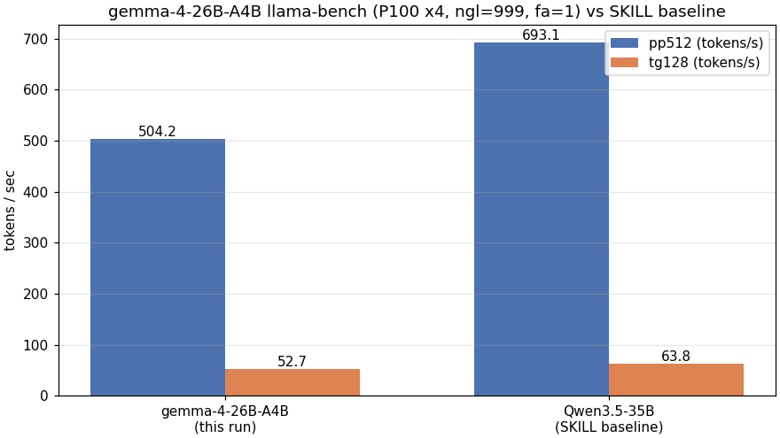

# P100 3 モデル動作確認 — gemma-4/north-mini-code/ornith が P100×4 で 131k 起動 OK

- **実施日時**: 2026年7月20日 23:28 〜 2026年7月21日 00:00 JST (start.sh パッチ → 3 モデル ctx=32k/131k 動作確認 → HF-ID 退行確認)
- **報告日時**: 2026年7月21日 00:00 JST
- **作成者**: Claude Opus 4.7 (1M context)

## 概要

P100 (`t120h-p100`) にダウンロード済みの 3 モデル (`gemma-4-26B-A4B-it`, `North-Mini-Code-1.0`, `ornith-1.0-35b`) について、llama-server 上での起動可否・応答健全性・大コンテキスト耐性を検証した。この 3 モデルはいずれも本プロジェクトでは初投入で、アーキテクチャも `gemma4` / `cohere2moe` / `qwen35moe`+SSM とすべて異なっていたため、llama.cpp のアーキサポートと chat template の適合を実測で確認する必要があった。

作業を始めるにあたり、既存の起動スクリプト `start.sh` が HuggingFace リポジトリ ID (`org/repo:quant`) しか受け付けず、`~/models/` 配下のローカル `.gguf` を直接指定できないことがわかった。そこで最初にスクリプトへ最小のパッチ (絶対パスかつ `.gguf` なら HF 解決をスキップし、alias を basename に整形する分岐) を当ててから、パッチを踏み台に 3 モデルを順次動作確認する流れとした。

動作確認は各モデルにつき `ctx=32k` で起動と単発 chat の健全性を、続いて `ctx=131072` で再起動して約 42k tokens の長 prompt に対する応答完走を確認した。gemma-4 では加えて `llama-bench` (pp512 / tg128) も計測した。3 モデルとも 4 枚の P100 に均等に VRAM を分散して起動でき、`/health` は即応、単発 chat は EOG で正しく停止 (`finish_reason=stop`) し、42k prompt に対しても正答 (色や数字) を返して停止した。

副次的な観察として、いずれのモデルも thinking モード (`chat template, thinking = 1`) が有効で、gemma-4 では最初 `max_tokens=100` で reasoning phase に全消費し visible content が空になる現象が出た。運用側で `max_tokens` を十分大きく (数百 tokens 以上) 取る必要があることを実装確認できた。また、事前調査で懸念されていた ornith の Jinja parse 失敗については、`--jinja` フラグでの実起動は問題なく通り、応答も正常だった。

`start.sh` のパッチが HuggingFace リポジトリ ID 経路を退行させていないことも `unsloth/Qwen3.6-27B-GGUF:UD-Q4_K_XL` (ctx=32k) の起動 + chat で確認した。Qwen 系サンプリング (`--temp 0.6 --top-p 0.95 --top-k 20`) が既存 case で正しく適用されていることも合わせて確認できた。

以上により、3 モデルとも P100 で本番運用に耐える初期状態にあることを確認できた。既存の Qwen3.6 系との切り替え運用と混在させる場合の課題 (start.sh のモデル別サンプリング case に 3 モデルを追加してデフォルト化する等) は残課題としてまとめた。

## 添付ファイル

- [実装プラン](attachment/2026-07-20_235945_p100_3models_smoke_test/plan.md)
- [start.sh パッチ diff](attachment/2026-07-20_235945_p100_3models_smoke_test/start_sh_patch.diff)
- [gemma-4 bench PNG](attachment/2026-07-20_235945_p100_3models_smoke_test/gemma4_bench.png)
- [3 モデル起動ログ抜粋](attachment/2026-07-20_235945_p100_3models_smoke_test/startup_logs.md)
- [3 モデル chat 応答例](attachment/2026-07-20_235945_p100_3models_smoke_test/chat_examples.md)

## 核心発見サマリ



**結論**: `start.sh` にローカル絶対パス `.gguf` の分岐 (diff +40 行 / 純追加ロジック 15 行程度) を追加した状態で、3 モデルとも P100×4 で **ctx=131072 起動 → 約 42k tokens prompt に対して EOG stop 応答完走** を達成 (gemma-4 のみ長 prompt の visible content が `max_tokens=500` の thinking 消費で空になり `finish_reason=length`、他 2 モデルは正答 stop)。gemma-4 の `llama-bench` は **pp512=504.23 t/s, tg128=52.69 t/s** で、SKILL 記載の P100 参照値 (pp512=693 / tg128=64、対象モデル明示なし) に対し pp -27% / tg -17% 程度。HF-ID 経路 (`unsloth/Qwen3.6-27B-GGUF:UD-Q4_K_XL`) の退行も無し。

## 環境情報

- サーバ: `t120h-p100` (10.1.4.14)
- GPU: Tesla P100-PCIE-16GB × 4 (合計 65,077 MiB, CUDA CC 6.0)
- llama.cpp: build 9690 (`0843245cb`), CUDA ARCH=600
- llama-server default (`start.sh` t120h-p100 case): `--flash-attn 1 --poll 0 -b 4096 -ub 4096 --cache-type-k q8_0 --cache-type-v q8_0 --split-mode layer -ngl 999 --jinja`
- 検証モデル:

| モデル | 実 file (`/home/llm/models/…`) | サイズ | arch | native ctx | HF 由来 |
|---|---|---|---|---|---|
| gemma-4-26B-A4B-it | `gemma-4-26B-A4B-it-UD-Q4_K_XL.gguf` | 15.83 GiB | `gemma4` (26B/A4B MoE, 5:1 SWA:full 30 layer, SWA=1024) | 262,144 | `unsloth/gemma-4-26B-A4B-it-GGUF` |
| North-Mini-Code-1.0 | `North-Mini-Code-1.0-UD-Q4_K_XL.gguf` | 17.93 GiB | `cohere2moe` (30B/A3B, 49 layer, SWA=4096 主体, leading dense 1 層) | 500,000 | `unsloth/North-Mini-Code-1.0-GGUF` |
| ornith-1.0-35b | `ornith-1.0-35b-Q4_K_M.gguf` | 19.71 GiB | `qwen35moe` (35B/A3B, 40 layer, SSM+attn hybrid, 4 layer に 1 回 attn) | 262,144 | `deepreinforce-ai/Ornith-1.0-35B-GGUF` |

3 モデルとも HF cache (`~/.cache/huggingface/hub/`) ではなく `~/models/` 直下に配置されていたため、今回パッチした `start.sh` のローカル絶対パス経路を使用した。gemma-4 のみ本日 (2026-07-20) のダウンロード、North と ornith は前セッション (2026-07-19) のダウンロード。

## 再現方法

### `start.sh` パッチ

```bash
# .claude/skills/llama-server/scripts/start.sh の
# 「# --- エイリアス --- / # --- モデルパス解決 ---」ブロックを
# 「# --- モデルパス解決 & エイリアス ---」に統合し、
# HF_MODEL が /*.gguf ならローカルパス扱いにする分岐を追加
if [[ "$HF_MODEL" == /*.gguf ]]; then
  MODEL_PATH="$HF_MODEL"
  ALIAS="$(basename "${HF_MODEL%.gguf}")"
  echo "==> ローカルパス指定を検出: $MODEL_PATH"
  if ! ssh "$SERVER" "test -f '$MODEL_PATH'"; then
    echo "ERROR: $SERVER にファイルが見つかりません: $MODEL_PATH" >&2
    exit 1
  fi
else
  # ... 既存の HF リポジトリ解決処理 ...
fi
```

完全な diff は [start_sh_patch.diff](attachment/2026-07-20_235945_p100_3models_smoke_test/start_sh_patch.diff)。

### 起動 / chat 動作確認 (代表: gemma-4)

```bash
# ロック取得
.claude/skills/gpu-server/scripts/lock.sh t120h-p100

# ctx=131072 で起動 (Gemma-4 推奨 sampling を EXTRA_LLAMA_OPTS で注入)
EXTRA_LLAMA_OPTS="--temp 1.0 --top-p 0.95 --top-k 64 --min-p 0" \
  .claude/skills/llama-server/scripts/start.sh t120h-p100 \
  /home/llm/models/gemma-4-26B-A4B-it-UD-Q4_K_XL.gguf 131072

.claude/skills/llama-server/scripts/wait-ready.sh t120h-p100 \
  /home/llm/models/gemma-4-26B-A4B-it-UD-Q4_K_XL.gguf 131072

# 単発 chat (max_tokens は 500+ を推奨、thinking 消費対策)
curl -sN http://10.1.4.14:8000/v1/chat/completions -H 'Content-Type: application/json' \
  -d '{"model":"gemma-4-26B-A4B-it-UD-Q4_K_XL","messages":[{"role":"user","content":"2 + 3 = ?"}],"max_tokens":800}'

# 停止
.claude/skills/llama-server/scripts/stop.sh t120h-p100

# 解放
.claude/skills/gpu-server/scripts/unlock.sh t120h-p100
```

### bench (gemma-4)

```bash
ssh t120h-p100 "cd ~/llama.cpp && ./build/bin/llama-bench \
  -m /home/llm/models/gemma-4-26B-A4B-it-UD-Q4_K_XL.gguf -ngl 999 -fa 1 -p 512 -n 128 -r 2"
```

## 結果詳細

### 3 モデル比較 (実測)

| 観測項目 | gemma-4-26B-A4B | North-Mini-Code-1.0 | ornith-1.0-35b |
|---|---|---|---|
| `ctx=32k` 起動 | ✅ | ✅ | ✅ |
| `ctx=131k` 起動 | ✅ | ✅ | ✅ |
| `/health` | 200 (1 attempt) | 200 (1 attempt) | 200 (1 attempt) |
| chat template thinking | `thinking = 1` | `thinking = 1` | `thinking = 1` |
| 単発 chat 応答 | `5` (`2+3=?`) | ` sum(range(1, 11))` | `5` (`2+3=?`) |
| `finish_reason` | `stop` | `stop` | `stop` |
| 42k prompt 応答 | 空 (thinking で 500 tokens 使い切り) | `**brown**` (77 tokens) | `Brown` (73 tokens) |
| 42k prompt `finish_reason` | `length` (max=500 のため) | `stop` | `stop` |
| VRAM @ 131k (合計) | 42.9 GB (GPU0=11.5 / GPU1=10.4 / GPU2=10.7 / GPU3=10.3) | 45.5 GB (GPU0=11.6 / GPU1=11.5 / GPU2=11.3 / GPU3=11.1) | 44.1 GB (GPU0=11.7 / GPU1=11.1 / GPU2=10.4 / GPU3=10.8) |
| 起動時警告 | `control-looking token: '</s>', '<|tool_response>', '<eos>' was not control-type ... its type will be overridden` / `special_eog_ids contains '<|tool_response>', removing '</s>' token from EOG list` | `special_eos_id is not in special_eog_ids - the tokenizer config may be incorrect` | (顕著な警告なし) |

3 モデルとも `--tensor-split` デフォルト (`1,1,1,1`) で GPU 間の VRAM 分散はほぼ均等 (差 1 〜 1.5 GB)。事前調査で懸念された gemma-4 の layer 毎 `n_head_kv` によるスキューは 131k でも顕在化せず。VRAM 数値は `nvidia-smi --format=csv` の MiB 値を千で割った GB 表記 (慣行)。厳密な GiB は 1024 換算で -2% 前後の差 (例: 11505 MiB = 11.24 GiB = 11.5 GB)。

### gemma-4 `llama-bench`

```
| model                        |  size  | params | backend | ngl | fa |  test |         t/s |
|------------------------------|-------:|-------:|---------|----:|---:|------:|------------:|
| gemma4 26B.A4B Q4_K - Medium | 15.83G | 25.23B | CUDA    | 999 |  1 | pp512 | 504.23±3.50 |
| gemma4 26B.A4B Q4_K - Medium | 15.83G | 25.23B | CUDA    | 999 |  1 | tg128 |  52.69±0.01 |
```

参照値 (SKILL.md `## ベンチマーク結果`, t120h-p100): pp512=693.12 t/s / tg128=63.79 t/s (機種比較用、対象モデル明示なし、2025-12-08 測定)。gemma-4 は pp -27% / tg -17%。gemma4 arch の SWA / 5:1 attn パターンによる per-token cost 増と考えられる (精査は本レポートの範囲外)。

### HF-ID 退行確認

`start.sh` のパッチ後に `unsloth/Qwen3.6-27B-GGUF:UD-Q4_K_XL` (ctx=32k) を起動:

- サンプリング: `--temp 0.6 --top-p 0.95 --top-k 20 --min-p 0` (Qwen3.5/3.6 case が適用、`wait-ready.sh` の通知にも正しく表示)
- chat `1+1=?` → `2` (`finish_reason=stop`, 230 completion tokens)

HF-ID 経路の解決 (HF cache find → 起動) は正常継続。

### `stop.sh` / unlock クリーンアップ確認

3 モデル + HF-ID の 4 回のセッションすべてで `stop.sh` は PID kill (llama-server 本体 + worker の 2 PID) → ttyd 停止 → Discord 通知を完走。停止後は `pgrep -f 'bin/llama-server'` で残存プロセスなし、次モデル起動時の既存プロセス警告も発生しなかった (=正常解放)。全モデル完了後の `unlock.sh t120h-p100` 実行で `Lock released: t120h-p100` を得、`lock-status.sh` で `available` に復帰。

### llama.cpp arch サポート実証

build 9690 (`0843245cb`, CUDA ARCH=600) は追加ビルド無しで **`qwen35moe` / `cohere2moe` / `gemma4` の 3 arch すべてをロード成功**。従来サポートの `qwen3` (Qwen3.6-27B) と合わせ、今回の 4 起動シナリオはすべて既存 P100 build binary で成立した (`server-scripts/update_and_build-t120h-p100.sh` の再実行は不要)。SSM/Mamba 併用の `qwen35moe` は Qwen3-Next 系の比較的新しい arch だが、実 llama-server では ssm state (~30 layer × 128 state × 16 group × 4096 inner × f16 ≒ 0.5 GiB) を含む KV 消費でも P100×4 に余裕で収まった。

## 副次発見

1. **`start.sh` のプロファイル case 未登録による fallback**: パッチ後もモデル別 sampling プロファイル (`case "$HF_MODEL" in ...`) には 3 モデルの分岐が無く、動作確認時は `EXTRA_LLAMA_OPTS` で手動注入した。動作確認は成立したが、恒久運用には case への追加が必要。

2. **`wait-ready.sh` の Discord 通知に表示されるサンプリング値がミスリード**: 通知本文の "サンプリング" 行は `start.sh` 内の `SAMPLING_OPTS` (generic fallback) を表示するのみで、`EXTRA_LLAMA_OPTS` で上書きした実効値は反映されない。実効値は起動ログ (`/tmp/llama-server.log`) で確認する運用となる。

3. **gemma-4 の thinking 消費特性**: 短 prompt で reasoning tokens は 80-110 程度、長 prompt (42k tokens) では 500 tokens を丸ごと消費する挙動 (今回 42k prompt を `max_tokens=500` で投げ visible が空になった実例あり)。運用時は短 prompt でも `max_tokens=500-800`、長 prompt では `max_tokens=1500+` を目安に。今回の短 prompt 動作確認は 800 で成立。

4. **ornith の chat template**: 事前調査で `llama-debug-template-parser` が Jinja parse fail することがわかっていたが、実際の llama-server 起動時は `--jinja` フラグで問題なくロードでき、chat も `<|im_start|>system…` の ChatML 系テンプレートで正しく動作した。debug parser の parse fail は本番 chat には影響しなかった。

5. **`git pull` の gnutls_handshake エラー**: `start.sh` 経由の `update_and_build-t120h-p100.sh` 実行時に `fatal: unable to access 'https://github.com/ggml-org/llama.cpp.git/': gnutls_handshake() failed` が観測されたが、既存ビルドが最新 (`更新はありません。`) だったためビルドは進行し、影響なし。今回のように既存 build が動いているケースでは無視できるが、build 更新が必要な場面では失敗するので該当時は要リトライ。

6. **thinking モードのオーバヘッド差**: 同じ「2 + 3 = ?」でも thinking の消費は gemma-4 83 tokens / ornith 344 tokens と 4 倍の差 (Qwen3-Next 系は reasoning が長め)。運用側の `max_tokens` 設計時にモデル特性を織り込む必要がある。

## 残課題

- **`start.sh` のモデル別プロファイル追加**: `case "$HF_MODEL" in` に以下 3 分岐を追加してデフォルト sampling を最適化する (別コミット推奨)。
  - `*gemma-4*|*Gemma-4*` → `--temp 1.0 --top-p 0.95 --top-k 64 --min-p 0`
  - `*North-Mini-Code*` → `--temp 0.3 --top-p 0.75 --top-k 0 --min-p 0`
  - `*ornith*|*Ornith*` → `--temp 0.6 --top-p 0.95 --top-k 20 --min-p 0 --presence-penalty 1.0 --dry-multiplier 0` (Qwen3.x 共通と同じ)
- **SKILL.md のモデル表への追記**: `## モデル一覧` テーブルに 3 モデルを追加する。ローカルパス指定である旨と、推奨 ctx (32k / 131k) を明記。
- **native max ctx (262k / 500k) 試験**: 今回は 131k までに留めた。native 上限での KV 実消費と生成健全性の確認は次回。
- **North-Mini-Code / ornith の bench 計測**: gemma-4 のみ実施した。3 モデル揃った bench は別レポートで。
- **long ctx での質確認**: 42k prompt の "haystack" 検索 (色 / 単語) は成立したが、Needle-in-Haystack 系の本格評価は未実施。運用前提でこのレベルまで踏み込むかは別途判断。
- **Discord 通知の実配信未確認**: `wait-ready.sh` / `stop.sh` が `Discord通知を送信しました` と表示したが、実 webhook 配信の到達確認は行っていない (この場でユーザ側 UI 確認を取っていないため)。過去に webhook が生きているので実配信されている想定だが、本レポートでは "スクリプト側の呼び出し完走" 事実に留める。
- **`start.sh` の MODEL_PROFILE case 誤マッチリスク**: 現行 `case "$HF_MODEL" in *Qwen3.5-122B-A10B*)` はローカルパスにも部分一致するため、`~/models/Qwen3.5-122B-A10B-*.gguf` 直指定時にプロファイルが誤発火する。今回の 3 モデル名では該当しないが、将来 `Qwen3.5-122B-A10B` 系のローカルパス指定を追加する場合は、パス判定条件 (basename マッチ等) の見直しが要る。
