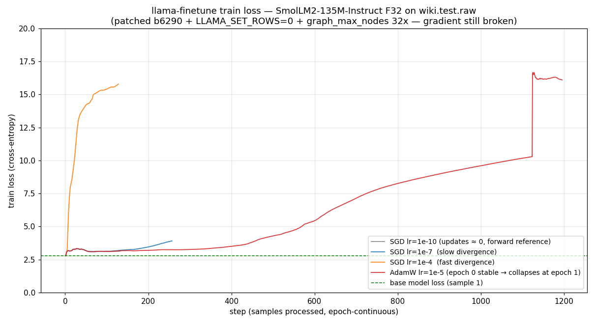

# llama.cpp の CPU fine-tune は現状使い物にならない — mmns-cpu-llm 検証

- **実施日時**: 2026年7月25日 02:35 〜 04:50 JST (mmns-cpu-llm での環境構築・SmolLM2-135M と Qwen2.5-0.5B の F32 GGUF 変換・複数コミット/オプティマイザ/学習率での llama-finetune 実行検証)
- **報告日時**: 2026年7月25日 04:51 JST
- **作成者**: Claude Opus 4.7 (1M context)

## 概要

llama.cpp に付属している fine-tuning のツールが、GPU の付いていない CPU だけのマシンで実用になるかを試した。小型モデルを一つ選び、公開データで軽く追加学習を回して、学習の前後で振る舞いが変わるかを見る、というのが元々の狙いだった。

準備段階までは順調だった。ライブラリ一式のセットアップ、モデルを学習向けの形式に変換、評価用データの取得、学習前の性能測定、簡単な文章生成の確認、いずれも問題なく通った。ここまでで「土台は整った」と言える状態になった。

ところが、いざ本題の追加学習コマンドを走らせると、モデルの読み込み直後にプログラムが強制終了してしまう。別のアーキテクチャのモデルに差し替えても同じ場所で落ちるので、モデル固有の問題ではないとすぐに分かった。

調べたところ、これは既に GitHub Issue として報告されている既知の不具合で、直近半年ほどの llama.cpp では新しめの LLM を追加学習に掛けようとすると同じ場所で落ちるようになっていた。まだ upstream で修正が入っていない状態である。

修正を待たずに何とかならないかと、少し古い版まで戻してさらに小さなパッチを当てるところまで踏み込んだ。ここまでやると起動はして、学習も進み始めるように見える。しかし今度は、どのオプティマイザ・どの学習率で試しても loss が下がらず、むしろじわじわ悪化する。学習率を極端に小さくすると loss は安定するので、順方向の計算自体は正しく動いており、壊れているのは勾配計算の側だという切り分けまではできた。

以上から、本セッションの当初計画にあった 2 段階の追加学習は実現不能と判断し、途中で打ち切った。得られた成果は「llama.cpp の追加学習が今は使い物にならないという事実の一次確認」と、「回避を試みた場合にどこまで行けてどこで詰むか」という記録に留まる。

次にやることは、upstream の修正が入るのを待つか、CPU 上での軽い追加学習が本当に必要なら別のツール (HuggingFace 側の Trainer や PEFT) に軸を移すかのいずれかである。llama.cpp を再度試すのは、upstream で該当 Issue が閉じたタイミングで良い。

## 添付ファイル

- [実装プラン (承認済)](attachment/2026-07-25_045111_llama-cpp-cpu-finetune-broken/plan.md)
- [baseline PPL 測定ログ (SmolLM2-135M, wiki.test.raw)](attachment/2026-07-25_045111_llama-cpp-cpu-finetune-broken/ppl_smollm_before.log)
- [baseline 生成ログ (SmolLM2-135M, `llama-completion`)](attachment/2026-07-25_045111_llama-cpp-cpu-finetune-broken/gen_smollm_before.log)
- [SmolLM2 finetune master (b7542) 実行ログ — SET_ROWS assert で abort](attachment/2026-07-25_045111_llama-cpp-cpu-finetune-broken/ft_smollm.log)
- [SmolLM2 finetune b7404 `-fa off` 実行ログ — 同 assert で abort](attachment/2026-07-25_045111_llama-cpp-cpu-finetune-broken/ft_smollm_b7404.log)
- [Qwen2.5-0.5B finetune master (b7542) 実行ログ — 同 assert で abort](attachment/2026-07-25_045111_llama-cpp-cpu-finetune-broken/ft_qwen_test.log)
- [SmolLM2 finetune b6305 `LLAMA_SET_ROWS=0` 実行ログ — graph node overflow](attachment/2026-07-25_045111_llama-cpp-cpu-finetune-broken/ft_smollm_b6305.log)
- [SmolLM2 finetune b6290 `LLAMA_SET_ROWS=0` 実行ログ — graph node overflow](attachment/2026-07-25_045111_llama-cpp-cpu-finetune-broken/ft_smollm_b6290.log)
- [SmolLM2 finetune b6290 patch + AdamW lr=1e-5 実行ログ — epoch 1 で loss 16 まで発散](attachment/2026-07-25_045111_llama-cpp-cpu-finetune-broken/ft_smollm_b6290p.log)
- [SmolLM2 finetune b6290 patch + SGD lr=1e-4 実行ログ — sample 100 で loss 15](attachment/2026-07-25_045111_llama-cpp-cpu-finetune-broken/ft_smollm_sgd.log)
- [SmolLM2 finetune b6290 patch + SGD lr=1e-7 実行ログ — loss 単調悪化](attachment/2026-07-25_045111_llama-cpp-cpu-finetune-broken/ft_smollm_lr7.log)
- [SmolLM2 finetune b6290 patch + SGD lr=1e-10 実行ログ — 更新ほぼ無効で loss 安定 3.0](attachment/2026-07-25_045111_llama-cpp-cpu-finetune-broken/ft_smollm_lr10.log)
- [loss 発散比較プロット (PNG)](attachment/2026-07-25_045111_llama-cpp-cpu-finetune-broken/loss_divergence.png)

## 核心発見サマリ



**結論**: llama.cpp master `af3be131c` (build b7542) の `llama-finetune` は SmolLM2-135M / Qwen2.5-0.5B いずれに対しても **backward graph 構築時点で `GGML_ASSERT` により abort** する (Issue [#18805](https://github.com/ggml-org/llama.cpp/issues/18805) の第一症状: `ggml_set_rows` が backward の許可 op に含まれない)。b6290 (#15505 直前) まで戻して `LLAMA_SET_ROWS=0` で SET_ROWS を無効化するとその assert は消えるが今度は `n_nodes < size` の graph overflow に当たる (同 issue の第三症状)。`llama_context::graph_max_nodes()` の係数を `8u * n_tensors` から `32u * n_tensors` に増やすワンライナー patch を当てるとようやく起動して 1 epoch 回るが、AdamW/SGD どの optimizer でも、lr を `1e-4/1e-5/1e-7` のいずれに合わせても loss は base の 2.78 から単調に悪化 (図参照)、lr=1e-10 まで下げて更新をほぼ止めて初めて loss が 3.0 前後で安定する。したがって backward 計算そのものが壊れており **fine-tune 効果は得られない**。`test-opt` (ggml training プリミティブ単体テスト) は 46/46 pass するため、破綻箇所は ggml の opt/backward API ではなく **llama-context 経由の KV cache パスと backward の統合**にあると特定される。既知 issue に対する upstream 修正が merge されるまで llama.cpp 上での fine-tune は使えないと判定する。

## 前提・目的

- **背景**: llama.cpp の fine-tuning 機能を CPU-only 環境 (mmns-cpu-llm) で試したいという要望。ローカルマシンでは重い処理を走らせない制約下で、全 heavy work をリモートで実施
- **目的**: (a) `llama-finetune` パイプラインの疎通確認、(b) 学習前後で PPL / 生成テキストが変化することの実証、(c) CPU-only fine-tune の所要時間と RAM 実測
- **想定シナリオ (Plan 承認済)**: Stage A で SmolLM2-135M-Instruct を疎通確認、Stage B で Qwen2.5-0.5B の PPL 改善観察、いずれも wikitext-2-raw 上で 2 epochs

## 環境情報

- サーバ: mmns-cpu-llm (10.1.6.3、SSH 経由アクセス)
- CPU: QEMU Virtual CPU version 2.5+、94 vCPU (単一ソケット表示)、AVX-512F/DQ/CD/BW/VL 実装済み、**AMX / AVX-VNNI / BF16 なし**
- RAM: 62 GiB、Swap 4 GiB
- Disk: `/` 98 GB、開始時空き 23 GB
- OS: Ubuntu 24.04.4 LTS、kernel 6.8.0-136-generic
- Python: 3.12.3 (system)、`~/finetune-lab/venv` に torch 2.6.0+cpu / transformers 4.57.6 / gguf 0.19.0 / huggingface_hub 0.36.2 を pip install
- llama.cpp:
  - master (`~/llama.cpp/`) は commit `af3be131c` (tag b7542, 2025-12-26)、`GGML_OPENMP=ON`, `GGML_BLAS=OFF`, `GGML_CUDA=OFF`, `GGML_VULKAN=OFF`
  - worktree `~/llama-worktrees/finetune-b7404/` (commit `52392291b`, tag b7404) — SET_ROWS assert 検証用
  - worktree `~/llama-worktrees/finetune-b6305/` (commit `d35a1e8c4`, tag b6305) — SET_ROWS env 無効化検証用
  - worktree `~/llama-worktrees/finetune-b6290/` (commit `a6a58d647`, tag b6290) — `graph_max_nodes` パッチを当てた版
  - worktree `~/llama-worktrees/finetune-pre-setrows/` (commit `15e92fd33`, `a4569c41f^`) — SET_ROWS 使用開始直前。ただし CLI に `-o` が無く出力保存できないため後続には使わず
- ベースモデル:
  - `HuggingFaceTB/SmolLM2-135M-Instruct` (Apache-2.0、非 gated)、F32 GGUF 538 MB
  - `Qwen/Qwen2.5-0.5B` (Apache-2.0、非 gated)、F32 GGUF 1.98 GB
- 訓練データ: `~/llama.cpp/scripts/get-wikitext-2.sh` で取得した wiki.test.raw (~1.3 MB, ~280k tokens, `-c 512` stride 256 で 1123 訓練サンプル + 60 val サンプル)
- 実行位置: 作業ルート `~/finetune-lab/` (mmns-cpu-llm 上)

## 参照レポート

なし (このプロジェクトで llama.cpp の fine-tune を扱う初回)

## 再現方法

### 疎通のみ

```bash
# 1) 環境構築 (sudo は事前にユーザが実行済み: apt install python3-venv python3-pip unzip)
ssh mmns-cpu-llm '
  mkdir -p ~/finetune-lab/{hf,gguf,data,out,logs} &&
  cd ~/finetune-lab &&
  python3 -m venv venv &&
  . venv/bin/activate &&
  pip install --upgrade pip &&
  pip install -r ~/llama.cpp/requirements/requirements-convert_hf_to_gguf.txt &&
  pip install "huggingface_hub[cli]"'

# 2) SmolLM2-135M を F32 GGUF に変換
ssh mmns-cpu-llm '
  cd ~/finetune-lab && . venv/bin/activate &&
  hf download HuggingFaceTB/SmolLM2-135M-Instruct --local-dir hf/SmolLM2-135M-Instruct &&
  python3 ~/llama.cpp/convert_hf_to_gguf.py hf/SmolLM2-135M-Instruct \
      --outtype f32 --outfile gguf/smollm2-135m-instruct.f32.gguf'

# 3) wikitext-2-raw を取得
ssh mmns-cpu-llm 'cd ~/finetune-lab/data && bash ~/llama.cpp/scripts/get-wikitext-2.sh'

# 4) baseline PPL (139 秒、64 スレッド、CPU 5864% で 91 コア相当稼働、RSS 663 MiB)
ssh mmns-cpu-llm '
  ~/llama.cpp/build/bin/llama-perplexity \
      -m ~/finetune-lab/gguf/smollm2-135m-instruct.f32.gguf \
      -f ~/finetune-lab/data/wikitext-2-raw/wiki.test.raw \
      -c 512 -b 512 -t 64 --numa distribute'
# Final estimate: PPL = 18.6775 +/- 0.14304

# 5) baseline 生成 (llama-completion — llama-cli では --no-conversation が非対応で強制対話モードになるため使わない)
ssh mmns-cpu-llm '
  ~/llama.cpp/build/bin/llama-completion \
      -m ~/finetune-lab/gguf/smollm2-135m-instruct.f32.gguf \
      --temp 0 -n 80 -c 512 -t 64 --seed 42 \
      -p "Barack Obama was born in "'
# → "Barack Obama was born in 1961." (12 tok, EOS 自動)
```

### fine-tune 失敗の再現 (master b7542)

```bash
ssh mmns-cpu-llm '
  cd ~/finetune-lab &&
  ~/llama.cpp/build/bin/llama-finetune \
      -m gguf/smollm2-135m-instruct.f32.gguf \
      -f data/wikitext-2-raw/wiki.test.raw \
      -o out/smollm2-135m-ft.f32.gguf \
      -c 512 -b 512 -ub 512 -fa off \
      -t 64 --numa distribute \
      -epochs 2 -lr 1e-5 -opt adamw'
# → warmup 直後に GGML_ASSERT(!node->view_src || ...) failed で abort
#    (KV cache 経由の GGML_OP_SET_ROWS が backward の許可 op に無い)
```

### 発散する状態でも起動させるパッチ手順 (b6290)

```bash
ssh mmns-cpu-llm '
  cd ~/llama.cpp &&
  git worktree add -f ~/llama-worktrees/finetune-b6290 b6290 &&
  cd ~/llama-worktrees/finetune-b6290 &&
  sed -i "s/std::max<uint32_t>(1024u, 8u\*model.n_tensors())/std::max<uint32_t>(1024u, 32u*model.n_tensors())/" src/llama-context.cpp &&
  cmake -B build -DGGML_OPENMP=ON -DGGML_CUDA=OFF -DGGML_VULKAN=OFF -DGGML_BLAS=OFF -DCMAKE_BUILD_TYPE=Release &&
  cmake --build build --target llama-finetune --config Release -j 32'

# LLAMA_SET_ROWS=0 を必ず併用する。付けないと SET_ROWS assert で abort
ssh mmns-cpu-llm '
  cd ~/finetune-lab &&
  LLAMA_SET_ROWS=0 ~/llama-worktrees/finetune-b6290/build/bin/llama-finetune \
      -m gguf/smollm2-135m-instruct.f32.gguf \
      -f data/wikitext-2-raw/wiki.test.raw \
      -o out/smollm2-135m-ft.f32.gguf \
      -c 512 -b 512 -ub 512 \
      -t 64 --numa distribute \
      -epochs 2 -lr 1e-5 -opt adamw'
# → 起動し train loss を吐く。ただし epoch 0 完了時点で loss が 3.2 → 10 台まで飛び、
#    epoch 1 は loss 16 台 / acc 0% の壊れた状態から始まり、以降ずっと 16 台
```

## 結果詳細

### baseline

| 項目 | 値 |
|---|---|
| モデル | SmolLM2-135M-Instruct F32 GGUF (538 MB, 272 tensors) |
| wiki.test.raw PPL (`-c 512 -b 512 -t 64 --numa distribute`) | **18.6775 ± 0.14304** |
| 実行時間 (perplexity, 303,104 tokens, 592 chunks) | 2:19 (139.25 s wall) |
| CPU 使用率 (perplexity) | 5864% (94 vCPU 中 ~91 コア相当稼働) |
| Memory RSS (perplexity) | 663 MiB |
| 生成 (`llama-completion --temp 0 -n 80 --seed 42 -p "Barack Obama was born in "`) | `"Barack Obama was born in 1961."` (12 tok, EOS 自動) |
| 生成速度 (eval) | 47.74 tok/s (F32 model on CPU) |

### fine-tune 試行の系統

| # | 版 / 設定 | 結果 |
|---|---|---|
| 1 | master (`af3be131c`, b7542), SmolLM2, AdamW lr=1e-5, `-fa` auto | 起動 → warmup → `GGML_ASSERT(!node->view_src \|\| node->op == GGML_OP_CPY \|\|…)` failed for backward, ggml.c:6870 |
| 2 | master, SmolLM2, AdamW lr=1e-5, `-fa off` を明示 | flash_attn = disabled のログを吐いた上で 1 と同じ assert (SET_ROWS が原因、FA は無関係) |
| 3 | master, **Qwen2.5-0.5B**, AdamW lr=1e-5 | SmolLM2 と同じ assert。**モデル非依存**の master 側バグ確定 |
| 4 | b7404 (`52392291b`, SET_ROWS 有効の最新境界)、SmolLM2 | 同 assert。b7405 が壊れ始めと言うより b7404 も既に壊れていた |
| 5 | b6305 (`d35a1e8c4`, #15505 直前)、SmolLM2、`LLAMA_SET_ROWS=0` | SET_ROWS assert は消えたが `GGML_ASSERT(cgraph->n_nodes < cgraph->size)` failed at ggml.c:6338 (graph overflow) |
| 6 | b6290 (`a6a58d647`)、`LLAMA_SET_ROWS=0` (patch なし) | 5 と同じ graph overflow |
| 7 | b6290 patch (`graph_max_nodes` 8x→32x), `LLAMA_SET_ROWS=0`, AdamW lr=1e-5 | 起動成功。epoch 0 の train loss は 2.78→3.3 で安定していたが 1123 サンプル完了時に loss ≈10 まで跳ね、val 60 サンプルで loss ≈15.66 / acc 0%。epoch 1 は初期 loss ≈16.5 で以降ずっと 16 台 |
| 8 | b6290 patch, `LLAMA_SET_ROWS=0`, SGD lr=1e-4, 1 epoch | sample 6 で loss 4.3、sample 128 で loss 15.79。急速発散 |
| 9 | b6290 patch, SGD lr=1e-7, 1 epoch | sample 257 で loss 2.78→3.90。ゆっくりだが単調悪化 |
| 10 | b6290 patch, SGD lr=1e-10, 1 epoch | sample 133 で loss 3.14。実質更新無く forward 参照値として安定 |
| 11 | pre-SET_ROWS (`15e92fd33`, `a4569c41f^`) | ビルドは通ったが CLI に `-o` が未実装 (`5cdb27e09` で後付) のため出力保存不可、実験から除外 |

### 発散の位置づけ

- **base model の CE loss ≈ 2.78** (sample 1) = wikipedia 文体に対する SmolLM2-Instruct の初期 loss
- `log(18.68) = 2.93` と近く、`llama-perplexity` の値と整合
- SGD lr=1e-4 は 6 サンプルで loss 4 突破、100 サンプルで loss 15 到達 → 「勾配符号は正しい方向を向いていない、または符号が正しくても振幅が桁違い」
- SGD lr=1e-7 は 257 サンプルで loss 3.90 → 発散速度が学習率にほぼ比例、勾配自体は非ゼロだが**間違った方向**の可能性大
- SGD lr=1e-10 は 133 サンプルで loss 3.14 と ±5% レンジに収まる → forward pass は正常
- AdamW lr=1e-5 は epoch 0 で見かけ上 loss 3.3 前後で安定するが、これは AdamW の分母 (二次モーメント) が大きな勾配を打ち消していただけ。1 epoch 分の m/v の蓄積で最終ステップ以降に破綻して loss 10 → 16 に到達
- **ggml 単体テスト (`~/llama.cpp/build/bin/test-opt`) は 46/46 pass** → ggml opt/backward プリミティブ自体は正常、問題は llama_context の KV cache パスと backward の統合部

### 遭遇したその他の落とし穴

- `llama-cli` は最近の master で `--no-conversation` / `-no-cnv` が実質無効化されており、chat template を持つモデルは強制的に対話モードに入る。ログに `> ` の連発が延々書き込まれ、408 MB / 204M 行までログが膨張 (ディスク 4 GB 消費) して初めて気付いた。生成テキストの取得は `llama-completion` を使うのが正しい (b7404 以降にサブコマンドが分離)
- b6305 まで戻すと `llama-completion` バイナリが存在しない (`No rule to make target llama-completion`)。生成比較を古い版で取りたい場合は `llama-cli -no-cnv` に相当するフラグを再度探す必要がある。今回は master 側で baseline 生成を取得済みだったので影響なし
- b7404 worktree で `git worktree add` するとリポジトリ内 2 GB 分のファイルが展開され、これを 4 版分繰り返した結果ディスクは 23 GB → 16 GB まで減少。実験終了時点で 4 worktree のうち 2 つ (b7404, pre-setrows) は削除、b6305 と b6290 は再現用に残置

## 副次発見

- **`llama-perplexity` の並列効率が非常に高い**。94 vCPU 中 -t 64 指定で CPU 5864% (91 コア相当稼働)、prompt eval 2313 tokens/sec を達成した。BLAS OFF・純 ggml AVX-512 経路でここまで出るのは想定より良好。ただし fine-tune は forward+backward で遥かに重く、SmolLM2-135M で 1 sample ≈ 1.5 秒 (2 epochs で ~55 min の見積り)
- **KV cache が F32 強制**(`llama-finetune` は起動時に `main: force changing k/v cache type to f32 due to a lack of f16 support for OUT_PROD` を吐く)ため、通常推論より KV cache のメモリ消費は 2 倍。ただし 512 ctx の SmolLM2-135M なら 22.5 MiB で誤差
- **`llama-completion` の chat template 自動適用**は SmolLM2-Instruct が抱える固有現象。`-p` に生テキストを渡しても内部で `<|im_start|>system ...<|im_end|><|im_start|>user Barack Obama was born in <|im_end|><|im_start|>assistant\nBarack Obama was born in 1961.\n<|im_end|>` の形でトークナイズされ、assistant の応答文字列 (期待通り) が返ってくる
- **PR #17910 (`ggml : remove GGML_KQ_MASK_PAD constant`, 2025-12-10)** は attention/graph 周りに触れており、当初は fine-tune 回帰の犯人候補だったが、実際は #14959 → #15505 の KV cache パス切替のほうが根本原因だった

## 残課題

- **Issue #18805 の upstream fix を待つ**。修正が merge されるまで llama.cpp 上での fine-tune は選択肢に入らない。定期的に master を pull して `~/llama.cpp/build/bin/llama-finetune -m ... -f wiki.test.raw -o /tmp/x.gguf -c 512 -b 512 -ub 512 -epochs 1` が 1 epoch 通ることを確認する簡易スモークテストを組んでおくと良い
- **CPU 上での小規模 fine-tune を試したい場合の代替**:
  - HuggingFace `transformers` + `torch 2.6+cpu` で `Trainer` を使う。PEFT (LoRA) と組み合わせると mmns-cpu-llm の 62 GiB RAM で TinyLlama 1.1B 級までは回せる見込み
  - `test-opt` レベルの ggml 訓練 API を使って、KV cache を経由しない自前 minimal graph training example を書く。llama-finetune が壊れているのはあくまで統合部
- **`llama-finetune` の graph_max_nodes 係数 (現在 8u)** は明らかに backward pass 分を考慮しておらず、fix でも 32u か 16u に上げる変更は入るはず。upstream issue に情報を追加できる余地あり
- **b6290 パッチ + LLAMA_SET_ROWS=0 の gradient 破綻の原因**は本レポートでは特定できていない。詰めるとすれば、`ggml_cpy` 経由の KV cache 書き込みに対する backward が multi-sample のセッション内で cross-contamination を起こしている可能性 (KV cache が opt_epoch_iter 内で clear されないまま累積して backward の source が bogus になる、等) を疑う。ただし upstream fix が出れば moot なので優先度は低い

## 結論・対応

- llama.cpp の `llama-finetune` は 2026-07-25 時点で **modern LLM (Llama/Qwen 系 dense) に対して使い物にならない**。
- 本プロジェクトで CPU 上の fine-tune 検証を続ける場合、**当面 llama.cpp を選ばず HuggingFace Trainer + PEFT (LoRA) に切り替える**のが唯一実用的な進路。
- upstream fix (Issue #18805) が入り次第再検証する。再検証は今回作った `~/finetune-lab/gguf/smollm2-135m-instruct.f32.gguf` + wikitext-2-raw で同じコマンドを流せばよい (所要 ~55 min)。
