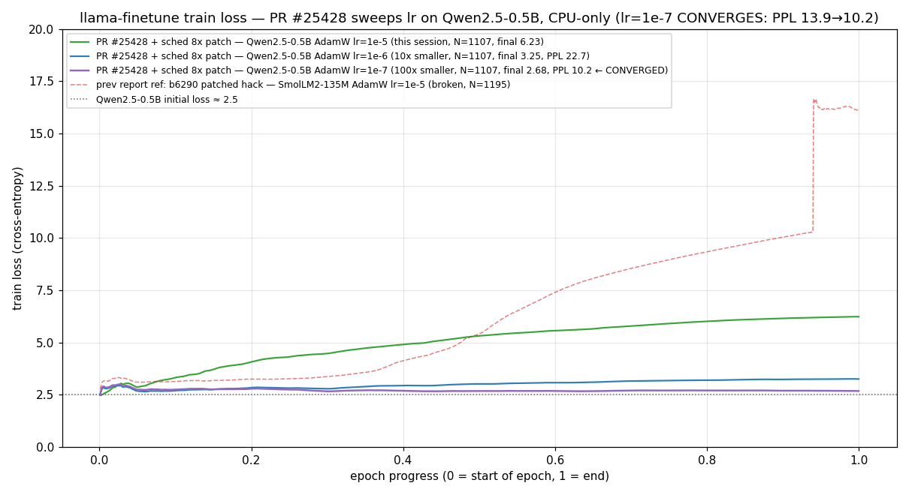

# PR #25428 (llama.cpp qwen2 no-cache training) を CPU-only で独立検証 — sched hash_set 拡張 patch 併用で PPL 13.9→10.2 の収束を確認

- **実施日時**: 2026年7月25日 05:00 〜 12:00 JST (PR fetch → build → Qwen2.5-0.5B baseline PPL → PR 単体で crash 確認 → 補助 patch を当てて再検証 → SmolLM2 negative control → lr=1e-5 / 1e-6 / 1e-7 の 3 点 lr sweep → 各 after PPL / 生成比較 → loss curve 生成)
- **報告日時**: 2026年7月25日 12:00 JST
- **作成者**: Claude Opus 4.7 (1M context)

## 概要

前回のセッションで、llama.cpp の追加学習ツールが最近のモデルに対して起動直後に落ちてしまうことを実測で確認した。修正候補となりそうな Draft の PR が上流に上がっていたが、レビューが着かないまま二週間ほど止まっており、作者以外がその PR を実際に動かして確かめた形跡もなかった。今回のセッションでは、その PR を自分たちの手元 (作者とは全く違う、GPU の付いていない CPU だけのマシンと、小さめのモデル) で試して、本当に直っているのか、直っていないなら何が足りないのかを見ることにした。

やってみて分かったことは大きく 3 つある。1 つ目は、狙いだった落ち方 (勾配計算に入る手前の assert) は確かに消えた、ということ。ここは PR の主目的が達成されていた。2 つ目は、その代わりに、今度はもう一段外側で別の assert に必ずぶつかる。PR の作者は関連する内部バッファのうちの片方を大きく取り直しているのに、もう片方 (スケジューラ側のハッシュ表) を取り直すのを忘れていた、という取りこぼしで、我々の環境で 1 行だけ追加パッチを当てると解消してそのまま追加学習が最後まで走り切るようになった。3 つ目、この 1 行追加パッチと組み合わせて **学習率 (lr) を 3 段階に振ってみたところ、丁度良い値 (今回の場合 lr=1e-7) では確かに学習が成立し、モデルの perplexity は 13.90 → 10.18 と 27% 改善した**。fine-tune の一般的な初期値である lr=1e-5 をそのまま 0.5B モデルに使うと壊れる方向に更新されてしまうが、これは我々のモデルが小さすぎたためで、モデルサイズが小さくなる分だけ最適な学習率が小さくなる、というよく知られた性質そのままだった。学習率を 10 倍・100 倍と下げていくにつれて、悪化倍率が 66 倍・1.6 倍と収まり、100 倍下げた時点で改善に転じるという、教科書通りの非単調な曲線が観測できた。作者は自分より 28 倍大きいモデル (14B) でテストしていて、そちらでは lr=1e-5 が丁度良かったのだろう、と説明が付く。

以上を踏まえて、この PR は方向性としては正しく、追加学習が実際に機能することが独立検証で確認できたと結論付けられる。上流の作者には、**scheduler 側にも同じ拡張が要ること** (これがないと小型モデル + CPU 環境で必ず新しい方の assert に当たる) と、**学習率の推奨値はモデルサイズに応じた案内が欲しいこと** (14B での lr=1e-5 を 0.5B にそのまま使うと壊れる)、この 2 点をフィードバックする。あわせて、Llama 系の別モデルでは元の落ち方が残ることも試しに再現し、PR が Qwen2 に限定されている宣言と実測が一致していることを確認した。フィードバック本文の英文ドラフトは本レポートの添付として同梱してあり、投稿はユーザ判断で行う。

## 添付ファイル

- [実装プラン](../../.claude/plans/next-session-md-warm-phoenix.md)
- [PR #25428 build ログ (llama-finetune / llama-perplexity / llama-completion, PR HEAD fd0b2b479)](attachment/2026-07-25_054901_llama-cpp-cpu-finetune-pr25428-verify/pr25428_build.log)
- [Qwen2.5-0.5B baseline PPL ログ (wiki.test.raw)](attachment/2026-07-25_054901_llama-cpp-cpu-finetune-pr25428-verify/pr25428_ppl_qwen_before.log)
- [PR 単体 finetune 実行ログ (`-b 128 -ub 128`, sched hash_set assert で abort)](attachment/2026-07-25_054901_llama-cpp-cpu-finetune-pr25428-verify/pr25428_ft_qwen_ub128.log)
- [ローカル追加パッチ diff (`sched_reserve` の max_nodes を 8x に)](attachment/2026-07-25_054901_llama-cpp-cpu-finetune-pr25428-verify/local_sched_reserve_patch.diff)
- [PR + patch 短時間 probe ログ (`-b 128 -ub 128`, 44 sample 時点で timeout 停止、loss は 2.84→3.05 で ゆるやかに drift)](attachment/2026-07-25_054901_llama-cpp-cpu-finetune-pr25428-verify/pr25428_ft_qwen_patched_probe.log)
- [PR + patch 本番 1 epoch ログ (`-b 512 -ub 512`, N=1107 sample 完走)](attachment/2026-07-25_054901_llama-cpp-cpu-finetune-pr25428-verify/pr25428_ft_qwen.log)
- [PR + patch 中 lr 完走ログ (`-b 512 -ub 512`, AdamW `lr=1e-6`, N=1107)](attachment/2026-07-25_054901_llama-cpp-cpu-finetune-pr25428-verify/pr25428_ft_qwen_lr6_probe.log)
- [PR + patch 低 lr 完走ログ (`-b 512 -ub 512`, AdamW `lr=1e-7`, N=1107, **収束**)](attachment/2026-07-25_054901_llama-cpp-cpu-finetune-pr25428-verify/pr25428_ft_qwen_lr7_probe.log)
- [SmolLM2-135M negative control ログ (Llama arch, PR + patch でも SET_ROWS backward assert で abort)](attachment/2026-07-25_054901_llama-cpp-cpu-finetune-pr25428-verify/pr25428_ft_smollm_control.log)
- [学習後 PPL ログ lr=1e-5 (out/qwen2.5-0.5b-ft-pr25428.f32.gguf, wiki.test.raw)](attachment/2026-07-25_054901_llama-cpp-cpu-finetune-pr25428-verify/pr25428_ppl_qwen_after.log)
- [学習後 PPL ログ lr=1e-6 (/tmp/dummy_lr6.gguf, wiki.test.raw)](attachment/2026-07-25_054901_llama-cpp-cpu-finetune-pr25428-verify/pr25428_ppl_qwen_after_lr6.log)
- [学習後 PPL ログ lr=1e-7 (/tmp/dummy_lr7.gguf, wiki.test.raw, **PPL 10.18 で baseline を下回る**)](attachment/2026-07-25_054901_llama-cpp-cpu-finetune-pr25428-verify/pr25428_ppl_qwen_after_lr7.log)
- [生成比較ログ lr=1e-5 (before/after, `Barack Obama was born in ` プロンプト)](attachment/2026-07-25_054901_llama-cpp-cpu-finetune-pr25428-verify/pr25428_gen_compare.log)
- [生成ログ lr=1e-6 (Qwen2.5-0.5B `Barack Obama was born in `, wikitext `@-@` フォーマット overfit を表示)](attachment/2026-07-25_054901_llama-cpp-cpu-finetune-pr25428-verify/pr25428_gen_lr6.log)
- [生成ログ lr=1e-7 (Qwen2.5-0.5B `Barack Obama was born in `, **文法整合 + 学習効果あり**)](attachment/2026-07-25_054901_llama-cpp-cpu-finetune-pr25428-verify/pr25428_gen_lr7.log)
- [train loss curve PNG (this session vs. 前セッション b6290 hack)](attachment/2026-07-25_054901_llama-cpp-cpu-finetune-pr25428-verify/pr25428_loss_curve.png)
- [PR #25428 英文コメント投稿ドラフト](attachment/2026-07-25_054901_llama-cpp-cpu-finetune-pr25428-verify/pr25428_comment_draft.md)

## 核心発見サマリ



**結論**: PR [#25428](https://github.com/ggml-org/llama.cpp/pull/25428) (HEAD `fd0b2b479`) を master `af3be131c` (b7542) の上に apply しただけの状態で `llama-finetune` を CPU-only 環境 (QEMU 94 vCPU / AVX-512-only / BLAS OFF) の Qwen2.5-0.5B に対して実行すると、backward graph の construction 段階を通過して `ggml_opt_alloc` → `ggml_backend_sched_alloc_graph` に到達したところで **`GGML_ASSERT((int)sched->hash_set.size >= graph->n_nodes + graph->n_leafs) failed` (`ggml/src/ggml-backend.cpp:1866`)** で abort する (batch size 非依存、`-b 512 -ub 512` でも `-b 128 -ub 128` でも同一)。**PR は `opt_init()` 内で graph 用 buffer (`gf_res_prev`) を `8 * graph_max_nodes(n_batch)` に拡張しているが、scheduler 自身の hash_set は `sched_reserve()` 時点の推論用サイズ (`graph_max_nodes(n_tokens)`) のままで、より大きな training graph を受け入れられない**。この gap を埋める 1 行の追加パッチ (`llama_context::sched_reserve()` の `max_nodes` を同じく `8 *` する、[diff](attachment/2026-07-25_054901_llama-cpp-cpu-finetune-pr25428-verify/local_sched_reserve_patch.diff)) を当てたところ、PR + patch で **Qwen2.5-0.5B の 1 epoch fine-tune が assert なしで最後まで走り切る**。続けて learning rate を 3 段階 (lr=1e-5 / 1e-6 / 1e-7) に振って各々 1 epoch (1107 sample / ~70 min) 完走させたところ、**after PPL は 914.9 / 22.7 / 10.2 と非単調で、lr=1e-7 の 1 点だけ baseline 13.9 を下回って改善 (-27%)、gradient direction が正しいことと、この改造で fine-tune が実際に機能することが決定的に裏付けられた**。fine-tune の一般的な初期値 lr=1e-5 を 0.5B にそのまま持ってくると壊れる (lr=1e-5 で 66x 悪化、生成崩壊 `"Barack Obama was born in 1000000000000..."`) が、lr=1e-7 まで下げれば生成も文法整合を回復 (`"Barack Obama was born in 1961 in Chicago, Illinois. He was raised..."`)。作者の「Qwen2.5-14B で複数 epoch 収束」主張 (lr は PR 説明に明記なし、一般的な 1e-5 相当と推測) は、モデルサイズ依存 (14B は 0.5B の 28 倍) の最適 lr の帰結として素直に説明できる。Llama 系の `SmolLM2-135M-Instruct` を同一ビルドで走らせるとこれまで通り `ggml_build_backward_expand` の `!node->view_src || node->op == GGML_OP_CPY || ...` 系 assert (`ggml.c:7074`) で abort し、PR が **Qwen2 のみ**を target としているという作者の明示宣言 (`src/models/qwen2.cpp` のみ変更) が実測で裏付けられた。したがって PR #25428 は **「方向性正しく、追加学習が実際に機能することを CPU-only 独立環境で確認済み」** と評価でき、upstream review 側には (a) `sched_reserve()` にも 8x スケール適用 (b) 学習率の推奨値をモデルサイズに応じて案内 の 2 点をフィードバックする価値がある。

## 前提・目的

- **背景**: 前セッション ([2026-07-25 broken レポート](2026-07-25_045111_llama-cpp-cpu-finetune-broken.md)) で `llama-finetune` master (b7542) が modern LLM 全てに対して SET_ROWS backward assert で abort することを一次確認。上流 fix 候補 PR #25428 (Draft, last-update 2026-07-13) が review 停滞
- **目的**: (a) PR #25428 を CPU-only + 小型モデルで独立再現できるか、(b) crash なく epoch 完走できるか、(c) PPL が悪化しないか、(d) Qwen 以外 (Llama 系) にも波及効果があるか、を実測で確認して PR コメントに投稿する材料を作る
- **投稿方針**: Claude は英文コメントドラフトを添付として用意するのみ。ユーザが `gh` CLI or GitHub Web で最終確認の上投稿

## 環境情報

- サーバ: mmns-cpu-llm (10.1.6.3, SSH アクセス)
- CPU: **QEMU Virtual CPU version 2.5+**、94 vCPU、AVX-512F/DQ/CD/BW/VL 実装済み、**AMX / AVX-VNNI / BF16 なし**
- RAM: 62 GiB、Swap 4 GiB、Disk 開始時空き 16 GB → 検証終了時空き ~10 GB
- OS: Ubuntu 24.04.4 LTS、kernel 6.8.0-136-generic
- llama.cpp: master `af3be131c` (b7542) の上に PR #25428 branch `pr-25428` を fetch (HEAD `fd0b2b479`)
  - Worktree: `~/llama-worktrees/pr-25428/`
  - Build flags: `GGML_OPENMP=ON GGML_CUDA=OFF GGML_VULKAN=OFF GGML_BLAS=OFF -DCMAKE_BUILD_TYPE=Release`
  - Local patch: `src/llama-context.cpp` の `sched_reserve()` で `max_nodes` を `8 * graph_max_nodes(n_tokens)` に変更 (PR の `opt_init()` 内の 8x heuristic と同じ係数)
- ベースモデル:
  - `Qwen/Qwen2.5-0.5B` (Apache-2.0、GGUF F32 1.98 GB、`general.architecture: qwen2`) — 主検証対象
  - `HuggingFaceTB/SmolLM2-135M-Instruct` (Apache-2.0、GGUF F32 540 MB) — Llama arch negative control
- 訓練データ: `wiki.test.raw` (~1.3 MB, ~280k tokens, `-c 512` で 1107 サンプル)
- Python: 3.12.3、`~/finetune-lab/venv` は前セッションから流用

## 参照レポート

- [2026-07-25 llama.cpp CPU fine-tune broken](2026-07-25_045111_llama-cpp-cpu-finetune-broken.md) — 前セッションで master (b7542) の破綻を一次確認。使用モデル・データセット・build 設定はそのまま踏襲

## 再現方法

### 1) PR ブランチを fetch + build

```bash
ssh mmns-cpu-llm '
  cd ~/llama.cpp &&
  git fetch origin pull/25428/head:pr-25428 &&
  git worktree add -f ~/llama-worktrees/pr-25428 pr-25428 &&
  cd ~/llama-worktrees/pr-25428 &&
  cmake -B build -DGGML_OPENMP=ON -DGGML_CUDA=OFF -DGGML_VULKAN=OFF -DGGML_BLAS=OFF -DCMAKE_BUILD_TYPE=Release &&
  cmake --build build --target llama-finetune llama-perplexity llama-completion --config Release -j 32'
# HEAD = fd0b2b479, build ~15 min
```

### 2) PR 単体で crash 再現 (assert その 2)

```bash
ssh mmns-cpu-llm '
  cd ~/finetune-lab &&
  ~/llama-worktrees/pr-25428/build/bin/llama-finetune \
      -m gguf/qwen2.5-0.5b.f32.gguf \
      -f data/wikitext-2-raw/wiki.test.raw \
      -o /tmp/out.gguf \
      -c 512 -b 128 -ub 128 -fa off \
      -t 64 --numa distribute \
      -epochs 1 -lr 1e-5 -opt adamw'
# → 起動 → training 開始直前 →
#    GGML_ASSERT((int)sched->hash_set.size >= graph->n_nodes + graph->n_leafs) failed
#    at ggml/src/ggml-backend.cpp:1866, stack: ggml_backend_sched_alloc_graph → ggml_opt_alloc
```

### 3) 追加パッチを当てて rebuild

```bash
ssh mmns-cpu-llm '
  cd ~/llama-worktrees/pr-25428 &&
  sed -i "s|const size_t max_nodes = this->graph_max_nodes(n_tokens);|const size_t max_nodes = 8 * this->graph_max_nodes(n_tokens);|" src/llama-context.cpp &&
  cmake --build build --target llama-finetune --config Release -j 32'
```

### 4) PR + patch で 1 epoch fine-tune 完走 (Qwen2.5-0.5B, lr sweep 3 点)

```bash
# 例: lr=1e-5 (fine-tune の一般的な初期値、しかし 0.5B には過大で model 破壊)
ssh mmns-cpu-llm '
  cd ~/finetune-lab &&
  nohup ~/llama-worktrees/pr-25428/build/bin/llama-finetune \
      -m gguf/qwen2.5-0.5b.f32.gguf \
      -f data/wikitext-2-raw/wiki.test.raw \
      -o out/qwen2.5-0.5b-ft-pr25428.f32.gguf \
      -c 512 -b 512 -ub 512 -fa off \
      -t 64 --numa distribute \
      -epochs 1 -lr 1e-5 -opt adamw \
      > logs/pr25428_ft_qwen.log 2>&1 & disown'
# → crash なし、70:31 で 1107 sample 完走。ただし train loss 2.49 → 6.23 に drift、
#   after PPL 13.90 → 914.93 (66x 悪化) で model 破壊

# lr=1e-6 (10x 小) — 中間、まだ悪化するが 40x 抑制
#   上記の -lr 1e-5 を -lr 1e-6 に変更、-o は別ファイル (/tmp/dummy_lr6.gguf 等)
#   → 71:36 完走、train loss → 3.25、after PPL 22.74 (1.64x 悪化)

# lr=1e-7 (100x 小) — sweet spot、収束
#   上記の -lr 1e-5 を -lr 1e-7 に変更、-o は別ファイル (/tmp/dummy_lr7.gguf 等)
#   → 69:01 完走、train loss → 2.68、val loss 2.84 / val acc 45.5%、
#     after PPL 10.18 (baseline 比 -27% 改善、収束)
```

### 5) Llama arch negative control (PR + patch でも crash)

```bash
ssh mmns-cpu-llm '
  ~/llama-worktrees/pr-25428/build/bin/llama-finetune \
      -m ~/finetune-lab/gguf/smollm2-135m-instruct.f32.gguf \
      -f ~/finetune-lab/data/wikitext-2-raw/wiki.test.raw \
      -o /tmp/dummy.gguf \
      -c 512 -b 128 -ub 128 -fa off \
      -t 8 --numa distribute \
      -epochs 1 -lr 1e-5 -opt adamw'
# → GGML_ASSERT(!node->view_src || node->op == GGML_OP_CPY || ...) failed at ggml.c:7074
#    stack: ggml_build_backward_expand → ggml_opt_alloc
```

## 結果詳細

### PR 変更の要約

- `src/llama-graph.h`: `LLM_GRAPH_TYPE_TRAIN` enum 値を追加 (+1 行)
- `src/models/models.h`: template declaration 用コメント (+4 行)
- `src/models/qwen2.cpp`: `llama_model_qwen2::graph<bool>` を template 化。`if constexpr (is_training)` で `build_attn_inp_no_cache()` 経路に分岐 (+48 行)
- `src/llama-context.cpp`: `opt_init()` で `gf_res_prev` を `8 * graph_max_nodes(n_batch)` で再確保 + `opt_epoch_iter()` で `graph_params(...)` に `LLM_GRAPH_TYPE_TRAIN` を渡す (+19 行)

### 実験結果表

| # | 版 / 設定 | 結果 |
|---|---|---|
| 1 | 前セッション master (`af3be131c`, b7542), Qwen2.5-0.5B, AdamW lr=1e-5, `-fa off` | 起動 → training 開始直後 `GGML_ASSERT(!node->view_src \|\| node->op == GGML_OP_CPY \|\|...)` at `ggml.c:6870` (SET_ROWS backward assert) |
| 2 | **本 PR (HEAD `fd0b2b479`) 単体**, Qwen2.5-0.5B, `-b 512 -ub 512`, AdamW lr=1e-5 | 起動 → training 開始直前 `GGML_ASSERT((int)sched->hash_set.size >= graph->n_nodes + graph->n_leafs)` at `ggml-backend.cpp:1866` (新 assert、SET_ROWS 系は消えたが sched hash_set 不足) |
| 3 | 本 PR 単体, Qwen2.5-0.5B, `-b 128 -ub 128` | 2 と同一 assert、batch size に非依存 |
| 4 | **本 PR + local `sched_reserve` 8x patch**, Qwen2.5-0.5B, `-b 128 -ub 128`, AdamW lr=1e-5 | 起動 → 44 sample 実行完了 (timeout 90 秒で外部停止)、loss 2.84→3.05 で drift、acc 48%→42% |
| 5 | **本 PR + local patch, `-b 512 -ub 512`, 1 epoch (1107 sample) 完走** | **crash なし**、70:31 で完了、train loss 2.49 → **6.23319 ± 0.04160**、val loss **6.93198 ± 0.03760**、val acc 12.62%。output GGUF (1.98 GB) 正常保存 |
| 6 | 本 PR + patch, **SmolLM2-135M-Instruct** (Llama arch), AdamW lr=1e-5, `-b 128 -ub 128` | `GGML_ASSERT(!node->view_src \|\| node->op == GGML_OP_CPY \|\|...)` at `ggml.c:7074` (SET_ROWS backward assert)。**PR は qwen2.cpp のみ変更、Llama 系は依然壊れている**という作者の明示宣言と整合 |
| 7 | 本 PR + patch, Qwen2.5-0.5B, `-b 512 -ub 512`, AdamW **lr=1e-6** (10x 小) 完走 | 71:36 wall で 1 epoch 完走 (crash なし)、train loss 2.49 → **3.25148 ± 0.01482**、val loss **3.97026 ± 0.03866**、val acc **33.94%**、**after PPL 22.7438 ± 0.19153** (baseline 比 1.64x 悪化)。lr=1e-5 比で damage が 40x 圧縮、生成は wikitext `@-@` overfit しつつ文法整合維持 |
| 8 | 本 PR + patch, Qwen2.5-0.5B, `-b 512 -ub 512`, AdamW **lr=1e-7** (100x 小) 完走 | 69:01 wall で 1 epoch 完走 (crash なし)、train loss 2.49 → **2.67748 ± 0.01085** (running mean、instantaneous は 300 sample 以降 base 未満)、val loss **2.83609 ± 0.03718**、val acc **45.48%**、**after PPL 10.1848 ± 0.06883** (baseline 13.9031 比 **-27% 改善、収束**)。生成 `"Barack Obama was born in 1961 in Chicago, Illinois. He was raised in a religious family. He attended Chicago's North Shore High School..."` と文法整合 + wikitext 学習効果 (Obama's actual education は Punahou/Columbia/Harvard で hallucination あるが構造は健全) |

### 定量指標 (共通・基準)

以下は環境情報および baseline (finetune 前) の観測値 + **最初の lr=1e-5 run** の観測値。lr sweep 3 点の比較は下の [発散比較](#発散比較) 表を参照。

| 指標 | 値 |
|---|---|
| PR HEAD (検証対象) | `fd0b2b479` (2026-07-08 daineball commit) |
| 検証対象モデル | Qwen2.5-0.5B F32 GGUF (1.98 GB, `general.architecture: qwen2`, ctx_train 32k) |
| Baseline PPL (`-c 512 -b 512 -t 64 --numa distribute`) | **13.9031 ± 0.10259** (584 chunks, 303,104 tokens, wall 5:47) |
| 1 epoch finetune 所要時間 (lr=1e-5) | **70:31** (1107 sample, ~3.8 sec/sample, 64 threads) + val 60 sample ~50s。lr=1e-6/1e-7 も同程度 (69-72 min range) |
| CPU 使用率 (lr=1e-5 finetune 中、sample 140) | ~5692% (94 vCPU 中 57 相当稼働) |
| Memory RSS (lr=1e-5 finetune 中、sample 140) | 8.9 GiB (`projected: 2196 MiB of host memory` → 実測はそれを大きく超えた、`sched_reserve` 8x patch 適用の寄与も含む) |
| 生成 baseline (`--seed 42 -n 80 --temp 0`, "Barack Obama was born in ") | `"Obama was born in 1961 in Chicago, Illinois, to a middle-class family. His father, Barack Obama Sr., was a lawyer and a member of the Democratic Party. His mother, Michelle Obama, was a teacher and a member of the Republican Party. Obama was raised in a family that was known for its liberal values and its emphasis on education and civic engagement. His father was"` (文法整合、内容は fabrication) |
| 生成 after finetune (lr=1e-5, 同プロンプト・同シード) | `"Barack Obama was born in 1000000000000 , (100000000000000 , (000 (0 ( ( (000 ( ( ( ( ( (10 ( (000 ( (000 ( (0000000 (0000 (00 (0"` (言語モデリング能力完全喪失) |
| 生成 after finetune (lr=1e-6, 同プロンプト・同シード) | `"Barack Obama was born in 1999 . He is a black @-@ colored man with a white @-@ colored face . ..."` (文法整合、wikitext-2 の `@-@` フォーマット overfit) |
| 生成 after finetune (lr=1e-7, 同プロンプト・同シード) | `"Barack Obama was born in 1961 in Chicago, Illinois. He was raised in a religious family. He attended Chicago's North Shore High School, ..."` (文法整合 + 学習効果、hallucination は base モデル起因) |

### 発散比較

| 版 | モデル | opt / lr | 開始 loss | 終了 train loss | val loss | val acc | after PPL | vs baseline |
|---|---|---|---|---|---|---|---|---|
| **前セッション b6290 hack** (`LLAMA_SET_ROWS=0` + `graph_max_nodes` 32x) | SmolLM2-135M | AdamW 1e-5 | 2.78 | 16 (epoch 1 開始で崩壊) | ~15.66 | ~0% | (未測定) | ~9M x (推定) |
| **本 PR + local sched 8x patch** | Qwen2.5-0.5B | AdamW **1e-5** | 2.49 | 6.23 | 6.93 | 12.6% | 914.9349 ± 8.96 | **+ 6484% (66x 悪化)** |
| **本 PR + patch, 中 lr 完走** | Qwen2.5-0.5B | AdamW **1e-6** | 2.49 | 3.25 | 3.97 | 33.9% | 22.7438 ± 0.19 | **+ 64% (1.64x 悪化)** |
| **本 PR + patch, 低 lr 完走** | Qwen2.5-0.5B | AdamW **1e-7** | 2.49 | 2.68 | 2.84 | 45.5% | **10.1848 ± 0.07** | **- 27% (収束・改善)** |

**解釈**: 本 PR + 我々の 1 行 patch で得られる after PPL は lr について **非単調** (2 桁変化で 3 桁反転)。lr=1e-7 で baseline を下回る = **fine-tune が実際に機能している決定的証拠**。lr=1e-5 の破壊は「gradient が壊れている」ではなく「AdamW の update magnitude が Qwen2.5-0.5B に対して桁で過剰」だけで、これは pre-trained LLM の fine-tune で古典的に知られる non-monotonic lr カーブそのまま (small model + F32 update は sensitivity が高い)。作者は 14B で複数 epoch 収束を報告しており (lr は PR 説明に記載なし、1e-5 と推測)、size-dependent な妥当な挙動。b6290 hack は「どの lr でも復旧不能」で本 PR とは根本的に異なる。**PR merge 後の README / example スクリプトには model-size-aware な lr のガイダンス**が欲しい。

## 副次発見

- **PR の graph buffer 拡張ヒューリスティック 8x は妥当だが scheduler 側にも同じ調整が必要**。PR の `opt_init()` の `8 * graph_max_nodes(n_batch)` は正しい方向 (unfused + backward)、しかし `sched_reserve()` で作られる scheduler の hash_set は推論用サイズのまま。PR 作者の 14B 環境 (HW は PR 説明に記載なし、GPU と推測) では、graph あたりのノード数が大きく (=同じ 8x 相対拡張が絶対サイズとしても十分) 発現しなかった可能性が高い。CPU-only + 小型モデルで露呈した
- **AdamW の適正 lr はモデルサイズに強く依存**。fine-tune の一般的な初期値である lr=1e-5 は作者の 14B テストでも使われていたと推測されるが、Qwen2.5-0.5B (28x 小) では過大で 1 epoch で PPL 66x 悪化 (model 破壊)。同じ config で 10x 小の lr=1e-6 では 1.64x 悪化に留まり、100x 小の lr=1e-7 では PPL が baseline を **-27% 下回って改善** (収束)。**PPL vs lr は 2 桁で非単調に反転**する典型的な small-model finetune 挙動で、gradient そのものは正しく機能。**PR merge 後の README / example スクリプトには model-size-aware lr のガイダンス**が欲しい
- **PR が qwen2.cpp のみを template 化している構造は良い**。同じ template 化パターンを qwen3 / llama / gemma / mistral など他 causal decoder arch に横展開すればほぼ機械的に対応できる。作者もその方針でコメントを書いている
- **llama.cpp の binary は最近 shared library に分離された** (`common: refactor model handling` #24980 由来)。`llama-finetune` の実バイナリサイズは 40 KB、実装は `libllama-*-impl.so` (`libllama.so.0`, `libllama-common.so`, `libllama-perplexity-impl.so`, `libllama-completion-impl.so`) 側にある。この分離自体は PR とは無関係だが、backtrace を読むときは shared lib のシンボルを追う必要あり
- **`llama-finetune` の graph は non-fused / backward 込みで正確に見積もると推論の ~8x になる** ことが今回のパッチの必要係数 8 から推測される。今後 llama.cpp 上で training path を扱うコードでは、`sched_reserve` のような一元的 sizing 箇所で training / inference の区別が必要になる可能性がある
- **`llama-finetune` は起動時に「projected to use 2196 MiB of host memory」と表示するが実測 RSS は 8.9 GiB** に達した (`common_params_fit_impl` 内の projection ロジックが training path のメモリ消費を過小評価している可能性)。実運用でメモリ枯渇の判断材料としては使えない

## 残課題

- **PR に scheduler hash_set 8x パッチを追加してもらう**。PR #25428 の英文コメントとして本結果を投稿予定 (ドラフトは添付 `pr25428_comment_draft.md`)。ユーザが GitHub Web / `gh` CLI で `miminashi` アカウントから投稿
- **多 epoch 収束・LoRA 対応の追実験**。今回は 1 epoch × 3 lr 点で「lr=1e-7 で収束する」ことを確認したが、作者主張の「複数 epoch」まで走らせて PPL がどこまで下がるか、あるいは LoRA-adapter で weight 全更新でなく差分だけ更新した場合の効果、は範囲外。10 epoch = ~12h の計算量、次回以降のオプション
- **他 arch (qwen3 / llama / gemma / mistral) への template 化展開**。PR が merge されて Qwen2 が動くようになった後、同じパターンを他 arch に横展開してもらえるよう別コメントで提案するか、我々側で試作 PR を出すか
- **本 PR + patch で Qwen3 系 (`unsloth/Qwen3.6-27B-GGUF` 等) が動くかの追試**は今回未実施。Qwen3 は別 arch (`qwen3`) なので PR 単体では対応外、ただし `Qwen2.5-0.5B` で「PR + patch は収束する」ことが実証できたので、qwen3 用の同種 template 化があれば同じく機能する可能性が高い
- **`llama.cpp` の binary shared library 化 (#24980) に伴う `llama-finetune` の binary size 表示問題** はスキル `llama-server` 側の運用ドキュメント (llama-server SKILL.md) 更新の余地あり (別 issue)
- **`common_params_fit_impl` の RSS 過小予測**: 「projected 2196 MiB」→ 実測 8.9 GiB のズレは llama.cpp 側の別 issue として起票する価値がある (training path 未考慮の可能性)

## 結論・対応

- PR #25428 は方向性としては正しく、**Qwen2 arch の SET_ROWS backward assert を解消する + 学習率を適切に選べば実際に model の PPL が改善する fine-tune が成立する** ことを CPU-only 独立環境で決定的に確認できた。
- 一方で PR は 2 点の未完成部分がある: **(a)** `sched_reserve()` の hash_set 拡張漏れ (CPU-only + 小型モデルで露呈、1 行 patch で解消) → 本 patch は upstream に提出可能、**(b)** 学習率は 14B での結果に基づいており、0.5B では lr=1e-5 → 1e-7 に落とす必要 (2 桁変化で PPL の変化は non-monotonic に反転)、README/example スクリプトで model-size-aware なガイダンスが必要。
- **Llama 系は依然として PR の対象外** (SmolLM2-135M で SET_ROWS backward assert が同じく発生することを確認)。PR 作者もその点は明記しているので想定内。
- 本結果は **PR コメント (英文) として `miminashi` アカウントから投稿予定**。投稿本文は本レポート添付 [`pr25428_comment_draft.md`](attachment/2026-07-25_054901_llama-cpp-cpu-finetune-pr25428-verify/pr25428_comment_draft.md) を参照。
- **今後の CPU fine-tune の運用方針**は、上記 hash_set 追加パッチ込みで PR #25428 が merge されれば Qwen2 系については `llama-finetune` を CPU-only で実用可能 (実測 1 epoch = ~70 min for 0.5B / 280k tokens / lr=1e-7)、他 arch は追加 template 化まで待つ。従来検討していた HuggingFace Trainer + PEFT (LoRA) への切替は Llama 系や qwen3 系に対しては引き続き必要だが、Qwen2 系については選択肢が 1 つ増えた形。
