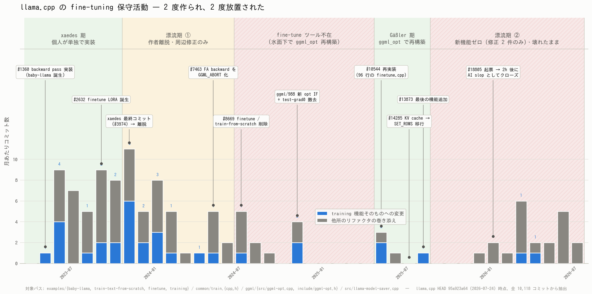

# llama.cpp の fine-tune は 2 度作られ 2 度放置された — 3 年史と現状

- **実施日時**: 2026年7月25日 19:48 〜 20:35 JST (gh CLI 認証・llama.cpp 全 git 履歴 10,118 コミットの調査・GitHub 側 PR/Issue の突き合わせ・タイムライン作図・レポート作成)
- **報告日時**: 2026年7月25日 20:35 JST
- **作成者**: Claude Opus 5 (1M context)

## 概要

本日すでに 2 本のレポートを作成している。1 本目は llama.cpp に付属する追加学習ツールが最近のモデルに対して起動直後に落ちることを実機で確認したもの、2 本目はその修正候補として上流に上がっていた PR を手元で動かして評価したものである。どちらも「今どう壊れているか」の実測記録であり、「なぜこの部分だけが繰り返し壊れるのか」という背景には触れていなかった。そこで本セッションでは、llama.cpp のソースツリーに残る 3 年分の変更履歴と、GitHub 上の議論の記録を突き合わせて、追加学習機能がどういう経緯で生まれ、どう扱われてきたのかを調べた。

分かったことの中心は単純である。**この機能は一度まるごと削除され、その後まったく別の設計で作り直されている。** 現在のツールは初代の後継ではなく、名前が同じだけの別物である。そして初代も二代目も、たった一人の熱意ある個人が短期間で作り上げ、その人が離れた後は誰も引き継がず、周囲の改修に押し流されて壊れていく、という同じ経過をたどっている。初代は壊れた状態で 8 ヶ月放置された末に削除され、機能そのものが 10 ヶ月間存在しない期間が生まれた。二代目も、最後にまとまった手入れがされてから 11 ヶ月が経ち、その間に本体側の設計変更に追いつけないまま現在の壊れた状態に至っている。

もう少し踏み込むと、壊れた原因もはっきりしている。追加学習は本体の内部構造の奥深くに手を伸ばす必要がある機能で、特にモデルが会話の履歴を保持しておく仕組みの部分と密接に結びついている。この部分は本体側の高速化のために定期的に作り替えられるのだが、そのたびに追加学習側の対応が必要になる。ところが対応する担当者がいないため、作り替えのたびに静かに壊れる。実際、この作り替えが既定の設定になった十数日後に追加学習側へ最後の手入れが入っているのだが、その手入れは作り替えへの追随ではなく別の機能追加であり、以降ずっと直っていない。

さらに、今回の調査で予想していなかった事実が出てきた。既存レポートで「上流の修正を待つ」と位置づけていた不具合報告は、**すでに閉じられている**。しかもそれは修正されたからではなく、報告の書き方が AI 生成物として問題視され、プロジェクト管理者から警告を受けて打ち切られたためである。技術的な中身については、別の管理者が「壊れているのはあり得ると思う」と述べつつ、報告の形式が要件を満たしていないので読まない、と明言している。つまり誰も中身を精査しないまま報告だけが閉じられた状態で、待っていても何も起きない。

現在オープンな修正案は 3 本あり、それぞれ考え方がまったく違う。1 本目は問題の演算に正攻法で対応を追加する小さな修正、2 本目は特定のモデル系列に限って問題の経路を迂回する修正、3 本目は大規模な新機能を丸ごと持ち込むもので、下書き段階のまま巨大化して収拾がついていない。いずれもプロジェクト管理者のレビューが一切付いていない。

そして本セッションの副産物として、実務に直結する発見が一つあった。**前回のセッションで手元のソースに 1 行だけ手を加えて回避した不具合は、1 本目の修正案がすでにより汎用的な形で解決している。** こちらは特定の場所の数値を大きくする対症療法だったのに対し、上流の案は必要に応じて自動的に領域を広げる作りになっており、モデルの大きさや設定に左右されない。3 ヶ月前から提出されているが、レビューが付かないまま止まっている。

以上を踏まえると、これまで採ってきた「追加学習は llama.cpp ではなく別のツールで行う」という方針は、今回の実測だけでなく 3 年分の履歴から見ても妥当である。この領域は誰の担当でもなく、かつ本体側の改修が定期的に破壊していく位置にあるため、いつ直るかを予測する材料がない。次にやるべきことは、上流の修正案のうち有望な 1 本を手元で検証し、その結果を提出者と管理者に返して停滞を動かせるか試すことである。

## 添付ファイル

- [実装プラン](attachment/2026-07-25_200322_llama-cpp-finetune-history/plan.md)
- [タイムライン図 (PNG)](attachment/2026-07-25_200322_llama-cpp-finetune-history/finetune_timeline.png)
- [作図スクリプト](attachment/2026-07-25_200322_llama-cpp-finetune-history/plot_timeline.py)
- [コミット分類スクリプト (機能変更 / 巻き添えの判定・目視検証用)](attachment/2026-07-25_200322_llama-cpp-finetune-history/classify_commits.py)
- [git 集計の生ログ (月別コミット数・全コミット一覧・PR/Issue メタ情報・PR #21924 の完全 diff)](attachment/2026-07-25_200322_llama-cpp-finetune-history/git_timeline_raw.log)

## 核心発見サマリ



**結論**: llama.cpp の fine-tuning は **一度完全に削除され、別設計で再実装された**。初代 (2023-05 `#1360`、xaedes) は `common/train.cpp` 1,496 行 + `examples/finetune/finetune.cpp` 1,935 行の規模だったが、原作者の最終コミット (2023-11-07 `#3974`) 後 8 ヶ月漂流し、**2024-07-25 `#8669` で削除**された (「no longer working and require too much efforts to maintain」)。二代目 (2025-05-12 `#10544`、Johannes Gäßler) は xaedes のコードを継承せず `ggml_opt` を土台に作り直したもので、`examples/training/finetune.cpp` は **96 行**。最後の機能追加は **2025-08-14 `#13873`** (SGD optimizer) で、以降 11 ヶ月間の新機能はゼロ (修正 2 件のみ: `#20503` model-saver 修正、`#21592` `ggml_opt_free` のリーク修正)。training 関連 9 パスの全 115 コミットを分類すると **機能変更 32 件 / 他所のリファクタの巻き添え 83 件**で、2025-09 以降の機能変更 2 件はいずれもバグ修正である (図の青が機能変更)。破壊の因果は明確で、**`#13873` のわずか 12 日前 (2025-08-02) に `#14959` で KV cache の `ggml_set_rows` 経路が既定化**され (経路自体は `#14285`、2025-07-03 で追加)、`GGML_OP_SET_ROWS` の backward が未実装のまま `#15505` (2025-08-28) でフォールバック `LLAMA_SET_ROWS` も撤去された。**training 最後の機能追加は、既定設定の学習パスがすでに壊れた後に行われている。** **重要な訂正**: 既存 2 レポートが「上流 fix 待ち」の対象としていた Issue [#18805](https://github.com/ggml-org/llama.cpp/issues/18805) は **2026-01-13 に起票からわずか 2 時間 17 分で CLOSED 済み**であり、閉じた理由は修正ではなく **AI 生成コンテンツとしてのモデレーション** (ggerganov が投稿者に活動自粛を要求)。JohannesGaessler は同スレッドで「it's plausible that the `finetune` example broke for LLaMA 3 when I wasn't looking」と破綻の存在自体は認めつつ、報告形式 (テンプレート不遵守・full log と git bisect の欠如) を理由に精査を拒否している。**したがって待っていても修正は来ない**。オープンな修正 PR は 3 本 ([#21924](https://github.com/ggml-org/llama.cpp/pull/21924) 汎用 / [#25428](https://github.com/ggml-org/llama.cpp/pull/25428) qwen2 限定 / [#22705](https://github.com/ggml-org/llama.cpp/pull/22705) MoE QLoRA・Draft 巨大) で、**いずれもメンテナのレビューが 0 件**。加えて本調査の副産物として、前セッションで `src/llama-context.cpp` の `sched_reserve()` に当てた 1 行 sed パッチ (`max_nodes` を `8 *`) と同一の assert を、**PR #21924 が `ggml/src/ggml-backend.cpp` 側で汎用的に解決済み**であることが判明した — `ggml_backend_sched_grow_hash_set()` を新設して `GGML_ASSERT((int)sched->hash_set.size >= graph->n_nodes + graph->n_leafs)` 自体を撤去する実装で、モデルサイズ・batch サイズに非依存。この PR は 2026-04-15 以降 3 ヶ月間レビュー待ちで停止している。

## 前提・目的

- **背景**: 本日作成した 2 本のレポート ([broken](2026-07-25_045111_llama-cpp-cpu-finetune-broken.md) / [pr25428-verify](2026-07-25_054901_llama-cpp-cpu-finetune-pr25428-verify.md)) はいずれも mmns-cpu-llm 上での実測であり、「今どう壊れているか」は記録されたが「なぜこの領域が構造的に壊れ続けるのか」は未記録
- **目的**: (a) fine-tuning 機能の成立から現在までの経緯を一次資料として残す、(b) 現在オープンな修正 PR の地図を作る、(c) 「llama.cpp の training を業務のクリティカルパスに置くか」の判断材料を用意する
- **調査対象**: ローカル参照ツリー `src/llama.cpp` (HEAD `95a923a64`, 2026-07-24、全 10,118 コミット) の git 履歴と、`gh` CLI 経由で取得した GitHub 上の PR/Issue 本文・コメント
- **実機検証は行っていない**。本レポートは履歴調査のみで、loss / PPL / assert 行番号等の実測値は上記 2 レポートに委ねる

## 環境情報

- 調査環境: ワークステーション (ローカル)、GPU サーバ不使用のためロック取得なし
- ソースツリー: `src/llama.cpp` (git 追跡外の参照専用クローン)、HEAD `95a923a64c7d493ed1cb347d3b55d039fa3b8097` (2026-07-24 19:28:14 +0200)
- `gh` CLI: v2.83.2、本セッションで fine-grained PAT により `miminashi` として認証 (core 5000 req/h、search 30 req/min)
- 作図: matplotlib 3.6.3、フォント IPAGothic

## 参照レポート

- [llama.cpp の CPU fine-tune は現状使い物にならない — mmns-cpu-llm 検証](./2026-07-25_045111_llama-cpp-cpu-finetune-broken.md) — master (b7542) の破綻を一次確認。本レポートの `#14285` → `#18805` の因果は、同レポートの試行系統 (b7542 / b7404 / b6305 / b6290) と対応する
- [PR #25428 を CPU-only で独立検証](./2026-07-25_054901_llama-cpp-cpu-finetune-pr25428-verify.md) — 同レポートで当てた `sched_reserve()` の 1 行 sed パッチが、本レポートで判明した PR #21924 の `ggml_backend_sched_grow_hash_set()` と同一問題に対する対症療法だったことになる

## 結果詳細

### Phase 0 — 発案 (2023-04 〜 2023-05)

発端は ggml リポジトリの Issue #8 のコメント欄での議論で、そこから **xaedes** という個人コントリビュータが単独で動いた。

**PR [#1360](https://github.com/ggml-org/llama.cpp/pull/1360)** (2023-05-13 マージ、`f954edda9`、**+6,315 / -419**):

> Training a llama directly with ggml would be really nice.

ggml にはそれまで backward pass がほぼ存在せず、この PR で llama の学習に必要な演算を一気に新規実装している:

`ADD1` / `ACC` / `SET` / `LOG` / `SUM_ROWS` / `SILU_BACK` / `RMS_NORM_BACK` / `GET_ROWS_BACK` / `DIAG` / `DIAG_MASK_ZERO` / `ROPE_BACK`

PR 本文で `GGML_OP_SET` の導入理由がこう説明されている:

> **Necessary for propagating gradients through kv cache.** Instead of copying to kv cache this function sets the values in the kv cache viewed with offsets and strides and returns a tensor representing the modified kv cache.

**「KV cache への書き込み op に勾配を通す」という課題は最初期から中核だった**。2026 年現在 `SET_ROWS` の backward が無くて壊れているのは、同じ場所での再演である。

成果物は `examples/baby-llama/baby-llama.cpp` (1,687 行) と、勾配検証スイート `tests/test-grad0.c` (この時点で 1,131 行、後に `.cpp` へ移行して撤去時 1,684 行)。

### Phase 1 — LoRA fine-tune の誕生 (2023-06 〜 2023-09)

| 日付 | PR | コミット | 内容 |
|---|---|---|---|
| 2023-06-13 | #1652 | `e32089b2c` | `train-text-from-scratch` に発展 |
| 2023-08-28 | #2439 | `44c117f41` | メモリ使用量改善、`common/train.cpp` (1,496 行) / `common/train.h` (230 行) に共通化 |
| 2023-09-28 | **#2632** | `0e76a8992` | **`examples/finetune/finetune.cpp` (1,935 行) + `examples/export-lora` (474 行) 誕生** |

PR [#2632](https://github.com/ggml-org/llama.cpp/pull/2632) の TODO リストに、当時ぶつかっていた壁が残っている:

> - [x] Test finetuning on quantized small models --> Doesn't work: backward pass creates unsupported operations like mul_mat(F32, Q)
> - ~~Finetuning 32-layer models requires more than 8192 graph nodes, so we may need increase `GGML_MAX_NODES` and `GGML_GRAPH_HASHTABLE_SIZE`.~~

**グラフノード数とハッシュテーブルサイズの不足は 2023 年から既知**であり、PR #21924 の `ggml_backend_sched_grow_hash_set()` も前セッションの `graph_max_nodes` 8u→32u パッチも、この同じ問題の再演である。

### Phase 2 — 作者離脱と解体 (2023-11 〜 2024-11)

**xaedes の最終コミットは 2023-11-07** (`e9c1cecb9`、#3974「ggml : fix backward rope after YaRN」)。全 11 コミットを残して離脱した。

以降 8 ヶ月、`finetune` に入るのは周辺の小修正のみ:

| 日付 | 内容 |
|---|---|
| 2023-11-01 | `#3762` `-ngl` パラメータ追加 |
| 2023-11-17 | `#4082` loraB 初期ベクトルのゼロ化 / `#4079` `out_prod_f32` の BLAS 高速化 |
| 2023-12-07 | `#4351` `train-text-from-scratch` の double free 修正 |
| 2023-12-17 | `#4486` alloc の寿命を延ばす修正 |
| 2024-01-19 | `#5033` `ggml_allocr` の lifetime 修正 (**コミットメッセージに "tmp workaround" と明記**) |
| 2024-02-13 | `#4839` feed-forward テンソルのリネーム |

**中核設計を理解している人が誰もいない状態**で、対症療法が積み上がっていく。

そして解体が連鎖する:

| 日付 | コミット | 内容 |
|---|---|---|
| **2024-05-23** | `d48c88cbd` (#7463) | `ggml_flash_attn_back()` を `GGML_ABORT("TODO: adapt to ggml_flash_attn_ext() changes")` で無効化 |
| **2024-07-25** | `be6d7c079` (#8669) | `examples/finetune` と `examples/train-text-from-scratch` を削除 |
| 2024-11-03 | `9f4098935` (#10144) | `examples/baby-llama` を CPU backend 分離のついでに削除 |
| 2024-11-16 | `84274a10c` | `tests/test-grad0.cpp` (1,684 行) を撤去 |

削除の直接の引き金は、2024-07-24 にユーザから上がった Issue [#8662](https://github.com/ggml-org/llama.cpp/issues/8662)「`train-text-from-scratch` が区切り線しか出力しない」だった。翌日 ngxson が PR [#8669](https://github.com/ggml-org/llama.cpp/pull/8669) を出す:

> These examples are no longer working and require too much efforts to maintain. Therefore, they need to be removed.
> It's always sad to say goodbye, but we need to move on... (let's hope that we can bring it back one day)

**これで llama.cpp から fine-tuning 機能が完全に消えた。**

なお `test-grad0` の撤去は放置ではなく**秩序ある置換**である。後継の `test-backend-ops --mode grad` が 2024-09-03 に `202084d31` (ggml/932、Johannes Gäßler) で先行導入されており、撤去は 2024-11-16/17 の ggml sync バッチ (`8a43e940a` 新 opt interface → `68fcb4759` → `84274a10c` test-grad0 撤去 → `a4200cafa` make に ggml-opt 追加) の中で行われた。同じバッチで新体制の土台が入っている。

一方 `ggml_flash_attn_back()` は現在も HEAD に残っており、`ggml/include/ggml.h:2441` で宣言、`ggml/src/ggml.c:5484` で定義されているが、**関数本体の 1 行目が `GGML_ABORT` で、リポジトリ全体に呼び出し元が存在しない**。2 年以上デッドコードとして放置されている。これが、現在 `llama-finetune` が Flash Attention を強制無効化しなければならない理由の出所である。

### Phase 3 — ゼロからの再構築 (2024-11 〜 2025-05)

復活させたのは **Johannes Gäßler** (CUDA バックエンドの主要メンテナ)。xaedes のコードは継承せず、`ggml_opt` という新しい最適化インターフェースを土台に作り直した。

| 日付 | 内容 |
|---|---|
| 2024-11-16 | `8a43e940a` — `ggml/988`「new optimization interface」 |
| 2024-11-20 | `02e4eaf22` — `ggml/1022` ggml-opt のデータ破損修正 |
| 2024-11-22 | ggml Issue [#1025](https://github.com/ggml-org/ggml/issues/1025) で構想公開 (当初は GPT-2 example で先行実装する計画) |
| 2024-11-27 | PR [#10544](https://github.com/ggml-org/llama.cpp/pull/10544) 起票 |
| **2025-05-12** | `10d2af0ea` — **#10544 マージ (起票から約 5.5 ヶ月)** |

方針転換の理由が #10544 本文に率直に書かれている:

> I decided to implement the training directly in llama.cpp after all because the GPT-2 GGML example is already pretty complex, would require a significant amount of effort to refactor, and **I'm not familiar with the codebase at all**.

設計:

- `n_ctx` = 学習時の最大系列長 / `n_batch` = optimizer step あたりのトークン数 / `n_ubatch` = 並列度 (速度↔メモリのトレードオフ、結果は丸め誤差以外で不変)
- `llama_opt_init()` / `llama_opt_epoch()` を `llama.h` に追加
- `src/llama-model-saver.cpp` (281 行) を新設してモデル保存に対応
- diffstat は 31 ファイル **+1,409 / -353**、うち `ggml/src/ggml-opt.cpp` が +368 / -190、`src/llama-model-saver.cpp` が +281

**マージ時点で制約が明示されていた**:

> CPU training seems to work, other backends are missing support for some GGML ops.
> One epoch over the test set of Wikitext-2 ... currently takes ~1 minute with Stories 260k or **~20 hours and ~100 GB RAM with LLaMA 3 8b**.

新しい `examples/training/finetune.cpp` は **96 行** (HEAD 時点でも 100 行)。xaedes 版 1,935 行に対し、機能は大幅に絞られている。

### Phase 4 — 再放置と再破壊 (2025-05 〜 現在)

`examples/training/` に入った変更の**全履歴** (8 コミット):

| 日付 | コミット | 内容 | 種別 |
|---|---|---|---|
| 2025-05-12 | `10d2af0ea` | #10544 初期実装 | 機能 |
| 2025-05-26 | `88c125f2a` | #13803 README のファイル名 typo | 些末 |
| **2025-08-14** | `5cdb27e09` | **#13873 SGD optimizer + CLI 引数追加** (Jonathan Graehl) | **機能 (最後)** |
| 2025-12-14 | `254098a27` | #17937 common_sampler リファクタ | 巻き添え |
| 2026-03-04 | `cb8f4fa3f` | #17331 GGUF ロケール依存の float 出力修正 | 巻き添え |
| 2026-03-31 | `41361c859` | #21176 `common_init()` 移動 | 巻き添え |
| 2026-04-17 | `6990e2f1f` | #21936 libcommon → libllama-common リネーム | 巻き添え |
| 2026-07-23 | `e6dd0e29a` | #20834 mlock/mmap/directio リファクタ | 巻き添え |

`ggml/src/ggml-opt.cpp` は全期間で **7 コミットのみ**:

| 日付 | 内容 |
|---|---|
| 2024-11-16 × 3 | ggml/988 新 opt interface とその周辺 |
| 2025-05-12 / 05-19 | #10544 / ggml/1227 (mnist の segfault 修正) |
| 2025-08-14 | #13873 SGD optimizer |
| 2026-04-08 | `2dcb7f74e` #21592 `ggml_opt_free` の `ctx_copy` リーク修正 |

**training 関連 9 パス全体で 115 コミット、うち機能変更 32 件 / 巻き添え 83 件。** 最後の機能追加 (2025-08-14) 以降の機能変更は 2 件のみで、いずれも新機能ではなくバグ修正 (`36dafba5c` #20503 `llama-model-saver` 修正、`2dcb7f74e` #21592 リーク修正) である。

その間、本体側は動き続けた:

| 日付 | コミット | 変更 | training への影響 |
|---|---|---|---|
| 2025-06-27 | `8d94219a4` | #14274 `ggml_set_rows` 追加 | — |
| **2025-07-03** | `a70c8a0c4` | **#14285 KV cache が `ggml_set_rows` を使う経路を追加** (`LLAMA_SET_ROWS` でオプトイン) | backward 未実装だが既定では無効 |
| **2025-08-02** | `a4569c41f` | **#14959 `LLAMA_SET_ROWS=1` を既定化** | **既定で学習パス崩壊** |
| 2025-08-14 | `5cdb27e09` | #13873 SGD optimizer 追加 (training 最後の機能追加) | — |
| 2025-08-28 | `8a4280ce4` | #15505 `LLAMA_SET_ROWS` チェック撤去 | 旧経路が消え**退避不能**に |

時系列に注意が必要である。**training への最後の機能追加 (#13873、2025-08-14) は、SET_ROWS が既定化された #14959 (2025-08-02) の 12 日後**に行われている。つまり SGD optimizer が追加された時点で、既定設定の学習パスはすでに壊れていた。そしてその 2 週間後の #15505 で、`LLAMA_SET_ROWS=0` による退避経路まで消えた。前セッションのレポートが b6290 (#15505 直前) まで戻し、かつ `LLAMA_SET_ROWS=0` を明示しないと起動すらできなかったのは、この経緯の必然的な帰結である。

### Issue #18805 の顛末 — 「待っていても来ない」

既存 2 レポートは Issue [#18805](https://github.com/ggml-org/llama.cpp/issues/18805)「llama-finetune broken on modern transformers: cascading failures in SET_ROWS, FLASH_ATTN_EXT, and graph allocation」を **upstream fix を待つ対象**として扱っていた。今回 `gh` で状態を取得したところ、実態は異なる。

| 項目 | 値 |
|---|---|
| 起票 | 2026-01-13 11:06:39 UTC (pestopoppa) |
| クローズ | 2026-01-13 13:23:34 UTC (**起票から 2 時間 17 分後**) |
| state / stateReason | `CLOSED` / `COMPLETED` |
| コメント数 | 5 |

クローズしたのは **ggerganov** で、その直前のコメントがこれである:

> @pestopoppa These AI comments/issues/PRs are really not helping atm and are only causing heated discussions. ... my advice is to take a break from using the llama.cpp repo for at least a few weeks and reconsider your approach if you really wish to contribute in a meaningful way. If these generated attempts continue, I will have to block you.

つまり **`stateReason=COMPLETED` は修正完了を意味しておらず、モデレーション上の打ち切り**である。技術的な中身については、直後に JohannesGaessler がこう書いている:

> When it comes to this particular Github issue that we are commenting on, while **I do think it's plausible that the `finetune` example broke for LLaMA 3 when I wasn't looking**, I would want a bug report to be concise and with a high concentration of useful information. The bug report as you posted it is too noisy and I don't want to spend my time reading through a wall of text that doesn't follow the provided Github issue template and lacks the corresponding debugging information (particularly a full log and a git bisect).

**破綻の存在自体はメンテナも「あり得る」と認めているが、報告形式を理由に精査されていない。** したがって「#18805 の fix が merge されるのを待つ」という前提は成り立たず、この issue を監視しても状況は動かない。

なお同 issue で報告者が指摘した `ggml_flash_attn_back()` の `GGML_ABORT` 化については、本レポートの Phase 2 で `d48c88cbd` (2024-05-23、#7463) が出所であることを独立に確認した。報告内容の技術的中身自体は正確だったことになる。

### 現在オープンな修正 PR 3 本

| PR | 作者 | 状態 | 最終更新 | 規模 | レビュー |
|---|---|---|---|---|---|
| [#21924](https://github.com/ggml-org/llama.cpp/pull/21924) | System64fumo | OPEN / 非 Draft | 2026-04-15 | +40 / -4、3 ファイル | `REVIEW_REQUIRED`、**レビュー 0 件** |
| [#25428](https://github.com/ggml-org/llama.cpp/pull/25428) | daineball | OPEN / **Draft** | 2026-07-13 | +57 / -7、4 ファイル (前レポートで検証済) | `REVIEW_REQUIRED`、**レビュー 0 件** |
| [#22705](https://github.com/ggml-org/llama.cpp/pull/22705) | srossitto79 → DFveloper | OPEN / **Draft** | 2026-07-25 | **+7,067 / -196、66 ファイル** | bot 指摘のみ、**メンテナ反応ゼロ** |

#### PR #21924 — 正攻法・最小 (本レポートの中核発見)

`SET_ROWS` の backward を実装し、グラフ確保の不足を根本から直す 44 行の変更。

- `ggml/src/ggml.c`
  - `ggml_compute_backward()` に `GGML_OP_SET_ROWS` ケースを追加 (`ggml_get_rows_back(ctx, grad, src1, src0)`)
  - `ignore_src[1]` に `GGML_OP_SET_ROWS` を追加 (行インデックスは微分不可)
  - inplace op の assert を緩和し `SET_ROWS` / `SCALE` / `SET` / `ROPE` を許可
  - `ggml_graph_dup()` で `force_grads` 時に `3 * cgraph->n_nodes` を確保
- `ggml/src/ggml-backend.cpp`
  - **`ggml_backend_sched_grow_hash_set()` を新設**し、`ggml_backend_sched_alloc_graph()` から `GGML_ASSERT((int)sched->hash_set.size >= graph->n_nodes + graph->n_leafs)` を撤去
- `examples/training/finetune.cpp`
  - `flash_attn_type` を強制的に `LLAMA_FLASH_ATTN_TYPE_DISABLED` に落とす (backward 実装が無いため)

停滞の経緯: 2026-04-15 に JohannesGaessler が「Why are you making changes to the backend scheduler?」と質問 → 作者が `ggml_backend_sched_alloc_graph` で abort するバックトレースを提示し「Unless you're suggesting this be fixed elsewhere?」と返答 → **以降レスポンスなし**。

作者自身が限界を明記している:

> Note: This doesn't fully fix/improve/change the behavior of the finetune tool, It **only fixes the crashes**.

小さいデータセットでクラッシュしないことと `llama-server` / `llama-cli` で読めることは確認済みだが、**学習が収束するかは未検証**。AI 利用開示あり (GLM 5.0 Turbo でクラッシュ解析)。

#### 前セッションのローカルパッチとの対応関係

前セッション ([pr25428-verify](./2026-07-25_054901_llama-cpp-cpu-finetune-pr25428-verify.md)) では、PR #25428 適用後に次の assert に当たり、`sed` で 1 行パッチを当てて回避した:

```
GGML_ASSERT((int)sched->hash_set.size >= graph->n_nodes + graph->n_leafs) failed
  at ggml/src/ggml-backend.cpp:1866
```

```bash
# 前セッションのローカルパッチ (src/llama-context.cpp)
- const size_t max_nodes = this->graph_max_nodes(n_tokens);
+ const size_t max_nodes = 8 * this->graph_max_nodes(n_tokens);
```

**PR #21924 は同一の assert を `ggml-backend.cpp` 側で汎用的に解決している。**

| | 前セッションのローカルパッチ | PR #21924 |
|---|---|---|
| 修正箇所 | `src/llama-context.cpp` の `sched_reserve()` | `ggml/src/ggml-backend.cpp` の `ggml_backend_sched_alloc_graph()` |
| 方式 | 予約サイズの係数を 8 倍に固定 | 必要になった時点でハッシュセットを再確保し、assert 自体を撤去 |
| 依存 | モデルサイズ・batch サイズに依存 (8x で足りる保証なし) | 非依存 |
| 適用範囲 | llama.cpp の training 経路のみ | ggml scheduler を使う全経路 |

すなわち**前セッションの対症療法の upstream 汎用版が、3 ヶ月前から提出されたまま止まっていた**ことになる。

#### PR #22705 — MoE QLoRA・大規模 Draft

MoE モデル (Mixtral / Qwen-MoE / DeepSeek-MoE) 向けの QLoRA fine-tuning を、`MUL_MAT_ID` の backward pass を新規実装して追加するもの。量子化 AdamW (F16 / Q8_0 / Q6_K)、QAT、gradient checkpointing、GRPO 風の reward-weighted SFT を含み、CPU / CUDA / Vulkan / Metal 全バックエンドに `out_prod_id` / `cross_entropy_loss_back` / `opt_step_adamw` 等のカーネルを追加する。

現状は良くない:

- 投稿直後 (2026-05-05) に `ggml-gh-bot` が **規約違反 4 件**を指摘 — 新規コントリビュータの複数 PR (1 本まで)、複数バックエンド同時変更、AI 生成コンテンツ、PR が巨大
- `examples/qlora_training/` に `test_zorvian.bat` / `train_zorvian_focused.bat` / `zorvian_training_data.jsonl` / `vulkan_implementation_plan.md` 等、明らかな個人作業ファイルが混入
- **2026-06-04 に MrDrMcCoy が Qwen3.6-35B-A3B で実行しクラッシュを報告** — `CLAMP` の inplace op が backward graph でスキップされ続けた末に `GGML_ASSERT(!src1_needs_grads || ggml_are_same_shape(src1, cgraph->grads[isrc1]))` で abort
- 2026-06-29 以降 DFveloper が加勢して別 PR との統合作業中。2026-07-25 のコメントで「複数 PR を 1 本に統合した」と説明し、bot 指摘に対して「CPU 優先が必須ならば CUDA/Vulkan/Metal は後続 PR に分離できる」と弁明
- **メンテナからの反応は bot 以外ゼロ**

## 副次発見

- **`GGML_OP_SET` は最初から KV cache の勾配伝播のために導入された**。PR #1360 (2023-05) 本文に「Necessary for propagating gradients through kv cache」と明記されている。2026 年の `SET_ROWS` 問題は新種の不具合ではなく、同じ設計上の緊張が本体側の実装差し替えによって再表面化したものと理解すべきである
- **グラフノード数・ハッシュテーブルサイズの不足は 2023-08 の PR #2632 の TODO に既に記録されている**。「Finetuning 32-layer models requires more than 8192 graph nodes」。3 年後に PR #21924 と前セッションのパッチが同じ問題に取り組んでいる
- **`ggml_flash_attn_back()` は 2 年以上デッドコードとして残存**。`ggml/include/ggml.h:2441` に宣言、`ggml/src/ggml.c:5484` に約 200 行の実装があるが、本体 1 行目が `GGML_ABORT("TODO: adapt to ggml_flash_attn_ext() changes")` で、リポジトリ全体に呼び出し元がない。無効化は 2024-05-23 の `d48c88cbd` (#7463「ggml : remove ggml_flash_attn and ggml_flash_ff」)
- **`test-grad0` の撤去は放置ではなく秩序ある置換だった**。後継の `test-backend-ops --mode grad` は 2024-09-03 に `202084d31` (ggml/932) で先行導入され、撤去は新 opt interface が入る同一 ggml sync バッチ内で行われている。前セッションで `test-opt` が 46/46 pass したのはこの系譜の恩恵で、**ggml の訓練プリミティブ単体は今も検証されている** (壊れているのは llama-context との統合部)
- **#10544 が 5.5 ヶ月かかった理由の一端は作者の自己申告にある**。「I'm not familiar with the codebase at all」と述べたうえで llama.cpp 本体に直接実装する判断をしており、`llama_decode_internal` の前半を流用するか `llama_prepare_next_ubatch` を切り出すかを PR 本文でメンテナに相談している。この構造的な難しさが、後続の担い手が現れにくい一因と考えられる
- **`llama-finetune` の Flash Attention 強制無効化には歴史的根拠がある**。PR #21924 が `finetune.cpp` で `flash_attn_type` を `DISABLED` に落としているのは、2024-05 に FA backward が `GGML_ABORT` 化されて以来、代替実装が一度も用意されていないためである

## 残課題

- **PR #21924 を mmns-cpu-llm で検証する**。前セッションの環境 (`~/llama-worktrees/`、Qwen2.5-0.5B / SmolLM2-135M の F32 GGUF、wiki.test.raw) がそのまま使える。確認すべき点:
  1. `ggml_backend_sched_grow_hash_set()` が前セッションの `sched_reserve` 8x sed パッチを置き換えられるか
  2. `GGML_OP_SET_ROWS` の backward 実装により、**Llama 系 (SmolLM2-135M) でも** 起動するか (PR #25428 は qwen2 限定だったため、ここが最大の差分)
  3. 起動した場合、低 lr (1e-6 〜 1e-8) で loss が下がるか — 作者は「only fixes the crashes」と明言しているので、収束は未知数
- **検証結果のフィードバック**。上記が良好なら、(a) PR #21924 に「CPU-only + 小型モデルでの独立検証結果」と「#25428 との補完関係」を英文コメントで投稿、(b) 既存の [`pr25428_comment_draft.md`](attachment/2026-07-25_054901_llama-cpp-cpu-finetune-pr25428-verify/pr25428_comment_draft.md) に「sched hash_set の汎用 fix は #21924 に既にある」旨を追記。いずれも投稿はユーザが `miminashi` アカウントで実施
- **#21924 のレビュー停滞をどう扱うか判断する**。JohannesGaessler の質問 (2026-04-15) に作者が回答した後、3 ヶ月レスポンスがない。第三者による独立検証結果の提示は停滞を動かす有効な材料になりうるが、#18805 の顛末を踏まえると **形式面 (簡潔さ・full log・再現手順) の要求水準が高い**点に注意が必要
- **Issue #18805 の監視を打ち切る**。CLOSED かつモデレーション由来なので、ここを watch しても情報は来ない。監視対象は PR #21924 / #25428 / #22705 の 3 本に切り替える
- **定期スモークテスト**は当面不要と判断する。前セッターの残課題に挙がっていたが、上流に動きがない (機能変更 11 ヶ月ゼロ・レビュー 0 件) 以上、master を pull して毎回ビルドするコストに見合わない。上記 3 PR のいずれかに動きがあった時点で再検証する運用が妥当

## 結論・対応

- llama.cpp の fine-tuning は **「個人が単独で実装 → 作者離脱 → 誰もメンテせず腐る → 削除/放置」というサイクルを 2 周している**。1 周目は xaedes (2023-05 〜 2023-11 の実働 6 ヶ月、その後 8 ヶ月漂流して削除)、2 周目は Johannes Gäßler (2024-11 〜 2025-08 の実働 9 ヶ月、現在 11 ヶ月漂流中)。
- **この領域は構造的に無主である。** 推論側は極めて活発だが、training は「誰の担当でもない」うえに、KV cache や Flash Attention といった**推論側の高頻度リファクタが定期的に破壊する位置**にある。実際 KV cache の SET_ROWS 化 (`#14285` → `#14959` → `#15505`) は追随されないまま 1 年放置された。
- **既存 2 レポートの「Issue #18805 の upstream fix を待つ」という前提は訂正が必要**。同 issue は 2026-01-13 にモデレーションで打ち切られており、技術的な triage は行われていない。監視対象を PR #21924 / #25428 / #22705 に切り替える。
- **本プロジェクトの運用方針は変更しない。** CPU 上の fine-tune が必要な場合は HuggingFace Trainer + PEFT (LoRA) を使う。llama.cpp の training を業務のクリティカルパスに置くことは、過去 2 周の実績から推奨できない。
- **次アクションは PR #21924 の独立検証**。3 ファイル 44 行と小さく、`SET_ROWS` backward を正攻法で実装しているため、成功すれば **Llama 系を含む全 arch で crash が消える**可能性がある (PR #25428 は qwen2 限定)。前セッションの検証環境がそのまま流用でき、投入コストは低い。
