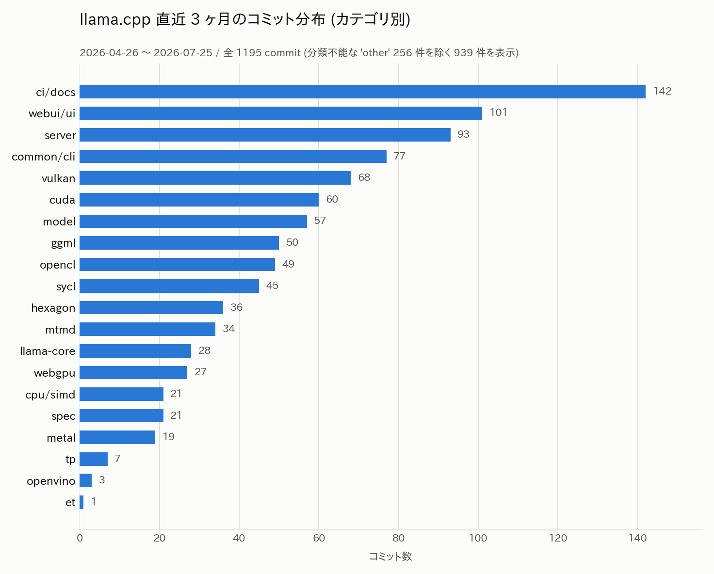

# llama.cpp 直近 3 ヶ月の新機能 — 統合 CLI・投機デコード拡充・server のエージェント化

- **実施日時**: 2026年7月26日 06:30 〜 07:50 JST (ローカル git 履歴 1195 commit の分類・差分精読、gh CLI による PR/Issue 補足参照、影響評価、作図、レポート作成)
- **報告日時**: 2026年7月26日 07:50 JST
- **作成者**: Claude Opus 5 (1M context)

## 概要

llama.cpp 上流でこの 3 ヶ月に何が追加されたのかを、体系的に把握できていなかった。本プロジェクトは GPU サーバ 2 台で llama-server を常用しており、上流の変化は起動パラメータ・性能・不具合調査のすべてに直結する。とくに直近では、片方のサーバで既定バックエンドを切り替えたばかりで、上流側の事情を踏まえた判断材料が欲しい状況だった。そこで、ローカルに置いてあるコードリーディング用のソースツリーの履歴を全件分類し、重要なものは変更内容そのものと GitHub 側の議論まで当たって整理した。

期間中の開発量は非常に多く、平均すると 1 日あたり十数件の変更が入り続けている。分野別に見ると、最も活発だったのは Web UI とサーバ本体で、次いで CLI/共通処理、そして各種 GPU バックエンドが続く。つまりこの 3 ヶ月の llama.cpp は「推論エンジンの高速化」よりも「製品としての使い勝手」に重心が移っていた、というのが全体像である。

その象徴が、複数あった実行ファイルを 1 つに束ねる統合コマンドの導入である。サーバ・対話クライアント・ベンチマーク・量子化・モデルのダウンロード・自己アップデートまでが 1 つのコマンドのサブコマンドとして扱えるようになった。まだ既定ではビルドされないが、上流が向かっている方向ははっきりしている。あわせてサーバ側には、外部からモデルを管理する仕組みや、ファイル読み書き・シェル実行といった組み込みツールを備えた「エージェントとして動くモード」が入った。UI 側も MCP サーバ連携や思考モードの制御などが加わり、単なる動作確認用ページではなくなっている。

推論そのものに関わる目玉は投機的デコードの大幅な拡充である。業界標準になりつつある手法が 2 つ新規に取り込まれ、既存の手法も含めて複数を同時に指定できるようになった。上流の主張どおりの効果が出るなら生成速度に対する影響は大きく、本プロジェクトでも試す価値がある。ただし手法によっては特定の環境で逆に遅くなるという未解決の報告も上がっており、実測なしに本番投入すべきではない。

モデル対応も広く、大規模な新アーキテクチャから小型の埋め込みモデル、音声・映像を含むマルチモーダルまで多数が追加された。これに伴い、特定アーキテクチャ専用の新しい演算が推論エンジンの中核に入り、新しい量子化形式の対応も各バックエンドへ横展開された。バックエンド自体も 1 つ新規に加わっている。

非互換な変更は、事前の想定より穏当だった。多数の起動オプションが体系的な名前に改名されたが、そのほとんどは旧名が別名として残されており、完全に消えたのはごく少数である。一方、環境変数は接頭辞の統一によって一斉に改名されており、こちらは旧名が残っていない。さらに、複数 GPU の分割方式のうち古い 1 つが特定バックエンドで実質的に使えなくなっており、これは実害の報告も出ている。幸い本プロジェクトの起動スクリプトはいずれの地雷も踏んでいないことを確認できた。

自環境への影響という観点では、片方のサーバで採用しているバックエンドについて、期間中にそのハードウェア世代を名指しした最適化が複数入っていた点が最大の収穫である。こちらのビルドは上流に追従する設定なので、再ビルドするだけで取り込める。もう一方の、ビルドが通らないため古い時点に固定してあるバックエンドについては、期間中に同じハードウェア世代を明示的に扱う変更が上流に入っており、固定を解除できないか再確認する価値が出てきた。

なお本調査は静的なコード・履歴の読み取りに限定しており、性能の実測は行っていない。作業時点で GPU サーバ 2 台はいずれもネットワーク的に到達不能だったため、サーバ側の状態は過去レポートおよびスクリプトの記載を出典として引用している。次に何を実測すべきかは残課題としてまとめた。

## 添付ファイル

- [実装プラン](attachment/2026-07-26_073228_llama_cpp_3month_feature_survey/plan.md)
- [カテゴリ別コミット数 CSV](attachment/2026-07-26_073228_llama_cpp_3month_feature_survey/commit_categories.csv)
- [対象期間の全コミットログ (1195 件)](attachment/2026-07-26_073228_llama_cpp_3month_feature_survey/commits_2026-04-26_2026-07-25.txt)
- [作図スクリプト](attachment/2026-07-26_073228_llama_cpp_3month_feature_survey/make_png.py)

## 核心発見サマリ



**結論**: 対象期間 (2026-04-26 〜 2026-07-25、`b760272f1` → `c812c543f`、タグ `b8934` → `b10121`) の **1195 commit** を分類した結果、開発の重心は **Web UI (101) + server (93) + common/cli (77) = 271 件**の「製品化」側にあり、全バックエンド合計 (vulkan 68 / cuda 60 / opencl 49 / sycl 45 / hexagon 36 / webgpu 27 / metal 19 / openvino 3 / et 1 = 308) と拮抗する。機能面の目玉は 4 つ — (1) **`llama` 統合実行ファイル** (#23296、13 サブコマンド、`-DLLAMA_BUILD_APP=ON` で既定 OFF)、(2) **投機的デコードに EAGLE3 (#18039) と DFlash (#22105) を追加**し `--spec-type` が**カンマ区切り複数指定**に対応、(3) **server の組み込みツール 7 種 + `--agent` (#24801)** によるエージェント化、(4) **DeepSeek V4 (#24162)** と専用演算 `GGML_OP_LIGHTNING_INDEXER` (#24231)。新規バックエンドディレクトリは **ET (#24179) の 1 つのみ**（zendnn / virtgpu は期間前から存在）。

**破壊的変更は限定的**: `common/arg.cpp` の集合差分で、期間中に **新規 76 引数・完全消滅は 6 個のみ** (`-cd`/`--ctx-size-draft`、`-cpent`/`--checkpoint-every-n-tokens`、`--license`、`--spec-replace`)。spec 系の大規模改名 (#22964 ほか) は**すべて旧名をエイリアス保持**。一方 **環境変数は #23778 で `LLAMA_ARG_` 接頭辞に一斉統一され旧名は消滅**（`LLAMA_LOG_*` → `LLAMA_ARG_LOG_*` 等 21 個）。最も実害が大きいのは **#24216 (b9890) で CUDA が split buffer の export を廃止**した件で、`-sm row` は CUDA/HIP で**実行時エラー**になる（HEAD で `ggml_backend_split_buffer_type` を export するのは SYCL のみ）。実害報告 Issue #25884 あり。

**自環境への直撃 2 件**: (a) **#22933 (b9814) と #24362 (b9932) が gfx900 世代 (AMD GCN) の Vulkan 経路を名指しで最適化**しており、mi25 の Vulkan ビルドは master 追従 (pin なし) のため**再ビルドのみで取り込める**。2026-07-20 実測時の HEAD は `ded1561b4` = `b9813~1` で、**#22933 (b9814) の 1 タグ手前**だったため未反映だった。(b) **#24588 (b9846~1) が `gfx900` を明示条件に HIP の dense prefill を MMQ → hipBLAS へ切替**（MoE は MMQ 継続）。mi25 の ROCm ビルドは `0fac87b15` = **b8533 (2026-03-26)** に pin されており対象期間より前、つまり**期間中の HIP 改善は 1 件も入っていない**。

## 前提・目的

- **背景**: [2026-07-20 mi25 prompt eval 退行レポート](./2026-07-20_013500_mi25_prompt_eval_regression.md) で mi25 の既定バックエンドを ROCm → Vulkan に反転したが、上流 llama.cpp 側で何が起きているかを体系的に把握していなかった
- **目的**: 直近 3 ヶ月に追加された機能・主要な性能改善・破壊的変更を棚卸しし、自環境 (mi25 / t120h-p100) への影響と次に実測すべき候補を洗い出す
- **対象範囲** (ユーザ確定): 機能追加 ＋ 主要な性能改善・破壊的変更。純粋なバグ修正・CI・リファクタは除外
- **情報源** (ユーザ確定): ローカル git 履歴を一次情報とし、`gh` CLI で GitHub の PR 本文・Issue を補足参照
- **除外**: GPU サーバでの実測（本レポートは静的調査）、`src/llama.cpp` の更新（HEAD が既に期間を満たすため `git pull` は実施せず）

## 環境情報

| 項目 | 値 |
|---|---|
| 対象クローン | `/home/ubuntu/projects/llm-server-ops/src/llama.cpp`（コードリーディング用、`.gitignore` 対象） |
| 対象期間 | 2026-04-26 〜 2026-07-25 (実コミット日ベース) |
| 期間開始直前のコミット | `b760272f1a25fcae065d827ce2cbcaa035597b02` (2026-04-25, tag `b8934`) |
| HEAD | `c812c543f8ab480661bd10b9546515b608b4747f` (2026-07-25 21:15 +0200), `git describe` = `b10121-7-gc812c543f` |
| コミット数 | 1195 |
| gh CLI | 2.83.2、`miminashi` アカウントで認証済み、`ggml-org/llama.cpp` へ read アクセス可 |

**サーバ側の状態について**: 本調査の実施時刻において mi25 (10.1.4.13) は `No route to host`、t120h-p100 (10.1.4.14) は SSH タイムアウトで、いずれも到達不能だった。したがって以下のサーバ側 pin 情報は**実機確認ではなく、リポジトリ内スクリプトおよび過去レポートの記載を出典として引用**している。

| サーバ / バックエンド | 追従方針 | 出典 |
|---|---|---|
| mi25 / Vulkan (RADV) — 既定 | **master 追従 (pin なし)**、`build-vulkan/` にビルド | `.claude/skills/llama-server/server-scripts/update_and_build-mi25.sh:87-90`、`SKILL.md:308` |
| mi25 / ROCm (HIP) — fallback | **`PINNED_COMMIT=0fac87b15`** に固定 = tag `b8533` (2026-03-26)。master は `__hip_fp8_e4m3` を gfx900 で参照しビルド不能 | 同スクリプト `:26-35, :79-82`、`SKILL.md:309` |
| t120h-p100 / CUDA | master 追従 | `update_and_build-t120h-p100.sh`（pin 記述なし） |
| mi25 Vulkan の 2026-07-20 実測時 HEAD | `ded1561b4` = `b9813~1` (2026-06-26) | [2026-07-20 レポート](./2026-07-20_013500_mi25_prompt_eval_regression.md) |

## 再現方法

```bash
cd src/llama.cpp
BASE=b760272f1a25fcae065d827ce2cbcaa035597b02   # 2026-04-25, tag b8934

# 1. 期間内コミットの全件抽出
git log --since=2026-04-26 --until=2026-07-27 --format='%ad|%s' --date=short

# 2. CLI 引数の増減を集合差分で確定（破壊的変更の一次情報）
git show $BASE:common/arg.cpp | grep -oE '"(-{1,2}[A-Za-z0-9][A-Za-z0-9_-]*)"' | tr -d '"' | sort -u > /tmp/args_base.txt
git show HEAD:common/arg.cpp  | grep -oE '"(-{1,2}[A-Za-z0-9][A-Za-z0-9_-]*)"' | tr -d '"' | sort -u > /tmp/args_head.txt
comm -23 /tmp/args_base.txt /tmp/args_head.txt   # 消滅した引数
comm -13 /tmp/args_base.txt /tmp/args_head.txt   # 新規引数

# 3. 環境変数の増減（同じ手順で LLAMA_[A-Z_0-9]+ を抽出）

# 4. 新規バックエンドディレクトリの検出
git ls-tree --name-only $BASE ggml/src/ | grep 'ggml-'
ls ggml/src/ | grep '^ggml-'

# 5. 特定コミットのリリースタグ照合
git describe --tags --abbrev=0 --contains <commit>

# 6. GitHub 補足参照
gh pr view <番号> --repo ggml-org/llama.cpp --json number,title,author,mergedAt,labels,additions,deletions,body
gh pr list --repo ggml-org/llama.cpp --state merged \
  --search 'merged:2026-04-26..2026-07-26 label:"breaking change"' --limit 100 \
  --json number,title,mergedAt -q '.[] | "\(.mergedAt[0:10]) #\(.number) \(.title)"'
gh issue list --repo ggml-org/llama.cpp --state open --search '<keyword> in:title,body' --limit 10
```

作図は [make_png.py](attachment/2026-07-26_073228_llama_cpp_3month_feature_survey/make_png.py) を `python3` で実行。

## 結果詳細

### 1. `llama` 統合実行ファイル — 最大の UX 変更

`llama-server` / `llama-cli` / `llama-bench` … と乱立していた実行ファイルを、単一の `llama` コマンドのサブコマンドに統合する試みが始まった (#23296, 2026-05-20, @angt)。PR 本文の表現は「まだ既定ではビルドしない、議論の出発点」であり、`-DLLAMA_BUILD_APP=ON` を明示した場合のみビルドされる。

HEAD 時点の `app/llama.cpp` が定義するサブコマンドは 13 個:

| サブコマンド | 別名 | 内容 |
|---|---|---|
| `serve` | `server` | HTTP API サーバ |
| `cli` | `client` | 対話 CLI |
| `update` | — | 自己アップデート (#23865)。`LLAMA_INSTALL_BUILD` でビルドしたときのみ表示 (#24754) |
| `download` | `get` | モデルのダウンロード (#24982) |
| `completion` | `complete` | テキスト補完 |
| `bench` / `batched-bench` | — | ベンチマーク (#23459) |
| `fit-params` | — | デバイスメモリに収めるパラメータ算出 (#23459) |
| `quantize` / `perplexity` | — | 量子化 / PPL 計測 (#23459) |
| `version` / `licenses` / `help` | `credits` | メタ情報 (#25054, #23426, #23805) |

`llama download` には投機デコード用の**サイドカーを同時取得するフラグ** `--mtp` / `--eagle3` / `--dflash` が付いた（`arg.cpp` 上は `LLAMA_EXAMPLE_DOWNLOAD` 限定であり、推論時のフラグではない点に注意）。

関連して `llama-cli` が HTTP ベース実装に置き換えられ (#24948, 2026-07-08)、内部でサーバに接続する構成になった。接続先を指定する `--server-base` と、結果をファイルに書き出す `--output` (#25484) が追加されている。

また評価用ツール `llama-eval` が新設された (#21152)。`examples/llama-eval/llama-eval.py` は複数の llama-server エンドポイントに並列で投げて gsm8k / aime2025 等のデータセットを採点する Python スクリプトで、`--server` にカンマ区切りで複数サーバを渡せる。

### 2. 投機的デコード (speculative decoding) の大幅拡充

推論性能に直接効く変更としては、この分野が期間中で最大。

**EAGLE3** (#18039, 2026-06-12, +1161/-39): NVIDIA と ggml チームの共同作業として取り込まれた。target モデルの中間層特徴を抽出し、feature fusion 層で圧縮して単層デコーダで draft を生成、`d2t` テンソルで draft 語彙を target 語彙に写像する方式。PR は 2〜3 倍の高速化を主張している（Gemma4 の EAGLE3 モデルで、reasoning 有効時 2 倍超・無効時 3 倍超、`Q4_K_M` でも良好、とのコメント記載）。`LLM_ARCH_EAGLE3` として新アーキテクチャが追加され、`convert_hf_to_gguf.py` も対応。以降 qwen3.5/3.6 (#24593)、Minimax2、backend sampling (#24655) と対応が広がった。

**DFlash** (#22105, 2026-06-28, +712/-9): 同じ作者による第 2 弾。EAGLE3 が自己回帰的に 1 トークンずつ draft するのに対し、DFlash は **1 回の draft forward で候補ブロック全体を生成**する。draft 側に複数の transformer 層を使う点が EAGLE3 との差。PR は Qwen3 で最大 8 倍を主張。使い方は target と draft の 2 つの GGUF を用意し、`--spec-type draft-dflash --spec-draft-n-max 15 --temp 0 --top-k 1` で起動する。その後 `spec-draft-p-min` 対応 (#25246)、K/V cache の回転 (#25823) が入っている。

**MTP (Multi-Token Prediction)**: Step3.5/3.7 の flash mtp3 (#24340)、Hy3 (`hy_v3`) の MTP 投機デコード (#25395)、NVFP4 の MTP スケールテンソル (#23563) が追加。MTP のクリーンアップ (#23269) と、server 側で sleep 時に draft/MTP のリソースを解放して VRAM リークを直す修正 (#23461) も入った。

**フレームワーク側の変更**:
- `--spec-type` が**カンマ区切りの複数指定**を受け付けるようになった（`common/arg.cpp:4005-4013`、内部で `types` ベクタに `insert`）。現在の有効値は `none` / `draft-simple` / `draft-eagle3` / `draft-mtp` / `draft-dflash` / `ngram-simple` / `ngram-map-k` / `ngram-map-k4v` / `ngram-mod` / `ngram-cache` の 10 種 (`common/speculative.cpp:32-41`)
- 並列 drafting (#22838)
- 投機メトリクスの追加 — 平均 acceptance length と**位置別 acceptance rate** (#24536)
- 投機デコード専用のベンチ `server-bench speed-bench` (#23869)
- 引数の全面改名 (#22964, #22397) — 詳細は「破壊的変更・非互換」節

### 3. llama-server の router 化とエージェント化

**router モード** (複数モデルを子プロセスとして起動し前段でルーティングする構成) が実用段階に入った:

- モデル管理 API (#23976)、`/models/sse` によるロード進捗のリアルタイム配信 (#24828)、`/models?reload=1` (#21848)
- モデルのダウンロードを専用プロセスに分離 (#24834)、`-hf` preset repo の刷新 (#24739)
- router → 子プロセスへの引数転送修正 (#24760)、子モデル情報の `/v1/models` 露出 (#22683)
- router モードでデバイス列挙をスキップして CUDA primary context の生成を回避 (#23137)

**組み込みツール / エージェント**: `--tools` で有効化する組み込みツールが 7 種そろった (`common/arg.cpp:3255-3263`) — `read_file` / `file_glob_search` / `grep_search` / `exec_shell_command` / `write_file` / `edit_file` / `get_datetime`。ヘルプに「experimental: 信頼できない環境で有効化するな」「セキュリティ上、既定で `--cors-origins` を localhost に制限する」と明記されている。

これらと CORS プロキシをまとめて有効にするショートカットが `-ag` / `--agent` (#24801, @ngxson)。`get_datetime` は後に書式引数を得 (#26117)、`exec_shell_command` はストリーミング対応した (#25526)。ツール群は #25498 で整理され `apply_diff` が削除されている。

**API / ストリーミング周辺**:
- `/responses` API に timings と progress を追加 (#25348)、tool call レスポンスへの id 付与 (#24882)
- **SSE Replay Buffer** (#23226) — 切断後の再接続でイベントを再送可能に。追随修正 (#25047)
- SSE の ping 間隔設定 `--sse-ping-interval` (#24013)、無音ストリームを 1 秒ごとに ping し 3 秒で初めて切る調整 (#25241)、`X-Accel-Buffering: no` ヘッダ (#24774)
- HTTP ETag 対応 (#23701)、weak ETag の処理 (#23916)
- Vertex AI 互換 API (#22545)、vLLM 互換の `continue_final_message` (#23012)
- `--cors-origins` / `--cors-methods` / `--cors-headers` / `--cors-credentials` (#25655)
- reasoning のリアルタイム割込み用 control endpoint (#23971)、リクエスト単位の `reasoning_budget_tokens` (#23116)、OAI API の `"reasoning_effort": "none"` (#26045)
- prompt cache の RAM 上限強制 (#25070、フラグは `-cram` / `--cache-ram`)、checkpoint をユーザメッセージごとに作成 (#24176)、min-step 以内の checkpoint を間引き (#25472)
- 直近 5 秒の生成速度表示 (#24291)、`/slots` へのプロンプトトークン数露出 (#23454)、リクエストスキーマの定義と検証 (#24150)
- プロンプトをディレクトリにログ出力 `--log-prompts-dir` (#22031)

### 4. WebUI (`tools/ui`) の刷新

期間中に新規追加されたファイル数が最多 (232 ファイル) の領域。

- **リポジトリ再構成**: `tools/webui` → `tools/ui`、命名も `webui`/`WEBUI` → `ui`/`UI`/`llama-ui`/`LLAMA_UI` に統一 (#23064)。server 内部の "webui" 表記も削除 (#24817)
- **MCP サーバ対応**: 初回訪問時の opt-in (#25239)、推奨サーバ一覧の削除と設定 UI/UX 改善 (#25535)、ツール一覧での表示名衝突の修正 (#26011)
- **推論制御**: Thinking モードのトグルと reasoning effort レベル (#23434)、reasoning セレクタの "Default" 選択肢 (#25846)、モバイル用の reasoning effort コントロール (#25539)
- **コンテキスト可視化**: context usage ゲージとパネル (#25340)
- **その他**: 新ロゴとナビゲーション整理・モバイル UX 改善 (#24897)、会話の一括操作と設定ロジック改善 (#25815)、JS サンドボックスへの記号数学 (nerdamer) 追加 (#25948)、`--ui-config-file` で表示・挙動設定を同期する sync blocks (#25132)、エイリアスによるモデル事前選択 (#25492)、タッチ操作対応のモデル選択 UI (#24604)、Agentic Content の UX 改善 (#25450)

### 5. 新規モデルアーキテクチャ対応

**DeepSeek V4** (#24162, 2026-06-29, +4698/-40, @am17an) が最大。PR 本文によれば新規性は圧縮アテンションの 2 系統にある:

- **CSA (Compressed Sparse Attention)**: DeepSeek V3.2 の DSA の変種。lightning indexer で top-k トークンを選ぶ点は同じだが、対象が「4 トークンを 1 つに圧縮した」圧縮トークン。直近 8 トークンのウィンドウを維持し、4 トークン境界ごとに圧縮する
- **HCA (Heavily Compressed Attention)**: 128 トークン単位の大きな圧縮トークンに対する通常アテンション + SWA

実装は「圧縮プラン (`comp_plan`)」をコンテキストが生成し GPU で実行する形。各層は SWA キャッシュも持ち、`llama_kv_cache_iswa` でラップされる。関連して融合 hyper-connection 演算 (#25585)、dsv4 向け topk-moe の `sqrt_softplus` (#25896)、288 エキスパートでの topk-moe fusion 有効化 (#25267) が入った。

その他の新規・拡張:

| 分類 | モデル | PR |
|---|---|---|
| 大規模 LLM | DeepSeek V3.2 / 汎用 DSA 実装 | #23346 |
| | GLM-DSA の indexer テンソルを optional 化 | #24770 |
| | GLM 5.2 Indexer | #25407 |
| | Hy3 (`hy_v3`) + MTP 投機デコード | #25395 (split MTP export は #25641) |
| | EXAONE 4.5 | #21733 |
| | Mellum | #23966 |
| | sarvam_moe | #20275 |
| | Mimo v2.5 | #22493 |
| | Laguna XS.2 / M.1 | #25165 |
| | talkie-1930-13b | #22596 |
| マルチモーダル | Granite4 Vision | #23545 |
| | Granite Speech Plus | #24818 |
| | Nemotron Nano 3 Omni | #22481 |
| | sarashina2.2-vision-3b | #22103 |
| | qwen-vl 系の "frame merge" | #21858 |
| | internvl のバッチ処理 | #24775 |
| 埋め込み | LFM2.5-ColBERT-350M / LFM2.5-Embedding-350M | #24913 |
| | granite multilingual embeddings R2 | #22716 |

mtmd (マルチモーダル) 側では `--video` 引数の追加、`--mtmd-batch-max-tokens`、ロード進捗コールバック (#24865)、mtmd-cli のバッチ処理と動画テスト (#24778)、バリデーション強化 (#25013) が入った。

### 6. 新しい ggml 演算と量子化形式

**新規演算**:
- **`GGML_OP_LIGHTNING_INDEXER`** (#24231) — DeepSeek V3.2 / V4 の lightning indexer を実装する専用演算。CUDA 実装は汎用ベクタカーネル + wmma カーネルの 2 種 (#25545)
- `col2im_1d` — Metal (#25176) / CUDA (#24417) / Vulkan (#24425)
- `CONV_2D_DW` (depthwise conv2d) — Metal (#21565) / WebGPU (#25847)
- f16 の `out_prod` を CPU に追加し Vulkan にも `out_prod` 演算を追加 (#23997)
- f16 → f16 の `GGML_OP_SET_ROWS` — CPU (#25344) / CUDA (#25367) / Metal (#25434) / Vulkan (#25432)。未実装バックエンドでの失敗を避けるための型チェックも追加 (#25351)
- 内側次元の連続性を判定する関数群 (#25650)、GGUF のテンソル形状アクセサ (#24405)

**量子化**:
- **NVFP4** が期間を通じて横展開された — LM head の NVFP4 量子化対応 (#23046)、CPU の AVX2 dot と UE4M3 LUT (#23961)、WebGPU (#25143)、Vulkan のネイティブ e2m1/e4m3 変換 (#25338)、CUDA の MMVQ post-scale 融合 (#24481)、Mistral3 の NVFP4 weight scale (#23629)、Gemma4_26B_A4B_NVFP4 (#22804)、変換時の Q/K RoPE permutation (#22611)
- **Q2_0** が新設され Metal (#25419) と Vulkan (#25430) が対応
- OpenCL に q1_0 の初期対応 (#25160)

### 7. バックエンドの新規追加と強化

**新規バックエンドは ET のみ**。`ggml/src/` 配下のバックエンドディレクトリを期間の前後で比較すると、増えたのは `ggml-et` の 1 つだけだった（`ggml-zendnn` / `ggml-virtgpu` は期間前から存在し、期間中は改善コミットのみ）。

- **ET** (#24179, 2026-07-10, +40128/-109, @marty1885): AINekko / AIFoundry が開発した、オープンソース RISC-V manycore アクセラレータ **ET-SOC-1** 向けバックエンド。元は Esperanto Technologies の製品で、後に Apache 2.0 でオープンソース化されたもの。PR 本文は「絶対性能は CPU にも及ばないが、開発機の ARM R7 7700 より電力性能比は良い」と率直に述べている。`docs/backend/ET.md` と `docs/ops/ET.csv` が新設された。制約: 対応量子化は `q8_0` / `q4_0`（`fp16` / `q4_K` は部分対応）、同時に 1 インスタンスのみ、MoE は限定的

既存バックエンドの主な強化:

| バックエンド | 内容 |
|---|---|
| **Hexagon** (Qualcomm, 36 commit) | HMX flash attention (#22347)、MUL_MAT / MUL_MAT_ID の 32x32 タイル weight repack + キャッシュグラフ (#24954)、L2 の dirty-bit 追跡と遅延フラッシュ (#25762)、HVX/HMX/DMA イベントの細粒度トレース `op-trace` (#24592)、VISION RoPE (#25216)、flash attention の作り直し (#25085)、新 vtcm レイアウト (#25425) |
| **OpenCL** (49) | Adreno 向け int8 dp4 の dense と MoE prefill 最適化 (#25537)、ライブラリからのプリコンパイル済みバイナリカーネル読み込み (#23042)、flash attention 改善 (#25069)、`ABS` 演算 (#25115) |
| **SYCL** (45) | oneDNN の XMX エンジンによる Flash Attention (#25222)、融合 top-k MoE (#25217)、DMMV reorder 経路への Q2_K 追加 (#25064) |
| **WebGPU** (27) | NVFP4 対応 (#25143)、`CONV_2D_DW` (#25847)、Vulkan/NVIDIA 上での F16 アダプタトグル |
| **OpenVINO** (3) | OV 2026.2 / 2026.2.1 への更新、context-shift、Q5_1、gemma4 dense/embedding、`-fa off` (#24503, #24974)、`GGML_BACKEND_DL` 対応 (#25795)、Windows リリースの check-release 追加 (#25022) |
| **KleidiAI** (ARM) | SME2 f32 カーネル (#24414)、SME と SME2 のディスパッチ分離 (#25478) |

### 8. Tensor Parallel (`--split-mode tensor`) の成熟

**注意: `-sm tensor` 自体は期間開始時点で既に存在していた**（期間開始直前の `common/arg.cpp` に `{none,layer,row,tensor}` と EXPERIMENTAL の記述あり）。期間中に起きたのは「文書化」と「修正の積み上げ」である。

- **`docs/multi-gpu.md` が期間中に新規追加**され、split mode の使い分けが正式に文書化された。この中で `row` は **Deprecated** と明記され、「`tensor` が使えるなら普遍的に優れているので置き換えよ、新規デプロイでは避けよ」とされている
- 文書が挙げる `tensor` の制約: `-fa` が必須、`--fit` 非対応（`--ctx-size` の手動指定が必要）、「複数 NVIDIA GPU + CUDA では性能が良いはずだが、それ以外は保証しない」
- 期間中の TP 修正 7 件: 量子化 KV cache 対応 (#23792)、granularity の 128 丸め (#24180)、Qwen 3.5/3.6 + 3 GPU の granularity 修正 (#23843)、サイズ 0 スライスの修正 (#23525, #22489)、ggml コンテキストサイズ計算の修正 (#22616)、Phi3 / Bert / Plamo2,3 / ChatGLM 対応 (#25536)
- #23792 (@JohannesGaessler) は「KV cache 回転のためのテンソル平坦化で形状情報が失われ meta backend が扱えない」問題を、`ggml_backend_meta_split_state` にセグメントの繰り返し回数を持たせることで解決したもの。llama.cpp 側の計算グラフには変更なし
- 対応アーキテクチャは `llm_arch_supports_sm_tensor()` (`src/llama-arch.cpp:979`) の**ブロックリスト方式**（既定 true、非対応のみ列挙）。非対応は GROK / MPT / PLAMO2 / MINICPM3 / GEMMA3N / MAMBA / MAMBA2 / JAMBA / FALCON_H1 / OLMO2 / OLMOE / DEEPSEEK2 / DEEPSEEK32 / DEEPSEEK4 / GLM_DSA / BITNET / T5 / NEMOTRON_H / NEMOTRON_H_MOE / GRANITE_HYBRID / LFM2 / LFM2MOE / MINIMAX_M2 / MISTRAL4 / KIMI_LINEAR の 25 種

**ただし現時点で TP は壊れている報告がある**: Issue **#25829** (2026-07-17, OPEN)「split-mode = tensor is broken since b10054」。CUDA / RTX 3090 / Qwen3.6-27B で `GGML_ASSERT(ret.axis != GGML_BACKEND_SPLIT_AXIS_UNKNOWN) failed` (`ggml-backend-meta.cpp:535`) が発生。他にも SYCL でのプロンプト処理ハング (#25711)、CUDA+ROCm 混在構成での破損 (#25594)、GLM-4.5 Air MoE の nextn draft head でのクラッシュ (#24309) が open。

### 9. Vulkan バックエンドの性能改善（mi25 直結）

期間中の Vulkan コミットは 68 件。**gfx900 / AMD GCN を名指しした変更が 3 件**あり、mi25 に直接関係する。

| PR | tag | 内容 | mi25 (gfx900 = GCN 5.0, 64 CU) への影響 |
|---|---|---|---|
| **#22933** | **b9814** | `mul_mat_vecq` の最適化。**マージされた差分では AMD_GCN の subgroup 除外そのものを削除**（`use_subgroups = device->subgroup_arithmetic && device->architecture != AMD_GCN` → `= device->subgroup_arithmetic`）。加えて Q4_0 の `ds` キャッシュを f16vec2 化しループ構造を再編 | **該当。** GCN 全体で subgroup 演算が有効化される。PR 実測は MI50 32G で tg128 が qwen35 9B Q4_0 で 52.24 → 62.13 t/s (1.18x)、qwen35moe 35B.A3B Q4_0 で 61.38 → 71.30 t/s (1.16x)。MI25 は同じ GCN 5.x 世代なので効く可能性が高いが**未実測**。なお Q4_0 特化の shader 変更は本番の Q4_K 系には直接効かない |
| **#24362** | **b9932** | Flash Attention の `mask_opt` を GCN で無効化。条件は `architecture != AMD_GCN \|\| HSK > 256 \|\| HSV > 256` | **該当。** Qwen3 系の head size は 128 なので条件を満たし、mi25 では mask_opt が無効化される（= PR の狙いどおり高速化側） |
| **#25240** | **b9929** | 弱い AMD GPU で driver timeout を避けるため submission の flops 上限を CU 数ベースに下げる。条件は `AMD_GCN && shader_core_count < 32` | **非該当。** MI25 は 64 CU のため閾値に入らず、従来どおり 200 GFLOP 上限 |

**この 3 件はいずれも 2026-07-20 の mi25 Vulkan 実測時点 (`ded1561b4` = `b9813~1`) より後**。とくに #22933 は **b9814** で、実測時 HEAD のわずか 1 タグ先だった。mi25 の Vulkan ビルドは pin なしの master 追従なので、**再ビルドするだけで #22933 と #24362 が入る**。

その他の主な Vulkan 改善（GCN 特定ではないが効く可能性のあるもの）:
- Flash Attention: BFloat16 KV cache 対応 (#23420)、非対称 FA を coopmat2 (#21753) と scalar/mmq/coopmat1 (#22589) の全経路で対応、softmax 前に bias を適用してオーバーフローを回避 (#24909)
- 行列積: `v_dot2_f32_f16` を matmul と FA で利用 (#24123)、Q3_K/Q6_K のブロックデータを 32bit int でロード (#23056)、Q4_K/Q5_K の scale ロードの coalesce (#21751)、`mul_mm` の ALIGNED を spec constant 化 (#24689)
- スケジューリング: 重みテンソルサイズでなく flops で submission を判断 (#25005)、グラフ submission バッチを減らして device timeout を回避 (#24872)
- 並行性: パイプラインコンパイル中にデバイス mutex を保持しない (#23641)、host memory lock の競合削減 (#23376)、`vk_queue` を per-instance mutex と一意ハンドルに整理 (#23570)
- 新規演算: `CONV_3D` (#24612)、`GET_ROWS_BACK` (#24883)、`col2im_1d` (#24425)、非連続 unary/glu (#24215)、`gated_delta_net` の S_v=16 (#24581)

### 10. CUDA / HIP（P100 直結）

- `-sm row` の削除と cuBLAS のリファクタ (#24216) — 破壊的変更。次節に詳述
- topk-moe fusion を 288 エキスパートで有効化 (#25267)、GET_ROWS の量子化型対応 (#25962)、`cudaMemcpy2DAsync` の高速経路 (#25057)、量子化 concat の連続性要件の緩和 (#25678)
- MMQ カーネル設定のリファクタ (#24127)、`mul_mat_vec_q_moe` の PDL 登録 (#24087)、Turing 向け MMVQ パラメータ表 (#23729)
- PDL (Programmatic Dependent Launch) 周りの安定化が多数 — CTK 12.3 以上への制限 (#23742)、host 側での PTX バージョン確認 (#23530)、`__restrict__` の無効化による race 回避 (#24030)、DGX Spark でのバグ修正 (#23825)
- Flash Attention MMA カーネルの KQ mask offset 整数オーバーフロー修正 (#23610)、K 型検証を V 型にも拡張 (#24403)
- Turing の P2P アクセス修正 (#24491)
- HIP 側: **gfx900 の dense prefill を hipBLAS に切替** (#24588、次節参照)、RDNA3 の mma FA (#22880)、RDNA3 の Q4_K / Q6_K MMVQ nwarps チューニング (#23528, #23349)、AMD MFMA ハードで batch>=4 の量子化 matmul を MMQ に回す (#23227)、gfx1152/gfx1153 を RDNA3.5 に追加 (#24129)

**P100 (sm_60) への注記**: 上記のうち PDL 系・Turing 系・RDNA3 系は P100 に該当しない。P100 に効きうるのは汎用の MMQ リファクタ (#24127) と `GET_ROWS` 量子化対応 (#25962) 程度で、期間中に P100 世代を名指しした最適化は見つからなかった。

### 破壊的変更・非互換

`common/arg.cpp` の期間差分を集合として比較した結果が一次情報。**新規 76 引数に対し、完全に消滅したのは 6 個のみ**だった。

**(a) 完全に消滅した CLI 引数（エイリアスなし）**

| 消滅した引数 | 代替 |
|---|---|
| `-cd` / `--ctx-size-draft` | 明示的な後継なし（`--spec-draft-*` 系に該当引数が見当たらない） |
| `-cpent` / `--checkpoint-every-n-tokens` | `-cms` / `--checkpoint-min-step` (#25472) |
| `--license` | `llama licenses` サブコマンドへ移動 (#23824) |
| `--spec-replace` | `--spec-type` の再設計に吸収 (#22397) |

**(b) 環境変数の一斉改名 (#23778, 2026-05-27, @ggerganov)** — 期間内で唯一 `breaking change` ラベルが付いた PR。すべての環境変数に `LLAMA_ARG_` 接頭辞を強制したもので、**旧名は残っていない**。消滅 21 個 / 新規 39 個。代表例:

| 旧名 | 新名 |
|---|---|
| `LLAMA_LOG_COLORS` / `LLAMA_LOG_PREFIX` / `LLAMA_LOG_TIMESTAMPS` / `LLAMA_LOG_FILE` / `LLAMA_LOG_VERBOSITY` | `LLAMA_ARG_LOG_*` |
| `LLAMA_OFFLINE` | `LLAMA_ARG_OFFLINE` |
| `LLAMA_CHAT_TEMPLATE_KWARGS` | `LLAMA_ARG_CHAT_TEMPLATE_KWARGS` |
| `LLAMA_ARG_MODEL_DRAFT` / `LLAMA_ARG_HFD_REPO` / `LLAMA_ARG_CTX_SIZE_DRAFT` ほか draft 系 | `LLAMA_ARG_SPEC_DRAFT_*` |
| `LLAMA_ARG_WEBUI*` | `LLAMA_ARG_UI*` |

**(c) `-sm row` が CUDA / HIP で実行時エラーに (#24216, tag b9890, 2026-07-06, @JohannesGaessler)** — 実害としては最大。

- CUDA バックエンドから split buffer type の実装が削除された。HEAD で `ggml_backend_split_buffer_type` を export しているバックエンドは **SYCL のみ**（期間開始時点は CUDA と SYCL の 2 つ）
- `src/llama-model.cpp:948-973` の `make_gpu_buft_list()` は、`LLAMA_SPLIT_MODE_ROW` 指定時に該当 proc address が取れないと `runtime_error("device %s does not support split buffers")` を投げる。つまり **CUDA / HIP で `-sm row` を指定すると起動時に失敗する**
- `-sm row` フラグ自体は `arg.cpp` に残っており、ヘルプも「row: split weight across GPUs by rows (parallelized)」のまま。**ヘルプと実挙動が乖離している**
- 実害報告: Issue **#25884** (2026-07-19, OPEN)「On windows/vulkan, split-mode row no longer works on hybrid AMD/Intel GPU config since commit 74976e1」。`74976e1` はまさに #24216 のコミット

**(d) `--mlock` / `--mmap` / `--direct-io` の deprecate (#20834, 2026-07-23, @taronaeo)** — 相互排他な 3 つのロードモードを `-lm` / `--load-mode` (`none` / `mmap` / `mlock` / `dio`) に一本化。旧フラグは**削除ではなく deprecated** で、新旧を併用すると「最後に指定した方だけが効く」旨の警告 (`common/arg.cpp:796-799`) が出る。

**(e) その他**

- `webui` → `ui` 命名変更 (#23064, #24817)。`--ui-config` / `--ui-config-file` / `--ui-mcp-proxy` / `--ui` が正、**旧 `--webui*` はエイリアスとして残存**
- spec 系引数の全面改名 (#22964, #22397)。`--spec-draft-model` / `--spec-draft-ngl` / `--spec-draft-threads` … と体系化されたが、`-md` / `-ngld` / `-td` などの**旧名はすべてエイリアスとして残っている**
- `llama_set_warmup` の deprecate (#24009)
- Python 側が PEP 621 + uv へ移行 (#21907)
- `sched : reintroduce less synchronizations during split compute` (#20793) が 2026-06-26 に投入 → 06-30 に revert (#25138) → 再投入と往復している。マルチデバイス構成で回帰が出た場合の被疑筆頭

### 自環境への影響マトリクス

判定は静的（コミット日・タグ・アーキ条件・スクリプト内容の照合）であり、**性能値は一切実測していない**。

| 変更 | tag | mi25 / Vulkan (gfx900, master 追従) | mi25 / ROCm (pin b8533) | t120h-p100 / CUDA (sm_60, master 追従) | 運用スクリプト変更 |
|---|---|---|---|---|---|
| #22933 GCN subgroup 有効化 + `mul_mat_vecq` 最適化 | b9814 | **要検証（有望）** — 現ビルドは b9813~1 で未反映。再ビルドで入る | 非該当 (Vulkan) | 非該当 | 不要 |
| #24362 GCN で FA `mask_opt` 無効化 | b9932 | **要検証（有望）** — head size 128 で条件成立 | 非該当 | 非該当 | 不要 |
| #25240 小型 AMD GPU の submission 閾値 | b9929 | **非該当** — 64 CU は閾値 (<32) 外 | 非該当 | 非該当 | 不要 |
| #24588 gfx900 の dense prefill を hipBLAS へ | b9846~1 | 非該当 | **効かない（pin 外）** かつ **MoE には元々非該当**（`return n_experts > 0` で MoE は MMQ 継続）。dense モデルを ROCm で使う場合のみ有効 | 非該当 | pin 解除を検討する場合のみ |
| #24216 `-sm row` 削除 | b9890 | 非該当（Vulkan は元から split buffer 非対応） | **該当（潜在）** — HIP は CUDA と同じソース。ただし pin 外 | **該当** — `-sm row` は起動失敗 | **不要**（`start.sh:391,397` は `--split-mode layer` のみ使用） |
| #23778 環境変数 `LLAMA_ARG_` 統一 | b9360 | 該当 | 該当 | 該当 | **不要**（`start.sh` は `LLAMA_*` 環境変数を llama-server に渡していない。`HF_TOKEN` は別系統） |
| #20834 `--mlock`/`--mmap` deprecate | b10105 | 該当 | pin 外 | 該当 | **不要**（`start.sh` は当該フラグ未使用） |
| spec 引数の改名 (#22964 等) | b9131 | 該当 | pin 外 | 該当 | **不要** — `start.sh:331` は既に新名 `--spec-type draft-mtp --spec-draft-n-max 6` を使用 |
| EAGLE3 / DFlash (#18039 / #22105) | b9606 / b9831 | **要検証** — draft モデルの入手が前提 | pin 外 | **要検証** | draft モデル指定の追加が必要 |
| `--split-mode tensor` の成熟 | — | **見送り推奨** — Issue #25829 で b10054 以降 broken の報告（報告は CUDA だが meta backend 共通コード） | pin 外 | **見送り推奨** — 同上 | 見送るなら不要 |
| `llama` 統合バイナリ | — | 任意 — `-DLLAMA_BUILD_APP=ON` が必要、既定 OFF | 同左 | 同左 | 移行するなら `LLAMA_BIN` 定義 (`start.sh:210,240`) の書き換え |

**結論として、現行の起動スクリプトは期間中の破壊的変更をいずれも踏んでいない。** 一方 mi25 の Vulkan では、gfx900 を名指しした最適化 2 件が「再ビルドするだけ」で取り込める状態にある。

## 副次発見

- **`breaking change` ラベルはほとんど機能していない**。期間内 1195 commit / 相当数のマージ PR に対し、当該ラベルが付いたのは #23778 の 1 件のみ。実際には #24216 (`-sm row` 削除) のように明確に非互換な変更がラベルなしで入っている。**上流の非互換を追う手段としてラベルは使えず、`common/arg.cpp` の集合差分と実装の追跡が必要**。
- **PR 本文とマージされた差分が食い違うことがある**。#22933 は PR 本文で「デバイス名マッチによる allowlist で GCN 5.0/5.1 の一部を有効化」と説明しているが、マージされた差分は `AMD_GCN` の除外条件そのものを削除しており、**allowlist ではなく GCN 全体で有効化**されている。レビュー過程で単純化されたものと見られる。PR 本文だけを読んで判断すると誤る。
- **mi25 の ROCm pin (b8533 = 2026-03-26) は本調査の対象期間より前にある**。つまり ROCm 側は 4 ヶ月分の上流改善をまるごと取り逃している。ただし pin の理由（`__hip_fp8_e4m3` の gfx900 ビルド不能）は HEAD でも該当箇所が 2 つ残っている (`ggml/src/ggml-cuda/common.cuh:844`、`ggml/src/ggml-cuda/vendors/hip.h:249`) ため、単純に解除できるとは限らない。一方で **#24588 が `GGML_CUDA_CC_VEGA` (= gfx900) を明示条件として新規に追加している**ことは、上流に gfx900 + HIP でビルド・実測している人がいる傍証であり、pin 解除の再試行に値する。
- **DFlash は AMD で逆に遅くなる報告がある**。Issue **#25117** (2026-06-29, OPEN)「DFlash performance regression on AMD APU + quantized MoE target: ~2x slower than baseline」。環境は Strix Halo (gfx1151, RDNA 3.5) + ROCm 7.13 + Qwen3.5-122B-A10B の UD-Q4_K_XL。本プロジェクトの mi25 も AMD + 量子化 MoE という同型の構成であり、**DFlash を mi25 で試す際は「速くなる」前提を置かないこと**。他に DFlash + 画像で失敗する #26108 (2026-07-25) も open。
- **リポジトリに AI エージェント用のスキルが入り始めた** (#26042: `add-new-model` と `code-review`)。同時に「エージェントは説明文やコメントを勝手に書くな」という強い注意書きも追加されている (#25480)。PR テンプレートには AI 利用の開示欄があり、実際に #23296 は「GLM 5.1 を cmake 更新に使用」、#25240 は「YES」と開示していた。上流の開発プロセス自体が変化しつつある。
- **`llama-cli` の HTTP 化 (#24948)** により、CLI とサーバの区別が実装レベルで曖昧になった。`--server-base` で外部サーバを指すこともできるため、将来的にローカル検証の手順が変わる可能性がある。

## 残課題

本レポートは静的調査のため、以下はいずれも未実測。優先度順:

1. **mi25 Vulkan の再ビルド + pp/tg 再測定**（最優先・低コスト）。#22933 (b9814) と #24362 (b9932) が入るため、[2026-07-20 の実測値](./2026-07-20_013500_mi25_prompt_eval_regression.md)（pp 1k=541 / 32k=372 / 100k=191 t/s、tg=39.5 t/s）と同一条件で比較すれば効果が直接わかる。同レポートの `bench_prompt.py` がそのまま使える
2. **mi25 ROCm の pin 解除可否の再確認**。`update_and_build-mi25.sh` の `PINNED_COMMIT` を master にして gfx900 ビルドが通るか試す。通れば #24588 を含む 4 ヶ月分が入る（ただし本番の Qwen3.6-35B-A3B は MoE なので #24588 自体は MMQ 継続で効かない見込み）
3. **EAGLE3 / DFlash の実機評価**。draft モデル（サイドカー）の入手が前提。`llama download --eagle3` / `--dflash` で取得できるモデルがあるかの確認から。**DFlash は Issue #25117 の AMD 退行報告があるため mi25 では慎重に**、まず P100 (CUDA) で素性を確認するほうが安全
4. **`--split-mode tensor` の試行は Issue #25829 (b10054 以降 broken) の解決を待つ**。解決後、mi25 4 枚で `-fa on` + `--ctx-size` 手動指定の条件で pipeline parallel (`layer`) と比較する。ただし `docs/multi-gpu.md` は「複数 NVIDIA GPU + CUDA 以外は性能を保証しない」と明記しており、mi25 (Vulkan/AMD) での期待値は高くない
5. **`llama` 統合バイナリへの移行可否の見積り**。`-DLLAMA_BUILD_APP=ON` が必要で既定 OFF のため急ぐ必要はないが、`start.sh` の `LLAMA_BIN` 定義 2 箇所と `update_and_build-*.sh` の cmake オプションを変えるだけで済むか確認しておく
6. **`llama-eval` の導入検討**。複数サーバに並列で投げて gsm8k / aime2025 を採点できるため、mi25 と P100 の品質比較や量子化の影響評価に使える可能性がある

## 参照レポート

- [mi25 prompt eval 退行の切り分けと Vulkan への切替](./2026-07-20_013500_mi25_prompt_eval_regression.md) — 本レポートの直接の背景。ROCm pin と Vulkan master 追従の経緯、2026-07-20 時点の実測ベースライン
- [llama.cpp HEAD 更新後の CUDA OOM 回帰](./2026-06-03_063647_llama_cpp_oom_regression_fix.md) — 上流追従に伴う回帰の先例
- [llama.cpp fine-tune が壊れている経緯の調査](./2026-07-25_200322_llama-cpp-finetune-history.md) — 上流の履歴と GitHub 議論を突き合わせる調査手法の先例。「Issue のクローズ理由が修正とは限らない」という教訓は本レポートのラベル不信とも通じる
