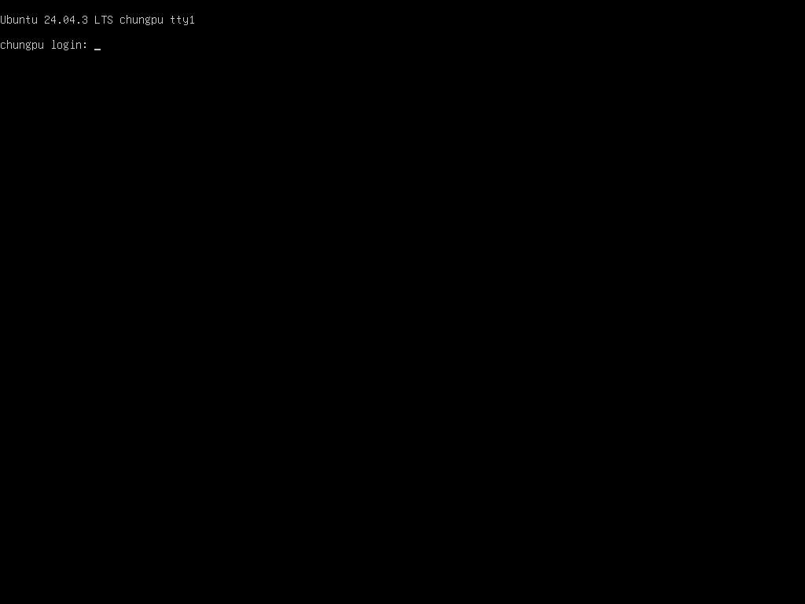

# aws-gpu01/02 を管理対象に追加 — P100 搭載の Supermicro 2 台

- **実施日時**: 2026年8月16日 14:48 〜 15:15 JST (BMC/OS からのハード情報取得、スキル登録、電源ガード実装、疎通確認)
- **報告日時**: 2026年8月16日 15:15 JST
- **作成者**: Claude Opus 5

## 概要

これまでこのリポジトリが管理していた GPU サーバは mi25、t120h-p100、t120h-m10 の 3 台だった。今回、新たに 2 台の GPU サーバが使えるようになったため、既存の運用基盤（排他ロック、BMC 電源制御、KVM スクリーンショット、llama-server 起動）に載せる作業を行った。サーバ名や BMC の情報は複数のスクリプトにハードコードされているため、追加には一定の網羅的な修正が必要になる。

新しい 2 台については、SSH で入れることと BMC の認証情報だけが分かっている状態から始めた。具体的な機種や搭載 GPU は BMC と OS から実測で取得することとし、製品型番・シリアル・GPU の構成・センサーの状態・ネットワークの実効速度までを一通り採取した。いずれも Supermicro の 4U GPU サーバで、NVIDIA の Tesla P100 を複数枚搭載していることが分かった。搭載枚数と VRAM の合計はそれぞれ異なり、片方は VRAM 容量が不揃いなカードが混在している点が運用上の注意になる。

今回の作業で最も重視したのは、ユーザから明示された「これらのサーバは起動時にファンの音が爆音になるので、指示なしにリブートや電源投入をしない」という制約である。ドキュメントに書くだけでは将来のセッションが誤って電源を入れてしまう余地が残るため、電源制御スクリプトそのものにガードを実装した。対象サーバへの電源操作は、環境変数による明示的な解除がない限り専用の終了コードで拒否される。電源を切る操作もガードの対象に含めた。一度落とすと、復帰させるには必ず爆音を伴う電源投入が必要になるからである。

作業スコープは、ユーザとの事前確認により「登録と疎通確認まで」とした。llama.cpp のビルドや llama-server の実際の起動、ベンチマークは行っていない。ただし、登録しなければ次のセッションで起動スクリプトがサーバ名を弾いてしまうため、コード側の受け入れ準備（サーバ名の許可、起動パラメータの分岐、ビルドスクリプトの雛形）までは整えた。これらは実行しておらず未検証である旨を、コード内のコメントとドキュメントの両方に明記してある。

作業中に判明した重要な差分として、新しい 2 台がワークステーションと同一拠点にあり、通信が非常に速いことが挙げられる。既存 3 台は別拠点にあって通信が遅く、モデルファイルは一度ワークステーションに落としてから転送するという運用ルールになっていた。しかし新しい 2 台では、サーバから HuggingFace へ直接ダウンロードするほうがワークステーション経由より速いことが実測で確認できたため、このルールの明示的な例外として扱うことにした。

疎通確認では、ロックの取得と解放、電源状態の読み取り、KVM スクリーンショットの取得がいずれも問題なく動作することを確認した。加えて、実装した電源ガードが実際に電源操作を止めること、そして拒否された後もサーバの電源状態と稼働時間が変化していないこと（副作用がないこと）まで裏を取っている。

残る作業は、次のセッション以降で llama.cpp を実際にビルドし、llama-server を起動して起動パラメータを実測で詰めることである。特に VRAM が不揃いな側のサーバでは、既存サーバ向けのメモリ分割設定をそのまま流用できないため、専用の調整が必要になる。またハードウェア面では、片方のサーバでファンセンサーの 1 つが値を返していないこと、GPU の ECC 設定が揃っていないことを記録に残した。ECC を揃えるには再起動が要るため、爆音制約により保留としている。

## 添付ファイル

- [実装プラン](attachment/2026-08-16_151340_aws_gpu_server_onboarding/plan.md)
- [ハードウェアインベントリ（BMC / IPMI 生ログ）](attachment/2026-08-16_151340_aws_gpu_server_onboarding/hardware_inventory.txt)
- [OS 側インベントリ（GPU baseline・トポロジ・ツール導入状況）](attachment/2026-08-16_151340_aws_gpu_server_onboarding/os_inventory.txt)
- [疎通確認ログ（ロック・電源ガード・副作用ゼロの裏取り）](attachment/2026-08-16_151340_aws_gpu_server_onboarding/verification.txt)
- [aws-gpu01 KVM スクリーンショット](attachment/2026-08-16_151340_aws_gpu_server_onboarding/aws-gpu01_kvm.png)
- [aws-gpu02 KVM スクリーンショット](attachment/2026-08-16_151340_aws_gpu_server_onboarding/aws-gpu02_kvm.png)

## 核心発見サマリ



**結論**: 新規 2 台は **Supermicro SYS-4028GR-TRT2**（Tesla P100-PCIE 16GB × 7 = **112GB**）と **SYS-4028GR-TRT**（16GB × 4 + **12GB × 2** = 88GB）。BMC はいずれも ASPEED FW 3.86 で、**mi25 と異なり Redfish も応答する**が運用は IPMI を正とした。**WS と同一拠点**（RTT 0.3ms / 約 100MB/s）で、**HF 直ダウンロードが 27〜37MB/s と WS 経由 18MB/s より速い**ため、CLAUDE.md の「WS 経由」ルールの例外とした。爆音制約は `bmc-power.sh` / `power-ctl.sh` の `FAN_LOUD_SERVERS` ガード（`ALLOW_FAN_NOISE=1` 必須、**exit 20**）で担保し、`reset`/`on`/`off`/`soft` が拒否された後も `System Power: on` と uptime 継続を確認して副作用ゼロを裏取りした。個体差として **aws-gpu01 は GPU0/GPU5 のみ ECC Disabled**、**aws-gpu02 は FAN7 が No Reading**。

## 前提・目的

- **背景**: 管理対象 GPU サーバは mi25 / t120h-p100 / t120h-m10 の 3 台のみで、サーバ名は `lock.sh` の `VALID_SERVERS`、`power-ctl.sh` の `server_type()`、`start.sh` の case 分岐など複数箇所にハードコードされている
- **目的**: 新規 2 台（aws-gpu01 / aws-gpu02）を既存の運用基盤に載せ、ハードウェア構成を実測で確定して記録する
- **前提条件**:
  - SSH は `ssh aws-gpu01` / `ssh aws-gpu02` で入れる（ユーザから提示）
  - BMC は 10.11.12.1 / 10.11.12.2、ユーザ `claude`（パスワードは同上、`~/.config/gpu-server/.env` に `BMC_AWS_GPU01_*` / `BMC_AWS_GPU02_*` として保存済み）
  - **両機は起動時にファンが爆音になるため、ユーザの明確な指示なしにリブート・電源投入を行わない**（同上）
  - 作業スコープは「登録＋疎通確認まで」とし、llama.cpp ビルド・llama-server 起動・ベンチマークは行わない（事前確認で決定）

## 環境情報

### ハードウェア（BMC / OS 実測）

| 項目 | aws-gpu01 | aws-gpu02 |
|---|---|---|
| 製品型番 | **SYS-4028GR-TRT2** | **SYS-4028GR-TRT** |
| M/B | X10DRG-OT+-CPU（BMC の Product Name は X10DRG-O+-CPU） | 同左 |
| シャーシ | CSE-418GTS-R4000BP | CSE-418GTS-R3200BP |
| 製品シリアル | S240241X8731725 | S188918X6107112 |
| ボードシリアル | VM185S038801 | VM158S006353 |
| GPU | Tesla P100-PCIE **16GB × 7 = 112GB** | 16GB × 4 + **12GB × 2 = 88GB** |
| CPU | Xeon E5-2687W v4 × 2（24C/48T, 3.0GHz） | Xeon E5-2640 v4 × 2（20C/40T, 2.4GHz） |
| RAM | 157 GiB | 94 GiB |
| ディスク空き | 707 GB（/ 1.1T） | 141 GB（/ 457G） |
| OS | Ubuntu 24.04.3 LTS | 同左 |
| driver / CUDA | 535.288.01 / nvcc 12.0（`/usr/bin/nvcc`） | 同左 |
| PCIe | 全 GPU Gen3 x16 | 同左 |
| BMC | ASPEED / FW 3.86 / IPMI 2.0 + Redfish 可 | 同左 |
| BMC MAC | ac:1f:6b:ae:b9:1a | 0c:c4:7a:b8:16:36 |
| SSH ホスト名 | `chungpu`（エイリアスと別名） | `gpu02` |
| SSH ユーザ | **`ubuntu`**（既存 3 台は `llm`） | 同左 |
| sudo | NOPASSWD で root 取得可 | 同左 |
| llama.cpp | **未導入** | ビルド済（HEAD `971facc38`、CUDA backend） |
| `hf` CLI | `~/.local/bin/hf` あり | **なし** |
| ttyd / nvtop | ✓ / ✓ | ✓ / ✓ |
| cmake / ninja / docker | ✓ / ✓ / ✗ | ✓ / ✗ / ✗ |
| 他ユーザ | `/home` に myzk, sizumita（**現在は未使用** ※1） | ubuntu のみ |

※1 報告後にユーザから「他ユーザ 2 名は現在使用していないので気にしなくてよい。ただしホームディレクトリのデータは消さないこと」との指示があり、記述を訂正した。

### GPU 個体 baseline

NVIDIA では `nvidia-smi --query-gpu=serial` が個体不変の識別子になる（mi25 の Unique ID 運用に相当）。

**aws-gpu01**

| idx | BDF | Serial | ECC |
|---|---|---|---|
| 0 | 05:00.0 | 0320318031972 | **Disabled** |
| 1 | 07:00.0 | 0323818055114 | Enabled |
| 2 | 08:00.0 | 0323817102181 | Enabled |
| 3 | 0C:00.0 | 0322818134388 | Enabled |
| 4 | 0D:00.0 | 0320318067792 | Enabled |
| 5 | 0E:00.0 | 0320318033253 | **Disabled** |
| 6 | 0F:00.0 | 0324218044774 | Enabled |

**aws-gpu02**

| idx | BDF | Serial | VRAM | ECC |
|---|---|---|---|---|
| 0 | 05:00.0 | 0322818006546 | 16GB | Enabled |
| 1 | 08:00.0 | 0320319086127 | 16GB | Enabled |
| 2 | 09:00.0 | 0323818055058 | 16GB | Enabled |
| 3 | 84:00.0 | 0322718237913 | **12GB** | Enabled |
| 4 | 88:00.0 | 0322818133689 | 16GB | Enabled |
| 5 | 89:00.0 | 0322718237810 | **12GB** | Enabled |

### ネットワーク実測

| 経路 | aws-gpu01 | aws-gpu02 | 既存 mi25 / t120h-p100 |
|---|---|---|---|
| WS からの RTT | 0.3 ms | 0.3 ms | ping 不通（別拠点） |
| WS ↔ サーバ帯域 | 101 MB/s | 99.0 MB/s | 1 MB/s まで落ちることあり |
| サーバ → HuggingFace | **27.6 MB/s** | **37.6 MB/s** | P100 は Xet 経由が不安定で迂回策が必要 |
| WS → HuggingFace（参考） | 18.8 MB/s | 18.8 MB/s | 同左 |

帯域は `ssh <host> "dd if=/dev/zero bs=1M count=300"` をローカルの `/dev/null` へ流して測定、HF 速度は 200MB の range GET を `/dev/null` へ落として `curl` の `speed_download` を採った（いずれもディスク書き込みなし）。

## 再現方法

```bash
# BMC からの機種特定
export IPMI_PASSWORD='<pass>'
ipmitool -I lanplus -H 10.11.12.1 -U claude -E mc info
ipmitool -I lanplus -H 10.11.12.1 -U claude -E fru
ipmitool -I lanplus -H 10.11.12.1 -U claude -E sdr type Fan

# BMC 認証情報の登録（~/.config/gpu-server/.env に BMC_AWS_GPU01_* として保存）
.claude/skills/gpu-server/scripts/bmc-setup.sh aws-gpu01 10.11.12.1 claude <pass>
.claude/skills/gpu-server/scripts/bmc-setup.sh aws-gpu02 10.11.12.2 claude <pass>

# 疎通確認（電源に触れない範囲）
.claude/skills/gpu-server/scripts/lock-status.sh
.claude/skills/gpu-server/scripts/lock.sh aws-gpu01 && .claude/skills/gpu-server/scripts/unlock.sh aws-gpu01
.claude/skills/gpu-server/scripts/bmc-power.sh aws-gpu01 status
.claude/skills/gpu-server/scripts/bmc-screenshot.sh aws-gpu01 /tmp/aws-gpu01.png

# 爆音ガードの確認（拒否されるのが正常。電源は変化しない）
.claude/skills/gpu-server/scripts/bmc-power.sh aws-gpu01 reset ; echo "exit=$?"   # → 20
```

## 結果詳細

### 1. 電源ガードの実装

爆音制約をドキュメントだけに頼らず、スクリプトで担保した。

| ファイル | 実装内容 |
|---|---|
| `.claude/skills/gpu-server/scripts/bmc-power.sh` | `FAN_LOUD_SERVERS="aws-gpu01 aws-gpu02"` と `guard_fan_noise()` を追加。対象サーバへの `on`/`off`/`soft`/`reset`/`cycle` を `ALLOW_FAN_NOISE=1` が無ければ **exit 20** で拒否。`status` は対象外 |
| `.claude/skills/gpu-server/scripts/power-ctl.sh` | `server_type()` に `aws-gpu01` / `aws-gpu02` → `supermicro` を追加（**デフォルトが `*)→hpe` のため必須**）。加えて同じガードを二重化（`llama-up.sh` はここを経由して電源を入れるため） |

`off` / `soft` もガード対象に含めた。一度落とすと復帰に必ず爆音を伴う電源投入が要るためである。終了コード 20 は既存（0/1/2/3/10）と衝突しない新規採番。

### 2. スキルへの登録

| 分類 | ファイル | 変更内容 |
|---|---|---|
| ロック | `lock.sh` / `unlock.sh` / `lock-status.sh` | `VALID_SERVERS` に 2 台追加（`lock-status.sh` は全台一覧にも自動反映） |
| BMC | `bmc-setup.sh` | `default_bmc_ip()` に 10.11.12.1 / 10.11.12.2 |
| 転送 | `transfer-file.sh` | src/dst ホワイトリストに 2 台追加 |
| ビルド | `setup-llama-cpp.sh` | `aws-gpu01\|aws-gpu02` の CUDA 分岐（sm_60、`/usr/bin/nvcc`） |
| 起動 | `start.sh` | サーバ名 case、`SERVER_OPTS` 分岐（`--flash-attn 1 --poll 0 -b 4096 -ub 4096`）、枚数チェック（7 枚 / 6 枚）、**hf CLI パス解決の一般化** |
| 停止・監視 | `stop.sh` / `ttyd-up.sh` / `ttyd-gpu.sh` | サーバ名 case に 2 台追加（GPU 監視は NVIDIA なので既定の nvtop で足りる） |
| ビルドスクリプト | `server-scripts/update_and_build-aws-gpu01.sh` / `-aws-gpu02.sh` | 新規作成（`start.sh` がファイル名完全一致を要求するため 2 ファイル必要） |

`bmc-power.sh` / `bmc-screenshot.sh` / `bmc-kvm.py` は `BMC_<SERVER>_*` を機械的に解決する設計のため、サーバ名に関するコード変更は不要だった（`aws-gpu01` → `BMC_AWS_GPU01_*`）。

**hf CLI パス問題**: `start.sh` は `/home/llm/.local/bin/hf` を直書きしていたが、新 2 台のログインユーザは `ubuntu` でこのパスが存在しない。`command -v hf` → `$HOME/.local/bin/hf` → `/home/llm/.local/bin/hf` の順にフォールバックする解決へ一般化した（既存 3 台は最後の fallback で従来どおり動く）。

### 3. ドキュメント更新

- **新規** `.claude/skills/gpu-server/aws-gpu.md` — 機種別リファレンス（ハード詳細、GPU 個体 baseline、爆音制約と `ALLOW_FAN_NOISE` の使い方、BMC、ネットワーク特性、ツール導入状況、検証済み／未検証事項）
- `gpu-server/SKILL.md` — frontmatter の description（Skill 起動判定に使われる）、サーバ一覧表、エンドポイント表、サーバ選択方針、BMC 一覧表、詳細リファレンスへのリンク
- `gpu-server/bmc.md` — トランスポート表に 2 行、Redfish が使える点と IPMI を正とする理由、爆音ガードの注記
- `gpu-server/lock.md` / `install-global.sh` / `llama-server/SKILL.md` / `server-scripts/README.md` — サーバ名列挙、最適化パラメータ表（未検証と明記）、確認コマンド例
- `CLAUDE.md` — クイックリファレンス表、**ネットワーク構成を (a) 別拠点の 3 台 / (b) 同一拠点の 2 台に分割**、モデルダウンロードの例外規定、重要な制約表に電源操作の行を追加

### 4. 疎通確認の結果

| 確認項目 | 結果 |
|---|---|
| `lock-status.sh`（引数なし） | 5 台すべて表示。新 2 台は `available`（既存 3 台は現在 SSH 到達不可） |
| `lock.sh` / `unlock.sh` | 両機で取得・解放とも exit 0 |
| `bmc-power.sh status` | 両機 `System Power: on` |
| `power-ctl.sh status` | 両機 `On`（1 語に正規化） |
| **爆音ガード** | `reset` / `on` / `off` / `soft` が **すべて exit 20 で拒否**（`bmc-power.sh` / `power-ctl.sh` 両経路） |
| **副作用ゼロ** | 拒否後も `System Power: on`、uptime は 16:24 / 16:01 と継続（リセットされていない） |
| KVM スクリーンショット | **両機とも成功**（1024x768、ログインプロンプトを取得）。X10 世代の classic noVNC 2D canvas でそのまま動作 |
| 構文チェック | 変更した 14 スクリプトすべて `bash -n` OK |

`start.sh` / `llama-up.sh` は llama-server が起動してしまうため実行していない。

## 副次発見

- **BMC の Redfish が使える**。mi25 は DCMS ライセンス未活性で `OemLicenseNotPassed` を返し IPMI 一択だったが、aws-gpu01/02 は `/redfish/v1/Systems/1` が正常に応答し、`Model`・`BiosVersion`・`MemorySummary` 等を返す。ただし運用は既存 Supermicro 機と揃えて IPMI を正とした（`power-ctl.sh` の `server_type()` も `supermicro`）
- **aws-gpu01 の SEL に PSU 故障履歴**。2026-02-23 に PS #0xc4〜0xc7 が Asserted → 数分で Deasserted。現在は 4 台とも `ok`。再発時はこの履歴と突き合わせる
- **aws-gpu02 の FAN7 が `No Reading` (ns)**。他 7 個は 4700〜5200 RPM で正常、温度センサーも全系統正常値。ファン未実装かセンサー故障かは未確認
- **aws-gpu01 の ECC が不揃い**（GPU0 と GPU5 のみ Disabled）。揃えるには `nvidia-smi -e 1` 相当の操作＋再起動が要るため、爆音制約により保留
- **aws-gpu01 の SSH ホスト名は `chungpu`**（エイリアス名と一致しない）。KVM スクリーンショットのログインプロンプトでも確認できる
- **aws-gpu01 の `/home` には他ユーザ（myzk, sizumita）がいる**。報告後のユーザ指示により、**この 2 名は現在サーバを使用していない**ため利用競合を気にする必要はないことが判明した（ロック機構への登録は他 Claude セッションとの調停として引き続き有効）。ただし**ホームディレクトリのデータは削除しないこと**が制約として追加され、`CLAUDE.md` の重要な制約表と `aws-gpu.md` に明記した
- 既存 3 台は本作業中ずっと SSH・BMC とも到達不可だった（別拠点側の状態は未確認）。そのため既存サーバに対する回帰確認は `bash -n` と `bmc-power.sh mi25 status` が exit 3（IPMI 接続失敗）まで到達すること＝ガードで止まっていないこと、の確認に留まる

## 残課題

- **llama.cpp のビルドと llama-server の起動が未実施**。`update_and_build-aws-gpu01.sh` / `-aws-gpu02.sh` は作成済みだが未実行で、nvcc 12.0 と Ubuntu 24.04 の gcc の組み合わせで問題が出る可能性がある
- **起動パラメータが未検証**。`-b 4096 -ub 4096` は同じ P100 である t120h-p100 の実績値を踏襲した推定値。初回起動時に VRAM を実測して調整すること
- **aws-gpu02 の VRAM 不均等への対応**。16/16/16/12/16/12 GB のため `--tensor-split 11,12,13,14` 系プロファイルは流用不可。12GB 枚（index 3, 5）に合わせた split の設計が必要
- **aws-gpu02 に `hf` CLI が未導入**。モデル取得前に `pip install --user huggingface_hub` 等が要る
- **リモートブラウザは未整備**（両機とも docker 未導入）
- **ECC 設定の統一**は再起動が必要なため保留（ユーザ判断待ち）
- `~/.ssh/config` の aws-gpu 定義には既存 3 台にある `ServerAliveInterval 3` / `ServerAliveCountMax 3` が無い。長時間 SSH が切れやすい可能性があるが、ユーザ環境のファイルのため今回は変更していない

## 結論・対応

aws-gpu01 / aws-gpu02 を管理対象として登録し、ロック・BMC 電源制御・KVM スクショが動作することを確認した。ユーザ指定の爆音制約は `FAN_LOUD_SERVERS` ガード（exit 20）として実装し、実際に電源操作が止まること・副作用がないことまで検証済み。llama-server の起動に関わる部分はコード側の受け入れ準備のみで未検証であり、次セッションでビルドと実測を行う。
