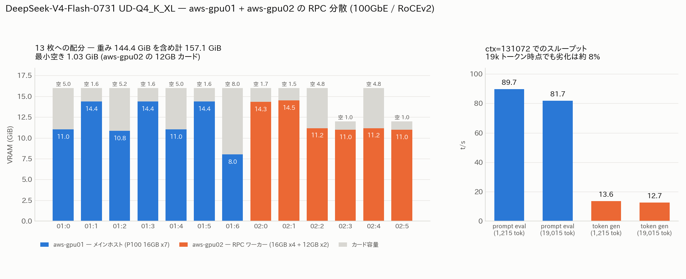

# GPU サーバ 2 台を RPC で束ねて 144GiB のモデルを起動

- **実施日時**: 2026年8月16日 16:35 〜 18:00 JST (ビルド・モデル取得・RPC 分散での llama-server 起動と性能計測)
- **報告日時**: 2026年8月16日 18:00 JST
- **作成者**: Claude Opus 5

## 概要

これまで扱ってきたモデルは、いずれも GPU サーバ 1 台の VRAM に収まる大きさだった。今回対象にした DeepSeek-V4-Flash の 4bit 量子化版は、それ単体で 1 台分の VRAM を大きく超えるため、従来のやり方では起動できない。そこで llama.cpp が持つ RPC バックエンドを使い、同一拠点にある 2 台の GPU サーバを 1 つの推論プロセスから同時に使う構成を試した。

2 台は 100GbE で直結されている。片方をメインホストとしてモデルファイルを持たせ、もう片方は GPU だけを貸し出すワーカーとして動かす。メインホストがモデルの重みを読み込み、ワーカー側が担当する層の分をネットワーク越しに転送する仕組みで、利用者から見えるのはメインホスト上の従来どおりの API エンドポイント 1 つだけになる。

結果として、この構成は問題なく動いた。合計 13 枚の GPU にモデルが分散して載り、コンテキスト長は当初想定していた 32k どころか、モデルの推奨上限に近い 128k まで通った。速度も、短いプロンプトと 2 万トークン近い長いプロンプトとで 1 割も違わず、長文でも実用的な範囲に収まっている。

事前に一番心配していたのは、搭載している GPU が世代の古いものであるため、このモデルが使う新しい計算処理に対応できず、その部分だけ CPU に落ちて極端に遅くなることだった。実際に動かしたところ、推論中も CPU 側の負荷は低いままで、そうした劣化は起きていなかった。llama.cpp 側に古い世代向けの代替経路が用意されていたことが効いている。

ネットワークについても、単なる TCP ではなく RDMA という高速な転送方式が自動的に選ばれていた。これは llama.cpp 本体に取り込まれている機能で、こちらで特別な設定をしたわけではなく、対応する NIC と必要なライブラリが揃っていたためビルド時に自動で有効化されたものである。

作業の過程で 2 つ、手順上の失敗を踏んだ。1 つはビルドを同じサーバで二重に走らせてビルドツリーを壊したこと、もう 1 つはリモートでプロセスを background 起動する書き方が原因で処理がハングし、その復旧の過程で llama-server を二重に起動しかけたことである。どちらも復旧済みで、再発を防ぐための注意書きをスキルのドキュメントに残した。

今回の構成を今後も使えるよう、ビルドスクリプトに RPC を有効化する設定を加え、ワーカーの起動・停止を行うスクリプトを新設した。あわせて、2 台にまたがる構成の手順をスキルのドキュメントにまとめている。

次の段階としては、このモデルに用意されている推論高速化用の補助モデルを組み合わせ、今回測った速度からどれだけ改善するかを見る作業が残っている。

## 添付ファイル

- [実装プラン](attachment/2026-08-16_175749_deepseek_v4_rpc_dual_gpu_server/plan.md)
- [llama-server ログ (ctx=131072、確定構成)](attachment/2026-08-16_175749_deepseek_v4_rpc_dual_gpu_server/llama-server-ctx131072.log)
- [llama-server ログ (ctx=32768、初回起動)](attachment/2026-08-16_175749_deepseek_v4_rpc_dual_gpu_server/llama-server-ctx32768.log)
- [RPC ワーカーログ (aws-gpu02)](attachment/2026-08-16_175749_deepseek_v4_rpc_dual_gpu_server/rpc-server-aws-gpu02.log)
- [ビルドログ aws-gpu01](attachment/2026-08-16_175749_deepseek_v4_rpc_dual_gpu_server/build-aws-gpu01.log)
- [ビルドログ aws-gpu02](attachment/2026-08-16_175749_deepseek_v4_rpc_dual_gpu_server/build-aws-gpu02.log)
- [図の生成スクリプト](attachment/2026-08-16_175749_deepseek_v4_rpc_dual_gpu_server/mkfig.py)

## 核心発見サマリ



**結論**: `unsloth/DeepSeek-V4-Flash-0731-GGUF:UD-Q4_K_XL` (155,095,241,120 B = **144.4 GiB**) を
aws-gpu01 (P100 16GB×7) + aws-gpu02 (16GB×4 + 12GB×2) の **13 GPU / 200 GiB** に
llama.cpp RPC バックエンドで分散し、**ctx=131072 で起動成功**。VRAM 実測 **160,882 MiB (157.1 GiB)**、
最小空き **1,058 MiB** (aws-gpu02 の 12GB カード)。pp **89.7 t/s** @1,215tok / **81.7 t/s** @19,015tok、
tg **13.6 / 12.7 t/s**。**19k トークン時点の劣化は約 8% に留まる** (DeepSeek Sparse Attention の効果)。
2 台間は llama.cpp 本体の RDMA トランスポート (上流 `adb541a6a`, PR #20590) が自動選択され、
`RDMA probed: dev=mlx5_0 gid=3 RoCEv2` / `RDMA activated: mtu=4096` を実測。
**sm_60 (Pascal) で `lightning_indexer` 等の新 op が CPU に落ちる懸念は否定された** (推論中 load average 0.43)。

## 前提・目的

- **背景**: DeepSeek-V4-Flash の 4bit 量子化版は 144.4 GiB あり、aws-gpu01 単体 (112 GiB) にも
  aws-gpu02 単体 (88 GiB) にも収まらない
- **目的**: llama.cpp の RPC バックエンドで 2 台を束ね、起動可否・VRAM 実測・pp/tg を確認する
- **前提条件**: 両機とも電源 ON で稼働中のため、爆音を伴う電源操作は不要。
  ユーザ指定により初回 ctx は 32768、DSpark は今回スコープ外

### モデル構成 (HF API 実測)

| shard | サイズ (B) |
|---|---|
| 00001-of-00005 | 5,257,408 |
| 00002-of-00005 | 48,935,523,072 |
| 00003-of-00005 | 48,980,787,136 |
| 00004-of-00005 | 49,999,168,416 |
| 00005-of-00005 | 7,174,505,088 |
| **合計** | **155,095,241,120 (144.4 GiB)** |

アーキテクチャは `deepseek4`、native ctx 1,048,576。unsloth 公式ドキュメントの 4bit メモリ要件
「162GB」とも整合する。ダウンロード後に 5 ファイルすべて `stat -c %s` で期待値一致を確認済み。

## 環境情報

| 項目 | aws-gpu01 (メインホスト) | aws-gpu02 (RPC ワーカー) |
|---|---|---|
| GPU | Tesla P100-PCIE 16GB × 7 = 112 GiB | 16GB × 4 + 12GB × 2 = 88 GiB |
| CPU / RAM | Xeon E5-2687W v4 ×2 (24C/48T) / 157 GiB | Xeon E5-2640 v4 ×2 (20C/40T) / 94 GiB |
| llama.cpp | `10bf611e5` (build 10451) | 同一コミット |
| ビルド構成 | `GGML_CUDA=ON` / `CUDA_ARCH=60` / `GGML_CUDA_FA_ALL_QUANTS=ON` / **`GGML_RPC=ON`** | 同左 |
| CUDA / driver | nvcc 12.0.140 / 535.288.01、gcc 13.3.0 | 同左 |
| モデル配置 | `~/models/DeepSeek-V4-Flash-0731-GGUF/UD-Q4_K_XL/` | **なし** (RPC ワーカーには不要) |

**100GbE 直結リンク**: aws-gpu01 `192.168.100.1` (`enp11s0np0`) ↔ aws-gpu02 `192.168.100.2` (`enp4s0np0`)。
Mellanox ConnectX-4 (MT27700)、100000 Mb/s、MTU 9000、RTT 0.20 ms、`mlx5_0/1` ACTIVE。

## 再現方法

```bash
# 0. ロック取得
.claude/skills/gpu-server/scripts/lock.sh aws-gpu01
.claude/skills/gpu-server/scripts/lock.sh aws-gpu02

# 1. 両機を同一コミットでビルド (RPC はバージョン一致必須)
ssh aws-gpu01 "cd ~/llama.cpp && git rev-parse HEAD"   # 両機で一致を確認
ssh aws-gpu02 "cd ~/llama.cpp && git rev-parse HEAD"
scp .claude/skills/llama-server/server-scripts/update_and_build-aws-gpu01.sh aws-gpu01:~/llama.cpp/update_and_build.sh
scp .claude/skills/llama-server/server-scripts/update_and_build-aws-gpu02.sh aws-gpu02:~/llama.cpp/update_and_build.sh
ssh -n aws-gpu01 "cd ~/llama.cpp && ./update_and_build.sh --no-pull --force"
ssh -n aws-gpu02 "cd ~/llama.cpp && ./update_and_build.sh --no-pull --force"

# 2. モデル取得 (aws-gpu01 のみ。HF 直ダウンロードが原則)
source ~/.config/gpu-server/.env
ssh aws-gpu01 "~/.local/bin/hf download unsloth/DeepSeek-V4-Flash-0731-GGUF \
  --include 'UD-Q4_K_XL/*' --local-dir ~/models/DeepSeek-V4-Flash-0731-GGUF --token $HF_TOKEN"

# 3. RPC ワーカー起動 (aws-gpu02)
.claude/skills/llama-server/scripts/rpc-up.sh

# 4. llama-server 起動 (aws-gpu01)
ssh -n aws-gpu01 'cd ~/llama.cpp && setsid nohup ./build/bin/llama-server \
  --model ~/models/DeepSeek-V4-Flash-0731-GGUF/UD-Q4_K_XL/DeepSeek-V4-Flash-0731-UD-Q4_K_XL-00001-of-00005.gguf \
  --alias DeepSeek-V4-Flash-0731-UD-Q4_K_XL \
  --rpc 192.168.100.2:50052 \
  --n-gpu-layers 999 --ctx-size 131072 \
  --flash-attn 1 --poll 0 -b 2048 -ub 512 \
  --jinja --temp 1.0 --top-p 1.0 --min-p 0.01 \
  --host 0.0.0.0 --port 8000 \
  > /tmp/llama-server.log 2>&1 < /dev/null &'

# 5. 停止 (順序: llama-server → rpc-server)
.claude/skills/llama-server/scripts/stop.sh aws-gpu01
.claude/skills/llama-server/scripts/rpc-down.sh
```

サンプリングパラメータ `--temp 1.0 --top-p 1.0 --min-p 0.01` は unsloth 公式ドキュメント
(https://unsloth.ai/docs/models/deepseek-v4) の推奨値。リポジトリの Qwen3.x 共通プロファイルは適用しない。

## 結果詳細

### 起動結果

| ctx-size | 結果 | ロード時間 | VRAM 合計 | 最小空き |
|---|---|---|---|---|
| 32,768 | **成功** | 4分52秒 | 157,084 MiB (153.4 GiB) | 1,328 MiB |
| 131,072 | **成功** | 4分24秒 | 160,882 MiB (157.1 GiB) | **1,058 MiB** |

`n_slots = 4`、`kv_unified = true`。ctx を 4 倍にしても VRAM 増分は 3,798 MiB (+2.4%) に留まる。
DeepSeek-V4 は compressed KV + sparse attention (DSA) を持つため、KV cache が ctx に対して
非常に緩やかにしか伸びない。

### VRAM 配分 (ctx=131072、MiB)

| GPU | aws-gpu01 | GPU | aws-gpu02 (容量) |
|---|---|---|---|
| 0 | 11,298 | 0 | 14,666 (16,384) |
| 1 | 14,712 | 1 | 14,848 (16,384) |
| 2 | 11,094 | 2 | 11,434 (16,384) |
| 3 | 14,712 | 3 | **11,230 (12,288)** |
| 4 | 11,298 | 4 | 11,434 (16,384) |
| 5 | 14,712 | 5 | **11,230 (12,288)** |
| 6 | 8,214 | — | — |
| **計** | **86,040** | **計** | **74,842** |

`--tensor-split` は指定していない。llama.cpp の自動配分が 12GB カード (index 3, 5) にも
1,058 MiB の空きを残す形で収めており、**手動 split は不要**だった。

### スループット

| ctx-size | プロンプト長 | pp (t/s) | tg (t/s) |
|---|---|---|---|
| 32,768 | 1,215 | 88.6 | 13.5 |
| 32,768 | 19,015 | 81.8 | 12.5 |
| 131,072 | 1,215 | **89.7** | **13.6** |
| 131,072 | 19,015 | **81.7** | **12.7** |

- **ctx-size を 32k → 128k にしても速度は変わらない** (差は測定ノイズの範囲)
- **19k トークンでも pp -8.9% / tg -6.6%** と劣化が小さい。同じ P100 の t120h-p100 で
  Qwen3.5-122B-A10B が 1k→96k で eval -46.3% だったのと対照的で、DSA の効果が明確
- 19,015 トークンの prompt eval に約 232 秒かかる点は運用上の注意 (キャッシュミス時)

### 動作確認

`--jinja` 有効で OpenAI 互換 API から正常に応答。日本語の要約タスクで
「llama.cppのRPCバックエンドは、リモートホスト上のggmlデバイスをネットワーク経由で公開することを可能にする。」
と正しく返答した。`chat_template_kwargs: {"enable_thinking": false}` による thinking 抑制も機能する。

**thinking 有効時の注意**: 日本語で質問しても `reasoning_content` は**中国語で出力される**
(最終回答は日本語)。DeepSeek-V4 の chat template の特性。

## 副次発見

### RDMA は llama.cpp 本体の機能

RPC ワーカーのログに `RDMA probed: dev=mlx5_0 gid=3 RoCEv2 qpn=454 inline=316` /
`RDMA activated: qpn=454->502 mtu=4096 rx_depth=24` が出る。これは独自実装ではなく上流の機能:

- 導入コミット: `adb541a6a rpc : add native RDMA transport for RPC backend (RoCEv2) (#20590)`
  (Valeriy Dubov, 2026-04-15)。`git merge-base --is-ancestor adb541a6a HEAD` → 真
- 両機の `~/llama.cpp` は `origin = https://github.com/ggml-org/llama.cpp.git` の
  クリーンなクローンで、`git status --porcelain` に追跡ファイルの改変なし
- cmake が `libibverbs` を検出すると自動で有効化される (`RDMA transport enabled (auto-detected)`)。
  コマンドライン変更は不要

### Pascal (sm_60) と DeepSeek-V4 の新 op

`deepseek4` は `ggml_lightning_indexer` / `ggml_dsv4_hc_{pre,post,comb}` という新しい op を使う。
`lightning-indexer.cu` は `turing_mma_available(cc)` で分岐し、**Turing 未満には非 wmma の
フォールバック経路がある**ため sm_60 でも CUDA 上で動く。推論中の load average は 0.43 で、
CPU への大規模なフォールバックは起きていない。

### aws-gpu01 の HF ダウンロードは実測 117 MB/s

155 GB を **22分12秒** で取得。登録時に測った 27 MB/s の 4 倍以上で、Xet バックエンドが
効いているものと見られる。WS 経由 (18 MB/s) より圧倒的に速く、
CLAUDE.md の「aws-gpu は HF 直ダウンロードが原則」は今回も妥当だった。

### 12GB カードがボトルネックにならなかった

aws-gpu02 の VRAM 不均等 (16/16/16/12/16/12 GB) は事前に懸念材料だったが、自動配分が
適切に処理した。`--tensor-split` の手動調整は不要。

## 作業上の失敗と対処

いずれも Claude 側の操作ミスであり、モデル・ハードウェアの問題ではない。

### 1. 同一サーバでビルドを二重起動しビルドツリーを破壊

aws-gpu02 で `update_and_build.sh` が 2 本同時に走り、後発の `rm -rf build` が先発の
ビルドツリーを削った結果 `nvcc fatal : Could not open options file
CMakeFiles/ggml-cuda.dir/includes_CUDA.rsp` で停止。全ビルドプロセスを kill し
`rm -rf build` からクリーンビルドし直して復旧。

**対処**: 「1 台につきビルドは 1 本だけ」を SKILL.md に明記。

### 2. `ssh ... & disown` で SSH チャネルがハング

リモートプロセスを background 起動する際に `... & disown` と書くと、非対話 bash では
起動用シェルが終了せず SSH チャネルが開いたままになり、呼び出し側 (`rpc-up.sh` や
Bash ツール) がハングする。上記 1 の二重起動もこれが遠因。

**検証結果** (aws-gpu02 で実測):

| 書き方 | 結果 |
|---|---|
| `setsid nohup CMD > log 2>&1 < /dev/null & disown` | **ハングする** |
| `setsid nohup CMD > log 2>&1 < /dev/null &` | 正常 (即 exit 0) |
| `(setsid nohup CMD > log 2>&1 < /dev/null &) ; exit 0` | 正常 (即 exit 0) |

**対処**: `rpc-up.sh` から `disown` を削除しコメントで理由を明記。SKILL.md にも記載。

### 3. llama-server の二重起動 (未然に停止)

ctx=131072 の起動可否を待つループの grep パターンに `abort` を含めていたため、
`W common_fit_params: failed to fit params to free device memory: n_gpu_layers already set
by user to 999, abort` という**警告**を失敗と誤判定した。実際にはこれは自動フィット機構が
「`n_gpu_layers` はユーザ指定済みなので調整しない」と告げるだけのもので、ロードは正常に
継続していた。誤判定に基づき ctx=65536 を追加起動してしまい、同じ GPU 群に 2 プロセスが
VRAM を確保し始めた。プロセス一覧で気付いて 2 分 42 秒後に kill し、
稼働中の ctx=131072 インスタンスは無傷 (`/health` → ok) だった。

**教訓**: llama.cpp のログで `abort` は失敗を意味しない場合がある。完了検出は
`listening on` (成功) と `error|out of memory|terminate` (失敗) に限定すべき。

## リポジトリへの変更

| ファイル | 変更 |
|---|---|
| `.claude/skills/llama-server/server-scripts/update_and_build-aws-gpu01.sh` | `-DGGML_RPC=ON` 追加、`-n/--no-pull` オプション追加 |
| `.claude/skills/llama-server/server-scripts/update_and_build-aws-gpu02.sh` | 同上 |
| `.claude/skills/llama-server/scripts/rpc-up.sh` | **新規**。RPC ワーカー起動 (バイナリ名の新旧両対応、`0.0.0.0` バインド拒否、LISTEN 検証) |
| `.claude/skills/llama-server/scripts/rpc-down.sh` | **新規**。RPC ワーカー停止 |
| `.claude/skills/llama-server/SKILL.md` | 「RPC 分散構成」節を追加 |
| `.claude/skills/gpu-server/aws-gpu.md` | 「100GbE 直結リンク」節を追加 |

`rpc-up.sh` が `0.0.0.0` へのバインドを拒否するのは、llama.cpp 公式が RPC サーバについて
「認証が無く安全でない。オープンなネットワークで動かすな」と明記しているため
(サーバ自身も起動時に同じ警告を出す)。100GbE 直結セグメントに限定する。

## 残課題

- **DSpark (speculative decoding) を試す** — リポジトリルートの
  `dspark-DeepSeek-V4-Flash-0731-Q8_0.gguf` (10.9 GB) を draft モデルとして
  `-md <draft> --spec-type draft-dspark --spec-draft-n-max 3 -ngl 99 -ngld 99` で使う。
  VRAM は +約 10 GB 必要で、今回の最小空き 1,058 MiB では ctx を下げるか配分調整が要る。
  **今回計測した tg 13.6 / 12.7 t/s をベースラインとして改善幅を比較すること**
- **`-ub` の引き上げ検証** — 今回は 13 デバイス分の compute buffer を警戒して `-ub 512` に
  留めた。pp 89.7 t/s は改善余地があるが、最小空き 1,058 MiB では慎重な検証が要る
- **`start.sh` / `llama-up.sh` への RPC 統合** — 今回は手動コマンドで起動した。
  成功構成が固まったので統合を検討してよい
- **ctx 131,072 超の上限実測** — モデルの native ctx は 1,048,576。128k は通ったが
  それ以上は未検証
- **長時間運用の安定性** — 今回の検証は約 1 時間。RDMA 接続の長時間安定性は未確認

## 参照レポート

- [aws-gpu01/02 のサーバ登録](../.claude/skills/gpu-server/aws-gpu.md) (レポートではなくスキルドキュメント)
- t120h-p100 での Qwen3.5-122B-A10B 長 ctx 劣化との比較は
  [llama-server SKILL.md](../.claude/skills/llama-server/SKILL.md) の「Qwen3.5-122B-A10B プロファイル」節
