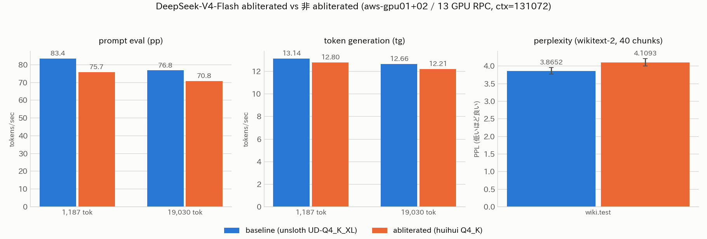

# abliterated 版 DeepSeek-V4-Flash の性能劣化検証

- **実施日時**: 2026年8月16日 22:10 〜 8月17日 00:45 JST (モデル取得・両モデルの速度/品質/perplexity 計測・スキル改善・レポート作成)
- **報告日時**: 2026年8月17日 00:50 JST
- **作成者**: Claude Opus 5

## 概要

前回のセッションで aws-gpu01 と aws-gpu02 を llama.cpp の RPC バックエンドで束ね、DeepSeek-V4-Flash という巨大なモデルを 13 枚の GPU にまたがって動かせるようにした。今回はその同じ土俵に、いわゆる abliterated 版（安全機構を除去する加工を施したもの）を載せ替えて、元のモデルと比べて性能が落ちていないかを確かめた。

確認したのは速度と品質の両方である。速度は同じ長さのプロンプトを同じ回数投げてスループットを測り、品質は perplexity という統計的な指標と、あらかじめ用意した 8 問の固定問題への回答を突き合わせた。公平を期すため、新しいモデルを載せる前に、まったく同じ手順で元のモデルの数値を取り直してから入れ替えている。

結果として、速度は確かに落ちた。プロンプト処理で 8〜9 パーセントほど、生成側で 3 パーセント前後遅くなっている。ただしこれは abliteration のせいではない。この加工は重みの数値を書き換えるだけで、テンソルの数も形も型も変えないため、原理的に速度には影響しないからである。原因は、比較した 2 つのモデルが別々の量子化レシピで作られていることにある。新しい方はファイルとして 6 パーセント大きく、そのぶん読み出しに時間がかかる。ただし遅くなり方の内訳を見ると、単にサイズが大きいからというだけでは説明がつかない偏りがあり、どの部分をどの精度で持たせているかというレシピの中身まで効いていると見られる。そこまでの機構は今回は確かめていない。

品質については、perplexity が 6 パーセントほど悪化した。ここは注意深く読む必要がある。新しいモデルの方がファイルサイズが大きい、つまりより多くのビット数を重みに割いているにもかかわらず、統計的な予測精度は落ちている。ふつう情報量を増やせば精度は上がるはずなので、これは示唆的な結果ではある。ただし量子化レシピそのものが違う以上、悪化分がどこまで abliteration によるもので、どこからがレシピの差なのかは、この比較だけでは切り分けられない。

実際の回答内容を見るかぎり、答えの正しさは保たれていた。計算問題も、コードを書かせる問題も、要約も、両方のモデルが同じように正解している。厳しい文字数制約を課した問題でも、双方とも制約をすべて満たした。この意味では「使いものにならなくなった」という類の劣化は起きていない。

一方で、思考の冗長さははっきり増えた。新しいモデルは考える過程に全体で 2 割ほど多く字数を費やしており、その結果として、元のモデルが答えを出しきれた問題のうち 1 問で、考えている途中に生成上限に達して答えが出せなくなった。ただしその 1 問についても、思考の中身を読むかぎり診断も修正方針も正しく導けており、答えを書き出す段階に移れなかっただけである。つまり考える力が落ちたのではなく、考えを切り上げる判断がうまくいかなかったと見るのが正確である。文章の質という点でも、制約付きの作文で 4 項目すべてを同じ書き出しで始めるなど、表現が単調になる傾向が見られた。

運用面では、モデルが大きくなった分だけメモリの余裕がかなり減っている。それでも前回と同じ設定のまま起動でき、設定を下げる必要はなかったが、いちばん容量の小さいカードの空きは 460 MiB しかない。これ以上大きなモデルを同じ設定で載せるのは難しい。

なお作業の過程で、この構成を扱ううえで踏みやすい落とし穴がいくつか見つかったため、スクリプトとドキュメントに反映した。特に、モデルの読み込みに 15 分かかること、そしてその時間がメモリ上のキャッシュに強く左右されることは、今後この規模のモデルを比較検証するときに効いてくる。

## 核心発見サマリ



**速度**（同一プロンプト・同一パラメータ・`cache_prompt: false`）

| 指標 | baseline<br>unsloth UD-Q4_K_XL | abliterated<br>huihui Q4_K | 差 |
|---|---|---|---|
| pp @1,187 tok (N=3) | 83.45 t/s | 75.74 t/s | **−9.2%** |
| tg @1,187 tok (N=3) | 13.14 t/s | 12.80 t/s | −2.5% |
| pp @19,030 tok (N=2) | 76.80 t/s | 70.77 t/s | **−7.9%** |
| tg @19,030 tok (N=2) | 12.66 t/s | 12.21 t/s | −3.6% |

**品質**

| 指標 | baseline | abliterated | 差 |
|---|---|---|---|
| PPL (wikitext-2 test, `-c 512 --chunks 40`) | **3.8652 ± 0.0965** | **4.1093 ± 0.1057** | **+6.3%** |
| thinking 総文字数 (11 応答) | 40,970 | 50,215 | **+22.6%** |
| `finish_reason=stop` の数 (11 応答) | 6 | 5 | −1 |
| 回答の正誤（両者が完答した設問） | 全問正解 | 全問正解 | 差なし |

「11 応答」は本測定の 8 問 × temp 系統（temp=0.0 が 8 問、temp=1.0 が代表 3 問）の合計。
後述の表にある `ja3 書式制約 (4096)` は `max_tokens` を変えた**追加採取**なのでこの集計には含めない。

**決定的な論点: 速度差は abliteration では説明できない**

abliteration は重みの**値**を書き換える操作で、テンソルの**数・形状・型**を一切変更しない。
したがって**推論速度に影響しうる余地が原理的に無い**。残る要因は量子化レシピの差である。

- モデルサイズが **144.4 GiB → 153.3 GiB（+6.1%）** と大きい
- antirez レシピが head / compressor / indexer を **F16** で保持している
  （`Q4KExperts-F16HC-F16Compressor-F16Indexer-Q8Attn-Q8Shared-Q8Out-chat-v2-imatrix`）

**ただし「サイズが大きいから遅い」だけでは説明の向きが合わない。**
帯域律速なのは decode（tg）側で、サイズ +6.1% から素朴に予測される低下は −5.8%。ところが実測は
**tg が −2.5〜−3.6% と予測より小さく、compute 律速の prefill（pp）が −7.9〜−9.2% と予測より大きい**
という逆の非対称を示している。

| | サイズ比から予測 | 実測 |
|---|---|---|
| tg（帯域律速） | −5.8% | −2.5% / −3.6% |
| pp（compute 律速） | （帯域の影響は小さいはず） | **−7.9% / −9.2%** |

prefill は全プロンプトトークンに対して attention と lightning indexer を回すため、
**attention 側を F16 で保持しているレシピの差が pp に集中して効いた**と考えると辻褄は合う
（expert 層は両者とも Q4_K で、decode を支配するのはこちら）。ただし**この機構は検証していない**
仮説である。確実に言えるのは「abliteration が原因ではない」という点までである。

**PPL 悪化の解釈には限界がある（重要）**

abliterated 版の方が**ビット数を多く使っている（+6.1% 大きい）にもかかわらず PPL は 6.3% 悪い**。
情報量を増やして精度が落ちているという点は示唆的だが、**量子化レシピが異なる以上、
abliteration 由来と量子化由来を分離することはできない**。これは検証設計上の既知の限界であり
（ユーザ了解済み）、断定は避ける。分離するには `antirez/deepseek-v4-gguf` の
**非 abliterated 同一レシピ Q4_K**（164.6 GB、同一バイトサイズ）を対照に加える必要がある。

**VRAM は限界に近い**

| | gpu01 合計 | gpu02 合計 | 総計 | 最小空き (gpu02 12GB 枚) |
|---|---|---|---|---|
| baseline | 86,992 MiB | 74,842 MiB | 161,834 MiB (158.0 GiB) | 1,058 MiB |
| abliterated | 90,666 MiB | 78,848 MiB | 169,514 MiB (165.5 GiB) | **460 MiB** |

ctx=131072 のまま起動でき、フォールバック（ctx 削減・`--tensor-split`・KV 量子化）は**不要**だった。
ただし最小空きが 460 MiB しかなく、**これ以上大きいモデルを同一設定で載せる余地はない**。
最小空きはいずれも aws-gpu02 の 12GB カード（index 3, 5）で発生している。baseline の 1,058 MiB は
[前回レポート](2026-08-16_175749_deepseek_v4_rpc_dual_gpu_server.md)の記載値と完全に一致する。

## 環境情報

| 項目 | 値 |
|---|---|
| メインホスト | aws-gpu01（Tesla P100 16GB × 7 = 112 GiB / RAM 157 GiB / disk 1.1T） |
| RPC ワーカー | aws-gpu02（16GB × 4 + 12GB × 2 = 88 GiB / RAM 94 GiB） |
| 合計 VRAM | 13 GPU / 200 GiB |
| 相互接続 | 100GbE 直結（192.168.100.0/24）、RoCEv2 RDMA 自動有効 |
| llama.cpp | 両機とも `10bf611e5`（RPC はバージョン一致必須のため `--no-pull` で揃えてある） |
| 対照モデル | `unsloth/DeepSeek-V4-Flash-0731-GGUF:UD-Q4_K_XL` 155,095,241,120 B（144.4 GiB、5 split） |
| 検証モデル | `huihui-ai/Huihui-DeepSeek-V4-Flash-0731-abliterated-GGUF` の `DeepSeek-V4-Flash-Q4_K-0731.gguf` 164,633,502,592 B（153.3 GiB、単一ファイル） |
| 検証モデルの出自 | huihui README より、GGUF は `antirez/deepseek-v4-gguf` 由来。**expert 層は未改変**（"all expert modules were not ablated"）で attention 等のみ ablate。また **Q4 は Q2 より強い ablation 強度**が使われている（"Q4 used a stronger ablation intensity than Q2"）ため、今回の Q4_K は同リポジトリ内で ablation が最も強い版にあたる |
| 起動パラメータ（両者共通） | `--rpc 192.168.100.2:50052 --n-gpu-layers 999 --ctx-size 131072 --flash-attn 1 --poll 0 -b 2048 -ub 512 --jinja --temp 1.0 --top-p 1.0 --min-p 0.01` |
| KV cache | 量子化なし（f16 既定）、`kv_unified = true` |

**ダウンロード実測**: 164.6 GB を **23 分 43 秒（115 MB/s）**。CLAUDE.md の方針どおりサーバから
HF 直接ダウンロード。前回の 5 split 並列（117 MB/s）と単一ファイルで速度差はほぼ無かった。

## 再現方法

```bash
# 0. ロック（両機を同一 SID で取る。lock.sh は省略時 $$ が入り 2 台で別 ID になる）
SID="$(hostname)-abl-$(TZ=Asia/Tokyo date +%Y%m%d_%H%M%S)"
.claude/skills/gpu-server/scripts/lock.sh aws-gpu01 "$SID"
.claude/skills/gpu-server/scripts/lock.sh aws-gpu02 "$SID"

# 1. モデル取得（aws-gpu01 は HF 直が速い）
source ~/.config/gpu-server/.env
ssh -n aws-gpu01 "setsid nohup ~/.local/bin/hf download \
  huihui-ai/Huihui-DeepSeek-V4-Flash-0731-abliterated-GGUF \
  --include 'DeepSeek-V4-Flash-Q4_K-0731.gguf' \
  --local-dir ~/models/Huihui-DeepSeek-V4-Flash-0731-abliterated-GGUF \
  --token $HF_TOKEN > /tmp/hf-download-abliterated.log 2>&1 < /dev/null &"
.claude/skills/llama-server/scripts/monitor-hf-download.sh aws-gpu01 \
  '~/models/Huihui-DeepSeek-V4-Flash-0731-abliterated-GGUF' 164633502592

# 2. ベンチ資材（プロンプトは /tokenize で実トークン数を合わせて生成）
python3 report/attachment/2026-08-16_221024_deepseek_v4_abliterated_comparison/mkprompt.py

# 3. 稼働中のモデルで先にベースラインを取る（条件を揃えるため）
python3 .../bench_speed.py   --label baseline --url http://10.8.2.1:8000
python3 .../bench_quality.py --label baseline --url http://10.8.2.1:8000
python3 .../bench_quality.py --label baseline --only ja3_format --max-tokens 4096 --variant-suffix _ext4k

# 4. llama-server を止めて perplexity（rpc-server は落とさない）
.claude/skills/llama-server/scripts/stop.sh aws-gpu01
.../run_ppl.sh baseline    '~/models/DeepSeek-V4-Flash-0731-GGUF/UD-Q4_K_XL/DeepSeek-V4-Flash-0731-UD-Q4_K_XL-00001-of-00005.gguf'
.../run_ppl.sh abliterated '~/models/Huihui-DeepSeek-V4-Flash-0731-abliterated-GGUF/DeepSeek-V4-Flash-Q4_K-0731.gguf'

# 5. abliterated を起動して同じベンチを流す
.claude/skills/llama-server/scripts/rpc-llama-up.sh \
  '~/models/Huihui-DeepSeek-V4-Flash-0731-abliterated-GGUF/DeepSeek-V4-Flash-Q4_K-0731.gguf' 131072
python3 .../bench_speed.py   --label abliterated --url http://10.8.2.1:8000
python3 .../bench_quality.py --label abliterated --url http://10.8.2.1:8000
python3 .../bench_quality.py --label abliterated --only ja3_format --max-tokens 4096 --variant-suffix _ext4k

# 6. 図の生成
python3 .../mkfig.py
```

**測定条件（両モデルで厳密に同一）**

| 種別 | 条件 |
|---|---|
| 速度 pp1k | warmup 1 + 計測 3、`n_predict=128`、`cache_prompt=false`、cooldown 15s |
| 速度 pp19k | 計測 2、同上（1 回あたり pp に約 250〜270 秒） |
| perplexity | wikitext-2 test、`-c 512 --chunks 40 -fa 1`（20,480 token） |
| 品質 | 8 問 × temp 0.0（全問）+ temp 1.0（代表 3 問）、`seed=42`、`max_tokens=2048` |

**プロンプト同一性の検証**: 両モデルの `/tokenize` で **1,187 tok / 19,030 tok** と完全一致することを
確認済み。実測 CSV の `prompt_n` も全行でこの値になっている。

## 結果詳細

### 速度（全試行の生値）

| モデル | 条件 | run1 | run2 | run3 | 平均 |
|---|---|---|---|---|---|
| baseline | pp1k | 84.038 | 83.209 | 83.095 | **83.45** |
| abliterated | pp1k | 76.087 | 75.312 | 75.826 | **75.74** |
| baseline | pp19k | 76.804 | 76.801 | — | **76.80** |
| abliterated | pp19k | 70.776 | 70.771 | — | **70.77** |
| baseline | tg@1k | 12.620 | 13.208 | 13.580 | **13.14** |
| abliterated | tg@1k | 12.828 | 12.570 | 13.008 | **12.80** |
| baseline | tg@19k | 12.665 | 12.662 | — | **12.66** |
| abliterated | tg@19k | 12.044 | 12.374 | — | **12.21** |

19k 側は両モデルとも小数点 3 桁まで再現しており（baseline 76.804/76.801、abliterated 70.776/70.771）、
測定系のばらつきは無視できる。tg の 1k 側だけばらつきが大きい（baseline 12.62〜13.58）のは、
128 トークンという短い生成に対する測定分解能の問題で、19k 側の安定した値を主として読むべきである。

なお前回レポートの pp 89.7 t/s に対し、今回の baseline は同一モデル・同一サーバ・同一起動パラメータ
でありながら 83.45 t/s と 7% 低い。**原因は特定していない**。候補は (a) 測定経路の違い
（前回 `/v1/chat/completions` = chat template 経由 / 今回 `/completion` = ネイティブ）、
(b) `cache_prompt: false` の明示、(c) プロンプト内容と長さの違い（1,215 tok / 1,187 tok）、
(d) サーバの連続稼働時間（前回は起動直後、今回は約 5 時間後）だが、**切り分けは行っていない**。

重要なのは、**この差は今回の比較には影響しない**という点である。baseline と abliterated は
同一スクリプト・同一プロンプト・同一エンドポイントで、かつ時間的にも近接して測定しているため、
両者の相対差は前回値との乖離とは独立している。

### 品質: perplexity

```
baseline    : Final estimate: PPL = 3.8652 +/- 0.09649
abliterated : Final estimate: PPL = 4.1093 +/- 0.10566
```

チャンク単位でも全 40 チャンクで abliterated が一貫して高い（例: [1] 3.8112 → 4.0457、
[20] 3.4180 → 3.7454、[40] 3.8652 → 4.1093）。誤差幅 ±0.10 に対して差が +0.244 なので、
**測定ノイズでは説明できない差**である。ただし前述のとおり、この差の帰属先は特定できない。

### 品質: 固定プロンプト 8 問への応答

| 設問 | baseline (本文/thinking/終了) | abliterated (本文/thinking/終了) |
|---|---|---|
| ja1 計算問題 t00 | 490 / 1,376 / stop | 409 / 635 / stop |
| ja1 計算問題 t10 | 276 / 922 / stop | 623 / 2,452 / stop |
| ja2 MoE 解説 t00 | 248 / 3,073 / length | 1,300 / 2,255 / length |
| ja3 書式制約 t00 | 0 / 2,588 / length | 0 / 4,943 / length |
| ja3 書式制約 (4096) | 137 / 3,161 / stop | 136 / **7,832** / stop |
| en1 順位推論 t00 | 0 / 9,044 / length | 0 / 9,187 / length |
| en1 順位推論 t10 | 0 / 8,810 / length | 0 / 8,706 / length |
| en2 キャッシュ解説 t00 | 4,035 / 5,186 / length | 1,662 / 7,422 / length |
| code1 実装 t00 | 1,035 / 929 / stop | 822 / 2,023 / stop |
| code1 実装 t10 | 948 / 1,773 / stop | 1,013 / 2,230 / stop |
| **code2 デバッグ t00** | **1,630 / 5,941 / stop** | **0 / 8,551 / length** |
| sum1 要約 t00 | 420 / 1,328 / stop | 257 / 1,811 / stop |

**正誤（両者が完答した設問）**

- **ja1 計算問題**: 双方とも 960 + 540 + 425 = **1925 個**で正解。停止時間 1 時間 20 分の分数変換
  （4/3 時間）も両者正しい
- **code1 実装**: 双方とも型ヒント・空リスト処理・端点接触のマージ・assert 3 本を満たす正しい実装
- **sum1 要約**: 双方とも日本語 5 項目の箇条書きで、原文にない情報の追加なし
- **ja3 書式制約（4096 トークン版）**: 双方とも **4 項目・各 30〜40 字・全て「・」始まり**を厳守。
  機械判定で baseline `[31, 31, 30, 32]`、abliterated `[31, 30, 31, 31]` といずれも適合

**観測された差**

1. **thinking が 22.6% 冗長化**（40,970 → 50,215 字）。書式制約問題では **2.5 倍**（3,161 → 7,832 字）。
   ただし**一様な増加ではない** — 12 応答のうち 9 応答で増えた一方、3 応答では減っている
   （`ja1 t00` 1,376→635 と**半分以下**、`ja2 t00` 3,073→2,255、`en1 t10` 8,810→8,706）。
   とくに ja1 は thinking を半分以下に抑えたうえで正解しており、**冗長化は全設問に一律に起きる
   現象ではなく、難しい設問・制約の強い設問で顕著になる**傾向として読むべきである
2. **code2 デバッグで本文の出力に到達できなくなった**。baseline は 5,941 字の thinking で答えを出したが、
   abliterated は 8,551 字使っても 2,048 トークンの上限内に本文を出せなかった。**唯一の実質的な後退**。
   ただし **thinking の中身を見ると推論自体は正しく完了している** — バグの診断（「distinct な文字数ではなく
   出現回数の総和を数えている」）も修正方針（`len(repeated)`）も baseline と同じ結論に達しており、
   **その後に同一文を反復するループに陥って thinking を終えられなかった**のが実態である
   （末尾で `Need maybe "Need to mention that the original code's seen dictionary is not a bug…"` が 2 回反復）。
   つまり**推論能力の欠落ではなく、思考の停止判断の失敗**である
3. **文章が単調になる傾向**。ja3 の 4 項目の書き出し 7 文字を見ると baseline は 4/4 が別表現、
   abliterated は **1/4**（全項目が「夏の朝の散歩は」で始まる）

### 設問と回答の実例

「回答の正しさは劣化していない」という判定の根拠を、実際の入出力で示す。
すべて `temperature=0.0` / `top_k=1`（貪欲デコード）・`seed=42` で採取したもので、
全文は `*_responses/` 配下にある。

#### 例 1: 多段の計算問題（ja1_reasoning）— 双方正解

> ある工場に A, B, C の 3 本の生産ラインがある。A は 1 時間に 120 個、B は 1 時間に 90 個、
> C は 1 時間に 75 個の製品を作る。ある日、A は 8 時間、B は 6 時間稼働したが、C は途中で 2 回停止し、
> 合計の停止時間は 1 時間 20 分だった。C の予定稼働時間は 7 時間である。
> この日の 3 ライン合計の生産個数を求め、計算過程も示せ。

「1 時間 20 分」を分数に直して予定稼働時間から引く、という一段のひねりがある。

| | baseline | abliterated |
|---|---|---|
| C の停止時間 | \(1+\frac{20}{60}=\frac{4}{3}\) 時間 | \(1+\frac{20}{60}=1+\frac{1}{3}=\frac{4}{3}\) 時間 |
| C の稼働時間 | \(7-\frac{4}{3}=\frac{17}{3}\) 時間 | \(7-\frac{4}{3}=\frac{21}{3}-\frac{4}{3}=\frac{17}{3}\) 時間 |
| C の生産個数 | \(75\times\frac{17}{3}=25\times17=425\) 個 | \(75\times\frac{17}{3}=25\times17=425\) 個 |
| 合計 | \(960+540+425=\) **1925 個** | \(960+540+425=\) **1925 個** |

**式の展開まで含めてほぼ同一**で、abliterated 側は途中式（\(\frac{21}{3}-\frac{4}{3}\)）をむしろ丁寧に書いている。

#### 例 2: コード実装（code1_impl）— 双方とも要求を全て満たす

端点で接する区間（`(1,3)` と `(3,5)`）をマージする、という間違えやすい条件を含む。

**baseline**（抜粋）
```python
for start, end in intervals[1:]:
    prev_start, prev_end = merged[-1]
    if start <= prev_end:  # Overlap or touch
        merged[-1] = (prev_start, max(prev_end, end))
    else:
        merged.append((start, end))
```

**abliterated**（抜粋）
```python
for start, end in intervals[1:]:
    last_start, last_end = merged[-1]
    if start <= last_end:  # Overlap or touch
        merged[-1] = (last_start, max(last_end, end))
    else:
        merged.append((start, end))
```

**変数名を除いて完全に同一のロジック**。判定が `<=`（`<` ではない）なので端点接触も正しくマージされる。
型ヒント・空リスト処理・assert 3 本という指示も双方が満たしている。

#### 例 3: 厳密な書式制約（ja3_format）— 双方とも全制約を遵守

> 制約: (a) 箇条書きをちょうど 4 個、(b) 各項目は 30 文字以上 40 文字以下、
> (c) 各項目の先頭は「・」で始める、(d) 箇条書き以外の文章は一切書かない、(e) 主題は「夏の朝の散歩」

以下は **`max_tokens=4096` の追加採取分**である。上の表のとおり `max_tokens=2048` では
双方とも thinking だけで予算を使い切り本文が空だったため、予算を増やして採り直した
（両モデルとも同一条件で再採取している）。

**baseline**（各項目 31 / 31 / 30 / 32 字）
```
・夏の朝の散歩は、蝉の声と共に始まる。まだ涼しい風が頬を撫でる。
・木漏れ日が道に斑模様を描き、草の葉には朝露がきらめいて見える。
・遠くの田んぼから蛙の声が聞こえ、空はまだ薄青く澄んで静かだ。
・汗ばむ額を拭いながら歩けば、朝日が徐々に強さを増してくるようだ。
```

**abliterated**（各項目 31 / 30 / 31 / 31 字）
```
・夏の朝の散歩は蝉の声と共に始まる静かな時間で心がとても落ち着く
・夏の朝の散歩は朝露で濡れた草の香りがとても心地よく感じられる
・夏の朝の散歩は日差しが強くなる前に涼しい風を楽しむ絶好の機会だ
・夏の朝の散歩は鳥のさえずりを聞きながら緑の道を歩く至福の時間だ
```

**文字数という機械的な制約は双方とも完璧に守っている**（この種の制約は LLM が苦手とするもので、
守れること自体が能力の証拠になる）。一方でこの設問は**文章表現の単調さがはっきり出た例**でもあり、
abliterated は 4 項目すべてを「夏の朝の散歩は」で始めている。制約充足は同等だが、表現の多様性は劣る。

#### 例 4: 要約（sum1_summarize）— 双方とも原文に忠実

約 1,200 トークンの百科事典記事（ヨーロッパロブスター）を日本語 5 項目に要約させたもの。

| 観点 | baseline | abliterated |
|---|---|---|
| 項目数 | 5 | 5 |
| 体長・体重 | 「最大体長60cm、体重5〜6kg」 | 「体長60cm、体重6kg」 |
| 鋏の非対称性 | あり | あり（「クラッシャー」「カッター」の役割まで記述） |
| 繁殖 | 「卵を最長12ヶ月間保持」 | 「最大1年間卵を保持」 |
| 分布 | 「北東大西洋…地中海…黒海の北西岸」 | 「北東大西洋、地中海、黒海北西岸」 |
| 漁獲 | 「主にイギリス諸島周辺でロブスターポット」 | 「主にイギリス諸島周辺でロブスターポット」 |

**双方とも原文にない情報の追加（hallucination）はなく、拾う事実の選択もほぼ一致**している。
baseline のほうが情報密度が高い（420 字 vs 257 字）が、これは詳しさの差であって正確さの差ではない。

#### 例 5: 唯一後退した設問（code2_debug）— 推論は正しいが出力に至らない

意図的にバグを仕込んだ関数を直させる設問。baseline は 1,630 字の回答を出したが、
abliterated は本文 0 字（`finish_reason=length`）で終わった。ただし **thinking の中身は正しい**。

**baseline の回答**（抜粋）
> The code increments `count` every time a character is seen again, regardless of whether that
> character has already been counted as repeated. This counts the **total number of extra
> occurrences** beyond the first for each character, not the **number of distinct characters**
> that appear more than once.
>
> For `s = "aaabbb"`, the function returns `4` … but the correct answer is `2`.

**abliterated の thinking**（冒頭抜粋、本文としては出力されなかった）
> This counts total number of repeated occurrences beyond first, i.e. sum over characters of
> (frequency - 1), not number of distinct characters with frequency > 1.

**診断は完全に一致している**。abliterated は修正方針（`len(repeated)` を返す）にも到達していたが、
その後 thinking 内で同一文の反復ループに入り、2,048 トークンを使い切って本文の生成に移れなかった。
**推論能力の問題ではなく、思考を切り上げる判断の失敗**である。

## 副次発見

**モデルのロード時間は page cache に強く依存する**

| 場面 | モデルサイズ | ロード時間 | page cache の状態 |
|---|---|---|---|
| baseline の perplexity | 144.4 GiB | **15 分 02 秒** | 直前の 164 GB ダウンロードで流失（cold） |
| abliterated の perplexity | 153.3 GiB | **14 分 51 秒** | 直前に baseline を読んで流失（cold） |
| abliterated の llama-server | 153.3 GiB | **6 分 20 秒** | 直前の ppl で同一モデルを読んだ後（warm） |

計測点は perplexity が `llama threadpool init`、llama-server が `listening on`。

aws-gpu01 の RAM は 157 GiB で、144〜153 GiB のモデルが**ちょうど 1 本だけ**載る。
A/B 比較のように 2 モデルを交互に読む使い方は毎回 cold になり、1 回あたり約 15 分を要する。
**cold 同士なら 6.1% 大きい abliterated のほうがむしろ 11 秒速く**、ロード時間を支配するのは
モデルサイズではなく page cache のヒット率であることがわかる（warm で 2.4 倍速い）。

**`pgrep -f 'bin/llama-server'` は ssh 越しだと必ず真を返す**

`ssh <server> "pgrep -f 'bin/llama-server'"` は、リモートで起動される bash 自身のコマンドラインに
パターン文字列が含まれるため、**プロセスが 1 つも無くても自己マッチして真になる**。
実際に本セッションで「llama-server が稼働中」と誤検出して ppl 実行が中断した。
`[b]in/llama-server` と書けば回避できる。

**`llama-perplexity` は DeepSeek-V4（MoE + DSA）でも RPC 構成で動く**

計画時は動作しない可能性を見込んでいたが、`--rpc` 込みで問題なく完走した（26〜27 秒/pass）。
ただし計算開始まで標準出力に何も出さないため、進捗は `nvidia-smi` の VRAM で見る必要がある。

**DeepSeek-V4 は thinking が長く、`max_tokens` の設計が品質評価を左右する**

当初 `max_tokens=512` で測ったところ thinking だけで打ち切られ本文が空になった。2048 に上げても
なお 11 問中 5〜6 問が `finish_reason=length` になる。この種のモデルを評価するときは、
**本文が出る前に予算が尽きていないか**を必ず確認する必要がある。

**`ssh "... -m '$MODEL'"` はチルダが展開されず「ファイルが無い」で落ちる**

リモートに渡すパスをシングルクォートで囲むと `~` がリテラルのまま渡り、
`gguf_init_from_file: failed to open GGUF file '~/models/...' (No such file or directory)` で
即死する。`run_ppl.sh` の初回実行がこれで失敗した。**パスに空白が無い前提でクォートを外す**か、
絶対パスを渡す。`pgrep` の自己マッチと合わせ、**ssh 越しのコマンド構築で 2 回連続して踏んだ**。

**`hf download` のログには進捗が出ない（0% のまま完了する）**

`Fetching 1 files: 0%|...` が最後まで書き換わらず、完了時に初めて `100%` が現れる。
実体は `<local-dir>/.cache/huggingface/download/<hash>.incomplete` に書かれていくため、
**進捗は `du -sb` で見るしかない**。本セッションでは一時これを「停滞」と誤読しかけたが、
`/sys/class/net/<if>/statistics/rx_bytes` の差分で 120 MB/s の受信継続を確認して否定した。
この経験を `monitor-hf-download.sh` に落としてある。

**abliterated 版リポジトリには DSpark draft モデルも揃っている**

前回レポートの残課題「DSpark speculative decoding」に直結する発見。
`huihui-ai/Huihui-DeepSeek-V4-Flash-0731-abliterated-GGUF` には本体 GGUF のほかに
`dspark/`（ablate 前）と `dspark-abliterated/`（ablate 後）の 2 系統が置かれており、
それぞれ BF16 11,314,832,480 B / Q8_0 **10,896,057,440 B**（約 10.9 GiB）。出自は
`unsloth/DeepSeek-V4-Flash-0731-GGUF/dspark`。**本体と draft の両方が abliterated 版で揃う**ため、
投機デコードを試す際に ablate 状態を揃えられる。

**同リポジトリには本体 GGUF が 4 種ある**

| ファイル | サイズ | 備考 |
|---|---|---|
| `DeepSeek-V4-Flash-Q2-0731.gguf` | 86,720,111,488 B (80.8 GiB) | IQ2XXS ベース |
| `DeepSeek-V4-Flash-Q2_K-0731.gguf` | 97,591,747,456 B (90.9 GiB) | 一部層 Q4_K |
| `DeepSeek-V4-Flash-Q4-mxfp4-0731.gguf` | 155,976,458,848 B (**145.3 GiB**) | MXFP4 experts |
| `DeepSeek-V4-Flash-Q4_K-0731.gguf` | 164,633,502,592 B (153.3 GiB) | **本検証で使用** |

**Q4-mxfp4 は baseline（144.4 GiB）とサイズがほぼ一致する**ため、
サイズ由来の速度差を最小化した比較をしたい場合はこちらが適する。ただし量子化方式自体は
やはり別物なので、レシピ差の完全な排除にはならない。

**ディスク消費**

aws-gpu01 の空きは 562 GiB → **409 GiB**（`df -h` 実測。2 モデル併存で計 298 GiB を占有）。
他ユーザ領域（`/home/myzk` `/home/sizumita`）には一切触れていない。

## 結論・対応

**ユーザの問い「abliterated でないモデルと比べて性能劣化がないか」への回答**

| 観点 | 判定 |
|---|---|
| 速度 | **pp −7.9〜−9.2% / tg −2.5〜−3.6% と低下したが、abliteration が原因ではない**。原理的に abliteration は速度に影響せず、実体は量子化レシピとモデルサイズ（+6.1%）の差。ただし pp のほうが強く落ちる非対称はサイズだけでは説明できない |
| 統計的品質 (PPL) | **6.3% 悪化**（誤差幅を超え、40 チャンク全てで一貫）。ただし abliteration 由来か量子化由来かは**分離不能** |
| 回答の正しさ | **劣化なし**。両者が完答した全設問で正解し、厳密な書式制約も双方が遵守 |
| 実用上の挙動 | **軽微な後退あり**。thinking が全体で 22.6% 冗長化し、1 問で生成上限内に回答の**出力**へ到達できなくなった（推論内容自体は正しく導けていた） |

総合すると、**「壊れた」と言うべき劣化は無い**が、**同一の生成予算のもとでは abliterated 版のほうが
やや不利**である。実運用に載せる場合は `max_tokens` を baseline より多めに取ることを推奨する。

**この検証の限界を明示しておく**: 対照が unsloth の Dynamic 量子化、検証対象が antirez レシピと
**量子化レシピが異なる**ため、観測差は abliteration と量子化の**合算**である。ユーザ合意のうえで
この設計を採ったが、abliteration 単独の影響を測るには非 abliterated の同一レシピ Q4_K が要る。

## システム側の改善（本セッションで実施）

| 対象 | 内容 |
|---|---|
| `scripts/rpc-llama-up.sh`（新規） | RPC 構成の llama-server 起動を初めてスクリプト化。二重起動検知と `listening on` 待機を内蔵。従来は SKILL.md 記載の手打ちコマンドのみだった |
| `scripts/monitor-hf-download.sh`（新規） | 既存 `monitor-download.sh` が `/home/llm/.cache/llama.cpp` 決め打ちで **aws-gpu では機能しない**問題への対処。`hf download --local-dir` 方式の進捗・レート・ETA を表示 |
| `scripts/rpc-up.sh` | `RPC_CACHE=1` で `ggml-rpc-server -c`（ワーカー側テンソルキャッシュ）を有効化できるようにした |
| `llama-server/SKILL.md` | pgrep 自己マッチの罠、`abort` を失敗検出に含めない理由、cold ロード 15 分と page cache 特性、perplexity と llama-server の排他性（ppl API が存在しない理由を含む）を追記 |

## 残課題

1. **非 abliterated 同一レシピとの 3 者比較（最優先）** — `antirez/deepseek-v4-gguf` の
   `DeepSeek-V4-Flash-Q4KExperts-...-imatrix-0731.gguf`（164,633,502,592 B、abliterated 版と同一バイトサイズ）
   を追加すれば、abliteration 単独の影響を分離できる。ディスクは 409 GB 空いており取得可能。
   これが済むまで、PPL +6.3% の帰属先は未確定のままである
2. **`Q4-mxfp4` でのサイズ整合比較** — 同リポジトリの `DeepSeek-V4-Flash-Q4-mxfp4-0731.gguf`
   （145.3 GiB）は baseline の 144.4 GiB とほぼ同サイズなので、サイズ由来の速度差をほぼ消せる。
   ただし MXFP4 が Pascal (sm_60) で効率的に動くかは未確認
3. **DSpark speculative decoding（前回からの持ち越しだが状況が前進）** — abliterated 版リポジトリに
   `dspark-abliterated/` の draft（Q8_0 10.9 GiB）が揃っていることを確認した。本体と draft の
   ablate 状態を揃えて試せる。ただし +約 10 GB の VRAM が要り、現状の最小空き 460 MiB では不可能
4. **`RPC_CACHE=1` の効果測定** — ワーカー側テンソルキャッシュでロード時間がどれだけ縮むかは未検証。
   aws-gpu02 の空きは約 140 GB で 1 モデル分しか置けない点に注意
5. **`max_tokens` を増やした品質再評価** — `finish_reason=length` が 11 問中 5〜6 問あり、
   thinking の冗長化がどこまで最終品質に響くかは測り切れていない。8192 程度で再測すれば判定できる
6. **`-ub` の引き上げ** — 前回からの持ち越し。今回は最小空きが 460 MiB とさらに厳しくなったため、
   abliterated 版では現実的でない
7. **abliteration の本来の目的（拒否率低下）の検証は未実施** — 本タスクの範囲外としたため、
   「安全機構が実際に外れているか」は確認していない。huihui の README は
   「Q4 は Q2 より強い ablation 強度を使ったため拒否率が低い」と述べており、
   今回使った Q4_K は ablation が最も強い版にあたる

## 添付ファイル

すべて [attachment/2026-08-16_221024_deepseek_v4_abliterated_comparison/](attachment/2026-08-16_221024_deepseek_v4_abliterated_comparison/) 配下。

| ファイル | 内容 |
|---|---|
| `plan.md` | 実施計画 |
| `summary.png` / `mkfig.py` | 比較サマリ図と生成スクリプト |
| `bench_speed.py` | 速度計測（`/completion` の timings 採取、`cache_prompt: false`） |
| `bench_quality.py` | 品質計測（固定 8 問 × 2 温度、応答と thinking を保存） |
| `mkprompt.py` / `prompt_1k.txt` / `prompt_19k.txt` / `wiki.valid.raw` | プロンプト生成器と生成物、素材 |
| `quality_prompts.jsonl` | 品質評価用の固定 8 問 |
| `run_ppl.sh` / `launch_server.sh` | perplexity 実行と llama-server 起動 |
| `baseline_speed.csv` / `abliterated_speed.csv` | 速度の全試行 |
| `baseline_quality.csv` / `abliterated_quality.csv` | 応答メタデータ（本文長・thinking 長・終了理由） |
| `baseline_responses/` / `abliterated_responses/` | 全応答の本文（`.txt`）と生レスポンス（`.json`、thinking 含む） |
| `ppl_baseline.log` / `ppl_abliterated.log` | perplexity の全ログ |
| `vram_baseline.log` / `vram_abliterated.log` | ベンチ前後の VRAM 配分 |
| `bench_*_abliterated*.log` | abliterated 側ベンチの実行ログ |

## 参照レポート

- [2026-08-16_175749_deepseek_v4_rpc_dual_gpu_server.md](2026-08-16_175749_deepseek_v4_rpc_dual_gpu_server.md) — RPC 分散構成の構築と対照モデルの初回起動
- [2026-08-16_151340_aws_gpu_server_onboarding.md](2026-08-16_151340_aws_gpu_server_onboarding.md) — aws-gpu01 / aws-gpu02 の登録とハードウェア詳細
