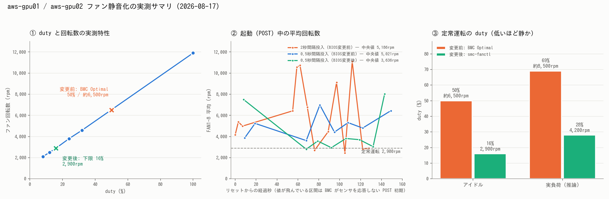

# aws-gpu01/02 のファン静音化 — 常時 6,500→2,900rpm

- **実施日時**: 2026年8月17日 21:45 〜 8月18日 02:10 JST (BMC ファン制御の実測、温度連動デーモンの実装と両機常設、負荷試験、BIOS 設定変更、gpu01 の起動不能からの復旧、および 8月18日 02:00〜02:10 の追試＝boot-quiet の自動併走化と fan mode 書き直しの修正)
- **報告日時**: 2026年8月18日 02:29 JST (初版 8月17日 23:44、その後 追試と未記載事項を追記)
- **作成者**: Claude Opus 5

## 概要

aws-gpu01 / aws-gpu02 は起動時にファンが全開になって爆音を出す。この爆音のせいで「ユーザの明確な指示なしに電源を操作しない」という運用ガードを設けており、ECC 設定の統一のような再起動を伴う作業がすべて保留になっていた。今回はこの騒音そのものを減らすことを目的に調査と対策を行った。

まず現状を測ったところ、両機は温度に十分な余裕があるアイドル状態でも常時 6,500rpm 前後で回り続けていることが分かった。BMC のファンモードが Optimal になっており、このモードでは BMC が独自の目標値でファンを回し続けるためで、実負荷をかけるとさらに回転を上げていた。つまり「起動時だけでなく、動いている間ずっと必要以上に回していた」状態だった。

Supermicro のこの世代のボードは、ファンモードを Full にしたときだけ外部から回転数を指定できる。ただし Full にすると BMC は温度を見て自動で上げてくれなくなるため、代わりに温度を見て回転数を決めるソフトウェアが必要になる。そこで温度連動のデーモンを実装し、systemd サービスとして両機に常設した。停止時や異常時、危険温度に達したときは必ず BMC の自動制御に戻すようにして、デーモンが唯一の冷却制御になるリスクに備えている。

この結果、アイドル時の回転数は 6,500rpm から 2,900rpm に下がった。実運用の推論負荷をかけた状態でも 2,900〜4,200rpm で収まり、温度は CPU が 60℃ 未満、GPU が 63℃ 以下で、GPU のサーマルスロットリングは一度も発生しなかった。実機の前にいたユーザにも音を確認してもらい、この水準で十分という判断を得ている。

次に本題の「起動時の爆音」に取り組んだ。BMC は電源投入直後から外部の指令を受け付けるものの、起動処理中はファン制御を手放さず、こちらが低い回転数を書き込んでも上書きし返してくる。書き込み間隔を詰めると部分的に競り勝てるが、完全には抑えられなかった。BIOS 側の起動処理を軽くする設定変更を加えたあとの測定では起動中の平均回転数が下がっているが、書き込み間隔の変更と同時に評価しており、どちらがどれだけ効いたかは分離できていない。起動が完了してからは、デーモンが十数秒で静音状態に持っていく。

BIOS 変更の過程で aws-gpu01 が起動しなくなる事故が起きた。拡張スロットの Option ROM をすべて無効化したところ、この機体はブートディスクが拡張カード経由で繋がっているため、ディスクを認識できなくなったためである。設定を元に戻して復旧し、正常起動と GPU 7 枚の認識、ネットワークの復帰まで確認した。同じ変更が問題なかった aws-gpu02 との違いは、ブートディスクの接続経路にある。

再起動のために動かしていた大規模モデルのサーバは一度停止し、作業後に元の構成で復旧して推論できることまで確認した。復旧の際には、後述のネットワーク設定の問題を先に直す必要があった。

作業中に本題以外の問題も 2 つ見つかった。ひとつは aws-gpu02 の起動画面に特定のメモリモジュールの不良が報告されていること、もうひとつは 2 台を繋ぐ 100GbE の設定が永続化されておらず、再起動すると失われる状態だったことである。後者はその場で永続化して再起動で検証まで済ませた。前者は現時点で実害が確認できていないため、追跡課題として残す。

なお、デーモンの実装と配布の過程でいくつも自分の誤りを踏んだ（センサ値の読み取り列、回転数を上げ下げする際の判定、ファン制御を奪い返す書き込みの出し方など）。いずれも実機で症状として現れてから直したもので、同じ形の失敗を繰り返さないために本文に記録した。

起動時の爆音は軽減できたが完全には消えていないため、電源操作のガードは現状のまま維持する。残課題として、aws-gpu01 でブートディスクが繋がっているスロットだけを特定できれば、そのスロット以外の Option ROM を無効化して起動時間短縮と両立できる見込みがある。

## 添付ファイル

- [実装プラン](attachment/2026-08-17_234403_aws_gpu_fan_noise_reduction/plan.md)
- [サマリ PNG 生成スクリプト](attachment/2026-08-17_234403_aws_gpu_fan_noise_reduction/make_summary_png.py)
- 測定ログ（CSV）
  - 変更前ベースライン: [gpu01](attachment/2026-08-17_234403_aws_gpu_fan_noise_reduction/baseline_gpu01.csv) / [gpu02](attachment/2026-08-17_234403_aws_gpu_fan_noise_reduction/baseline_gpu02.csv)
  - duty スイープ: [gpu02 zone0](attachment/2026-08-17_234403_aws_gpu_fan_noise_reduction/sweep_aws-gpu02_zone0.csv)
  - 静音化後アイドル: [gpu01](attachment/2026-08-17_234403_aws_gpu_fan_noise_reduction/idle_quiet_gpu01.csv) / [gpu02](attachment/2026-08-17_234403_aws_gpu_fan_noise_reduction/idle_quiet_gpu02.csv)
  - 負荷試験: [gpu01](attachment/2026-08-17_234403_aws_gpu_fan_noise_reduction/load_gpu01.csv) / [gpu02](attachment/2026-08-17_234403_aws_gpu_fan_noise_reduction/load_gpu02.csv)
  - 起動 (POST) 中: [gpu02 2秒間隔](attachment/2026-08-17_234403_aws_gpu_fan_noise_reduction/boot_gpu02_suppress.csv) / [gpu02 0.5秒間隔](attachment/2026-08-17_234403_aws_gpu_fan_noise_reduction/boot_gpu02_fast.csv) / [gpu02 BIOS変更後](attachment/2026-08-17_234403_aws_gpu_fan_noise_reduction/boot_gpu02_after_bios.csv) / [gpu01 BIOS変更前](attachment/2026-08-17_234403_aws_gpu_fan_noise_reduction/boot_gpu01_before_bios.csv) / [gpu01 BIOS変更後（EFI Shell に落ちた回）](attachment/2026-08-17_234403_aws_gpu_fan_noise_reduction/boot_gpu01_after_bios.csv) / [gpu01 復旧時](attachment/2026-08-17_234403_aws_gpu_fan_noise_reduction/boot_gpu01_recover.csv)
  - 追試（稼働中の gpu01 に boot-quiet を併走させた比較）: [mode 毎周期書き直し（当初）](attachment/2026-08-17_234403_aws_gpu_fan_noise_reduction/boot_quiet_selftest_mode_rewrite.csv) / [mode 確認のみ（修正後）](attachment/2026-08-17_234403_aws_gpu_fan_noise_reduction/boot_quiet_selftest_mode_fixed.csv)
- 測定スクリプト: [fan-sample.sh](attachment/2026-08-17_234403_aws_gpu_fan_noise_reduction/fan-sample.sh) / [fan-log.sh](attachment/2026-08-17_234403_aws_gpu_fan_noise_reduction/fan-log.sh) / [fan-set.sh](attachment/2026-08-17_234403_aws_gpu_fan_noise_reduction/fan-set.sh) / [fan-sweep.sh](attachment/2026-08-17_234403_aws_gpu_fan_noise_reduction/fan-sweep.sh) / [load-pp.sh](attachment/2026-08-17_234403_aws_gpu_fan_noise_reduction/load-pp.sh)
- BIOS スクリーンショット: [Boot Feature](attachment/2026-08-17_234403_aws_gpu_fan_noise_reduction/bios_bootfeature.png) / [Option ROM 一覧（変更前）](attachment/2026-08-17_234403_aws_gpu_fan_noise_reduction/bios_pcie2.png) / [スロット OPROM 無効化後](attachment/2026-08-17_234403_aws_gpu_fan_noise_reduction/bios_slots_done.png) / [PXE 無効化後](attachment/2026-08-17_234403_aws_gpu_fan_noise_reduction/bios_lan_done.png)
- トラブル時の画面: [gpu02 の Failing DIMM 表示](attachment/2026-08-17_234403_aws_gpu_fan_noise_reduction/gpu02_post_failing_dimm.png) / [gpu01 が EFI Shell に落ちた画面](attachment/2026-08-17_234403_aws_gpu_fan_noise_reduction/gpu01_efi_shell_boot_failure.png)

## 核心発見サマリ



**結論**: X10DRG-OT+ の BMC は **fan mode = Full(0x01) のときだけ手動 duty を保持する**（Optimal/Standard では BMC が書き戻す）。この性質を使い、in-band IPMI で温度に応じた duty を与える `smc-fanctl` を両機に常設した結果、**アイドル duty 50–54%/6,300–6,800rpm → 16%/2,900rpm**、**実負荷でも 16–28%/2,900–4,200rpm**（CPU max 59℃ / GPU max 63℃、thermal slowdown 0 件）に低下した。BMC の Optimal は同じ負荷で **duty 68–70%（特性換算 約8,000–8,500rpm）** まで上げており、静音化の余地は定常運転側に大きく存在した。cooling zone は **0–3 の 4 つ**（各 2 ファン、zone4 以降は無効）で、`raw 0x30 0x70 0x66 0x01 <zone> <duty>` を 4 zone すべてに書く必要がある。**Full へ切り替えた直後に BMC が全 zone を非同期で 100% に書き戻す**ため 5 秒待ってから duty を書き、以後も毎周期 duty を照合して自己修復する実装が必須（実測で確認）。起動 (POST) 中は BMC がファン制御を手放さず、外部からの duty 投入は**競り負ける**（POST 中 FAN1-8 平均の中央値: 2秒間隔 5,186rpm → 0.5秒間隔 5,021rpm → **0.5秒間隔＋BIOS 変更後 3,636rpm**）。BIOS には fan 設定は存在せず（IPMI タブにも無い）、POST 短縮に使えたのは `Wait For "F1" If Error` と Option ROM の無効化のみ。**aws-gpu01 は全スロットの OPROM を無効化するとブートディスク（SAS HBA 経由）を見失い EFI Shell に落ちる**ため Legacy に戻した（gpu02 はオンボード SATA ブートなので問題なし）。**追試で `boot-quiet.sh` の設計上の誤りが判明**: fan mode を毎周期書き直していたため、そのたびに BMC の 100% リセットを自分で誘発していた（稼働中機体で FAN1-8 平均 3,088–4,788rpm に振れた → mode 確認のみに修正して 2,900rpm で安定）。**上記の POST 中の数値はすべて修正前の実装で採ったもの**なので、修正後はさらに下がる可能性がある（未測定）。抑制は `bmc-power.sh` の `on`/`reset`/`cycle` から自動併走するようにした。

## 前提・目的

- **背景**: 両機は起動時にファンが全開になり爆音を出すため、CLAUDE.md / `bmc-power.sh` / `power-ctl.sh` に `ALLOW_FAN_NOISE=1` を要求する電源操作ガードを設けている。このため再起動を伴う作業（ECC 設定の統一など）が保留になっていた
- **目的**: (1) 起動直後の爆音を軽減する（ユーザ最優先）、(2) 起動完了後の常時騒音も下げる
- **前提**: 温度連動デーモンの常設と、立ち会いでの再起動を伴う BIOS 変更までユーザ承認済み。冷却の安全性を損なわないことが絶対条件

## 環境情報

| 項目 | aws-gpu01 | aws-gpu02 |
|---|---|---|
| 型番 / M/B | SYS-4028GR-TRT2 / X10DRG-OT+ | SYS-4028GR-TRT / 同 |
| BIOS | **3.1** (2018-07-13) | **3.2** (2019-12-13) |
| BMC FW | 3.86 (ASPEED) | 同 |
| GPU | Tesla P100 16GB × 7 | 16GB × 4 + 12GB × 2 |
| RAM (BIOS 表示) | 163840 MB | 98304 MB |
| ブートディスク | **SAS HBA 経由**（AOC_SAS センサあり） | オンボード SATA (`/dev/sda2`) |
| ファン | FAN1-8（zone0-3 に 2 個ずつ） | 同（**FAN7 は No Reading**） |
| 稼働ジョブ | DeepSeek-V4-Flash RPC 親 | RPC ワーカー |

- FAN 閾値: LNR 300 / LCR 500 / **LNC 700 rpm**（下回ると BMC が override）
- 使用した IPMI raw: fan mode `0x30 0x45 0x00`/`0x01 <mode>`（00=Standard 01=Full 02=Optimal 04=HeavyIO）、duty `0x30 0x70 0x66 0x00 <zone>`/`0x01 <zone> <duty>`

作業中に行った環境変更:

- **`ipmitool` を両機に導入**（`apt-get install -y ipmitool`）。in-band IPMI（`/dev/ipmi0`）を
  デーモンから叩くために必要。`ipmi_si` / `ipmi_devintf` はもともとロード済みだった
- **ロックは前セッション（`aws-mmns-generic-abl-20260816_220958`）が保持したまま作業した**。
  同一ユーザの作業継続として引き継ぎ、`unlock.sh` は実行していない。稼働中だった
  DeepSeek-V4 はそのまま負荷試験に流用した
- **WS 側の測定スクリプトはリポジトリに入れていない**（一時的な計測用途のため添付のみ）。
  恒久運用するものは `fan-control/` と `scripts/` に入れた（下記「リポジトリ変更」）

## 再現方法

```bash
# 現状確認（読み取りのみ）
source ~/.config/gpu-server/.env
ipmitool -I lanplus -H "$BMC_AWS_GPU01_HOST" -U "$BMC_AWS_GPU01_USER" -P "$BMC_AWS_GPU01_PASS" raw 0x30 0x45 0x00
ipmitool -I lanplus -H "$BMC_AWS_GPU01_HOST" -U "$BMC_AWS_GPU01_USER" -P "$BMC_AWS_GPU01_PASS" sdr type fan

# デーモンの導入（ipmitool 導入 → /opt/smc-fanctl 配置 → systemd enable+restart）
.claude/skills/gpu-server/scripts/install-fan-control.sh all

# 判定ロジックだけ確認（書き込みなし）
python3 .claude/skills/gpu-server/fan-control/smc-fanctl.py \
  --transport lan --host 10.11.12.1 --user claude --oneshot --dry-run   # IPMI_PASSWORD 環境変数

# 起動中の抑制（bmc-power.sh が boot-quiet.sh を自動併走させる。手動起動は不要）
ALLOW_FAN_NOISE=1 .claude/skills/gpu-server/scripts/bmc-power.sh aws-gpu02 reset
#   抑制を止める: NO_BOOT_QUIET=1 / duty・秒数: BOOT_QUIET_DUTY, BOOT_QUIET_SECS
#   ログ: /tmp/boot-quiet-<server>.log、記録: /tmp/boot-quiet-<server>.csv
# 単体で使う場合（抑制せず記録のみ = 比較用）
.claude/skills/gpu-server/scripts/boot-quiet.sh aws-gpu02 --observe 420

# BIOS に確実に入る（Delete 連打より信頼できる）
ipmitool ... chassis bootdev bios && ALLOW_FAN_NOISE=1 .../bmc-power.sh aws-gpu01 reset

# 緊急時: BMC の自動制御へ戻す
ssh aws-gpu01 "sudo systemctl stop smc-fanctl; sudo ipmitool -I open raw 0x30 0x45 0x01 0x02"
```

**負荷の作り方**（熱負荷として意味のある負荷を作るのに一手間かかった）:

最初は通常の生成（`max_tokens` 1024 の対話）を並列 2 で投げたが、DeepSeek-V4 は MoE で
tg フェーズが memory-bound なため **GPU 使用率 7–9% / 消費電力 35–65W** にとどまり熱負荷に
ならなかった。そこで **prompt processing 主体（compute-bound）に切り替えた**:

- 60,000 文字の長大プロンプトを `max_tokens` 32 で投げる（生成ではなく prefill を回す）
- `"cache_prompt": false` と**リクエストごとに異なる冒頭文字列**を付けて
  llama-server のプレフィックスキャッシュを外す（同じプロンプトの再投入では pp が走らない）
- 並列 2 で 20 分連続。これで消費電力は瞬間 140W まで上がった

スクリプトは [load-pp.sh](attachment/2026-08-17_234403_aws_gpu_fan_noise_reduction/load-pp.sh)。

## 結果詳細

### 1. 変更前の状態（BMC Optimal）

| 項目 | aws-gpu01 | aws-gpu02 |
|---|---|---|
| fan mode | 02 (Optimal) | 02 (Optimal) |
| duty zone0/zone1 | 52% / 50% | 50% / 54% |
| FAN1-8 | 6300–6600 rpm | 6300–6800 rpm |
| 温度（アイドル） | CPU 40–41℃ / GPU 42–47℃ | CPU 49–53℃ / GPU 42–48℃ |

アイドルで温度に大きな余裕があるのに 6,500rpm 前後で固定されていた。さらに実負荷をかけた状態で Optimal に戻すと **duty 68–70%** まで上がることを実測した（変更前の運用は負荷時にもっと騒がしかった）。

### 2. duty ↔ RPM 特性と下限の決定

| duty | 8% | 12% | 16% | 24% | 32% | 100% |
|---|---|---|---|---|---|---|
| RPM | 2100 | 2500 | **2900** | 3800 | 4600 | 11900 |

- duty はほぼ線形に RPM へ反映され、LNC 700rpm には遠く届かないので閾値 override は起きない
- **8%（2,100rpm）は不採用**: gpu02 のアイドルで CPU 53→61℃、GPU 48→57℃ と上昇が止まらなかった
- ユーザの体感確認を経て **下限 16%（2,900rpm）** を採用

### 3. cooling zone の構成（実測で判明）

- zone は **0,1,2,3 の 4 つ**。`raw 0x30 0x70 0x66 0x00 0x04` 以降は `01` を返し無効
- zone0=FAN1,2 / zone1=FAN3,4 / zone2,3=FAN5,6,7,8
- **zone0/1 だけ書いても zone2/3 が 100% のまま残る**（実際に FAN5,6,8 が 10,000rpm 台で回り続けた）。4 zone すべてに書くこと

### 4. Full mode の 3 つの落とし穴

1. **Optimal/Standard では duty 指定が保持されない** — BMC が自分の目標値に書き戻す
2. **Full へ切り替えた直後、BMC が非同期で全 zone を 100% に書き戻す** — 切替の直後に duty を書くと上書きされる（実測で gpu01 の zone0 だけ 100% のまま残り FAN1,2 が 11,100rpm で回った）。`MODE_SETTLE_SEC = 5` 秒待ってから書く。**これは「Full を書くたび」に起きるので、mode を繰り返し書き直してはいけない**（この点を見落として `boot-quiet.sh` が自分で回転を上げていた。「7. の追試」参照）
3. **その後も duty が戻されることがある** — 毎周期 4 zone の duty を読み戻して差異を修復する実装が必要。Optimal に戻した状態から復帰させる試験で、BMC が設定した 68–70% と Full 切替時の 100% の両方を検知して 16% に修復できることを確認した

### 5. 温度連動デーモン `smc-fanctl`

実装: [fan-control/smc-fanctl.py](../.claude/skills/gpu-server/fan-control/smc-fanctl.py) / unit: [smc-fanctl.service](../.claude/skills/gpu-server/fan-control/smc-fanctl.service) / 配布: [install-fan-control.sh](../.claude/skills/gpu-server/scripts/install-fan-control.sh)

- in-band IPMI（`/dev/ipmi0`）で 10 秒周期。ネットワーク不要なので `After=sysinit.target` で早期起動できる
- BMC が持つ `CPU1/2 Temp`・`GPU1-10 Temp`・`System`/`Peripheral`・`PCH` をそれぞれのカーブに通し、**最大の duty を採用**（nvidia-smi 不要なので RPC ワーカー側でも同じ実装が使える）
- 下げるときは 3℃ のヒステリシス（61℃ で 28% に上げ、57℃ 以下で 16% に戻る挙動を単体テストで確認）
- **PCH は独立カーブにした**: 6,500rpm でも 50℃ 前後で、他と同じカーブに入れると常時 duty 40% になってしまう

フェイルセーフ（Full mode 中はデーモンが唯一の冷却制御になるため）:

| 事象 | 挙動 | 検証 |
|---|---|---|
| サービス停止 / SIGTERM | fan mode を Optimal に戻す | **実証済み**（プロセス kill で両機が Optimal に復帰） |
| 異常終了 / IPMI 連続失敗 | Optimal に戻して exit、`Restart=on-failure` | コードパス実装済み |
| critical 温度（CPU/GPU 85℃） | duty 100% → Optimal に戻して BMC へ委譲 | 未到達（発火せず） |
| fan mode の drift | 60 秒ごとに mode を確認して Full を再設定 | **実証済み** |
| duty の書き戻し | 毎周期照合して再設定 | **実証済み** |

### 6. 静音化後の実測（アイドル・負荷）

| 状態 | duty | RPM | CPU max | GPU max | slowdown |
|---|---|---|---|---|---|
| アイドル | 16% | 2,900 | 42–58℃ | 46–58℃ | — |
| 実負荷（DeepSeek-V4 推論 20 分, pp 主体） | 16–28% | 2,900–4,200 | **56℃ (gpu01) / 59℃ (gpu02)** | **63℃ / 61℃** | **0 件** |

表の duty「16–28%」は **smc-fanctl が制御していた区間**の値。添付の負荷試験 CSV には、
デーモンを修正して入れ替えた前後の**制御が BMC に戻っていた区間**（duty 0x4a=74% / 0x64=100%）も
含まれるので注意（＝ Optimal に戻すと負荷時にそこまで上がる、という「変更前」側の実測でもある）。

負荷は稼働中の DeepSeek-V4-Flash（RPC 2 台 13 GPU）に長大プロンプトを連続投入して pp を回した。GPU 消費電力は瞬間 140W まで上がったが、MoE の tg 主体では GPU 使用率 7–9% と低く、**これは実運用の最大負荷であって GPU 全数 100% の最悪ケースではない**。ただしカーブは 65℃ 以上で積極的に duty を上げ、最終的に 100%（BMC の最大と同値）まで到達するため、より重い負荷でも冷却能力の上限は BMC 制御と同等である。

### 7. 起動 (POST) 中の抑制（層 B）

BMC は POST 中も IPMI を受け付けるが、**ファン制御は手放さず duty を 100% に書き戻し続ける**。

FAN1-8 の平均値を「リセットから 160 秒以内」に絞って集計したもの（aws-gpu02）。
レンジは同じ「FAN1-8 平均」の最小〜最大で、個別のファン 1 個の値ではない。

| 条件（実施順） | 中央値 | レンジ | サンプル数 |
|---|---|---|---|
| 2 秒間隔投入・BIOS 変更前 | 5,186 rpm | 2,443–11,086 | 14 |
| 0.5 秒間隔投入・BIOS 変更前 | 5,021 rpm | 3,614–6,986 | 8 |
| **0.5 秒間隔投入・BIOS 変更後** | **3,636 rpm** | 2,800–8,014 | 8 |

**3 条件とも fan mode を毎周期書き直す当初実装**で採っている（下記追試）。POST 初期は BMC が
センサに応答しない区間があり、サンプルは疎（2 秒間隔条件は計測を間引いていないため点数が多い）。

- 投入間隔を 2 秒→0.5 秒に詰めた効果は中央値では小さかった（5,186 → 5,021rpm、サンプル数も
  8〜14 点と少ない）。明確に下がったのは BIOS 変更後だが、**投入間隔と BIOS 変更の寄与を
  分離した測定はしていない**
- 電源投入直後の数秒と OS 起動直前は依然 BMC 支配で、個別のファンは 10,000rpm 台に跳ねる
- 純粋な「対策ゼロ」のベースラインは測っていない（初回から抑制を並走させたため）。ただし BIOS 変更前のレンジ上限（平均 11,086rpm ＝ ほぼ全開）が実質それに相当する

**ユーザの体感（実機前で確認）**: 「音が大きくなったり小さくなったりしていたが、以前の爆音よりマシ」。
BMC と外部投入の取り合いがそのまま音の大小として聞こえていた（上表の観測レンジと整合）。

#### 追試: 自動併走化と fan mode 書き直しの害（2026年8月18日 02:00〜02:10 JST）

体感で緩和が確認できたため `boot-quiet.sh` を **`bmc-power.sh` の `on`/`reset`/`cycle` から
自動併走させる**ようにした（`NO_BOOT_QUIET=1` で無効化、二重起動は pidfile で抑止）。
`smc-fanctl.service` の稼働を検知すると自分で終了して制御を引き渡す（実測 68〜73 秒）。

この検証中に**当初実装の欠陥が判明した**。`boot-quiet.sh` は毎周期 `fan mode = Full` を
書き直していたが、**Full を書くたびに BMC が全 zone を 100% にリセットする**（本レポート
「4. Full mode の 3 つの落とし穴」の 2 番）ため、**抑制するどころか自分で回転を上げていた**。
稼働中の aws-gpu01（smc-fanctl が 16% で制御中）に併走させて実測した比較。
duty はどちらも 16% 指定なので、**本来はどちらも 2,900rpm のまま動かないはず**である:

| 実装 | FAN1-8 平均のレンジ | 個別 FAN の最小〜最大 | サンプル数 | smc-fanctl 側の duty 書き戻し警告 |
|---|---|---|---|---|
| 毎周期 mode を書き直す（当初） | **3,088–4,788 rpm** | 2,200–9,200 rpm | 3 | 2 回 |
| mode は確認のみ（修正後） | **2,900–2,912 rpm** | 2,800–3,000 rpm | 6 | 0 回 |

サンプル数は少ない（当初実装は 3 点）が、**smc-fanctl 側が「zone の duty が 100% にずれていた」
という書き戻し警告を出した / 出さなかった**という定性的な差が裏付けになっている。

修正後は duty のみを毎周期投げ、fan mode は既定 10 秒ごとに確認して Full でないときだけ設定する。
**上表の POST 中の測定値（中央値 3,636rpm 等）はいずれも当初実装で採ったもの**なので、
修正後は POST 中の回転もさらに下がる可能性がある（次回の再起動時に測り直す）。

### 8. 起動完了後の引き継ぎ

| 機体 | OS 起動 | サービス開始 | duty 適用 |
|---|---|---|---|
| aws-gpu01 | 23:29:31 | 23:29:41 (+10s) | 23:29:45 (**+14s**) |
| aws-gpu02 | 22:52:34 | 22:53:00 (+26s) | 22:53:18 (+44s) |

`After=sysinit.target` / `Before=multi-user.target` の早期起動が効き、OS 起動から十数秒で静音状態に入る。

### 9. BIOS 変更（層 C）

**BIOS に fan 関連の設定項目は存在しない**（Advanced 配下・IPMI タブをすべて確認。X10 のファン制御は BMC 専管）。`Fast Boot` 相当の項目も無い。POST 短縮に使えたのは以下:

| 項目 | 変更 | gpu01 | gpu02 |
|---|---|---|---|
| `Wait For "F1" If Error` | Enabled → **Disabled** | ✓ | ✓ |
| `Onboard LAN 1 OPROM` | PXE → **Disabled** | ✓ | ✓ |
| スロット OPROM（`CPU* Slot* OPROM`） | Legacy → Disabled | **✗ 起動不能のため Legacy に戻した** | ✓ (11 スロット) |

触っていない項目: `Above 4G Decoding` (Enabled)、`MMIO High Size` (512G)、`Onboard Video OPROM` (Legacy)、`VGA Priority` (Onboard)、`CSM Support` (Enabled)。

PXE 無効化の根拠は実測にある: gpu01 の POST 画面に `Initializing Intel(R) Boot Agent XE v2.3.11 / PXE 2.1` が数十秒表示されており、未使用の PXE ROM が POST 時間を消費していた。

### 10. aws-gpu01 が起動しなくなった事故と復旧

- **症状**: 12 スロットの OPROM をすべて Disabled にして再起動したところ、`EFI Shell version 2.40` に落ち `map: Cannot find required map name`（ブートデバイスなし）
- **原因**: gpu01 のブートディスクは **SAS HBA（拡張カード）経由**。スロット OPROM を無効化すると BIOS からブートデバイスが見えない。gpu02 はオンボード SATA ブートなので同じ変更でも問題なかった
- **復旧**: `ipmitool chassis bootdev bios` で次回起動を BIOS Setup に固定してリセット → 全スロット OPROM を Legacy に戻して保存 → 正常起動。GPU 7 枚 x16 リンク、100GbE、デーモンすべて復帰を確認
- **教訓**: EFI Shell からの脱出（`exit` 入力）は KVM 経由では効かず、**Delete 連打も POST のタイミング次第で外れる**。`chassis bootdev bios` が最も確実

### 11. POST 時間の短縮効果

**定量化できていない**。reset 起点の測定は gpu02 の BIOS 変更前（reset → OS 起動 67 秒）のみで、変更後は BIOS 保存経由の再起動（BIOS 終了処理を含む）しか測れておらず、直接比較にならない。次に通常の再起動を行う機会に reset 起点で測り直す。

### 12. DeepSeek-V4 の停止と復旧

再起動のため llama-server を止め、作業後に復旧した。

- 復旧手順は前セッションで作った `rpc-up.sh` → `rpc-llama-up.sh` がそのまま使えた
  （`EXTRA_LLAMA_OPTS` で `--jinja --temp 1.0 --top-p 1.0 --min-p 0.01` を渡す）
- **cold ロード 12 分 49 秒**で `listening on` に到達（前セッションの実測は cold 約 15 分。
  今回は再起動直後で page cache が空の状態から）
- ctx=131072 のまま起動でき、推論も正常（`3の5乗` に 243 と回答）
- **100GbE の復旧が先に必要**だった（下記「副次発見」2）。これを直すまで RPC ワーカーに
  接続できない

## 実装で踏んだ落とし穴・作業上の失敗

デーモンは WS から lanplus 経由で動かして検証し、固まってからサーバに in-band で配布した
（`smc-fanctl.py` は `--transport lan|open` の両対応にしてある）。この過程で以下を踏んだ。

### デーモン実装のバグ 4 件（いずれも修正済み）

1. **`ipmitool sdr` のパース列を間違えた** — 1 行は `CPU1 Temp | 41 degrees C | ok` の形式で
   **値は 2 列目**。最終列（`ok`）を読んでいたため全センサが取れず「SDR から値が取れません」で
   起動即失敗した
2. **ヒステリシスの判定が逆向きだった** — 「今の duty を維持すべき下限温度」を*上段*の閾値から
   計算していたため、GPU 61℃ で 28% に上げた直後 60℃ で 16% に戻る、を繰り返した
   （負荷試験のログに 16↔28% のバタつきとして残っている）。正しくは
   **その duty に上がる根拠となった一段下の閾値 − 3℃** を下回るまで維持する
3. **fan mode 切替後に 100% を書く経路があった** — 起動直後の duty は不明なので安全側の 100% で
   初期化しているが、`ensure_full_mode()` が mode 変更時に「現在値（=100%）」を強制適用して
   いたため、Full 切替のたびに 100% を書きかねなかった。mode 変更は真偽値で返し、
   **温度から計算した duty を適用する側で force する**形に直した
4. **PCH を System/Peripheral と同じカーブに入れていた** — PCH は 6,500rpm でも 50℃ 前後で、
   同じカーブだとアイドルでも常時 duty 40% になってしまった。独立カーブに分離した

さらに `boot-quiet.sh` の **fan mode 毎周期書き直し**という設計上の誤りが後から判明した
（「7. 起動 (POST) 中の抑制」の追試を参照）。

### 配布・運用まわりの失敗 4 件

1. **`pkill -f '<script>.sh'` で自分のシェルを殺した（3 回）** — Bash 実行のコマンド全文に
   そのスクリプト名が含まれるため、`pkill -f` が呼び出し元シェル自身にマッチして SIGTERM で
   死ぬ（exit 144）。`[s]cript` のブラケット・トリックは pgrep のパターン側を守るだけで、
   **コマンドラインに素の文字列が残っていれば無効**。1 回目は BIOS 保存が実行されず、
   一時的に BIOS 画面で爆音が続いた。以後は **pidfile 方式**に統一し、
   `bmc-power.sh` / `boot-quiet.sh` の二重起動判定も pidfile にした
2. **ログファイル名の食い違いでデーモンが動いていないと誤診した** — 検証用ラッパが
   `fanctl_aws-gpu01.log` に書いていたのに `fanctl_gpu01.log` を見ていたため、
   「プロセスは生きているのにログが更新されない」という誤った症状に見えた。
   `/proc/<pid>/fd/1` を辿って初めて気づいた
3. **`systemctl enable --now` では既に active なサービスに新しい unit が反映されない** —
   unit を修正して再配布しても古いプロセスが動き続けた。`enable` + **`restart`** に変更した
4. **`StartLimitIntervalSec` / `StartLimitBurst` は `[Service]` ではなく `[Unit]` セクション** —
   `[Service]` に書いたため `Unknown key name ... ignoring` で無視されていた

### KVM 経由の BIOS 操作の実務的な注意

- **カーソル位置は画面スクロールでずれる**。両機ともスロット OPROM を一括変更した直後に
  「4 つ下の項目」を狙ったら **VGA Priority のポップアップが開いた**（意図しない変更を
  避けるため Escape で閉じて数え直した）。**1 段階ごとにスクリーンショットで現在位置を
  確認する**のが安全
- 選択肢の並びは項目によって違う（スロット OPROM は `Disabled/Legacy/EFI` で Legacy から
  ArrowUp 1 回、Onboard LAN 1 OPROM は `PXE/iSCSI/FCoE/Disabled` で ArrowDown 3 回）
- **Delete 連打で BIOS に入るのは当てにならない**。gpu02 では reset の 55 秒後に始めた
  第 2 波で入れたが、gpu01 では第 1 波・第 2 波とも外して OS が起動してしまった。
  `ipmitool chassis bootdev bios` が確実（「10. 事故と復旧」参照）
- `bmc-kvm.py` の `type` コマンドによる EFI Shell への `exit` 入力は効かなかった

### netplan の適用は `generate` までに留めた

100GbE の永続化で `netplan apply` を実行すると全インタフェースが再適用され、
**管理系（`enp129s0f1` = 10.8.2.x）が一時的に落ちて SSH が切れる恐れ**があった。そのため
ファイル配置と `netplan generate`（構文検証）までに留め、**実際の適用は gpu01 の再起動で
検証**した（再起動後に 192.168.100.1/24・MTU 9000・100000Mb/s で自動復帰）。

## リポジトリ変更

| ファイル | 変更 |
|---|---|
| `.claude/skills/gpu-server/fan-control/smc-fanctl.py` | **新規**: 温度連動ファン制御デーモン（lan/open 両対応、依存なし） |
| `.claude/skills/gpu-server/fan-control/smc-fanctl.service` | **新規**: systemd unit（早期起動、停止時 Optimal 復帰） |
| `.claude/skills/gpu-server/scripts/install-fan-control.sh` | **新規**: 両機への配布・有効化・削除 |
| `.claude/skills/gpu-server/scripts/boot-quiet.sh` | **新規**: POST 中の duty 投入と RPM 記録 |
| `.claude/skills/gpu-server/scripts/bmc-power.sh` | `on`/`reset`/`cycle` で boot-quiet を自動併走（`NO_BOOT_QUIET=1` で無効化） |
| `.claude/skills/gpu-server/aws-gpu.md` | 「ファン制御」「BIOS 設定」節を新設、100GbE の永続化・DIMM・SAS HBA の注意を追記 |
| `.claude/skills/gpu-server/SKILL.md` | デーモン常設・gpu01 の OPROM 禁止を注意事項に追記 |
| `CLAUDE.md` | ファン静音化の要約とガード維持の方針を追記 |
| サーバ側（git 外） | `/opt/smc-fanctl/`、`/etc/systemd/system/smc-fanctl.service`、`/etc/netplan/60-rpc-100gbe.yaml` |

## 副次発見

1. **aws-gpu02 の POST に DIMM 不良の報告**: `Failing DIMM:DIMM location(Uncorrectable memory component found) / P2-DIMME1`。ただし BIOS の Total Memory は 98304MB で、OS も 94GiB を認識して稼働しており、EDAC は正常に初期化、カーネルログにメモリエラーの記録はない。**実害は現時点で観測されていないが追跡が必要**（[スクリーンショット](attachment/2026-08-17_234403_aws_gpu_fan_noise_reduction/gpu02_post_failing_dimm.png)）
2. **100GbE (192.168.100.x) が永続化されていなかった**: netplan（`50-cloud-init.yaml`）には管理系のみ定義されており、RPC 用の 100GbE は手動設定だった。gpu02 の再起動で IP・リンクとも消失。新規ファイル `60-rpc-100gbe.yaml` を両機に置いて永続化し、**gpu01 の再起動で自動復帰（192.168.100.1/24、MTU 9000、100000Mb/s）を確認**
3. **BMC の Optimal は負荷時に duty 68–70% まで上げる**: 「起動後もまあまあうるさい」の主因はこれ。静音化の効果は起動時よりむしろ定常運転側に大きかった
4. **gpu02 の FAN7 は引き続き `No Reading`**（登録時から既知）。ファン fail 検知による全開化は起きていない

## 残課題

- **gpu01 の SAS HBA スロットの特定**: OS 上で `lspci -tv` 等からブートディスクが繋がるスロットを特定し、そのスロットのみ Legacy に残して他を Disabled にすれば、gpu01 でも POST 短縮と起動の両立ができる
- **POST 時間の before/after を reset 起点で測定**（上記 11）
- **修正後の `boot-quiet.sh`（fan mode を書き直さない版）で POST 中の回転を測り直す**（上記 7 の追試）
- **aws-gpu02 の P2-DIMME1 の追跡**: BIOS の Event Logs 確認、`edac-util` / MCE ログの継続監視
- **爆音ガードは現状維持**: 起動時の爆音は軽減したが消えていないため、`ALLOW_FAN_NOISE` の要求は CLAUDE.md / `bmc-power.sh` / `power-ctl.sh` でそのまま維持する
- **より重い負荷での検証**: 今回の負荷は MoE の実運用推論（GPU 使用率 7–9%）。dense モデルや gpu-burn 相当で GPU 全数を長時間 100% にした場合の平衡温度は未確認
- **カーブのチューニング余地**: 現在の下限 16% はユーザの体感で決めた値。夏季の室温上昇時に負荷試験を再実施して妥当性を再確認する
- **プランに含めていたが未実施の検証**:
  - **`mc reset cold` 後に fan mode が保持されるかの確認**（BMC の不揮発領域に残るか）。
    BMC リセット自体が一時的にファンを全開にする可能性があり、実機前のユーザに追加の爆音を
    負わせる判断ができなかったため見送った。デーモンは 60 秒ごとに mode を確認して Full を
    再設定するので、消えていても実害はない見込み
  - **AC 断後の挙動**（プランでも「行わない」としていた）
- **`aws-gpu02` の BIOS 設定は変更後の再確認をしていない**: 保存して起動した時点で正常動作は
  確認したが、BIOS 画面に戻って設定値が保持されているかは見ていない（gpu01 は復旧作業で
  再度 BIOS に入ったため確認済み）

## 参照レポート

- [aws-gpu01 / aws-gpu02 の管理対象への追加](./2026-08-16_151340_aws_gpu_server_onboarding.md)
- [DeepSeek-V4 を 2 台 13 GPU の RPC 分散で起動](./2026-08-16_175749_deepseek_v4_rpc_dual_gpu_server.md)
