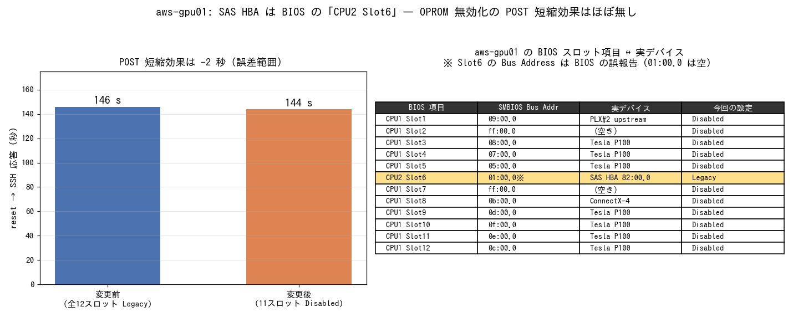

# aws-gpu01 の SAS HBA は BIOS の「CPU2 Slot6」

- **実施日時**: 2026年8月18日 17:54 〜 19:20 JST (非破壊調査 → BIOS 変更と再起動 4 回による実機検証・記録)
- **報告日時**: 2026年8月18日 19:20 JST
- **作成者**: Claude Opus 5

## 概要

aws-gpu01 は起動に約 150 秒かかっており、その間ファンが唸る区間を縮めたいという動機から、GPU が持つ Option ROM を BIOS で無効化することを検討していた。ところが前回のセッションでスロットの Option ROM をすべて無効化したところ、ブートディスクを見失って起動できなくなる事故が起きている。ブートディスクが拡張カードの SAS HBA 経由でつながっているためだが、BIOS の設定画面に並ぶスロット項目のうち、どれがその HBA を指しているのかが分からないままだった。そこで今回は、まず HBA がどのスロット項目に対応するのかを突き止めることを目的とした。

前半では、サーバを再起動せずに分かることを洗い出した。PCI のツリー構造、ACPI が持つスロット情報、SMBIOS のスロット一覧、そして同型機との比較である。その結果、HBA は 2 番目の CPU 側につながる唯一の拡張カードであり、GPU と 100GbE カードはすべて 1 番目の CPU 側にぶら下がっていることが分かった。さらに、この機体が昔ながらのレガシー方式で起動しており、HBA の Option ROM が無いとブートディスクを認識できない構造であることも確認できた。前回の事故はこれで完全に説明がつく。

SMBIOS のスロット一覧を精査したところ、12 項目のうち 1 つだけ辻褄の合わない項目があった。その項目は「使用中」と報告されているのに、参照先として書かれている場所には実際には何も刺さっていない。そして 12 項目の中で唯一、2 番目の CPU 側に属するとラベルされていた。HBA が 2 番目の CPU 側の唯一の拡張カードであることと合わせると、この項目こそが HBA を指しており、参照先の情報だけが誤って報告されている、という筋書きが最も自然だった。

後半はこの見立てを実機で確かめた。稼働中の言語モデルを停止し、比較用に変更前の起動時間を測ったうえで、疑わしい 1 項目だけを従来のまま残し、他の 11 項目をすべて無効化して再起動した。結果、サーバは正常に起動した。しかも起動途中の画面には SAS カードのファームウェアが初期化を進める表示が出ており、他の項目をすべて切ってもこのカードの Option ROM だけは生きていることが目に見える形で確認できた。これで、当該項目が HBA であることが確定した。

一方で、本来の動機であった起動時間の短縮はほとんど得られなかった。変更前と変更後を同じ条件で測り直したところ、差はわずか 2 秒で、測定のばらつきの範囲に収まる。GPU の Option ROM は起動時間の主な要因ではなく、残さざるを得ない SAS カードの初期化とメモリの初期化のほうが支配的だということになる。同型のもう 1 台が速く起動するのは、GPU の枚数やメモリ量の違い、そしてそちらがオンボードのディスクから今風の方式で起動していることの合算とみるのが妥当である。

以上より、当初の「Option ROM を切って起動を速くする」という道筋は、この機体では実質的に行き止まりであることが分かった。ただし、どのスロット項目に触ってはいけないかが判明したので、今後 BIOS を触る際に同じ事故を繰り返す恐れは無くなった。BIOS の設定はユーザの判断により変更後の状態のまま維持している。動作面では GPU 7 枚、SAS カード、100GbE、ファン制御デーモンのいずれも正常に復帰していることを確認済みである。

なお、停止した言語モデルはユーザの指示により復旧していない。必要になった時点で従来の手順で起動できる。

## 添付ファイル

- [実装プラン](attachment/2026-08-18_185344_aws_gpu01_sas_hba_slot_id/plan.md)
- [gpu01 SMBIOS スロット一覧 (dmidecode -t 9)](attachment/2026-08-18_185344_aws_gpu01_sas_hba_slot_id/gpu01_dmidecode_t9.txt)
- [gpu01 lspci -vv 全体](attachment/2026-08-18_185344_aws_gpu01_sas_hba_slot_id/gpu01_lspci_vv.txt) / [gpu01 PCIe ツリー](attachment/2026-08-18_185344_aws_gpu01_sas_hba_slot_id/gpu01_lspci_tree.txt)
- [gpu02 SMBIOS スロット一覧](attachment/2026-08-18_185344_aws_gpu01_sas_hba_slot_id/gpu02_dmidecode_t9.txt) / [gpu02 PCIe ツリーとブート方式](attachment/2026-08-18_185344_aws_gpu01_sas_hba_slot_id/gpu02_pcie_boot.txt)
- 起動時間 CSV: [変更前](attachment/2026-08-18_185344_aws_gpu01_sas_hba_slot_id/boot_baseline.csv) / [BIOS 保存経由](attachment/2026-08-18_185344_aws_gpu01_sas_hba_slot_id/boot_after_bios.csv) / [変更後 reset 起点](attachment/2026-08-18_185344_aws_gpu01_sas_hba_slot_id/boot_after_oprom.csv)
- BIOS 画面: [変更前](attachment/2026-08-18_185344_aws_gpu01_sas_hba_slot_id/bios_slots_before.png) / [変更後](attachment/2026-08-18_185344_aws_gpu01_sas_hba_slot_id/bios_slots_after.png)
- [POST 中の MegaRAID OpROM 実行画面](attachment/2026-08-18_185344_aws_gpu01_sas_hba_slot_id/post_megaraid_oprom.png)
- [サマリ PNG 生成スクリプト](attachment/2026-08-18_185344_aws_gpu01_sas_hba_slot_id/make_summary_png.py)

## 核心発見サマリ



**結論**: aws-gpu01 の SAS HBA (`82:00.0` LSI MegaRAID SAS-3 3108) は BIOS の **`CPU2 Slot6 PCI-E x16 OPROM`** が制御している。この 1 項目だけを `Legacy` に残し他の 11 項目を `Disabled` にした状態で正常起動し、POST 画面に `AVAGO MegaRAID SAS-MFI BIOS` の実行が確認できた。SMBIOS Type 9 は当該スロットの Bus Address を `0000:01:00.0` と報告するが、**そこにデバイスは存在せず**（上流のルートポート `00:01.0` が `LnkSta Width x0` でリンク未確立）、**BIOS の誤報告**である。一方 POST 短縮効果は **146 秒 → 144 秒 (−2 秒)** にとどまり、GPU の VGA OpROM は起動時間の主因ではないことが判明した。

## 前提・目的

- **背景**: 2026-08-17 に 12 スロットの OPROM をすべて `Disabled` にしたところ EFI Shell に落ちて起動不能になった（[前回レポート](./2026-08-17_234403_aws_gpu_fan_noise_reduction.md) の「10. aws-gpu01 が起動しなくなった事故と復旧」）
- **目的**: (1) どの BIOS スロット項目が SAS HBA なのかを特定する、(2) GPU の OPROM を無効化して POST 時間を短縮する
- **前提**: DeepSeek-V4 稼働中のため停止が必要。ユーザ指示により**復旧はしない**。再起動は `ALLOW_FAN_NOISE=1` 必須

## 環境情報

| 項目 | 値 |
|---|---|
| 機体 | aws-gpu01 (Supermicro SYS-4028GR-TRT2) |
| マザーボード | Supermicro X10DRG-O(T)+ |
| BIOS | Version 3.1 / 2018-07-13（Build 11:39:11）、CPLD 02.a1.02 |
| メモリ | 163840 MB / 1600 MT/s |
| GPU | Tesla P100 PCIe 16GB × 7 |
| ブートディスク | `sda` 1.1TB → `0000:82:00.0` LSI MegaRAID SAS-3 3108 [Invader] |
| **ブート方式** | **Legacy BIOS (CSM)** — `/sys/firmware/efi` が存在せず `efibootmgr` も空 |
| 比較機 aws-gpu02 | SYS-4028GR-TRT、BIOS Version 3.2 / 2019-12-13、**UEFI ブート**（`/boot/efi` あり）、オンボード SATA |

## 再現方法

```bash
# 1) 非破壊調査（再起動不要）
ssh aws-gpu01 "sudo dmidecode -t 9"                       # SMBIOS スロット一覧
ssh aws-gpu01 "sudo lspci -vv"                            # SltCap の Physical Slot Number
ssh aws-gpu01 "lspci -tvnn"                               # PCIe ツリー
ssh aws-gpu01 "cat /sys/bus/pci/devices/0000:82:00.0/firmware_node/path"   # ACPI パス
ssh aws-gpu01 "ls -d /sys/firmware/efi || echo Legacy"    # ブート方式

# 2) BIOS 変更（KVM 経由）
source ~/.config/gpu-server/.env
ipmitool -I lanplus -H "$BMC_AWS_GPU01_HOST" -U "$BMC_AWS_GPU01_USER" -P "$BMC_AWS_GPU01_PASS" \
  chassis bootdev bios
ALLOW_FAN_NOISE=1 .claude/skills/gpu-server/scripts/bmc-power.sh aws-gpu01 reset
# 約 2 分後: Advanced → PCIe/PCI/PnP Configuration → PCI Devices Option Rom Setting
# 各項目で Enter → ArrowUp (Legacy→Disabled) → Enter、最後に F4 → Enter
```

## 結果詳細

### 1. HBA の物理的な位置（非破壊調査）

| 項目 | 実測値 |
|---|---|
| デバイス | `82:00.0` Broadcom/LSI MegaRAID SAS-3 3108 [Invader] |
| 接続先 | CPU2 のルートポート `80:03.0`（ACPI `\_SB.PCI1.QR3A` = Port 3A） |
| スロット幅 | ルートポートの `LnkCap` は **x16**、`LnkSta` は x8（x8 のカードが x16 スロットに載る） |
| PCIe `SltCap` | `Slot #4`、ACPI `_SUN` = 4（**BIOS の SLOT 名とは別体系**） |
| CPU2 側の他デバイス | オンボード X540 (`81:00.0`, `QRP0`) のみ |

GPU 7 枚と Mellanox ConnectX-4 は**すべて CPU1 側**にある。

- `00:02.0`（`BR2A`, `Slot #2`）→ PLX#1 → bus 05 / 07 / 08 に P100 3 枚（bus 04・06 は空きポート）
- `00:03.0`（`BR3A`, `Slot #3`）→ PLX#2 → bus 0b に ConnectX-4、0c / 0d / 0e / 0f に P100 4 枚
- `00:01.0`（`Slot #1`）はリンク未確立（`LnkSta Width x0`）

### 2. Legacy BIOS ブートである（事故原因の確証）

`/sys/firmware/efi` が存在せず `efibootmgr` も何も返さない。したがってブートには MegaRAID の
**Legacy Option ROM (INT 13h) が必須**であり、「スロット OPROM を全 `Disabled` → ブートデバイス消失 → EFI Shell」
という前回の症状と完全に整合する。**「原因は OPROM 以外（Boot Order の再構成など）」という仮説は否定できる。**

比較として **aws-gpu02 は UEFI ブート**（`/sys/firmware/efi` あり、`sda1` が `/boot/efi`）かつ
オンボード SATA なので、同じ変更をしても影響が無かった。

### 3. SMBIOS Type 9 と BIOS 項目の対応（gpu02 で 1:1 一致を確認）

BIOS 実画面の項目名は `CPU1 Slot1 PCI-E x16 OPROM` … と **SMBIOS の `Designation` に一致する**。
gpu02 では SMBIOS が 11 エントリ、gpu01 では 12 エントリで、それぞれ BIOS 画面の項目数と一致した
（前回レポートのスクリーンショットは gpu02 のもので 11 項目だった）。

| BIOS 項目 (= SMBIOS Designation) | Bus Address | Current Usage | 実際に居るデバイス |
|---|---|---|---|
| CPU1 Slot1 | 09:00.0 | Available | PLX#2 upstream |
| CPU1 Slot2 | ff:00.0 | Available | なし |
| CPU1 Slot3 / 4 / 5 | 08 / 07 / 05:00.0 | In Use | Tesla P100 |
| **CPU2 Slot6** | **01:00.0** | **In Use** | **SAS HBA (`82:00.0`)** ← Bus Address は誤報告 |
| CPU1 Slot7 | ff:00.0 | Available | なし |
| CPU1 Slot8 | 0b:00.0 | In Use | Mellanox ConnectX-4 |
| CPU1 Slot9 / 10 / 11 / 12 | 0d / 0f / 0e / 0c:00.0 | In Use | Tesla P100 |

`CPU2 Slot6` は 12 項目で唯一 "CPU2" とラベルされ、かつ **In Use なのに参照先 `01:00.0` にデバイスが
居ない**（上流のルートポート `00:01.0` は `LnkSta Width x0` でリンク未確立）という矛盾を持つ。
CPU2 側の拡張カードは HBA 1 枚だけなので、この項目が HBA を指していると推定した。

**ただし SMBIOS の `Current Usage` / `Bus Address` は全体として信頼できない**。`CPU1 Slot1` も
`Available` と報告されるが Bus Address 先の `09:00.0` には PLX が実在する。したがって上表は
「BIOS 項目名の一覧」としては正確だが、**HBA の特定を SMBIOS だけで確定することはできず、
決め手は次節の実機検証である**。

### 4. 実機検証 — `CPU2 Slot6` だけ Legacy に残して起動

`CPU1 Slot1〜5` と `CPU1 Slot7〜12` の 11 項目を `Disabled`、`CPU2 Slot6` のみ `Legacy` に設定。

- **正常起動した**（EFI Shell に落ちなかった）
- POST 画面に `AVAGO MegaRAID SAS-MFI BIOS Version 6.36.00.2 / F/W Initializing Devices` が表示され、
  **HBA の OpROM が実行されていることを目視で確認**
- 起動後: GPU 7 枚認識、`82:00.0` 認識、`smc-fanctl` active、100GbE (192.168.100.x) 復帰

他の 11 項目はすべて `Disabled` なので、この OpROM を実行させているのは `CPU2 Slot6` 以外にありえない。
「HBA の OpROM はどのスロット項目にも紐づかず常に実行される」という可能性も考えられるが、それなら
**2026-08-17 に 12 項目すべてを `Disabled` にしたときも起動できたはず**で、実際に起動不能になった事実と
矛盾する。よって **`CPU2 Slot6` = SAS HBA と確定する。**

### 5. POST 時間 — 短縮効果はほぼ無し

| 条件 | reset → ping | reset → SSH |
|---|---|---|
| 変更前（全 12 スロット Legacy） | 146 秒 | **146 秒** |
| 変更後（11 スロット Disabled） | 144 秒 | **144 秒** |
| （参考）BIOS 保存経由の起動 | 159 秒 | 163 秒 |

**差は 2 秒**で、測定粒度（2 秒間隔ポーリング）と同オーダー。**GPU 7 枚の VGA OpROM は POST 時間の主因ではない。**
残さざるを得ない MegaRAID OpROM の `F/W Initializing Devices` と、160GB のメモリトレーニングが支配的とみられる。
なお BIOS 保存経由の起動は BIOS 終了処理を含むため 163 秒と長く、reset 起点の値とは比較できない。

前回レポートの「11. POST 時間の短縮効果 — 定量化できていない」は、本測定で解消した。

## 副次発見

- **ACPI `_SUN` / PCIe `SltCap` の Slot 番号は BIOS の SLOT 名と一致しない**。
  gpu01 では `00:01.0`=Slot #1、`00:02.0`=Slot #2、`00:03.0`=Slot #3、`80:03.0`=Slot #4 と
  単純な連番が振られており、BIOS 画面の `CPU1 Slot1`… とは別体系。スロット特定にこの値は使えない
- **PLX 下流ポートの `SltCap` は 4/8/12/16/20** で、PLX 内部のポート番号由来。これも BIOS の番号ではない
- **BMC の Redfish は使えない**（`/redfish/v1/Chassis/1/PCIeSlots` などが 404）。mi25 と同様ライセンス無し
- `sudo dmidecode -t 41`（オンボードデバイス）は `Onboard IGD` / `Onboard LAN` / `Onboard 1394` の
  3 件を返すが、**Bus Address が実在しない値**（`00:19.0` / `03:1c.2`）でテンプレートのまま。HBA は含まれない
- gpu01 と gpu02 は **BIOS リビジョンが異なる**（gpu01 = 3.1 / 2018-07-13、gpu02 = 3.2 / 2019-12-13）。
  SMBIOS のスロット数も 12 / 11 と異なる（GPU ドーターボード構成の差によるものと推測されるが、未確認）
- BIOS の `PCIe/PCI/PnP Configuration` には `Exclude Slot 7` という項目があり `No` のまま。今回は触っていない

## 結論・対応

- **aws-gpu01 で触ってはいけないのは `CPU2 Slot6 PCI-E x16 OPROM`**。ここを `Disabled` にすると
  ブートディスクを見失う。他の 11 項目は `Disabled` にしても起動する
- **POST 短縮という当初の目的は達成できなかった**（−2 秒）。この経路での改善は行き止まりと判断する
- BIOS 設定は**ユーザの判断により変更後の状態（11 スロット Disabled）を維持**している。
  実害は無く、将来 GPU / NIC から Legacy ブートする予定も無い
- DeepSeek-V4 は停止したまま（ユーザ指示により復旧しない）

## 残課題

- **aws-gpu02 の BIOS 設定値の再確認**（前回からの持ち越し。保存後に値が保持されているか未確認）
- POST 時間をさらに詰めるなら、対象は GPU の OpROM ではなく **メモリトレーニングと MegaRAID の初期化**。
  ただし前者は BIOS に該当設定が無く、後者はブートに必須なので、**実質的に打ち手が無い**
- （任意）`CPU2 Slot6` だけを `Disabled` にして起動不能を再現する対照実験。論理的には既に確定しており、
  再起動 2〜3 回のコストに見合わないため実施していない

## 参照レポート

- [2026-08-17 aws-gpu01/02 のファン静音化](./2026-08-17_234403_aws_gpu_fan_noise_reduction.md) — 起動不能事故の初出、BIOS 操作の実務メモ
