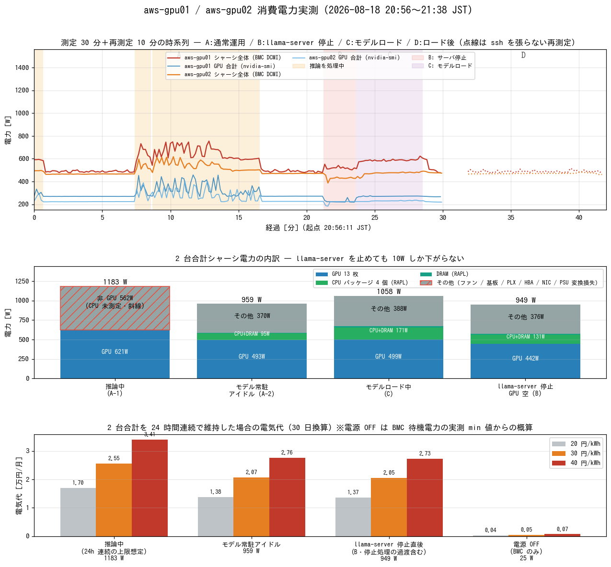

# aws-gpu01/02 の消費電力 — 常駐アイドルでも 2 台で約 960W

- **実施日時**: 2026年8月18日 20:45 〜 21:45 JST (BMC/nvidia-smi/RAPL による読み取り専用の電力測定 30 分＋再測定 10 分、フェーズ別集計、電気代試算)
- **報告日時**: 2026年8月18日 21:43 JST
- **作成者**: Claude Opus 5

## 概要

aws-gpu01 / aws-gpu02 は 2026 年 8 月 16 日に運用へ加わり、以降は RPC 分散で 1 つの llama-server を常時動かす構成が既定になっている。しかしこの 2 台の消費電力はこれまで一度も測っていなかった。ファンの静音化や「常時起動しておく」という運用判断も、電力の裏付けがないまま進んでいた。今回はその空白を埋めるため、消費電力の実測と内訳の分解、そして電気代への換算を行った。

測定はすべて読み取り専用の範囲で行った。GPU サーバのロックは取らず、電源操作も設定変更も一切していない。ちょうど別のセッションがこの 2 台を占有して推論を流していたので、その負荷に相乗りする形で、アイドルと推論中の両方を観測した。電力の値は 3 つの経路から採っている。シャーシ全体は BMC から、GPU 個別はサーバ上のツールから、CPU とメモリはカーネルが持つ電力カウンタからで、いずれも 10 秒ごとに 30 分間記録した。

分かったことの中心は、**この 2 台は何もしていなくても 2 台合わせて約 960W を消費し続けている**という事実である。推論を流している間は約 1,180W まで上がるが、上がり幅は 220W ほどしかない。つまり電力の大半は「動かしているから」ではなく「電源が入っているから」発生している。

内訳を分解すると理由がはっきりする。アイドル時の 960W のうち、GPU 13 枚だけで約 490W を占めていた。1 枚あたり 38W で、これは 13 枚すべてが最上位の動作状態に張り付いたまま下位の省電力状態へ落ちないためである。CPU 4 個は合計 85W、メモリは 11W しかなく、残る約 370W はファン・基板・PCIe スイッチ・電源ユニットの変換損失といった、計算とは直接関係のない部分で消えていた。

測定の最中に偶然、別のセッションが llama-server を停止して起動し直したため、「サーバを止めた状態」と「モデルを読み込んでいる最中」の電力も記録できた。ここで得られた結果が今回いちばん実用的である。**llama-server を止めても消費電力は 960W から 950W へ、わずか 10W しか下がらなかった**。GPU はモデルが載っていなくても 1 枚 32〜36W を消費し続けるため、プロセスを落とすことは節電にほとんど寄与しない。電力を本当に減らしたいなら、選択肢は電源を切ることだけである。

電気代に直すと、2 台を 24 時間動かし続けた場合でおよそ 690 kWh/月、年間 8,400 kWh になる。単価を 1 kWh あたり 30 円と置けば月額およそ 2 万 1 千円、年額 25 万円である。推論を流し続けた場合でも月額 2 万 6 千円ほどで、アイドルとの差は月 5 千円程度しかない。裏を返せば、使っていない時間帯に電源を入れっぱなしにしていることのコストが、実際に計算させているコストを大きく上回っている。

ただし電源を落とす運用には別の制約がある。この 2 台は起動時のファン音の問題からユーザの明示的な指示なしに電源操作をしない取り決めがあり、さらにモデルの読み込みにも時間がかかる。今回の測定ではメモリ上にキャッシュが残っていたため約 5 分で読み込めたが、キャッシュがない状態からでは 15 分程度を要する。したがって本レポートは電力面の材料を提供するに留め、運用をどうするかの判断はユーザに委ねる。

残した課題もある。推論中の CPU 電力だけは電力カウンタの記録範囲から外れてしまい取得できていない。またシャーシの電力値が電源ユニットの入力側（壁から見た値）なのか出力側なのかは、確証を取れなかった。積み上げた内訳との差から入力側と推定しているが、断定はしていない。

## 核心発見サマリ



**測定した 4 つの状態**（シャーシ電力 = BMC の IPMI DCMI `Instantaneous power reading`）:

| 状態 | aws-gpu01 | aws-gpu02 | **2 台合計** | n |
|---|---|---|---|---|
| 推論中 (A-1) | 648.4 W | 534.3 W | **1,183.6 W** | 58 |
| モデル常駐アイドル (A-2) | 490.9 W | 467.8 W | **958.9 W** | 70 |
| 同上・ssh を張らない再測定 (D') | 488.2 W | 470.3 W | **958.6 W** | 60 |
| モデルロード中 (C) | 585.2 W | 472.3 W | **1,058.1 W** | 30 |
| llama-server 停止直後・GPU 空 (B) | 519.9 W | 429.1 W | **949.0 W** | 14 |

**アイドル 959W の内訳（2 台合計）**:

| 内訳 | W | 比率 | 測定手段 |
|---|---|---|---|
| GPU 13 枚 | 493 | 51.4% | `nvidia-smi power.draw` |
| CPU パッケージ 4 個 | 85 | 8.8% | RAPL (gpu01 27W + gpu02 58W) |
| DRAM | 11 | 1.1% | RAPL |
| **その他** | **370** | **38.6%** | 差分（ファン/基板/PLX/HBA/NIC/ドライブ/PSU 変換損失） |

**GPU 1 枚あたりの電力**（Tesla P100-PCIE、power limit は全枚 250W、下限 125W）:

| 状態 | gpu01 (7 枚) | gpu02 (6 枚) |
|---|---|---|
| モデル常駐アイドル | 269.8 W = **38.5 W/枚** | 223.6 W = **37.3 W/枚** |
| VRAM 空（llama-server 停止中） | 223.9 W = **32.0 W/枚** | 218.1 W = **36.4 W/枚** |
| 推論中（最大サンプル） | 457.7 W | 408.5 W |

全 GPU は VRAM が空でも `pstate = P0` / `clocks.sm = 1189-1328 MHz` に張り付いており、P8 のような低電力状態へは落ちない。**モデルを常駐させることによる増分は 13 枚で約 50W にとどまり、GPU アイドル電力そのもの（約 440W）が支配的**である。

**電気代**（2 台合計・24 時間連続・30 日換算）:

| 状態 | W | kWh/月 | 20 円/kWh | 30 円/kWh | 40 円/kWh |
|---|---|---|---|---|---|
| 推論中 | 1,184 | 852 | 17,044 円 | **25,565 円** | 34,087 円 |
| モデル常駐アイドル | 959 | 690 | 13,808 円 | **20,712 円** | 27,616 円 |
| llama-server 停止直後 | 949 | 683 | 13,666 円 | **20,498 円** | 27,331 円 |

**BMC が保持する累積統計**（sampling period 約 70 時間、電源断期間を含む）:

| | Average | Min | Max |
|---|---|---|---|
| aws-gpu01 | 467 W | 1 W | 985 W |
| aws-gpu02 | 434 W | 24 W | 794 W |

Min の 1W / 24W は電源断中の待機電力である。Average 467W / 434W は電源が落ちていた時間も分母に入っているため、稼働中の実効平均（実測 490W / 468W）より低く出ている。

## 前提・目的

- **目的**: (1) シャーシ電力が GPU / CPU / その他にどう割れているかを可視化する、(2) アイドルと推論中の平均 W から電気代を試算し、常時起動の是非を判断できる材料にする
- **制約（ユーザ指示）**: 測定は読み取り専用の範囲に限定する。GPU サーバのロックは取らず、意図的な負荷投入・電源操作・power limit 変更は行わない
- 測定時、両機は別セッション (`aws-mmns-generic-428765/428772`, 20:00 頃取得) がロックし、RPC 分散スタックで DeepSeek-V4-Flash を動かしていた。本測定はその稼働に相乗りしている

## 環境情報

| 項目 | aws-gpu01 | aws-gpu02 |
|---|---|---|
| 製品型番 | SYS-4028GR-TRT2 | SYS-4028GR-TRT |
| シャーシ | CSE-418GTS-R4000BP | CSE-418GTS-R3200BP |
| GPU | Tesla P100-PCIE 16GB × 7 | 16GB × 4 + 12GB × 2 |
| CPU | Xeon E5-2687W v4 × 2 (24C/48T) | Xeon E5-2640 v4 × 2 (20C/40T) |
| RAM | 160 GB (32GB × 5) | 96 GB (32GB × 3、CPU2 側は空) |
| PSU | 4 台（PS1-4 すべて `Presence detected`） | 同左 |
| ファン | FAN1-8、実測 2,900-3,000 rpm | FAN1-6,8（FAN7 は `No Reading`）、2,900-3,000 rpm |
| CPU governor | schedutil（アイドル時 1.2 GHz） | 同左 |

- ファンは 2026-08-17 の静音化で常設した `smc-fanctl` により duty 16% / 2,900rpm で運転中。**本レポートの数値はすべて静音化後のもの**
- 稼働ワークロード: `llama-server` (aws-gpu01) + `ggml-rpc-server` (aws-gpu02)、モデル Huihui-DeepSeek-V4-Flash-0731-abliterated Q4_K (153.3 GiB)、ctx=131072
- 測定中に別セッションが llama-server を再起動したため、旧プロセス (20:02:29 起動) と新プロセス (21:19:50 起動、`--ui-mcp-proxy` 付き) が入れ替わっている

## 再現方法

```bash
S=.claude/skills/gpu-server/scripts   # 認証情報は ~/.config/gpu-server/.env の BMC_AWS_GPU01_* を使う

# 1. シャーシ全体の瞬時電力（BMC。OS に負荷をかけない）
source ~/.config/gpu-server/.env
ipmitool -I lanplus -H "$BMC_AWS_GPU01_HOST" -U "$BMC_AWS_GPU01_USER" -P "$BMC_AWS_GPU01_PASS" \
  dcmi power reading

# 2. GPU 個別
ssh aws-gpu01 "nvidia-smi --query-gpu=index,power.draw,utilization.gpu,pstate --format=csv"

# 3. CPU / DRAM（RAPL。energy_uj は root 専用なので sudo が要る）
ssh aws-gpu01 "sudo cat /sys/class/powercap/intel-rapl:0/energy_uj"   # 10 秒差で 2 回読み、差分 [uJ] / 経過秒 / 1e6 = W

# 4. 連続サンプリングと集計（本レポートの添付スクリプト）
./power-sampler.sh aws-gpu01 power_aws-gpu01.csv 10 1800      # DCMI + nvidia-smi を 10 秒毎
ssh aws-gpu01 "sudo bash -s" < rapl-sampler.sh 1400 >> rapl_aws-gpu01.csv
./dcmi-only-sampler.sh aws-gpu01 dcmi_aws-gpu01.csv 10 600    # ssh を張らない版
python3 aggregate-power.py && python3 make_summary.py
```

RAPL のカウンタは `max_energy_range_uj = 262143328850`（約 262 kJ）で一周するため、差分が負になったら加算して補正する（集計スクリプトに実装済み）。

## 結果詳細

### フェーズ区分

測定 30 分の途中で別セッションが llama-server を再起動したため、期間を 4 つに切って集計した。境界は llama-server のログ（先頭の時刻は**プロセス起動からの経過** `MM.SS.mmm.uuu` 形式）と `ps -o lstart=` から確定した。

| | 期間 (JST) | 状態 |
|---|---|---|
| A | 20:56:11 - 21:17:26 | 通常運用（旧サーバ、モデル常駐）。うち推論中が 58 サンプル |
| B | 21:17:26 - 21:19:50 | llama-server / rpc-server 停止。GPU の VRAM は空 |
| C | 21:19:50 - 21:24:43 | 新 llama-server がモデル 153.3 GiB を読み込み中 |
| D | 21:24:43 - 21:38 | ロード完了後のアイドル（うち 21:28 以降が D' 再測定） |

A 期間内の「推論中 / 推論なし」は、GPU utilization の 10 秒スナップショットではなく **llama-server ログの `launch_slot_` / `release` の対から作った実区間**で判定した（スナップショットでは短い推論を取りこぼすため）。旧サーバの稼働 70 分間のうち推論を処理していたのは合計 31.5 分（45%）だった。

### サーバ別の内訳

**aws-gpu01**

| フェーズ | シャーシ | GPU 合計 | CPU | DRAM | その他 |
|---|---|---|---|---|---|
| A-1 推論中 | 648.4 W | 335.6 W | (未取得) | (未取得) | 312.7 W（非 GPU 分） |
| A-2 モデル常駐アイドル | 490.9 W | 269.8 W | 27.4 W | 4.9 W | 180.2 W |
| B サーバ停止 | 519.9 W | 223.9 W | 86.7 W | 11.3 W | 197.9 W |
| C モデルロード中 | 585.2 W | 270.0 W | 98.1 W | 12.4 W | 204.6 W |
| D' 再測定（BMC のみ） | 488.2 W | — | 26.7 W | 4.8 W | — |

**aws-gpu02**

| フェーズ | シャーシ | GPU 合計 | CPU | DRAM | その他 |
|---|---|---|---|---|---|
| A-1 推論中 | 534.3 W | 285.4 W | (未取得) | (未取得) | 248.8 W（非 GPU 分） |
| A-2 モデル常駐アイドル | 467.8 W | 223.6 W | 57.3 W | 5.8 W | 182.3 W |
| B サーバ停止 | 429.1 W | 218.1 W | 30.5 W | 2.1 W | 178.4 W |
| C モデルロード中 | 472.3 W | 229.2 W | 54.4 W | 5.8 W | 183.0 W |
| D' 再測定（BMC のみ） | 470.3 W | — | 57.6 W | 5.8 W | — |

- **gpu02 の CPU が常時 57W** なのは `ggml-rpc-server` が待機中もスピンしているため（`ps` の %CPU が 74.6%）。gpu01 の llama-server は待機中ほぼ CPU を使わず 27W に落ちる
- **B 期間の gpu01 の CPU 86.7W** は「OS だけ起動している状態」の値ではなく、153 GiB のメモリ解放処理と新プロセス起動が重なった過渡状態である。したがって B の 949W（2 台合計）は下限ではなくやや高めに出ている
- **C（モデルロード中）は CPU が最も高い**（gpu01 98W）。ディスク読み出しと GPU への転送が CPU を使うためで、シャーシは 2 台合計 1,058W と推論中に近い水準になる

### 「その他」370W の正体についての考察

2 台合計のアイドル 959W から GPU 493W・CPU 85W・DRAM 11W を引いた残り 370W が何かを、直接測る手段は今回なかった。ただし内訳の見当は付けられる。

ファンは 16 個（gpu01 の 8 個 + gpu02 の実働 7 個）が 2,900rpm で回っているが、ファンの消費電力は回転数のおよそ 3 乗に比例する。全開を 8,500rpm 級とすると 2,900rpm はその約 34% であり、電力比では 4% 程度にしかならない。したがって**ファンの寄与は 2 台合計でも 10W 前後**と見積もられ、370W の説明にはならない。

残るのは基板・PCIe スイッチ（4028GR は GPU 用に PLX を複数搭載）・SAS HBA・10GbE NIC・ドライブと、**電源ユニットの変換損失**である。2000W 級の PSU を 4 台並列で使いながら実負荷が 1 台あたり 100W 前後（定格の 5% 程度）しかないため、80 PLUS の効率が定義される 20% 負荷を大きく下回る領域で運転していることになる。この領域では変換効率が 80% を切ることも珍しくない。DCMI の値が PSU の**入力側**（＝壁から見た消費電力）だとすれば、370W のうち 100W 前後が変換損失で説明でき、辻褄が合う。

**ただしこれは推定であり、確証は取れていない**。PSU の PMBus を IPMI の Master Write-Read（`raw 0x06 0x52`）で直接読もうと bus 0x07/0x03/0x01 × addr 0x78 を試したが、いずれも `rsp=0x83` で応答がなかった。`ipmitool fru` にも PSU は個別デバイスとして現れず、`sdr type "Power Supply"` は `Presence detected` を返すのみで電力値を持たない。

### 電源容量の余裕

実測のピークは gpu01 が 755W、gpu02 が 618W（BMC の累積 Max でも 985W / 794W）。シャーシは 4000W / 3200W 級の冗長電源構成であり、**容量の余裕は十分**で、電力面から構成を制約する要因は見当たらない。

## 副次発見

- **llama-server の停止は節電にならない**。959W → 949W（2 台合計）で、削減幅は 1% にすぎない。GPU が VRAM 空でも 1 枚 32〜36W を消費し続けることが原因で、13 枚で約 440W の固定費が発生している
- **モデルロードは 4 分 53 秒で完了した**（ログの `model loaded` まで）。既定構成の cold ロードは約 15 分とされているが、今回は直前まで同じモデルが載っていてページキャッシュ（`buff/cache` 155 GB）が効いたため大幅に短縮された
- **gpu02 には `intel-rapl:1:0`（package-1 の DRAM ドメイン）が存在しない**。CPU2 側に DIMM が実装されていないという既知の構成（[gpu-server/aws-gpu.md](../.claude/skills/gpu-server/aws-gpu.md)）が、RAPL のドメイン構成にもそのまま現れている
- **P100 は VRAM が空でも P0 に張り付く**。`persistence_mode` は Disabled だが、それとは無関係に pstate は P0 のままだった。GPU アイドル電力を下げる手段は今回の読み取り専用の範囲では見つかっていない
- 調査の途中で CPU 電力の上昇（27W → 93W）を観測し、当初これを「10 秒毎に ssh を張るサンプラー自身が CPU を起こしている観測者効果」と解釈したが、**誤りだった**。時刻を突き合わせると上昇区間は llama-server の再起動とモデルロードに完全に一致しており、ssh ポーリングの有無とは無関係だった。ssh を張らない `dcmi-only-sampler.sh` での再測定でも、アイドルのシャーシ電力は 488W / 470W と ssh 経由の測定（491W / 468W）と一致しており、**このサンプリング方法に有意な観測者効果はない**ことが確認できた

## 残課題

- **推論中の CPU 電力（RAPL）が未取得**。RAPL サンプラーを起動したのが推論終了後だったため、A-1 期間をカバーできていない。推論中の「非 GPU 分」312.7W（gpu01）とアイドルの 221.1W の差 91.6W の大半は CPU と推測されるが、実測ではない
- **DCMI が AC 入力側か DC 出力側かが未確定**。PSU の PMBus 直読が通らなかったため、上記の考察は推定に留まる。壁側にワットメータを挟めば一発で決着する
- **ファン静音化の電力効果が未測定**。2026-08-17 の静音化で duty 50-54% → 16% になっているが、その前後の消費電力は比較していない。fan mode を戻す操作が必要なので読み取り専用の範囲では測れない
- **電源 OFF 時の待機電力を直接測っていない**。BMC 累積統計の Min（gpu01 1W / gpu02 24W）からの概算に留まる
- **24 時間の長時間プロファイルが未取得**。今回は 40 分間の観測で、実運用における推論の稼働率（今回の観測では 45%）が長期的にどうなるかは分からない。電気代の実額を詰めるならこれが要る
- **GPU の power limit を下げた場合の効果が未検証**。250W → 125W まで下げられるが、アイドル電力には効かないと考えられるため、削減効果は推論中のピークに限られる見込み

## 参照レポート

- [2026-08-17 aws-gpu01/02 のファン静音化](2026-08-17_234403_aws_gpu_fan_noise_reduction.md) — 本測定はこの静音化が適用された状態での値
- [2026-08-16 aws-gpu サーバのオンボーディング](2026-08-16_151340_aws_gpu_server_onboarding.md) — ハードウェア構成と GPU 個体 baseline
- [2026-08-16 DeepSeek-V4 の RPC 2 台構成](2026-08-16_175749_deepseek_v4_rpc_dual_gpu_server.md) — 測定時に稼働していた既定構成

## 添付ファイル

- [plan.md](attachment/2026-08-18_214334_aws_gpu_power_consumption/plan.md) — 本作業の計画
- [summary.png](attachment/2026-08-18_214334_aws_gpu_power_consumption/summary.png) — 時系列・内訳・電気代のサマリ図
- [aggregate_output.txt](attachment/2026-08-18_214334_aws_gpu_power_consumption/aggregate_output.txt) — フェーズ別集計の全出力
- 生データ: [power_aws-gpu01.csv](attachment/2026-08-18_214334_aws_gpu_power_consumption/power_aws-gpu01.csv) / [power_aws-gpu02.csv](attachment/2026-08-18_214334_aws_gpu_power_consumption/power_aws-gpu02.csv)（DCMI + nvidia-smi、10 秒毎 180 サンプル、欠測 0）
- 生データ: [rapl_aws-gpu01.csv](attachment/2026-08-18_214334_aws_gpu_power_consumption/rapl_aws-gpu01.csv) / [rapl_aws-gpu02.csv](attachment/2026-08-18_214334_aws_gpu_power_consumption/rapl_aws-gpu02.csv)（CPU/DRAM の累積エネルギー）
- 生データ: [dcmi_aws-gpu01.csv](attachment/2026-08-18_214334_aws_gpu_power_consumption/dcmi_aws-gpu01.csv) / [dcmi_aws-gpu02.csv](attachment/2026-08-18_214334_aws_gpu_power_consumption/dcmi_aws-gpu02.csv)（ssh を張らない再測定）
- スクリプト: [power-sampler.sh](attachment/2026-08-18_214334_aws_gpu_power_consumption/power-sampler.sh) / [rapl-sampler.sh](attachment/2026-08-18_214334_aws_gpu_power_consumption/rapl-sampler.sh) / [dcmi-only-sampler.sh](attachment/2026-08-18_214334_aws_gpu_power_consumption/dcmi-only-sampler.sh)
- スクリプト: [aggregate-power.py](attachment/2026-08-18_214334_aws_gpu_power_consumption/aggregate-power.py) / [make_summary.py](attachment/2026-08-18_214334_aws_gpu_power_consumption/make_summary.py)
- [static_info.txt](attachment/2026-08-18_214334_aws_gpu_power_consumption/static_info.txt) — DCMI 累積統計・FRU・ファン回転数
- [llama-server-rpc-ctx131072.log](attachment/2026-08-18_214334_aws_gpu_power_consumption/llama-server-rpc-ctx131072.log) — 旧 llama-server のログ（推論区間の判定に使用）
