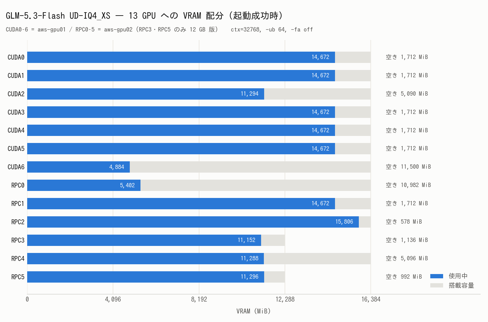

# GLM-5.3-Flash を aws-gpu01/02 の RPC 分散で起動する

- **実施日時**: 2026年8月27日 22:52 〜 23:58 JST (電源投入・モデル取得・PR ブランチでのビルド・起動確認・動作確認)
- **報告日時**: 2026年8月27日 23:58 JST
- **作成者**: Claude Opus 5

## 概要

ユーザから GLM-5.3-Flash の GGUF を aws-gpu01 にダウンロードし、起動確認と動作確認まで行うよう依頼を受けた。当初指定されたのは UD-Q4_K_XL 量子化だったが、6 シャード合計 186 GiB あり、2 台合計 200 GiB の VRAM に対して既定モデル（153 GiB）より 33 GiB も大きく現実的でないことを伝えたところ、より小さい UD-IQ4_XS（5 シャード 146 GiB）に変更する指示を得た。作業開始時点で両機とも電源が落ちていたため、ファン爆音の制約に従ってユーザの明示的な承認を取ったうえで投入した。

着手してすぐに分かったのは、このモデルのアーキテクチャが llama.cpp 本家に未対応だという点である。GGUF のメタデータが示すアーキテクチャ名は本家 master のどこにも存在せず、対応 PR が三本並行して開かれている状態だった。量子化を行った配布元自身が「動かすには自分たちの PR を使え」と明記していたため、その PR ブランチを両機に取得してビルドし直した。RPC 分散はメインホストとワーカーのバージョン一致が必須なので、二台とも同一コミットに揃えている。

モデルの取得自体は順調で、二十数分で完了し、総バイト数は配布元 API の期待値と完全に一致した。途中で進捗が止まったように見えた場面があったが、これは私の測り方の誤りで、ダウンロード中の一時ファイルがスパースファイルであるために見かけのサイズが実態を反映していなかったことによる。実割当ベースで測り直したところ、正常に進行していた。

起動は一度では通らず、性質の異なる三つの壁を順に越える必要があった。一つ目はこのアーキテクチャ固有の制約で、内部のインデクサが複数シーケンスの共有キャッシュと両立しないというもの。二つ目はその制約を回避するためのフラグが、サーバ側の既定動作によって握り潰されていたこと。三つ目は、注意機構を高速版なしで動かす必要があるために計算バッファが巨大になり、単一カードに載り切らなかったことである。三つ目については、途中でカードごとの重み配分を手動指定して解決しようと試みたが、指定順序の解釈で二度失敗したため、最終的には自動配分に戻し、計算バッファ側だけを縮める方針に切り替えて通した。

起動後の動作確認では、日本語での短い応答、コード生成、長文からの情報抽出の三種類を試した。いずれも正常に動作し、生成されたコードは手元で実行して全ケース合格することを確かめている。一万トークンを超える文章の中に埋め込んだ合言葉も正確に取り出せた。思考過程の出力も機能しており、日本語の質問に対して英語で思考し日本語で答えるという挙動を示した。

一方で速度は実用域とは言い難い。計算バッファを抑えるために処理単位を極端に小さくしているため、プロンプト処理は毎秒 35 トークン前後にとどまる。既定モデルの実測値と比べると桁が一つ違う。また文脈長も 32768 に制限しており、モデル本来の百万トークン級には遠く及ばない。これらは今回の構成上の制約であって、モデルやビルドの欠陥ではない。

現時点でサーバは起動したまま残してある。llama.cpp は両機とも PR ブランチに切り替わっており、既定構成に戻すには master への復帰と再ビルドが要る。aws-gpu01 に未コミットで置かれていた別件の修正パッチは、ブランチ切り替え前に退避してある。次に取り組むとすれば、処理単位を上げられる余地の探索と、対応 PR がマージされた後の本家ビルドでの再確認になる。

## 添付ファイル

- [起動成功時の llama-server ログ](attachment/2026-08-27_235754_glm53flash_aws_gpu_rpc_startup/llama-server-success.log)
- [モデルダウンロードのログ](attachment/2026-08-27_235754_glm53flash_aws_gpu_rpc_startup/hf-download.log)
- [VRAM 配分図の生成スクリプト](attachment/2026-08-27_235754_glm53flash_aws_gpu_rpc_startup/mkfig.py)

## 核心発見サマリ



**結論**: `unsloth/GLM-5.3-Flash-GGUF:UD-IQ4_XS`（5 shard / 156,822,111,075 B = 146.05 GiB）を aws-gpu01 + aws-gpu02 の RPC 分散 13 GPU で **起動・推論成功**。ただし本家 master は arch `glm5next` 未対応で、**PR #27754（`unslothai:glm5next/upstream`, `cadbe97b7`）でのビルドが必須**。起動に必要な追加条件は 3 つ — (1) `-fa off`（PR 指定。`build_attn_mha` の F32→F16 キャストが MLA を壊す）、(2) **`--parallel 1` 明示**（省略すると `server.cpp:153` が `n_parallel=4` かつ `kv_unified=true` を強制し、`glm5next` の pooled indexer 制約に抵触して `-no-kvu` も無効化される）、(3) **`-ub 64`**（`-fa off` の注意行列は n_ctx × n_ubatch に比例し、ctx=131072/ub=512 では単一デバイスに 23.6 GiB を要求して確保不能）。確定構成は `ctx=32768 / -b 512 / -ub 64 / --parallel 1 / -fa off`、tensor-split は指定せず自動配分。実測は **pp 34.6〜35.2 t/s / tg 4.3〜8.6 t/s**、最小空き VRAM は RPC2 の **578 MiB**。

## 前提・目的

- **依頼内容**: 指定 GGUF を aws-gpu01 にダウンロードし、起動確認と動作確認まで実施する
- **量子化の変更**: 当初指定の `UD-Q4_K_XL` は 6 shard 合計 **185.99 GiB**（199,707,321,347 B）。既定モデル Huihui-DeepSeek-V4-Flash（153.3 GiB）が ctx=131072 で最小空き 460 MiB という実績に照らすと 200 GiB には収まらないため、その旨を提示してユーザが `UD-IQ4_XS`（146.05 GiB）へ変更
- **電源**: 作業開始時、両機とも `System Power: off`。CLAUDE.md のガード（ファン爆音）に従いユーザの明示的承認を得てから `ALLOW_FAN_NOISE=1` で投入

## 環境情報

| 項目 | 値 |
|---|---|
| メインホスト | aws-gpu01 (10.8.2.1)、Tesla P100 16GB × 7 |
| RPC ワーカー | aws-gpu02 (10.8.2.2)、Tesla P100 16GB × 4 + 12GB × 2、bind `192.168.100.2:50052` |
| llama.cpp | PR #27754 `unslothai:glm5next/upstream` / commit `cadbe97b7ed5601fcfecb02c4d46b43ca83c93b0` / build 10663（両機一致） |
| ビルドフラグ | `-DGGML_CUDA=ON -DGGML_RPC=ON -DGGML_CUDA_FA_ALL_QUANTS=ON -DCMAKE_CUDA_ARCHITECTURES=60` |
| モデル | `~/models/GLM-5.3-Flash-GGUF/UD-IQ4_XS/GLM-5.3-Flash-UD-IQ4_XS-00001-of-00005.gguf` |
| arch / パラメータ | `glm5next` / 320B total・18B active、45 層（+ MTP ブロック 1）、288 routed experts、native ctx 1,048,576 |
| サンプリング | `--temp 1.0 --top-p 0.95`（zai-org `generation_config.json` の公式値） |

## 再現方法

```bash
# 1) 電源投入（ユーザの明示的指示がある場合のみ）
ALLOW_FAN_NOISE=1 .claude/skills/gpu-server/scripts/bmc-power.sh aws-gpu01 on
ALLOW_FAN_NOISE=1 .claude/skills/gpu-server/scripts/bmc-power.sh aws-gpu02 on

# 2) ロック（両機）
.claude/skills/gpu-server/scripts/lock.sh aws-gpu01
.claude/skills/gpu-server/scripts/lock.sh aws-gpu02

# 3) モデル取得（aws-gpu は HF 直が速い）
source ~/.config/gpu-server/.env
ssh aws-gpu01 "~/.local/bin/hf download unsloth/GLM-5.3-Flash-GGUF \
  --include 'UD-IQ4_XS/*' --local-dir ~/models/GLM-5.3-Flash-GGUF --token \$HF_TOKEN"

# 4) 両機を PR #27754 でビルド（コミット一致が必須）
ssh -n aws-gpu01 "cd ~/llama.cpp && git fetch origin pull/27754/head:glm5next && git checkout glm5next"
ssh -n aws-gpu02 "cd ~/llama.cpp && git fetch origin pull/27754/head:glm5next && git checkout glm5next"
scp .claude/skills/llama-server/server-scripts/update_and_build-aws-gpu01.sh aws-gpu01:~/llama.cpp/update_and_build.sh
scp .claude/skills/llama-server/server-scripts/update_and_build-aws-gpu02.sh aws-gpu02:~/llama.cpp/update_and_build.sh
ssh -n aws-gpu01 "cd ~/llama.cpp && ./update_and_build.sh --no-pull --force"
ssh -n aws-gpu02 "cd ~/llama.cpp && ./update_and_build.sh --no-pull --force"

# 5) RPC ワーカー起動
.claude/skills/llama-server/scripts/rpc-up.sh

# 6) llama-server 起動（rpc-llama-up.sh は --flash-attn 1 固定のため使えない）
ssh -n aws-gpu01 "cd ~/llama.cpp && setsid nohup env NVIDIA_TF32_OVERRIDE=0 ./build/bin/llama-server \
  --model ~/models/GLM-5.3-Flash-GGUF/UD-IQ4_XS/GLM-5.3-Flash-UD-IQ4_XS-00001-of-00005.gguf \
  --alias 'GLM-5.3-Flash-UD-IQ4_XS' \
  --rpc 192.168.100.2:50052 \
  --n-gpu-layers 999 --ctx-size 32768 --parallel 1 \
  -fa off --poll 0 -b 512 -ub 64 \
  --jinja --temp 1.0 --top-p 0.95 \
  --host 0.0.0.0 --port 8000 > /tmp/llama-server.log 2>&1 < /dev/null &"
```

起動完了は `/tmp/llama-server.log` に `listening on` が出るかで判定する（所要 約 4 分・page cache が温かい場合）。

## 結果詳細

### ダウンロード

| shard | サイズ (B) |
|---|---|
| 00001-of-00005 | 9,429,859 |
| 00002-of-00005 | 49,989,334,176 |
| 00003-of-00005 | 49,607,025,280 |
| 00004-of-00005 | 49,486,530,144 |
| 00005-of-00005 | 7,729,791,616 |
| **合計** | **156,822,111,075**（HF API の期待値と一致） |

所要 23 分 34 秒。瞬間速度は 6〜176 MB/s と大きく変動した。

### 起動失敗の系列と原因

| # | 構成 | 失敗内容 | 原因 |
|---|---|---|---|
| 1 | ctx=131072, ub=512, fa=1 | `glm5next: the pooled indexer needs one sequence per stream, so a unified KV cache is only supported with a single sequence` | `cparams.kv_unified && cparams.n_seq_max > 1`（`llama-model.cpp:2466`） |
| 2 | 上記 + `-no-kvu` | 同上 | `server.cpp:153-156` が `n_parallel < 0`（auto）のとき `n_parallel=4` と `kv_unified=true` を**上書き**する |
| 3 | 上記 + `--parallel 1` | `failed to allocate RPC0 buffer of size 25375901184`（23.63 GiB） | `-fa off` の注意行列 ≈ n_kv × n_ubatch × n_head × 4B。131072 × 512 × 約96 × 4B に一致 |
| 4 | ctx=32768, ub=128 | `failed to allocate RPC2 buffer of size 1721863680`（1.60 GiB） | RPC2 の空きが約 1,508 MiB しかない |
| 5 | 上記 + `--tensor-split`（CUDA 先頭順で算出） | `failed to allocate RPC3 buffer of size 14839291008` | **デバイス順を誤認**（後述） |
| 6 | tensor-split 再計算（CUDA 先頭順のまま） | `failed to allocate CUDA0 buffer of size 17679558144` | 同上 |
| 7 | tensor-split を RPC 先頭順に並べ替え | `failed to allocate CUDA0 buffer of size 17666018688` | RPC が先頭なので dense 層 0–2 は RPC0 に載り、CUDA0 には MoE 層のみが集まる。配分見積りが崩れた |
| 8 | **自動配分 + ctx=32768, ub=64** | — | **成功**（`listening on`、3 分 59 秒） |

### tensor-split のデバイス順（重要）

`--list-devices` は `CUDA0..CUDA6 → RPC0..RPC5` の順に表示するが、`--tensor-split` が参照する `model->devices` は **RPC が先頭**である。

```cpp
// src/llama.cpp:275
// add RPC servers at the front of the list to minimize network transfers
model->devices.insert(model->devices.begin(), rpc_servers.begin(), rpc_servers.end());
```

したがって RPC 構成で `--tensor-split` を使う場合、正しい順序は **`RPC0,RPC1,…,RPC5,CUDA0,…,CUDA6`**。表示順のまま書くと意図と全く違う配分になる。加えて、この順序では最初の 3 層（`first_k_dense_replace=3` の dense 層。MoE 層より遥かに小さい）が RPC0 に載るため、レイヤ数から容量を見積もる際は dense と MoE を区別しないと外れる。

### 動作確認

| 試験 | 入力 | 結果 |
|---|---|---|
| 日本語短答 | 「日本の首都はどこですか。一文で答えてください。」 | `日本の首都は東京です。` / thinking 動作（英語で思考・日本語で回答） |
| コード生成 | 最大部分列和の関数を要求 | Kadane 法の正しい実装。手元で 5 ケース実行し **全合格** |
| 長文抽出 | 41,865 B（10,754 tok）の中に埋めた合言葉 | `合言葉は「紫陽花7823」です。` **正解** |

### 速度実測

| 条件 | prompt (t/s) | generation (t/s) |
|---|---|---|
| 26 tok プロンプト | 7.8 | 8.4 |
| 50 tok プロンプト | 13.3 | 8.6 |
| 10,754 tok プロンプト | 34.6（全体）/ 35.2（末尾） | 4.3 |

参考: 既定モデル DeepSeek-V4-Flash（同 RPC 構成、`-fa 1 -ub 512`）は pp 89.7 / tg 13.6 t/s。今回の低速は `-fa off` と `-ub 64` の代償であって、モデルやビルドの問題ではない。

### VRAM

13 GPU 合計 159,154 MiB を使用。最小空きは **RPC2 の 578 MiB**、次いで RPC5 の 992 MiB、RPC3 の 1,136 MiB。アイドル消費電力は両機とも 37〜47 W/GPU。

## 副次発見

- **`common_fit_params` のエラー行は失敗判定に使えない**。`-ngl` を明示した正常起動でも、ロード初期の試行で `E llama_init_from_model: failed to initialize the context: ...` と `E common_fit_params: encountered an error ...` が出る。既知の「`abort` を入れるな」に加えて、**`failed to initialize the context` も除外**すべき。致命判定に使えるのは `exiting due to model loading error` / `failed to create_context with model`。
- **`hf download` の一時ファイルはスパース**。`du -sb`（見かけサイズ）は進捗を正しく表さず、途中で「停止した」と誤認した。`du -s --block-size=1`（実割当）か `df` の差分で測ること。
- **MTP ブロック（blk.45）は正常にスキップされる**。`W model has unused tensor blk.45.* -- ignoring` が 20 行以上出るが異常ではない。この PR は MTP を実装していない。
- **cold ロードは 15 分ではなく約 4 分**だった。ダウンロード直後で page cache が温かかったため。aws-gpu01 の RAM は 157 GiB で、146 GiB のモデルがちょうど収まる。
- **`NVIDIA_TF32_OVERRIDE=0` は P100 では実質無害**。PR は TF32 の精度低下を理由に必須としているが、TF32 は sm_80 以降の機能で sm_60 の P100 には存在しない。将来 Ampere 以降で動かす場合には必須。
- **`hf download` に `--token` を渡すとプロセス一覧にトークンが露出する**。`ps -eo args` で見える。今回は自機内なので実害はないが、環境変数 `HF_TOKEN` を使う方が望ましい。

## 残課題

- **`-ub` の引き上げ余地**: RPC2 の空きが 578 MiB しかないため現状 `-ub 64` が上限。`--tensor-split` を RPC 先頭順で正しく組み、かつ dense/MoE のサイズ差を織り込んで配分すれば、`-ub 128〜256` と ctx=65536 程度まで伸ばせる可能性がある（未検証）
- **ctx の上限が未確定**: 32768 で通ったが、これが上限かどうかは測っていない
- **`-fa on` との比較**: PR は精度上の理由で `-fa off` を指定しているが、`-fa on` なら計算バッファが激減し ctx=131072 も狙える。品質差の実測は未実施
- **llama.cpp が PR ブランチのまま**: 両機とも `glm5next` ブランチ（`cadbe97b7`）。既定構成（DeepSeek-V4-Flash）に戻すには `git checkout master` と再ビルドが必要。aws-gpu01 に未 push で存在した `--ui-mcp-proxy` 404 修正は `~/patches/server-http-404-mcpproxy.patch` と `git stash@{0}` に退避済み
- **本家マージ待ち**: PR #27752 / #27754 / #27773 の 3 本はいずれも draft。マージ後に本家ビルドで再確認する
- **サーバ稼働中・ロック保持中**: aws-gpu01 の llama-server と aws-gpu02 の RPC ワーカーは起動したまま。両機のロックも保持したままにしてある

## 参照レポート

- [DeepSeek-V4-Flash を 2 台の GPU サーバに RPC 分散して動かす](./2026-08-16_175749_deepseek_v4_rpc_dual_gpu_server.md)
- [--ui-mcp-proxy の 404 中継で llama-server が落ちる](./2026-08-19_010739_llama_server_cors_proxy_404_crash.md)
