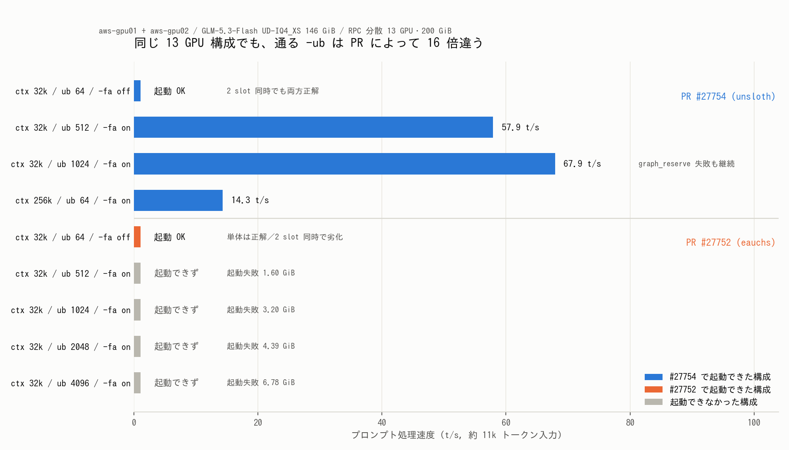

# GLM-5.3-Flash 対応 PR の最新版を実機検証する

- **実施日時**: 2026年8月29日 19:57 〜 22:05 JST (電源投入・PR 2 本のビルド・13 構成の起動スイープ・GGUF メタデータ調査・既定構成への復帰)
- **報告日時**: 2026年8月29日 22:05 JST
- **作成者**: Claude Opus 5

## 概要

二日前に GLM-5.3-Flash を二台の GPU サーバに分散して動かしたとき、本家 llama.cpp がこのモデルのアーキテクチャに未対応だったため、対応中の PR ブランチでビルドし、さらに三つの回避策を重ねてようやく起動できた。その後 PR 側がどう動いたかをユーザから確認するよう依頼を受け、まず調査したところ、二日のあいだに回避策のうち一つが不要になった可能性が高いと分かった。そこで実際に動かして確かめるよう指示があり、本作業に至った。

出発点として押さえておくべきは、本家の本流には今も取り込まれていないという事実である。対応 PR は三本並行しており、そのうち一本が下書き状態を抜けて本家メンテナのレビュー待ちに入ったものの、いずれもまだ合流していない。したがって「最新版の本家でどうなるか」という問いへの答えは、依然として「本家だけでは動かない」である。ただし PR の中身は活発に更新されており、前回の記録がすでに古くなっている箇所がいくつもあった。

実機検証は二本の PR について行った。前回使ったものと、本家マージの本命と目されるものである。前者は前回のコミットから更新されており、後者は作業中にもさらに更新された。二台のバージョン一致が必須なので、PR を切り替えるたびに両機で丸ごとビルドし直している。

最大の目的だった制約の解消は、両方の PR で確認できた。前回は複数シーケンス共有キャッシュとの両立ができず、明示的に単一シーケンスを指定しないと起動すらしなかったが、今回はどちらの PR でも指定なしで起動した。ただし両者は同じではない。複数の問い合わせを同時に投げたとき、前回使った側は二本とも正しく答えたのに対し、本命の側は単体では正解するのに同時実行では答えに辿り着けなくなった。これは本命側の説明文が自ら「品質が劣化する」と認めている挙動と符合する。

速度面では思わぬ収穫があった。前回は注意機構を高速版なしで動かす必要があると理解していたため処理単位を極端に絞っていたが、高速版を有効にしても正しく動き、しかも処理単位を八倍から十六倍に上げられた。同じ長文の読み取り試験で速度はほぼ二倍になり、答えも一致した。文脈長も前回の八倍まで伸ばして動作することを確かめている。

一方で、本命の側は同じ構成では動かなかった。処理単位を上げると、こちらは計算バッファの確保に失敗して起動そのものが止まる。前回使った側は同じ状況で警告を出しつつ処理を続けるのに対し、本命側は停止する。結果として、同じハードウェアで通せる処理単位が両者で十六倍も違うという状態になっている。この差は速度に直結するので、当面どちらを使うかの判断材料になる。

配布元の量子化ファイルについても調べた。作業中に配布元がメタデータを書き換えた別系統を用意し始めていたが、中身を突き合わせたところ、書き換えの実体はアーキテクチャ名の表記変更とキー一つの追加だけで、重みを含む本体は手つかずだった。差分は先頭の小さなファイル一個に収まっており、百四十六ギガバイトを取り直す必要はない。ただしその書き換えは三本目の PR に合わせたものなので、今回検証した二本には適用してはいけない。

作業後は両機とも本家の本流に戻して再ビルドし、前回退避しておいた別件の修正も復元したうえで電源を落としている。

## 添付ファイル

- [実装プラン](attachment/2026-08-29_220506_glm53flash_upstream_pr_verification/plan.md)
- [図の生成スクリプト](attachment/2026-08-29_220506_glm53flash_upstream_pr_verification/mkfig.py)
- [needle テスト入力の生成スクリプト](attachment/2026-08-29_220506_glm53flash_upstream_pr_verification/mkneedle.py)
- [GGUF shard1 のメタデータ差分](attachment/2026-08-29_220506_glm53flash_upstream_pr_verification/gguf_shard1_diff.txt)
- llama-server ログ: [A1 (#27754, --parallel 省略)](attachment/2026-08-29_220506_glm53flash_upstream_pr_verification/A1_par-omitted.log) ／ [A1+A2 全ログ](attachment/2026-08-29_220506_glm53flash_upstream_pr_verification/A1_A2_full.log) ／ [A3 (ub 512)](attachment/2026-08-29_220506_glm53flash_upstream_pr_verification/A3_fa-on_ub512.log) ／ [A4 (ub 1024)](attachment/2026-08-29_220506_glm53flash_upstream_pr_verification/A4_fa-on_ub1024.log) ／ [A5 (ctx 262144)](attachment/2026-08-29_220506_glm53flash_upstream_pr_verification/A5_ctx262144_ub64.log)
- llama-server ログ: [B1 (#27752, --parallel 省略)](attachment/2026-08-29_220506_glm53flash_upstream_pr_verification/B1_par-omitted.log) ／ [B3 (ub 4096)](attachment/2026-08-29_220506_glm53flash_upstream_pr_verification/B3_fa-on_ub4096.log) ／ [B3b (ub 2048)](attachment/2026-08-29_220506_glm53flash_upstream_pr_verification/B3b_fa-on_ub2048.log) ／ [B4 (ub 1024 + MTP)](attachment/2026-08-29_220506_glm53flash_upstream_pr_verification/B4_ub1024_mtp.log) ／ [B5 (ub 1024)](attachment/2026-08-29_220506_glm53flash_upstream_pr_verification/B5_ub1024.log) ／ [B6 (ub 512 + MTP)](attachment/2026-08-29_220506_glm53flash_upstream_pr_verification/B6_ub512_mtp.log)

## 核心発見サマリ



**結論**: 本家 master（`cc83d7b48`, 2026-08-29）は依然 `glm5next` **未対応**で、PR #27752 / #27754 / #27773 は**いずれも未マージ**。ただし前回の 3 制約のうち **`--parallel 1` は両 PR で不要になった**（`server.cpp:153` が `n_parallel=4 + kv_unified=true` を強制した状態で両方とも起動）。さらに **`-fa off` も P100 では不要**で、`-fa on` により `-ub` を 64 → 1024 に上げられ **prompt 処理は 34.6 → 67.9 t/s（1.96 倍）**、ctx も 32768 → **262144** で動作した。ただし**この改善が効くのは #27754 のみ**で、#27752 は `-ub 512` ですら `failed to allocate compute pp buffers` で起動しない（`-ub 64` のみ成功）。逆に**複数シーケンス同時の品質は #27754 が優れ**、2 slot 同時 needle で #27754 は両方正解、#27752 は単体で正解するのに同時実行では 256 トークン上限まで思考が発散して回答に到達しなかった。GGUF は `Shard_Rewrite/` が用意されたが**差分は arch 名 `glm5next`→`glm5-next` とキー `index_share_mtp` の追加のみ**で、**shard 1（9.4 MB）だけの入れ替えで済み**、かつこれは #27773 向けなので今回の 2 本には**適用してはならない**。

## 前提・目的

前回レポート [GLM-5.3-Flash を aws-gpu01/02 の RPC 分散で起動する](./2026-08-27_235754_glm53flash_aws_gpu_rpc_startup.md) の残課題として挙げた 5 点を、コード読解ではなく実機で確定させる。

| # | 前回時点の主張 | 検証方法 |
|---|---|---|
| 1 | `--parallel 1` の明示が必須 | `--parallel` を省略して起動し、複数 slot 同時で品質を見る |
| 2 | `-fa off` / `NVIDIA_TF32_OVERRIDE=0` が必須 | `-fa on` で起動・出力比較 |
| 3 | `-ub 64` が上限 | `-fa` × `-ub` のスイープ |
| 4 | CUDA は `n_pool > 65535`（実深度 262,140 tok）で落ちる | ctx を伸ばして到達を試みる |
| 5 | GGUF は再変換が必要か | メタデータを dump して差分を取る |

## 環境情報

| 項目 | 値 |
|---|---|
| メインホスト | aws-gpu01 (10.8.2.1)、Tesla P100 16GB × 7 |
| RPC ワーカー | aws-gpu02 (10.8.2.2)、Tesla P100 16GB × 4 + 12GB × 2 |
| 本家 master | `cc83d7b4824f73cfdda4dfbb47ee39804f71b328`（2026-08-29）— `glm5next` の記述は `src/` `convert_hf_to_gguf.py` `gguf-py` のいずれにも**無し** |
| 検証 PR ①  | #27754 `unslothai:glm5next/upstream` / `f30bed88717059d8a4728864c88f8abad8d329a0`（前回は `cadbe97b7`） |
| 検証 PR ②  | #27752 `eauchs:glm5next/add-glm-5.3-flash` / `20de49688d799a87cd6d396f43a74eeac0702b5b`（作業中に `8a8d0bcc4d` から更新された） |
| ビルドフラグ | `-DGGML_CUDA=ON -DGGML_RPC=ON -DGGML_CUDA_FA_ALL_QUANTS=ON -DCMAKE_CUDA_ARCHITECTURES=60`（両機同一コミット） |
| モデル | `unsloth/GLM-5.3-Flash-GGUF:UD-IQ4_XS`（5 shard / 156,822,111,075 B、前回から**未更新**） |

## PR 3 本の現況（2026-08-29 22:00 JST）

| PR | 著者 | 状態 | 規模 | 特徴 |
|---|---|---|---|---|
| **#27752** | eauchs | **draft 解除・`REVIEW_REQUIRED`**（ggerganov / CISC / JohannesGaessler にレビュー要求中）、`mergeable: MERGEABLE` | 16 files +2267 | MTP (NextN) draft graph、`test-save-load-state` 全通過、DSA indexer のトークン方向チャンク化。vision 非対応 |
| **#27754** | danielhanchen (unsloth) | draft | 41 files +2214 | vision tower 込み。per-sequence pooling |
| **#27773** | timkhronos | draft | 28 files +2060 | `indexer_compressor` 命名。arch 名が `glm5-next`。GGUF 再変換が前提 |

本家マージの本命は **#27752**。ただし後述のとおり、**今の P100 13 GPU 構成で実用になるのは #27754 のほう**という逆転が起きている。

## 検証結果

### 項目 1: `--parallel 1` 制約 — **両 PR で解消**

前回の失敗 #1 で出ていた拒否メッセージ

```
glm5next: the pooled indexer needs one sequence per stream,
so a unified KV cache is only supported with a single sequence
```

は、**両 PR のソースから消えている**（`grep -rn 'one sequence per stream' src/` で該当は
`llama-kv-cache-kpool.cpp:129` の `GGML_ASSERT(n_ps == 1 && "the per-cell pool view needs one sequence per stream")` のみ。
これは `cell_pool` 経路のもので、ヘッダに `// cell_pool I32 [n_kv, n_stream] per-cell view, optional, unused here` と
あるとおり glm5next からは `nullptr` 渡しのため発火しない）。

代わりに `#27754` は `204fa7003c`「pool the indexer per sequence so a unified KV cache works」で
`const int64_t n_stream = cparams.kv_unified ? 1 : ubatch.n_seqs_unq;` の per-sequence pooling を導入している。

実機でも `--parallel` を省略した状態（＝`server.cpp:153` が `n_parallel=4` と `kv_unified=true` を強制）で
**両 PR とも起動した**。

```
I srv    load_model: initializing, n_slots = 4, n_ctx_slot = 32768, kv_unified = 'true'
I srv  llama_server: listening on http://0.0.0.0:8000
```

前回は `n_slots = 1, kv_unified = 'false'` でしか通らなかったので、これは明確な前進である。

#### ただし品質は同じではない

異なる合言葉を埋めた長文 2 本を**同時に**投げると差が出た（両 PR とも `ctx=32768 / -ub 64 / -fa off / --parallel 省略`、
`temperature 0`、`max_tokens 256`）。

| PR | slot A（期待 `紫陽花7823`） | slot B（期待 `向日葵4519`） |
|---|---|---|
| **#27754** | **`紫陽花7823`** 正解（thinking 185 字、81 tok で完了） | **`向日葵4519`** 正解（thinking 273 字、94 tok で完了） |
| **#27752** | 回答に到達せず（thinking 766 字、**256 tok 上限で打ち切り**） | 回答に到達せず（thinking 1114 字、**256 tok 上限で打ち切り**） |

**#27752 は単体なら正解する**（同一構成・同一プロンプトで `紫陽花7823`、thinking 456 字、133 tok で完了）。
つまり 2 slot 同時のときだけ思考が発散する。これは #27752 の PR 本文が

> **Multi-sequence on a unified cache** (`-kvu`): pools mix cells across sequences and selection degrades.

と自ら述べている挙動と一致する。`--parallel 1` を明示すれば #27752 でもこの問題は避けられるはずだが、
**`llama-server` の既定は `n_parallel=4 + kv_unified=true`** なので、指定を忘れると踏む。

### 項目 2: `-fa off` / `NVIDIA_TF32_OVERRIDE=0` — **P100 では `-fa on` でも動く**

`-fa off` を要求する理由（`llama-graph.cpp:2575` の `ggml_cast(ctx0, k, GGML_TYPE_F16)` が
flash-attn 有効時のみ走る）は**コード上まだ残っている**。#27754 の PR 本文も
"Two flags are currently required for correct output" として `-fa off` を挙げ続けている。

しかし実機では `-fa on` で起動し、出力も壊れなかった。

| 試行 | 短答「日本の首都は」 | thinking 長 | 11k tok needle |
|---|---|---|---|
| A1 (`-fa off`, ub 64) | `日本の首都は東京です。` | 296 字 | — |
| A3 (`-fa on`, ub 512) | `日本の首都は東京です。`（**A1 と完全一致**） | **296 字**（A1 と一致） | `山茶花6104` 正解 |
| A4 (`-fa on`, ub 1024) | `日本の首都は東京です。` | 296 字 | `山茶花6104` 正解 |

`temperature 0` で出力・thinking 長ともに一致しているので、少なくともこの規模では劣化を検出できない。
ただし PR が主張する精度差は PPL 0.0005 級とされており、**needle と短答では検出できない可能性がある**ため、
「劣化しない」と断定はしない。**`-fa on` は起動し、実用的な出力を返す**というのが確認できた範囲である。

`NVIDIA_TF32_OVERRIDE=0` については、TF32 が sm_80 以降の機能で **P100 (sm_60) には存在しない**ため
無害かつ無意味という前回の結論のままである（全試行で付けたままにした）。Ampere 以降で動かす場合は必須。

### 項目 3: `-ub` の上限 — **#27754 は 1024 まで上がる、#27752 は 64 のまま**

前回 `-ub 64` に張り付いていた原因は `-fa off` の注意行列だったので、`-fa on` にすると一気に緩む。

| PR | 構成 | 結果 | prompt (t/s) |
|---|---|---|---|
| #27754 | ctx 32768 / `-ub 64` / `-fa off` | OK | 34.6（前回実測） |
| #27754 | ctx 32768 / `-ub 512` / `-fa on` | **OK** | **57.9** |
| #27754 | ctx 32768 / `-ub 1024` / `-fa on` | **OK**（`graph_reserve` は失敗するが継続） | **67.9** |
| #27752 | ctx 32768 / `-ub 64` / `-fa off` | OK | — |
| #27752 | ctx 32768 / `-ub 512` / `-fa on` | **FAIL** `RPC2 buffer of size 1716632576`（1.60 GiB） | — |
| #27752 | ctx 32768 / `-ub 1024` / `-fa on` | **FAIL** `RPC1 buffer of size 3432215552`（3.20 GiB） | — |
| #27752 | ctx 32768 / `-ub 2048` / `-fa on` | **FAIL** `RPC1 buffer of size 4715897856`（4.39 GiB） | — |
| #27752 | ctx 32768 / `-ub 4096` / `-fa on` | **FAIL** `RPC1 buffer of size 7283262464`（6.78 GiB） | — |

**prompt 処理は 34.6 → 67.9 t/s で 1.96 倍**になった。前回の「実用域とは言い難い」という評価は、
`-fa on` を試していなかったことによる過小評価だったことになる。

興味深いのは**失敗の仕方が違う**点である。#27754 は `-ub 1024` で

```
E ggml_gallocr_reserve_n_impl: failed to allocate RPC2 buffer of size 1888798208
E graph_reserve: failed to allocate compute buffers
I srv  llama_server: listening on http://0.0.0.0:8000
```

と、確保に失敗しても**フォールバックして起動し、11k tok の needle も正解して 67.9 t/s を出す**。
一方 #27752 は同じ状況で

```
E llama_init_from_model: failed to initialize the context: failed to allocate compute pp buffers
E srv  llama_server: exiting due to model loading error
```

と**停止する**。

#### #27752 のチャンク化は、この構成では効かない

#27752 には作業当日（2026-08-29 11:17Z）に `20de49688d`「llama : chunk the glm5next DSA indexer over tokens」が入った。
これは matteoscalabrini が PR コメントで報告した

```
workspace = 2 × (n_ctx/kpool) × indexer_n_head × ubatch × 4 B   per device
```

という indexer scratch の問題に対する修正で、報告では 5×RTX 3090 上で `-ub 512` → `-ub 4096 + chunk 128` により
**prefill 75 → 272 t/s（3.6 倍）** を達成している。

しかし今回の構成では **`-ub 512` すら通らなかった**。理由は、チャンク化が抑えるのは indexer の scratch だけで、
**attention / MoE 側の compute buffer は依然 ubatch に比例する**ためである。報告者は 24.5 GiB × 5 枚に加えて
`-ot exps=CPU` で expert を CPU に退避しており GPU 側に余裕があったが、今回は 146 GiB のモデルを
16 GiB × 13 枚に**全載せ**していて最小空きが 502 MiB しかない。前提が違う。

### 項目 4: `n_pool > 65535` の CUDA 上限 — **起動段階では発火せず、実機再現は未達**

`argsort.cu:59` の `dim3 grid_size((ncols + block_size - 1) / block_size, nrows)` が `gridDim.y ≤ 65535` に縛られ、
`n_pool = n_kv / kpool` が 65,536 に達すると `CUDA error: invalid argument` になる、というのが報告の内容である。

**ctx=262144（`n_pool` の上限値 65,536 に対応）での起動は成功した**。

```
I srv    load_model: initializing, n_slots = 4, n_ctx_slot = 262144, kv_unified = 'true'
```

11k tok の needle も正解した（`山茶花6104`、pp 14.3 t/s、`-ub 64` のため低速）。
つまり**起動時の `graph_reserve` では発火しない**。報告者も「260,096 tokens 処理後に落ちた」と述べており、
発火には**実際に 262,144 トークン近くまで KV を埋める**必要がある。

262k トークンのプロンプトを流すと pp 60 t/s でも 70 分以上かかるため、今回は実施していない。**未検証**である。
ただし副産物として、**前回の残課題「ctx の上限が未確定」には答えが出た** — ctx は少なくとも **262144 まで動く**
（VRAM 最小空きは aws-gpu02 側で 126 MiB と限界に近い）。

### 項目 5: GGUF の再変換 — **shard 1 だけの入れ替えで済む。ただし今回の 2 本には適用不可**

作業中、配布元が `unsloth/GLM-5.3-Flash-GGUF/Shard_Rewrite/` に**各量子化の shard 1 のみ**（9.4 MB）を
置き始めていた。コミットタイトルは
「Shard 1 rewrites: add glm5-next.attention.indexer.index_share_mtp=true」および
「Shard_Rewrite: glm5-next naming for ...」。

手元の `UD-IQ4_XS` の shard 1 と突き合わせた結果、**差分は 2 点だけ**だった。

| | 元の shard 1 (9,429,859 B) | Shard_Rewrite の shard 1 (9,429,984 B) |
|---|---|---|
| `general.architecture` | `glm5next` | **`glm5-next`** |
| KV 数 | 72 | 73（**`glm5-next.attention.indexer.index_share_mtp` が追加**） |
| その他 40 個の hparam | `glm5next.*` | 接頭辞が `glm5-next.*` に変わっただけ（値は同一） |

**重みを含む shard 2〜5 は対象外**なので、必要になっても **9.4 MB の入れ替えだけで済み、146 GiB の再取得は不要**。

ただし arch 名が `glm5-next` になると `glm5next` を期待する **#27752 / #27754 では読めなくなる**。
`Shard_Rewrite` は `indexer_compressor` 命名を採る **#27773 向け**であり、今回検証した 2 本には**適用してはならない**。
なお通常の `UD-IQ4_XS/` は 2026-08-27 のまま**更新されておらず**（合計 156,822,111,075 B で一致）、手元のファイルは最新である。

### 追加: MTP (NextN) — バッファ都合で**未検証**

#27752 の目玉である MTP draft head を `--spec-type draft-mtp --spec-draft-n-max 3 --spec-draft-p-min 0.75` で
試したが、`-ub 1024` でも `-ub 512` でも compute buffer 不足で起動に至らなかった。

MTP 有無で失敗サイズが**完全に一致**した（`-ub 1024` でどちらも `3432215552` と `2593562880`）ため、
**MTP 自体はバッファを押し上げていない**と切り分けできる。落ちているのは純粋に ubatch 由来である。
GGUF 側には `blk.45.nextn.*` 系のテンソルが存在することはログで確認済み（#27754 では
`W model has unused tensor blk.45.nextn.enorm.weight` として無視される）。

## 実測値まとめ

### 起動スイープ全 13 試行

| # | PR | ctx | -ub | -fa | --parallel | 結果 | ロード時間 |
|---|---|---|---|---|---|---|---|
| A1 | 27754 | 32768 | 64 | off | 省略 | **OK** | 667 s (cold) |
| A2 | 27754 | 32768 | 64 | off | 省略 | **OK** 2 slot 同時とも正解 | — |
| A3 | 27754 | 32768 | 512 | on | 省略 | **OK** pp 57.9 | 231 s |
| A4 | 27754 | 32768 | 1024 | on | 省略 | **OK** pp 67.9（reserve 警告あり） | 231 s |
| A5 | 27754 | 262144 | 64 | on | 省略 | **OK** pp 14.3 | 232 s |
| B1 | 27752 | 32768 | 64 | off | 省略 | **OK** | 278 s |
| B2 | 27752 | 32768 | 64 | off | 省略 | 起動 OK だが 2 slot 同時で**回答に到達せず** | — |
| B2b | 27752 | 32768 | 64 | off | 省略 | **OK** 単体 needle 正解 | — |
| B3 | 27752 | 32768 | 4096 | on | 省略 | **FAIL** 6.78 GiB | — |
| B3b | 27752 | 32768 | 2048 | on | 省略 | **FAIL** 4.39 GiB | — |
| B4 | 27752 | 32768 | 1024 | on + MTP | 省略 | **FAIL** 3.20 GiB | — |
| B5 | 27752 | 32768 | 1024 | on | 省略 | **FAIL** 3.20 GiB（B4 と同値 = MTP 無関係） | — |
| B6 | 27752 | 32768 | 512 | on + MTP | 省略 | **FAIL** 1.60 GiB | — |

### VRAM（#27754 / ctx=32768 / `-ub 64` / `-fa off`）

13 GPU 合計 **160,172 MiB** 使用。最小空きは **RPC2 の 502 MiB**、次いで RPC5 944 MiB、RPC3 988 MiB。
`-fa on` / `-ub 512` では aws-gpu01 側 91,544 MiB・最小空き 1,454 MiB、aws-gpu02 側 71,356 MiB・最小空き 318 MiB。
ctx=262144 まで伸ばすと aws-gpu02 の最小空きは **126 MiB** まで詰まる。

## 推奨構成（現時点）

```bash
ssh aws-gpu01 "cd ~/llama.cpp && setsid nohup env NVIDIA_TF32_OVERRIDE=0 ./build/bin/llama-server \
  --model ~/models/GLM-5.3-Flash-GGUF/UD-IQ4_XS/GLM-5.3-Flash-UD-IQ4_XS-00001-of-00005.gguf \
  --alias 'GLM-5.3-Flash-UD-IQ4_XS' --rpc 192.168.100.2:50052 \
  --n-gpu-layers 999 --ctx-size 32768 \
  -fa on --poll 0 -b 512 -ub 512 \
  --jinja --temp 1.0 --top-p 0.95 --host 0.0.0.0 --port 8000 \
  > /tmp/llama-server.log 2>&1 < /dev/null &"
```

- ブランチは **PR #27754**（`f30bed8871` 以降）。#27752 は `-ub 64` に落とさないと起動しない
- `--parallel` は**省略してよい**（#27754 なら同時実行の品質も保たれる）
- `-ub 1024` にすれば pp は 67.9 t/s まで伸びるが `graph_reserve` の警告が出る。安定を優先するなら 512
- ctx を 262144 まで伸ばせるが `-ub` を 64 に落とす必要があり pp は 14.3 t/s まで落ちる

## 作業後の状態

| 項目 | 状態 |
|---|---|
| llama.cpp | 両機とも **master `10bf611e5`** に復帰し再ビルド済み（次回セッションは `llama-up.sh aws-gpu01` で既定の DeepSeek-V4-Flash 構成をそのまま使える） |
| 退避パッチ | aws-gpu01 の `--ui-mcp-proxy` 404 修正を `git stash pop` で**復元済み**（`M tools/server/server-http.cpp`）。`~/patches/server-http-404-mcpproxy.patch` も残置 |
| llama-server / RPC ワーカー | いずれも停止済み |
| 電源 | 両機とも **`System Power: off`**（ACPI グレースフル） |
| ロック | 電源断により `/tmp/gpu-server-locks/` ごと消滅（`lock.md` の既知挙動）。次回起動時は `available` |
| モデル | `~/models/GLM-5.3-Flash-GGUF/UD-IQ4_XS/`（146 GiB）はディスクに残置 |

## 副次発見

- **`try.sh` のような長時間ポーリングをバックグラウンドジョブで回すと、頻繁に別コマンドを打つと途中で終了させられることがある**。今回 3 回発生した。待機ジョブを立てたら通知が来るまで別コマンドを打たないほうが確実
- **`curl` をワークステーション側から長時間張ると切断される**。11k tok × 2 本の同時リクエストで発生し、クライアントは切れたのにサーバ側は処理を続けていた。**GPU サーバ上で `setsid nohup curl` を走らせて結果をファイルに書き、それをポーリングする**方式に切り替えて解決した
- **#27752 は作業中にも更新された**（`8a8d0bcc4d` → `20de49688d`、2026-08-29 11:17Z）。PR 検証では checkout 時点の SHA を必ず記録すること
- **`graph_reserve: failed to allocate compute buffers` は致命判定に使えない**。#27754 はこれが出ても起動して正常動作する。致命なのは `failed to allocate compute pp buffers` と `exiting due to model loading error` のほう。前回の「`failed to initialize the context` を判定に使うな」に加えて、この 2 つの区別も必要

## 残課題

- **`n_pool > 65535` の実機再現**: ctx=262144 での起動は確認したが、発火には実際に 262k トークンを処理する必要があり未実施。pp 60 t/s でも 70 分以上かかる
- **`-fa on` の精度**: needle と短答では #27754 の `-fa off` と出力が完全一致したが、PR が主張する PPL 0.0005 級の差は検出できていない。`llama-perplexity` での定量比較は未実施
- **#27752 の `-ub` 上限の下限側**: 64 は OK、512 は NG まで確認。128 / 256 は未測定
- **MTP (NextN)**: #27752 の draft head は compute buffer 不足で起動できず未検証。`-ot exps=CPU` で expert を CPU に逃がせば試せる可能性がある
- **`-ot exps=CPU` の検討**: 今回は 146 GiB を全 GPU 載せしたため compute buffer の余地が 502 MiB しかなかった。expert を CPU に退避すれば #27752 のチャンク化の恩恵を受けられるかもしれないが、RPC 分散との併用は未検証
- **本家マージ待ち**: #27752 が `REVIEW_REQUIRED` でメンテナのレビュー待ち。マージされれば master ビルドに戻せる

## 参照レポート

- [GLM-5.3-Flash を aws-gpu01/02 の RPC 分散で起動する](./2026-08-27_235754_glm53flash_aws_gpu_rpc_startup.md)（本レポートの前提）
- [DeepSeek-V4-Flash を 2 台の GPU サーバに RPC 分散して動かす](./2026-08-16_175749_deepseek_v4_rpc_dual_gpu_server.md)
