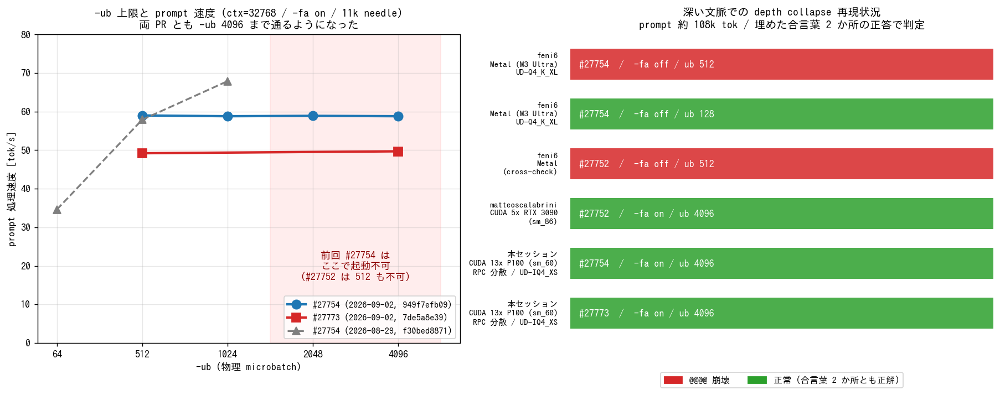

# GLM-5.3-Flash 対応 PR の本命交代を実機で確かめる

- **実施日時**: 2026年9月1日 21:10 〜 9月2日 16:03 JST (上流調査・電源投入・PR 2 本のビルドと 12 構成の起動スイープ・GGUF メタデータのパッチ・108k トークンの深文脈試験・aws-gpu02 の OS ハング 2 回とその復旧・既定構成への復帰)
- **報告日時**: 2026年9月2日 16:03 JST
- **作成者**: Claude Opus 5

## 概要

4 日前に GLM-5.3-Flash の対応 PR を実機検証したとき、本家に取り込まれる本命は [#27752](https://github.com/ggml-org/llama.cpp/pull/27752) だと見立てていた。今回最新版で再検証するにあたり上流を調べ直すと、この見立ては外れており、メンテナのレビューが集中しているのは [#27773](https://github.com/ggml-org/llama.cpp/pull/27773) のほうだった。そこで検証対象を、この新しい本命と、前回いちばん実用的だった [#27754](https://github.com/ggml-org/llama.cpp/pull/27754) の 2 本に絞った。

新しい本命は今回初めて実機に載せた。量子化モデルの配布元が用意した書き換え済みメタデータを差し替えれば読めるはずだったが、層ごとの設定値を並べた配列の長さが合わず失敗した。変換方式の変更に配布元のファイルが追随していないためで、配列の末尾を一要素落とす小さな修正で読み込め、モデル本体はそのまま流用できた。

動かしてみると、両 PR とも前回あった処理単位（microbatch）の上限の制約がほぼ消えていた。その代わり、前回はあった「処理単位を上げると速くなる」という関係も消え、どの設定でも速度は横ばいだった。この間に入った高速化の変更が、速度と処理単位の関係そのものを変えたようである。

前回動かせなかった予測機構（MTP）も今回は動き、生成速度が 3 割ほど速くなった。先読みの受理長が指定した上限に張り付いていたので、上限を上げればさらに伸びる余地がある。一方、PR スレッドで議論されている深い文脈での出力崩壊は、今回の構成では両 PR とも再現しなかった。ただし議論にある条件の片方しか試しておらず、切り分けは未完である。

作業は平坦ではなかった。二台のうち補助側の一台が途中で二度、痕跡を残さずに固まった。当初はビルドが重すぎたせいかと疑ったが、記録上はビルドが始まる前の待機中に停止しており、原因は特定できていない。復帰後は最後まで安定して完走した。

作業後は両機とも本家の本流に戻して再ビルドし、退避していた別件の修正（`--ui-mcp-proxy` が 404 を中継するとクラッシュするバグの自前パッチ）も復元したうえで電源を落としている。

## 添付ファイル

- [実装プラン](attachment/2026-09-02_160322_glm53flash_pr27773_verification/plan.md)
- スクリプト: [図の生成](attachment/2026-09-02_160322_glm53flash_pr27773_verification/mkfig.py) ／ [needle 生成 (2 か所埋め版)](attachment/2026-09-02_160322_glm53flash_pr27773_verification/mkneedle2.py) ／ [GGUF shard1 パッチ](attachment/2026-09-02_160322_glm53flash_pr27773_verification/patch_shard1.py) ／ [応答判定](attachment/2026-09-02_160322_glm53flash_pr27773_verification/check.py) ／ [リクエスト投入](attachment/2026-09-02_160322_glm53flash_pr27773_verification/ask.sh) ／ [構成切替](attachment/2026-09-02_160322_glm53flash_pr27773_verification/run_cfg.sh) ／ [スイープ](attachment/2026-09-02_160322_glm53flash_pr27773_verification/sweep_meas.sh)
- aws-gpu02 の KVM スクショ: [1 回目ハング](attachment/2026-09-02_160322_glm53flash_pr27773_verification/aws-gpu02_hang_console.png) ／ [2 回目ハング](attachment/2026-09-02_160322_glm53flash_pr27773_verification/aws-gpu02_hang2_console.png) ／ [fsck 停止](attachment/2026-09-02_160322_glm53flash_pr27773_verification/aws-gpu02_stuck_1341.png)
- llama-server ログ (#27773): [Shard_Rewrite のみでの失敗](attachment/2026-09-02_160322_glm53flash_pr27773_verification/A0_shardrewrite_fail.log) ／ [ub 512](attachment/2026-09-02_160322_glm53flash_pr27773_verification/log_A1_ub512.log) ／ [ub 1024](attachment/2026-09-02_160322_glm53flash_pr27773_verification/log_A_ub1024.log) ／ [ub 2048](attachment/2026-09-02_160322_glm53flash_pr27773_verification/log_A_ub2048.log) ／ [ub 4096](attachment/2026-09-02_160322_glm53flash_pr27773_verification/log_A_ub4096.log) ／ [ctx 131072](attachment/2026-09-02_160322_glm53flash_pr27773_verification/log_A_c131072_ub4096.log)
- llama-server ログ (#27754): [ub 512](attachment/2026-09-02_160322_glm53flash_pr27773_verification/log_B1_ub512.log) ／ [ub 1024](attachment/2026-09-02_160322_glm53flash_pr27773_verification/log_B_ub1024.log) ／ [ub 2048](attachment/2026-09-02_160322_glm53flash_pr27773_verification/log_B_ub2048.log) ／ [ub 4096](attachment/2026-09-02_160322_glm53flash_pr27773_verification/log_B_ub4096.log) ／ [MTP](attachment/2026-09-02_160322_glm53flash_pr27773_verification/log_B_mtp_ub4096.log) ／ [ctx 131072](attachment/2026-09-02_160322_glm53flash_pr27773_verification/log_B_c131072_ub4096.log)
- 応答 JSON 一式（`r_A*.json` / `r_B*.json`）とスイープログ（`sweep_A.log` / `sweep_B.log` / `chain_B108k.log` / `cfg_*.log`）を同ディレクトリに格納

## 核心発見サマリ



**結論**: 本家 master（`b81c99b47`, 2026-09-02）は依然 `glm5next` / `glm5-next` **未対応**で、PR は**いずれも未マージ**。ただし**本命は #27752 から #27773 へ交代した**（CISC / ngxson がレビュー中、CISC が ggerganov に `kpool` のレビューを依頼。前回レポートの「本命は #27752」は無効）。**#27773 は `Shard_Rewrite` だけでは読めず**、`head_count_kv` の配列長が 46 対 45 で拒否される（#27773 の converter は `num_hidden_layers` ぶんしか書かないが unsloth は NextN 込みの `block_count` ぶん書いている）。**末尾 1 要素を落とす 4 バイト減のパッチ**で読み込め、以降は全項目が通った。**両 PR とも `-ub 4096` まで起動する**ようになり（前回は #27754 が 1024、#27752 が 64 で頭打ち）、その代わり **`-ub` を上げても pp が伸びなくなった**（#27754: 前回 57.9→67.9 が今回 59.0→58.8 で横ばい、#27773: 49.2→49.7）。**#27754 の MTP が初めて起動**し **tg 8.5 → 11.1 t/s（1.31 倍）**、draft 受理率 83.6% / mean len 3.00。**depth collapse は P100 (sm_60) + `-fa on` + `-ub 4096` では両 PR とも再現せず**、107,942 トークンの文書に埋めた合言葉 2 か所を両方とも正答した（#27773 pp 28.7 / #27754 pp 25.9 t/s）。副次的に **aws-gpu02 が痕跡を残さず 2 回ハング**し、2 回目は起動時 fsck が 12 時間停止、3 回目の再起動で復旧した（原因未特定）。

## 前提・目的

前回レポート [GLM-5.3-Flash 対応 PR の最新版を実機検証する](./2026-08-29_220506_glm53flash_upstream_pr_verification.md) から 3 日後の状態を、同じ枠組みで再測する。ユーザ選択により対象は **#27773 と #27754 の 2 本**、**depth collapse の再現を含める**、**後始末は master 復帰 + 電源 OFF** とした。

前回からの主要な変化と、それに対応する検証項目は次のとおり。

| # | 前回時点 | 今回の変化 | 検証方法 |
|---|---|---|---|
| 1 | 本命は #27752 | レビューが #27773 に集中 | #27773 を初めて実機に載せる |
| 2 | GGUF は `Shard_Rewrite` の shard 1 差し替えで足りるはず | 未検証だった | 実際に差し替えて読ませる |
| 3 | `-ub` 上限は #27754 が 1024 / #27752 が 64 | — | `-ub` を 512〜4096 で掃引 |
| 4 | MTP は起動できず未検証（#27752 で試行） | #27754 に MTP が実装された | `--spec-type draft-mtp` で起動・測定 |
| 5 | depth collapse は未報告 | 両 PR で報告され `-ub 128` が回避策とされる | 108k トークンで両 PR を試す |

## 環境情報

| 項目 | 値 |
|---|---|
| メインホスト | aws-gpu01 (10.8.2.1)、Tesla P100 16GB × 7 |
| RPC ワーカー | aws-gpu02 (10.8.2.2)、Tesla P100 16GB × 4 + 12GB × 2、40 core / 94 GB RAM |
| 本家 master（開始時 / 終了時） | `10bf611e5` → **`b81c99b479d4c24e5eeca10de99032ebd343ef8f`**（2026-09-02） |
| 検証 PR ① | #27773 `timkhronos:GLM5.3-Flash` / **`7de5a8e39be48fab0240df5cc2fa22214507288f`**（checkout 時。作業中に `120eb9e4c0` へ進んだ） |
| 検証 PR ② | #27754 `unslothai:glm5next/upstream` / **`949f7efb097eb20ef36fecdb1afaebff9a4ae7ed`**（前回は `f30bed8871`） |
| ビルドフラグ | `-DGGML_CUDA=ON -DGGML_RPC=ON -DGGML_CUDA_FA_ALL_QUANTS=ON -DCMAKE_CUDA_ARCHITECTURES=60`（両機同一コミット） |
| モデル | `unsloth/GLM-5.3-Flash-GGUF:UD-IQ4_XS`（5 shard / 156,822,111,075 B、前回から未更新） |
| #27773 用モデル | 上記の shard 2〜5 をシンボリックリンクで流用し、**パッチ済み shard 1（9,429,980 B）のみ実体**を置いた `UD-IQ4_XS-rewrite/` |

## PR 4 本の現況（2026-09-02 16:00 JST）

| PR | 著者 | 状態 | 特徴 |
|---|---|---|---|
| **#27773** | timkhronos | **OPEN / draft 解除 / MERGEABLE**、**CISC・ngxson がレビュー中**、CISC が ggerganov に `kpool` のレビューを依頼 | arch 名 `glm5-next`。KDA は Kimi-K3、mHC は DeepSeek-V4 の実装を再利用。**MTP は #27917 に分離**。vision は `glm5v` として同梱 |
| #27754 | danielhanchen (unsloth) | OPEN / draft 解除 / MERGEABLE | arch 名 `glm5next`。`00699716c2` "Faster inference" と `d07e71ede7` "Add MTP support" が新規。vision tower 込み |
| #27752 | eauchs | OPEN / draft 解除。作業開始時は **CONFLICTING** だったが終了時には rebase されて MERGEABLE | `n_pool > 65535` の reshape 修正 (`5390dd741f`) が入った。**今回は対象外** |
| #27917 | timkhronos | OPEN / **draft** | #27773 から切り出された MTP。未検証 |

**前回レポートの「本家マージの本命は #27752」は無効**である。#27773 にメンテナのレビューコメントが集中しており、こちらが本流に近い。

## 検証結果

### 項目 1: #27773 の GGUF 互換性 — **`Shard_Rewrite` だけでは足りない**

前回「差分は arch 名と `index_share_mtp` キーの追加だけなので shard 1 の 9.4 MB 入れ替えで済む」と結論したが、**実際に差し替えると読み込みに失敗する**。

```
E llama_model_load: error loading model: error loading model hyperparameters:
  key glm5-next.attention.head_count_kv has wrong array length; expected 45, got 46
E srv  llama_server: exiting due to model loading error
```

原因は per-layer 配列の長さである。#27773 の `conversion/glm.py` は

```python
n_kv_heads = [0 if t == "linear_attention" else 1 for t in layer_types]
assert len(n_kv_heads) == hp["num_hidden_layers"]      # = 45
self.gguf_writer.add_head_count_kv(n_kv_heads)
```

と **trunk の 45 層ぶんだけ**書くのに対し、unsloth の GGUF は `block_count = 46`（NextN ブロック込み）に合わせて **46 要素**で書いている。

shard 1 の配列キーは 3 つあるが、**長さを直す必要があるのは `head_count_kv` だけ**である。`swiglu_clamp_exp` / `swiglu_clamp_shexp` は #27773 側も `[limit] * self.block_count` と NextN 込みで書くため 46 のままでよい。

| キー | unsloth (Shard_Rewrite) | #27773 の期待 | 対応 |
|---|---|---|---|
| `glm5-next.attention.head_count_kv` | 46 要素 | **45 要素** | **末尾 1 要素を削除** |
| `glm5-next.swiglu_clamp_exp` | 46 要素 | 46 要素 | そのまま |
| `glm5-next.swiglu_clamp_shexp` | 46 要素 | 46 要素 | そのまま |

shard 1 は**テンソルを 1 つも持たない純メタデータファイル**（9,429,984 B、中身はほぼ語彙）なので、配列の count を 46→45 に書き換えて末尾 4 バイトを削るバイト単位パッチで足りる（[patch_shard1.py](attachment/2026-09-02_160322_glm53flash_pr27773_verification/patch_shard1.py)）。結果は 9,429,980 B。これで読み込みが通り、NextN 系テンソルは

```
W model has unused tensor blk.45.nextn.eh_proj.weight (size = 35651584 bytes) -- ignoring
W model has unused tensor blk.45.indexer_compressor_gate.weight -- ignoring
```

のように無視される。**MTP を #27917 に分離した #27773 の設計と整合**する挙動である。

なお **3 本の PR は indexer 系のテンソル名がすべて同一**（`blk.%d.indexer.*` と `blk.%d.indexer_compressor_*`）で、#27773 だけが arch 名と KV 接頭辞に `glm5-next` を使う。重みの再変換は依然として不要である。

### 項目 2: `--parallel 1` 制約 — **#27773 でも不要**

#27773 の PR 本文は "Multiple sequences require --kv-unified" と書いているが、`llama-server` の既定が `n_parallel=4 + kv_unified=true` なので**指定を省いてよい**。

```
I srv    load_model: initializing, n_slots = 4, n_ctx_slot = 32768, kv_unified = 'true'
I srv  llama_server: listening on http://0.0.0.0:8000
```

コード側でも `--kv-unified` なしで `n_seq_max > 1` の場合にだけ例外を投げる形になっている（`llama-model.cpp` の `LLM_ARCH_GLM5_NEXT` 分岐）。

### 項目 3: `-ub` の上限 — **両 PR とも 4096 まで通るようになった。ただし速度は伸びない**

ctx 32768 / `-fa on` / `--parallel` 省略で掃引した。速度は 10,620 トークンの needle で測定している。

| `-ub` | #27773 (`7de5a8e39`) | #27754 (`949f7efb09`) | 参考: 前回の #27754 (`f30bed8871`) | 参考: 前回の #27752 |
|---|---|---|---|---|
| 64 | — | — | OK / pp 34.6 | OK |
| 512 | **OK / pp 49.2** | **OK / pp 59.0** | OK / pp 57.9 | **FAIL** 1.60 GiB |
| 1024 | **OK** | **OK / pp 58.8** | OK / pp 67.9（reserve 警告） | **FAIL** 3.20 GiB |
| 2048 | **OK** | **OK / pp 58.9** | 未測定 | **FAIL** 4.39 GiB |
| 4096 | **OK / pp 49.7** | **OK / pp 58.8** | 未測定 | **FAIL** 6.78 GiB |

**#27773 は 512〜4096 のすべてで `graph_reserve` の警告すら出さずに起動した**。#27754 も 4096 まで通り、前回の 1024 上限は解消している。

一方で**速度と `-ub` の関係が変わった**。前回の #27754 は 512→1024 で pp が 57.9→67.9（1.17 倍）と伸びたが、今回は 59.0→58.8 と横ばいである。#27773 も 49.2→49.7 でほぼ変わらない。**この間に入った変更が `-ub` を速度の効くつまみでなくした**ことになる。前回の推奨構成の根拠だった「`-ub` を上げれば速くなる」は今回は成り立たない。

速度そのものは **#27754 が #27773 より約 18% 速い**（58.8 対 49.7）。

### 項目 4: 出力品質 — **両 PR とも同一、2 slot 同時も問題なし**

`temperature 0` で比較した。

| 試験 | #27773 | #27754 |
|---|---|---|
| 短答「日本の首都は」 | `日本の首都は東京です。` / thinking **296 字** | `日本の首都は東京です。` / thinking **296 字** |
| 11k needle（合言葉 2 か所） | 両方正解 / thinking 199 字 | 両方正解 / thinking 199 字 |
| 2 slot 同時 A（`紫陽花7823` `金木犀2290`） | 両方正解 | 両方正解 |
| 2 slot 同時 B（`向日葵4519` `石楠花8846`） | 両方正解 | 両方正解 |

**短答も 11k needle も thinking の長さまで完全に一致**した。前回 #27752 が 2 slot 同時で思考を発散させ 256 トークン上限まで回答に到達しなかった問題は、**#27773 では起きない**。

### 項目 5: MTP (NextN) — **#27754 で初めて起動、tg が 1.31 倍**

前回は #27752 で試して `-ub 512` でも compute buffer 不足で起動できなかった。今回 #27754 に `d07e71ede7` "Add MTP support" が入り、かつ `-ub` の制約が緩んだことで起動した。

```
I common_speculative_init_result: creating MTP draft context against the target model
I slot print_timing: draft acceptance = 0.83636 (46 accepted / 55 generated), mean len = 3.00
```

構成は `ctx 32768 / -fa on / -ub 4096` に `--spec-type draft-mtp --spec-draft-n-max 3 --spec-draft-p-min 0.75` を追加しただけである。

| | MTP なし | MTP あり |
|---|---|---|
| tg | 8.5 t/s | **11.1 t/s（1.31 倍）** |
| pp | 58.8 t/s | 48.9 t/s |
| 11k needle | 両方正解 | 両方正解 |

**mean len が 3.00 で `--spec-draft-n-max 3` の上限に張り付いている**ので、n-max を 4〜6 に上げればさらに伸びる余地がある（未測定）。

#27773 側の MTP は #27917 に分離済みで、本 PR では NextN テンソルが unused 扱いになるため試していない。

### 項目 6: depth collapse — **P100 (sm_60) + `-fa on` では両 PR とも再現せず**

PR スレッドで議論されている、深い文脈で `@@@@…` を吐き続ける崩壊である。報告は分かれていた。

| 報告者 | 環境 | 構成 | 結果 |
|---|---|---|---|
| feni6 | Metal (M3 Ultra 512GB) / UD-Q4_K_XL | #27754、`-fa off`、`-ub 512` | **崩壊**（108,710 tok の byte-identical prompt で確実に再現） |
| feni6 | 同上 | #27754、`-fa off`、`-ub 128` | 正常（全構成で回避できる） |
| feni6 | 同上 | #27752 でも同じ境界プロンプトで再現 | **崩壊** |
| matteoscalabrini | CUDA 5× RTX 3090 (sm_86) | #27752、`-fa on`、`-ub 4096` | 正常 |
| **本セッション** | **CUDA 13× P100 (sm_60) / RPC 分散 / UD-IQ4_XS** | **#27773、`-fa on`、`-ub 4096`** | **正常** |
| **本セッション** | 同上 | **#27754、`-fa on`、`-ub 4096`** | **正常** |

判定は feni6 の方式に合わせ、**全体の 12% 地点と 88% 地点に別々の合言葉を埋めた文書**を投げて両方を正確に答えられるかで見た（[mkneedle2.py](attachment/2026-09-02_160322_glm53flash_pr27773_verification/mkneedle2.py)）。両 PR に**同一のプロンプト**（107,942 トークン）を使っている。

| PR | ctx | pp | 応答 | 判定 |
|---|---|---|---|---|
| #27773 | 131072 | 28.7 t/s | `睡蓮5172` `竜胆9438` / thinking 246 字 | **崩壊なし・両方正解** |
| #27754 | 131072 | 25.9 t/s | `睡蓮5172` `竜胆9438` / thinking 240 字 | **崩壊なし・両方正解** |

**sm_60 + RPC 分散という誰も試していない組み合わせで、matteoscalabrini の「CUDA + `-fa on` では起きない」を補強する陰性データ点が得られた**。ただし本セッションは `-fa off` を一度も試していないので、**`-fa` のどちらが効いているのか、それとも backend の違いなのかは切り分けできていない**。feni6 は Metal で `-fa off` のみ、matteoscalabrini は CUDA で `-fa on` のみを報告しており、この 2 軸は依然として交絡している。

なお ctx 131072 での起動では両 PR とも `graph_reserve: failed to allocate compute buffers` が出るが、**前回の副次発見どおりこれは致命ではなく**、そのまま起動して 108k トークンを処理しきった。

## 実測値まとめ

### 起動スイープ全 12 試行

| # | PR | ctx | -ub | -fa | MTP | 結果 | pp (t/s) |
|---|---|---|---|---|---|---|---|
| A0 | 27773 | 32768 | 512 | on | — | **FAIL** `head_count_kv` 配列長 46≠45（Shard_Rewrite 素のまま） | — |
| A1 | 27773 | 32768 | 512 | on | — | **OK**（パッチ済み shard 1） | 49.2 |
| A2 | 27773 | 32768 | 512 | on | — | **OK** 2 slot 同時 4 つとも正解 | 45.7 / 22.1 |
| A3 | 27773 | 32768 | 1024 | on | — | **OK** | — |
| A4 | 27773 | 32768 | 2048 | on | — | **OK** | — |
| A5 | 27773 | 32768 | 4096 | on | — | **OK** | 49.7 |
| A6 | 27773 | 131072 | 4096 | on | — | **OK**（reserve 警告あり）108k で崩壊なし | 28.7 |
| B1 | 27754 | 32768 | 512 | on | — | **OK** | 59.0 |
| B2 | 27754 | 32768 | 1024 | on | — | **OK** | 58.8 |
| B3 | 27754 | 32768 | 2048 | on | — | **OK** | 58.9 |
| B4 | 27754 | 32768 | 4096 | on | — | **OK** 2 slot 同時 4 つとも正解 | 58.8 |
| B5 | 27754 | 32768 | 4096 | on | **あり** | **OK** tg 11.1（受理率 83.6%） | 48.9 |
| B6 | 27754 | 131072 | 4096 | on | — | **OK**（reserve 警告あり）108k で崩壊なし | 25.9 |

### VRAM

| 構成 | aws-gpu01 (7 GPU / 114,688 MiB) | aws-gpu02 (6 GPU / 90,112 MiB) |
|---|---|---|
| #27773 / ctx 32768 / ub 4096 | 89,966 MiB 使用、最小空き **1,714 MiB** | 69,834 MiB 使用、最小空き **578 MiB** |
| #27754 / ctx 131072 / ub 4096 | 92,170 MiB 使用、最小空き **1,316 MiB** | 71,924 MiB 使用、最小空き **178 MiB** |

ctx 131072 では aws-gpu02 の最小空きが 178 MiB まで詰まる。**これ以上 ctx を伸ばす余地はほぼない**（前回 ctx 262144 は `-ub 64` で 126 MiB だった）。

## aws-gpu02 の OS ハング

作業中に aws-gpu02 が**痕跡を残さず 2 回ハング**した。CLAUDE.md の手順に従い、電源操作の前に KVM スクショで証跡を保全している。

| # | 発生時刻 | 直前の操作 | ジャーナル最終行 | コンソール |
|---|---|---|---|---|
| 1 | 2026-09-02 00:35:01 | `git fetch/checkout pr27754`（00:34:55〜57） | 00:35:01（cron の通常ログ） | ログインプロンプトのみ。Enter を送っても getty 無反応 |
| 2 | 2026-09-02 01:17:12 | なし（起動 1 分後、アイドル中） | 01:17:12 | 同上 |

**当初はビルドが原因（`-j $(nproc)` = 40 並列の nvcc による OOM）と疑ったが、ジャーナルはいずれもビルド開始前に途切れている**。1 回目はビルド起動コマンドを打つ 84 秒前、2 回目に至っては起動 1 分後のアイドル中である。`journalctl` に MCE / EDAC / NVRM Xid いずれの記録もなく、**痕跡を残さないハードロックアップ**である。

2 回目のリセット後は **initramfs の fsck (`/dev/sda2: recovering journal`) で 12 時間以上停止**した。1 分間隔で撮ったスクショがバイト単位で一致し、画面が一切進んでいないことを確認している。3 回目のハードリセットで正常に起動し、以後 2 時間半の連続稼働（#27754 のフルビルドと 108k トークンの推論を含む）を問題なく完走した。

**原因は特定できていない。** 直近 4 ブートのうち 2 ブートで発生しており、再発の可能性がある。

## 再現方法

```bash
# 1) 電源投入（ユーザの明示的指示がある場合のみ）
ALLOW_FAN_NOISE=1 .claude/skills/gpu-server/scripts/bmc-power.sh aws-gpu01 on
ALLOW_FAN_NOISE=1 .claude/skills/gpu-server/scripts/bmc-power.sh aws-gpu02 on
until timeout 8 ssh -o ConnectTimeout=5 -o BatchMode=yes aws-gpu01 true 2>/dev/null; do sleep 15; done
until timeout 8 ssh -o ConnectTimeout=5 -o BatchMode=yes aws-gpu02 true 2>/dev/null; do sleep 15; done

# 2) ロック（両機）
.claude/skills/gpu-server/scripts/lock.sh aws-gpu01
.claude/skills/gpu-server/scripts/lock.sh aws-gpu02

# 3) aws-gpu01 のローカル修正を退避
ssh -n aws-gpu01 "cd ~/llama.cpp && mkdir -p ~/patches && git diff > ~/patches/\$(date +%F)-local.patch \
  && git stash push -m pre-glm5next -- tools/server/server-http.cpp"

# 4) #27773 用 GGUF を用意（非破壊。実体は shard 1 の 9.4 MB のみ）
source ~/.config/gpu-server/.env
curl -sL -H "Authorization: Bearer $HF_TOKEN" -o /tmp/shard1_rewrite.gguf \
  "https://huggingface.co/unsloth/GLM-5.3-Flash-GGUF/resolve/main/Shard_Rewrite/GLM-5.3-Flash-UD-IQ4_XS-00001-of-00005.gguf_file"
python3 patch_shard1.py /tmp/shard1_rewrite.gguf /tmp/shard1_pr27773.gguf   # head_count_kv を 46→45
scp /tmp/shard1_pr27773.gguf aws-gpu01:/tmp/
ssh -n aws-gpu01 'D=~/models/GLM-5.3-Flash-GGUF; mkdir -p $D/UD-IQ4_XS-rewrite
  cp /tmp/shard1_pr27773.gguf $D/UD-IQ4_XS-rewrite/GLM-5.3-Flash-UD-IQ4_XS-00001-of-00005.gguf
  for i in 2 3 4 5; do ln -sf $D/UD-IQ4_XS/GLM-5.3-Flash-UD-IQ4_XS-0000$i-of-00005.gguf \
    $D/UD-IQ4_XS-rewrite/GLM-5.3-Flash-UD-IQ4_XS-0000$i-of-00005.gguf; done'

# 5) 両機を PR でビルド（コミット一致が必須。ccache が効けば 5 分、cold なら 20 分）
for S in aws-gpu01 aws-gpu02; do
  ssh -n $S "cd ~/llama.cpp && git fetch origin pull/27773/head:pr27773 && git checkout pr27773 && git rev-parse HEAD"
done
scp .claude/skills/llama-server/server-scripts/update_and_build-aws-gpu01.sh aws-gpu01:~/llama.cpp/update_and_build.sh
scp .claude/skills/llama-server/server-scripts/update_and_build-aws-gpu02.sh aws-gpu02:~/llama.cpp/update_and_build.sh
timeout 40 ssh -n aws-gpu01 "cd ~/llama.cpp && setsid nohup ./update_and_build.sh --no-pull --force > /tmp/build.log 2>&1 < /dev/null &" || true
timeout 40 ssh -n aws-gpu02 "cd ~/llama.cpp && setsid nohup ./update_and_build.sh --no-pull --force > /tmp/build.log 2>&1 < /dev/null &" || true
while ssh -n aws-gpu01 "pgrep -f '[u]pdate_and_build' >/dev/null"; do sleep 60; done
while ssh -n aws-gpu02 "pgrep -f '[u]pdate_and_build' >/dev/null"; do sleep 60; done

# 6) RPC ワーカー → llama-server
.claude/skills/llama-server/scripts/rpc-up.sh aws-gpu02
timeout 60 ssh -n aws-gpu01 "cd ~/llama.cpp && setsid nohup env NVIDIA_TF32_OVERRIDE=0 ./build/bin/llama-server \
  --model ~/models/GLM-5.3-Flash-GGUF/UD-IQ4_XS-rewrite/GLM-5.3-Flash-UD-IQ4_XS-00001-of-00005.gguf \
  --alias 'GLM-5.3-Flash-UD-IQ4_XS' --rpc 192.168.100.2:50052 \
  --n-gpu-layers 999 --ctx-size 32768 -fa on --poll 0 -b 512 -ub 4096 \
  --jinja --temp 1.0 --top-p 0.95 --host 0.0.0.0 --port 8000 \
  > /tmp/llama-server.log 2>&1 < /dev/null &" || true
until ssh -n aws-gpu01 "grep -q 'listening on' /tmp/llama-server.log" \
   || ssh -n aws-gpu01 "grep -qiE 'exiting due to model loading error|CUDA error' /tmp/llama-server.log"; do sleep 20; done
curl -s http://10.8.2.1:8000/health
```

`#27754` を試す場合は手順 4 を飛ばし、`pull/27754/head` を checkout して**元の `UD-IQ4_XS/`** を指定する。

### 停止と既定構成への復帰

```bash
.claude/skills/llama-server/scripts/stop.sh aws-gpu01     # llama-server → RPC の順。逆は不可
.claude/skills/llama-server/scripts/rpc-down.sh aws-gpu02
for S in aws-gpu01 aws-gpu02; do ssh -n $S "cd ~/llama.cpp && git checkout master && git pull --ff-only"; done
ssh -n aws-gpu01 "cd ~/llama.cpp && git stash pop"        # 404 修正パッチを復元
# 両機で update_and_build.sh --no-pull --force を流し直す
.claude/skills/gpu-server/scripts/unlock.sh aws-gpu01
.claude/skills/gpu-server/scripts/unlock.sh aws-gpu02
ALLOW_FAN_NOISE=1 .claude/skills/gpu-server/scripts/bmc-power.sh aws-gpu01 soft
ALLOW_FAN_NOISE=1 .claude/skills/gpu-server/scripts/bmc-power.sh aws-gpu02 soft
```

## 推奨構成（現時点）

**速度を採るなら #27754、本家追従を採るなら #27773** である。

```bash
# #27754: pp 58.8 t/s、MTP で tg 11.1 t/s。GGUF はそのまま使える
ssh aws-gpu01 "cd ~/llama.cpp && setsid nohup env NVIDIA_TF32_OVERRIDE=0 ./build/bin/llama-server \
  --model ~/models/GLM-5.3-Flash-GGUF/UD-IQ4_XS/GLM-5.3-Flash-UD-IQ4_XS-00001-of-00005.gguf \
  --alias 'GLM-5.3-Flash-UD-IQ4_XS' --rpc 192.168.100.2:50052 \
  --n-gpu-layers 999 --ctx-size 32768 \
  -fa on --poll 0 -b 512 -ub 4096 \
  --spec-type draft-mtp --spec-draft-n-max 3 --spec-draft-p-min 0.75 \
  --jinja --temp 1.0 --top-p 0.95 --host 0.0.0.0 --port 8000 \
  > /tmp/llama-server.log 2>&1 < /dev/null &"
```

- **ブランチは #27754（`949f7efb09` 以降）**。pp は #27773 より 18% 速く、MTP で tg が 1.31 倍になる
- **本家マージを見据えるなら #27773**。ただし GGUF に `head_count_kv` のパッチが要り、MTP は使えない
- `--parallel` は**省略してよい**（両 PR とも 2 slot 同時で品質を保つ）
- **`-ub` は速度に効かなくなった**ので、VRAM に余裕を持たせたいなら 512 でよい
- ctx は 131072 まで動くが aws-gpu02 の最小空きが 178 MiB になる

## 上流への動作報告 (#27773)

### まず: llama.cpp は AI が書いた投稿文を禁止している

**本セッションで英語の投稿本文を起草して投稿したところ、spam としてマークされた。**
原因は llama.cpp 自身のポリシーである。`CONTRIBUTING.md` の AI Usage Policy 第 5 項:

> It is strictly prohibited to use AI to write your posts for you
> (bug reports, feature requests, pull request descriptions, Github discussions, responding to humans, ...).

`AGENTS.md` にも同趣旨の記述がある。

> Contributors must: ... 3. **Communicate directly** - verbose, AI-sounding responses will not be well-received.
>
> ### Prohibited AI Usage (results in immediate PR closure)
> - AI-written PR descriptions, commit messages, or reviewer responses

GitHub で collaborator がコメントを隠す際の理由リストに Spam があるため、**メンテナが
AI 生成投稿として手で隠した可能性が高い**（自動フィルタが外部リンクと
`Authorization: Bearer` を含む長文に反応した線もあるが、この repository の方針を踏まえると前者が有力）。

**さらに `CONTRIBUTING.md` には次の記述がある。アカウントに影響しうる。**

> Undisclosed AI usage may result in your account being permanently banned from contributing to the project.

したがって **llama.cpp への投稿は、Claude に本文を書かせてはならない**。
同じ文面の再投稿と、スレッド内での反論も避けること。

**Claude の役割は素材出しに限る** — エラー文字列、原因の切り分け、確認済みの数値までを出し、
**投稿する文章は人間が自分の言葉で書く**。なお AI 生成「コード」は許可されており
（`AI-generated code is allowed`）、禁じられているのは**投稿文**である点に注意。

### 報告先と、そこを選ぶ理由

**#27773 に出す**のが最も価値が高い。理由は 3 つ。

1. **再現手順が確定していて、著者が対応を判断できる具体的な不具合である** — 配列長の不一致という単一の原因に切り分けられており、直す範囲もはっきりしている
2. **unsloth の danielhanchen が「#27773 に備えて `Shard_Rewrite/` を用意した」と当の PR にコメントしている**（2026-08-29）。その用意が実際には機能していないことを伝える意味がある
3. **メンテナ（CISC / ngxson）のレビューが動いている最中**で、いま出せば設計判断に間に合う

### 投稿の素材（人間がこれを見て自分の言葉で書く）

伝えるべき事実は 5 つ。**10 行程度に収まる**はずである。

| # | 事実 | 根拠 |
|---|---|---|
| 1 | `Shard_Rewrite/` の shard 1 を使うと読み込みが失敗する | `key glm5-next.attention.head_count_kv has wrong array length; expected 45, got 46` |
| 2 | GGUF 側は `block_count` = 46（45 trunk + NextN 1）で per-layer 配列を書き、この PR の `conversion/glm.py` は `num_hidden_layers` = 45 で書いている | `assert len(n_kv_heads) == hp["num_hidden_layers"]` |
| 3 | **食い違うのは `head_count_kv` だけ**。`swiglu_clamp_exp` / `_shexp` は両方 46 で一致 | この PR 側も `[limit] * self.block_count` で書いている |
| 4 | shard 1 はテンソルを持たない（メタデータ + 語彙のみ）ので、配列を 45 要素に切れば読める。**重みの再変換は不要** | 同じ 146 GiB が #27754 では 46 要素のまま読める |
| 5 | 聞きたいこと: ローダが `block_count` 長を受けるべきか、配布側が出し直すべきか。master の #28159 が `n_layer_nextn` の読み出し順を変えたばかりなので、そこと揃える話かもしれない | — |

**書き方の目安**:

- 見出しを使わない、表を使わない
- 箇条書きは使うとしても素の文で。太字リードを付けない
- エラーは 1 行だけ引用する
- `curl` やディレクトリ構築の手順は**書かない**（聞かれてから出す）
- 「Happy to ...」のような定型の申し出を付けない
- 環境は 1 行で足りる（13x Tesla P100 / RPC 分散 / `UD-IQ4_XS` / commit）

### 動作報告（今回は出さない）

13 GPU / sm_60 / RPC 分散 / 146 GiB という構成での検証結果（`-ub` 4096 まで通る、2 slot 同時が正しい、
ctx 131072 で 108k トークンが coherent、VRAM 実測）は本レポートの「実測値まとめ」にある。

**ただし当面は投稿しない。** 理由は 2 つ。

1. **spam マークの直後に別の投稿を重ねるべきではない**
2. 動作報告は長くなりがちで、**短く人間らしく書くのが難しい**。バグ報告が受け入れられ、
   著者から反応があってから、求められた範囲だけを答える形にするのが安全

depth collapse の陰性データについては、投稿するとしても**厳密な再現試行ではない**ことを
必ず明記する（量子化が `UD-IQ4_XS` で feni6 の `UD-Q4_K_XL` と違う、プロンプトが byte-identical でない、
`-fa off` を試していないので `-fa` と backend が交絡している）。

### 投稿前に確認すること

- **本文は人間が書く。** Claude に書かせない
- **`7de5a8e39` は既に古い**（作業中に `120eb9e4c0` へ進んだ）。投稿時点の HEAD で同じ失敗が出るか再確認する
- spam マークされた既存コメントには触れない（再投稿・反論をしない）

## 作業後の状態

| 項目 | 状態 |
|---|---|
| llama.cpp | 両機とも **master `b81c99b479`** に復帰し再ビルド済み（次回 `llama-up.sh aws-gpu01` で既定の DeepSeek-V4-Flash 構成をそのまま使える） |
| 退避パッチ | aws-gpu01 の `--ui-mcp-proxy` 404 修正を `git stash pop` で**復元済み**（`M tools/server/server-http.cpp`）。`~/patches/2026-09-01-local.patch` も残置 |
| llama-server / RPC ワーカー | いずれも停止済み |
| 電源 | 両機とも ACPI グレースフルで OFF |
| ロック | aws-gpu01 は解放済み。aws-gpu02 は 3 回のリセットで `/tmp/gpu-server-locks/` ごと消えていた（`lock.md` の既知挙動） |
| モデル | `~/models/GLM-5.3-Flash-GGUF/UD-IQ4_XS/`（146 GiB）残置。`UD-IQ4_XS-rewrite/`（#27773 用、実体 9.4 MB のみ）も残置 |
| aws-gpu02 | 3 回目のリセット後は安定。**ハングの原因は未特定で再発の可能性あり** |

## 副次発見

- **llama.cpp は AI が書いた投稿文を禁止している**。`CONTRIBUTING.md` の AI Usage Policy 第 5 項と `AGENTS.md` の Prohibited AI Usage に明記があり、本セッションで起草した英語の投稿本文は **spam としてマークされた**。`Undisclosed AI usage may result in your account being permanently banned` ともあるためアカウントに影響しうる。**投稿前に対象リポジトリの AI ポリシーを確認すること**。詳細は「上流への動作報告」節

- **`Shard_Rewrite` は #27773 用として不完全**。unsloth は「#27773 に備えて用意した」と PR コメントで述べているが、`head_count_kv` の配列長が合っておらず**そのままでは読めない**。配布元に報告する価値がある
- **`-ub` は速度のつまみではなくなった**。前回 #27754 で 512→1024 が 1.17 倍だったのが今回は横ばい。**過去の測定値を根拠に構成を決めると外す**
- **バックグラウンドの待機ジョブが即座に終了扱いになる現象が今回も多発した**（前回の副次発見と同じ）。加えて **`Monitor` ツールが 2 回、実際には存在しない結果を報告した** — 1 回は完了していない条件を「検出」し、もう 1 回は `check.py` が出しえない書式（`COLLAPSE: MISSING`）を含む応答を返した。**長時間ジョブの結果は必ず前景のコマンドで裏取りすること**。本レポートの数値はすべて前景で再取得したものである
- **`git status` が空でないうちに `pkill -f 'build/bin/llama-serv'` を ssh 越しに撃つと自分にマッチする**。パターンを `[b]uild/...` と書くか pidfile を使う（既知だが再発した）
- **日本語プロンプトのトークン換算は約 1.36 文字/トークン**。前回の `mkneedle.py` を既定の `n_para=170` で使うと 47,828 トークンになり、ctx 32768 を超えて 400 エラーになる。11k を狙うなら `n_para=39`、108k なら `n_para=386`

## 残課題

- **`-fa` と backend の交絡**: depth collapse について本セッションは `-fa on` しか試していない。**同じ 108k プロンプトを `-fa off` で流せば**、崩壊が `-fa` 由来か backend 由来かを切り分けられる。1 試行あたり 40 分程度
- **`-ub 128` の挙動**: feni6 の回避策が P100 で意味を持つか未測定（そもそも崩壊しないので確認しようがない）
- **MTP の `--spec-draft-n-max`**: mean len 3.00 で上限に張り付いている。4〜6 で再測する価値がある
- **#27917 (MTP for #27773)**: 未検証。draft 状態
- **#27752 の `n_pool > 65535` reshape**: `5390dd741f` が入り matteoscalabrini が 5×3090 で検証済みだが、本セッションでは #27752 を対象外にしたため未追試
- **aws-gpu02 のハング原因**: 痕跡なし。再発したらメモリ試験（memtest）やストレージの SMART 確認を検討する
- **本家マージ待ち**: #27773 にメンテナのレビューが入っている。マージされれば master ビルドに戻せる

## 参照レポート

- [GLM-5.3-Flash 対応 PR の最新版を実機検証する](./2026-08-29_220506_glm53flash_upstream_pr_verification.md)（本レポートの前提。**「本命は #27752」「Shard_Rewrite の差し替えで済む」という 2 点が本レポートで更新された**）
- [GLM-5.3-Flash を aws-gpu01/02 の RPC 分散で起動する](./2026-08-27_235754_glm53flash_aws_gpu_rpc_startup.md)
- [DeepSeek-V4-Flash を 2 台の GPU サーバに RPC 分散して動かす](./2026-08-16_175749_deepseek_v4_rpc_dual_gpu_server.md)
