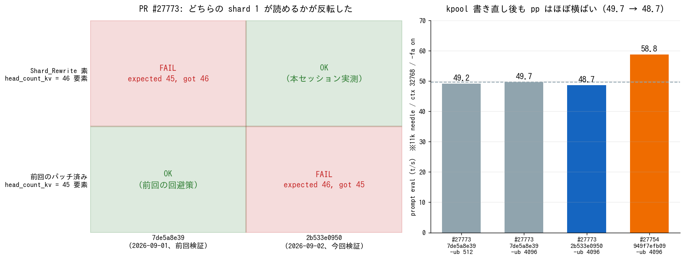

# GLM-5.3-Flash #27773 の GGUF 受理条件が反転したことを実機で確認

- **実施日時**: 2026年9月3日 02:35 〜 04:05 JST (上流の再調査・プラン策定・両機の電源投入・PR ブランチのビルド・未パッチ shard 1 での起動確認・パッチ済み shard 1 での対照試験・11k needle と 2 slot 同時の品質確認・master 復帰と電源断)
- **報告日時**: 2026年9月3日 03:59 JST
- **作成者**: Claude Opus 5

## 概要

前回のセッションでは、GLM-5.3-Flash に対応する PR を実機で試したときに、配布元が用意した書き換え済みメタデータをそのまま使うと読み込みに失敗した。層ごとの設定値を並べた配列の長さが、モデル側と PR 側で一つ食い違っていたためである。そのときは配列の末尾を一要素削る小さな修正で回避し、モデル本体はそのまま流用できた。

ところがその直後に上流がこの食い違いを修正し、しかも直し方がこちらの回避策とは逆向きだった。前回のレポートはこの点をコードを読んだだけで判断しており、実機では確かめていない。回避策が現在では逆に有害になっているはずだ、という予測も同じく未確認のままだった。この宿題に決着をつけるのが今回の作業である。

結果は予測どおりだった。書き換え済みメタデータは何も手を加えずに読み込めるようになっており、逆に前回作った修正済みファイルは、まったく反対のエラーで拒否された。同じ二つのファイルが、コミットをまたいで可否を入れ替えた形になる。前回のレポートに残した「実機未確認」の但し書きは、これで両方向とも裏づけが取れた。

読み込みが通ったあとの動作も確認した。短い質問への回答、長文に埋めた合言葉の探索、二つの依頼を同時に処理させる試験のいずれも問題なく、速度も前回とほとんど変わらなかった。この間に入った内部実装の書き直しは、少なくとも今回試した範囲では速度にも品質にも影響していない。

ひとつ想定外だったのは、作業の対象そのものが途中で動いたことである。計画を立てた時点で最新だったコミットは、実際にサーバへ取り込む段階では既に一つ先へ進んでいた。差分を確認したところ今回の検証内容には関わらない箇所だったため、そのまま最新のもので進めた。前回のレポートが教訓として書いた「活発な開発中のものを検証すると、その最中に上流が動く」が、わずか一時間ほどの間に再現したことになる。

副次的な収穫として、ビルドにかかる時間が想定よりずっと短いことが分かった。計画では二十分から四十分を見込んでいたが、実際には数分で終わっている。また前回の作業を通じて二度停止した補助側のサーバは、今回は起動から終了まで安定して動いた。

作業後は両機とも本家の本流に戻して再ビルドし、退避していた別件の修正も復元したうえで電源を落としている。前回残していた有害なファイルも無害なものに差し戻した。

## 添付ファイル

- [実装プラン](attachment/2026-09-03_035920_glm53flash_pr27773_head_recheck/plan.md)
- スクリプト: [図の生成](attachment/2026-09-03_035920_glm53flash_pr27773_head_recheck/mkfig2.py) ／ [needle 生成](attachment/2026-09-03_035920_glm53flash_pr27773_head_recheck/mkneedle2.py) ／ [応答判定](attachment/2026-09-03_035920_glm53flash_pr27773_head_recheck/check.py) ／ [リクエスト投入](attachment/2026-09-03_035920_glm53flash_pr27773_head_recheck/ask.sh) ／ [構成切替](attachment/2026-09-03_035920_glm53flash_pr27773_head_recheck/run_cfg.sh)
- llama-server ログ: [C1 未パッチ shard 1（成功）](attachment/2026-09-03_035920_glm53flash_pr27773_head_recheck/log_C1_nopatch.log) ／ [C2 パッチ済み shard 1（失敗）](attachment/2026-09-03_035920_glm53flash_pr27773_head_recheck/log_C2_patched.log)
- 応答 JSON: [短答](attachment/2026-09-03_035920_glm53flash_pr27773_head_recheck/r_C1_short.json) ／ [11k needle](attachment/2026-09-03_035920_glm53flash_pr27773_head_recheck/r_C1_n11k.json) ／ [2 slot A](attachment/2026-09-03_035920_glm53flash_pr27773_head_recheck/r_C1_slotA.json) ／ [2 slot B](attachment/2026-09-03_035920_glm53flash_pr27773_head_recheck/r_C1_slotB.json)
- プロンプト: `needle_11k.json` / `needle_2slot_a.json` / `needle_2slot_b.json` / `short.json` を同ディレクトリに格納

## 核心発見サマリ



**結論**: 前回レポートが**コード読解のみで「実機未確認」と留保した 2 つの予測は、両方向とも実機で裏づけられた**。#27773 の現 HEAD **`2b533e0950b6b57decf0da01a79521db3612c22d`**（2026-09-02 17:53 UTC「Kpool pooled caching clarify」）で、**unsloth の `Shard_Rewrite/` shard 1 は未パッチのまま読み込める**（cold ロード 11 分 04 秒で `listening on`、NextN 系 29 テンソルは `unused tensor ... -- ignoring`）。逆に**前回作ったパッチ済み shard 1（45 要素）は `key glm5-next.attention.head_count_kv has wrong array length; expected 46, got 45` で拒否される** — 前回の `expected 45, got 46` と**エラーが完全に反転した**。受理側が倒れたのはローダ側の本家 master **#28173「model : load relevant arrays with n_layer_all」（2026-09-01 16:58 UTC マージ）**と、変換側 `conversion/glm.py` の `# Pad to block_count`（PR 内 `9fe9fd71f8` "Repad n_head_kv"）の両方による。GGUF メタデータを直接読み出して、`Shard_Rewrite` 未パッチ = 46 要素 / 前回パッチ済み = 45 要素 / `block_count` = 46 を数値で確定させた。**`7de5a8e39` → `2b533e0950` の間に入った kpool 実装の書き直し（`llama-memory-hybrid-idx.cpp` を中心に 2 コミット）は速度に影響せず**、11k needle の pp は **49.7 → 48.7 t/s** とほぼ横ばい（#27754 の 58.8 t/s との差 18% も変わらず）。品質も 11k needle の合言葉 2 か所、2 slot 同時の 4 か所すべて正答した。副次的に **プラン承認から checkout までの約 35 分で PR HEAD が `fe3187de7a` → `2b533e0950` へ進んだ**（前回レポートの教訓が同一セッション内で再現）、**ビルドは ccache なしのフルビルドでも 4 分 12 秒 / 7 分 22 秒**（見積り 20〜40 分は過大）、**aws-gpu02 は今回ハングせず**完走した。

## 前提・目的

前回レポート [GLM-5.3-Flash 対応 PR の本命交代を実機検証する](./2026-09-02_160322_glm53flash_pr27773_verification.md) の残課題の筆頭が「`head_count_kv` 修正の実機確認」だった。同レポートは以下 2 点を**コードを読んだだけで**書いており、実機では確認できていなかった（確認前に両機を電源断していたため）。

1. 現 HEAD なら `Shard_Rewrite/` の shard 1 が**未パッチのまま読めるはず**
2. 前回のワークアラウンド（配列を 45 に切る）は現 HEAD では**逆に有害なはず**

ユーザ依頼は「現在の最新コミットの動作確認」であり、上記 2 点の決着がその中身になる。検証範囲はユーザ選択により **C1〜C3**（読み込み可否の両方向 + 基本動作・速度）とし、108k の depth collapse 再走と `-fa off` での交絡切り分けは今回のスコープから外した。後始末は master 復帰 + 電源 OFF とした。

## 環境情報

| 項目 | 値 |
|---|---|
| メインホスト | aws-gpu01 (10.8.2.1)、Tesla P100 16GB × 7 |
| RPC ワーカー | aws-gpu02 (10.8.2.2)、Tesla P100 16GB × 4 + 12GB × 2 |
| RPC 経路 | 100GbE 直結 `192.168.100.2:50052`（MTU 9000） |
| **検証 PR** | **#27773 `timkhronos:GLM5.3-Flash` `2b533e0950b6b57decf0da01a79521db3612c22d`** |
| ビルド識別子 | `build 10782, commit 2b533e095`（両機一致） |
| ビルドフラグ | `-DGGML_CUDA=ON -DGGML_RPC=ON -DGGML_CUDA_FA_ALL_QUANTS=ON -DCMAKE_CUDA_ARCHITECTURES=60`（`update_and_build-aws-gpu0N.sh` 既定） |
| モデル | `unsloth/GLM-5.3-Flash-GGUF:UD-IQ4_XS`（5 shard / 156,822,111,075 B、前回から未更新） |
| C1 用 shard 1 | `Shard_Rewrite/GLM-5.3-Flash-UD-IQ4_XS-00001-of-00005.gguf_file`（**9,429,984 B、未パッチ**）を `UD-IQ4_XS-nopatch/` に配置、shard 2〜5 はシンボリックリンク |
| C2 用 shard 1 | 前回の `UD-IQ4_XS-rewrite/`（**9,429,980 B、パッチ済み**） |
| 本家 master（作業前 / 作業後） | `b81c99b479` → **`9cc33944f9`**（2026-09-02） |
| llama-server 起動構成 | `--ctx-size 32768 -fa on --poll 0 -b 512 -ub 4096 --jinja --temp 1.0 --top-p 0.95`、`--parallel` 省略 |

### 対象コミットが作業中に進んだ

プラン策定時（02:40 JST 頃）の PR HEAD は `fe3187de7a`「Review cleanup」で、**前回レポートが「修正コミット」と特定したものそのもの**だった。ところが 03:14 JST に実際に `git checkout` した時点では **`2b533e0950`「Kpool pooled caching clarify」（2026-09-02 17:53 UTC = 09-03 02:53 JST）へ進んでいた**。

差分は kpool のキャッシュ処理のみで、検証対象の `head_count_kv` 経路には触れていない。

| ファイル | 差分 |
|---|---|
| `src/llama-memory-hybrid-idx.cpp` | +16/-9 |
| `src/llama-memory-hybrid-idx.h` | +4/-4 |
| `src/models/glm5-next.cpp` | +1/-0 |

`src/llama-model.cpp:1290,1299` は `n_layer_all` のまま、`conversion/glm.py:464-465` の `# Pad to block_count` も存置されていることをサーバ上の作業ツリーで直接確認したうえで、**ユーザ依頼の「現在の最新コミット」に忠実に `2b533e0950` を対象とした**。

## 検証結果

### 前提の数値確定 — GGUF メタデータの直読み

起動を試す前に、3 種類の shard 1 のメタデータを `gguf-py` で直接読み出した。

```bash
ssh aws-gpu01 'cd ~/llama.cpp && PYTHONPATH=gguf-py python3 -c "from gguf import GGUFReader; ..."'
```

| shard 1 | `general.architecture` | `head_count_kv` | `swiglu_clamp_exp` / `_shexp` |
|---|---|---|---|
| `UD-IQ4_XS/`（unsloth 素） | **`glm5next`** | 46 | 46 / 46 |
| `UD-IQ4_XS-nopatch/`（`Shard_Rewrite` 未パッチ） | **`glm5-next`** | **46** | 46 / 46 |
| `UD-IQ4_XS-rewrite/`（前回のパッチ済み） | `glm5-next` | **45** | 46 / 46 |

`block_count` はいずれも 46（45 trunk + 1 NextN）。**arch 名が `glm5next`（unsloth 素、#27754 用）と `glm5-next`（`Shard_Rewrite`、#27773 用）で異なる**ことも改めて確認できた。

### C1: 未パッチ `Shard_Rewrite` shard 1 — **読み込み成功**

```
0.00.348.018 I srv    load_model: loading model '.../UD-IQ4_XS-nopatch/GLM-5.3-Flash-UD-IQ4_XS-00001-of-00005.gguf'
0.04.588.949 W model has unused tensor blk.45.attn_norm.weight (size = 16384 bytes) -- ignoring
    ...（NextN ブロックのテンソル計 29 個）...
0.04.589.318 W model has unused tensor blk.45.nextn.eh_proj.weight (size = 35651584 bytes) -- ignoring
11.04.339.273 I srv    load_model: initializing, n_slots = 4, n_ctx_slot = 32768, kv_unified = 'true'
11.04.376.349 I srv  llama_server: listening on http://0.0.0.0:8000
```

- **`head_count_kv` のエラーは一切出ず**、hparams 検証を通過した
- **cold ロード 11 分 04 秒**で `listening on` に到達、`/health` は `{"status":"ok"}`
- NextN 系テンソル **29 個**が `unused tensor ... -- ignoring` として無視された。**MTP を #27917 に分離した #27773 の設計と整合**する挙動で、前回と同じ
- `graph_reserve` の警告も `failed to allocate` も**一切出ていない**
- `--parallel` を省略しても `n_slots = 4 / kv_unified = 'true'` で起動する点も前回どおり

**前回レポートの予測 (1) は実機で裏づけられた。**

### C2: パッチ済み shard 1 — **予測どおり逆向きに失敗**

```
0.01.748.565 E llama_model_load: error loading model: error loading model hyperparameters:
  key glm5-next.attention.head_count_kv has wrong array length; expected 46, got 45
0.02.063.102 E srv  llama_server: exiting due to model loading error
```

前回の `expected 45, got 46` と**期待値と実測値がそっくり入れ替わっている**。ロード前に落ちるため所要は 2 秒。

**前回レポートの予測 (2)「このパッチは現 HEAD では逆に有害」も実機で裏づけられた。**

### 可否マトリクス（2×2 が埋まった）

| shard 1 \ コミット | `7de5a8e39`（前回検証） | `2b533e0950`（今回検証） |
|---|---|---|
| `Shard_Rewrite` 素（46 要素） | **FAIL** `expected 45, got 46` | **OK** |
| 前回のパッチ済み（45 要素） | **OK**（前回の回避策） | **FAIL** `expected 46, got 45` |

4 セットすべてが実測値で、**対角線がきれいに反転している**。

### 受理側が倒れた原因（2 か所の変更）

変換側 — PR 内コミット `9fe9fd71f8`「Repad n_head_kv」（2026-09-01 17:12 UTC）。

```python
n_kv_heads = [0 if t == "linear_attention" else 1 for t in layer_types]
assert len(n_kv_heads) == hp["num_hidden_layers"]
# Pad to block_count
n_kv_heads += [1] * (self.block_count - len(n_kv_heads))
self.gguf_writer.add_head_count_kv(n_kv_heads)
```

ローダ側 — **本家 master にマージ済みの #28173「model : load relevant arrays with n_layer_all」**（`563db90abf`、2026-09-01 16:58 UTC マージ、`src/llama-model.cpp` +3/-3）。

```diff
-ml.get_key_or_arr(LLM_KV_FEED_FORWARD_LENGTH,  hparams.n_ff_arr,   hparams.n_layer(), false);
-ml.get_key_or_arr(LLM_KV_ATTENTION_HEAD_COUNT, hparams.n_head_arr, hparams.n_layer(), false);
+ml.get_key_or_arr(LLM_KV_FEED_FORWARD_LENGTH,  hparams.n_ff_arr,   hparams.n_layer_all, false);
+ml.get_key_or_arr(LLM_KV_ATTENTION_HEAD_COUNT, hparams.n_head_arr, hparams.n_layer_all, false);
...
-ml.get_key_or_arr(LLM_KV_ATTENTION_HEAD_COUNT_KV, hparams.n_head_kv_arr, hparams.n_layer(), false);
+ml.get_key_or_arr(LLM_KV_ATTENTION_HEAD_COUNT_KV, hparams.n_head_kv_arr, hparams.n_layer_all, false);
```

**前回レポートは修正コミットを `fe3187de7a`「Review cleanup」と特定していたが、正確には変換側が `9fe9fd71f8`「Repad n_head_kv」、ローダ側が本家 master の #28173 である。** `fe3187de7a` はそれらを含んだ後のクリーンアップコミットにあたる。なお #28173 は CISC が #27773 のスレッドで「we need to create a full `n_head_kv` array after all, will fix the fix」と述べて出したもので、**受理側を 46 に倒すという方針は本家メンテナの判断**である。この 3 つの配列は GLM 固有ではなく全 arch 共通の経路なので、**NextN ブロックを持つモデルの per-layer 配列は `block_count` 長で書くのが本家の作法になった**と読める。

### C3: 動作・速度 — **品質・速度とも維持**

ctx 32768 / `-ub 4096` / `-fa on`、`temperature 0` で測定した。

| 試験 | 結果 | pp (t/s) | tg (t/s) | 判定 |
|---|---|---|---|---|
| 短答「日本の首都は」 | `日本の首都は**東京**です。…` / thinking 449 字 | 6.4 | 9.5 | 正答 |
| 11k needle（合言葉 2 か所） | `山茶花6104` `木蓮3357` / thinking 225 字 | **48.7** | 8.3 | **両方正答** |
| 2 slot 同時 A | `紫陽花7823` `金木犀2290` / thinking 227 字 | 21.8 | 6.5 | **両方正答** |
| 2 slot 同時 B | `向日葵4519` `石楠花8846` / thinking 205 字 | 44.0 | 0.3 | **両方正答** |

- **11k needle の pp は 48.7 t/s**。前回 `7de5a8e39` / `-ub 4096` の **49.7 t/s** から**ほぼ横ばい**（−2%）で、**kpool 書き直し 2 コミットは速度に影響していない**
- 2 slot 同時で合言葉 4 つとも正答し、**混線・思考の発散はない**。前回 #27752 で起きた問題は #27773 では引き続き起きない
- `check.py` の崩壊検出（同一文字 5 連以上・同一 4-gram の反復）はいずれの応答でも陰性

**短答の出力が前回と異なる**（前回: thinking 296 字・content は 1 文 / 今回: 449 字・content は 3 文）。ただし**前回のペイロード JSON が残っていないためプロンプトとサンプリング設定の同一性を保証できず、kpool 変更の影響かどうかは判定できない**。今回のペイロードは添付してあるので、次回は同一性を担保して比較できる。

### VRAM

| 構成 | aws-gpu01 (7 GPU) | aws-gpu02 (6 GPU) |
|---|---|---|
| #27773 `2b533e0950` / ctx 32768 / ub 4096 | 最大使用 14,510 MiB、**最小空き 1,874 MiB** | 最大使用 15,644 MiB、**最小空き 740 MiB** |
| 参考: 前回 `7de5a8e39` / 同条件 | 最小空き 1,714 MiB | 最小空き 578 MiB |

わずかに余裕が増えているが、有意差と言える差ではない。

## 実測値まとめ（全 3 試行）

| # | shard 1 | ctx | -ub | -fa | 結果 | pp (t/s) |
|---|---|---|---|---|---|---|
| C1 | `Shard_Rewrite` 未パッチ（46 要素） | 32768 | 4096 | on | **OK** ロード 11:04、`unused tensor` 29 件 | 48.7 |
| C2 | 前回のパッチ済み（45 要素） | 32768 | 4096 | on | **FAIL** `expected 46, got 45`（2 秒） | — |
| C3 | C1 と同一プロセス | 32768 | 4096 | on | **OK** 短答・11k needle・2 slot 同時すべて正答 | 48.7 / 21.8 / 44.0 |

## 再現方法

```bash
# 1) 電源投入（ユーザの明示的指示がある場合のみ）
ALLOW_FAN_NOISE=1 .claude/skills/gpu-server/scripts/bmc-power.sh aws-gpu01 on
ALLOW_FAN_NOISE=1 .claude/skills/gpu-server/scripts/bmc-power.sh aws-gpu02 on
until timeout 8 ssh -o ConnectTimeout=5 -o BatchMode=yes -n aws-gpu01 true 2>/dev/null; do sleep 15; done
until timeout 8 ssh -o ConnectTimeout=5 -o BatchMode=yes -n aws-gpu02 true 2>/dev/null; do sleep 15; done

# 2) ロック（両機。再起動で /tmp が飛ぶので必ず電源投入の後に取る）
.claude/skills/gpu-server/scripts/lock.sh aws-gpu01
.claude/skills/gpu-server/scripts/lock.sh aws-gpu02

# 3) aws-gpu01 のローカル修正を退避
ssh -n aws-gpu01 "cd ~/llama.cpp && mkdir -p ~/patches && git diff > ~/patches/\$(date +%F)-local.patch \
  && git stash push -m pre-glm5next-2 -- tools/server/server-http.cpp"

# 4) #27773 用 GGUF を用意（非破壊。実体は shard 1 の 9.4 MB のみ）
#    !! 現 HEAD (2b533e0950 以降) では patch_shard1.py を当ててはいけない。
#       未パッチの Shard_Rewrite をそのまま置くこと（当てると expected 46, got 45 で落ちる）
source ~/.config/gpu-server/.env
ssh -n aws-gpu01 "D=\$HOME/models/GLM-5.3-Flash-GGUF; mkdir -p \$D/UD-IQ4_XS-nopatch && \
  curl -sL -H 'Authorization: Bearer $HF_TOKEN' \
  -o \$D/UD-IQ4_XS-nopatch/GLM-5.3-Flash-UD-IQ4_XS-00001-of-00005.gguf \
  'https://huggingface.co/unsloth/GLM-5.3-Flash-GGUF/resolve/main/Shard_Rewrite/GLM-5.3-Flash-UD-IQ4_XS-00001-of-00005.gguf_file' && \
  stat -c %s \$D/UD-IQ4_XS-nopatch/GLM-5.3-Flash-UD-IQ4_XS-00001-of-00005.gguf"   # → 9429984
ssh -n aws-gpu01 'D=$HOME/models/GLM-5.3-Flash-GGUF; S=$D/UD-IQ4_XS; T=$D/UD-IQ4_XS-nopatch;
  ln -sf $S/GLM-5.3-Flash-UD-IQ4_XS-00002-of-00005.gguf $T/
  ln -sf $S/GLM-5.3-Flash-UD-IQ4_XS-00003-of-00005.gguf $T/
  ln -sf $S/GLM-5.3-Flash-UD-IQ4_XS-00004-of-00005.gguf $T/
  ln -sf $S/GLM-5.3-Flash-UD-IQ4_XS-00005-of-00005.gguf $T/'

# 5) 両機を PR でビルド（コミット一致が必須。ccache は無くフルビルドだが 4〜8 分）
ssh -n aws-gpu01 "cd ~/llama.cpp && git fetch origin pull/27773/head:pr27773 -f && git checkout pr27773 && git rev-parse HEAD"
ssh -n aws-gpu02 "cd ~/llama.cpp && git fetch origin pull/27773/head:pr27773 -f && git checkout pr27773 && git rev-parse HEAD"
scp .claude/skills/llama-server/server-scripts/update_and_build-aws-gpu01.sh aws-gpu01:~/llama.cpp/update_and_build.sh
scp .claude/skills/llama-server/server-scripts/update_and_build-aws-gpu02.sh aws-gpu02:~/llama.cpp/update_and_build.sh
timeout 40 ssh -n aws-gpu01 "cd ~/llama.cpp && setsid nohup ./update_and_build.sh --no-pull --force > /tmp/build.log 2>&1 < /dev/null &" || true
timeout 40 ssh -n aws-gpu02 "cd ~/llama.cpp && setsid nohup ./update_and_build.sh --no-pull --force > /tmp/build.log 2>&1 < /dev/null &" || true
while ssh -n aws-gpu01 "pgrep -f '[u]pdate_and_build' >/dev/null"; do sleep 60; done
while ssh -n aws-gpu02 "pgrep -f '[u]pdate_and_build' >/dev/null"; do sleep 60; done

# 6) RPC ワーカー → llama-server
.claude/skills/llama-server/scripts/rpc-up.sh aws-gpu02
timeout 60 ssh -n aws-gpu01 "cd ~/llama.cpp && setsid nohup env NVIDIA_TF32_OVERRIDE=0 ./build/bin/llama-server \
  --model ~/models/GLM-5.3-Flash-GGUF/UD-IQ4_XS-nopatch/GLM-5.3-Flash-UD-IQ4_XS-00001-of-00005.gguf \
  --alias 'GLM-5.3-Flash-UD-IQ4_XS' --rpc 192.168.100.2:50052 \
  --n-gpu-layers 999 --ctx-size 32768 -fa on --poll 0 -b 512 -ub 4096 \
  --jinja --temp 1.0 --top-p 0.95 --host 0.0.0.0 --port 8000 \
  > /tmp/llama-server.log 2>&1 < /dev/null &" || true
until ssh -n aws-gpu01 "grep -qE 'listening on|exiting due to model loading error' /tmp/llama-server.log"; do sleep 20; done
curl -s http://10.8.2.1:8000/health

# 7) GGUF メタデータの直読み（配列長の確認）
ssh -n aws-gpu01 'cd ~/llama.cpp && PYTHONPATH=gguf-py python3 -c "
from gguf import GGUFReader
r = GGUFReader(\"/home/ubuntu/models/GLM-5.3-Flash-GGUF/UD-IQ4_XS-nopatch/GLM-5.3-Flash-UD-IQ4_XS-00001-of-00005.gguf\")
for k, v in r.fields.items():
    if k.endswith(\"head_count_kv\") or k.endswith(\"block_count\"):
        print(k, len(v.data))
"'
```

### 停止と既定構成への復帰

```bash
.claude/skills/llama-server/scripts/stop.sh aws-gpu01     # llama-server → RPC の順。逆は不可
.claude/skills/llama-server/scripts/rpc-down.sh aws-gpu02
ssh -n aws-gpu01 "cd ~/llama.cpp && git checkout master && git pull --ff-only"
ssh -n aws-gpu02 "cd ~/llama.cpp && git checkout master && git pull --ff-only"
# 両機で update_and_build.sh --no-pull --force を流し直す
ssh -n aws-gpu01 "cd ~/llama.cpp && git stash pop"        # 404 修正パッチを復元
.claude/skills/gpu-server/scripts/unlock.sh aws-gpu01
.claude/skills/gpu-server/scripts/unlock.sh aws-gpu02
ALLOW_FAN_NOISE=1 .claude/skills/gpu-server/scripts/bmc-power.sh aws-gpu01 soft
ALLOW_FAN_NOISE=1 .claude/skills/gpu-server/scripts/bmc-power.sh aws-gpu02 soft
```

## 推奨構成（現時点）

**#27773 を使うなら、GGUF のパッチはもう要らない。** これが今回いちばん実務に効く変化である。

```bash
# #27773 (2b533e0950 以降): Shard_Rewrite の shard 1 をそのまま置くだけで動く
ssh aws-gpu01 "cd ~/llama.cpp && setsid nohup env NVIDIA_TF32_OVERRIDE=0 ./build/bin/llama-server \
  --model ~/models/GLM-5.3-Flash-GGUF/UD-IQ4_XS-nopatch/GLM-5.3-Flash-UD-IQ4_XS-00001-of-00005.gguf \
  --alias 'GLM-5.3-Flash-UD-IQ4_XS' --rpc 192.168.100.2:50052 \
  --n-gpu-layers 999 --ctx-size 32768 \
  -fa on --poll 0 -b 512 -ub 4096 \
  --jinja --temp 1.0 --top-p 0.95 --host 0.0.0.0 --port 8000 \
  > /tmp/llama-server.log 2>&1 < /dev/null &"
```

- **速度を採るなら #27754 が依然 18% 速い**（58.8 対 48.7 t/s）。MTP で tg が 1.31 倍になる利点も #27754 側にしかない
- **本家マージを見据えるなら #27773**。**GGUF のパッチが不要になったので導入コストは下がった**（従来の「shard 1 のバイトパッチが要る」という不利は解消）
- `--parallel` は省略してよい
- `-ub` は速度に効かないので VRAM に余裕を持たせたいなら 512 でよい（前回結論から変更なし）

## 作業後の状態

| 項目 | 状態 |
|---|---|
| llama.cpp | 両機とも **master `9cc33944f9`** に復帰し再ビルド済み（`build 10770, commit 9cc33944f`）。次回 `llama-up.sh aws-gpu01` で既定の DeepSeek-V4-Flash 構成をそのまま使える |
| 退避パッチ | aws-gpu01 の `--ui-mcp-proxy` 404 修正を `git stash pop` で**復元済み**（`M tools/server/server-http.cpp`）。`~/patches/2026-09-03-local.patch` も残置 |
| llama-server / RPC ワーカー | いずれも停止済み |
| モデル | `~/models/GLM-5.3-Flash-GGUF/UD-IQ4_XS/`（146 GiB）残置。**`UD-IQ4_XS-nopatch/` を新設**（未パッチ shard 1、実体 9.4 MB）。**`UD-IQ4_XS-rewrite/` のパッチ済み shard 1 は未パッチ版に差し戻し済み**（前回レポートが「現 HEAD では有害」と警告した残置物を無害化。旧ファイルは aws-gpu01 の `/tmp/shard1_patched_backup.gguf` に退避） |
| aws-gpu02 | **今回はハングせず完走**（前回は 2 回ハング）。起動時 fsck の停止もなし |
| ロック / 電源 | 本レポート作成後に解放・ACPI グレースフル OFF |

## 副次発見

- **プラン承認から checkout までの約 35 分で PR HEAD が進んだ**。プラン策定時は `fe3187de7a` が最新で、それは前回レポートが「修正コミット」と特定したものだった。ところが 03:14 JST の `git checkout` では既に `2b533e0950` になっていた。**前回レポートが教訓として書いた「検証・レポート作成・投稿のあいだに上流が動く」が、同一セッション内・1 時間未満で再現した**。対策は前回結論と同じで「対象コミットのハッシュを必ず記録し、作業の各段で実際の HEAD を確認する」。今回は checkout 直後に `git rev-parse HEAD` を取っていたので即座に気づけた
- **前回レポートの修正コミット特定は不正確だった**。`fe3187de7a`「Review cleanup」ではなく、実際は変換側が PR 内 `9fe9fd71f8`「Repad n_head_kv」（09-01 17:12 UTC）、ローダ側が**本家 master にマージされた #28173**（09-01 16:58 UTC）である。**ローダ側の変更が PR ではなく本家 master に入っていた**点が見落としの原因で、PR の差分だけを追うと掴めない。**arch 追加 PR の検証では本家 master 側の関連マージも見る必要がある**
- **ビルドは想定よりずっと速い**。`update_and_build-aws-gpu0N.sh` は ccache を使わず毎回 `rm -rf build` するためフルビルドになるが、実測は **aws-gpu01 が 4 分 12 秒（-j48）、aws-gpu02 が 7 分 22 秒（-j40）**。プランの「cold なら 20〜40 分」という見積りは過大だった。**PR ブランチの A/B 比較を躊躇する理由はない**
- **モデルの cold ロードは 11 分 04 秒**。aws-gpu.md の「約 15 分」より短いが同オーダー。ロードが律速なので、**1 回の起動でできる測定はまとめて済ませるのが正しい**
- **aws-gpu02 は今回ハングしなかった**。前回は 2 回の痕跡なきハングと 12 時間の fsck 停止があったが、今回は起動から電源断まで（PR ビルド + master 再ビルド + 108 分の稼働）安定していた。**原因は依然として不明で、再発の可能性は残る**
- **`boot-quiet.sh` は期待どおり効いた**。POST 中のファン回転は両機とも 2,900rpm 台に収まり、爆音にはならなかった
- **前回 spam マークされた #27773 のコメントは GitHub API 上まだ残っている**（`miminashi` / 2026-09-02T14:05:38Z）。本文中の `<GIST_URL>` が**プレースホルダのまま**であり、指摘している不具合は**既に上流で修正済み**、記載のワークアラウンドは**現 HEAD では有害**である。編集・削除するかはユーザの判断だが、今回の実機結果はその判断材料になる

## 残課題

- **depth collapse の再走（C4）**: kpool 実装が書き直された後の `2b533e0950` で、107,942 トークンの 108k needle を ctx 131072 で流していない。前回 `7de5a8e39` では崩壊しなかったが、kpool は KV の扱いそのものなので再確認の価値がある。1 試行 40 分程度
- **`-fa` と backend の交絡（C5）**: 前回からの持ち越し。同じ 108k プロンプトを `-fa off` で流せば、崩壊が `-fa` 由来か backend 由来かを切り分けられる。ただし `-fa off` は attention の compute buffer が `n_ubatch × n_kv` で効くため `-ub` を大きく落とす必要があり、**そもそも ctx 131072 で起動できない可能性が高い**
- **短答の出力差**: 前回 thinking 296 字・content 1 文 → 今回 449 字・content 3 文。**前回のペイロードが残っていないため同一性を担保できず判定不能**。今回のペイロードは添付済みなので、次回は同一プロンプトで比較すること
- **#27917 (MTP for #27773)**: 依然 draft。未検証
- **#27754 の `--spec-draft-n-max`**: mean len 3.00 で上限に張り付いたままなので 4〜6 で再測する価値がある（前回からの持ち越し）
- **#27752**: `c9ddd6821c` に更新されているが今回も対象外
- **本家マージ待ち**: #27773 は依然 OPEN。メンテナのレビューは続いており、#28173 のように**関連する一般化された修正が先に master へ入る流れ**ができている
- **aws-gpu02 のハング原因**: 今回は再現しなかったため手がかりなし。再発したらメモリ試験や SMART 確認を検討する

## 参照レポート

- [GLM-5.3-Flash 対応 PR の本命交代を実機検証する](./2026-09-02_160322_glm53flash_pr27773_verification.md)（本レポートの前提。**残課題「`head_count_kv` 修正の実機確認」に決着をつけた**。同レポートの「修正コミットは `fe3187de7a`」という特定は本レポートで訂正した）
- [GLM-5.3-Flash 対応 PR の最新版を実機検証する](./2026-08-29_220506_glm53flash_upstream_pr_verification.md)
- [GLM-5.3-Flash を aws-gpu01/02 の RPC 分散で起動する](./2026-08-27_235754_glm53flash_aws_gpu_rpc_startup.md)
