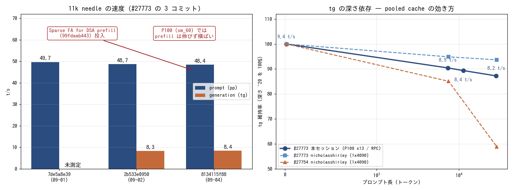

# GLM-5.3-Flash の PR に並列と画像対応が入ったので実機で確かめた

- **実施日時**: 2026年9月5日 18:00 〜 22:05 JST (上流調査・プラン策定・両機の電源投入・PR ブランチのビルド・mmproj 取得・3 構成での起動と測定・aws-gpu02 の 3 回のハングと復旧不能・master 復帰・電源断)
- **報告日時**: 2026年9月5日 22:05 JST
- **作成者**: Claude Opus 5 (1M context)

## 概要

前回の作業では、GLM-5.3-Flash に対応する PR について、配布元のモデルファイルをそのまま読み込めるかどうかという一点に決着をつけた。それから二日のあいだに PR は四つ先へ進み、検証すべき中身が入れ替わっている。今回はその最新版を実機に載せ直した。

新しく入った変更は三つある。ひとつは複数の会話を同時に走らせる方式の刷新で、これまで一種類しか選べなかった内部の持ち方が二通りとも使えるようになった。もうひとつは長い入力を読み込む段階の計算を絞り込む最適化である。三つめは本家の最新版を取り込んだことによる周辺の追随で、この過程で画像認識まわりも整った。

結果は三点に要約できる。第一に、モデルファイルの受理条件は変わっておらず、前回そのまま置いた配布元のファイルで問題なく読み込めた。第二に、新しい会話の持ち方はこちらの十三枚構成でも正しく動き、二つの依頼を同時に処理して四か所の合言葉をすべて言い当てた。第三に、計算を絞り込む最適化は、こちらの古い世代のカードでは読み込み速度をまったく変えなかった。速くなることを期待していたので、これは空振りである。ただし遅くもなっていないので、実害はない。

画像認識も初めて試した。配布元が用意した画像用のファイルは古い名前のままで使えないと上流の掲示板に報告があったため、別の配布者のものを取り寄せて使った。小さなロゴと大きな構成図の二枚を読ませたところ、英数字の型番も日本語の合言葉も、細部まで正確に読み取った。

生成の速さが文脈の長さでどう変わるかも測った。この PR は長い文脈でも生成が遅くならないという特徴が掲示板で報告されており、こちらでも同じ傾向を確認できた。二万八千語まで伸ばしても生成速度は一割強しか落ちない。十一万語規模の長文でも出力が壊れることはなく、深い位置に埋めた合言葉を正しく答えている。

検証そのものは滞りなく終わったが、後片付けの段階で補助側のサーバが三度続けて固まった。一度目は何も動いていない待機中、二度目は再ビルドの重い処理の最中で、いずれも手がかりを何も残さない止まり方である。三度目は電源を入れ直したあとの起動処理そのもので止まり、さらにもう一度入れ直すと今度は起動の最初の画面から先へ進まなくなった。段階的に悪くなっており、機器そのものの故障を疑う状況である。

主機は本家の本流に戻して再ビルドし、退避していた別件の修正も復元できた。補助側は再ビルドが終わっていない。ユーザの判断により、両機とも電源を落としてこの作業は打ち切った。

## 添付ファイル

- [実装プラン](attachment/2026-09-05_204557_glm53flash_pr27773_sparse_fa_multistream/plan.md)
- スクリプト: [図の生成](attachment/2026-09-05_204557_glm53flash_pr27773_sparse_fa_multistream/mkfig3.py) ／ [needle 生成](attachment/2026-09-05_204557_glm53flash_pr27773_sparse_fa_multistream/mkneedle2.py) ／ [vision 画像とペイロード生成](attachment/2026-09-05_204557_glm53flash_pr27773_sparse_fa_multistream/mkvision.py) ／ [応答判定](attachment/2026-09-05_204557_glm53flash_pr27773_sparse_fa_multistream/check.py) ／ [リクエスト投入](attachment/2026-09-05_204557_glm53flash_pr27773_sparse_fa_multistream/ask.sh) ／ [投入と判定の一括](attachment/2026-09-05_204557_glm53flash_pr27773_sparse_fa_multistream/measure.sh) ／ [構成切替](attachment/2026-09-05_204557_glm53flash_pr27773_sparse_fa_multistream/run_cfg.sh) ／ [VRAM 集計](attachment/2026-09-05_204557_glm53flash_pr27773_sparse_fa_multistream/vram.sh)
- vision 入力画像: [ロゴ相当 1500x500](attachment/2026-09-05_204557_glm53flash_pr27773_sparse_fa_multistream/vis_logo.png) ／ [図表相当 2875x1500](attachment/2026-09-05_204557_glm53flash_pr27773_sparse_fa_multistream/vis_diagram.png)
- aws-gpu02 の KVM スクショ: [1 回目のハング](attachment/2026-09-05_204557_glm53flash_pr27773_sparse_fa_multistream/aws-gpu02_hang_console.png) ／ [2 回目のハング](attachment/2026-09-05_204557_glm53flash_pr27773_sparse_fa_multistream/aws-gpu02_hang2_console.png) ／ [3 回目（ブート途中で停止）](attachment/2026-09-05_204557_glm53flash_pr27773_sparse_fa_multistream/aws-gpu02_hang3_boot_stuck.png)
- llama-server ログ: [D1 kv-unified](attachment/2026-09-05_204557_glm53flash_pr27773_sparse_fa_multistream/log_D1.log) ／ [D2 no-kv-unified + mmproj](attachment/2026-09-05_204557_glm53flash_pr27773_sparse_fa_multistream/log_D2.log) ／ [D3 ctx 131072](attachment/2026-09-05_204557_glm53flash_pr27773_sparse_fa_multistream/log_D3.log)
- 応答 JSON 一式（`r_D1_*.json` / `r_D2_*.json` / `r_D3_n108k.json`）とプロンプト JSON（`short.json` / `needle_7k.json` / `needle_11k.json` / `needle_29k.json` / `needle_108k.json` / `needle_2slot_a.json` / `needle_2slot_b.json`）を同ディレクトリに格納

## 核心発見サマリ



**結論**: #27773 の現 HEAD **`8134115f88ed8018474e7db69afcfe97fb097fc4`**（2026-09-04 21:25 UTC「Update llama-model.cpp to fix rebase error」）を 13x Tesla P100 の RPC 分散で検証した。**GGUF の受理条件は前回から変わらず**、未パッチの `Shard_Rewrite/` shard 1 がそのまま読める（cold ロード 11 分 04 秒、`unused tensor` 29 件、`graph_reserve` 警告なし）。**`ff6be954ff`「Add multi stream support」で `--no-kv-unified` が初めて起動できた** — `kv_unified = 'false'` / `n_slots = 2` / `n_ctx_slot = 16384` で立ち上がり、**2 slot 同時の合言葉 4 つをすべて正答**、11k needle の速度も unified と同等（pp 48.8 対 48.4、出力は thinking 195 字まで完全一致）。一方 **`99fdaab443`「Sparse FA for DSA prefill」は sm_60 では prefill を速くしなかった** — 11k の pp は `7de5a8e39` 49.7 → `2b533e0950` 48.7 → 今回 48.4 t/s で**横ばい**（`ggml_flash_attn_ext_set_n_kv_max` は FA パス限定なので `-fa on` では有効なはずだが効果が見えない）。**vision が動いた** — unsloth の mmproj は使えないので `avar6/GLM-5.3-Flash-BF16-gguf` の mmproj（1,164,010,144 B）を使い、**1500x500 のロゴ（994 tok）と 2875x1500 の構成図（5,611 tok）で英数字コードも日本語の合言葉もすべて正答**。**tg の深さ依存は極めて平坦**で、深さ 16 / 7,349 / 11,338 / 28,390 トークンに対し tg 9.4 / 8.5 / 8.4 / 8.2 t/s（**28.4k でも 87% を維持**）。nicholasshirley が 1x4090 で報告した #27773 の平坦さ（94%）と #27754 の落ち込み（59%）のうち、**#27773 側を別環境で追認**した形になる。**109,917 トークンの深文脈でも崩壊せず**合言葉 2 か所を正答（pp 28.3 / tg 7.8 t/s）。副次的に **前回の短答が今回とバイト単位で完全一致**し（content 77 字 / thinking 449 字）、前回レポートの残課題「ペイロードが残っておらず出力差を判定できない」に決着がついた。**aws-gpu02 が本日 3 回ハングし、最後は復旧できなかった**（通算 5 回）。1 回目はアイドル中、2 回目は `-j40` ビルドの 50 秒後、3 回目は**ブート途中（カーネル 8.1 秒）**で、その後のリセットでは**POST から先へ進まなくなった**。MCE / Hardware Error / Xid / panic の記録は一切ない。**症状が段階的に悪化しており、ハードウェア障害を強く疑う**。ユーザ判断で両機の電源を落として終了した。

## 前提・目的

前回レポート [#27773 の GGUF 受理条件が反転したことを実機で確認](./2026-09-03_035920_glm53flash_pr27773_head_recheck.md) は `2b533e0950` を対象にしていた。その後 2 日で PR は **`8134115f88`** まで進み、**検証すべき中身が入れ替わった**。ユーザ依頼は「その続きで最新版を実機検証する」ことである。

### 前回以降に入った PR 固有の変更（本家 master マージ 2 回を除く）

| コミット | 内容 | 検証上の意味 |
|---|---|---|
| `ff6be954ff` | **Add multi stream support** — `llama-model.cpp` から `"GLM5-Next requires a unified KV cache for multiple sequences"` の例外を削除。`llama_kv_cache_context::get_k_storage()` を新設し、kpool select と DSA gather を全ストリーム対応に書き換え | **`--no-kv-unified` が初めて使える** |
| `1b564d2dd8` | Finish Rebase（本家の `n_ff_exp` 変更への追随） | ビルド可否のみ |
| `99fdaab443` | **Sparse FA for DSA prefill** — `build_attn_mha(..., v_mla, 0, ...)` → `..., inp_kpool->n_sel, ...`。`ggml_flash_attn_ext_set_n_kv_max()` に渡る**FA パス限定**の最適化 | **prefill (pp) 速度が変わる可能性** |
| `8134115f88` | rebase エラー修正（`llama-model.cpp` +1/-0） | ビルド可否のみ |

加えて master マージ 2 回で CUDA FA 側が大きく動いている（`fattn-mma-f16.cuh` +149/-74、`fattn.cu` +133/-0、`ggml-cuda.cu` +182/-3）。

### 上流の状況（2026-09-05 時点）

- 本家 master は作業開始時 `4d9176092d` / 終了時 `6a1a922d2`。**`glm5` 系 arch は依然として未マージ**
- #27773 は OPEN。ggerganov が kpool のキャッシュ機構をレビューし「コード解析だけでは正しさを検証しづらい。今は動くことを祈る」と述べている。**実機での深文脈確認に意味がある**状況
- timkhronos の自己計測: pool caching 無効 vs 有効で TG が 32k で 15%、64k で 24%、128k で 38% 変わる（CPU オフロード環境）
- nicholasshirley (1x4090 + CPU offload): **#27773 は深さが増えても tg が落ちない**（~20 で 25.3 / 7.5k で 24.0 / 28.8k で 23.7 t/s。#27754 は 24.8 → 21.1 → 14.6）
- nicholasshirley: **vision は動くが unsloth の mmproj は `swiglu_clamp` リネーム前で "Failed to load CLIP model" になる**。`avar6` の mmproj を使う必要がある

ユーザ選択により、コア（ロード回帰・速度・品質）に加えて **`--no-kv-unified` / tg vs 深さ / 108k depth collapse / vision の 4 項目すべて**を実施した。

## 環境情報

| 項目 | 値 |
|---|---|
| メインホスト | aws-gpu01 (10.8.2.1)、Tesla P100 16GB × 7 |
| RPC ワーカー | aws-gpu02 (10.8.2.2)、Tesla P100 16GB × 4 + 12GB × 2 |
| RPC 経路 | 100GbE 直結 `192.168.100.2:50052`（MTU 9000） |
| **検証 PR** | **#27773 `timkhronos:GLM5.3-Flash` `8134115f88ed8018474e7db69afcfe97fb097fc4`** |
| ビルド識別子 | `build 10855, commit 8134115f8`（両機一致） |
| ビルドフラグ | `-DGGML_CUDA=ON -DGGML_RPC=ON -DGGML_CUDA_FA_ALL_QUANTS=ON -DCMAKE_CUDA_ARCHITECTURES=60`（`update_and_build-aws-gpu0N.sh` 既定） |
| モデル | `unsloth/GLM-5.3-Flash-GGUF:UD-IQ4_XS`（5 shard、HF 側 `lastModified 2026-08-29` で前回から未更新） |
| shard 1 | `UD-IQ4_XS-nopatch/`（**9,429,984 B、未パッチ**、前回作成分をそのまま流用）、shard 2〜5 はシンボリックリンク |
| mmproj | `avar6/GLM-5.3-Flash-BF16-gguf` の `GLM-5.3-Flash-mmproj-bf16.gguf`（**1,164,010,144 B**） |
| 本家 master（作業前 / 作業後） | `4d9176092d` → **`6a1a922d2`** |

### 起動構成 3 種

| # | ctx | -ub | 追加オプション | ロード所要 | `n_slots` / `n_ctx_slot` / `kv_unified` |
|---|---|---|---|---|---|
| **D1** | 32768 | 4096 | なし（既定） | **11 分 04 秒**（cold） | 4 / 32768 / `true` |
| **D2** | 32768 | 4096 | `--no-kv-unified --parallel 2 --mmproj <avar6> --no-mmproj-offload` | **3 分 49 秒**（page cache) | 2 / 16384 / **`false`** |
| **D3** | 131072 | 4096 | なし | **4 分 07 秒** | 4 / 131072 / `true` |

いずれも `-fa on --poll 0 -b 512 --jinja --temp 1.0 --top-p 0.95`、測定は `temperature 0`。

## 検証結果

### 前提の数値確定 — GGUF メタデータの直読み

起動前に `gguf-py` でメタデータを読み出し、**受理条件が前回から動いていないこと**を確認した。

| 対象 | 値 |
|---|---|
| `UD-IQ4_XS-nopatch/` shard 1 の `general.architecture` | `glm5-next` |
| 同 `glm5-next.attention.head_count_kv` | **46 要素** |
| 同 `swiglu_clamp_exp` / `_shexp` | 46 / 46 |
| avar6 mmproj のキー | **`clip.vision.swiglu_clamp` が存在**（`clip-impl.h:66` の `KEY_SWIGLU_CLAMP` と一致） |

`conversion/glm.py:464-465` の `# Pad to block_count` と `llama-model.cpp:1298-1307` の `n_layer_all` はいずれも現 HEAD に存置されている。

### D1: ロード回帰と基本性能 — **すべて前回と同等**

```
0.04.284.909 W model has unused tensor blk.45.ffn_up_shexp.weight -- ignoring
    ...（NextN ブロックのテンソル計 29 個）...
11.04.259.025 I srv    load_model: initializing, n_slots = 4, n_ctx_slot = 32768, kv_unified = 'true'
11.04.295.481 I srv  llama_server: listening on http://0.0.0.0:8000
```

- **`head_count_kv` のエラーは出ない**。未パッチ shard 1 がそのまま通る（受理条件の回帰なし）
- `unused tensor ... -- ignoring` が **29 個**で前回と一致。MTP を #27917 に分離した設計と整合
- **`graph_reserve` / `failed to allocate` の警告は 0 件**

| 試験 | 結果 | pp (t/s) | tg (t/s) | 判定 |
|---|---|---|---|---|
| 短答「日本の首都は」 | content 77 字 / thinking 449 字 | 7.0 | 9.4 | **前回と完全一致** |
| 11k needle（11,338 tok） | `山茶花6104` `木蓮3357` / thinking 195 字 | **48.4** | 8.4 | 両方正答 |
| 2 slot 同時 A（11,052 tok） | `紫陽花7823` `金木犀2290` | 21.8 | 6.4 | 両方正答 |
| 2 slot 同時 B（11,376 tok） | `向日葵4519` `石楠花8846` | 44.1 | 0.3 | 両方正答 |

**短答は前回 `2b533e0950` の応答とバイト単位で一致した**（content 77 字、thinking 449 字、冒頭 `The user is asking in Japanese: "日本の首都は"...` まで同一）。前回レポートが「前回のペイロードが残っていないため判定できない」と留保した出力差の問題は、**同一ペイロードを保存しておいたことで決着した**。

### D1: Sparse FA — **sm_60 では prefill が速くならない**

`99fdaab443` は DSA prefill の `build_attn_mha` に `inp_kpool->n_sel` を渡し、FA カーネルの `n_kv_max` を絞る最適化である。**`-fa on` で走らせているので効くはずだが、実測は横ばいだった。**

| コミット | 日付 | 11k needle の pp | tg |
|---|---|---|---|
| `7de5a8e39` | 09-01 | 49.7 | 未測定 |
| `2b533e0950` | 09-02 | 48.7 | 8.3 |
| **`8134115f88`**（Sparse FA 込み） | **09-04** | **48.4** | **8.4** |

3 点とも誤差の範囲で、**Sparse FA の効果は P100 (sm_60) では観測できない**。CUDA の FA カーネルが `n_kv_max` を活かすのは新しい世代のパスだけである可能性が高いが、本セッションでは切り分けていない。**遅くもなっていない**ので実害はない。

### D1: tg の深さ依存 — **28.4k でも 87% を維持**

同一プロセス内で深さを変えて tg を測った。合言葉は毎回変えている。

| プロンプト長 | pp (t/s) | tg (t/s) | 深さ 16 比 | 合言葉 |
|---|---|---|---|---|
| 16 tok（短答） | 7.0 | **9.4** | 100% | — |
| 7,349 tok | 49.5 | **8.5** | 90.4% | `撫子2841` `竜胆6795` 正答 |
| 11,338 tok | 48.4 | **8.4** | 89.4% | `山茶花6104` `木蓮3357` 正答 |
| 28,390 tok | 44.2 | **8.2** | **87.2%** | `桔梗5063` `椿9174` 正答 |

**pooled cache が深さに強いという PR スレッドの主張を、GPU only の別環境で追認した**ことになる。参考までに nicholasshirley の 1x4090 + CPU offload では #27773 が 28.8k で 93.7%、#27754 が 58.9% だった。**#27754 側は本セッションでは測っていない**ので、両者の差を本環境で直接比較したわけではない。

### D2: `--no-kv-unified` — **旧 HEAD なら例外で落ちた条件で起動した**

`ff6be954ff` 以前は `!cparams.kv_unified && cparams.n_seq_max > 1` で `std::runtime_error` を投げていた。**`--no-kv-unified --parallel 2` はまさにその条件**である。

```
3.48.902.626 I srv    load_model: loaded multimodal model, '.../mmproj-avar6-bf16.gguf'
3.49.012.472 I srv    load_model: initializing, n_slots = 2, n_ctx_slot = 16384, kv_unified = 'false'
3.49.048.655 I srv  llama_server: listening on http://0.0.0.0:8000
```

| 試験 | 結果 | pp (t/s) | tg (t/s) | D1（unified）との比較 |
|---|---|---|---|---|
| 11k needle | `山茶花6104` `木蓮3357` / thinking **195 字** | **48.8** | 8.3 | **出力が完全一致**、速度も同等（48.4 / 8.4） |
| 2 slot 同時 A | `紫陽花7823` `金木犀2290` / thinking 197 字 | 43.9 | 0.3 | 4 つとも正答 |
| 2 slot 同時 B | `向日葵4519` `石楠花8846` / thinking 194 字 | 24.5 | 6.6 | 同上 |

**2 つのストリームを別々に持たせても混線せず、合言葉 4 つをすべて正答した。** 11k needle の thinking 長が unified と 1 字も違わないことから、**ストリーム分割は数値的にも同一の結果を出している**と言える。

**VRAM は増えなかった**。non-unified の KV は `ctx / n_parallel` を stream 数ぶん確保するので総セル数は unified と同じであり、実測でも最小空きは gpu01 が 1,702 MiB（D1 は 1,600 MiB）、gpu02 が 587 MiB（同 466 MiB）と、むしろわずかに余裕がある。

### D2: vision — **英数字も日本語も細部まで正答**

unsloth の mmproj は使えないため、`avar6` の mmproj を aws-gpu01 へ直接ダウンロードして `--mmproj ... --no-mmproj-offload` で読み込ませた。画像は本セッションで生成した 2 枚（[mkvision.py](attachment/2026-09-05_204557_glm53flash_pr27773_sparse_fa_multistream/mkvision.py)）。

| 画像 | 寸法 | prompt tok | pp / tg | 読み取り結果 |
|---|---|---|---|---|
| ロゴ相当 | 1500x500 | 994 | 30.5 / 9.5 | `GLM-5.3-Flash` と `SERIAL P100-RPC-7429 / 13 GPU` を**そのまま書き出した** |
| 図表相当 | 2875x1500 | 5,611 | 25.2 / 8.4 | ホスト名 2 つ、`CODE ALPHA-4821` / `CODE BRAVO-1935`、`port 50052`、`MODEL SIZE 153.3 GiB`、**日本語の合言葉「南天5518」まで全問正答** |

図表側は回答を表組みに整形して返しており、単なる OCR ではなく**図の構造も理解している**。nicholasshirley が 1x4090 で報告した内容を、**13x P100 の RPC 分散でも再現**したことになる。

### D3: 深文脈 — **109,917 トークンでも崩壊しない**

ctx 131072 で起動し、109,917 トークンのプロンプト（12% 地点と 88% 地点に合言葉）を投げた。

```
4.06.642.223 E ggml_gallocr_reserve_n_impl: failed to allocate RPC2[192.168.100.2:50052] buffer of size 1233754624
4.06.642.226 E graph_reserve: failed to allocate compute buffers
4.07.204.891 I srv    load_model: initializing, n_slots = 4, n_ctx_slot = 131072, kv_unified = 'true'
4.07.244.675 I srv  llama_server: listening on http://0.0.0.0:8000
```

`graph_reserve` の失敗は前回・前々回と同様に**致命ではなく**、そのまま起動して 109,917 トークンを処理しきった。

| 項目 | 値 |
|---|---|
| 応答 | `蒲公英3612` `山吹7429` / thinking 214 字 |
| 判定 | **合言葉 2 か所とも正答・崩壊なし**（同一文字の連続 0、最頻 4-gram は 3 回） |
| pp / tg | **28.3 / 7.8 t/s**（前回 `7de5a8e39` の 28.7 t/s とほぼ同じ） |
| 所要 | 約 65 分 |

**kpool は `2b533e0950` までに 2 度書き直され、さらに `ff6be954ff` で multi stream 化された**が、深文脈の品質は保たれている。ggerganov が「コード解析では検証しづらい」と述べた箇所について、**陽性の実機データ点**が得られた。

なお **前回 09-02 の 108k プロンプトは添付に残っていない**ため、今回は `mkneedle2.py` の `n_para=386` で**生成し直した**。トークン数も 107,942 → 109,917 と異なる。**バイト同一の比較ではない**点に注意。

### VRAM

| 構成 | aws-gpu01 (7 GPU) | aws-gpu02 (6 GPU) |
|---|---|---|
| D1 / ctx 32768 / unified | 90,034 MiB 使用、最小空き **1,600 MiB** | 69,860 MiB 使用、最小空き **466 MiB** |
| D2 / ctx 32768 / **non-unified** + mmproj | 89,326 MiB 使用、最小空き **1,702 MiB** | 69,222 MiB 使用、最小空き **587 MiB** |
| D3 / ctx 131072 / unified | 90,214 MiB 使用、最小空き **1,534 MiB** | 70,256 MiB 使用、最小空き **398 MiB** |

**ctx 131072 でも aws-gpu02 の最小空きは 398 MiB あり**、前回の 178 MiB（#27754 / ctx 131072）よりは余裕がある。

## 実測値まとめ（全 11 試行）

| # | 構成 | プロンプト | 結果 | pp (t/s) | tg (t/s) |
|---|---|---|---|---|---|
| D1-1 | unified / ctx 32768 | 短答 16 tok | **前回とバイト同一** | 7.0 | 9.4 |
| D1-2 | 同上 | 11k needle | 両方正答 | **48.4** | 8.4 |
| D1-3 | 同上 | 2 slot A | 両方正答 | 21.8 | 6.4 |
| D1-4 | 同上 | 2 slot B | 両方正答 | 44.1 | 0.3 |
| D1-5 | 同上 | 7,349 tok | 両方正答 | 49.5 | 8.5 |
| D1-6 | 同上 | 28,390 tok | 両方正答 | 44.2 | **8.2** |
| D2-1 | **non-unified** / parallel 2 | 11k needle | 両方正答・**D1 と出力一致** | 48.8 | 8.3 |
| D2-2 | 同上 | 2 slot A | 両方正答 | 43.9 | 0.3 |
| D2-3 | 同上 | 2 slot B | 両方正答 | 24.5 | 6.6 |
| D2-4 | 同上 + mmproj | vision ロゴ 994 tok | **全文字正答** | 30.5 | 9.5 |
| D2-5 | 同上 | vision 図表 5,611 tok | **5 項目すべて正答** | 25.2 | 8.4 |
| D3-1 | unified / ctx 131072 | 109,917 tok | **崩壊なし・両方正答** | 28.3 | 7.8 |

## aws-gpu02 のハング — 本日 3 回、最後は復旧不能

> **【2026-09-05 22:05〜23:00 に追記・訂正】原因は特定され、機体は復旧した。**
> 本節の「MCE / Hardware Error / Xid / panic の記録は一切ない」は **`journalctl` しか見て
> いなかったための誤り**である。**BMC の SEL には `Memory | Uncorrectable ECC` が 11 件**
> 残っており、**ハング時刻と秒単位で一致していた**（例: SEL `82` = 20:29:04 は 3-1 の
> 20:28:42 の 22 秒後、SEL `85`/`86` = 21:00:17 は 3-3 と同時刻）。故障個所は **`P2_DIMME1`**。
> この DIMM は BIOS がアドレスマップから外しているため OS は触らないが、**iMC の
> `Patrol Scrub`（既定 Enable / 24 時間周期）だけが読みに行って fatal MCE を起こしていた** —
> 本節が「負荷では説明できない」とした挙動はこれで一貫して説明できる。
> また **「ビルドは PR (`build 10855`) のまま」も誤り**で、`--force` がビルドディレクトリを
> 消した直後にハングしたため**ビルドツリーごと消えていた**（残骸 4.7 MB）。
> 詳細と対処は [aws-gpu02 の連続ハング — 原因はメモリの訂正不能エラー](./2026-09-05_221831_aws_gpu02_uncorrectable_ecc.md) を参照。


後始末の段階で aws-gpu02 が**3 回**ハングした。いずれも CLAUDE.md の手順どおり、**電源操作の前に KVM スクショで証跡を保全**している。**3 回目は復旧できず、電源を落として終了した。**

| # | 発生時刻 | 直前の操作 | 負荷状態 | 止まった場所 |
|---|---|---|---|---|
| 3-1 | 20:28:42 | `git checkout master && git pull --ff-only`（成功）→ `update_and_build.sh` の起動コマンド | **アイドル** | OS 稼働中（ジャーナル最終行 `Started session-60.scope`） |
| 3-2 | 20:46 頃 | master の再ビルドを **20:45:44 に開始** | **高負荷**（`-j40` の nvcc） | OS 稼働中 |
| 3-3 | 21:00 頃 | 3-2 のリセット後の**起動処理そのもの** | — | **ブート中**（カーネル 8.125 秒、`systemd[1]: Hostname set to <gpu02>` の直後） |
| — | 21:53〜 | 3-3 のリセット後 | — | **POST 中**（`System Initializing...` から 7.5 分進まず。通常の POST は 146 秒） |

**症状は段階的に悪化した。** 1 回目・2 回目は OS 稼働中のハングで、電源リセットで正常に復旧している（fsck 停止もなし）。3 回目は**ブート途中**で止まり、その次のリセットでは**POST すら抜けられなくなった**。

観測できた事実:

- コンソールは 1 回目・2 回目とも `Ubuntu 24.04.3 LTS gpu02 tty1` / `gpu02 login:` のみで、**パニックのスタックトレースなし**（[1 回目](attachment/2026-09-05_204557_glm53flash_pr27773_sparse_fa_multistream/aws-gpu02_hang_console.png) / [2 回目](attachment/2026-09-05_204557_glm53flash_pr27773_sparse_fa_multistream/aws-gpu02_hang2_console.png)は画素単位でほぼ同一）
- 3 回目は[ブート途中で停止した画面](attachment/2026-09-05_204557_glm53flash_pr27773_sparse_fa_multistream/aws-gpu02_hang3_boot_stuck.png)。2 分半あけた 2 枚のスクショが**バイト単位で一致**しており、確実に停止している
- ジャーナルは 1 回目・2 回目とも何の前触れもなく途切れ、**MCE / Hardware Error / Xid / panic の記録は 0 件**（EDAC の出力は起動時のモジュール初期化のみ）
- BMC 上の電源はいずれも `System Power: on` のまま

**前々回（2026-09-02）の 2 回と合わせて通算 5 回**になった。**負荷では説明できない** — 5 回のうち 4 回はアイドルまたはブート/POST 中で、高負荷中に落ちたのは本日 2 回目だけである。さらに**ブートや POST でも止まる**ようになった以上、llama.cpp やドライバといったソフトウェア要因では説明がつかない。**電源・メモリ・マザーボードのいずれかのハードウェア障害を強く疑う段階**である。

ユーザ判断により、**両機の電源を落としてセッションを終了した**。aws-gpu02 の master 再ビルドは**未完のまま**である。

## 再現方法

```bash
# 1) 電源投入（ユーザの明示的指示がある場合のみ）
ALLOW_FAN_NOISE=1 .claude/skills/gpu-server/scripts/bmc-power.sh aws-gpu01 on
ALLOW_FAN_NOISE=1 .claude/skills/gpu-server/scripts/bmc-power.sh aws-gpu02 on
until timeout 8 ssh -o ConnectTimeout=5 -o BatchMode=yes -n aws-gpu01 true 2>/dev/null; do sleep 15; done
until timeout 8 ssh -o ConnectTimeout=5 -o BatchMode=yes -n aws-gpu02 true 2>/dev/null; do sleep 15; done

# 2) ロック（両機。再起動で /tmp が飛ぶので必ず電源投入の後に取る）
.claude/skills/gpu-server/scripts/lock.sh aws-gpu01
.claude/skills/gpu-server/scripts/lock.sh aws-gpu02

# 3) aws-gpu01 のローカル修正を退避
ssh -n aws-gpu01 "cd ~/llama.cpp && mkdir -p ~/patches && git diff > ~/patches/\$(date +%F)-local.patch \
  && git stash push -m pre-glm5next-3 -- tools/server/server-http.cpp"

# 4) 両機を PR でビルド（コミット一致が必須。フルビルドで 4〜6 分）
ssh -n aws-gpu01 "cd ~/llama.cpp && git fetch origin pull/27773/head:pr27773 -f && git checkout pr27773 && git rev-parse HEAD"
ssh -n aws-gpu02 "cd ~/llama.cpp && git fetch origin pull/27773/head:pr27773 -f && git checkout pr27773 && git rev-parse HEAD"
scp .claude/skills/llama-server/server-scripts/update_and_build-aws-gpu01.sh aws-gpu01:~/llama.cpp/update_and_build.sh
scp .claude/skills/llama-server/server-scripts/update_and_build-aws-gpu02.sh aws-gpu02:~/llama.cpp/update_and_build.sh
timeout 40 ssh -n aws-gpu01 "cd ~/llama.cpp && setsid nohup ./update_and_build.sh --no-pull --force > /tmp/build.log 2>&1 < /dev/null &" || true
timeout 40 ssh -n aws-gpu02 "cd ~/llama.cpp && setsid nohup ./update_and_build.sh --no-pull --force > /tmp/build.log 2>&1 < /dev/null &" || true
while ssh -n aws-gpu01 "pgrep -f '[u]pdate_and_build' >/dev/null"; do sleep 30; done
while ssh -n aws-gpu02 "pgrep -f '[u]pdate_and_build' >/dev/null"; do sleep 30; done

# 5) mmproj を取得（vision を試す場合。unsloth のものは使えない）
#    aws-gpu01 は同一拠点なので HF から直接落とす
source ~/.config/gpu-server/.env
ssh -n aws-gpu01 "curl -sL -H 'Authorization: Bearer $HF_TOKEN' \
  -o ~/models/GLM-5.3-Flash-GGUF/mmproj-avar6-bf16.gguf \
  'https://huggingface.co/avar6/GLM-5.3-Flash-BF16-gguf/resolve/main/GLM-5.3-Flash-mmproj-bf16.gguf' \
  && stat -c %s ~/models/GLM-5.3-Flash-GGUF/mmproj-avar6-bf16.gguf"   # → 1164010144

# 6) GGUF / mmproj のメタデータを起動前に検査する
ssh -n aws-gpu01 'cd ~/llama.cpp && PYTHONPATH=gguf-py python3 -c "
from gguf import GGUFReader
r = GGUFReader(\"/home/ubuntu/models/GLM-5.3-Flash-GGUF/UD-IQ4_XS-nopatch/GLM-5.3-Flash-UD-IQ4_XS-00001-of-00005.gguf\")
for k, v in r.fields.items():
    if k.endswith(\"head_count_kv\") or k.endswith(\"block_count\"):
        print(k, len(v.data))
m = GGUFReader(\"/home/ubuntu/models/GLM-5.3-Flash-GGUF/mmproj-avar6-bf16.gguf\")
print([k for k in m.fields if \"swiglu\" in k])
"'

# 7) RPC ワーカー → llama-server（3 構成）
.claude/skills/llama-server/scripts/rpc-up.sh aws-gpu02
scp report/attachment/2026-09-05_204557_glm53flash_pr27773_sparse_fa_multistream/{run_cfg.sh,ask.sh,check.py,measure.sh,vram.sh} aws-gpu01:/tmp/
scp report/attachment/2026-09-05_204557_glm53flash_pr27773_sparse_fa_multistream/*.json aws-gpu01:/tmp/
M=/home/ubuntu/models/GLM-5.3-Flash-GGUF/UD-IQ4_XS-nopatch/GLM-5.3-Flash-UD-IQ4_XS-00001-of-00005.gguf
ssh -n aws-gpu01 "bash /tmp/run_cfg.sh D1 $M 32768 4096"                       # kv-unified
ssh -n aws-gpu01 "bash /tmp/run_cfg.sh D2 $M 32768 4096 --no-kv-unified --parallel 2 \
  --mmproj /home/ubuntu/models/GLM-5.3-Flash-GGUF/mmproj-avar6-bf16.gguf --no-mmproj-offload"
ssh -n aws-gpu01 "bash /tmp/run_cfg.sh D3 $M 131072 4096"                      # 108k 用

# 8) 測定（長い prompt は前景の curl が切れるのでサーバ側で setsid する）
ssh -n aws-gpu01 "bash /tmp/measure.sh /tmp/needle_11k.json /tmp/r.json 560 山茶花6104 木蓮3357"
```

### 停止と既定構成への復帰

```bash
.claude/skills/llama-server/scripts/stop.sh aws-gpu01     # llama-server → RPC の順。逆は不可
.claude/skills/llama-server/scripts/rpc-down.sh aws-gpu02
ssh -n aws-gpu01 "cd ~/llama.cpp && git checkout master && git pull --ff-only"
ssh -n aws-gpu02 "cd ~/llama.cpp && git checkout master && git pull --ff-only"
# 両機で update_and_build.sh --no-pull --force を流し直す
ssh -n aws-gpu01 "cd ~/llama.cpp && git stash pop"        # 404 修正パッチを復元
.claude/skills/gpu-server/scripts/unlock.sh aws-gpu01
.claude/skills/gpu-server/scripts/unlock.sh aws-gpu02
```

## 推奨構成（現時点）

**#27773 を使う場合、GGUF のパッチは引き続き不要**である。前回からの変化は「`--no-kv-unified` が選べるようになった」「vision が使える」の 2 点。

```bash
# 既定（kv-unified）。11k で pp 48.4 / tg 8.4 t/s
ssh aws-gpu01 "cd ~/llama.cpp && setsid nohup env NVIDIA_TF32_OVERRIDE=0 ./build/bin/llama-server \
  --model ~/models/GLM-5.3-Flash-GGUF/UD-IQ4_XS-nopatch/GLM-5.3-Flash-UD-IQ4_XS-00001-of-00005.gguf \
  --alias 'GLM-5.3-Flash-UD-IQ4_XS' --rpc 192.168.100.2:50052 \
  --n-gpu-layers 999 --ctx-size 32768 -fa on --poll 0 -b 512 -ub 4096 \
  --jinja --temp 1.0 --top-p 0.95 --host 0.0.0.0 --port 8000 \
  > /tmp/llama-server.log 2>&1 < /dev/null &"
```

- **`--no-kv-unified` を使う実利は現状ない**。速度も出力も unified と同じで、VRAM も変わらない。**動くことが確認できたという意味**にとどまる
- **vision を使うなら `--mmproj <avar6 の mmproj> --no-mmproj-offload` を足す**。unsloth の mmproj は `swiglu_clamp` のキー名が古く読めない
- **速度を採るなら #27754 が依然 18% 速い**（58.8 対 48.4 t/s）。ただし**深さが増えると逆転する可能性**がある（nicholasshirley の 4090 では 28.8k で #27773 が 1.6 倍速い）。本環境では #27754 側を測っていないので未確認
- `-ub` は速度に効かないので VRAM に余裕を持たせたいなら 512 でよい（前回結論から変更なし）

## 作業後の状態

| 項目 | 状態 |
|---|---|
| aws-gpu01 の llama.cpp | **master `6a1a922d2`** に復帰し再ビルド済み（`build 10819, commit 6a1a922d2`）。次回 `llama-up.sh aws-gpu01` で既定の DeepSeek-V4-Flash 構成をそのまま使える |
| **aws-gpu02 の llama.cpp** | ~~git は master `6a1a922d2` だがビルドは PR (`build 10855`) のまま~~ → **【訂正】ビルドツリーごと消えていた**。**2026-09-05 23:00 にフルビルドをやり直し `build 10819, commit 6a1a922d2` で解消済み** |
| 退避パッチ | aws-gpu01 の `--ui-mcp-proxy` 404 修正を `git stash pop` で**復元済み**（`M tools/server/server-http.cpp`）。`~/patches/2026-09-05-local.patch` も残置 |
| llama-server / RPC ワーカー | いずれも停止済み |
| モデル | `~/models/GLM-5.3-Flash-GGUF/UD-IQ4_XS/`（146 GiB）と `UD-IQ4_XS-nopatch/`（実体 9.4 MB）を残置。**`mmproj-avar6-bf16.gguf`（1.16 GB）を新規追加** |
| aws-gpu02 の状態 | ~~3 回ハングし、最後は POST から先へ進まない状態~~ → **【訂正】同日中に復旧済み**。原因は `P2_DIMME1` の uncorrectable ECC で、BIOS の `Patrol Scrub` を Disable にして回避した |
| 電源 | **ユーザ判断により両機とも OFF**（aws-gpu01 は ACPI グレースフル、aws-gpu02 はハード OFF）。当初は ON のまま引き渡す予定だったが、aws-gpu02 が POST で固まりファン制御が不定になるため変更した |
| ロック | aws-gpu01 は解放済み。**aws-gpu02 はリセットで `/tmp/gpu-server-locks/` ごと消えた**（`lock.md` の既知挙動） |

## 副次発見

- **Sparse FA の最適化が世代に依存する**。`ggml_flash_attn_ext_set_n_kv_max()` は FA パス限定なので `-fa on` なら効くはずだが、**sm_60 では pp が 1 t/s も動かなかった**。新しい世代のカードでは効いている可能性があり、**「上流の最適化コミットは自分のハードでも効くとは限らない」という当たり前の事実を数値で確認した**格好になる
- **page cache が効くとロードが 3 分の 1 になる**。同一モデルの 2 回目・3 回目の起動は **3 分 49 秒 / 4 分 07 秒**で、cold の 11 分 04 秒から大幅に短い。**1 セッション内で複数構成を試すなら、cold ロードのコストは最初の 1 回だけ**と見積もってよい
- **non-unified でも VRAM は増えない**。`ctx / n_parallel` × stream 数 = ctx なので総 KV セル数が変わらないため。実測でも最小空きはむしろ 100 MiB 前後増えた
- **vision の prompt トークンは画像サイズにほぼ比例する**。1500x500 が 994 tok、2875x1500 が 5,611 tok。**面積比 5.75 倍に対しトークン比 5.65 倍**とよく一致する
- **aws-gpu02 のハングは負荷の有無で説明できない**。通算 5 回のうち 4 回はアイドルまたは軽負荷（`git` 操作直後、起動 1 分後）で、高負荷中に落ちたのは本日 2 回目の `-j40` ビルドだけである。**「重い処理が原因」でも「アイドルだから安全」でもない**ので、ソフトウェア要因よりハードウェア要因（電源・メモリ・熱）を疑う段階に来ている
- **前回レポートの残課題「短答の出力差」は、ペイロードを添付しておいたことで即座に決着した**。実測値だけでなく**入力そのものを添付する**と次回の比較が確実になる

## 残課題

- **`-fa` と backend の交絡**: 前々回からの持ち越し。同じ 108k プロンプトを `-fa off` で流せば depth collapse が `-fa` 由来か backend 由来かを切り分けられるが、`-fa off` は attention の compute buffer が `n_ubatch × n_kv` で効くため **ctx 131072 で起動できない可能性が高い**
- **Sparse FA が効く条件**: sm_60 で効かなかった理由を切り分けていない。CUDA の FA カーネルのどのパスが `n_kv_max` を見るのか、`fattn-mma-f16.cuh` を読めば分かる見込み
- **#27754 との深さ比較**: 本環境では #27754 の tg vs 深さを測っていないため、「深いと #27773 が逆転する」は 4090 の報告に依存している。**同一環境で両者を測れば強いデータ点になる**
- **#27917 (MTP for #27773)**: 依然 draft。`5b8593b545` で CONFLICTING。未検証
- **vision の限界**: 2875x1500 までしか試していない。より大きな画像や複数枚の同時投入は未確認
- **aws-gpu02 のハード障害切り分け（最優先）**: 通算 5 回とも痕跡なしで、**最後は POST すら抜けられなくなった**。**次回はまず単体で電源投入して POST を通るか確認する**ところから始める必要がある。通らなければ GPU を抜いて最小構成で起動、メモリ 1 枚ずつの切り分け、電源ユニットの確認へ進む。通った場合も memtest86+ を回してからでないと RPC の相方として使えない
- **aws-gpu02 の master 再ビルド**: 未完のまま。**ビルドは PR (`build 10855`) のままなので、復旧後に必ず `update_and_build.sh --no-pull --force` を流す**こと。並列度は `-j40` から下げて試すのが無難
- **本家マージ待ち**: #27773 は依然 OPEN で `mergeable_state: blocked`。ggerganov のレビューは continuing

## 参照レポート

- [#27773 の GGUF 受理条件が反転したことを実機で確認](./2026-09-03_035920_glm53flash_pr27773_head_recheck.md)（本レポートの前提。**同レポートの残課題「短答の出力差は判定不能」に決着をつけた**）
- [GLM-5.3-Flash 対応 PR の本命交代を実機で確かめる](./2026-09-02_160322_glm53flash_pr27773_verification.md)（**aws-gpu02 のハング 2 回の記録**。今回が 3 回目）
- [GLM-5.3-Flash 対応 PR の最新版を実機検証する](./2026-08-29_220506_glm53flash_upstream_pr_verification.md)
- [GLM-5.3-Flash を aws-gpu01/02 の RPC 分散で起動する](./2026-08-27_235754_glm53flash_aws_gpu_rpc_startup.md)
