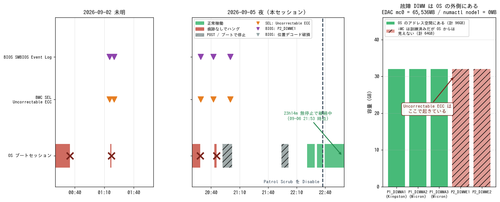

# aws-gpu02 の連続ハング — 原因はメモリの訂正不能エラー

- **実施日時**: 2026年9月5日 22:05 〜 9月6日 00:35 JST (BMC SEL の調査・電源投入と POST 観察・OS 側の証拠固め・BIOS の Patrol Scrub 無効化・llama.cpp の再ビルド・ドキュメント更新)。**2026年9月6日 21:53 JST に 23 時間経過後の追跡結果を追記**
- **報告日時**: 2026年9月6日 00:35 JST (初版) / 2026年9月6日 22:00 JST (23 時間経過の追跡を追記)
- **作成者**: Claude Opus 5 (1M context)

## 概要

補助側の GPU サーバが、この 1 週間で 5 回続けて何の痕跡も残さずに停止していた。前回のセッションでは最後に起動処理そのものを抜けられなくなり、機器の故障を疑いながらも原因を特定できないまま電源を落として終わっていた。今回はその原因究明と復旧を行った。

原因はすぐに分かった。前回まで「痕跡がない」と判断していたのは、OS 側の記録だけを見ていたからである。サーバの管理コントローラ側には別のイベントログがあり、そこにメモリの訂正不能エラーがはっきり残っていた。しかも発生時刻がハングの時刻と秒単位で一致しており、記録は 1 週間前から始まって、それ以前は 7 年ぶんさかのぼっても 1 件もない。もう 1 台の同型機には同じ記録が一切ないことも確認した。

もっと踏み込んだ事実が、機器を立ち上げてから分かった。この機体は片方の CPU 側にメモリが載っていないと記録していたが、実際には 2 枚が装着されていて、メモリコントローラはそれを認識・初期化までしている。ただし起動時の検査で不良と判定されたため、OS から見えるメモリの範囲からは丸ごと外されていた。つまり**壊れたメモリは、OS が一切触らない場所に置かれたまま通電し続けていた**。これが「何もしていないアイドル中でも、重い処理の最中でも、起動の途中でも同じように落ちる」という、負荷で説明できない挙動の正体である。

なぜ誰も触らないメモリでエラーが起きるのか。設定を調べたところ、ハードウェアが定期的にメモリ全体を読んで回る点検機能が有効になっていた。周期は 24 時間である。この点検はソフトウェアの都合とは無関係に動くので、OS の外に置かれた不良メモリも読みに行く。そこで訂正不能エラーを踏むと、システムは即座に停止し、OS には何も書き残せない。観測されたすべての症状がこれで一貫して説明できる。

復旧作業としては、まず電源を入れ直したところ、前回抜けられなかった起動処理を今回は問題なく通過して OS まで立ち上がった。その状態で装着メモリの詳細、エラーカウンタ、温度などを一通り記録し、続いて画面操作でファームウェアの設定画面に入って、先ほどの定期点検機能を無効にした。設定画面には過去のエラー履歴も残っており、そこでも同じ 1 枚のメモリが繰り返し名指しされていた。起動画面にも同じメモリの不良が表示され続けている。

あわせて、前回のセッションで途中のまま終わっていた推論エンジンの再構築を完了させた。前回のハングで作業ディレクトリが壊れていたため一から作り直しになったが、並列度を落として実行し、問題なく通った。もう 1 台と同じバージョンで揃ったので、次回はそのまま分散構成で使える。

なお、静音化のためにファンの回転数を落としたことが原因ではないかという疑いも持っていたが、これは否定された。負荷をかけた状態でもメモリの温度は 40 度に届かず、余裕は十分にある。

設定変更から丸一日が経ったので追跡した。**23 時間以上を一度も止まらずに走り続けており、新しいエラーも 1 件も出ていない。** 問題の点検機能は 24 時間で一巡する設定だったので、これは「一巡ぶんを無事に通過した」ことを意味する。対策前の最長稼働が 2 時間半だったことを思えば、対策が効いていると考えてよい状況である。

ただし今回の対策は「壊れたメモリを読みに行かせない」というものであって、壊れたメモリ自体はまだ機体の中にある。確実な解決は該当のメモリを物理的に抜くことで、しかもそのメモリは現在まったく使われていないので、抜いても失うものは何もない。次に現地で作業できる機会に対応することを勧める。

## 添付ファイル

- [実装プラン](attachment/2026-09-05_221831_aws_gpu02_uncorrectable_ecc/plan.md)
- BMC / BIOS のログ: [aws-gpu02 の SEL 全件](attachment/2026-09-05_221831_aws_gpu02_uncorrectable_ecc/sel_aws-gpu02.txt) ／ [memory イベントの raw](attachment/2026-09-05_221831_aws_gpu02_uncorrectable_ecc/sel_raw_memory.txt) ／ [aws-gpu01 の SEL 全件（対照）](attachment/2026-09-05_221831_aws_gpu02_uncorrectable_ecc/sel_aws-gpu01.txt)
- OS 側の状態: [dmidecode -t 17/16/0](attachment/2026-09-05_221831_aws_gpu02_uncorrectable_ecc/dmidecode_aws-gpu02.txt) ／ [EDAC・numactl・センサ](attachment/2026-09-05_221831_aws_gpu02_uncorrectable_ecc/os_state_after_recovery.txt) ／ [Redfish のメモリ一覧](attachment/2026-09-05_221831_aws_gpu02_uncorrectable_ecc/redfish_memory.json)
- KVM スクリーンショット: [POST の Failing DIMM 表示](attachment/2026-09-05_221831_aws_gpu02_uncorrectable_ecc/post_failing_dimm_p2_dimme1.png) ／ [BIOS Main（Total Memory）](attachment/2026-09-05_221831_aws_gpu02_uncorrectable_ecc/bios_main_total_memory.png) ／ [DIMM Information](attachment/2026-09-05_221831_aws_gpu02_uncorrectable_ecc/bios_dimm_information.png) ／ [SMBIOS Event Log](attachment/2026-09-05_221831_aws_gpu02_uncorrectable_ecc/bios_smbios_event_log_p2_dimme1.png) ／ [Memory RAS（変更前）](attachment/2026-09-05_221831_aws_gpu02_uncorrectable_ecc/bios_ras_before_patrol_scrub_enable.png) ／ [Memory RAS（変更後）](attachment/2026-09-05_221831_aws_gpu02_uncorrectable_ecc/bios_ras_after_patrol_scrub_disable.png) ／ [復旧ブートの systemd 画面](attachment/2026-09-05_221831_aws_gpu02_uncorrectable_ecc/aws-gpu02_boot_ok_20260905_2223.png)
- 監視ログ・スクリプト: [ソーク監視 CSV（09-05 22:43 〜 09-06 05:01）](attachment/2026-09-05_221831_aws_gpu02_uncorrectable_ecc/soak.csv) ／ [再開後のソーク監視 CSV（09-06 21:53 〜、5 分間隔）](attachment/2026-09-05_221831_aws_gpu02_uncorrectable_ecc/soak_long.csv) ／ [ソーク監視スクリプト](attachment/2026-09-05_221831_aws_gpu02_uncorrectable_ecc/soak.sh) ／ [起動時ファン回転数 CSV](attachment/2026-09-05_221831_aws_gpu02_uncorrectable_ecc/boot-quiet_fan.csv) ／ [図の生成スクリプト](attachment/2026-09-05_221831_aws_gpu02_uncorrectable_ecc/mkfig.py)

## 核心発見サマリ



**結論**: aws-gpu02 の通算 5 回のハングは **`P2_DIMME1` の uncorrectable memory ECC** が原因である。前回レポートの「MCE / Hardware Error / Xid / panic の記録は一切ない」は **`journalctl` しか見ていなかった**ためで、**BMC SEL には 11 件、BIOS の SMBIOS Event Log には 10 件**が残っていた。BMC 時計は WS と 1 秒差で同期しており、**SEL `82`(20:29:04) がハング 3-1 (20:28:42) の 22 秒後**、**SEL `85`/`86`(21:00:17) がブート中ハング 3-3 と同時刻**という具合に一致する。**09-02 01:15:26 が初出で、それ以前は 2019 年まで遡って memory イベント 0 件**。対照の **aws-gpu01 は全 29 件中 memory イベント 0 件**。位置情報は SEL 側が `DIMME1(CPU2)` / `DIMME2(CPU2)`（一部 `DIMMS-(CPU4)` などデコード破損あり）だが、**BIOS の SMBIOS Event Log は 10 件中 8 件で `P2_DIMME1` を名指し**し、**POST 画面も `Failing DIMM:DIMM location(Uncorrectable memory component found) / P2-DIMME1` を表示**しているので **`P2_DIMME1` で確定**。最大の発見は **故障 DIMM が OS のアドレス空間の外にあること**で、`numactl` の **node1 size = 0 MB**・`free` **94 GiB**・BIOS の **Total Memory 98304 MB** に対し、**EDAC は `mc0`(CPU SrcID#1) に 32,768MB × 2 = 65,536MB を認識**している（`dmidecode` と BIOS の DIMM Information は 3 枚しか見せない）。つまり **P2_DIMME1/E2 は装着・訓練済みだが BIOS がアドレスマップから外している**。それでも壊れる理由は **`Memory RAS Configuration` の `Patrol Scrub` が `Enable` / `Patrol Scrub Interval` が 24（時間）**だったことで、**ハードウェアの定期走査だけが OS の触らないメモリを読みに行っていた**。これで「アイドルでも高負荷でも POST 中でも同じ確率で落ちる」という負荷非依存性が説明できる。対策として **`Patrol Scrub` を `Disable` に変更**（`Demand Scrub` は `Enable` のまま）。**電源投入は 1 回で POST を通過**し、227 秒で SSH 到達（前回は POST から 7.5 分進まなかった）。**熱は無関係**で、`-j20` ビルド中でも **P1-DIMMA1/A2/A3 は 37〜39℃**、CPU1 は 62℃、ファンは全区間 2,900rpm。副次的に **P1_DIMMA1 だけ Kingston** で A2/A3 の Micron と混在していること、**前回レポートの「ビルドは PR (`build 10855`) のまま」は誤りでビルドツリー自体が消えていた**ことが判明した。フルビルドをやり直し、**`build 10819, commit 6a1a922d2` で aws-gpu01 と一致**させた。**【2026-09-06 21:53 追記】対策後の連続稼働が 23 時間 14 分に達し、ハング 0 回・SEL の `Uncorrectable ECC` は 11 件のまま・`ras-mc-ctl --summary` も全項目 0 のままである。Patrol Scrub の周期が 24 時間だったので 1 周期ぶんを無事に通過したことになり、対策前の最長稼働 2 時間 24 分と比べて有意に長い。**

## 前提・目的

前回レポート [GLM-5.3-Flash の PR に並列と画像対応が入ったので実機で確かめた](./2026-09-05_204557_glm53flash_pr27773_sparse_fa_multistream.md) の残課題「**aws-gpu02 のハード障害切り分け（最優先）**」を引き取った。ユーザ依頼は「原因を調査して復旧を試みる。BIOS の設定変更や初期化を許可する」である。

作業開始時点の状態:

| 項目 | 状態 |
|---|---|
| aws-gpu02 | **電源 OFF**。最後は `System Initializing...` から 7.5 分進まなかった |
| aws-gpu01 | 電源 OFF（本作業では触らない） |
| ハング履歴 | 09-02 に 2 回、09-05 に 3 回。**すべて痕跡なし**とされていた |
| aws-gpu02 の llama.cpp | git は master `6a1a922d2`、ビルドは未完 |

セッション冒頭でユーザから (1) 即時の電源投入、(2) 物理作業は可能だが当面すぐには無理、(3) **aws-gpu02 上のすべての sudo** の許可を得ている。

## 環境情報

| 項目 | 値 |
|---|---|
| 機体 | aws-gpu02 / Supermicro SYS-4028GR-TRT / X10DRG-O(T)+ |
| BIOS | **3.2 (2019-12-13)** / CPLD 02.a1.02 / Aptio Setup 2.17.1249 |
| BMC | ASPEED FW 3.86、10.11.12.2。IPMI 2.0 + Redfish |
| CPU | Xeon E5-2640 v4 × 2（20C/40T） |
| メモリ（OS から見える） | **94 GiB** = 32GB × 3（`P1_DIMMA1/A2/A3`）、**Configured 1600 MT/s**（定格 2400、3DPC のため） |
| メモリ（iMC が訓練済み） | **160 GB** = 上記 + `P2_DIMME1/E2` の 32GB × 2 |
| GPU | Tesla P100 16GB × 4 + 12GB × 2（シリアルは onboarding 時の baseline と一致） |
| OS | Ubuntu 24.04.3 / kernel 6.8.0-100-generic |
| EDAC ドライバ | `sb_edac`（`mc0` = `Broadwell SrcID#1_Ha#0` / `mc1` = `Broadwell SrcID#0_Ha#0`） |

## 調査詳細

### 1. BMC SEL — 前回「痕跡なし」とした場所の隣にあった

`journalctl` には確かに MCE も EDAC も panic も無い。しかし **BMC の SEL は別系統のログ**で、そこに残っていた。

```
5e | 2026年09月02日 | 01時15分26秒 JST | Memory | Uncorrectable ECC (@DIMME2(CPU2)) | Asserted
5f | 2026年09月02日 | 01時15分26秒 JST | Memory | Uncorrectable ECC (@DIMME2(CPU2)) | Asserted
60 | 2026年09月02日 | 01時20分07秒 JST | Memory | Uncorrectable ECC (@DIMME2(CPU2)) | Asserted
61 | 2026年09月02日 | 01時20分08秒 JST | Memory | Uncorrectable ECC (@DIMME1(CPU2)) | Asserted
73 | 2026年09月02日 | 13時46分23秒 JST | Memory | Uncorrectable ECC (@DIMMS-(CPU4)) | Asserted
74 | 2026年09月02日 | 13時46分23秒 JST | Memory | Uncorrectable ECC (@DIMM[-(CPU4)) | Asserted
82 | 2026年09月05日 | 20時29分04秒 JST | Memory | Uncorrectable ECC (@DIMME1(CPU2)) | Asserted
83 | 2026年09月05日 | 20時29分04秒 JST | Memory | Uncorrectable ECC (@DIMME1(CPU2)) | Asserted
84 | 2026年09月05日 | 20時42分36秒 JST | Memory | Uncorrectable ECC (@DIMME1(CPU2)) | Asserted
85 | 2026年09月05日 | 21時00分17秒 JST | Memory | Uncorrectable ECC (@DIMME1(CPU2)) | Asserted
86 | 2026年09月05日 | 21時00分17秒 JST | Memory | Uncorrectable ECC (@DIMME1(CPU2)) | Asserted
```

Event Data は 11 件すべて `a11a81`（sensor-specific discrete、offset 0x1 = Uncorrectable ECC）。

**時刻の突き合わせ**（`journalctl --list-boots` のセッション境界と対照）:

| ブート | 起動 | 停止 | 稼働 | 対応する SEL |
|---|---|---|---|---|
| -6 | 09-01 22:27:33 | **09-02 00:35:01** | 2h07m | なし |
| -5 | 09-02 01:16:10 | **09-02 01:17:12** | **1m02s** | `5e`/`5f`(01:15:26, POST) / `60`/`61`(01:20:07-08) |
| -4 | 09-02 13:47:00 | 09-02 16:09:36 | 2h22m | `73`/`74`(13:46:23, POST) |
| -3 | 09-03 03:11:05 | 09-03 04:03:22 | 52m | なし |
| -2 | 09-05 18:04:10 | **09-05 20:28:42** | 2h24m | **`82`/`83`(20:29:04) = 22 秒後** |
| -1 | 09-05 20:43:18 | **09-05 20:45:51** | **2m33s** | `84`(20:42:36, POST) |
| （ブート失敗） | 09-05 21:00 頃 | カーネル 8.1 秒で停止 | — | **`85`/`86`(21:00:17)** |

`sel time get` で **BMC 時計は WS と 1 秒差**であることを確認済みなので、この対応付けは信頼できる。

**対照**: aws-gpu01 の SEL は全 29 件で **memory イベント 0 件**（最終追記 2026-08-15）。aws-gpu02 でも **09-02 01:15:26 が memory イベントの初出**で、それ以前は 2019 年の記録まで遡って 1 件もない。

### 2. BIOS の SMBIOS Event Log — 故障 DIMM を名指ししていた

BIOS Setup の `Event Logs` → `View Smbios Event Log`（[スクリーンショット](attachment/2026-09-05_221831_aws_gpu02_uncorrectable_ecc/bios_smbios_event_log_p2_dimme1.png)）。**時刻は UTC 表示**なので +9 時間で JST になる。

| BIOS 表示 (UTC) | JST | SEVERITY | 対応する SEL |
|---|---|---|---|
| 09/01 16:15:28 ×2 | 09-02 01:15:28 | **`P2_DIMME1`** | `5e`/`5f` |
| 09/01 16:20:09 ×2 | 09-02 01:20:09 | **`P2_DIMME1`** | `60`/`61` |
| 09/02 04:46:23 ×2 | 09-02 13:46:23 | `P100_DIMMG10`（デコード破損） | `73`/`74` |
| 09/05 11:29:07 | 09-05 20:29:07 | **`P2_DIMME1`** | `82`/`83` |
| 09/05 11:42:37 | 09-05 20:42:37 | **`P2_DIMME1`** | `84` |
| 09/05 12:00:19 ×2 | 09-05 21:00:19 | **`P2_DIMME1`** | `85`/`86` |

その前のエントリは `01/24/26 18:01:28 Smbios 0x16 INFO Log Area Reset` の 1 件だけである。

さらに **POST 画面がリアルタイムで同じことを表示している**（[スクリーンショット](attachment/2026-09-05_221831_aws_gpu02_uncorrectable_ecc/post_failing_dimm_p2_dimme1.png)）:

```
Failing DIMM:DIMM location(Uncorrectable memory component found)
  P2-DIMME1
System Initializing..
```

**前回セッションが「POST から進まない」と判断した `System Initializing...` の画面は、まさにこの表示だった。**

### 3. 故障 DIMM は OS のアドレス空間の外にある

ここが本件の核心である。**3 つの情報源が食い違っており、その食い違い自体が答えだった。**

| 情報源 | 見えているメモリ |
|---|---|
| `free -g` | **94 GiB** |
| `numactl --hardware` | node0 = 96,436 MB / **node1 = 0 MB** |
| BIOS Main の Total Memory | **98304 MB** |
| BIOS の `DIMM Information` | `P1 DIMMA1/A2/A3` の **3 枚だけ** |
| `dmidecode -t 17` | 同じく **3 枚**（残り 13 スロットは `NO DIMM`） |
| **`sb_edac`（カーネルが iMC レジスタを直読み）** | **`mc0` = 65,536 MB（32,768 MB × 2）** + `mc1` = 98,304 MB（32,768 MB × 3） |
| **Redfish `/Systems/1/Memory`** | **5 枚**（`P1_DIMMA1/A2/A3` + `P2_DIMME1/E2`） |

```
/sys/devices/system/edac/mc/mc0/mc_name  = Broadwell SrcID#1_Ha#0
/sys/devices/system/edac/mc/mc0/size_mb  = 65536
/sys/devices/system/edac/mc/mc0/dimm0/dimm_label = CPU_SrcID#1_Ha#0_Chan#0_DIMM#0   size = 32768
/sys/devices/system/edac/mc/mc0/dimm1/dimm_label = CPU_SrcID#1_Ha#0_Chan#0_DIMM#1   size = 32768
```

**`P2_DIMME1` / `P2_DIMME2` は装着されていて、メモリコントローラは訓練（MTR のプログラム）まで済ませている。しかし BIOS が起動時検査で不良を検出したため、CPU2 側のメモリをまるごとアドレスマップから外している。** その結果 `numactl` の node1 が 0 MB になり、OS はこの 64 GB を一切触らない。

補強材料:
- BMC の in-band センサで **`VDIMMEF` が 1.20 V** を示す（CPU2 の E/F チャネルのメモリ電源は生きている）
- `P2-DIMME1 Temp` / `P2-DIMME2 Temp` は `No Reading`（BIOS が無効化したため BMC が読めない）
- Redfish は `P2_DIMME2` に実在の Micron シリアル `15CD38B2` / PN `36ASF4G72PZ-2G3D1` を返す

> `aws-gpu.md` の「報告されている `P2_DIMME1` を含む他 11 スロットはすべて `No Module Installed`」「BIOS が過去の故障情報を表示し続けているだけで実害はない」という 2026-08-18 の記述は、**`dmidecode` だけを根拠にしていたため誤り**だった。本レポートで訂正する。

### 4. なぜ誰も触らないメモリでエラーが起きるのか — Patrol Scrub

BIOS Setup の `Advanced` → `Chipset Configuration` → `North Bridge` → `Memory Configuration` → `Memory RAS Configuration` の**変更前**の状態（[スクリーンショット](attachment/2026-09-05_221831_aws_gpu02_uncorrectable_ecc/bios_ras_before_patrol_scrub_enable.png)）:

```
RAS Mode              [Disable]
Memory Rank Sparing   [Disabled]
Patrol Scrub          [Enable]      ← これ
Patrol Scrub Interval  24           ← 24 時間で全メモリを 1 巡
Demand Scrub          [Enable]
Device Tagging        [Disable]
```

**Patrol Scrub は iMC のハードウェア機構で、OS の動作とは無関係にメモリを定期的に読んで回る。** OS がアドレスマップから外された 64 GB を一切触らなくても、Patrol Scrub は iMC が訓練済みのランクを読みに行く。そこで訂正不能エラーを踏むと fatal な machine check になり、**OS には何も書き残さずに即停止する**。

これで、前回レポートが「負荷では説明できない」と匙を投げた挙動がすべて説明できる:

| 観測 | Patrol Scrub 仮説での説明 |
|---|---|
| アイドル中に落ちる（3-1、09-02 の 2 回目） | スクラブは負荷と無関係に走る |
| `-j40` ビルド中に落ちる（3-2） | 同上。ビルドは無関係 |
| **カーネル 8.1 秒で落ちる**（3-3） | スクラブは POST から動いている |
| **POST 中に落ちる** | 同上 |
| `journalctl` に何も残らない | fatal MCE で即死するため書き出せない |
| EDAC の ue_count が 0 のまま | 同上。OS のカウンタに到達しない |
| 稼働時間が 1 分〜2 時間半とばらつく | スクラブが不良セルに到達する位置は毎回異なる |

### 5. 熱は無関係だった

`smc-fanctl` による静音化（2026-08-17、アイドル 6,500 → 2,900rpm）の 2 週間後に発症している時系列が気になっていたが、**実測で否定された**。

| 条件 | P1-DIMMA1 | A2 | A3 | CPU1 | ファン |
|---|---|---|---|---|---|
| アイドル | 34℃ | 34℃ | 33℃ | 44℃ | 2,900rpm |
| `-j20` フルビルド中 | **39℃** | 38℃ | 38℃ | 62℃ | 2,900rpm |

DDR4 RDIMM のケース温度上限（85℃）に対して余裕が大きい。**なお `smc-fanctl` のカーブ入力は CPU1/2・GPU1-10・System・Peripheral・PCH の 5 系統で、DIMM 温度と `Vmem*VRM` 温度は見ていない**（実装上の事実）。今回は問題にならなかったが、監視項目としては空いている。

## 実施した対策

### Patrol Scrub の無効化

BIOS Setup で `Patrol Scrub` を `Enable` → **`Disable`** に変更し、`F4` で保存した（[変更後のスクリーンショット](attachment/2026-09-05_221831_aws_gpu02_uncorrectable_ecc/bios_ras_after_patrol_scrub_disable.png)）。`Patrol Scrub Interval` の行は Disable にすると消える。

- **`Demand Scrub` は `Enable` のまま残した**。こちらは通常の読み出しで訂正可能エラーを見つけたときに書き戻す機能で、保護側に働くうえ、OS が触らないメモリは読みに行かない
- `RAS Mode` / `Memory Rank Sparing` / `Memory Frequency` は**触っていない**。切り分けのため 1 度に 1 つしか変えない
- **`Restore Optimized Defaults` は実行しなかった**。理由は下の「判断の記録」を参照

### 復旧の経過

| 時刻 | 操作 | 結果 |
|---|---|---|
| 22:19:22 | `BOOT_QUIET_SECS=2400 ALLOW_FAN_NOISE=1 bmc-power.sh aws-gpu02 on` | — |
| 22:20:36 〜 | KVM スクショを 20 秒間隔で撮り md5 で停止判定 | **画面が変化し続け POST を通過** |
| 22:23:30 | SSH 到達（**227 秒**） | 復旧。前回は POST から 7.5 分進まなかった |
| 22:29 | `chassis bootdev bios` + OS からクリーン再起動 | BIOS Setup に到達 |
| 22:36 | `Patrol Scrub` → `Disable`、`F4` 保存 | — |
| 22:39 | 再起動 → OS 起動 | fsck clean |
| 22:43 〜 22:49 | llama.cpp フルビルド（`-j20`、**5分49秒**） | 完走 |

ファンは**全区間 2,900rpm** に収まった（[CSV](attachment/2026-09-05_221831_aws_gpu02_uncorrectable_ecc/boot-quiet_fan.csv)）。POST 中に BMC が一度 duty を 100%（`0x64`）へ書き戻したが、`boot-quiet.sh` が 0.5 秒周期で 16%（`0x10`）に修復している。

### llama.cpp の再ビルド

前回レポートは「git は master だが**ビルドは PR (`build 10855`) のまま**」としていたが、**これは誤りだった**。実際には `update_and_build.sh --force` がビルドディレクトリを削除した直後にハングしたため、**ビルドツリーごと消えていた**（残骸 4.7 MB、`llama-server` バイナリなし）。

フルビルドをやり直し、**`version: 0.4.0-dev (build 10819, commit 6a1a922d2)`** で **aws-gpu01 と一致**させた。並列度は `-j40` → **`-j20`** に落とした（`update_and_build-aws-gpu02.sh` の `-j $(nproc)` を `-j ${BUILD_JOBS:-$(nproc)}` に変えて `BUILD_JOBS=20` で実行）。

**RPC ワーカーのバイナリ名が `rpc-server` → `ggml-rpc-server` に変わっている**が、`rpc-up.sh` / `rpc-down.sh` は既に両対応済みなので変更不要。

### 監視の追加

`rasdaemon` を導入して有効化した（`sudo apt install rasdaemon` → `systemctl enable --now rasdaemon`）。今後は `sudo ras-mc-ctl --summary` / `--error-count` で DIMM ラベル付きの CE/UE を追える。現在は `No Memory errors.`。

## 23 時間経過後の追跡（2026-09-06 21:53 JST）

**Patrol Scrub の周期（24 時間）を 1 周ぶん通過した。**

| 項目 | 値 |
|---|---|
| 起動時刻 | 2026-09-05 22:39:36（Patrol Scrub を Disable にしたあとのブート） |
| 連続稼働 | **23 時間 14 分**、ハング **0 回** |
| SEL 総件数 | **177 件で固定**。**最終追記は 2026-09-05 22:38:53**（起動時の OEM レコード）で、**以降 1 件も増えていない** |
| SEL の `Uncorrectable ECC` | **11 件で固定**（新規 0） |
| `ras-mc-ctl --summary` | `No Memory errors.` / `No PCIe AER errors.` / `No Extlog errors.` / `No MCE errors.` |
| SSH 到達性 | 記録したサンプルすべて `up`（`down` 0 回） |

対策前の稼働時間と比べると差は明瞭である。

| ブート | 稼働時間 | 終わり方 |
|---|---|---|
| 09-01 22:27:33 → | 2h07m | 痕跡なしでハング |
| 09-02 01:16:10 → | **1m02s** | 痕跡なしでハング |
| 09-02 13:47:00 → | 2h22m | 正常終了 |
| 09-03 03:11:05 → | 52m | 正常終了 |
| 09-05 18:04:10 → | 2h24m | 痕跡なしでハング |
| 09-05 20:43:18 → | **2m33s** | 痕跡なしでハング |
| **09-05 22:39:36 →**（Patrol Scrub 無効化後） | **23h14m** | **稼働中** |

**対策前の最長は 2 時間 24 分**だったので、23 時間超を無症状で通ったことは Patrol Scrub 説と対策の有効性を支持する。ただし **「1 周期を通った」段階**であって決定的ではない。数日の連続稼働で確度が上がる。

### 監視ログの空白について

最初に仕掛けた監視スクリプトは**繰り返し回数の上限（480 回）に達して 09-06 05:01:30 で終了**していたため、添付の CSV には **05:01〜21:53 の約 17 時間の空白**がある。

**ただし検出上の取りこぼしはない。** SEL は永続ログで、**最終追記が 09-05 22:38:53 のまま**であることが、この 17 時間に何も起きていないことを示している。**SEL を見ればポーリングの粒度に関係なく事象を拾える**というのが本件の教訓のひとつである。

空白を作らないよう、**間隔を 5 分に広げ上限を約 7 日ぶんに伸ばした監視を 09-06 21:53 から再開**した。

## 判断の記録 — なぜ BIOS 初期化をしなかったか

ユーザから BIOS 初期化の許可は得ていたが、**実行しないほうがよいと判断して見送った**。理由は調査中に前提が反転したためである。

計画段階では「BIOS が保持する DIMM 無効化マップをクリアして 5 枚全部を再テストさせる」ことを狙っていた。しかし調査の結果、**その無効化マップこそが唯一の安全装置**だと分かった。`Restore Optimized Defaults` を実行すると:

1. **`Patrol Scrub` が既定の `Enable` に戻り、今回の対策が消える**
2. 故障している `P2_DIMME1` が**アドレスマップに復帰する可能性がある**。そうなると壊れたメモリを OS が実際に使うことになり、**現状より確実に悪化する**（ハングに加えてデータ破損の危険）
3. `Above 4G Decoding` / `MMIO High Size 512G` などの再投入が必要になり、6 GPU + Mellanox の構成を壊すリスクが乗る

**「壊れたメモリが OS から隔離されている」という現状は、望ましくはないが安全側**である。これを崩す操作は避けた。

## 残課題

- **`P2_DIMME1` の物理的な抜去（本命の対策）**: Patrol Scrub の無効化は「壊れたメモリを読ませない」対策であって、故障そのものは残っている。**`P2_DIMME1` は現在 1 バイトも使われていないので、抜いても失う容量はゼロ**。`P2_DIMME2` も同じく使われていないため、CPU2 側 2 枚をまとめて外すのが最も確実。抜去後に `P2_DIMME1` を単独で試験すれば、DIMM 単体の故障かスロット側かも切り分けられる
- **対策の効果は「1 周期は通った」段階**（下の「23 時間経過後の追跡」を参照）。**23 時間 14 分を無停止で通過**し Patrol Scrub の 1 周期ぶんはクリアしたが、**数日の連続稼働でようやく確度が上がる**。`soak.sh` で SEL の `Uncorrectable ECC` 件数（**11 件で固定**）を監視すれば、新たな発生を即座に検出できる。手軽には次の 1 行でよい:
  ```bash
  source ~/.config/gpu-server/.env && ipmitool -I lanplus -H "$BMC_AWS_GPU02_HOST" \
    -U "$BMC_AWS_GPU02_USER" -P "$BMC_AWS_GPU02_PASS" sel elist | grep -c "Uncorrectable ECC"   # 11 のままなら再発なし
  ```
- **`P1_DIMMA1` の Kingston 混在**: A2/A3 が Micron `36ASF4G72PZ-2G3A1` なのに **A1 だけ Kingston**。`dmidecode` の Manufacturer / Serial / Part Number が `<BAD INDEX>` になり、Redfish でも空欄になる。実害は確認されていないが、A1 は SPD 文字列が読めない状態にある
- **memtest86+ は未実施**（ユーザ判断で今回は見送り）: 導入済み（GRUB エントリ `memtest86+` が生成されている）。**なお memtest86+ が試験できるのはアドレスマップに載っている 96 GB だけで、故障している `P2_DIMME1` には届かない**。A1/A2/A3 の健全性確認としては有効
- **aws-gpu01 との RPC 疎通は未確認**: aws-gpu01 が電源 OFF のため 100GbE `enp4s0np0` は `NO-CARRIER`（netplan の設定と MTU 9000 は永続化済み）。次回 gpu01 を投入したときに確認する
- **`smc-fanctl` に DIMM 温度を入れる**: 今回は熱が原因ではなかったが、`P1-DIMMA* Temp` と `Vmem*VRM Temp` は監視対象外のまま。優先度は低い
- **SEL の位置デコード破損**: `DIMMS-(CPU4)` / `DIMM[-(CPU4)` / `P100_DIMMG10` のような存在しない位置が混ざる。BMC FW 3.86 の既知の癖と思われる。**位置は BIOS の SMBIOS Event Log と POST 画面のほうを正とする**

## 副次発見

- **「痕跡なし」の判定には BMC SEL が必須**。今回は `journalctl` を見て「MCE / Hardware Error / Xid / panic 0 件」と結論した前回の判断が、**別系統のログを見ていなかっただけ**だった。`bmc-screenshot.sh` で画面を保全するルールはあったが、`ipmitool sel elist` は運用手順に入っていなかった。ドキュメントを更新した
- **`dmidecode` は「BIOS が使っているメモリ」しか見せない**。物理的な装着状況を知るには `sb_edac` の EDAC ツリー（iMC レジスタの直読み）や Redfish、BMC の電圧センサを併せて見る必要がある。**`No Module Installed` は「載っていない」ではなく「BIOS が使っていない」**と読むべきだった
- **BIOS の SMBIOS Event Log は UTC で表示される**（BIOS Setup の System Time も UTC）。SEL は JST。突き合わせるときに 9 時間ずれるので注意
- **BIOS Setup の DIMM Information は 3 枚しか見せないが、スクロール領域は 5 行ぶん確保されている**。`PageDown` で送ると空行が続く
- **KVM セッションは掴んだまま死ぬことがある**。`bmc-screenshot.sh` がタイムアウトすると `bmc-kvm.py` が残り、後続のスクショが全部失敗する。PID を指定して kill すれば復旧する（`pkill -f` は自分にマッチするので使わない）
- **`ipmitool -I open sdr` は高負荷時に極端に遅くなる**。ビルド中（load 18）に監視スクリプトが 1 サイクル数分かかって止まって見えた。負荷中の監視は out-of-band（`-I lanplus`）だけにするのが安全

## 再現方法

```bash
# 1) BMC SEL を読む（電源 OFF でも読める。ハング調査ではまずこれ）
source ~/.config/gpu-server/.env
ipmitool -I lanplus -H "$BMC_AWS_GPU02_HOST" -U "$BMC_AWS_GPU02_USER" -P "$BMC_AWS_GPU02_PASS" sel info
ipmitool -I lanplus -H "$BMC_AWS_GPU02_HOST" -U "$BMC_AWS_GPU02_USER" -P "$BMC_AWS_GPU02_PASS" sel elist | grep -i memory
ipmitool -I lanplus -H "$BMC_AWS_GPU02_HOST" -U "$BMC_AWS_GPU02_USER" -P "$BMC_AWS_GPU02_PASS" sel time get   # 時計のずれを確認
ipmitool -I lanplus -H "$BMC_AWS_GPU02_HOST" -U "$BMC_AWS_GPU02_USER" -P "$BMC_AWS_GPU02_PASS" sel get 0x82   # raw の Event Data

# 2) Redfish で BMC 側のメモリ一覧を見る（BIOS の見え方と食い違うことがある）
curl -sk -u "$BMC_AWS_GPU02_USER:$BMC_AWS_GPU02_PASS" \
  "https://$BMC_AWS_GPU02_HOST/redfish/v1/Systems/1/Memory/1"

# 3) 電源投入（POST が長引いても静かなように抑制窓を延ばす）
BOOT_QUIET_SECS=2400 ALLOW_FAN_NOISE=1 \
  .claude/skills/gpu-server/scripts/bmc-power.sh aws-gpu02 on
until timeout 8 ssh -o ConnectTimeout=5 -o BatchMode=yes -n aws-gpu02 true 2>/dev/null; do sleep 15; done
.claude/skills/gpu-server/scripts/lock.sh aws-gpu02     # 再起動で /tmp が飛ぶので起動後に取る

# 4) 「BIOS が使っているメモリ」と「実際に載っているメモリ」を突き合わせる
ssh -n aws-gpu02 "sudo dmidecode -t 17 | grep -E 'Locator|Size|Manufacturer'"   # BIOS の見え方
ssh -n aws-gpu02 "numactl --hardware | grep 'node . size'"                       # OS のアドレス空間
ssh -n aws-gpu02 "grep -H . /sys/devices/system/edac/mc/mc*/size_mb \
                            /sys/devices/system/edac/mc/mc*/dimm*/dimm_label"    # iMC が訓練した実体
ssh -n aws-gpu02 "sudo ipmitool -I open sdr | grep -iE 'dimm|vdimm'"             # 電源が来ているか

# 5) BIOS Setup に確実に入る（Delete 連打は POST タイミング次第で外れる）
#    OS が生きているならクリーン再起動のほうが fsck を避けられる
ipmitool -I lanplus -H "$BMC_AWS_GPU02_HOST" -U "$BMC_AWS_GPU02_USER" \
  -P "$BMC_AWS_GPU02_PASS" chassis bootdev bios
setsid nohup .claude/skills/gpu-server/scripts/boot-quiet.sh aws-gpu02 0x10 2400 \
  > /tmp/boot-quiet-aws-gpu02.log 2>&1 < /dev/null &     # OS 再起動は bmc-power.sh を経由しないので手動
ssh -n aws-gpu02 "sudo systemctl reboot"

# 6) BIOS 画面の操作（Advanced → Chipset → North Bridge → Memory Configuration
#    → Memory RAS Configuration。DIMM Information と Event Logs も同経路で見られる）
.claude/skills/gpu-server/scripts/bmc-kvm.py \
  --bmc-ip "$BMC_AWS_GPU02_HOST" --bmc-user "$BMC_AWS_GPU02_USER" --bmc-pass "$BMC_AWS_GPU02_PASS" \
  --timeout 60 sendkeys ArrowRight --prefer vkbd --wait 300 --post-wait 1200 --screenshot /tmp/s.png

# 7) 再ビルド（並列度を下げる）
scp .claude/skills/llama-server/server-scripts/update_and_build-aws-gpu02.sh aws-gpu02:~/llama.cpp/update_and_build.sh
ssh -n aws-gpu02 "cd ~/llama.cpp && BUILD_JOBS=20 setsid nohup ./update_and_build.sh --no-pull --force \
  > /tmp/build.log 2>&1 < /dev/null &"

# 8) 継続監視（SEL の Uncorrectable ECC 件数が 11 から増えないことを見る）
bash report/attachment/2026-09-05_221831_aws_gpu02_uncorrectable_ecc/soak.sh /tmp/soak.csv 480
```

## 作業後の状態

| 項目 | 状態 |
|---|---|
| aws-gpu02 | **稼働中**。BIOS の `Patrol Scrub` = `Disable`、それ以外の設定は変更なし |
| メモリ | 94 GiB（変化なし）。`P2_DIMME1`/`E2` は引き続き OS から見えない |
| llama.cpp | **`build 10819, commit 6a1a922d2`**（aws-gpu01 と一致）。RPC ワーカーは `build/bin/ggml-rpc-server` |
| GPU | 6 枚すべて認識（シリアルは onboarding 時の baseline と一致） |
| 100GbE | `NO-CARRIER`（aws-gpu01 が OFF のため。netplan と MTU 9000 は永続化済み） |
| 監視 | `rasdaemon` を導入・有効化（`No Memory errors.`）。`smc-fanctl` も稼働中 |
| SEL の Uncorrectable ECC | **11 件で固定**（復旧後 3 回のブートと **23 時間 14 分**の連続稼働で新規 0 件。SEL の最終追記は 09-05 22:38:53 のまま） |
| 連続稼働 | **2026-09-05 22:39:36 から 09-06 21:53 時点で 23 時間 14 分**、ハング 0 回。`ras-mc-ctl --summary` は `No Memory errors. / No PCIe AER errors. / No Extlog errors. / No MCE errors.` |
| memtest86+ | **導入済み・未実行**（ユーザ判断）。GRUB エントリ `memtest86+` は生成されている |
| ロック | **解放済み**（`available`）。3 回の再起動で `/tmp/gpu-server-locks/` ごと消えていた（`lock.md` の既知挙動） |
| 電源 | **ON のまま引き渡す**（ユーザ判断。Patrol Scrub の周期が 24 時間なので長時間稼働で効果を見る） |
| aws-gpu01 | **電源 OFF のまま**。本作業では一切触っていない |

## 参照レポート

- [GLM-5.3-Flash の PR に並列と画像対応が入ったので実機で確かめた](./2026-09-05_204557_glm53flash_pr27773_sparse_fa_multistream.md)（本件の直接の発端。同レポートの「MCE / Hardware Error / Xid / panic の記録は一切ない」は **BMC SEL を見ていなかった**ための誤りで、本レポートで訂正する）
- [GLM-5.3-Flash 対応 PR の本命交代を実機で確かめる](./2026-09-02_160322_glm53flash_pr27773_verification.md)（ハング 1 回目・2 回目の記録）
- [aws-gpu01/02 のファン静音化 — 起動時も含め 6,500→2,900rpm](./2026-08-17_234403_aws_gpu_fan_noise_reduction.md)（`Failing DIMM` の初出。**「該当スロットは空」という結論は本レポートで訂正**）
- [aws-gpu01/02 のオンボーディング](./2026-08-16_151340_aws_gpu_server_onboarding.md)（GPU シリアルと構成の baseline）
- [aws-gpu01 の SAS HBA スロット特定](./2026-08-18_185344_aws_gpu01_sas_hba_slot_id.md)（BIOS 設定変更の先行事例）
