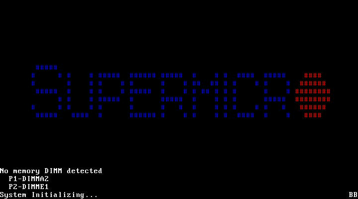

# aws-gpu02 が別の DIMM 故障で起動しなくなり実機検証が中断

- **実施日時**: 2026年9月10日 13:54 〜 9月11日 05:55 JST (上流調査・両機の電源投入・aws-gpu02 の POST 停止の切り分け・KVM 保全と SEL 読み出し・電源サイクル 1 回・両機の電源断。**うち 14:22 〜 22:07 と 22:20 〜 05:53 の計 約 15 時間 20 分はユーザ判断待ちの待機**)
- **報告日時**: 2026年9月11日 05:55 JST
- **作成者**: Claude Opus 5 (1M context)

## 概要

前回は、同じモデルに対応するための競合する二つの実装を同じ機械の上で直接くらべ、「どちらが速いかは入力の長さで入れ替わる」ことを実測した。今回はその続きとして、それぞれの最新版を取り寄せて実機で確かめる予定だった。依頼には「すでに本家に取り込まれているものがあるかもしれない」という但し書きが付いていた。

まず上流を調べたところ、本家への取り込みは一件も起きていなかった。四本ある関連の提案はすべて未決のままで、そのうち前回の主役だった片方は一行も進んでいない。もう片方だけが動いていたが、中身を読むと実装そのものの変更は一行だけで、残りはすべて本家の最新版を取り込んだ結果だった。つまり最新版を測ることは、実装の違いではなく本家側のこの一週間の変更が自分の環境でどう効くかを測ることに等しい。

そのかわり、まったく別の収穫があった。数日前に第三の実装系統が公開されていたのである。これは前回いっぽうの実装が長い入力で落ち込むことを問題視し、その原因とみられる部分に手を入れたものだった。しかも各機能を環境変数で個別に切れるようになっており、一度組み立てれば作り直さずに要因を切り分けられる。前回の宿題にそのまま答える材料になるので、これを本題に据えることでユーザと合意した。

ところが実機の準備段階でつまずいた。二台のうち補助側が起動しなくなっていたのである。画面を保全して確かめると、起動の初期段階で「メモリが検出できない」と表示したまま止まっていた。名指しされていたのは二本で、うち一本は先週すでに故障と特定して切り離してあるものだが、もう一本は実際に使われていた三本のうちの一本だった。つまり新たにもう一枚が落ちたことになる。

先週の故障は、点検機能が触りにいったときだけ誤りを起こすという性質のもので、その機能を止めることで回避できていた。今回はそれとは別で、誤り訂正の記録はまったく増えていない。検出そのものができていないので、設定で逃げられる種類のものではない。ユーザの許可を得て電源を入れ直してみたが、同じところで止まったままだった。設定画面にすら入れない段階で止まるため、ソフト側でできることは尽きている。

補助側は二台構成の片翼で、大きな重みを分担して受け持っている。これが上がらないと今回計画した測定は一つも実行できない。単独では容量が足りず、無理に動かしても過去のデータと比べられなくなるため意味がない。そこでユーザと相談し、今回は測定を見送って両機の電源を落とし、上流調査の結果と今回の故障をまとめることにした。

次にやるべきことは、問題の一枚を物理的に抜くことである。先週特定したもう一枚も「抜くのが恒久対策」とされたまま残っているので、同時に処置するのが合理的だ。処置が済めば、今回組み立てた測定計画はそのまま実行できる状態で残してある。

## 添付ファイル

- [実装プラン](attachment/2026-09-11_055337_aws_gpu02_dimma2_failure_glm53flash_upstream/plan.md)（測定計画。**次セッションでそのまま再利用できる**）
- POST 画面: [1 回目の電源投入](attachment/2026-09-11_055337_aws_gpu02_dimma2_failure_glm53flash_upstream/post_no_dimm_detected_1st.png) ／ [電源サイクル後](attachment/2026-09-11_055337_aws_gpu02_dimma2_failure_glm53flash_upstream/post_no_dimm_detected_after_cycle.png)
- [aws-gpu02 の SEL 全 213 件](attachment/2026-09-11_055337_aws_gpu02_dimma2_failure_glm53flash_upstream/sel_aws-gpu02.txt)
- スクリプト: [図の生成](attachment/2026-09-11_055337_aws_gpu02_dimma2_failure_glm53flash_upstream/mkfig.py) ／ [構成切替 (環境変数対応版)](attachment/2026-09-11_055337_aws_gpu02_dimma2_failure_glm53flash_upstream/run_cfg2.sh) ／ [両機 VRAM 取得](attachment/2026-09-11_055337_aws_gpu02_dimma2_failure_glm53flash_upstream/vram2.sh)
- 比較対象の過去 POST 画面: [2026-09-05 の `Failing DIMM ... P2-DIMME1`](attachment/2026-09-05_221831_aws_gpu02_uncorrectable_ecc/post_failing_dimm_p2_dimme1.png)

## 核心発見サマリ


**結論**: **GLM-5.3-Flash 対応の PR は本家 master に 1 件もマージされていない**（master `434ddbbc0e` の `src/models/` に `glm5next.cpp` は無い。**master にある `llama-memory-hybrid-idx.{cpp,h}` は qwen4exp #27742 由来で GLM とは無関係**）。**#27773 は `8134115f88` から 1 コミットも進んでおらず**（master から 70 コミット遅れ、09-09 に fairydreaming / CISC の `ggml_l2_norm` に関するレビューコメントのみ）、**#27917 は `5b8593b545`・#27752 は `1d0c76f3c6` でともに `dirty` のまま停止**。動いたのは **#27754 のみで `629b505528` → `d94f44e79a`**、ただし **glm5next 固有の変更は 1 行**（`ggml_mul_mat_set_prec` → `ggml_prec_set_acc`、上流 `5a6caa05fc` の API 改称追従）**で、残る約 90 コミットは上流 master の取り込み**（`fattn-mma-f16.cuh` 48/48・`fattn.cu` 102/98・`mmq`/`mmvq`/`vecdotq`、とくに `b74f590eaf` の f16 FA divergent barrier 修正は `-fa on` の本環境に直撃しうる）。**最大の新発見は第 3 の実装系統 [`smalinin/llama.cpp:my_glm53_flash`](https://github.com/smalinin/llama.cpp/tree/my_glm53_flash) `271235bb63`** で、**#27754 を土台に本家 master `465e49b9ce`（前回セッション終了時に両機を置いたコミットと同一）へポート**し、**前回測った「#27754 は 109,917 tok で tg 維持率 70.6%」に正面から対策**している（長文脈 sparse attention の compact 化・完了プール key の永続キャッシュ・完全な MTP・**prefill の indexed attention 切替を「batch ≥4096 tok」から「KV ≥32768 tok」へ変更**。ただし**この env で振れるのは prefill だけで decode 側は別条件**）。しかも **`LLAMA_GLM5_INDEXED_ATTN` / `LLAMA_GLM5_POOL_CACHE` / `GGML_CUDA_MOE_DOWN_REDUCE` などの環境変数で再ビルドなしに A/B できる**（`src/llama-kv-cache-kpool.cpp:40,1081` ほかで実在を確認）。**しかし実機検証は 1 試行も実施できなかった**。**aws-gpu02 が POST を通過しなくなった**ためで、KVM 画面は **`No memory DIMM detected` / `P1-DIMMA2` `P2-DIMME1` / POST コード `BB`** を表示したまま停止する。**`P1_DIMMA2` は OS が実際に使っていた 3 枚（`P1_DIMMA1/A2/A3`、94 GiB）の 1 枚**であり、既知の故障 `P2_DIMME1`（アドレスマップ外）とは**別個体の新規故障**である。**SEL の `Uncorrectable ECC` は 11 件のまま増えておらず**（`Patrol Scrub` 無効化の回避策は依然有効）、**今回の障害は ECC 経路ではなく DIMM の検出・訓練の段階**にある。**ハード電源 OFF → 30 秒 → ON の電源サイクルを 1 回実施したが同じ画面で停止**し、**BIOS setup にも到達できない**ため設定による回避の余地がない。**復旧には `P1_DIMMA2` の物理的な抜去が必要**。

## 前提・目的

前回レポート [GLM-5.3-Flash の 2 つの PR を深さで比較](./2026-09-06_234319_glm53flash_pr27773_vs_27754_depth.md) は、#27773 と #27754 を 13x Tesla P100 の RPC 分散で深さ 5 段階まで直接比較し、**pp は 7,349 tok で #27754 が 28.2% 速いが 109,917 tok では #27773 が 11.0% 速く、tg は 109,917 tok で #27773 が 30.0% 速い**という反転を実測した。残課題として「#27754 が深さで落ちる理由の切り分け」「#27754 の MTP を深文脈で測る」を残していた。

ユーザ依頼は「その続きで、最新版のコミットを実機確認。既にマージされている PR もあるかもしれない」である。

上流調査の結果を受けてユーザと相談し、範囲を **「#27754 最新 + smalinin フォーク」**（#27773 は HEAD が不変のため再測しない）に設定した。電源投入は `ALLOW_FAN_NOISE=1` の明示的許可を得て実施した。

## 環境情報

| 項目 | 値 |
|---|---|
| メインホスト | aws-gpu01 (10.8.2.1)、Tesla P100 16GB × 7。**今回は正常**（13:54:53 投入 → 翌 05:53 停止で**通電 約 16 時間**、うち大半はユーザ判断待ちのアイドル。SEL 29 件で memory イベント 0） |
| RPC ワーカー | aws-gpu02 (10.8.2.2)、Tesla P100 16GB × 4 + 12GB × 2。**POST を通過せず** |
| aws-gpu01 の llama.cpp | master `465e49b9c`、`--ui-mcp-proxy` 404 修正パッチ込み。**今回は checkout も stash もしていない（無変更）** |
| aws-gpu02 の DIMM 構成 | OS から見えるのは `P1_DIMMA1/A2/A3` の 3 枚（32GB × 3 = 94 GiB）。`P2_DIMME1/E2` は装着済みだが BIOS がアドレスマップから除外 |
| 本家 master | `434ddbbc0e`（2026-09-09） |

## 結果詳細

### 1. 上流 — **GLM-5.3-Flash はまだ 1 つもマージされていない**

`src/models/` に `glm5next.cpp` は存在しない。あるのは `glm-dsa.cpp`（GLM-5.2）、`glm4-moe.cpp`、`chatglm.cpp`、`glm4.cpp` である。

**紛らわしい点**: master に `src/llama-memory-hybrid-idx.{cpp,h}` があるが、これは **qwen4exp (#27742 / #27941) 由来**で GLM とは無関係である。#27773 が同名ファイルに kpool を埋め込んでいるため、ファイル名だけを見ると「マージされた」ように誤読しうる。

| PR | 作者 | 前回検証時 | 現在 | 状態 |
|---|---|---|---|---|
| **#27773** | timkhronos | `8134115f88` | **`8134115f88`（不変）** | OPEN / `blocked`。master から **70 コミット遅れ** |
| **#27754** | unslothai | `629b505528` | **`d94f44e79a`** | OPEN / `blocked`。**master と同期（behind 0）** |
| **#27917** | timkhronos (MTP) | `5b8593b545` | `5b8593b545`（不変） | OPEN / **draft** / `dirty` |
| **#27752** | eauchs | — | `1d0c76f3c6`（09-03 で停止） | OPEN / `dirty` |

**#27752（eauchs）の PR body には有用な設計の整理がある**。GLM-5.3-Flash は新規要素がほとんど無く、
既存サブシステムの組み合わせだという主張で、内訳は次のとおり:

- **KDA linear attention**（45 層中 34 層）は **`kimi-linear` の `ssm_*` テンソル**（`conv1d_q/k/v`、`f_a/f_b`、`g_a/g_b`、`beta`、`a`、`dt`、`norm`）にマップできる
- **hyper-connections (mHC)** は **DeepSeek-V4 のものがそのまま**使える（`hc_{attn,ffn}_{fn,base,scale}` とテンソル名まで一致）。差分は最終の stream collapse が重みなし平均である点だけで、これは既存の `dsv4_hc_mean` に相当
- **k-pool compressor** は **deepseek4 の `INDEXER_COMPRESSOR_{APE,WGATE}` を再利用**
- **MLA / MoE / NextN** は **GLM-5.2 の `GlmMoeDsaModel`** から

この整理は #27773 / #27754 のコードを読むときの地図として使える。

レビュアーは両本命とも `ggerganov` / `JohannesGaessler`（#27754 には `CISC` も）が指名されたまま。#27773 には 09-09 に `fairydreaming` と `CISC` から「なぜ `ggml_l2_norm()` / `build_gdn_l2_norm` を使わないのか」というレビューコメントが 2 件付いただけである。

### 2. #27754 の中身 — **実装変更は 1 行、残りは上流の取り込み**

`629b505528...d94f44e79a` は **91 コミット**。内訳は **自前 3 コミット**（`b9b8207fcf` Fix merge conflicts / `2af9da2d5e` Merge upstream master / `d94f44e79a`。うち前 2 つはマージコミット）と、**それらが取り込んだ上流 master の 88 コミット**である。つまり **実装に触れたコミットは `d94f44e79a` の 1 本だけ**になる。

glm5next 固有のファイルで動いたのは `src/models/glm5next.cpp` の 1 行だけ:

```diff
     // sign-unconstrained head weights; PREC_F32 is load-bearing, bf16 swaps near-tied pools
     ggml_tensor * w = ggml_mul_mat(ctx0, layer.indexer_proj, cur);
-    ggml_mul_mat_set_prec(w, GGML_PREC_F32);
+    ggml_prec_set_acc(w, GGML_PREC_F32);
```

これは上流 `5a6caa05fc`「ggml : update ggml_prec specification (#26675)」の API 改称への追従で、**意味は変わらない**。

**したがって「#27754 の最新を測る」ことは、実質「上流 master 88 コミットが sm_60 / IQ4_XS / 深文脈でどう効くか」を測ることになる**。前回 F1/F2 がバイト再現可能なベースラインとして残っているので、きれいな A/B になるはずだった。

取り込まれた上流のうち本環境に効きうるもの:

| コミット | 内容 | 効きうる理由 |
|---|---|---|
| `b74f590eaf` | ggml-cuda: fix divergent barrier in f16 flash attention (#27870) | 本環境は `-fa on` / f16 KV |
| `5a4d0fecae` | CUDA: replace `GGML_FA_ALL_QUANTS` with `GGML_FA_QUANTS` (#28079) | **ビルドフラグの改称**（下記） |
| `73ab7599b5` | CUDA: branchless Q4_K/Q5_K unpack to speed up mmvq (#26705) | IQ4_XS の MoE decode |
| `304665fe7a` | Add IQ type handling for MoE (#28476) | 同上 |
| `73a43d1f69` | cuda: fixes races in mmid and mmf (#28475) | MoE routing |

**ビルドフラグの注意**: `5a4d0fecae` により `GGML_CUDA_FA_ALL_QUANTS` は `GGML_CUDA_FA_QUANTS` に改称され、旧フラグは **deprecated alias（警告付きで `=all` 相当）**になった。既存の `update_and_build-aws-gpu0N.sh` はそのまま動くが警告が出る。`-fa on` + 既定 f16 KV しか使わないので `GGML_CUDA_FA_QUANTS="f16-f16"` に絞れば CUDA ビルドを大幅短縮できるが、**前回ビルドとの条件差になるため今回の計画では採用しない**と決めた。

### 3. ★ 第 3 の実装系統 smalinin フォーク

2026-09-09 に #27754 のスレッドで smalinin が [`smalinin/llama.cpp` の `my_glm53_flash`](https://github.com/smalinin/llama.cpp/tree/my_glm53_flash) を告知した。HEAD `271235bb63`（2026-09-10 01:16 UTC）、master から 87 ahead。**分岐元は master `465e49b9ce`** で、これは**前回セッション終了時に aws-gpu01/02 を置いたコミットと同一**である。

`GLM5NEXT_LOCAL_CHANGES_EN.md` によれば、**土台は #27754 の `glm5next/upstream`** で、その上に開発した最適化系列を新しい API へポートしたもの。実装コミットは 40 本。

**前回の実測に正面から刺さる内容**:

| # | 内容 | 前回の実測との対応 |
|---|---|---|
| 1 | **長文脈の sparse attention コスト削減**（decode を「選択プール + 不完全テール + アライメント padding」の compact 集合に限定） | 「#27754 は 109,917 tok で tg 維持率 70.6%」の直接の対策 |
| 2 | **完了プールの indexer key の永続キャッシュ**（新規・無効化分のみ増分更新） | 前回「#27773 の pooled cache が深さに強い」と見た機構と同種 |
| 3 | **完全な MTP**（prompt reuse / multimodal / multi-slot） | 残課題「#27754 の MTP を深文脈で測る」 |
| 4 | **indexed attention の切替閾値を変更**: 「prefill batch ≥ 4096 tok」をやめ **「KV ≥ 32768 tok」まで dense FA を保つ** | 前回測った反転点（28,390 と 109,917 の間）をちょうど跨ぐ |
| 5 | CUDA fused MoE down reduction（IQ4_XS で 4090 27-39% / 3090 14-18% と主張） | **sm_60 で効くかは未知**。前回 Sparse FA が sm_60 で効かなかった前例あり |

**最大の利点は環境変数による A/B**（再ビルド不要）。**下記 10 個はすべてソース上で実在と位置を確認済み**:

| 環境変数 | 効果 | 実装箇所 |
|---|---|---|
| `LLAMA_GLM5_INDEXED_ATTN` | `0`=dense 固定 / `2`=indexed 強制 | `src/llama-kv-cache-kpool.cpp:40` |
| `LLAMA_GLM5_POOL_CACHE=0` | 完了プール key の永続キャッシュ無効化 | 同 `:1081`、`src/llama-graph.cpp:3705` |
| `LLAMA_GLM5_MTP_TOPK_SHARE=0` | MTP の index 選択の再利用を無効化 | `src/models/glm5next.cpp:28` |
| `LLAMA_GLM5_KPOOL_EXPAND=0` | fused pool-index expansion 無効化 | 同 `:38` |
| `GGML_CUDA_TOPK_TEMPORAL=0` | 時間的 top-k ヒント無効化 | 同 `:33` |
| `LLAMA_MTP_DEVICE_DRAFT=0` | backend 常駐の MTP 内側ループを無効化 | `src/llama-context.cpp:1355` |
| `GGML_CUDA_MOE_DOWN_REDUCE=0` | fused expert-down reduction 無効化 | `ggml/src/ggml-cuda/mmvq.cu:1550` |
| `GGML_CUDA_TOPK_RADIX_SELECT=0` | CUDA の radix-selection top-k パスを無効化 | `ggml/src/ggml-cuda/top-k.cu:624` |
| `GGML_CUDA_GRAPH_SHAPE_CACHE=0` | CUDA Graph のキャッシュキー戦略を従来に戻す | `ggml/src/ggml-cuda/ggml-cuda.cu:2604` |
| `LLAMA_MTP_ADAPTIVE=0` | MTP の可変 draft 長を無効化 | `common/speculative.cpp:1521` |

**注意**: これは PR ではなく個人フォークである。sm_60 / CUDA 12.0 でのビルド実績は無いので、次回はビルド可否の確認から入る必要がある。

**作者が主張している性能値**（すべて RTX 4090 / 3090 での自己申告。本環境での追試は未実施）:

| 項目 | 主張 |
|---|---|
| **MTP**（50K プロンプト、固定 128 greedy トークン） | MTP off `626.04 pp / 32.71 tg` → **MTP on `565.38 pp / 56.46 tg`（decode +72.6%、95/95 accepted）**。出力は一致 |
| backend 常駐 MTP ループ（host fallback 比） | 短文脈 49.99 対 49.09 t/s（+1.8%）、**55,000 tok プロンプト後で 60.45 対 59.69 t/s（+1.27%）**（185/207 accepted） |
| GPU 直接 drafting（8K、固定 seed） | 76.36 対 74.75 t/s（**+2.15%**）。191/191 accepted、出力はバイト一致 |
| fused MoE down reduction | Q3_K で 4090 43-45% / 3090 34-35%、IQ3_XXS で 35-38% / 31-33%、**IQ4_XS で 27-39% / 14-18%** |

**MTP の +72.6% は前回の残課題「#27754 の MTP を深文脈で測る」に対する期待値**として使える。ただし **55K での改善幅は +1.27% と小さい**（これは MTP の有無ではなく draft ループを backend に置くかどうかの差）ので、**深文脈で MTP 全体がどれだけ効くかは本環境で測るしかない**。

**indexed attention の切替は prefill と decode で条件が別**（当初「ドキュメントと実コードが食い違う」と判断したが、
ソースを読み直した結果**ドキュメントの記述は正しい**。以下が正確な整理である）。

`src/models/glm5next.cpp:590` は経路を 2 つに分ける:

```cpp
const bool direct_indexed = n_tps == 1 ? n_kv >= std::max<int64_t>(4096, 2*n_compact) :
        llama_kpool_indexed_attn_enabled(n_kv, n_tps);
```

- **`n_tps > 1`（= prefill）** は `llama_kpool_indexed_attn_enabled()` を通る。その実体は
  `src/llama-kv-cache-kpool.cpp:35-49` で、**`mode >= 2 || (mode == 1 && n_kv >= 32768)`**。
  **ドキュメントの「KV が 32768 tok に達するまで dense FA を保つ」はこの経路のことで、記述どおりである**
- **`n_tps == 1`（= decode）** は `llama_kpool_indexed_attn_enabled()` を**呼ばず**、
  **`n_kv >= max(4096, 2*n_compact)`**（`n_compact = GGML_PAD(n_selected + r - 1, 256)`）で判定する。
  これは変更リスト 1 番の「compact sparse decode attention」に対応する別の仕組みである

**ここから A/B 計画に直結する重要な帰結が出る**: `llama_kpool_indexed_attn_enabled()` は冒頭で
**`if (n_tps <= 1) return false;`** としているため、**`LLAMA_GLM5_INDEXED_ATTN` は prefill にしか効かない**。
**decode 側の切替は環境変数で動かせない**ので、`LLAMA_GLM5_INDEXED_ATTN=0/2` の A/B で観測できるのは
**pp の変化であって tg ではない**。前回測った「深さでの tg 逆転」を切り分けたいなら、
効くのは `LLAMA_GLM5_POOL_CACHE=0` のほうである。

なお temporal top-k はさらに別条件で、`glm5next.cpp:577` が **`n_pools >= 24576`** かつ `n_tps == 1` を要求する。

**#27917（#27773 用の MTP）にも受理率の実測値がある**。PR body によれば、該当レイヤを Q4 に量子化した状態で
**`draft acceptance = 0.74485`（3,474 accepted / 4,664 generated）、`mean len = 4.13`、
位置別受理率 `(0.924, 0.813, 0.600, 0.441, 0.348)`**。**4 トークン目以降で受理率が半分を切る**ので、
`--draft-max` は 3〜4 が妥当という目安になる。なお `mergeable_state: dirty` は**本家 master へマージできない**という意味であって、
ブランチを checkout してビルドすること自体は妨げない（#27773 も `blocked` のままビルドできている）。

**mmproj の projector 型が実装ごとに違う可能性がある**。#27754 のスレッドで segmond が
`clip_init: failed to load model '.../mmproj-BF16.gguf': load_hparams: unknown projector type: glm5v` を報告し、
smalinin が「**unsloth のモデルなら動く。projector は `glm5next`**」と回答している。
一方 [09-05 セッション](./2026-09-05_204557_glm53flash_pr27773_sparse_fa_multistream.md) では
**#27773 で unsloth の mmproj が `swiglu_clamp` リネーム前で読めず、`avar6/GLM-5.3-Flash-BF16-gguf` の mmproj を使った**。
**PR ごとに受理する projector 名と mmproj が違う**とみるのが自然で、**#27754 系で vision を試すときは
avar6 ではなく unsloth の mmproj から試す**べきである。

### 4. aws-gpu02 の POST 停止 — **`P1_DIMMA2` の新規故障**

13:54:53 JST に両機へ電源投入。aws-gpu01 は 210 秒で SSH 到達したが、**aws-gpu02 は 22 分経っても ping・SSH とも不通**だった。CLAUDE.md の必須手順どおり、電源操作の前に KVM スクショと SEL を取得した。

**KVM 画面（1 回目、14:18）**:



**2026-09-05 の画面との比較**が決定的である。

| | 2026-09-05（Patrol Scrub 無効化時） | 2026-09-10（今回） |
|---|---|---|
| メッセージ | `Failing DIMM:DIMM location(Uncorrectable memory component found)` | **`No memory DIMM detected`** |
| 名指しされた DIMM | `P2-DIMME1` のみ | **`P1-DIMMA2`** と `P2-DIMME1` |
| POST コード | `BA` | **`BB`** |
| 結果 | **227 秒で SSH 到達（起動成功）** | **POST を通過しない** |

`P1_DIMMA2` は 09-05 セッションの `dmidecode` で **`Size: 32 GB / Locator: P1_DIMMA2`** と記録されている、**OS が実際に使っていた 3 枚のうちの 1 枚**である（残る 2 枚は `P1_DIMMA1`（Kingston、SPD 文字列が読めず `<BAD INDEX>`）と `P1_DIMMA3`（Micron））。既知の故障 `P2_DIMME1` は BIOS がアドレスマップから外しているので、**今回名指しされたのは別個体の新規故障**である。

**SEL には ECC が増えていない**:

| 項目 | 09-06 セッション終了時 | 今回 |
|---|---|---|
| SEL 総件数 | — | **213 件** |
| `Uncorrectable ECC` | **11 件** | **11 件（増加 0）** |
| 09-10 の新規イベント | — | 36 件、すべて `Unknown #0xff` |

新規イベントは電源投入のたびに数秒間にまとまって出る（**1 回目 13:55:03-06 に 24 件、電源サイクル後の 2 回目 22:08:20-21 に 12 件**）。`sel get` でデコードすると `Generator ID 001b` / `Sensor Type Unknown` / `Sensor Number ff` / `Event Data 301301`（09-05 の同種は `301421`）で、**ipmitool では意味を特定できない OEM レコード**である。

**したがって今回の障害は ECC 経路ではなく、DIMM の検出・訓練の段階で起きている**。`Patrol Scrub` を無効化した回避策は依然有効であり、前回の対策が破れたわけではない。

### 5. 電源サイクルによる復旧の試み — **失敗**

ユーザの明示的許可を得て、**ハード電源 OFF → 30 秒待機 → ON** を 1 回実施した（22:07:29 → 22:08:12 JST）。

- 22:08:54（投入 42 秒後）: すでに `No memory DIMM detected` を表示
- 22:16:27（495 秒後）: SSH 到達せず打ち切り
- 22:18:13: **同じ画面・同じ POST コード BB のまま**


**BIOS setup にも到達できない**（`System Initializing...` は setup 突入より前の段階）ため、`Memory RAS Configuration` を触るような設定による回避の余地がない。DIMM 温度センサは全 24 スロットが `No Reading`（BMC へのハンドオフ前）、Redfish の `/Systems/1/Memory` も POST 進行中で応答が不安定（`P1_DIMMA1` が返らず `P1_DIMMA2` が重複して返る）で、いずれも診断には使えなかった。

**ソフト側でできる手は尽きた。復旧には `P1_DIMMA2` の物理的な抜去が必要である。**

### 6. 実機検証は 1 試行も実施できなかった

aws-gpu02 は RPC ワーカーとして 6 GPU（88 GiB）を担当している。**これが上がらないと 146 GiB の `UD-IQ4_XS` が載らない**（aws-gpu01 単体は 7 GPU / 112 GiB）。CPU offload で無理に動かすことは可能だが、**過去のデータと速度を比較できなくなるため測定の目的を果たさない**。ユーザと相談し、測定を見送って両機の電源を落とすことにした。

## 再現方法（次セッション用）

**物理作業が先**: `P1_DIMMA2` を抜去する。あわせて `P2_DIMME1` も抜去してよい（CLAUDE.md 上「恒久対策は物理的な抜去」、現在未使用なので容量の損失はゼロ）。抜去後は `P1_DIMMA1` + `P1_DIMMA3` の 2 枚 = 約 62 GiB になる。**RPC ワーカーの役割ではホスト RAM をほとんど使わない**ので、容量的には支障がない見込み。

その後の測定手順は [添付のプラン](attachment/2026-09-11_055337_aws_gpu02_dimma2_failure_glm53flash_upstream/plan.md) をそのまま実行できる。要点のみ:

```bash
# 1) 電源投入（ユーザの明示的指示がある場合のみ）
ALLOW_FAN_NOISE=1 .claude/skills/gpu-server/scripts/bmc-power.sh aws-gpu01 on
ALLOW_FAN_NOISE=1 .claude/skills/gpu-server/scripts/bmc-power.sh aws-gpu02 on
# 2) 到達後にロック（再起動で /tmp が飛ぶので必ず電源投入の後）
.claude/skills/gpu-server/scripts/lock.sh aws-gpu01
.claude/skills/gpu-server/scripts/lock.sh aws-gpu02

# 3) 構成 G — #27754 最新
for S in aws-gpu01 aws-gpu02; do
  ssh -n $S "cd ~/llama.cpp && git fetch origin pull/27754/head:pr27754-new -f && git checkout pr27754-new && git rev-parse HEAD"
done   # 両機で d94f44e79a... 一致を確認してからビルド

# 4) 構成 H — smalinin フォーク（PR ではないので remote 追加が要る）
for S in aws-gpu01 aws-gpu02; do
  ssh -n $S "cd ~/llama.cpp && git remote add smalinin https://github.com/smalinin/llama.cpp.git 2>/dev/null; \
             git fetch smalinin my_glm53_flash && git checkout -B smalinin-glm53 smalinin/my_glm53_flash && git rev-parse HEAD"
done

# 5) 環境変数 A/B は run_cfg2.sh（本レポート添付）を使う
EXTRA_ENV="LLAMA_GLM5_POOL_CACHE=0" bash /tmp/run_cfg2.sh H1A "$M54" 32768 4096
```

プロンプトは 09-05 セッションの添付（`short.json` / `needle_7k.json` / `needle_11k.json` / `needle_29k.json` / `needle_108k.json`）を**バイト同一のまま流用**する。GGUF は #27754 系なので配布元メインの `~/models/GLM-5.3-Flash-GGUF/UD-IQ4_XS/` を使う（#27773 用の `-nopatch/` と取り違えると `head_count_kv` で弾かれる）。

## 副次発見

- **`Patrol Scrub` 無効化の回避策は破れていない**。SEL の `Uncorrectable ECC` は **11 件のまま**で、09-05 21:00:17 を最後に増えていない。今回の障害はまったく別の事象である
- **POST コードで事象を弁別できる**。09-05 の「訂正不能エラー検出」は `BA`、今回の「DIMM 未検出」は `BB` である。どちらも `System Initializing...` の文字列は同じなので、**画面下部の 2 桁コードまで読む必要がある**
- **BMC の Redfish / SDR は POST 進行中には信用できない**。DIMM 温度は全スロット `No Reading`、`/Systems/1/Memory` は同じ `DeviceLocator` を複数 ID で返した。**POST 段階の診断は KVM スクショが唯一の確実な情報源**である
- **master の `llama-memory-hybrid-idx.{cpp,h}` は GLM 由来ではない**。qwen4exp (#27742) が先に同じファイルを入れており、#27773 はそこに kpool を相乗りさせている。**ファイル名の一致をマージの証拠にしてはいけない**
- **`GGML_CUDA_FA_ALL_QUANTS` は 09-09 に deprecated になった**。`GGML_CUDA_FA_QUANTS`（既定 `q4_0-q4_0;q8_0-q8_0;f16-f16;bf16-bf16`、`all` で全組合せ）が後継。**`f16-f16` だけに絞れば CUDA ビルドを大幅に短縮できる**が、過去ビルドとの条件差になるので採用は測定系列の切れ目で行うべき
- **aws-gpu01 の 100GbE は相手が落ちていると IP が付かない**。`enp11s0np0` は `Link detected: no (Autoneg, No partner detected)` で **DOWN**、`192.168.100.1` は未割当だった（`/etc/netplan/60-rpc-100gbe.yaml` で永続化されているが carrier 待ちで適用されない）。**aws-gpu02 が上がれば自動で付く見込みだが、次回は RPC 起動前に `ip -br addr show` で確認すること**。なお同ファイルは `ubuntu` ユーザからは読めない（権限）
- **CPU offload 環境でのスレッド数の目安（他ユーザ報告、本環境は GPU only なので未検証）**: #27754 スレッドで noonghunna が「**`-t` の有効ゾーンは `nproc/2` ではなく絶対値 24〜32 スレッド**」「32 コア機で 16 threads は 28 threads より約 20% 遅い」と報告。あわせて `UD-IQ3_XXS` は約 114 GB、`UD-IQ4_XS` は約 147 GB というサイズ感も示している（**本レポートの「146 GiB」は同じ 156,822,111,075 B を GiB で表したもの**で、食い違いではない）
- **待機中も電源が入りっぱなしになる**。今回はユーザ判断待ちが **2 回（14:22〜22:07 の 7 時間 45 分と、22:20〜05:53 の 7 時間 33 分）**あり、**aws-gpu01 は通算 約 16 時間**のうち**約 15 時間 20 分をアイドルで通電**していた。**判断待ちが長引きそうなときは先に電源を落とす**運用のほうがよい

## 残課題

- **`P1_DIMMA2` の物理抜去**（最優先。これが済むまで aws-gpu02 は使えない）。あわせて `P2_DIMME1` も抜去してよい
- **抜去後の健全性確認**: 2 枚（約 62 GiB）で POST を通過するか、`ras-mc-ctl --summary` が 0 のままか、RPC ワーカーとしてホスト RAM が足りるか
- **本セッションで実施できなかった測定**（プランは添付済み）:
  - **#27754 `d94f44e79a` の 5 深度**（前回 F1/F2 との A/B ＝ 上流 master 88 コミットの効果測定）
  - **smalinin `271235bb63` の 5 深度**とビルド可否（sm_60 / CUDA 12.0 での実績が無い）
  - **環境変数 A/B**: `LLAMA_GLM5_POOL_CACHE=0` / `LLAMA_GLM5_INDEXED_ATTN=2` / `GGML_CUDA_MOE_DOWN_REDUCE=0` を 28,390 tok で
  - **smalinin の MTP を深文脈で**（前回からの持ち越し）。**作者は 50K で decode +72.6% を主張**しているので、これが sm_60 で再現するかが焦点
  - **indexed attention の prefill 側切替（KV 32768）の効果**: `LLAMA_GLM5_INDEXED_ATTN=0/2` で振れるのは **prefill だけ**（decode は環境変数を見ない）。**pp の変化として観測する**。28,390 tok は閾値の手前、109,917 tok は後なので、この 2 点が効く
  - **#27754 系での vision**: mmproj は avar6 ではなく **unsloth のもの**から試す（projector 名が `glm5next` と報告されている）
- **反転点の特定**: 28,390 と 109,917 のあいだで pp / tg とも逆転している。50k / 70k を 2 点測れば挟める（前回からの持ち越し）
- **`--image-max-tokens` が効かない件**: 09-06 に LifesLight が報告。mmproj の `image_max_pixels` 直接書き換えでは上限が効くとのことで arg 側の実装漏れが疑われる（前回からの持ち越し）
- **Sparse FA が sm_60 で効かない理由**（前回からの持ち越し）
- **本家マージ待ち**: 4 本とも OPEN。**master には依然 `glm5` 系 arch が入っていない**

## 作業後の状態

| 項目 | 状態 |
|---|---|
| aws-gpu01 | **電源 OFF**（2026-09-11 05:53 JST、ACPI グレースフル停止）。llama.cpp は **master `465e49b9c` のまま無変更**（`--ui-mcp-proxy` 404 修正パッチも保持。今回は checkout も stash もビルドもしていない） |
| aws-gpu02 | **電源 OFF**（同、POST 停止中のためハード OFF）。**`P1_DIMMA2` の物理抜去待ち** |
| ロック | **両機とも未取得のまま**（POST 停止で取得前に中断したため）。**aws-gpu01 は `lock-status.sh` で `available` を確認済み**。aws-gpu02 はロックファイルが `/tmp` 上にあり SSH 不通で確認できないが、**そもそも `/tmp` は電源断で消えるので残存しない** |
| モデル | 変更なし（`UD-IQ4_XS/` 146 GiB ほかを残置） |
| aws-gpu02 の SEL | 213 件。`Uncorrectable ECC` は **11 件で変化なし**（最終記録は 2026-09-05 21:00:17） |
| 測定資材 | `run_cfg2.sh`（環境変数対応版）と `vram2.sh` を新規作成し本レポートに添付。**サーバへの配置は未実施** |

## 参照レポート

- [GLM-5.3-Flash の 2 つの PR を深さで比較 — 浅いと速いほうが深いと逆転する](./2026-09-06_234319_glm53flash_pr27773_vs_27754_depth.md)（本レポートの直接の前提。**その残課題に答えるための材料が smalinin フォークとして出現した**）
- [aws-gpu02 の連続ハング — 原因はメモリの訂正不能エラー](./2026-09-05_221831_aws_gpu02_uncorrectable_ecc.md)（`P2_DIMME1` の特定と `Patrol Scrub` 無効化。**今回の `P1_DIMMA2` はこれとは別個体の新規故障**）
- [GLM-5.3-Flash の PR に並列と画像対応が入ったので実機で確かめた](./2026-09-05_204557_glm53flash_pr27773_sparse_fa_multistream.md)（プロンプト JSON と測定スクリプトの出典）
- [GLM-5.3-Flash 対応 PR の本命交代を実機で確かめる](./2026-09-02_160322_glm53flash_pr27773_verification.md)
- [GLM-5.3-Flash を aws-gpu01/02 の RPC 分散で起動する](./2026-08-27_235754_glm53flash_aws_gpu_rpc_startup.md)
