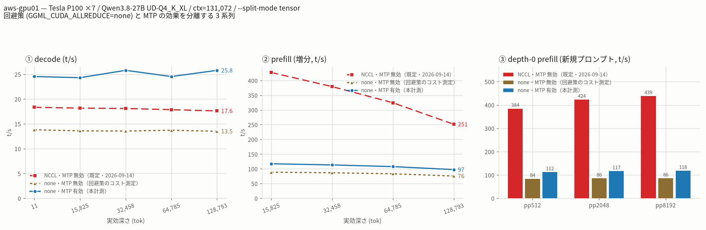

# tensor 分割と MTP は両立するが回避策が prefill を 7 割奪う

- **実施日時**: 2026年9月15日 23:19 〜 2026年9月16日 11:05 JST (電源投入・環境同一性の確認・env 不活性テスト・3 腕スモーク・ctx=131072 プリフライト・本計測 76 分・腕別の実プロンプト補正・回避策コストの切り分け腕 40 分・NCCL 腕の再測定 10 試行・作図とレポート)
- **報告日時**: 2026年9月16日 11:05 JST
- **作成者**: Claude Opus 5 (1M context)

## 概要

二日前に、カードを 7 枚積んだ機械で大きなモデルを分けて載せる二つのやり方を比べ、そこにモデルの先読み機構を足すとどうなるかを測った。ところがそのときは、分担分割の腕だけが起動時に固まって取れず、二本の腕での比較に終わっていた。その後の原因調査で、固まるのは先読みとは無関係で、カード間で計算結果を足し合わせる既定の通信ライブラリの不具合だと判明し、環境変数一つで避けられることも分かった。今回はその回避策を使って、欠けていた腕を埋め、三本そろえて測り直した。

まず、欠けていた腕は問題なく取れた。分担分割と先読みは併用でき、長い文脈でも破綻しない。それどころか生成速度の落ちにくさは際立っており、十三万トークンの深さでも浅いところと同じ速度を保つ。層分割が同じ深さで半分近くまで落ちるのとは対照的である。

ところがここで、比較の土台に穴があることに気づいた。二日前に測った分担分割の値は既定の通信ライブラリを使ったものである。今回の腕は回避策を入れている。つまり二つの条件が同時に変わっており、速くなった分がどちらのおかげなのか、この二本を見比べるだけでは分からない。そこで足りない組み合わせ、すなわち回避策を入れたうえで先読みを切った腕を追加で測った。

その結果は予想外だった。**回避策そのものに大きな代償がある**。先読みを切った状態で比べると、回避策を入れるだけで生成速度は四分の一減り、プロンプトの読み込み速度にいたっては八割も失われる。読み込みは元々この分割方式の最大の長所で、短いプロンプトでは層分割の三倍出ていたのに、回避策を入れると層分割より遅くなってしまう。先読みを足すと読み込みは少し戻るが、それでも元の四分の一程度にとどまる。

つまり、これまで「先読みが読み込みを遅くする」と読めていた現象は、その大半が先読みのせいではなく回避策のせいだった。生成速度のほうも同じで、回避策で失った分を先読みが取り返しているだけで、既定の通信ライブラリが正常に動いていたときの水準には、実運用相当に補正すると届いていない。

念のため既定の通信ライブラリでの値を取り直そうとしたが、十回続けて起動に失敗した。止まる場所は前回の調査で特定した地点とまったく同じで、カードは全部振り切れているのにメモリはまったく動かないという、相手待ちの空回りの徴候も一致していた。前回の三回と合わせると、この構成では十三回連続で起動できていないことになる。したがって既定経路の性能は、二日前にたまたま起動できた一回の測定に頼るしかない。

副産物として、二日前のレポートが回避策として推奨していた値が、実は綴りとして存在しない無効な値だったことが分かった。未知の値を渡すと警告を出したうえで通信を無効にする実装になっていたため、結果的に意図した挙動にはなっていたが、正しい書き方は別にある。今回はその正しい値を使い、警告が出ないことを確認した。

もう一つ、先読みの当たりやすさが分割方式で違うことも見えた。同じ文章を生成させても、分担分割では層分割より明らかに当たらない。実務的な文章では半分に届かず、層分割の三分の二と差がある。先読みが効く前提そのものが分割方式に依存しているということで、これは今回初めて観測された。

運用上の結論は、二日前と変わらず分担分割が最良である。ただし読み込みの速さを買いたいなら既定の通信ライブラリが要り、その起動は確率的に失敗する。回避策は起動を確実にする代わりに、この分割方式の長所をほとんど打ち消してしまう。どちらを選ぶかは、起動の確実性と読み込み速度のどちらを重んじるかの判断になる。

なお作業の終盤、固まったプロセスを止めた副作用で機械の GPU が一時的にまったく使えなくなった。管理者権限でドライバの一部を読み込み直して復旧している。この現象は今後も同じ操作のたびに起きうるので、手順として記録しておく。

## 添付ファイル

- [実装プラン](attachment/2026-09-16_103619_aws_gpu01_split_mode_mtp_3arm/plan.md)
- [腕の対応表](attachment/2026-09-16_103619_aws_gpu01_split_mode_mtp_3arm/run/README-arms.md) — どのディレクトリがどの条件かの一覧（**先に読むと迷わない**）
- [本計測 3 腕の結果一式](attachment/2026-09-16_103619_aws_gpu01_split_mode_mtp_3arm/run/) — `run-info.json`（バイナリ sha256・モード表・`launch_prefix`）、`results-{layer,tensor,layer2}.json` / `-pp0.json`、`results-real.json`（tensor 腕）、`real-layer/` `real-layer2/`（腕別の実プロンプト補正）、`argv-*.txt`、`server-*.log`、`sampler-*.log`、`responses-*/`
- [回避策コストの切り分け腕](attachment/2026-09-16_103619_aws_gpu01_split_mode_mtp_3arm/run-tensor-none-nomtp/) — tensor × `none` × MTP 無効
- [NCCL 腕の再測定試行](attachment/2026-09-16_103619_aws_gpu01_split_mode_mtp_3arm/nccl-retry/) — `retry.log` と `server-try{1..10}.log`。**10 回すべて起動ハング**
- [今回の `bench.local.conf`](attachment/2026-09-16_103619_aws_gpu01_split_mode_mtp_3arm/bench.local.conf) — 前回との差分は `LAUNCH_PREFIX` の 1 行のみ
- スクリプト: [3 腕・腕別補正版の比較図](attachment/2026-09-16_103619_aws_gpu01_split_mode_mtp_3arm/plot_mtp2.py) ／ [tensor 切り分け図](attachment/2026-09-16_103619_aws_gpu01_split_mode_mtp_3arm/plot_tensor.py) ／ [結果表の生成](attachment/2026-09-16_103619_aws_gpu01_split_mode_mtp_3arm/tables.py) ／ [サンプラ集計](attachment/2026-09-16_103619_aws_gpu01_split_mode_mtp_3arm/sampler.py) ／ [腕別実プロンプト測定](attachment/2026-09-16_103619_aws_gpu01_split_mode_mtp_3arm/real-arm.sh) ／ [NCCL 腕のリトライ](attachment/2026-09-16_103619_aws_gpu01_split_mode_mtp_3arm/nccl-retry.sh)
- 図（MTP on/off × 3 腕）: [日本語版](attachment/2026-09-16_103619_aws_gpu01_split_mode_mtp_3arm/run/mtp-compare-ja.png) ／ [英語版](attachment/2026-09-16_103619_aws_gpu01_split_mode_mtp_3arm/run/mtp-compare-en.png)
- 図（tensor 腕の切り分け）: [日本語版](attachment/2026-09-16_103619_aws_gpu01_split_mode_mtp_3arm/run/tensor-isolate-ja.png) ／ [英語版](attachment/2026-09-16_103619_aws_gpu01_split_mode_mtp_3arm/run/tensor-isolate-en.png)
- 図（ツール標準出力、今回の 3 腕）: [日本語版](attachment/2026-09-16_103619_aws_gpu01_split_mode_mtp_3arm/run/split-bench-ja.png) ／ [英語版](attachment/2026-09-16_103619_aws_gpu01_split_mode_mtp_3arm/run/split-bench-en.png)

## 核心発見サマリ

![aws-gpu01 の Tesla P100 7 枚で測った MTP on/off × 3 腕の比較。①decode は MTP 有効で layer 7枚 11.26→20.42、tensor 7枚 18.34→24.54、layer 2枚 12.11→21.26 t/s に伸び、tensor は深さ 128,793 tok でも 25.78 t/s と初段比 105% を維持する。②伸び率は合成テキストで layer +81〜106%、tensor +34〜46%、layer2 +76〜107%。腕別の実運用補正（layer ×0.750 / tensor ×0.736 / layer2 ×0.800）をかけると tensor は -2〜+8% とほぼ横ばいになる。③prefill は tensor が 427→117 t/s（-73%）と激しく落ち、layer 7枚の -31〜-37%、layer 2枚の -10〜-11% とは桁が違う。④採択率は合成テキストで layer/layer2 が 97〜100% に張り付くのに対し tensor は 80〜98% と低く、実プロンプトでは layer 63%・layer2 67% に対し tensor は 46% しかない](attachment/2026-09-16_103619_aws_gpu01_split_mode_mtp_3arm/run/mtp-compare-ja.png)

**結論: [前レポート](./2026-09-14_124457_aws_gpu01_split_mode_mtp.md)で欠測だった `--split-mode tensor` + MTP の腕が取れ、両立することを深度ラダーで確認した。ただし `--split-mode tensor` の MTP 有効／無効を直接比べると `GGML_CUDA_ALLREDUCE` の値も同時に変わってしまうため切り分け腕を追加したところ、`decode -25% / prefill -80%` という大きな劣化は MTP ではなく回避策そのものが原因だった。**

- **3 腕がそろった**（`GGML_CUDA_ALLREDUCE=none`）。decode は合成テキストで **layer 7枚 11.26→20.42（+81%）／ tensor 7枚 18.34→24.54（+34%）／ layer 2枚 12.11→21.26（+76%）**。深さ 128,793 tok では **tensor が 25.78 t/s で初段比 105.1%** と、深さでまったく落ちない（layer は 62.9%）。
- **【最重要】回避策と MTP を分離した**。前回の tensor 腕（MTP 無効）は**既定の NCCL 経路**、今回の tensor 腕（MTP 有効）は **`none` 経路**で、2 つの変更が交絡していた。`tensor × none × MTP 無効` の腕を追加した結果:

| tensor 7枚 / ctx=131072 | decode 初段 | decode 最深 | prefill 増分(最深) | pp512 | GPU 利用率 |
|---|---:|---:|---:|---:|---:|
| **NCCL・MTP 無効**（2026-09-14） | 18.34 | 17.61 | 251.4 | **384.4** | **75.6%** |
| **none・MTP 無効**（回避策のコスト） | **13.81** | **13.50** | **75.6** | **83.8** | 48.7% |
| **none・MTP 有効**（本計測） | **24.54** | **25.78** | 97.4 | 112.4 | 48.8% |

  **回避策だけで decode -25%（18.34→13.81）、prefill -78%（384.4→83.8）**。MTP はそこから decode を +78% 戻すが、**prefill は +34% 戻るだけで NCCL の 1/3 にも届かない**。
- **前レポートの「MTP は prefill を劣化させる」は tensor 腕については誤読だった**。tensor の prefill 劣化（427→117 = -73%）の**内訳は回避策 -78% / MTP +34%** であり、**MTP 単独では prefill を改善している**。layer 腕の -31〜-37% は回避策が無関係（layer では `comm_init` 自体が呼ばれない）なので、そちらは MTP の効果で正しい。
- **実運用補正を腕別に取り直した**（前回は layer の 0.761 を全腕に一律適用していた）。**layer 0.750 / tensor 0.736 / layer2 0.800**。補正後の decode は **tensor が 18.06→18.98 t/s で、NCCL・MTP 無効の 18.34→17.61 に対し -2〜+8%**。**回避策 + MTP は、正常な NCCL 経路の性能をようやく取り戻す程度**である。
- **採択率が split-mode に依存する**（新発見）。合成テキストで layer / layer2 が 0.968〜1.000 に張り付くのに対し **tensor は 0.804〜0.978**。実プロンプトでは **layer 0.635 / layer2 0.672 に対し tensor 0.462** で、`tokens_per_cycle` も tensor だけ **0.964 と 1 を割る**。同じモデル・同じプロンプトで分割方式だけが違うのに採択率が変わる。
- **NCCL 経路の再測定は 10 回連続で失敗した**。全 10 回が `llama threadpool init` の直後（= ウォームアップの最初の GPU 実行）で停止し、GPU は `utilization.gpu 100% / utilization.memory 0%` という[前レポート](./2026-09-14_142115_aws_gpu01_tensor_split_nccl_hang.md)と同一の徴候を示した。**前回の 7 枚 0/3 と合わせて通算 0/13**。
- **`GGML_CUDA_ALLREDUCE=butterfly` は不正値だった**（前レポートの訂正）。`ggml/src/ggml-cuda/ggml-cuda.cu:1228-1248` が受け付けるのは **`nccl` / `internal` / `none`** のみで、未知値は `unknown GGML_CUDA_ALLREDUCE value:` を警告して `comm_init_none` にフォールバックする。**挙動は `none` と同一**なので前レポートの結論は変わらないが、正しくは `none` と書く。本計測では警告が 0 件であることを確認した。
- 証跡: バイナリは 3 レポートすべてと同一（`ca54f4dd8a4750198b85ebf4bd195c580c77bc98bf1b772388581c1cd8593886`、llama.cpp master `465e49b9c` / build 10830）。`run-info.json` の `launch_prefix` に `env GGML_CUDA_ALLREDUCE=none` が記録されている。

## 前提・目的

- **背景**: 同一機・同一モデルで 3 本のレポートが連続している。
  1. [2026-09-14 10:49 layer vs tensor](./2026-09-14_104905_aws_gpu01_split_mode_layer_vs_tensor.md) — MTP 無効で 3 腕を測り tensor 優位と結論（**既定の NCCL 経路**）
  2. [2026-09-14 12:44 MTP](./2026-09-14_124457_aws_gpu01_split_mode_mtp.md) — MTP 有効。**tensor 腕が起動ハングで欠測**し 2 腕のみ
  3. [2026-09-14 14:21 NCCL ハング](./2026-09-14_142115_aws_gpu01_tensor_split_nccl_hang.md) — 2 の「MTP × tensor 固有」は誤りで、真因は `--split-mode tensor` 単独の起動時 NCCL AllReduce 不具合と特定。回避策を実証
- **目的**: 3 の回避策で 2 のベンチマークを 3 腕そろえて再実施する。3 のレポートが残課題に「MTP 有効での tensor 腕の正式な再測定。これにより『MTP は tensor の代替にならない』という結論を同一条件の 3 腕で検証し直せる」と書いており、それに応える。
- **変更点は 2 つだけ**: 腕に `tensor` を戻したことと、`LAUNCH_PREFIX="env GGML_CUDA_ALLREDUCE=none"` を足したこと。バイナリ・モデル・KV 型・ctx・ステージ・生成トークン数・pp0 サイズ・スレッド数・`SPEC_ARGS` はすべて前回と一字一句同じ。
- **計測中に判明した交絡**: 上記 1 の tensor 腕は NCCL 経路なので、今回の tensor 腕と直接比べると「MTP の効果」と「AllReduce 経路の効果」が分離できない。**本レポートはこの穴を埋めるために当初計画になかった腕を 2 本追加している**（`tensor × none × MTP 無効`、および NCCL 腕の再測定試行）。

## 環境情報

| 項目 | 値 |
|---|---|
| サーバ | aws-gpu01 (10.8.2.1)、Supermicro SYS-4028GR-TRT2。**本作業のために電源投入**（ユーザの明示許可。ファンは POST 中も 2,900rpm 台） |
| GPU | Tesla P100-PCIE-16GB × 7（sm_60）、PCIe 接続・**NVLink なし** |
| llama.cpp | master `465e49b9c`、build 10830（**過去 3 レポートと同一バイナリを再ビルドせず使用**） |
| バイナリ sha256 | `ca54f4dd8a4750198b85ebf4bd195c580c77bc98bf1b772388581c1cd8593886` |
| モデル | `Qwen3.8-27B-UD-Q4_K_XL.gguf`（arch `qwen35`、hybrid、17,559,178,144 B、MTP ヘッド `blk.64` 同梱） |
| KV キャッシュ | `--cache-type-k q8_0 --cache-type-v q8_0` |
| 共通起動引数 | `-ngl all -fa on -c 131072 --parallel 1 -t 16 --jinja --cache-ram 8192 --cache-idle-slots --cache-reuse 256` |
| 投機デコード | `--spec-type draft-mtp --spec-draft-n-max 2`（前回と同一） |
| **AllReduce** | **`GGML_CUDA_ALLREDUCE=none`**（`LAUNCH_PREFIX` 経由。**今回の唯一の追加**） |
| 計測モード | `layer`（CUDA0-6 / layer）、`tensor`（CUDA0-6 / tensor）、`layer2`（CUDA0,CUDA1 / layer、ベースライン） |
| ワークロード | ctx=131072、ステージ `0,16000,32000,64000,128000`、各段 1000 tok 生成、pp0 サイズ 512/2048/8192 |
| 所要 | layer 19分06秒（23:52:31→00:11:37）／ tensor 29分54秒（→00:41:31）／ layer2 26分30秒（→01:08:01）。**本計測 合計 75分30秒**。ほかに切り分け腕 40分28秒、腕別実プロンプト 8分、NCCL 再測定 10 試行 18分 |
| ロック | `aws-gpu01` のみ取得（aws-gpu02 は `P1_DIMMA2` 故障で電源 Off、RPC スタックは立てない） |

**`bench.local.conf` の差分**（前回 → 今回）:

```diff
+# 2026-09-15: --split-mode tensor の起動時 NCCL AllReduce ハング回避（report/2026-09-14_142115 参照）。
+# 有効値は nccl / internal / none のみ。layer 腕では comm_init 自体が呼ばれず完全に不活性（実測確認済み）。
+LAUNCH_PREFIX="env GGML_CUDA_ALLREDUCE=none"
```

**VRAM（モデルロード直後、`nvidia-smi` の実測合計）**:

| 構成 | MTP 無効 | MTP 有効 | 増分 | 増分の所在 |
|---|---:|---:|---:|---|
| layer 7枚 | 30,238 MiB | 32,108 MiB | +1,870 MiB | CUDA6 が 4,866 → 6,466 MiB |
| **tensor 7枚**（NCCL） | 27,816 MiB | **30,100 MiB** | **+2,284 MiB** | **7 枚に均等分散**（各 +326 MiB、4,200〜4,358 MiB） |
| layer 2枚 | 23,084 MiB | 24,952 MiB | +1,868 MiB | CUDA1 が 12,182 → 13,894 MiB |

**tensor 分割では MTP の追加 VRAM が 7 枚に均等分散する**ため、最終デバイスに集中する layer 分割と違って偏りが出ない。ctx=131072 でも各カード 4.3 GiB / 16 GiB と余裕が大きい。

## 再現方法

```bash
# 0) 電源投入（ユーザの明示許可が要る）とロック
cd /home/ubuntu/projects/llm-server-ops
.claude/skills/gpu-server/scripts/lock.sh aws-gpu01
ALLOW_FAN_NOISE=1 .claude/skills/gpu-server/scripts/bmc-power.sh aws-gpu01 on
until ssh -n -o ConnectTimeout=5 aws-gpu01 true 2>/dev/null; do sleep 15; done
.claude/skills/gpu-server/scripts/lock.sh aws-gpu01   # /tmp が消えるので取り直す

# 1) env が layer 腕で不活性なことの確認（全腕に一律で渡してよいかの判断）
#    不正な値を渡して警告が出るかを見る。layer では comm_init が呼ばれないので 0 件になる
ssh -n -f aws-gpu01 "cd ~ && setsid nohup env GGML_CUDA_ALLREDUCE=zzz-probe \
  ~/llama.cpp/build/bin/llama-server ... --split-mode layer ... > /tmp/env-probe-layer.log 2>&1 < /dev/null &"
ssh -n aws-gpu01 'grep -c "GGML_CUDA_ALLREDUCE" /tmp/env-probe-layer.log'   # → 0

# 2) bench.local.conf に 1 行足すだけ（run-bench.sh は無改造）
ssh -n aws-gpu01 'cd ~/llama-split-bench && \
  printf "\nLAUNCH_PREFIX=\"env GGML_CUDA_ALLREDUCE=none\"\n" >> bench.local.conf'

# 3) スモーク（約 4 分）。tensor+MTP が起動するかがここでの最大の確認事項
ssh -n aws-gpu01 "cd ~/llama-split-bench && bash run-bench.sh smoke-mtp2 \
  --modes layer,tensor,layer2 --stages 0,4000 --n-predict 100 --ctx 8192 \
  --pp0-sizes 512,2048 --no-real"

# 4) ctx=131072 のプリフライト（tensor+MTP × 長 ctx は未検証だった）→ 10 秒で起動、各 4.3 GiB

# 5) 本計測（detached。tail -f は使わずマーカーをポーリング）
ssh -n aws-gpu01 "cd ~/llama-split-bench && \
  setsid nohup bash run-bench.sh gpu01-7way-mtp2 > runs/gpu01-7way-mtp2.log 2>&1 < /dev/null &"
ssh -n aws-gpu01 'until grep -qE "BENCH-(DONE|ABORT|FIGFAIL)" \
  ~/llama-split-bench/runs/gpu01-7way-mtp2.log; do sleep 60; done'

# 6) 腕別の実プロンプト補正（ツールは 1 腕しか測らない。REAL_MODE=auto は tensor を選ぶ）
ssh -n aws-gpu01 'cd ~/llama-split-bench && bash real-arm.sh gpu01-7way-mtp2 layer'
ssh -n aws-gpu01 'cd ~/llama-split-bench && bash real-arm.sh gpu01-7way-mtp2 layer2'

# 7) 回避策コストの切り分け腕（SPEC_ARGS="" にして tensor だけ測る）
ssh -n aws-gpu01 'cd ~/llama-split-bench && sed -i "s|^SPEC_ARGS=.*|SPEC_ARGS=\"\"|" bench.local.conf && \
  setsid nohup bash run-bench.sh gpu01-7way-tensor-none-nomtp --modes tensor \
  > runs/gpu01-7way-tensor-none-nomtp.log 2>&1 < /dev/null &'

# 8) 作図（CJK フォントはサーバ側にしかない）
ssh -n aws-gpu01 "cd ~/llama-split-bench && ~/.venvs/bench-plot/bin/python plot_mtp2.py \
  --off runs/gpu01-7way-1 --on runs/gpu01-7way-mtp2 --real-arm tensor \
  --lang ja --out runs/gpu01-7way-mtp2/mtp-compare-ja.png"
ssh -n aws-gpu01 "cd ~/llama-split-bench && ~/.venvs/bench-plot/bin/python plot_tensor.py \
  --nccl-off runs/gpu01-7way-1 --none-off runs/gpu01-7way-tensor-none-nomtp \
  --none-on runs/gpu01-7way-mtp2 --lang ja --out runs/gpu01-7way-mtp2/tensor-isolate-ja.png"

# 停止は必ず pkill -x llama-server（pkill -f はリモート側 bash に自己マッチする）
```

## 結果詳細

### 1. 回避策と MTP の分離（最重要）



`--split-mode tensor` について、**AllReduce 経路と MTP を独立に振った 3 条件**:

| 実効深さ (tok) | NCCL・MTP無効 | none・MTP無効 | none・MTP有効 | 回避策のコスト | MTP の効果 |
|---:|---:|---:|---:|---:|---:|
| 11 | 18.34 | **13.81** | **24.54** | **-25%** | **+78%** |
| 15,825 | 18.17 | 13.59 | 24.30 | -25% | +79% |
| 32,458 | 18.09 | 13.55 | 25.79 | -25% | +90% |
| 64,785 | 17.86 | 13.71 | 24.53 | -23% | +79% |
| 128,793 | 17.61 | 13.50 | 25.78 | -23% | +91% |

prefill（増分、t/s）:

| 実効深さ (tok) | NCCL・MTP無効 | none・MTP無効 | none・MTP有効 | 回避策のコスト | MTP の効果 |
|---:|---:|---:|---:|---:|---:|
| 15,825 | 427.4 | **88.6** | **117.2** | **-79%** | **+32%** |
| 32,458 | 379.4 | 86.6 | 113.3 | -77% | +31% |
| 64,785 | 324.5 | 83.2 | 107.6 | -74% | +29% |
| 128,793 | 251.4 | 75.6 | 97.4 | -70% | +29% |

depth-0 prefill（新規プロンプト、t/s）:

| サイズ | NCCL・MTP無効 | none・MTP無効 | none・MTP有効 | 回避策のコスト |
|---|---:|---:|---:|---:|
| pp512 | **384.4** | **83.8** | 112.4 | **-78%** |
| pp2048 | **423.6** | 85.6 | 116.8 | **-80%** |
| pp8192 | **438.7** | 85.8 | 118.4 | **-80%** |

**`none` 経路の prefill は 84〜86 t/s（MTP 有効で 112〜118 t/s）でバッチサイズにほぼ依存しない。** NCCL 経路が 384→439 t/s とバッチとともに伸びるのと対照的で、**tensor 分割の最大の長所（短いプロンプトでも 3 倍速い）が回避策で完全に失われる**。pp512 では layer 7枚（130.6 t/s）にも劣る。

GPU 利用率も一致して落ちている（サンプラ平均、使用中のカードのみ）:

| 条件 | 利用率 平均 | 温度 最大/平均 | 電力 最大/平均 |
|---|---:|---:|---:|
| NCCL・MTP無効 | **75.6%** | 67℃ / 60.7℃ | 213 W / 97 W |
| none・MTP無効 | **48.7%** | 61℃ / 55.1℃ | 208 W / 64 W |
| none・MTP有効 | **48.8%** | 63℃ / 55.9℃ | 208 W / 71 W |

**利用率 75.6% → 48.7% は回避策によるもので、MTP を足しても回復しない**（48.8%）。meta バックエンドの butterfly AllReduce が CUDA 側の実装より遅く、その待ち時間が利用率に表れていると考えられる。

### 2. decode — 3 腕そろった合成テキスト実測

| 実効深さ (tok) | layer 7枚 off | layer 7枚 on | 伸び | tensor 7枚 off※ | tensor 7枚 on | 伸び | layer 2枚 off | layer 2枚 on | 伸び |
|---:|---:|---:|---:|---:|---:|---:|---:|---:|---:|
| 11 | 11.26 | **20.42** | +81% | 18.34 | **24.54** | +34% | 12.11 | **21.26** | +76% |
| 15,825 | 10.38 | **18.85** | +82% | 18.17 | **24.30** | +34% | 11.15 | **20.28** | +82% |
| 32,458 | 9.79 | **18.13** | +85% | 18.09 | **25.79** | +43% | 10.25 | **18.92** | +85% |
| 64,785 | 8.29 | **16.20** | +96% | 17.86 | **24.53** | +37% | 8.71 | **16.69** | +92% |
| 128,793 | 6.23 | **12.85** | +106% | 17.61 | **25.78** | +46% | 6.57 | **13.62** | +107% |
| **初段比の維持率** | 55.3% | **62.9%** | — | 96.0% | **105.1%** | — | 54.2% | **64.1%** | — |

※ tensor の off 列は **NCCL 経路**の値（前々レポート）。前節のとおり経路が違うので「伸び」は MTP 単独の効果ではない。**`none` 経路どうしの比較では +78〜+91%**。

**tensor + MTP は初段比 105.1% で、深さとともにむしろ速くなっている**（24.54 → 25.78 t/s）。層分割が 55〜64% まで落ちるのと決定的に違う。前回のレポートで「MTP 有効の layer が浅い深度で tensor を上回る」としていた交差は、tensor 腕が取れた今回は**全深度で消滅**した（最浅でも tensor 24.54 対 layer2 21.26）。

**layer / layer2 の値は前回 run とよく一致している**（layer 初段 19.59→20.42 の +4.2% が最大差、最深 12.68→12.85 は +1.3%）。別セッション・別温度条件での再現性の目安になる。

### 3. 採択率が split-mode に依存する（新発見）

合成テキスト（ラダー）:

| 実効深さ (tok) | layer 7枚 | tensor 7枚 | layer 2枚 |
|---:|---:|---:|---:|
| 11 | 658/680 = 0.968 | **616/766 = 0.804** | 658/680 = 0.968 |
| 15,825 | 665/667 = 0.997 | **619/759 = 0.816** | 665/667 = 0.997 |
| 32,458 | 665/667 = 0.997 | 644/710 = 0.907 | 665/667 = 0.997 |
| 64,785 | 664/668 = 0.994 | 632/732 = 0.863 | 664/668 = 0.994 |
| 128,793 | 666/666 = 1.000 | 661/676 = 0.978 | 666/666 = 1.000 |

実プロンプト（日本語実務風 3 本、temp 0.7 / top_p 0.9 / n_predict 1200、**腕ごとに実測**）:

| 腕 | decode 平均 (t/s) | prefill 平均 (t/s) | 採択率 平均 | `tokens_per_cycle` 平均 | 補正係数 |
|---|---:|---:|---:|---:|---:|
| layer 7枚 | 15.31 | 47.2 | **0.635** | 1.136 | **0.750** |
| tensor 7枚 | **18.06** | **63.2** | **0.462** | **0.964** | **0.736** |
| layer 2枚 | 17.00 | 49.4 | **0.672** | 1.174 | **0.800** |

**`layer` と `layer2` は合成テキストで完全に同一の採択率（658/680 など数値まで一致）を示すのに、`tensor` だけが明確に低い。** 同じモデル・同じシード・同じプロンプトで分割方式だけが違う。実プロンプトでは差がさらに開き、**tensor の `tokens_per_cycle` は 0.964 と 1 を割っている**（＝投機の失敗によるロールバックのコストが、稼いだトークンを食い潰しかけている）。

この差は本レポートで初めて観測されたもので、**原因は未特定**。tensor 分割では MTP ヘッドの計算も分割されて数値が変わるためドラフトの質が落ちる、という筋が考えられるが検証していない。

### 4. decode（腕別の実運用補正後）— 回避策 + MTP は NCCL 経路にようやく並ぶ

| 実効深さ (tok) | layer 7枚 補正後 | tensor 7枚 補正後 | layer 2枚 補正後 | tensor（NCCL・MTP無効） | 補正後 tensor の対 NCCL |
|---:|---:|---:|---:|---:|---:|
| 11 | 15.31 | **18.06** | 17.00 | **18.34** | **-2%** |
| 15,825 | 14.13 | **17.89** | 16.22 | 18.17 | -2% |
| 32,458 | 13.59 | **18.98** | 15.13 | 18.09 | **+5%** |
| 64,785 | 12.15 | **18.06** | 13.35 | 17.86 | +1% |
| 128,793 | 9.64 | **18.98** | 10.89 | 17.61 | **+8%** |

**実運用に引き直すと、`none` + MTP は NCCL 単独とほぼ同等（-2〜+8%）になる。** 合成テキストで見える +34〜+46% の優位は、採択率が楽観側に張り付いたことによる見かけの差である。

一方で**層分割との比較では tensor が依然として圧倒的**（補正後で layer 7枚の +18〜+97%）。前回レポートの「MTP は tensor の代替にならない」という結論は、**3 腕そろえた今回も維持される**。

### 5. prefill — layer 腕は前回結論のまま、tensor 腕は読み替えが要る

| 実効深さ (tok) | layer 7枚 off | layer 7枚 on | 変化 | tensor 7枚 off※ | tensor 7枚 on | 変化 | layer 2枚 off | layer 2枚 on | 変化 |
|---:|---:|---:|---:|---:|---:|---:|---:|---:|---:|
| 15,825 | 349.5 | 241.7 | **-31%** | 427.4 | 117.2 | -73%※ | 181.6 | 162.7 | -10% |
| 32,458 | 326.2 | 217.9 | -33% | 379.4 | 113.3 | -70%※ | 159.3 | 142.0 | -11% |
| 64,785 | 290.5 | 189.1 | -35% | 324.5 | 107.6 | -67%※ | 134.7 | 120.0 | -11% |
| 128,793 | 229.1 | 144.3 | -37% | 251.4 | 97.4 | -61%※ | 102.7 | 90.9 | -11% |

※ **この列は経路の差を含むので「MTP の効果」ではない**。第 1 節のとおり内訳は回避策 -70〜-79% / MTP +29〜+32% で、**MTP 単独では prefill を改善している**。

**layer 腕の -31〜-37%、layer2 腕の -10〜-11% は前回 run とほぼ完全に一致**（前回 layer -31/-33/-35/-37%、layer2 -10/-11/-11/-11%）。layer 分割では `GGML_CUDA_ALLREDUCE` が不活性なので、こちらは純粋に MTP の効果であり、前回レポートの記述はそのまま有効である。

### 6. 「layer 分割は枚数を増やしても decode が速くならない」は今回も再現

| 実効深さ (tok) | layer 7枚 / layer 2枚 |
|---:|---:|
| 11 | -4.0% |
| 15,825 | -7.0% |
| 32,458 | -4.2% |
| 64,785 | -2.9% |
| 128,793 | -5.7% |

前々回（-4〜-7%）・前回（-4.1〜-7.9%）と同じ範囲に収まった。**3 セッション連続で再現**している。

なお `tensor × none × MTP 無効` の腕の VRAM 合計は 27,304 MiB（各 3,886〜3,978 MiB）で、NCCL 経路の 27,816 MiB より 512 MiB 少ない。**NCCL は自前の通信バッファを確保するぶん VRAM を余分に使う**。

### 7. NCCL 経路の再測定は 10 回連続で失敗

回避策のコストを「同一セッション内の NCCL 腕」と比べて確定させるため、前々レポートと**同じ argv**（`runs/gpu01-7way-1/argv-tensor.txt` をそのまま使用）で再測定を試みた。

| 試行 | 結果 | 停止位置 | GPU |
|---:|---|---|---|
| 1〜10 | **全てハング** | `llama threadpool init, n_threads = 16` の直後 | 7 枚すべて `utilization.gpu 100% / utilization.memory 0%` |

- 各試行は起動から 100 秒待ち、`/health` が `"status":"ok"` を返さなければハングと判定した。
- **停止位置は 10 回とも同一**で、[前レポート](./2026-09-14_142115_aws_gpu01_tensor_split_nccl_hang.md)が特定した「ウォームアップ `llama_decode` の最初の GPU 実行」と一致する。
- GPU の徴候（**利用率 100% / メモリ利用率 0%** ＝ 帯域を使わないスピンカーネル）も前レポートと完全に一致した。
- **前レポートの 7 枚 0/3 と合わせて通算 0/13。** 7 枚構成では NCCL 経路が実質的に起動不能である。

したがって**本レポートの「NCCL・MTP 無効」列は、2026-09-14 に一度だけ起動に成功した測定値を流用している**。同一セッションでの再取得はできなかった。ただし今回の layer / layer2 腕が前回 run を ±4% で再現していること、VRAM が MiB 単位で一致していることから、セッション跨ぎの比較は成立していると判断する（差が -25% / -80% とノイズを大きく超える）。

## 副次発見

1. **`GGML_CUDA_ALLREDUCE=butterfly` は存在しない値だった**（[前レポート](./2026-09-14_142115_aws_gpu01_tensor_split_nccl_hang.md)の訂正）。`ggml/src/ggml-cuda/ggml-cuda.cu:1236-1248` が受け付けるのは `nccl` / `internal` / `none` のみで、未知の値は `GGML_LOG_WARN("unknown GGML_CUDA_ALLREDUCE value: %s\n", env)` を出したうえで `ggml_backend_cuda_comm_init_none()` に落ちる。前レポートの `evidence/probe-ar-butterfly.log` の冒頭にも実際にこの警告が記録されている。**挙動は `none` と同一なので前レポートの結論（ハングが消える／両立する）は変わらない**が、**今後は `none` と書くべき**である。本計測では 3 腕すべての `server-*.log` で警告 0 件を確認した。
2. **`GGML_CUDA_ALLREDUCE` は layer 分割では完全に不活性**。`--split-mode layer` で不正値 `zzz-probe` を渡しても警告すら出ない（`ggml_backend_cuda_comm_init` 自体が呼ばれない）。よって**ベンチツールに腕別の env 機構を足す必要はなく、`bench.local.conf` に `LAUNCH_PREFIX` を 1 行足すだけで済んだ**（`run-bench.sh` は無改造）。この不活性テストは 2 分で終わり、ツール改造のリスクを丸ごと回避できた。
3. **llama-split-bench には `LAUNCH_PREFIX` という env 注入口が最初から用意されている**（`bench.conf:7`、`run-bench.sh:158-159`）。`ARGS` の先頭に展開され、`run-info.json` の `launch_prefix` と `argv-*.txt` の先頭行に**証跡として記録される**。`numactl` / `taskset` / `env` を想定した設計で、README にも明記がある。
4. **ハングした llama-server を kill すると CUDA が壊れることがある**。本作業の終盤、NCCL ハングのプロセスを `pkill` した直後から `ggml_cuda_init: failed to initialize CUDA: unknown error` が出て `--list-devices` が `(none)` を返すようになった。**`nvidia-smi` は 7 枚とも正常に見えるので気づきにくい**。`nvidia_uvm` の参照カウントが残ったままになるのが原因で、`sudo rmmod nvidia_uvm && sudo modprobe nvidia_uvm` で完全復旧する（30 秒放置では回復しない）。**リトライ型のスクリプトでは、次の試行の前に `llama-server --list-devices` で CUDA が生きていることまで確認しないと、以降の全試行が `invalid device: CUDA0` で即死する**（本作業で実際に 3 試行を無駄にした）。
5. **`rmmod nvidia_uvm` は `nvtop` のような監視ツールが動いていると失敗する**（`Module nvidia_uvm is in use`）。`sudo fuser -v /dev/nvidia-uvm` で掴んでいるプロセスが分かる。GPU 監視 TUI は `/dev/nvidia-uvm` を開くので、復旧作業の前に閉じる必要がある。
6. **ツールの実プロンプト補正は 1 腕しか測らない**（`run-bench.sh:212-215`）。`REAL_MODE=auto` は `tensor` という名前の腕があれば必ずそれを選ぶ（`run-bench.sh:95`）ので、**前回（tensor 欠測）は layer 腕、今回は tensor 腕**で取られている。腕ごとに採択率が違う以上、一律の係数を全腕に掛けるのは不正確なので、本計測では `measure_real.py` を直接叩いて **layer / layer2 の係数を個別に取得**した（0.750 / 0.736 / 0.800）。`measure_real.py` は `--out` と同じディレクトリに `real-response-*.txt` を書くので、**サブディレクトリに分けないと run 本体の成果物を上書きする**。
7. **tensor 分割では MTP の追加 VRAM が均等分散する**。layer 分割では最終デバイスに +1.6〜1.7 GiB が集中する（2 枚構成では CUDA1 が 13.9 GiB / 16 GiB に達する）のに対し、tensor 分割では 7 枚に +326 MiB ずつ乗るだけ。**ギリギリの構成では tensor のほうが MTP を足しやすい**。
8. **前レポートの「MTP は prefill を確実に遅くする」は、tensor 腕については成り立たない**。第 1 節のとおり `none` 経路どうしで比べると MTP は prefill を +29〜+32% **改善**する。layer 腕での劣化（-31〜-37%）は本物だが、**分割方式によって符号が逆になる**。前レポートは tensor 腕を欠いていたため、この違いを観測できなかった。

## 残課題

- **回避策のコストをどう扱うか（運用判断）**。`--split-mode tensor` には二者択一がある。
  - **NCCL 経路**: prefill が 3〜5 倍速く GPU 利用率も 75.6% だが、**7 枚構成では起動が 0/13**。
  - **`none` 経路**: 起動は確実だが **prefill が 1/5 に落ち、pp512 では layer 分割にも劣る**。
  「起動さえ通れば NCCL」という現状は、**起動を何度もリトライするラッパを書けば実用になる可能性がある**（1 回の起動に約 110 秒、成功率が 2 枚構成で 1/12 だった実績から、期待試行回数は現実的な範囲に収まらない可能性もある）。`internal` 経路は未測定で、**sm_60 では `__nanosleep` が `NO_DEVICE_CODE` に落ちて待ちが発生した瞬間に `__trap()` する**ため危険（前レポート副次発見 2）だが、**性能だけなら測る価値がある**。
- **NCCL ハングの上流報告**。再現条件はさらに固まった（`--split-mode tensor` + CUDA + NCCL、sm_60 × 7 で **0/13**、MTP 非依存、停止位置は `common_init_from_params` のウォームアップ `llama_decode`）。**加えて本レポートは「回避策 = meta バックエンドの butterfly は prefill が 1/5 になる」という実害の数字を持っている**ので、報告の価値が上がった。投稿文は AI に書かせない運用（[llama.cpp `AGENTS.md`](https://github.com/ggml-org/llama.cpp/blob/master/AGENTS.md) および [#27773 の事例](./2026-09-06_234319_glm53flash_pr27773_vs_27754_depth.md)）に従い、ここでは素材の提示に留める。
- **採択率の split-mode 依存の原因特定**（新規）。合成テキストで layer/layer2 が 0.968〜1.000 なのに tensor が 0.804〜0.978、実プロンプトでは 0.635/0.672 対 0.462。**同じモデル・同じプロンプトで分割方式だけが違う**。MTP ヘッドの計算が tensor 分割で分割されることによる数値差を疑っているが未検証。`--spec-draft-device` を単一カードに固定できれば切り分けられる可能性があるが、MTP 経路では `mparams` を使わないため実質無効（前レポート副次発見 1）。
- **`--spec-draft-n-max` のスイープ**（前回からの継続）。tensor 腕の `tokens_per_cycle` が実プロンプトで **0.964 と 1 を割っている**ため、**n_max を下げたほうが速い可能性がある**。前回は layer 腕の 1.113 を見て「上げても伸びない」と書いたが、tensor 腕では**下げる方向を試す動機ができた**。
- **`start.sh` の `--split-mode layer` 固定の見直し**（前々回からの継続）。3 腕そろった今回も tensor の優位は変わらないが、**起動の確実性と prefill 性能がトレードオフになる**という新しい論点が加わった。既定を変えるならこの二者択一をどう決めるかを先に決める必要がある。
- **`CLAUDE.md` / `llama-server` スキルへの反映の要否**（前回から持ち越し、**未反映**）。反映するなら内容は「aws-gpu01 で `--split-mode tensor` を使うなら `GGML_CUDA_ALLREDUCE=none`（**`butterfly` ではない**）。ただし prefill が 1/5 になる」の 2 点セットになる。**ユーザの判断を仰ぐ**（本セッションでは変更していない）。
- **sudo ポリシー**。本作業では CUDA 復旧のために `rmmod` / `modprobe` をユーザの明示許可で実行した。CLAUDE.md の例外リスト（mi25 の `dmidecode` と aws-gpu02）は**変更していない**。副次発見 4 の現象は tensor 分割を触るたびに起きうるので、aws-gpu01 を恒久的に例外へ加えるかは別途決める必要がある。
- **MoE モデルでの再測定**（継続）。既定モデル DeepSeek-V4-Flash 系は MoE かつ MTP ヘッドを持つ。aws-gpu02 の `P1_DIMMA2` 物理抜去で RPC 分散が復旧したら 13 GPU 構成で行う。
- **電源とロック**: 本レポート作成後、**ユーザの指示により電源を落とす**（`ALLOW_FAN_NOISE=1 bmc-power.sh aws-gpu01 soft` → `status` で off 確認 → `unlock.sh`）。aws-gpu02 には一切触れていない。

## 参照レポート

- [MTP は layer 分割を大きく速くするが tensor 分割とは併用できない](./2026-09-14_124457_aws_gpu01_split_mode_mtp.md) — 本レポートが欠測を埋める直接の対象。prefill 劣化の記述は tensor 腕について読み替えが要る
- [tensor 分割の起動ハングは MTP ではなく NCCL が原因](./2026-09-14_142115_aws_gpu01_tensor_split_nccl_hang.md) — 本レポートが使った回避策の出所。`butterfly` の綴りを本レポートが訂正し、残課題「回避策のコストは不明」に数字を与える
- [P100 7 枚では tensor 分割が layer 分割を全面的に上回る](./2026-09-14_104905_aws_gpu01_split_mode_layer_vs_tensor.md) — MTP 無効側の比較対象全数値の出所。その tensor 腕は NCCL 経路であり、同一セッションでの再取得は 0/10 で叶わなかった
- [aws-gpu02 が別の DIMM 故障で起動しなくなり実機検証が中断](./2026-09-11_055337_aws_gpu02_dimma2_failure_glm53flash_upstream.md) — aws-gpu01 単体運用に至った背景
- [GLM-5.3-Flash の 2 つの PR を深さで比較](./2026-09-06_234319_glm53flash_pr27773_vs_27754_depth.md) — 深度ラダー方式の先行例と、OSS 投稿文を AI に書かせない運用の根拠
