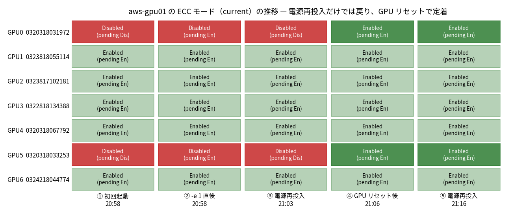

# aws-gpu01 の P100 2 枚の ECC を有効化する — 再起動では戻り、GPU リセットで定着

- **実施日時**: 2026年9月24日 20:53 〜 21:17 JST（電源投入 3 回、ECC 有効化、GPU リセット、永続性の確認、電源断）
- **報告日時**: 2026年9月24日 21:20 JST
- **作成者**: Claude Opus 5.5 (1M context)

## 概要

aws-gpu01 に載っている 7 枚の Tesla P100 のうち 2 枚だけが ECC 無効になっている。これはサーバ登録時（2026-08-16）から記録されていた。設定を揃えるには再起動が要るが、このサーバは起動時のファン騒音のために電源操作を制限しており、ずっと保留になっていた。今回、ユーザから電源操作と sudo の許可を得たので、有効化に取り組んだ。

まず電源を入れて現状を確かめると、記録どおり同じ 2 枚が無効だった。この 2 枚に有効化のコマンドを実行すると成功し、「次回起動から有効」という保留状態になった。ところが正常にシャットダウンして電源を入れ直すと、2 枚は保留分も含めて無効に戻っていた。再起動だけでは設定が反映されなかった。

そこで、再起動せずに GPU 単体をリセットして、保留中の設定を反映させる方法を試した。最初は GPU が使用中だとしてリセットを拒まれた。原因は、画面出力を持たないこのサーバでも、NVIDIA の画面系ドライバが GPU を掴んでいたことだった。そのドライバを一時的に外すとリセットが通り、2 枚とも有効になった。外したドライバと常駐デーモンは、作業後に元へ戻している。

最後に、この設定が電源断を越えて残るかを確かめるため、もう一度電源を入れ直した。今度は 7 枚すべてが有効のままで、設定は定着した。訂正不能エラーの累計は全 7 枚とも 0 である。作業後は電源を切ってある。

3 回の起動を通じて、起動中のファンはいずれも 2,900rpm 台に収まった。騒音対策は想定どおり働いている。

1 回目の再起動で設定が失われた理由はわかっていない。ただ、一度 GPU リセットで反映させた後は電源を入れ直しても保たれることを確認したので、今後の手順としてはこれで足りる。手順はサーバの運用文書に追記した。

## 添付ファイル

- [実装プラン](attachment/2026-09-24_211644_aws_gpu01_ecc_enable/plan.md)
- [初回起動時の状態](attachment/2026-09-24_211644_aws_gpu01_ecc_enable/before.txt)
- [`nvidia-smi -e 1` の出力](attachment/2026-09-24_211644_aws_gpu01_ecc_enable/enable.txt)
- [電源再投入後（Disabled に戻った）](attachment/2026-09-24_211644_aws_gpu01_ecc_enable/after.txt) / [同 `nvidia-smi -q -d ECC` 全文](attachment/2026-09-24_211644_aws_gpu01_ecc_enable/after_ecc_full.txt)
- [GPU0 のリセット試行（拒否 2 回 → 成功）](attachment/2026-09-24_211644_aws_gpu01_ecc_enable/reset_gpu0.txt) / [GPU5 のリセット](attachment/2026-09-24_211644_aws_gpu01_ecc_enable/reset_gpu5.txt)
- [ドライバとデーモンを戻した後の状態（`-q -d ECC` 全文を含む）](attachment/2026-09-24_211644_aws_gpu01_ecc_enable/restored.txt)
- [2 回目の電源再投入後（定着を確認）](attachment/2026-09-24_211644_aws_gpu01_ecc_enable/after_cycle2.txt)
- [3 回目の起動時の boot-quiet ファン記録](attachment/2026-09-24_211644_aws_gpu01_ecc_enable/boot-quiet-aws-gpu01.csv)

## 核心発見サマリ

**結論**: GPU0（serial `0320318031972`, `05:00.0`）と GPU5（`0320318033253`, `0E:00.0`）は、`sudo nvidia-smi -i <idx> -e 1` に rc=0 と `Reboot required.` を返し、pending=Enabled になった。**ところが ACPI シャットダウン（journal 上は正常終了）→ 電源投入のあとは、current と pending の両方が Disabled に戻った**。その後 `nvidia-smi -r`（GPU リセット）で反映させる方法に切り替えた。**`nvidia-persistenced` を止めても `is currently in use by another process` で拒否された**が、**`nvidia_drm` / `nvidia_modeset` を `modprobe -r` で外すとリセットが通り**、current=Enabled になった。そのうえで **soft → on の電源再投入後も 7 枚すべて current/pending=Enabled を保った**。`ecc.errors.uncorrected.aggregate.total` は全 7 枚とも 0、`memory.total` は ECC の有無にかかわらず 16384 MiB で変わらない（HBM2 のため容量は減らない）。

## 前提・目的

- **背景**: 2026-08-16 の登録時点で GPU0 と GPU5 だけが ECC Disabled だった。揃えるには再起動が必要だが、爆音ガードのために保留されていた
- **目的**: 7 枚すべてを ECC Enabled に揃える
- **ユーザの許可（本セッション）**: `ALLOW_FAN_NOISE=1` での電源投入・soft 電源断と、aws-gpu01 での sudo の実行（今回限り。CLAUDE.md の恒久的な例外にはしない）。GPU リセット案と、永続性確認のための追加の電源再投入も、途中で個別に許可を得た
- aws-gpu02 は DIMM 故障で Off のまま、一切触れていない

## 環境情報

| 項目 | 値 |
|---|---|
| サーバ | aws-gpu01（Supermicro SYS-4028GR-TRT2、ホスト名 `chungpu`） |
| GPU | Tesla P100-PCIE 16GB × 7、InfoROM `H400.0201.00.08` / ECC Object 4.1（7 枚共通） |
| ドライバ | 535.288.01（CUDA 12.2 表示） |
| 常駐 | `nvidia-persistenced --no-persistence-mode`（Persistence Mode は Disabled）、`smc-fanctl`（BMC の温度センサを使い、GPU には触れない） |
| ロードされていたモジュール | `nvidia` / `nvidia_uvm` / `nvidia_peermem` / `nvidia_modeset` / `nvidia_drm`（画面出力は BMC の `astdrmfb`） |

## 結果詳細

| 時刻 | 操作 | GPU0 / GPU5 の current, pending |
|---|---|---|
| 20:53:32 | `bmc-power.sh on`（SSH 復帰 20:58:14、boot-quiet の引き渡しは 278 s） | Disabled, Disabled |
| 20:58 | `sudo nvidia-smi -i 0 -e 1` / `-i 5 -e 1`（rc=0） | Disabled, **Enabled** |
| 20:58:50 | `bmc-power.sh soft`（journal で正常終了を確認）→ 20:59:10 `on`（SSH 復帰 21:03:40） | **Disabled, Disabled**（元に戻った） |
| 21:05 | GPU0: `-e 1` → `-r` は in use で拒否 → `systemctl stop nvidia-persistenced` 後も拒否 → `modprobe -r nvidia_drm nvidia_modeset` 後に **reset 成功** | GPU0: **Enabled, Enabled** |
| 21:06 | GPU5: `-e 1` → `-r` 成功 | GPU5: **Enabled, Enabled** |
| 21:06 | `modprobe nvidia_drm`、`systemctl start nvidia-persistenced` で元に戻す | 変化なし |
| 21:11:15 | `soft` → 21:11:25 `on`（SSH 復帰 21:16:12） | **Enabled, Enabled**（定着） |
| 21:16:33 | `soft` で電源断 | — |

- 1 回目の再起動で設定が戻った原因は特定できていない。起動時に `nvidia-smi` を呼ぶスクリプトは `/etc/systemd`・`/lib/systemd/system`・cron・udev・rc.local のどこにも無く、InfoROM も 7 枚で同一だった。system journal は sudo なしでは読めず、sudo の許可範囲外なので見ていない
- リセットを阻んでいたのが `nvidia_drm` と `nvidia_modeset` のどちらなのかは切り分けていない（両方を同時に外した）

## 副次発見

- **ロックファイル（サーバ上の `/tmp/gpu-server-locks/`）は起動のたびに消える**。どの再起動の後も `lock.sh` で取り直せた。一方、soft 電源断の後は SSH が通らないため `unlock.sh` は exit 3 で失敗する。電源を切って終える作業では unlock を電源断より前に行うか、失敗を無視してよい
- 起動中のファン（boot-quiet）は 3 回とも FAN1-8 が 2,800〜3,000rpm で、`smc-fanctl` への引き渡しは 272〜278 s だった（2026-08-18 実測の 68〜73 s より遅いが、SSH 復帰自体も約 280 s かかっている）

## 残課題

- 1 回目の再起動で pending が戻った原因（system journal の確認が要る）
- aws-gpu02 の 6 枚は登録時点で全 Enabled（本作業では未確認。起動できない状態のため）

## 参照レポート

- [aws-gpu01 / aws-gpu02 の登録](./2026-08-16_151340_aws_gpu_server_onboarding.md)（ECC の不揃いを最初に記録）
- [aws-gpu のファン騒音低減](./2026-08-17_234403_aws_gpu_fan_noise_reduction.md)（ECC 統一が保留されていた経緯と boot-quiet）
